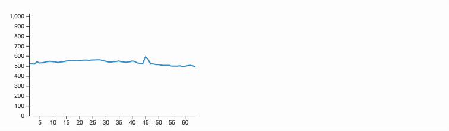
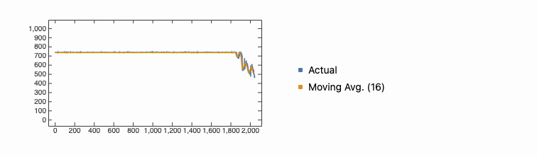

{/* add this script to the body  */}
{/* https://cdn.jsdelivr.net/gh/WLJSTeam/web-components@latest/src/common/app.js */}
<wljs-store json="./attachments/3fa3d3e1-9c96-4478-a49c-176175ae877b.txt"></wljs-store>

In this example, we build a robust workflow for acquiring ADC samples via UART/USB and processing them in the Wolfram Language. Instead of relying on naïve streaming (which is prone to corruption), we design a lightweight framing protocol that improves integrity of data packets. Once in Wolfram Language, the values can be visualized, filtered, or transformed in real time—turning an entry-level Arduino into a toy-like oscilloscope or spectrum analyzer.

## Notes on Serial Connection

<wljs-html encoded="true">{`%3Cdiv%20class%3D%22text-center%20w-full%22%3E%3Csvg%20version%3D%221.1%22%20xmlns%3D%22http%3A%2F%2Fwww.w3.org%2F2000%2Fsvg%22%20viewBox%3D%220%200%20961.51953125%20254.34375%22%3E%0A%20%20%3C%21--%20svg-source%3Aexcalidraw%20--%3E%0A%20%20%0A%20%20%3Cdefs%3E%0A%20%20%20%20%3Cstyle%20class%3D%22style-fonts%22%3E%0A%20%20%20%20%20%20%40font-face%20%7B%0A%20%20%20%20%20%20%20%20font-family%3A%20%22Virgil%22%3B%0A%20%20%20%20%20%20%20%20src%3A%20url%28%22https%3A%2F%2Funpkg.com%2F%40excalidraw%2Fexcalidraw%40undefined%2Fdist%2Fexcalidraw-assets%2FVirgil.woff2%22%29%3B%0A%20%20%20%20%20%20%7D%0A%20%20%20%20%20%20%40font-face%20%7B%0A%20%20%20%20%20%20%20%20font-family%3A%20%22Cascadia%22%3B%0A%20%20%20%20%20%20%20%20src%3A%20url%28%22https%3A%2F%2Funpkg.com%2F%40excalidraw%2Fexcalidraw%40undefined%2Fdist%2Fexcalidraw-assets%2FCascadia.woff2%22%29%3B%0A%20%20%20%20%20%20%7D%0A%20%20%20%20%20%20%40font-face%20%7B%0A%20%20%20%20%20%20%20%20font-family%3A%20%22Assistant%22%3B%0A%20%20%20%20%20%20%20%20src%3A%20url%28%22https%3A%2F%2Funpkg.com%2F%40excalidraw%2Fexcalidraw%40undefined%2Fdist%2Fexcalidraw-assets%2FAssistant-Regular.woff2%22%29%3B%0A%20%20%20%20%20%20%7D%0A%20%20%20%20%3C%2Fstyle%3E%0A%20%20%20%20%0A%20%20%3C%2Fdefs%3E%0A%20%20%3Cg%20stroke-linecap%3D%22round%22%20transform%3D%22translate%28192.8984375%2057.9219970703125%29%20rotate%280%2095.041015625%2075.49609375%29%22%3E%3Cpath%20d%3D%22M0%200%20C0%200%2C%200%200%2C%200%200%20M0%200%20C0%200%2C%200%200%2C%200%200%20M0.13%2012.04%20C1.74%209.24%2C%206.3%203.82%2C%2010.63%20-0.03%20M0.13%2012.04%20C3.83%208.31%2C%208.03%204.22%2C%2010.63%20-0.03%20M0.27%2024.08%20C6.66%2019.41%2C%2011.91%2011.13%2C%2021.26%20-0.07%20M0.27%2024.08%20C7%2015.2%2C%2014.28%208.26%2C%2021.26%20-0.07%20M-0.26%2036.88%20C10.57%2024.34%2C%2020.4%2011.82%2C%2031.89%20-0.1%20M-0.26%2036.88%20C6.86%2027.87%2C%2013.03%2020.43%2C%2031.89%20-0.1%20M-0.12%2048.92%20C18.26%2030.94%2C%2032.37%2012.7%2C%2042.52%20-0.14%20M-0.12%2048.92%20C15.25%2029.72%2C%2031.89%2010.64%2C%2042.52%20-0.14%20M0.01%2060.96%20C20.53%2038.91%2C%2043.22%2012.86%2C%2053.15%20-0.17%20M0.01%2060.96%20C14.3%2043.73%2C%2029.7%2028.62%2C%2053.15%20-0.17%20M0.14%2073%20C15.06%2055.82%2C%2031.18%2039.87%2C%2063.78%20-0.21%20M0.14%2073%20C21.32%2049.56%2C%2041.43%2025.79%2C%2063.78%20-0.21%20M0.28%2085.04%20C14.73%2067.42%2C%2031.53%2046.1%2C%2074.41%20-0.24%20M0.28%2085.04%20C16.87%2064.27%2C%2034.56%2044.96%2C%2074.41%20-0.24%20M-0.25%2097.84%20C27.98%2066.85%2C%2052.59%2035.94%2C%2085.04%20-0.28%20M-0.25%2097.84%20C20.94%2072.49%2C%2043.31%2046.28%2C%2085.04%20-0.28%20M-0.11%20109.88%20C34.1%2068.48%2C%2068.54%2026.38%2C%2095.67%20-0.31%20M-0.11%20109.88%20C21.61%2084.36%2C%2041.79%2060.24%2C%2095.67%20-0.31%20M0.02%20121.92%20C39.52%2078.01%2C%2081.9%2030.39%2C%20106.3%20-0.34%20M0.02%20121.92%20C37.23%2076.16%2C%2075.04%2033.08%2C%20106.3%20-0.34%20M0.15%20133.96%20C35.94%2088.31%2C%2074.16%2047.22%2C%20116.27%200.38%20M0.15%20133.96%20C46.76%2082.02%2C%2091.9%2029.39%2C%20116.27%200.38%20M0.29%20146%20C35.29%20102.9%2C%2070.05%2061.94%2C%20126.91%200.34%20M0.29%20146%20C46.37%2091.62%2C%2093.62%2037.48%2C%20126.91%200.34%20M6.32%20151.25%20C55.47%2095.05%2C%20102.17%2042.35%2C%20137.54%200.31%20M6.32%20151.25%20C48.25%20102.67%2C%2090.1%2053.77%2C%20137.54%200.31%20M16.3%20151.97%20C56.08%20106.67%2C%2097.02%2060.61%2C%20148.17%200.27%20M16.3%20151.97%20C55.94%20107.99%2C%2095.08%2063.66%2C%20148.17%200.27%20M26.93%20151.93%20C71.73%2097.83%2C%20119.99%2047.45%2C%20158.8%200.24%20M26.93%20151.93%20C54.85%20118.59%2C%2081.38%2086.79%2C%20158.8%200.24%20M37.56%20151.9%20C74.27%20111.04%2C%20109.73%2068.41%2C%20169.43%200.2%20M37.56%20151.9%20C82.23%20101.18%2C%20126.85%2049.82%2C%20169.43%200.2%20M48.19%20151.86%20C87.58%20107.44%2C%20125.63%2062.36%2C%20180.06%200.17%20M48.19%20151.86%20C86.45%20106.84%2C%20125.94%2061.7%2C%20180.06%200.17%20M58.82%20151.83%20C86.02%20117.47%2C%20116.61%2081.3%2C%20190.69%200.13%20M58.82%20151.83%20C105.38%2098.31%2C%20151.04%2045.76%2C%20190.69%200.13%20M69.45%20151.8%20C98.81%20119.66%2C%20125.55%2090.55%2C%20190.82%2012.17%20M69.45%20151.8%20C97.1%20120.61%2C%20125.76%2089.3%2C%20190.82%2012.17%20M80.08%20151.76%20C117.01%20109.25%2C%20155.66%2067.86%2C%20190.3%2024.97%20M80.08%20151.76%20C122.78%20101.77%2C%20166.41%2052.53%2C%20190.3%2024.97%20M90.71%20151.73%20C120.15%20117.81%2C%20149.97%2085.61%2C%20190.43%2037.01%20M90.71%20151.73%20C118.23%20120.14%2C%20145.97%2086.67%2C%20190.43%2037.01%20M101.34%20151.69%20C133.97%20111.68%2C%20169.84%2073.13%2C%20190.56%2049.05%20M101.34%20151.69%20C132.88%20115.31%2C%20162.45%2079.46%2C%20190.56%2049.05%20M111.97%20151.66%20C132.56%20127.89%2C%20152.01%20105.06%2C%20190.7%2061.09%20M111.97%20151.66%20C139.88%20120.26%2C%20167.77%2087.34%2C%20190.7%2061.09%20M122.6%20151.62%20C141.35%20128.15%2C%20161.56%20106.4%2C%20190.17%2073.89%20M122.6%20151.62%20C145.65%20123.83%2C%20170.6%2096.13%2C%20190.17%2073.89%20M133.23%20151.59%20C149.72%20136.55%2C%20164.4%20118.52%2C%20190.31%2085.93%20M133.23%20151.59%20C156.03%20125.29%2C%20178.01%2099.67%2C%20190.31%2085.93%20M143.86%20151.55%20C161.11%20133.13%2C%20178.05%20109.31%2C%20190.44%2097.97%20M143.86%20151.55%20C159.5%20134.61%2C%20175.66%20116.12%2C%20190.44%2097.97%20M154.49%20151.52%20C168.47%20136.85%2C%20183.96%20118.74%2C%20190.57%20110.01%20M154.49%20151.52%20C166.85%20137.92%2C%20177.65%20123.35%2C%20190.57%20110.01%20M165.12%20151.49%20C173.77%20141.7%2C%20181.87%20129.89%2C%20190.7%20122.05%20M165.12%20151.49%20C172.89%20144.26%2C%20179.44%20136.7%2C%20190.7%20122.05%20M175.75%20151.45%20C179.29%20147.87%2C%20185.37%20138.64%2C%20190.18%20134.85%20M175.75%20151.45%20C181.76%20146.15%2C%20187.13%20140.13%2C%20190.18%20134.85%20M186.38%20151.42%20C187.22%20150.26%2C%20187.76%20149.24%2C%20190.32%20146.89%20M186.38%20151.42%20C187.49%20149.81%2C%20188.79%20148.54%2C%20190.32%20146.89%22%20stroke%3D%22%23a5d8ff%22%20stroke-width%3D%221%22%20fill%3D%22none%22%3E%3C%2Fpath%3E%3Cpath%20d%3D%22M0%200%20C44.4%20-1.83%2C%2090.06%201.57%2C%20190.08%200%20M0%200%20C60.34%20-0.04%2C%20123.32%200.68%2C%20190.08%200%20M190.08%200%20C192.09%2052.93%2C%20190.7%20104.31%2C%20190.08%20150.99%20M190.08%200%20C189.39%2051.93%2C%20191.25%20102.39%2C%20190.08%20150.99%20M190.08%20150.99%20C136.38%20149.74%2C%2082.81%20150.43%2C%200%20150.99%20M190.08%20150.99%20C120.98%20151.69%2C%2052.33%20153.11%2C%200%20150.99%20M0%20150.99%20C-0.56%20117.86%2C%200.89%2085.5%2C%200%200%20M0%20150.99%20C-1.4%20117.15%2C%20-2.06%2082.25%2C%200%200%22%20stroke%3D%22%231971c2%22%20stroke-width%3D%222%22%20fill%3D%22none%22%3E%3C%2Fpath%3E%3C%2Fg%3E%3Cg%20stroke-linecap%3D%22round%22%20transform%3D%22translate%28191.96484375%2086.9471435546875%29%20rotate%280%2034.685546875%2017.5%29%22%3E%3Cpath%20d%3D%22M1.82%20-0.54%20L67.38%200.19%20L68.55%2034.66%20L1.27%2035.06%22%20stroke%3D%22none%22%20stroke-width%3D%220%22%20fill%3D%22%23ffffff%22%3E%3C%2Fpath%3E%3Cpath%20d%3D%22M0%200%20C24.06%20-1.88%2C%2047.81%200.6%2C%2069.37%200%20M0%200%20C27.3%20-1.44%2C%2053.67%20-0.56%2C%2069.37%200%20M69.37%200%20C70.41%209.91%2C%2069.79%2017.5%2C%2069.37%2035%20M69.37%200%20C69.95%2011.25%2C%2068.77%2021.09%2C%2069.37%2035%20M69.37%2035%20C54.47%2034.66%2C%2038.76%2034.66%2C%200%2035%20M69.37%2035%20C49.05%2035.09%2C%2029.15%2035.87%2C%200%2035%20M0%2035%20C-2.14%2025.07%2C%200.68%2011.06%2C%200%200%20M0%2035%20C-0.46%2026.01%2C%201.12%2015.87%2C%200%200%22%20stroke%3D%22%231971c2%22%20stroke-width%3D%222%22%20fill%3D%22none%22%3E%3C%2Fpath%3E%3C%2Fg%3E%3Cg%20transform%3D%22translate%28205.85040283203125%2091.9471435546875%29%20rotate%280%2020.79998779296875%2012.5%29%22%3E%3Ctext%20x%3D%2220.79998779296875%22%20y%3D%220%22%20font-family%3D%22Virgil%2C%20Segoe%20UI%20Emoji%22%20font-size%3D%2220px%22%20fill%3D%22%231971c2%22%20text-anchor%3D%22middle%22%20style%3D%22white-space%3A%20pre%3B%22%20direction%3D%22ltr%22%20dominant-baseline%3D%22text-before-edge%22%3EADC%3C%2Ftext%3E%3C%2Fg%3E%3Cg%20transform%3D%22translate%28254.33984375%20179.0018310546875%29%20rotate%280%2034.629966735839844%2012.5%29%22%3E%3Ctext%20x%3D%220%22%20y%3D%220%22%20font-family%3D%22Virgil%2C%20Segoe%20UI%20Emoji%22%20font-size%3D%2220px%22%20fill%3D%22%231e1e1e%22%20text-anchor%3D%22start%22%20style%3D%22white-space%3A%20pre%3B%22%20direction%3D%22ltr%22%20dominant-baseline%3D%22text-before-edge%22%3EArduino%3C%2Ftext%3E%3C%2Fg%3E%3Cg%20stroke-linecap%3D%22round%22%20transform%3D%22translate%28599.939453125%2056.9901123046875%29%20rotate%280%2095.041015625%2075.49609375%29%22%3E%3Cpath%20d%3D%22M0%200%20C51.45%20-2.75%2C%20104.8%20-2.54%2C%20190.08%200%20M0%200%20C65.39%20-0.4%2C%20131.7%20-0.67%2C%20190.08%200%20M190.08%200%20C187.22%2041.66%2C%20188.71%2083.4%2C%20190.08%20150.99%20M190.08%200%20C189.93%2035.46%2C%20189.18%2071.18%2C%20190.08%20150.99%20M190.08%20150.99%20C127.81%20152.52%2C%2069.71%20151.77%2C%200%20150.99%20M190.08%20150.99%20C127.17%20152.64%2C%2063%20152.65%2C%200%20150.99%20M0%20150.99%20C-1.26%20107.18%2C%200.76%2062.7%2C%200%200%20M0%20150.99%20C-0.46%2095.35%2C%201.13%2039.36%2C%200%200%22%20stroke%3D%22%232f9e44%22%20stroke-width%3D%222%22%20fill%3D%22none%22%3E%3C%2Fpath%3E%3C%2Fg%3E%3Cg%20stroke-linecap%3D%22round%22%20transform%3D%22translate%28645.04296875%2067.0174560546875%29%20rotate%280%2049.212890625%2030%29%22%3E%3Cpath%20d%3D%22M0%200%20C30.02%20-0.48%2C%2063.43%201.41%2C%2098.43%200%20M0%200%20C36.41%201.49%2C%2072.65%20-0.13%2C%2098.43%200%20M98.43%200%20C96.58%2011.15%2C%2097.74%2022.21%2C%2098.43%2060%20M98.43%200%20C99.38%2015.83%2C%2098.99%2032.71%2C%2098.43%2060%20M98.43%2060%20C74.97%2057.66%2C%2051.58%2058.1%2C%200%2060%20M98.43%2060%20C75.25%2059.07%2C%2053.05%2059.79%2C%200%2060%20M0%2060%20C-2.19%2040.68%2C%201.71%2025.44%2C%200%200%20M0%2060%20C-0.2%2040%2C%20-0.85%2018.3%2C%200%200%22%20stroke%3D%22%232f9e44%22%20stroke-width%3D%222%22%20fill%3D%22none%22%3E%3C%2Fpath%3E%3C%2Fg%3E%3Cg%20transform%3D%22translate%28650.1259078979492%2072.0174560546875%29%20rotate%280%2044.12995147705078%2025%29%22%3E%3Ctext%20x%3D%2244.12995147705078%22%20y%3D%220%22%20font-family%3D%22Virgil%2C%20Segoe%20UI%20Emoji%22%20font-size%3D%2220px%22%20fill%3D%22%232f9e44%22%20text-anchor%3D%22middle%22%20style%3D%22white-space%3A%20pre%3B%22%20direction%3D%22ltr%22%20dominant-baseline%3D%22text-before-edge%22%3EWLJS%3C%2Ftext%3E%3Ctext%20x%3D%2244.12995147705078%22%20y%3D%2225%22%20font-family%3D%22Virgil%2C%20Segoe%20UI%20Emoji%22%20font-size%3D%2220px%22%20fill%3D%22%232f9e44%22%20text-anchor%3D%22middle%22%20style%3D%22white-space%3A%20pre%3B%22%20direction%3D%22ltr%22%20dominant-baseline%3D%22text-before-edge%22%3ENotebook%3C%2Ftext%3E%3C%2Fg%3E%3Cg%20stroke-linecap%3D%22round%22%3E%3Cg%20transform%3D%22translate%28393.93359375%20146.33632720249665%29%20rotate%280%2097.78125%20-0.6454601413627472%29%22%3E%3Cpath%20d%3D%22M0%200%20C56.97%20-1.03%2C%20111.31%20-2.57%2C%20195.56%20-1.29%20M0%200%20C57.83%20-1.21%2C%20115.9%20-1.04%2C%20195.56%20-1.29%22%20stroke%3D%22%23e03131%22%20stroke-width%3D%222%22%20fill%3D%22none%22%3E%3C%2Fpath%3E%3C%2Fg%3E%3Cg%20transform%3D%22translate%28393.93359375%20146.33632720249665%29%20rotate%280%2097.78125%20-0.6454601413627472%29%22%3E%3Cpath%20d%3D%22M196.68%20-1.92%20L182.84%203.79%20L182.32%20-6.31%20L197.54%20-0.36%22%20stroke%3D%22none%22%20stroke-width%3D%220%22%20fill%3D%22%23e03131%22%20fill-rule%3D%22evenodd%22%3E%3C%2Fpath%3E%3Cpath%20d%3D%22M195.56%20-1.29%20C192.28%200.65%2C%20187.01%201.6%2C%20181.98%205.08%20M195.56%20-1.29%20C191.77%20-0.05%2C%20188.21%202.23%2C%20181.98%205.08%20M181.98%205.08%20C183.06%20-0.53%2C%20181.15%20-4.92%2C%20181.95%20-7.6%20M181.98%205.08%20C181.69%201.16%2C%20181.48%20-3.16%2C%20181.95%20-7.6%20M181.95%20-7.6%20C185.18%20-6.8%2C%20189.74%20-2.54%2C%20195.56%20-1.29%20M181.95%20-7.6%20C186.65%20-5.4%2C%20190.09%20-3.94%2C%20195.56%20-1.29%20M195.56%20-1.29%20C195.56%20-1.29%2C%20195.56%20-1.29%2C%20195.56%20-1.29%20M195.56%20-1.29%20C195.56%20-1.29%2C%20195.56%20-1.29%2C%20195.56%20-1.29%22%20stroke%3D%22%23e03131%22%20stroke-width%3D%222%22%20fill%3D%22none%22%3E%3C%2Fpath%3E%3C%2Fg%3E%3C%2Fg%3E%3Cmask%3E%3C%2Fmask%3E%3Cg%20stroke-linecap%3D%22round%22%3E%3Cg%20transform%3D%22translate%28575.646484375%20127.1641871802785%29%20rotate%280%20-86.67283080320902%200.7772484878365873%29%22%3E%3Cpath%20d%3D%22M0%200%20C-48.03%201.13%2C%20-99.12%200.72%2C%20-173.35%201.55%20M0%200%20C-36%20-1.1%2C%20-74.57%200.77%2C%20-173.35%201.55%22%20stroke%3D%22%23e03131%22%20stroke-width%3D%222%22%20fill%3D%22none%22%3E%3C%2Fpath%3E%3C%2Fg%3E%3Cg%20transform%3D%22translate%28575.646484375%20127.1641871802785%29%20rotate%280%20-86.67283080320902%200.7772484878365873%29%22%3E%3Cpath%20d%3D%22M-173.72%203.01%20L-159.27%20-4.44%20L-157.83%205.75%20L-171.47%202.26%22%20stroke%3D%22none%22%20stroke-width%3D%220%22%20fill%3D%22%23e03131%22%20fill-rule%3D%22evenodd%22%3E%3C%2Fpath%3E%3Cpath%20d%3D%22M-173.35%201.55%20C-168.68%200.93%2C%20-166.36%20-1.55%2C%20-159.83%20-4.95%20M-173.35%201.55%20C-169.85%20-0.34%2C%20-168.3%20-0.56%2C%20-159.83%20-4.95%20M-159.83%20-4.95%20C-159.78%20-1.5%2C%20-159.62%201.85%2C%20-159.68%207.73%20M-159.83%20-4.95%20C-159.3%20-1.77%2C%20-159.65%202.98%2C%20-159.68%207.73%20M-159.68%207.73%20C-165.82%205.49%2C%20-171.28%203.61%2C%20-173.35%201.55%20M-159.68%207.73%20C-163.69%204.99%2C%20-169.24%203.07%2C%20-173.35%201.55%20M-173.35%201.55%20C-173.35%201.55%2C%20-173.35%201.55%2C%20-173.35%201.55%20M-173.35%201.55%20C-173.35%201.55%2C%20-173.35%201.55%2C%20-173.35%201.55%22%20stroke%3D%22%23e03131%22%20stroke-width%3D%222%22%20fill%3D%22none%22%3E%3C%2Fpath%3E%3C%2Fg%3E%3C%2Fg%3E%3Cmask%3E%3C%2Fmask%3E%3Cg%20transform%3D%22translate%28684.6640625%20175.5557861328125%29%20rotate%280%2013.04998779296875%2012.5%29%22%3E%3Ctext%20x%3D%220%22%20y%3D%220%22%20font-family%3D%22Virgil%2C%20Segoe%20UI%20Emoji%22%20font-size%3D%2220px%22%20fill%3D%22%231e1e1e%22%20text-anchor%3D%22start%22%20style%3D%22white-space%3A%20pre%3B%22%20direction%3D%22ltr%22%20dominant-baseline%3D%22text-before-edge%22%3EPC%3C%2Ftext%3E%3C%2Fg%3E%3Cg%20transform%3D%22translate%28450.9286422729492%2077.2510986328125%29%20rotate%280%2036.82398223876953%2020%29%22%3E%3Ctext%20x%3D%2236.82398223876953%22%20y%3D%220%22%20font-family%3D%22Virgil%2C%20Segoe%20UI%20Emoji%22%20font-size%3D%2216px%22%20fill%3D%22%231e1e1e%22%20text-anchor%3D%22middle%22%20style%3D%22white-space%3A%20pre%3B%22%20direction%3D%22ltr%22%20dominant-baseline%3D%22text-before-edge%22%3EUART%3C%2Ftext%3E%3Ctext%20x%3D%2236.82398223876953%22%20y%3D%2220%22%20font-family%3D%22Virgil%2C%20Segoe%20UI%20Emoji%22%20font-size%3D%2216px%22%20fill%3D%22%231e1e1e%22%20text-anchor%3D%22middle%22%20style%3D%22white-space%3A%20pre%3B%22%20direction%3D%22ltr%22%20dominant-baseline%3D%22text-before-edge%22%3Eover%20USB%3C%2Ftext%3E%3C%2Fg%3E%3Cg%20stroke-linecap%3D%22round%22%3E%3Cg%20transform%3D%22translate%28191.82421875%20105.5440673828125%29%20rotate%280%20-29.091796875%20-0.123046875%29%22%3E%3Cpath%20d%3D%22M0%200%20C-18.81%201.87%2C%20-35.9%200.4%2C%20-58.18%20-0.25%20M0%200%20C-19.22%20-0.42%2C%20-38.93%20-0.16%2C%20-58.18%20-0.25%22%20stroke%3D%22%231971c2%22%20stroke-width%3D%222%22%20fill%3D%22none%22%3E%3C%2Fpath%3E%3C%2Fg%3E%3Cg%20transform%3D%22translate%28191.82421875%20105.5440673828125%29%20rotate%280%20-29.091796875%20-0.123046875%29%22%3E%3Cpath%20d%3D%22M-58.68%20-8.03%20C-57.23%20-8.1%2C%20-55.3%20-7.3%2C%20-54.01%20-6.38%20C-52.71%20-5.45%2C%20-51.67%20-3.97%2C%20-50.9%20-2.5%20C-50.14%20-1.03%2C%20-48.76%200.76%2C%20-49.4%202.44%20C-50.04%204.11%2C%20-52.81%206.79%2C%20-54.75%207.55%20C-56.68%208.3%2C%20-59.22%207.51%2C%20-61%206.95%20C-62.77%206.39%2C%20-64.37%205.38%2C%20-65.41%204.19%20C-66.45%203.01%2C%20-67.43%201.49%2C%20-67.23%20-0.16%20C-67.03%20-1.81%2C%20-65.85%20-4.4%2C%20-64.22%20-5.7%20C-62.58%20-6.99%2C%20-58.59%20-7.4%2C%20-57.42%20-7.93%20C-56.24%20-8.46%2C%20-56.92%20-8.88%2C%20-57.17%20-8.88%20M-63.2%20-6.94%20C-61.52%20-7.69%2C%20-57.69%20-8.47%2C%20-55.58%20-8.23%20C-53.47%20-7.98%2C%20-51.39%20-7.03%2C%20-50.54%20-5.46%20C-49.69%20-3.88%2C%20-50.08%20-0.44%2C%20-50.48%201.23%20C-50.88%202.9%2C%20-51.87%203.59%2C%20-52.94%204.55%20C-54.01%205.51%2C%20-55.05%206.46%2C%20-56.91%206.99%20C-58.77%207.52%2C%20-62.62%208.73%2C%20-64.1%207.72%20C-65.58%206.71%2C%20-65.5%202.66%2C%20-65.8%200.94%20C-66.09%20-0.78%2C%20-66.62%20-0.97%2C%20-65.87%20-2.6%20C-65.12%20-4.24%2C%20-61.67%20-8.13%2C%20-61.3%20-8.86%20C-60.92%20-9.6%2C%20-63.39%20-7.5%2C%20-63.63%20-7.01%22%20stroke%3D%22none%22%20stroke-width%3D%220%22%20fill%3D%22%231971c2%22%3E%3C%2Fpath%3E%3C%2Fg%3E%3C%2Fg%3E%3Cmask%3E%3C%2Fmask%3E%3Cg%20stroke-linecap%3D%22round%22%20transform%3D%22translate%2810%2010%29%20rotate%280%20470.759765625%20117.171875%29%22%3E%3Cpath%20d%3D%22M0%200%20C338.58%200.45%2C%20677.08%200.58%2C%20941.52%200%20M0%200%20C355.98%202.91%2C%20711.59%202.82%2C%20941.52%200%20M941.52%200%20C940.07%2059.92%2C%20939.17%20121.59%2C%20941.52%20234.34%20M941.52%200%20C943.35%2059.96%2C%20942.52%20121%2C%20941.52%20234.34%20M941.52%20234.34%20C615.32%20234.46%2C%20288.34%20234.63%2C%200%20234.34%20M941.52%20234.34%20C662.83%20231.57%2C%20384.09%20231.25%2C%200%20234.34%20M0%20234.34%20C2.01%20148.61%2C%201.88%2062.05%2C%200%200%20M0%20234.34%20C-0.86%20148.71%2C%20-0.78%2064.56%2C%200%200%22%20stroke%3D%22transparent%22%20stroke-width%3D%222%22%20fill%3D%22none%22%3E%3C%2Fpath%3E%3C%2Fg%3E%3C%2Fsvg%3E%3C%2Fdiv%3E`}</wljs-html>

It is important to note that the default UART interface used on Arduino boards <mark>does not guarantee the delivery of data</mark> and has a certain error rate. This means that if you send structured data, it might easily be corrupted when you continuously stream it.

Just relying on

<wljs-html encoded="true">{`%3Cpre%20class%3D%22mt-2%22%3E%0Auint16_t%20v%20%3D%20analogRead%28A0%29%3B%0ASerial.write%28v%20%26%200xFF%29%3B%0ASerial.write%28%28v%20%3E%3E%208%29%20%26%200xFF%29%3B%3C%2Fpre%3E`}</wljs-html>

is a huge mistake ⚠️<wljs-html encoded="true">{`%3Cbr%20%2F%3E`}</wljs-html><wljs-html encoded="true">{`%3Cbr%20%2F%3E`}</wljs-html>

### Basic Frame Protocol

Here we draft a very simple protocol, which uses control bits to mark the start/end of a message and a payload:

<wljs-html encoded="true">{`%3Cp%20%3E%3C%2Fp%3E`}</wljs-html>

| Marker         | Description      |
|----------------|------------------|
| `11000000`     | Start marker     |
| `0100XXXX`     | Payload (4-bit)  |
| `........`     |                  |
| `00000000`     | End marker       |

Another consideration is to avoid endless streaming at all. The reading procedure from the host can be:

- Request 64/128/... values or ADC
- Wait for the reply frame and check for errors

<wljs-html encoded="true">{`%3Cbr%20%2F%3E`}</wljs-html>

## Set up the board

Here we use an Arduino Uno/Duemilanove/Nano-compatible board.

- Install the Arduino IDE.
- Load the following sketch.

<WLJSWrapper><wljs-editor display="codemirror" type="Input" editable="true"  >{`adc.ino
	
	int requestedSamples = -1;
	
	void setup() {
	  Serial.begin(115200);
	  while (!Serial) {}
	}
	
	void loop() {
	  if (requestedSamples == 0) {
	     requestedSamples = -1;
	     Serial.write((uint8_t)(0x0)); // Start
	     return;
	  }
	  
	  if (requestedSamples == -1 && Serial.available() >= 2) {
	    uint8_t c0 = Serial.read(), c1 = Serial.read();
	    requestedSamples = (int)c0 + (int)(c1 << 8);
	    while (Serial.available() > 0) (void)Serial.read(); // clean up garbage
	    Serial.write((uint8_t)(0xC0)); // End
	  }
	  
	  if (requestedSamples == -1) return;
	
	  uint16_t v = analogRead(A0);
	  
	  Serial.write((uint8_t)(((v >> 0) & 0xF)  | 0x40));
	  Serial.write((uint8_t)(((v >> 4) & 0xF)  | 0x40));
	  Serial.write((uint8_t)(((v >> 8) & 0xF)  | 0x40));
	  Serial.write((uint8_t)(((v >> 12) & 0xF) | 0x40));
	  
	  requestedSamples--;
	}`}</wljs-editor></WLJSWrapper>

## First contact
1. Connect the board
2. Find a path via Arduino IDE or device inspector, it is usually something like
    - __COM__ X *Windows*
    - __/dev/cu.usbserial__... *Unix*
4. Evaluate the cell below

<WLJSWrapper><wljs-editor display="codemirror" type="Input" editable="true"  >{`path = "/dev/cu.usbserial-140";
	
	Panel[{
	  Refresh[If[DeviceOpenQ[dev]//TrueQ, Green, Red], 1],
	  Button["Connect", Print["Connecting..."]; dev = DeviceOpen["Serial", {path, "BaudRate"->115200}]],
	  Button["Close", dev = DeviceClose[dev]]
	} // Row, Style["Control Center", 11, FontFamily->"system-ui"]]`}</wljs-editor></WLJSWrapper>

Now we need a little helper function to request and decode the frames of data:

<WLJSWrapper><wljs-editor display="codemirror" type="Input" editable="true" fade="true" >{`readDevice[dev_, packetSize_:64] := Module[{},
	  If[!(DeviceOpenQ[dev]//TrueQ), Return[$Failed, Module]];
	  
	  DeviceReadBuffer[dev];
	  DeviceWrite[dev, ExportByteArray[packetSize, "UnsignedInteger16"]//Normal];
	  With[{result = TimeConstrained[DeviceReadBuffer[dev, packetSize 4 + 2], 0.5, $Failed]},
	  
	    If[FailureQ[result],   Return[$Failed, Module]];
	    If[result[[1]] != 192, Return[$Failed, Module]];
	    If[result[[-1]] != 0,  Return[$Failed, Module]];
	
	    With[{payload = result[[2;;-2]]},
	      If[Sum[BitGet[b, 6], {b, payload}] != packetSize 4, Return[$Failed, Module]];
	    
	      Map[Function[p,
	        BitClear[p[[1]], 6] + BitShiftLeft[BitClear[p[[2]], 6], 4] + BitShiftLeft[BitClear[p[[3]],6], 8] + BitShiftLeft[BitClear[p[[4]],6], 12]
	      ], Partition[payload, 4]]
	    ]
	  ]
	]`}</wljs-editor></WLJSWrapper>

Let's read our first frame of data:

<Callout type="warning">
Do not use large frame buffers. For my setup anything bigger than `512` casues an overflow and complete data loss.
</Callout>

<WLJSWrapper><wljs-editor display="codemirror" type="Input" editable="true"  >{`readDevice[dev, 128] // ListLinePlot`}</wljs-editor></WLJSWrapper>

<WLJSWrapper><wljs-editor display="codemirror" type="Output"  >{`(*VB[*)(FrontEndRef["6377d64f-10b9-4bb8-8f96-fe24a9672540"])(*,*)(*"1:eJxTTMoPSmNkYGAoZgESHvk5KRCeEJBwK8rPK3HNS3GtSE0uLUlMykkNVgEKmxmbm6eYmaTpGhokWeqaJCVZ6FqkWZrppqUamSRampkbmZoYAAB90BUq"*)(*]VB*)`}</wljs-editor></WLJSWrapper>

What you see is my screen's refresh rate overlayed by a background electrical noise captured by a photodiode transimpedance amplifier built on *LM358P*.

<Callout>
The sampling rate may vary and for buffer sizes 512 is `~2800 samples/sec`
</Callout>

Here is a dynamic version:

<WLJSWrapper><wljs-editor display="codemirror" type="Input" editable="true"  >{`Refresh[ListLinePlot[With[{d = readDevice[dev, 64]}, If[!FailureQ[d],
	  d, Table[0, {64}]
	]], PlotRange->{{1,64}, {0,1025}}], 0.1]`}</wljs-editor></WLJSWrapper>

We defined plot range and return zeros in a case of a failure on purpose to benifit JIT features used in `Refresh` expression. This keeps the input data consistens and allows to update the graph smoothly.

## ArduinoScope
*A toy-like oscilloscope*

Nothing can stops us from performing a live Fourier transformation and accumulate longer times 🙂

We start from an automatic accumulating function, which runs in the background:

<WLJSWrapper><wljs-editor display="codemirror" type="Input" editable="true"  >{`buffer = Table[0, {2048}];
	accumulate[dev_] := With[{data = readDevice[dev, 128]},
	  If[!FailureQ[data],
	    buffer = RotateLeft[buffer, 128];
	    buffer[[2048 - 127 ;;]] = data;
	  ];
	];
	
	TaskRemove[task] // Quiet;
	task = SetInterval[
	  accumulate[dev];
	  EventFire["scopeUpdate", buffer];
	, Quantity[100, "Milliseconds"]];`}</wljs-editor></WLJSWrapper>

To stop the task:

<WLJSWrapper><wljs-editor display="codemirror" type="Input" editable="true"  >{`TaskRemove[task] // Quiet;`}</wljs-editor></WLJSWrapper>

This procedure also fires an event object *scopeUpdate* to which we can subscribe

### Graph widget
Let's design our first widget, that takes care of visualizing the data.

<WLJSWrapper><wljs-editor display="codemirror" type="Input" editable="true"  >{`With[{
	  event = EventClone["scopeUpdate"],
	  data = Unique[],
	  avg = Unique[]
	},
	  data = Table[{i,0}, {i,2048}];
	  avg = Table[{i,0}, {i,2048}];
	  
	  EventHandler[ResultCell[], {"Destroy" -> Function[Null,
	    EventRemove[event];
	  ]}];
	
	  EventHandler[event, Function[d,
	    data = MapIndexed[Function[{val, i}, {i[[1]], val}], d];
	    avg = MapIndexed[Function[{val, i}, {i[[1]], val}], MovingAverage[d, 16]];
	  ]];
	
	  Legended[Graphics[{
	    (*VB[*)(RGBColor[0.368417, 0.506779, 0.709798])(*,*)(*"1:eJxTTMoPSmNiYGAo5gUSYZmp5S6pyflFiSX5RcEsQBHn4PCQNGaQPAeQCHJ3cs7PyS8qKpg26anKlOv2RYbTXk7vMH9gX3S8ZYb3qm3P7AF5kRs6"*)(*]VB*), Line[data // Offload], 
	    (*VB[*)(RGBColor[0.880722, 0.611041, 0.142051])(*,*)(*"1:eJxTTMoPSmNiYGAo5gUSYZmp5S6pyflFiSX5RcEsQBHn4PCQNGaQPAeQCHJ3cs7PyS8q8jkS/fy+3hv7on/VH24t7X1sX7R51jr1XXqH7AGSkRxD"*)(*]VB*), Line[avg // Offload]
	  }, 
	    Frame->True, Axes->True,
	    PlotRange->{{1,2048}, {0,1024}}, AspectRatio->0.5
	  ], SwatchLegend[{(*VB[*)(RGBColor[0.368417, 0.506779, 0.709798])(*,*)(*"1:eJxTTMoPSmNiYGAo5gUSYZmp5S6pyflFiSX5RcEsQBHn4PCQNGaQPAeQCHJ3cs7PyS8qKpg26anKlOv2RYbTXk7vMH9gX3S8ZYb3qm3P7AF5kRs6"*)(*]VB*), (*VB[*)(RGBColor[0.880722, 0.611041, 0.142051])(*,*)(*"1:eJxTTMoPSmNiYGAo5gUSYZmp5S6pyflFiSX5RcEsQBHn4PCQNGaQPAeQCHJ3cs7PyS8q8jkS/fy+3hv7on/VH24t7X1sX7R51jr1XXqH7AGSkRxD"*)(*]VB*)}, {"Actual", "Moving Avg. (16)"}]]
	]`}</wljs-editor></WLJSWrapper>

We did not use `Module` here since WL`s automatic garbage collector can mistakenly purge the symbols.

### Fourier Transform
Here is another example with a live FFT window

<WLJSWrapper><wljs-editor display="codemirror" type="Input" editable="true"  >{`With[{
	  event = EventClone["scopeUpdate"],
	  data = Unique[]
	},
	  data = Table[{i,0}, {i,127}];
	  
	  EventHandler[ResultCell[], {"Destroy" -> Function[Null,
	    EventRemove[event];
	  ]}];
	
	  EventHandler[event, Function[d,
	    data = MapIndexed[Function[{val, i}, {i[[1]], val}], 
	      Take[Drop[Fourier[Take[d, -256]]//Abs,1], 127]
	      (* drop DC and the conjugated half *)
	    ];
	  ]];
	
	  Graphics[{
	    ColorData[97][3], Line[data // Offload]
	  }, 
	    Frame->True, Axes->True,
	    PlotRange->{{1,127}, {0,1024}}, AspectRatio->0.5
	  ]
	]`}</wljs-editor></WLJSWrapper>

One can project the output cells using the right-side menu to separate windows for the convenience.

