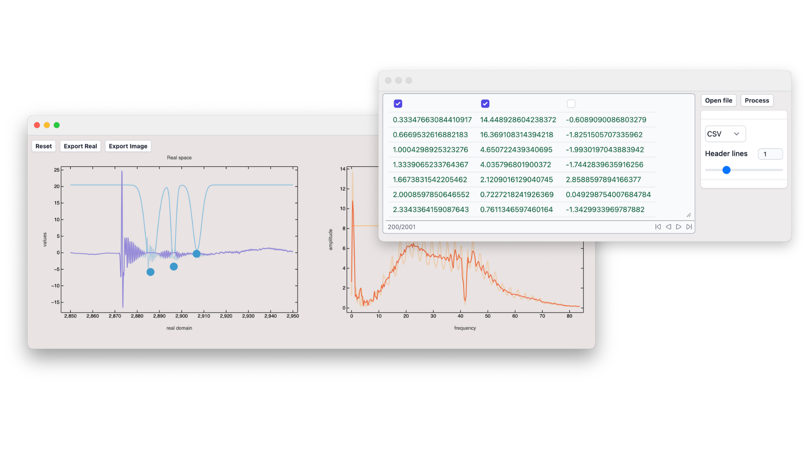
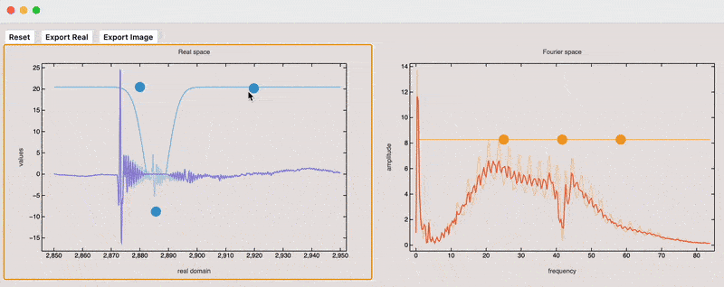
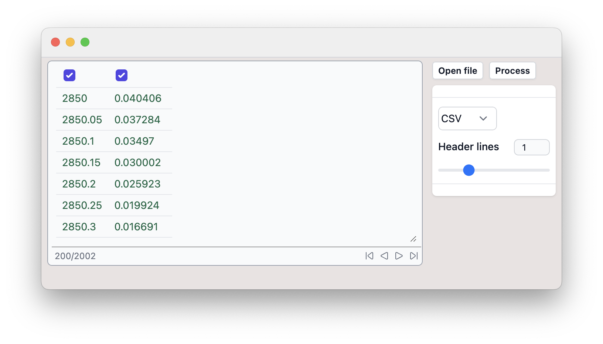
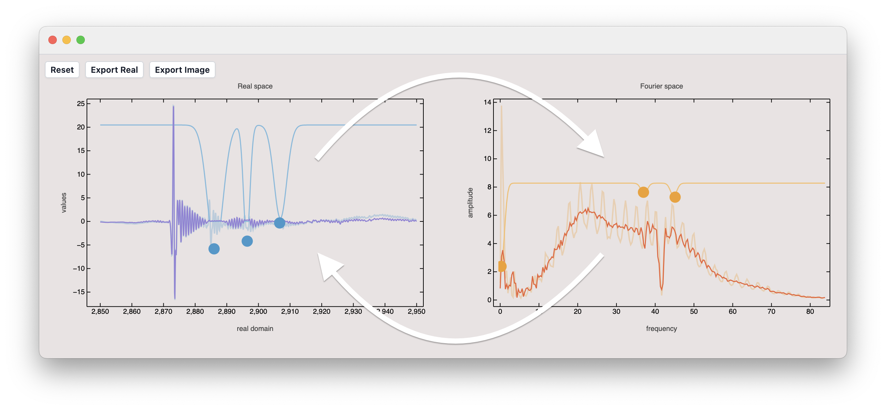

## Features
- Block or amplify bands in real or Fourier space
- See the changes immediately ✨
- Columns selection, importers for csv, tsv, dat, xls data
- Units agnostic
- Batch processing

<DownloadFile
    title="Download"
    description="Get the this mini-app"
    href="./bandstop.wlw"
/>

Here it is in action:

## Workflow

1. Import and select 2 columns (assumed to be XY)

2. Apply band-stoping

It is designed in the way that your data is filtered in real space first (left), then converted to Fourier space and filtered there (right), and after that converted back to real space with the same sampling used in the original data.

A user can export from both stages depending on the application.

