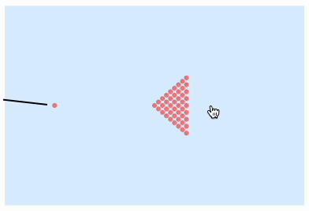

{/* add this script to the body  */}
{/* https://cdn.jsdelivr.net/gh/WLJSTeam/web-components@latest/src/common/app.js */}
<wljs-store kernel="./attachments/kernel-4622762877780889866.txt" json="./attachments/1b04ebbe-2220-44a8-bf11-f70cdd1285f1.txt"></wljs-store>

We shall start with the solver function. The algorithm is straightforward and does not require any special symbolic computations, therefore we write it in the procedural CPU-friendly style and compile it:

<WLJSWrapper><wljs-editor display="codemirror" type="Input" editable="true"  >{`ClearAll[balls, compiled, visible, frameTrigger, angle, reset];`}</wljs-editor></WLJSWrapper>

<WLJSWrapper><wljs-editor display="codemirror" type="Input" editable="true" fade="true" >{`compiled = Compile[{
	  {p, _Real, 3}
	}, Module[{b = p},
	    Do[
	
	     (* Verlet Integration *)
	     b[[3]] = b[[2]];
	     b[[2]] = b[[1]];
	     b[[1]] = 2 b[[2]] - b[[3]];
	
	     (* Particle-particle collisions *)
	     Do[
	      Do[
	        If[i < j,
	          Module[{pi = b[[1, i]], pj = b[[1, j]], d, dist, n, overlap},
	            d = pj - pi;
	            dist = Norm[d];
	            If[dist < 0.1, (* Effective Radius *)
	              n = Normalize[d];
	              overlap = 0.1 - dist;
	              b[[1, i]] -= 0.5 overlap n;
	              b[[1, j]] += 0.5 overlap n;
	            ];
	          ]
	        ],
	        {j, Length[b[[1]]]}
	      ],
	      {i, Length[b[[1]]]}
	     ];   
	     , {3}];
	
	     b
	  ], "RuntimeOptions" -> "Speed"];`}</wljs-editor></WLJSWrapper>

Now we can model our scene. We define a group of stationary balls:

<WLJSWrapper><wljs-editor display="codemirror" type="Input" editable="true"  >{`p = With[{s = 
	  Join @@ Table[Table[{1-y,x}, {x, -1.0 + y,1.0 - y, 0.1}], {y, 0,1.0, 0.1}]
	}, {s,s,s}];`}</wljs-editor></WLJSWrapper>

An additional ball will act as the cue, to which we will assign velocity and acceleration in advance

<WLJSWrapper><wljs-editor display="codemirror" type="Input" editable="true"  >{`p[[1, -1]] = {-2,0};
	p[[2, -1]] = {-2.05,0};
	p[[3, -1]] = {-2,0};`}</wljs-editor></WLJSWrapper>

Putting it all together

<WLJSWrapper><wljs-editor display="codemirror" type="Input" editable="true"  >{`Module[{p, pDraw},
	  p = Module[{s = 
	      Join @@ Table[Table[{1-y,x}, {x,-1.0 + y, 1.0 - y,0.1}], {y, 0,1.0,0.1}]
	  },
	      s = Append[s, {0,0}];
	      {s,s,s}
	  ];
	
	  p[[1, -1]] = {-2,0};
	  p[[2, -1]] = {-2.05,0};
	  p[[3, -1]] = {-2,0};
	
	  pDraw = p[[1]];
	
	  Graphics[{
	      PointSize[0.03],
	      Pink, Point[pDraw // Offload],
	      EventHandler[AnimationFrameListener[pDraw//Offload],
	        Function[Null,
	          p = compiled[p];
	          pDraw = p[[1]];
	        ]
	      ]
	    }
	  , PlotRange->3{{-1,1}, {-1,1}}, 
	    "Controls"->False,
	    AspectRatio->1, ImageSize->Medium, 
	    TransitionType->None
	  ]
	]`}</wljs-editor></WLJSWrapper>

<WLJSWrapper><wljs-editor display="codemirror" type="Output"  >{`(*VB[*)(Graphics[{PointSize[0.03], RGBColor[1, 0.5, 0.5], Point[Offload[pDraw$575937]], AnimationFrameListener[Offload[pDraw$575937], "Event" -> "db81a23e-125b-47e9-bf8e-123aad937658"]}, PlotRange -> {{-3, 3}, {-3, 3}}, "Controls" -> False, AspectRatio -> 1, ImageSize -> Medium, TransitionType -> None])(*,*)(*"1:eJyNkc1OwzAMxwuML4E4ckRC2rWHbZR2pwkGG0h8dnuBdHVGpDSpkg4Ed16D59jjcOcZULFTFbQJCXL4y44dx/75MNExX/E8zzZQLrRM+QZ5WyhDw/IHMbG8UcevhC2q7G2UOy1UMRIvYOYHrx/387ceX6vfxsPTvpbaCMo2njvvvW+jKrJeF6ncTZRbzqVmqd1FOz8z7KkZhEG3E/JVythHOVEiY4XQamBYBtQRKDD/rUBTxDMJI/r7/BFwgCZaaRK1WLsDfqsdJP5RCF0/4RG5HcZSfH0cRIsFKgJSFzFTU/iJOUQLnvgsy1IQmb/vXWvEr69VYbS0jtGASQtL3+8QCpvDBBtAGo7zLx1eZmwKtCNLa72GVMyypbQ9NMaGKSuI6vg5Bxe70Qq+AB+kgQg="*)(*]VB*)`}</wljs-editor></WLJSWrapper>

Apparently I don't understand something about billiards 🫤

Ah yes, the balls... Let's fix a couple of lines at the beginning

<WLJSWrapper><wljs-editor display="codemirror" type="Input" editable="true"  >{`Module[{p, pDraw},
	  p = Module[{s = 
	    With[{r=0.04}, {d=2r}, Flatten[
	     Table[
	       {d i, (j - i/2) d Sqrt[3]},   
	       {i, 0, 8},                    
	       {j, 0, i}                    
	     ],
	     1
	    ]]
	  }, 
	      s = Append[s, {0,0}];
	      {s,s,s}
	  ];
	
	  p[[1, -1]] = {-2,0};
	  p[[2, -1]] = {-2.05,0};
	  p[[3, -1]] = {-2,0};
	
	  pDraw = p[[1]];
	
	  Graphics[{
	      PointSize[0.03],
	      Pink, Point[pDraw // Offload],
	      EventHandler[AnimationFrameListener[pDraw//Offload],
	        Function[Null,
	          p = compiled[p];
	          pDraw = p[[1]];
	        ]
	      ]
	    }
	  , PlotRange->3{{-1,1}, {-1,1}}, 
	    "Controls"->False,
	    AspectRatio->1, ImageSize->Medium, 
	    TransitionType->None
	  ]
	]`}</wljs-editor></WLJSWrapper>

<WLJSWrapper><wljs-editor display="codemirror" type="Output"  >{`(*VB[*)(Graphics[{PointSize[0.03], RGBColor[1, 0.5, 0.5], Point[Offload[pDraw$577457]], AnimationFrameListener[Offload[pDraw$577457], "Event" -> "b9296b6b-e9ec-46e0-bed8-5b5e9a2dd876"]}, PlotRange -> {{-3, 3}, {-3, 3}}, "Controls" -> False, AspectRatio -> 1, ImageSize -> Medium, TransitionType -> None])(*,*)(*"1:eJyNkUtOwzAQhgOUl0AsWSIhdRsJVU3SrCootCDxTHsBOx4XS44d2WkR7LkG5+hx2HMGFDyJAmqFBF78mvGM5/H5mOqEr3meZ1tOLrVkfAu9HScjQ/JHkVreauLXwhZ19q6Tey1UMRYvYBZHrx8Pi7c+32jeJqOzgZbaCMw2XnXe+99GXWSzKVK7207uOJeaMLvv7PzckKd2EEXdIOLrmHHo5FSJjBRCq6EhGeBEoMD8twJukcwkjLH3xRzcAm1n0bgThzSkPsSQ+t0QTnwKrOcHNICYdBjrReFygZqA1EVC1BR+YhWiJU98lmUpkMzf99VoyG+gVWG0tBWjIZEWVtrvIQqbQ+oGcDQqzr9MeJWRKeAfWfzWG2Bilq2kHThjYoiyAqlOnnOoYrdawRfAXoGq"*)(*]VB*)`}</wljs-editor></WLJSWrapper>

That's better 🥳

## Adding Interactivity
We can give the user an opportunity to knock the ball themselves. For this, we need to track the mouse position and adjust the angle accordingly. And let's add the boundaries as well

<WLJSWrapper><wljs-editor display="codemirror" type="Input" editable="true" encoded="true"  >{`reset%20%3A%3D%20balls%20%3D%20Module%5B%7Bs%20%3D%20%0A%20%20With%5B%7Br%3D0.04%7D%2C%20%7Bd%3D2r%7D%2C%20Flatten%5B%0A%20%20%20Table%5B%0A%20%20%20%20%20%7Bd%20i%2C%20%28j%20-%20i%2F2%29%20d%20%28%2ASqB%5B%2A%29Sqrt%5B3%5D%28%2A%5DSqB%2A%29%7D%2C%20%20%0A%20%20%20%20%20%7Bi%2C%200%2C%208%7D%2C%20%20%20%20%20%20%20%20%20%20%20%20%20%20%20%20%20%20%20%0A%20%20%20%20%20%7Bj%2C%200%2C%20i%7D%20%20%20%20%20%20%20%20%20%20%20%20%20%20%20%20%20%20%20%20%20%0A%20%20%20%5D%2C%0A%20%20%201%0A%20%20%5D%5D%0A%7D%2C%20%0A%20%20%20%20s%20%3D%20Append%5Bs%2C%20%7B-2%2C0%7D%5D%3B%0A%20%20%20%20%7Bs%2Cs%2Cs%7D%0A%5D%3B%0A%0Areset%3B%0A%0Aangle%20%3D%200.%3B%0Avisible%20%3D%20balls%5B%5B1%5D%5D%3B%0A%0AframeTrigger%20%3D%20CreateUUID%5B%5D%3B%0A%0AEventHandler%5BframeTrigger%2C%20Function%5BNull%2C%0A%20%20%20%20balls%20%3D%20compiled%5Bballs%5D%3B%0A%20%20%20%20balls%5B%5B1%5D%5D%20%3D%20Map%5B%7BClip%5B%23%5B%5B1%5D%5D%2C%20%7B-3%2C3%7D%5D%2C%20Clip%5B%23%5B%5B2%5D%5D%2C%20%7B-2%2C2%7D%5D%7D%26%2C%20balls%5B%5B1%5D%5D%5D%3B%0A%20%20%20%20visible%20%3D%20balls%5B%5B1%5D%5D%3B%0A%5D%5D%3B%0A%0ALabeled%5BEventHandler%5BGraphics%5B%7B%0A%20%20%20%20LightBlue%2C%20Rectangle%5B%7B-3%2C-2%7D%2C%7B3%2C2%7D%5D%2C%20PointSize%5B0.03%5D%2C%0A%20%20%20%20Pink%2C%20Point%5Bvisible%20%2F%2F%20Offload%5D%2C%0A%20%20%20%20Black%2C%20AbsoluteThickness%5B2%5D%2C%20%0A%20%20%20%20Line%5BWith%5B%7Bx%20%3D%20%7BSin%5Bangle%5D%2C%20Cos%5Bangle%5D%7D%7D%2C%20%7B-3x%20%2B%20%7B-2%2C0%7D%2C%20-0.15%20x%20%2B%20%7B-2%2C0%7D%7D%5D%2F%2FOffload%5D%2C%0A%20%20%20%20AnimationFrameListener%5Bvisible%20%2F%2F%20Offload%2C%20%22Event%22-%3EframeTrigger%5D%0A%20%20%7D%0A%2C%20PlotRange-%3E3%7B%7B-1%2C1%7D%2C%20%7B-1%2C1%7D%7D%2C%20%0A%20%20AspectRatio-%3E1%2C%20ImageSize-%3EMedium%2C%0A%20%20ImagePadding-%3E10%2C%0A%20%20TransitionType-%3ENone%2C%20Controls-%3EFalse%0A%5D%2C%20%7B%0A%20%20%22mousemove%22%20-%3E%20Function%5Bxy%2C%20angle%20%3D%20VectorAngle%5B%28xy-balls%5B%5B-1%2C-1%5D%5D%29%2C%20%7B0%2C1%7D%5D%20%2F%2F%20N%5D%2C%20%0A%20%20%22click%22%20-%3E%20Function%5BNull%2C%20%0A%20%20%20%20balls%5B%5B1%2C-1%5D%5D%20%2B%3D%200.03%20%7B2.85%60%20Sin%5Bangle%5D%2C2.85%60%20Cos%5Bangle%5D%7D%3B%0A%20%20%5D%0A%7D%5D%2C%20Button%5B%22Reset%22%2C%20reset%5D%5D`}</wljs-editor></WLJSWrapper>

