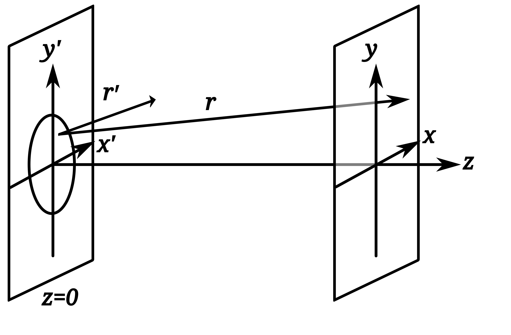
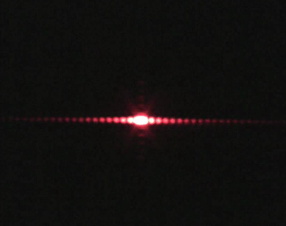
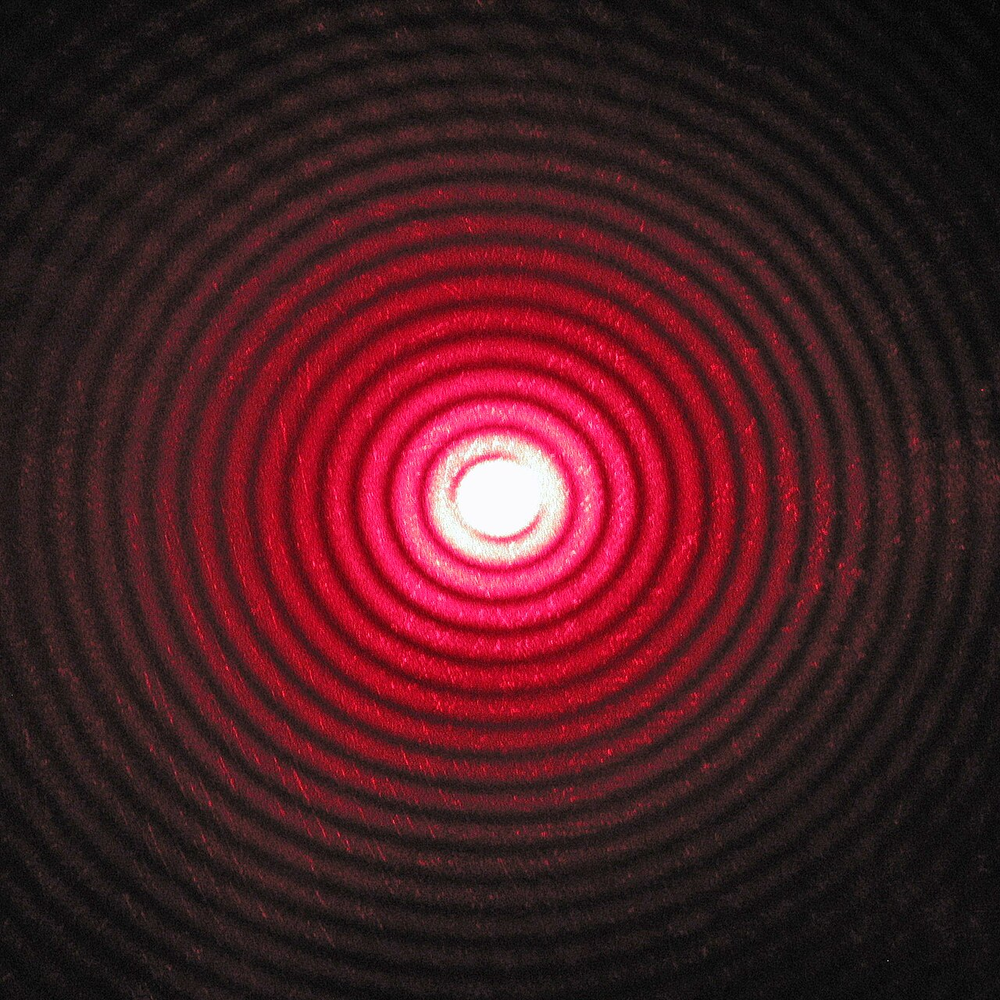

<wljs-store json="./attachments/442600e1-be35-4bea-aeca-b22b09c701e6.txt"></wljs-store>


Fraunhofer Diffraction is a specific case of wave interference. In general, diffraction is a deviation of waves from straight-line propagation without any change in their energy due to an obstacle or through an aperture. Following the approach described in [Wikipedia's page](https://en.wikipedia.org/wiki/Fraunhofer_diffraction_equation)

<div className="invertColor">




</div>

> The Fraunhofer diffraction equation is an approximation which can be applied when the diffracted wave is observed in the far field, and also when a lens is used to focus the diffracted light; in many instances, a simple analytical solution is available to the Fraunhofer equation 

$$
\begin{align}
U(x,y,z)
&\propto \iint_\text{Aperture} \, A(x',y') e^{-i \frac{2\pi}{\lambda}(lx' + my')} \, dx'\,dy' \\
&\propto \iint_\text{Aperture} \, A(x',y') e^{-i k(lx' + my')} \, dx'\,dy'
\end{align}
$$

where $A$ is the complex amplitude of the light on the aperture (our blocking object shape or source shape) and $U$ is the amplitude of observed light at the given distance—the actual diffraction pattern. One can see that this is effectively a 2D Fourier transformation of the shape causing the diffraction.

This can easily be written in Wolfram. Here `amplitude2D` returns the logarithm of the amplitude of the Fourier transformed data, which enhances the visibility of features in the frequency domain:

```wolfram
amplidute2D[data_] := Module[{d, fw, nRow, nCol},
  {nRow, nCol} = Dimensions[data];
  d = data;
  d = d*(-1)^Table[i + j, {i, nRow}, {j, nCol}];
  fw = Fourier[d, FourierParameters -> {1, 1}];
  
  Log[1 + Abs@fw]
]
```

We are not interested in phase information, assuming that our source is monochromatic and we look at the resulting intensity of interference patterns on the screen; therefore, `Abs` is applied.

## Common patterns
Let's test the most common diffraction patterns. The first one is when the light is passed though a __thin slit__:

```wolfram
With[{aperture = RegionImage[Rectangle[{-0.15,-0.99}, {0.05,0.99}], {{-1,1}, {-1,1}}, RasterSize->150]},
  {
    Labeled[aperture, "Aperture"], 
    Labeled[amplidute2D[ImageData[aperture]]//Rescale//Image//Colorize, "Screen"]
  } // Row 
]
```

<WLJSWrapper><wljs-editor display="codemirror" type="Output"  >{`(*GB[*){{(*GB[*){{(*BB[*)((*VB[*)(FrontEndRef["b5776670-7ffd-4bd6-85ac-73c414c9a4c3"])(*,*)(*"1:eJxTTMoPSmNkYGAoZgESHvk5KRCeEJBwK8rPK3HNS3GtSE0uLUlMykkNVgEKJ5mam5uZmRvomqelpeiaJKWY6VqYJibrmhsnmxiaJFsmmiQbAwCDKxWw"*)(*]VB*))(*,*)(*"1:eJxTTMoPSmNkYGAoZgESHvk5KWnMIB4vkAjLTC13SU3OL0osyS8KBskHJOalpjHBVAeV5qQWcwIZjjmZ6Xm5qXklCDmfzOKSYjYgwxkonFpUzAFkOiUWp+ZkYpgggCQVkF+cWZKZn4eiHgAIiyhB"*)(*]BB*)(*VB[*)(**)(*,*)(*"1:eJxTTMoPSmNiYGAo5gUSYZmp5S6pyflFiSX5RcEsQBHPktRciDyIF1Sak1osAGS4pKYlluaUOCUWpwaXVOakBrMDBX0Sk1JzUlMAU+0Vnw=="*)(*]VB*)}(*||*),(*||*){"Aperture"(*VB[*)(**)(*,*)(*"1:eJxTTMoPSmNiYGAo5gUSYZmp5S6pyflFiSX5RcEsQBHPktRciDyIF1Sak1osAGS4pKYlluaUOCUWpwaXVOakBvMABX0Sk1JzUlPAFADFtBeE"*)(*]VB*)}}(*]GB*)(*|*),(*|*)(*GB[*){{(*BB[*)((*VB[*)(FrontEndRef["e93aa877-409e-478e-85f5-4d44fc4aa619"])(*,*)(*"1:eJxTTMoPSmNkYGAoZgESHvk5KRCeEJBwK8rPK3HNS3GtSE0uLUlMykkNVgEKp1oaJyZamJvrmhhYpuqamFuk6lqYppnqmqSYmKQlmyQmmhlaAgCCCRWN"*)(*]VB*))(*,*)(*"1:eJxTTMoPSmNkYGAoZgESHvk5KWnMIB4vkAjLTC13SU3OL0osyS8KBskHJOalpjHBVAeV5qQWcwIZjjmZ6Xm5qXklCDmfzOKSYjYgwxkonFpUzAFkOiUWp+ZkYpgggCQVkF+cWZKZn4eiHgAIiyhB"*)(*]BB*)(*VB[*)(**)(*,*)(*"1:eJxTTMoPSmNiYGAo5gUSYZmp5S6pyflFiSX5RcEsQBHPktRciDyIF1Sak1osAGS4pKYlluaUOCUWpwaXVOakBrMDBX0Sk1JzUlMAU+0Vnw=="*)(*]VB*)}(*||*),(*||*){"Screen"(*VB[*)(**)(*,*)(*"1:eJxTTMoPSmNiYGAo5gUSYZmp5S6pyflFiSX5RcEsQBHPktRciDyIF1Sak1osAGS4pKYlluaUOCUWpwaXVOakBvMABX0Sk1JzUlPAFADFtBeE"*)(*]VB*)}}(*]GB*)}}(*]GB*)`}</wljs-editor></WLJSWrapper>

Does it look familiar? Here is a real experiment (MIT Physics Instructional Resources Lab) of a laser pointer beam passing through a thin slit:




Here is another example with __a thin hole__:

```wolfram
With[{aperture = RegionImage[Disk[{0,0},0.1], {{-1,1}, {-1,1}}, RasterSize->150]},
  {
    Labeled[aperture, "Aperture"], 
    Labeled[amplidute2D[ImageData[aperture]]//Rescale//Image//Colorize, "Screen"]
  } // Row 
]
```


<WLJSWrapper><wljs-editor display="codemirror" type="Output"  >{`(*GB[*){{(*GB[*){{(*BB[*)((*VB[*)(FrontEndRef["ded46b3f-0987-46af-a8c8-20ae45465a41"])(*,*)(*"1:eJxTTMoPSmNkYGAoZgESHvk5KRCeEJBwK8rPK3HNS3GtSE0uLUlMykkNVgEKp6SmmJglGafpGlhamOuamCWm6SZaJFvoGhkkppqYmpiZJpoYAgCMqRWo"*)(*]VB*))(*,*)(*"1:eJxTTMoPSmNkYGAoZgESHvk5KWnMIB4vkAjLTC13SU3OL0osyS8KBskHJOalpjHBVAeV5qQWcwIZjjmZ6Xm5qXklCDmfzOKSYjYgwxkonFpUzAFkOiUWp+ZkYpgggCQVkF+cWZKZn4eiHgAIiyhB"*)(*]BB*)(*VB[*)(**)(*,*)(*"1:eJxTTMoPSmNiYGAo5gUSYZmp5S6pyflFiSX5RcEsQBHPktRciDyIF1Sak1osAGS4pKYlluaUOCUWpwaXVOakBrMDBX0Sk1JzUlMAU+0Vnw=="*)(*]VB*)}(*||*),(*||*){"Aperture"(*VB[*)(**)(*,*)(*"1:eJxTTMoPSmNiYGAo5gUSYZmp5S6pyflFiSX5RcEsQBHPktRciDyIF1Sak1osAGS4pKYlluaUOCUWpwaXVOakBvMABX0Sk1JzUlPAFADFtBeE"*)(*]VB*)}}(*]GB*)(*|*),(*|*)(*GB[*){{(*BB[*)((*VB[*)(FrontEndRef["5d054043-a33c-4cb9-8b71-e5e2de737d0a"])(*,*)(*"1:eJxTTMoPSmNkYGAoZgESHvk5KRCeEJBwK8rPK3HNS3GtSE0uLUlMykkNVgEKm6YYmJoYmBjrJhobJ+uaJCdZ6lokmRvqppqmGqWkmhubpxgkAgB8wRWa"*)(*]VB*))(*,*)(*"1:eJxTTMoPSmNkYGAoZgESHvk5KWnMIB4vkAjLTC13SU3OL0osyS8KBskHJOalpjHBVAeV5qQWcwIZjjmZ6Xm5qXklCDmfzOKSYjYgwxkonFpUzAFkOiUWp+ZkYpgggCQVkF+cWZKZn4eiHgAIiyhB"*)(*]BB*)(*VB[*)(**)(*,*)(*"1:eJxTTMoPSmNiYGAo5gUSYZmp5S6pyflFiSX5RcEsQBHPktRciDyIF1Sak1osAGS4pKYlluaUOCUWpwaXVOakBrMDBX0Sk1JzUlMAU+0Vnw=="*)(*]VB*)}(*||*),(*||*){"Screen"(*VB[*)(**)(*,*)(*"1:eJxTTMoPSmNiYGAo5gUSYZmp5S6pyflFiSX5RcEsQBHPktRciDyIF1Sak1osAGS4pKYlluaUOCUWpwaXVOakBvMABX0Sk1JzUlPAFADFtBeE"*)(*]VB*)}}(*]GB*)}}(*]GB*)`}</wljs-editor></WLJSWrapper>


And a real experiment of a red laser limited by a circular aperture (Wikipedia, By Wisky - Own work, CC BY-SA 3.0):



This is also known as an Airy disk.

<Callout>
Due to its Fourier nature, the smaller the hole, the larger the diffraction patterns. This is why this method is used in Laue diffraction to study crystal structures.
</Callout>

## Interactive example

The module is designed to provide an interactive interface for visualizing diffraction patterns. It uses a canvas input element where you can freely draw any shape and see the result immediately

```wolfram
Module[{
  buffer = ImageData[ConstantImage[0, {300,300}], "Real32"],
  shape = InputRaster[ImageSize->{300,300}, "AllowUpdateWhileDrawing"->True]
},

  EventHandler[shape, Function[new, 
    With[{array = ImageData[RemoveAlphaChannel[new, White] // Binarize // ColorNegate, "Real32"]},
      With[{amp = amplidute2D[array]},
        buffer = amp / Max[amp];
      ];
    ]
  ]];
  
  {
    shape,
    Image[buffer // Offload, "Real32", Magnification->2]
  } // Row
]
```

Here is a demonstration:

<LazyVideo url="./diff.mp4"/>
