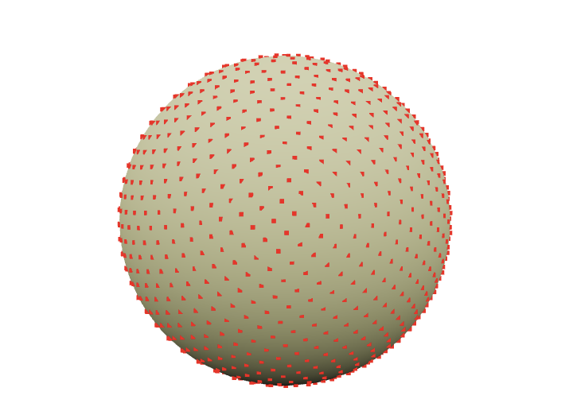
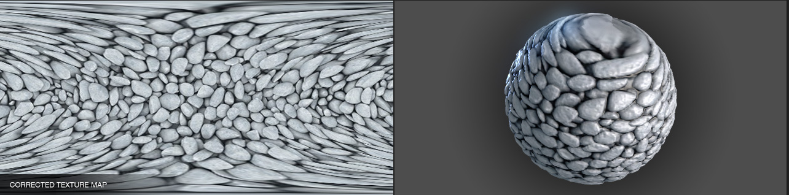

{/* add this script to the body  */}
{/* https://cdn.jsdelivr.net/gh/WLJSTeam/web-components@latest/src/common/app.js */}
<wljs-store kernel="./attachments/kernel-8556280656517855959.txt" json="./attachments/974e939a-7268-4f58-b7f9-95898cc3d9dd.txt"></wljs-store>

  <DownloadFile
    title="Download Notebook"
    description="Get the complete code"
    href="./attachments/notebook-974.wln"
  />

## Spreading points on a sphere

Obviously, even if we grab Earth's elevation map, there’s the problem of projecting it onto a sphere. This is a complex topic involving triangulation (since we need to create polygons from it afterward) and more, with plenty written on the subject. For example:

- [Delaunay and Voronoi on a Sphere](https://www.redblobgames.com/x/1842-delaunay-voronoi-sphere/)  
- [Four Ways to Create a Mesh for a Sphere](https://medium.com/@oscarsc/four-ways-to-create-a-mesh-for-a-sphere-d7956b825db4)  

As one approach, we’ll go the other way around — first generating sample points on the sphere, then querying the elevation data for those points.  

So, we need to evenly distribute **N** points across a sphere. No need to reinvent the wheel when a rich standard library is available.  

<WLJSWrapper><wljs-editor display="codemirror" type="Input" editable="true"  >{`Graphics3D[{
	  Sphere[],
	  Red, PointSize[0.01], SpherePoints[1000]//Point
	}]
	`}</wljs-editor></WLJSWrapper>

## Get Elevation Data
Fortunately (or unfortunately), the standard WL library already includes a rough map of the entire Earth (just in case). If more precision is needed, it can go online and fetch higher-resolution data.  

So, let’s get down to business

<WLJSWrapper><wljs-editor display="codemirror" type="Input" editable="true"  >{`GeoElevationData[GeoPosition[Here]]`}</wljs-editor></WLJSWrapper>

<WLJSWrapper><wljs-editor display="codemirror" type="Output"  >{`(*VB[*)(q)(*,*)(*"1:eJxTTMoPSmNkYGAoZgESHvk5KWlMIB43kAgsTcwrySypdMqvKGIAgQV1DsFsQNo3tSS1qBgAdxkNsQ=="*)(*]VB*)`}</wljs-editor></WLJSWrapper>

Here, `Here` returns the current latitude and longitude in degrees. The function can take not just a single value but an entire list. Naturally, we’ll use this list from the points on the sphere.  

<WLJSWrapper><wljs-editor display="codemirror" type="Input" editable="true"  >{`points = SpherePoints[5000];
	latLon = (*FB[*)((180)(*,*)/(*,*)(Pi))(*]FB*) {90Degree - ArcCos[#[[3]]], ArcTan[#[[1]], #[[2]]]} &/@ points;
	elevation = GeoElevationData[GeoPosition[latLon]];
	elevation = (elevation + Min[elevation])/Max[elevation];`}</wljs-editor></WLJSWrapper>

In the case if `Geo` did not work. Here is a dump

<WLJSWrapper><wljs-editor display="codemirror" type="Input" editable="true"  >{`{points, latLon, elevation} = NotebookRead[NotebookStore["mouse-850"]];`}</wljs-editor></WLJSWrapper>

Here we convert from Cartesian coordinates to spherical (more precisely, geodetic) coordinates

$$
\begin{matrix}

lat =& 90^\circ - arccos(z/r) \\
lon =& arctan(x/y)
\end{matrix}
$$

we retrieve the elevations and normalize them.  

The final step is to link them back to the original points on the sphere, using the normalized elevation as the distance along the normal.  

<WLJSWrapper><wljs-editor display="codemirror" type="Input" editable="true"  >{`surface = MapThread[(#1 (0.8 + 0.1 #2))&, {points, elevation}];`}</wljs-editor></WLJSWrapper>

Here, we scale them by eye so that the height above sea level only slightly "modulates" the sphere’s surface. This way, we get a visible relief of the Earth

<WLJSWrapper><wljs-editor display="codemirror" type="Input" editable="true"  >{`rainbow = ColorData["DarkRainbow"];
	
	ListSurfacePlot3D[surface, 
	  Mesh->None, MaxPlotPoints->100, 
	  ColorFunction -> Function[{x,y,z}, 
	      rainbow[1.5(2 Norm[{x,y,z}]-1)]
	  ], ColorFunctionScaling -> False
	] // Rasterize `}</wljs-editor></WLJSWrapper>

<WLJSWrapper><wljs-editor display="codemirror" type="Output"  >{`(*VB[*)(FrontEndRef["4104ea38-f3a6-4f89-8eb6-98ea517a95e6"])(*,*)(*"1:eJxTTMoPSmNkYGAoZgESHvk5KRCeEJBwK8rPK3HNS3GtSE0uLUlMykkNVgEKmxgamKQmGlvophknmumapFlY6lqkJpnpWlqkJpoamidamqaaAQCAOBWL"*)(*]VB*)`}</wljs-editor></WLJSWrapper>

## Generating clouds
What’s Earth without clouds? And what are clouds without Perlin noise?  

The next piece I honestly stole from one of the forums (no GPT for you!)

<WLJSWrapper><wljs-editor display="codemirror" type="Input" editable="true"  >{`n = 256;
	ratio = 1/2;
	
	k2 = Outer[Plus, #, #] &[RotateRight[N@Range[-n, n - 1, 2]/n, n/2]^2];
	
	k2 = k2[[;; ;; 1/ratio, All]];
	
	spectrum = With[{d := RandomReal[NormalDistribution[], {n ratio, n}]},
	   (1/n) (d)/(0.001 + k2)]; 
	spectrum[[1, 1]] *= 0;
	
	im[p_] := Clip[Re[InverseFourier[spectrum Exp[I p]]], {0, ∞}]^0.5
	
	p0 = p = Sqrt[k2];
	cloudTexture = Image[im[p0 += p], Magnification->2]`}</wljs-editor></WLJSWrapper>

<WLJSWrapper><wljs-editor display="codemirror" type="Output"  >{`(*VB[*)(FrontEndRef["458950d1-e7da-4def-ab37-b7e33e1e1360"])(*,*)(*"1:eJxTTMoPSmNkYGAoZgESHvk5KRCeEJBwK8rPK3HNS3GtSE0uLUlMykkNVgEKm5haWJoapBjqppqnJOqapKSm6SYmGZvrJpmnGhunGqYaGpsZAACHqRXR"*)(*]VB*)`}</wljs-editor></WLJSWrapper>

Here animated version

<WLJSWrapper><wljs-editor display="codemirror" type="Input" editable="true"  >{`Refresh[Image[im[p0 += p]], 0.1]`}</wljs-editor></WLJSWrapper>

How do we make them three-dimensional? I couldn’t think of anything better than using the Marching Cubes technique to generate low-poly clouds.  

However, to start, we’ll "stretch" the 2D image into 3D with fading at the edges.  

<WLJSWrapper><wljs-editor display="codemirror" type="Input" editable="true"  >{`With[{plain = im[p0+=p]}, Table[plain Exp[-( i)^2/200.], {i, -20,20}]][[;;;;8, ;;;;4, ;;;;4]] // Image3D `}</wljs-editor></WLJSWrapper>

*this is not an image, try to drag*

To turn this scalar field into polygons, we can use the `ImageMesh` function. However, it's quite challenging to work with when nonlinear transformations need to be applied to the mesh. And we will need to do these transformations, otherwise, how will we map this square onto the sphere?

Let’s use an external library, `wl-marchingcubes`.  

<WLJSWrapper><wljs-editor display="codemirror" type="Input" editable="true"  >{`LPMRepositories[{
	    "Github" -> "https://github.com/JerryI/wl-marching-cubes" -> "master"
	}]
	
	<<JerryI\`MarchingCubes\``}</wljs-editor></WLJSWrapper>

<WLJSWrapper><wljs-editor display="codemirror" type="Input" editable="true"  >{`With[{plain = im[p0]}, Table[plain Exp[-( i)^2/200.], {i, -20,20}]];
	
	{vertices, normals} = CMarchingCubes[%, 0.2];`}</wljs-editor></WLJSWrapper>

The result is stored in `vertices`. By default, the library generates an unindexed set of triangle vertices. This means we can directly interpret them as 

<WLJSWrapper><wljs-editor display="codemirror" type="Input" editable="true"  >{`Polygon[{
	  {1, 2, 3}, // Triangle 1
	  {4, 5, 6}, // Triangle 2
	  ...
	}]`}</wljs-editor></WLJSWrapper>

Where none of the vertices are reused by another triangle. This format is especially simple for the GPU, as only one such list needs to be sent to one of the WebGL buffers. Fortunately, the `Polygon` primitive supports this format

<WLJSWrapper><wljs-editor display="codemirror" type="Input" editable="true"  >{`GraphicsComplex[vertices, Polygon[1, Length[vertices]]] // Graphics3D // Rasterize`}</wljs-editor></WLJSWrapper>

<WLJSWrapper><wljs-editor display="codemirror" type="Output"  >{`(*VB[*)(FrontEndRef["cfb9bd1c-2faf-4461-bd21-dc626c96fda0"])(*,*)(*"1:eJxTTMoPSmNkYGAoZgESHvk5KRCeEJBwK8rPK3HNS3GtSE0uLUlMykkNVgEKJ6clWSalGCbrGqUlpumamJgZ6ialGBnqpiSbGZklW5qlpSQaAACbJhaK"*)(*]VB*)`}</wljs-editor></WLJSWrapper>

### Mapping things to a sphere

I'll mention right away that I’m not an expert in geodesy (@JerryI), but I’ve "heard" about some concepts from computational geometry and 3D graphics.

In any case, we’ll be "mapping" this texture onto the sphere in one form or another (as polygons). This means we’ll transform all its points following one of the cartographic projections. 

Looking at textures from games, we can notice a pattern

*https://richardrosenman.com/shop/spherical-mapping-corrector/*

At the edges of the texture projected from the sphere, the details stretch towards the top and bottom edges of the rectangle. This is exactly the case when $ \theta \rightarrow 0, \pi $ or $ v \rightarrow 0, 1 $ — our poles.

Thus, if we artificially distort the original texture in the same way, we should eliminate the artifacts at the poles. Do you know what this transformation resembles?

It’s akin to transforming [the Mollweide projection into an equal-area cartographic projection](https://mathematica.stackexchange.com/a/79868/53728)

<WLJSWrapper><wljs-editor display="codemirror" type="Input" editable="true"  >{`lat[y_, rad_:1] := ArcSin[(2 theta[y, rad] + Sin[2 theta[y, rad]])/Pi];
	lon[x_, y_, rad_:1, lonzero_: 0] := lonzero + Pi x/(2 rad Sqrt[2] Cos[theta[y, rad]]);
	theta[y_, rad_:1] := ArcSin[y/(rad Sqrt[2])];
	mollweidetoequirect[{x_, y_}] := {lon[x, y, 1], lat[y]};
	
	newCloudTexture = ImageForwardTransformation[
	  cloudTexture,
	  mollweidetoequirect,
	  DataRange -> {{-2 Sqrt[2], 2 Sqrt[2]}, {-Sqrt[2], Sqrt[2]}},
	  PlotRange -> All
	];
	
	Image[%, Magnification->2]`}</wljs-editor></WLJSWrapper>

<WLJSWrapper><wljs-editor display="codemirror" type="Output"  >{`(*VB[*)(FrontEndRef["0b3b02ec-63c8-4c7b-ab43-74a8dcfff90a"])(*,*)(*"1:eJxTTMoPSmNkYGAoZgESHvk5KRCeEJBwK8rPK3HNS3GtSE0uLUlMykkNVgEKGyQZJxkYpSbrmhknW+iaJJsn6SYmmRjrmpskWqQkp6WlWRokAgCLfRZZ"*)(*]VB*)`}</wljs-editor></WLJSWrapper>

Next, we simply need to repeat Marching Cubes on it and transform all the vertices using the equation above. As a bonus, let's transform `normals` as well!

<WLJSWrapper><wljs-editor display="codemirror" type="Input" editable="true"  >{`With[{plain = ImageData[ImageResize[newCloudTexture, Scaled[1/2]]]}, Table[plain Exp[-( i)^2/200.], {i, -20,20,2}]];
	
	{vertices, normals} = CMarchingCubes[%, 0.2];
	
	vertices = With[{
	  offset = {Min[vertices[[All,1]]], Min[vertices[[All,2]]], 0},
	  maxX = Max[vertices[[All,1]]] - Min[vertices[[All,1]]],
	  maxY = Max[vertices[[All,2]]] - Min[vertices[[All,2]]]
	}, Map[Function[v, With[{p = v - offset}, {p[[1]]/maxX, p[[2]]/maxY, p[[3]]}]], vertices]];
	
	{pvertices, pnormals} = MapThread[Function[{v,n},
	    With[{\\[Rho] = 50.0 + 0.25 (v[[3]] - 10), \\[Phi] =  2 Pi Clip[v[[1]], {0,1}], \\[Theta] =  Pi Clip[v[[2]], {0,1}]},
	      {
	        {\\[Rho] Cos[\\[Phi]] Sin[\\[Theta]], \\[Rho] Sin[\\[Phi]] Sin[\\[Theta]], \\[Rho] Cos[\\[Theta]]},
	
	        n[[3]] {Cos[\\[Phi]] Sin[\\[Theta]], Sin[\\[Phi]] Sin[\\[Theta]], Cos[\\[Theta]]} + 
	        n[[2]] {Cos[\\[Theta]] Cos[\\[Phi]],Cos[\\[Theta]] Sin[\\[Phi]],-Sin[\\[Theta]]} + 
	        n[[1]] {-Sin[\\[Theta]] Sin[\\[Phi]],Cos[\\[Phi]] Sin[\\[Theta]],0}
	      }
	    ]
	  ]
	, {vertices, -normals}] // Transpose;
	
	{
	  clouds = GraphicsComplex[0.017 pvertices, Polygon[1, Length[vertices]], VertexNormals->pnormals]
	} // Graphics3D // Rasterize `}</wljs-editor></WLJSWrapper>

<WLJSWrapper><wljs-editor display="codemirror" type="Output"  >{`(*VB[*)(FrontEndRef["ce398396-cbb9-4bac-b178-ed6a91941a07"])(*,*)(*"1:eJxTTMoPSmNkYGAoZgESHvk5KRCeEJBwK8rPK3HNS3GtSE0uLUlMykkNVgEKJ6caW1oYW5rpJiclWeqaJCUm6yYZmlvopqaYJVoaWpoYJhqYAwCNnBXd"*)(*]VB*)`}</wljs-editor></WLJSWrapper>

If `VertexNormals` is explicitly set in `GraphicsComplex`, then when shading, the surface will be interpolated across all three normals of the triangle, instead of just one (which is automatically calculated by the graphics library if no other data is provided, in which case the polygon looks like a flat plane — a.k.a. the effect seen in 80s demos).  

## Putting it all together
We can extend the original `SurfacePlot` with options and add additional graphic primitives through them. Oh, and don’t forget to turn off the default lighting. After all, we’re in space!  

<WLJSWrapper><wljs-editor display="codemirror" type="Input" editable="true"  >{`rainbow = ColorData["DarkRainbow"];
	
	ListSurfacePlot3D[
	  MapThread[(#1 (0.8 + 0.1 #2))&, {points, elevation}], 
	  Mesh->None, MaxPlotPoints->50, 
	  ColorFunction -> Function[{x,y,z}, rainbow[1.5(2 Norm[{x,y,z}]-1)]], 
	  ColorFunctionScaling -> False, 
	  Lighting->None,
	  PlotStyle->Directive["Shadows"->True, "CastShadow"->True],
	
	  Prolog -> {
	    Directive["Shadows"->True, "CastShadow"->True],
	    clouds,
	    HemisphereLight[LightBlue, Orange // Darker // Darker],
	    SpotLight[Orange, {-2.4909, 4.069, 3.024}]
	  },
	  
	  Background->Black,
	  Axes->False
	, ImageSize->600]
	`}</wljs-editor></WLJSWrapper>

<WLJSWrapper><wljs-editor display="codemirror" type="Output"  >{`(*VB[*)(FrontEndRef["6927cbfd-deef-4b74-80d6-7a9e3fbca385"])(*,*)(*"1:eJxTTMoPSmNkYGAoZgESHvk5KRCeEJBwK8rPK3HNS3GtSE0uLUlMykkNVgEKm1kamScnpaXopqSmpumaJJmb6FoYpJjpmidaphqnJSUnGluYAgCVohZ2"*)(*]VB*)`}</wljs-editor></WLJSWrapper>

*Try to drag it*

## Animation  
Let’s add a simple animation for the movement of the light source, as well as the rotation of the cloud sphere to spice up the scene

<WLJSWrapper><wljs-editor display="codemirror" type="Input" editable="true"  >{`rainbow = ColorData["DarkRainbow"];
	lightPos = {-2.4909, 4.069, 3.024};
	
	rotationMatrix = RotationMatrix[0., {0,0,1}];
	angle = 0.;
	
	
	ListSurfacePlot3D[
	  MapThread[(#1 (0.8 + 0.1 #2))&, {points, elevation}], 
	  Mesh->None, MaxPlotPoints->100, 
	  ColorFunction -> Function[{x,y,z}, rainbow[1.5(2 Norm[{x,y,z}]-1)]], 
	  ColorFunctionScaling -> False, 
	  Lighting->"Default",
	  PlotStyle->Directive["Shadows"->True, "CastShadow"->True],
	
	  Prolog -> {
	    Directive["Shadows"->True, "CastShadow"->True],
	    GeometricTransformation[clouds, rotationMatrix // Offload],
	    HemisphereLight[LightBlue, Orange // Darker // Darker],
	    SpotLight[Orange, lightPos // Offload]
	  },
	
	  Epilog -> EventHandler[AnimationFrameListener[lightPos // Offload], Function[Null,
	    lightPos = RotationMatrix[1 Degree, {1,1,1}].lightPos;
	    rotationMatrix = RotationMatrix[angle, {0,0,1}];
	    angle += 0.5 Degree;    
	  ]],
	  Background->Black,
	  ImageSize->600
	]`}</wljs-editor></WLJSWrapper>

To start animation

<WLJSWrapper><wljs-editor display="codemirror" type="Input" editable="true"  >{`lightPos = lightPos;`}</wljs-editor></WLJSWrapper>

__Alternative version for a blog__

Drag a slider to control clouds and etc

<WLJSWrapper><wljs-editor display="codemirror" type="Input" editable="true"  >{`rainbow = ColorData["DarkRainbow"];
	lightPos = {-2.4909, 4.069, 3.024};
	
	rotationMatrix = RotationMatrix[0., {0,0,1}];
	
	EventHandler[InputRange[0,1, 0.01], Function[value,
	  lightPos = RotationMatrix[2Pi value, {1,1,1}].{-2.4909, 4.069, 3.024} // N;
	  rotationMatrix = RotationMatrix[2Pi value, {0,0,1}] // N;
	]]
	
	ListSurfacePlot3D[
	  MapThread[(#1 (0.8 + 0.1 #2))&, {points, elevation}], 
	  Mesh->None, MaxPlotPoints->50, 
	  ColorFunction -> Function[{x,y,z}, rainbow[1.5(2 Norm[{x,y,z}]-1)]], 
	  ColorFunctionScaling -> False, 
	  Lighting->"Default",
	  PlotStyle->Directive["Shadows"->True, "CastShadow"->True],
	
	  Prolog -> {
	    Directive["Shadows"->True, "CastShadow"->True],
	    GeometricTransformation[clouds, rotationMatrix // Offload],
	    HemisphereLight[LightBlue, Orange // Darker // Darker],
	    SpotLight[Orange, lightPos // Offload]
	  },
	  ImageSize->600, Axes->False
	]`}</wljs-editor></WLJSWrapper>

<WLJSWrapper><wljs-editor display="codemirror" type="Output"  >{`(*VB[*)(EventObject[<|"Id" -> "2f0abc26-0920-4543-aa4b-3b697daf469c", "Initial" -> 0.5, "View" -> "a090e724-7609-4ca8-8be5-243a58df057d"|>])(*,*)(*"1:eJxTTMoPSmNkYGAoZgESHvk5KRCeEJBwK8rPK3HNS3GtSE0uLUlMykkNVgEKJxpYGqSaG5nompsZWOqaJCda6FokpZrqGpkYJ5papKQZmJqnAAB5qhVK"*)(*]VB*)`}</wljs-editor></WLJSWrapper>

<WLJSWrapper><wljs-editor display="codemirror" type="Output"  >{`(*VB[*)(FrontEndRef["488db774-faaa-48c1-948b-7f9cefab2802"])(*,*)(*"1:eJxTTMoPSmNkYGAoZgESHvk5KRCeEJBwK8rPK3HNS3GtSE0uLUlMykkNVgEKm1hYpCSZm5vopiUmJuqaWCQb6lqaWCTpmqdZJqemJSYZWRgYAQCLTxYS"*)(*]VB*)`}</wljs-editor></WLJSWrapper>