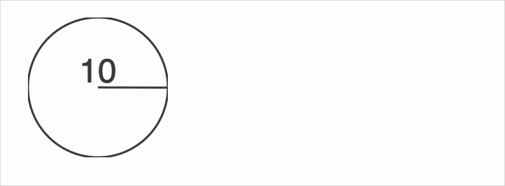
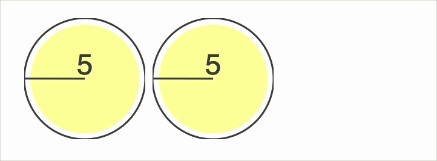
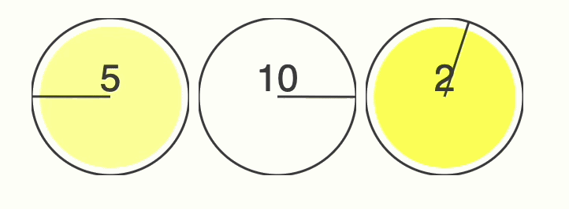

{/* add this script to the body  */}
{/* https://cdn.jsdelivr.net/gh/WLJSTeam/web-components@latest/src/common/app.js */}
<wljs-store json="./attachments/0c8fd650-9988-4f47-bdcb-48e30cb09460.txt"></wljs-store>

Here is a single atom in the system. It has an internal clock, `a`, that runs from 0 to 10. For clarity, the state is reflected in both the opacity and the displayed text:

<WLJSWrapper><wljs-editor display="codemirror" type="Input" editable="true"  >{`Module[{a = 0}, Refresh[
	    a = If[a>9, 0, a+1]; 
	    Graphics[{
	      Circle[{0,0}, 1.0],
	      {Opacity[(1 - a/10) // Offload], (*VB[*)(RGBColor[1, 1, 0])(*,*)(*"1:eJxTTMoPSmNiYGAo5gUSYZmp5S6pyflFiSX5RcEsQBHn4PCQNGaQPAeQCHJ3cs7PyS8qYgCDD/boDAYGAO7rEHU="*)(*]VB*), Disk[{0,0}, 0.9]},
	      Line[{{0,0}, {Cos[0.628 a], Sin[0.628 a]} // Offload}],
	      Directive[FontSize->24], Text[Offload[a], {0,0.2}, {0,0}]
	    }, ImageSize->{100,100}], 
	0.2]]`}</wljs-editor></WLJSWrapper>

We can make more atoms and place them together, as in the Fireflies post, but for new properties to emerge we need to couple them. One simple way is to use an external medium. In the simplest case, that medium can be just a Boolean symbol:

<WLJSWrapper><wljs-editor display="codemirror" type="Input" editable="true"  >{`env = False;`}</wljs-editor></WLJSWrapper>

`False` means there is no visible flash and no event has happened. Now let's define the interface that controls how our atoms interact with `env`:
- Broadcast the flashing state by setting `env` to `True`.
- When an atom sees an external flash (or the flash it emitted itself), move its internal clock `a` closer to the flashing state (`a = 10`).

<WLJSWrapper><wljs-editor display="codemirror" type="Input" editable="true"  >{`makeAtom[shared_, i_:0] := Module[{a = i}, 
	  Refresh[
	    a = Clip[
	       Which[
	          a > 9, shared = True; 0,
	          shared, shared = False; a + Boole[a > 5]*3 - 1,
	          True, a + 1
	       ],
	       {0, 10}
	    ];
	    Graphics[{
	      Circle[{0,0}, 1.0],
	      {Opacity[(1 - a/10) // Offload], (*VB[*)(RGBColor[1, 1, 0])(*,*)(*"1:eJxTTMoPSmNiYGAo5gUSYZmp5S6pyflFiSX5RcEsQBHn4PCQNGaQPAeQCHJ3cs7PyS8qYgCDD/boDAYGAO7rEHU="*)(*]VB*), Disk[{0,0}, 0.9]},
	      Line[{{0,0}, {Cos[0.628 a], Sin[0.628 a]} // Offload}],
	      Directive[FontSize->24], Text[Offload[a], {0,0.2}, {0,0}]
	    }, ImageSize->{100,100}], 
	  0.2]
	]
	SetAttributes[makeAtom, HoldFirst];`}</wljs-editor></WLJSWrapper>

Let's start with just two atoms, created out of phase and coupled through `env`:

<WLJSWrapper><wljs-editor display="codemirror" type="Input" editable="true"  >{`{makeAtom[env],  makeAtom[env, 3]}//Row `}</wljs-editor></WLJSWrapper>

At some point, you will see them synchronize their clocks, just like fireflies. With three atoms, however, the system can settle into other flashing patterns, or modes, such as waves:

<WLJSWrapper><wljs-editor display="codemirror" type="Input" editable="true"  >{`env2 = False;
	{makeAtom[env2, 2], makeAtom[env2, 5],  makeAtom[env2, 8]}//Row `}</wljs-editor></WLJSWrapper>

What is fascinating here is how simple the atoms are, and how effectively multiple instances of `Refresh` can be used in toy models like this. Of course, this approach will not scale well, but it makes a nice minimal demonstration of basic interactivity in WLJS/Mathematica.