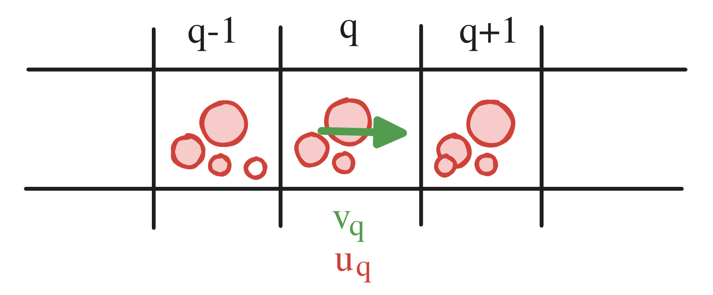

{/* add this script to the body  */}
{/* https://cdn.jsdelivr.net/gh/WLJSTeam/web-components@latest/src/common/app.js */}
<wljs-store json="./attachments/e837d3a8-416c-4291-9cd5-9cbe06eab5bc.txt"></wljs-store>

  <DownloadFile 
    title="Download Notebook"
    description="Get the complete code"
    href="./attachments/notebook-e83.wln"
  />

This work is mostly based on Jos Stam. Stable Fluids SIGGRAPH 1999 as well as a tutorial by [Karl Sims](https://www.karlsims.com/fluid-flow.html)

## Equations
We based our implementation on the Navier-Stokes equation for incompressible fluid with no viscosity

$$
\frac{\partial \mathbf{v}}{\partial t} + (\mathbf{v} \cdot \nabla) \mathbf{v} = f_{\text{external}}, \qquad div~\mathbf{v} = 0
$$

where $f_{external}$ accounts for the pressure gradient and external forces.

Then, we solve these two equations in a discretized form on a grid using a technique mentioned in Jos Stam's *Stable Fluids* work.

Let's break it into several parts.

### Fluid momentum

#### Advection

From mathematica point of view it describes a general process of moving something on a scalar or vector field in the direction given by another vector field.

For simplicity's sake, we will first start with scalar fields:

```wolfram
grid = Table[{0,0}, {5}, {5}]; 
grid[[3,3]] = {0,1}; (* stream in the center *)

u = Table[1., {5}, {5}];
```

One can think about `u` as if it were a mass of something, which will be carried by the stream `grid`.

*Look at the borders*

<div className="invertColor">



</div>

One may consider interpolating the velocity at cell interfaces and then transporting mass between neighboring cells. This leads to the update

$$
\frac{u_{q}^{t} - u_{q}^{t-1}}{\delta t}
= - \frac{v_{q} + v_{q+1}}{2},\frac{u_{q}^{t-1} + u_{q+1}^{t-1}}{2}

* \frac{v_{q} + v_{q-1}}{2},\frac{u_{q}^{t-1} + u_{q-1}^{t-1}}{2}.
$$

However, this scheme does not preserve nonnegativity: even when the initial mass density is nonnegative, the update can produce negative values. In practice, this manifests as loss of stability and non-convergence.

##### Proof that it can produce negative densities (hence “does not work”)

Rewrite the scheme in a more revealing form. Define the interface “velocities”
$$
a_{q+\frac12} := \frac{v_q+v_{q+1}}{2}, \qquad a_{q-\frac12} := \frac{v_q+v_{q-1}}{2}.
$$
Then the update is
$$
u_q^{t}
= u_q^{t-1}
-\frac{\delta t}{2},a_{q+\frac12},(u_q^{t-1}+u_{q+1}^{t-1})
+\frac{\delta t}{2},a_{q-\frac12},(u_{q-1}^{t-1}+u_q^{t-1}).
$$
Collect coefficients of $u_{q-1}^{t-1}$, $u_q^{t-1}$, $u_{q+1}^{t-1}$:

$$
u_q^{t}

=======

\underbrace{\Bigl(1+\frac{\delta t}{2}(a_{q-\frac12}-a_{q+\frac12})\Bigr)}*{\alpha_q},u_q^{t-1}
+\underbrace{\frac{\delta t}{2}a*{q-\frac12}}*{\beta_q},u*{q-1}^{t-1}
+\underbrace{\Bigl(-\frac{\delta t}{2}a_{q+\frac12}\Bigr)}*{\gamma_q},u*{q+1}^{t-1}.
$$


If $a_{q+\frac12} > 0$ (flow to the right across the right interface), then
$$
\gamma_q = -\frac{\delta t}{2}a_{q+\frac12} < 0.
$$
So $(u_q^t)$ is a linear combination of neighboring values with a negative weight on $u_{q+1}^{t-1}$. That means the method is not monotone / not positivity-preserving.

A transport scheme for a mass density is expected to preserve $u\ge 0$.

#### Donor-cell advection

The way to fix it is to use the *Donor-cell* method described well in Heidelberg University's [lecture](https://www.ita.uni-heidelberg.de/~dullemond/lectures/num_fluid_2009/Chapter_4.pdf) on numerical fluid dynamics. There we again consider velocities at borders, but based on the relative sign (outtake or intake) we decide which cell is going to be a donor.

$$
v_{q+1/2} = \frac{v_{q} + v_{q+1}}{2} \\
v_{q-1/2} = \frac{v_{q} + v_{q-1}}{2}
$$

Using these notations one can write the __donor-cell__ method as follows:

$$
\frac{u_{q}^{t} - u_{q}^{t-1}}{\delta t} = - v_{q+1/2}\begin{cases}
   u_{q}^{t-1} ,& v_{q+1/2} > 0 \\
   u_{q+1}^{t-1} &
\end{cases} + v_{q-1/2}\begin{cases}
   u_{q-1}^{t-1} ,& v_{q-1/2} > 0 \\
   u_{q}^{t-1} &
\end{cases}
$$


Adding the projections from other sides, our final function will be

<WLJSWrapper><wljs-editor display="codemirror" type="Input"  >{`advect[v_, u_, δt_:0.1] := With[{max = Length[v]}, With[{
  	take = Function[{array, x,y}, If[x >= 1 && x <= max && y >= 1 && y <= max, array[[x,y]], array[[1,1]] 0.]]
},
	Table[ 
	
	  With[{
	    v1 =  (*FB[*)((take[v, i-1, j] + take[v, i, j])(*,*)/(*,*)(2.0))(*]FB*).{1,0},
	    v2 =  (*FB[*)((take[v, i, j+1] + take[v, i, j])(*,*)/(*,*)(2.0))(*]FB*).{0,-1},
	    v3 =  (*FB[*)((take[v, i+1, j] + take[v, i, j])(*,*)/(*,*)(2.0))(*]FB*).{-1,0},
	    v4 =  (*FB[*)((take[v, i, j-1] + take[v, i, j])(*,*)/(*,*)(2.0))(*]FB*).{0,1},
	    org = u[[i,j]]
	  },

	    org + (
	    
	      v1 (*TB[*)Piecewise[{{(*|*)take[u, i-1, j](*|*),(*|*)v1 > 0(*|*)},{(*|*)org(*|*),(*|*)True(*|*)}}](*|*)(*1:eJxTTMoPSmNkYGAo5gESAZmpyanlmcWpTvkVmUxAAQBzVQdd*)(*]TB*) + v3 (*TB[*)Piecewise[{{(*|*)take[u, i+1, j](*|*),(*|*)v3 > 0(*|*)},{(*|*)org(*|*),(*|*)True(*|*)}}](*|*)(*1:eJxTTMoPSmNkYGAo5gESAZmpyanlmcWpTvkVmUxAAQBzVQdd*)(*]TB*)  +
	      
	      v4 (*TB[*)Piecewise[{{(*|*)take[u, i, j-1](*|*),(*|*)v4 > 0(*|*)},{(*|*)org(*|*),(*|*)True(*|*)}}](*|*)(*1:eJxTTMoPSmNkYGAo5gESAZmpyanlmcWpTvkVmUxAAQBzVQdd*)(*]TB*) + v2 (*TB[*)Piecewise[{{(*|*)take[u, i, j+1](*|*),(*|*)v2 > 0(*|*)},{(*|*)org(*|*),(*|*)True(*|*)}}](*|*)(*1:eJxTTMoPSmNkYGAo5gESAZmpyanlmcWpTvkVmUxAAQBzVQdd*)(*]TB*)
	      
	    ) δt
	  ]
	  
	, {i, max}, {j, max}] // Chop
	]
]`}</wljs-editor></WLJSWrapper>

Now if we run a basic test with `grid`, the result should be correct

```wolfram
arrow = Graphics[Arrow[{{0,0}, {1,0}}], ImagePadding->None, ImageSize->30];

Table[MatrixPlot[Nest[advect[grid, #]&, u, n], ImageSize->150], {n, {0, 1, 100}}];
Riffle[%, arrow] // Row 
```

<WLJSWrapper><wljs-editor display="codemirror" type="Output"  >{`
(*GB[*){{(*VB[*)(FrontEndRef["c1b67054-0213-408b-8aa0-1e921ea5fe3a"])(*,*)(*"1:eJxTTMoPSmNkYGAoZgESHvk5KRCeEJBwK8rPK3HNS3GtSE0uLUlMykkNVgEKJxsmmZkbmJroGhgZGuuaGFgk6VokJhroGqZaGhmmJpqmpRonAgB1sBVZ"*)(*]VB*)(*|*),(*|*)(*VB[*)(Graphics[Arrow[{{0, 0}, {1, 0}}], ImagePadding -> None, ImageSize -> 30])(*,*)(*"1:eJxTTMoPSmNkYGAoZgESHvk5KWnMIB4HkHAvSizIyEwuhsizAgnHoqL88jQmmHKfzOISVF4mkGYAE2jijJjiQaU5qcU8QIZnbmJ6akBiSkpmXjpYxi8/LxVNHSdMXXBmVWqmHJAHALiLJE4="*)(*]VB*)(*|*),(*|*)(*VB[*)(FrontEndRef["0d7bf3b5-3dc1-471a-b05d-cdd21dbcaa6a"])(*,*)(*"1:eJxTTMoPSmNkYGAoZgESHvk5KRCeEJBwK8rPK3HNS3GtSE0uLUlMykkNVgEKG6SYJ6UZJ5nqGqckG+qamBsm6iYZmKboJqekGBmmJCUnJpolAgCP4haj"*)(*]VB*)(*|*),(*|*)(*VB[*)(Graphics[Arrow[{{0, 0}, {1, 0}}], ImagePadding -> None, ImageSize -> 30])(*,*)(*"1:eJxTTMoPSmNkYGAoZgESHvk5KWnMIB4HkHAvSizIyEwuhsizAgnHoqL88jQmmHKfzOISVF4mkGYAE2jijJjiQaU5qcU8QIZnbmJ6akBiSkpmXjpYxi8/LxVNHSdMXXBmVWqmHJAHALiLJE4="*)(*]VB*)(*|*),(*|*)(*VB[*)(FrontEndRef["52d28699-316e-4cc2-a167-544b8cd92681"])(*,*)(*"1:eJxTTMoPSmNkYGAoZgESHvk5KRCeEJBwK8rPK3HNS3GtSE0uLUlMykkNVgEKmxqlGFmYWVrqGhuapeqaJCcb6SYampnrmpqYJFkkp1gamVkYAgB2UxTy"*)(*]VB*)}}(*]GB*)
`}</wljs-editor></WLJSWrapper>

Now we are ready to apply this knowledge to our fluid simulation. But how?

#### Advection differential equation
I would like to draw your attention to the differential equation of advection

$$
\frac{\partial u}{\partial t} + (\mathbf{v} \cdot \nabla) u = 0
$$

If one tries to descritize it on 1D grid

$$
u^{t+1}_{q} - u^{t}_{q} + \frac{\delta t}{\delta q} (f^{t}_{q + 1/2}  - f^{t}_{q - 1/2}) = 0~,
$$

where $f_{q \pm 1/2}$ we define flux at the interface of $q$ th cell. The exact form if a flux is given by the algorythm used. For above-mentioned __donor-cell__ we find

$$
f_{q\pm 1/2}^{t} = v_{q\pm 1/2} \begin{cases}
   u_{q}^{t} ,& v_{q\pm 1/2} > 0 \\
   u_{q \pm 1}^{t} &
\end{cases}
$$

After substituting it back, one finds, that it matches our previous equation we found for a problem of moving "mass" on a grid. **We solved this exact differnetial advection equation while implementing `advect` function**.

Here is more optimized version of the advection function:

<WLJSWrapper><wljs-editor display="codemirror" type="Input" editable="true" fade="true" >{`ClearAll[advect];
	
	advect = Compile[{{v, _Real, 3}, {u, _Real, 3}, {δt, _Real, 0}} , With[{max = Length[v]}, With[{
	 
	},
	  Table[ 
	  
	    With[{
	      v1 =  (*FB[*)((If[i-1 >= 1, v[[i-1, j]], {0.,0.}] + v[[i, j]])(*,*)/(*,*)(2.0))(*]FB*).{1,0},
	      v2 =  (*FB[*)((If[j+1 <= max, v[[i, j+1]], {0.,0.}] + v[[i, j]])(*,*)/(*,*)(2.0))(*]FB*).{0,-1},
	      v3 =  (*FB[*)((If[i+1 <= max, v[[i+1, j]], {0.,0.}] + v[[i, j]])(*,*)/(*,*)(2.0))(*]FB*).{-1,0},
	      v4 =  (*FB[*)((If[j-1 >= 1, v[[i, j-1]], {0.,0.}] + v[[i, j]])(*,*)/(*,*)(2.0))(*]FB*).{0,1},
	      org = u[[i,j]]
	    },
	
	      org +  (
	      
	        v1 If[v1 >0, If[i-1 >= 1, u[[i-1, j]], {0.,0.} ], org]  + v3 If[v3>0,If[i+1 <= max, u[[i+1, j]], {0.,0.} ], org]+
	        
	        v4 If[v4 >0, If[j-1 >= 1, u[[i, j-1]], {0.,0.} ], org] + v2 If[v2>0, If[j+1 <= max, u[[i, j+1]], {0.,0.} ], org]
	        
	      ) δt 
	    ]
	    
	  , {i, max}, {j, max}] // Chop
	 ]] ];`}</wljs-editor></WLJSWrapper>


#### Self-advection
Newton's second law in the Navier-Stokes equation is defined by the following term.

$$
\frac{\partial \mathbf{v}}{\partial t} + (\mathbf{v} \cdot \nabla) \mathbf{v} + ... = 0
$$

Does it remind you anything?.. The conservation of momentum of our fluid is actual __self advection__.

> To simulate fluid momentum, the flow field can simply flow itself. Flow vectors are updated by reading interpolated values from upstream grid cells in the same way the tracer image is advected above. New vector values are pulled from the negative direction of flow.

### Divergence

__Conservation of mass__ for incompressible fluid dictates

$$
div ~\mathbf{v} = 0
$$

One can try to solve this problem iteratively by taking a field with non-zero divergency and apply artificial tranformation on it to make it satisfy the equation.

There is a [clever algorithm](https://www.karlsims.com/fluid-flow.html) for removing the divergence of an arbitrary 2D vector field, which acts like a cellular automaton 

$$
\begin{align*}
v^\prime_{(x=0,y=0)} &= v_{(0,0)} + \frac{1}{8} \Big\{ \\ 
&\Big((v_{(-1,-1)} + v_{(1,1)})\cdot \begin{bmatrix}
   1  \\
   1
\end{bmatrix} \Big) \begin{bmatrix}
   1  \\
   1
\end{bmatrix} \Big\} + \\

&\Big((v_{(-1,1)} + v_{(1,-1)})\cdot \begin{bmatrix}
   1  \\
   -1
\end{bmatrix} \Big) \begin{bmatrix}
   1  \\
   -1
\end{bmatrix} \Big\} + \\

\begin{bmatrix}
   2 &  0\\
   0 & -2
\end{bmatrix} &\cdot (v_{(-1,0)} + v_{(1,0)} - v_{(0,-1)} - v_{(0,1)}) + \\

& (-4) v_{(0,0)} \Big\},

\end{align*}
$$

where $v^{\prime}_{(0,0)}$ is a new velocity vector at coordinates $(x,y)$ and others $v_{(i,j)}$ are ones from the previous state at $(x + i, y + j)$.


> This is done by adding flow away from high pressure converging areas, and toward low pressure diverging areas. 

Here is our implementation on a grid:

<WLJSWrapper><wljs-editor display="codemirror" type="Input" editable="true" fade="true" >{`ClearAll[removeDivergence];
	removeDivergence = Compile[{{grid, _Real, 3}}, With[{
	  max = grid // Length
	},
	  MapIndexed[Function[{val, i}, 
	    val + (*FB[*)((1)(*,*)/(*,*)(8.0))(*]FB*) (
	      (
	        (
	          If[i[[1]] - 1 >= 1 && i[[1]] - 1 <= max && i[[2]] - 1 >= 1 && i[[2]] - 1 <= max, grid[[i[[1]] - 1, i[[2]] - 1]], {0.,0.}] 
	          
	          + If[i[[1]] + 1 >=1 && i[[1]] + 1 <= max && i[[2]] + 1 >= 1 && i[[2]] + 1 <= max, grid[[i[[1]] + 1, i[[2]] + 1]], {0.,0.}]
	        
	        ).{1,1}
	        
	      ){1,1} +
	
	      (
	        (
	          If[i[[1]] - 1 >= 1 && i[[1]] - 1 <= max && i[[2]] + 1 >= 1 && i[[2]] + 1 <= max, grid[[i[[1]] - 1, i[[2]] + 1]], {0.,0.}]
	          
	          + If[i[[1]] + 1 >= 1 && i[[1]] + 1 <= max && i[[2]] - 1 >= 1 && i[[2]] - 1 <= max, grid[[i[[1]] + 1, i[[2]] - 1]], {0.,0.}]
	          
	        ).{1,-1}
	        
	      ){1,-1} +
	
	      (
	        If[i[[1]]-1 >= 1 && i[[1]]-1 <= max, grid[[i[[1]]-1, i[[2]] ]], {0.,0.}]
	        
	        + If[i[[1]]+1 >= 1 && i[[1]]+1 <= max, grid[[ i[[1]]+1, i[[2]] ]], {0.,0.}]
	        
	        - If[i[[2]]-1 >= 1 && i[[2]]-1 <= max, grid[[ i[[1]], i[[2]]-1 ]], {0.,0.}]
	        
	        - If[i[[2]]+1 >= 1 && i[[2]]+1 <= max, grid[[i[[1]], i[[2]]+1]], {0.,0.}]
	        
	      ){2,-2} 
	        
	        + grid[[ i[[1]], i[[2]] ]] (-4)
	
	    )
	  ], grid, {2}]
	] ];`}</wljs-editor></WLJSWrapper>

Let's try it on a vector field with two divergency points in the center: a source and a drain:

<WLJSWrapper><wljs-editor display="codemirror" type="Input" editable="true">{`
field = Table[{0,0}, {19}, {19}];
field[[10,10]] = {0,1};
Table[ListVectorPlot[Nest[removeDivergence, field, n], VectorRange->0.01, VectorScaling->True, ImageSize->300, PlotLabel->ToString[n]<>" iterations"], {n, {0, 5, 100}}] // Column 
`}</wljs-editor></WLJSWrapper>

<WLJSWrapper><wljs-editor display="codemirror" type="Output">{`
(*GB[*){{(*VB[*)(FrontEndRef["51a45954-3cde-49b9-a843-4507eda22782"])(*,*)(*"1:eJxTTMoPSmNkYGAoZgESHvk5KRCeEJBwK8rPK3HNS3GtSE0uLUlMykkNVgEKmxommphamproGienpOqaWCZZ6iZamBjrmpgamKemJBoZmVsYAQB7PRUb"*)(*]VB*)}(*||*),(*||*){(*VB[*)(FrontEndRef["fa5765be-5b42-42d3-a4d7-6c4e4262a684"])(*,*)(*"1:eJxTTMoPSmNkYGAoZgESHvk5KRCeEJBwK8rPK3HNS3GtSE0uLUlMykkNVgEKpyWampuZJqXqmiaZGOmaGKUY6yaapJjrmiWbpJoYmRklmlmYAACG7RV1"*)(*]VB*)}(*||*),(*||*){(*VB[*)(FrontEndRef["ebbfe06f-6a02-4127-a117-db0b1eea6401"])(*,*)(*"1:eJxTTMoPSmNkYGAoZgESHvk5KRCeEJBwK8rPK3HNS3GtSE0uLUlMykkNVgEKpyYlpaUamKXpmiUaGOmaGBqZ6yYaGprrpiQZJBmmpiaamRgYAgCQVRXj"*)(*]VB*)}}(*]GB*)
`}</wljs-editor></WLJSWrapper>


### Bilinear interpolator
The velocity field is defined only on the grid points. To get the continuous vector field of it we can interpolate the values between the grid points:

<WLJSWrapper><wljs-editor display="codemirror" type="Input" editable="true" fade="true" >{`bilinearInterpolation = Compile[{{array, _Real, 3}, {v, _Real, 1}}, Module[
	  {rows, cols, x = v[[2]], y = v[[1]], x1, x2, y1, y2, fQ11, fQ12, fQ21, fQ22},
	  
	  (* Get the dimensions of the array *)
	  {rows, cols} = {Length[array], Length[array]};
	  
	  (* Clip points to the boundaries *)
	  x = Clip[x, {1, cols}];
	  y = Clip[y, {1, rows}];
	  
	  (* Find the bounding indices *)
	  x1 = Floor[x]; 
	  x2 = Ceiling[x];
	  y1 = Floor[y]; 
	  y2 = Ceiling[y];
	  
	  (* Get the values at the four corners *)
	  fQ11 = array[[y1, x1]];
	  fQ12 = array[[y2, x1]];
	  fQ21 = array[[y1, x2]];
	  fQ22 = array[[y2, x2]];
	  
	  (* Perform bilinear interpolation *)
	  If[x2 == x1,
	    If[y2 == y1,
	      fQ11,
	      1/(2 (y2 - y1)) * (
	        fQ11 (y2 - y) +
	        fQ21 (y2 - y) +
	        fQ12 (y - y1) +
	        fQ22 (y - y1)
	      )
	    ],
	    If[y2 == y1,
	      1/(2 (x2 - x1)) * (
	        fQ11 (x2 - x) +
	        fQ21 (x - x1) +
	        fQ12 (x2 - x) +
	        fQ22 (x - x1)
	      ),
	      1/((x2 - x1) (y2 - y1)) * (
	        fQ11 (x2 - x) (y2 - y) +
	        fQ21 (x - x1) (y2 - y) +
	        fQ12 (x2 - x) (y - y1) +
	        fQ22 (x - x1) (y - y1)
	      )
	    ]
	  ]
	] ];`}</wljs-editor></WLJSWrapper>

#### Test particles
In order to better visualize the fluid, we need something to be moved by our stream. The simplest solution is to spread hundreds of tracer particles. The velocity field can push them in the direction interpolated bilinearly from the grid:

<WLJSWrapper><wljs-editor display="codemirror" type="Input" editable="true"  >{`advectParticles[v_, pts_, δt_:0.02] := Map[Function[p, p + δt (bilinearInterpolation[v, p])], pts]`}</wljs-editor></WLJSWrapper>

---

## Demonstration
Wrapping everything up together with the divergence solver from the previous part, we can finally assemble the model:

<WLJSWrapper><wljs-editor display="codemirror" type="Input" editable="true"  >{`fgrid = Table[{0.,0.}, {i,15}, {j,15}];
	fcolors = Table[1.0, {Length[fgrid]}, {Length[fgrid]}];
	frame = CreateUUID[];
	
	start = {1,1};
	drawing = False;
	dest = {0,0};
	ffps = 0;
	
	particles = RandomPointConfiguration[
	      HardcorePointProcess[10000
	      , 0.4, 2],
	      Rectangle[{1+4,1+4}, {15-4,15-4}], Method -> {"LengthOfRun" -> 10000000}]["Points"];
	
	With[{
	  scene = FrontInstanceReference[]
	},
	
	  Graphics[{Arrowheads[Medium/2],
	    Table[With[{i=i, j=j}, 
	      (*BB[*)(* now we have dynamic Hue and dynamic Arrow *)(*,*)(*"1:eJxTTMoPSmNhYGAo5gcSAUX5ZZkpqSn+BSWZ+XnFaYwgCS4g4Zyfm5uaV+KUXxEMUqxsbm6exgSSBPGCSnNSg9mAjOCSosy8dLBYSFFpKpoKkDkeqYkpEFXBILO1sCgJSczMQVYCAOFrJEU="*)(*]BB*)
	      Offload[{ 
	        Hue[fcolors[[i]][[j]]],
	        Arrow[{{i,j}, {i,j} +  fgrid[[i]][[j]]}]
	      }] 
	    
	    ], {i,15}, {j,15}],
	
	    (*BB[*)(*attach listeners to a user's mouse to manipulate the grid*)(*,*)(*"1:eJxTTMoPSmNhYGAo5gcSAUX5ZZkpqSn+BSWZ+XnFaYwgCS4g4Zyfm5uaV+KUXxEMUqxsbm6exgSSBPGCSnNSg9mAjOCSosy8dLBYSFFpKpoKkDkeqYkpEFXBILO1sCgJSczMQVYCAOFrJEU="*)(*]BB*)
	    EventHandler[Null, {
	      "mouseup" -> Function[xy,
	        With[{v = -Normalize[start - xy]},
	          Do[ (*BB[*)(* draw a line of velocities *)(*,*)(*"1:eJxTTMoPSmNhYGAo5gcSAUX5ZZkpqSn+BSWZ+XnFaYwgCS4g4Zyfm5uaV+KUXxEMUqxsbm6exgSSBPGCSnNSg9mAjOCSosy8dLBYSFFpKpoKkDkeqYkpEFXBILO1sCgJSczMQVYCAOFrJEU="*)(*]BB*)
	            With[{p = Round /@ ((xy - start) a + start)},
	          
	              If[p[[1]] <= 15 && p[[1]] >=1 && p[[2]] <=15 && p[[2]] >=1,
	                fgrid[[p[[1]],p[[2]]]] = {v[[1]], v[[2]]};
	              ];
	
	            ];
	          , {a, 0, 1,0.1}];
	          
	        ];
	
	        Delete[drawing]; (*BB[*)(* delete temporal arrow *)(*,*)(*"1:eJxTTMoPSmNhYGAo5gcSAUX5ZZkpqSn+BSWZ+XnFaYwgCS4g4Zyfm5uaV+KUXxEMUqxsbm6exgSSBPGCSnNSg9mAjOCSosy8dLBYSFFpKpoKkDkeqYkpEFXBILO1sCgJSczMQVYCAOFrJEU="*)(*]BB*)
	        drawing = False;
	      
	      ],
	
	      "mousemove" -> Function[xy,
	        dest = xy;
	      ],
	    
	      "mousedown" -> Function[xy,
	        start = xy;
	        dest = xy;
	      
	        If[drawing =!= False, Delete[drawing]];
	        (*BB[*)(*append GUI's arrow to existing canvas*)(*,*)(*"1:eJxTTMoPSmNhYGAo5gcSAUX5ZZkpqSn+BSWZ+XnFaYwgCS4g4Zyfm5uaV+KUXxEMUqxsbm6exgSSBPGCSnNSg9mAjOCSosy8dLBYSFFpKpoKkDkeqYkpEFXBILO1sCgJSczMQVYCAOFrJEU="*)(*]BB*)
	        drawing = FrontInstanceGroup[];
	        
	        FrontSubmit[{
	          AbsoluteThickness[3], Gray, 
	          Arrow[{xy, dest // Offload}]
	        } // drawing, 
	          scene
	        ];
	      
	      ]
	    }], 
	
	    (*BB[*)(*sync with browser's repaint cycle and update of fps label*)(*,*)(*"1:eJxTTMoPSmNhYGAo5gcSAUX5ZZkpqSn+BSWZ+XnFaYwgCS4g4Zyfm5uaV+KUXxEMUqxsbm6exgSSBPGCSnNSg9mAjOCSosy8dLBYSFFpKpoKkDkeqYkpEFXBILO1sCgJSczMQVYCAOFrJEU="*)(*]BB*)
	    AnimationFrameListener[ffps // Offload, "Event"->frame], 
	    (*BB[*)(*mark this instance of Graphics with uid to append new elements*)(*,*)(*"1:eJxTTMoPSmNhYGAo5gcSAUX5ZZkpqSn+BSWZ+XnFaYwgCS4g4Zyfm5uaV+KUXxEMUqxsbm6exgSSBPGCSnNSg9mAjOCSosy8dLBYSFFpKpoKkDkeqYkpEFXBILO1sCgJSczMQVYCAOFrJEU="*)(*]BB*)
	    scene,
	    PointSize[0.02], Point[particles//Offload],
	    Text[ffps // Offload, {0,0}]
	  }, 
	    Controls->False, 
	    ImageSize->500, 
	    PlotRange->{{-0.5,15.5}, {-0.5,15.5}}, 
	    ImagePadding->None, 
	    TransitionDuration->35 (*BB[*)(*since the simulation is slow, we have to interpolate*)(*,*)(*"1:eJxTTMoPSmNhYGAo5gcSAUX5ZZkpqSn+BSWZ+XnFaYwgCS4g4Zyfm5uaV+KUXxEMUqxsbm6exgSSBPGCSnNSg9mAjOCSosy8dLBYSFFpKpoKkDkeqYkpEFXBILO1sCgJSczMQVYCAOFrJEU="*)(*]BB*)
	  ]
	]
	
	
	ftime = AbsoluteTime[];
	
	(*BB[*)(* 1 advection per 2 removeDivergence *)(*,*)(*"1:eJxTTMoPSmNhYGAo5gcSAUX5ZZkpqSn+BSWZ+XnFaYwgCS4g4Zyfm5uaV+KUXxEMUqxsbm6exgSSBPGCSnNSg9mAjOCSosy8dLBYSFFpKpoKkDkeqYkpEFXBILO1sCgJSczMQVYCAOFrJEU="*)(*]BB*)
	fpipeline = Composition[removeDivergence, removeDivergence, advect[#,#, 0.2]&];
	
	EventHandler[frame, Function[Null,
	
	  (*BB[*)(*apply the whole pipline as a single function*)(*,*)(*"1:eJxTTMoPSmNhYGAo5gcSAUX5ZZkpqSn+BSWZ+XnFaYwgCS4g4Zyfm5uaV+KUXxEMUqxsbm6exgSSBPGCSnNSg9mAjOCSosy8dLBYSFFpKpoKkDkeqYkpEFXBILO1sCgJSczMQVYCAOFrJEU="*)(*]BB*)
	  fgrid = fpipeline[fgrid];
	  
	  fcolors = Map[Function[val, (*FB[*)((π + 2.0 ToPolarCoordinates[val]// Last)(*,*)/(*,*)(3.0 π))(*]FB*) ], fgrid, {2}];
	  
	  (*BB[*)(*2 times advection*)(*,*)(*"1:eJxTTMoPSmNhYGAo5gcSAUX5ZZkpqSn+BSWZ+XnFaYwgCS4g4Zyfm5uaV+KUXxEMUqxsbm6exgSSBPGCSnNSg9mAjOCSosy8dLBYSFFpKpoKkDkeqYkpEFXBILO1sCgJSczMQVYCAOFrJEU="*)(*]BB*)
	  particles = With[{p = advectParticles[fgrid, particles, 0.3]},
	    advectParticles[fgrid, p, 0.3]
	  ];
	
	  ffps = (*FB[*)(((ffps + 1 / (AbsoluteTime[] - ftime)))(*,*)/(*,*)(2.0))(*]FB*) // Round;
	  ftime = AbsoluteTime[]; 
	]];`}</wljs-editor></WLJSWrapper>

Here is a video demonstrating the simulation:

<LazyVideo url="./fluid-sim.mp4"/>