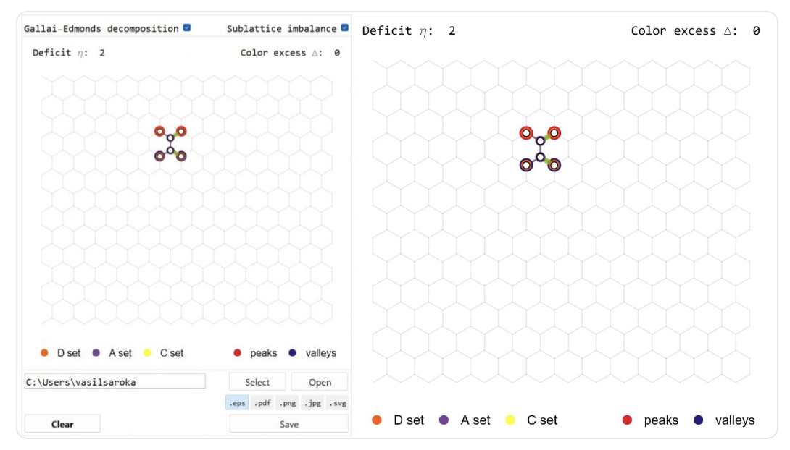
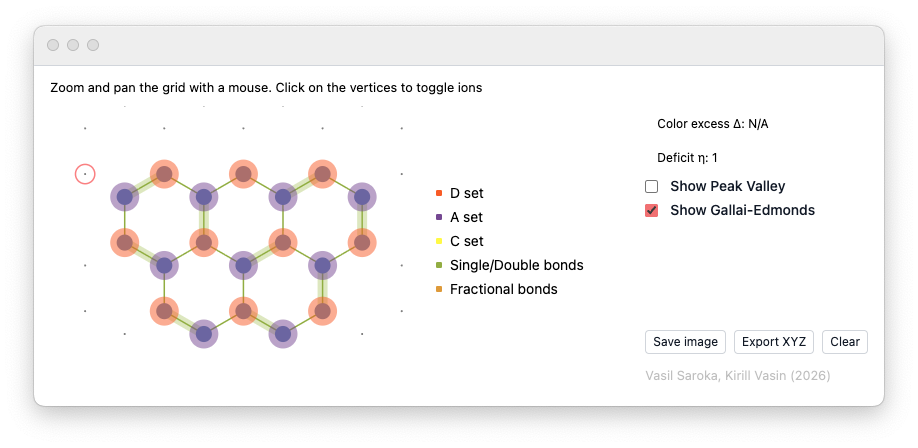
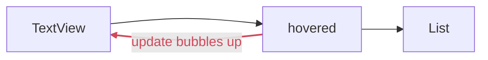
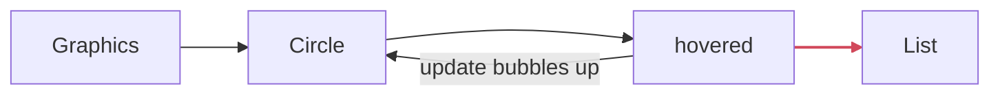

{/* add this script to the body  */}
{/* https://cdn.jsdelivr.net/gh/WLJSTeam/web-components@latest/src/common/app.js */}
<wljs-store json="./attachments/4244f138-80ab-4f91-a153-a80257c12b2e.txt"></wljs-store>

Theoretical physicist and programmer [Dr. Vasil Saroka](https://www.linkedin.com/in/vasil-saroka/) recently built a small interactive Wolfram Language application, `NanographenesBuilder`, that helps chemists construct hydrocarbons and explore their structural properties using graph theory.

<small>Original widget window developed for Woflram Mathematica</small>

He later asked me (@JerryI) whether it could also run in WLJS Notebook (and may be much faster). That is how this short story began 🚀

<small>Current reimplementation of Nanographenes Builder for WLJS</small>

We will go through the basics of low-level dynamics, reactive programming, event systems, asynchronous programming, and writing apps with WLJS.

<Cards>
  <DownloadFile
    title="Download"
    description="Get Nanographene Builder"
    href="./Nanographene-Builder.wlw"
  />

  <DownloadFile
    title="Download"
    description="Get the source code and this blog post"
    href="./Nanographene-Builder.wln"
  />  
  
</Cards>

## Mathematica vs. WLJS Notebook

For static output, there is little difference between Mathematica and WLJS Notebook: both use the Wolfram Language standard library and the same kernel. For interactive elements and user input, both provide `Manipulate` and `Animate`, which cover many common use cases. At a lower level, however, their dynamic UI models diverge:

| Concern | Mathematica | WLJS Notebook |
| --- | --- | --- |
| Rendering model | Immediate mode | Retained mode |
| Reactive updates | Automatic dependency tracking and reevaluation | Explicit, granular updates |
| Data binding | Two-way symbol binding | One-way symbol binding, with events for input elements |

Of course, for `Manipulate` or `Refresh` expressions, WLJS has to emulate an immediate mode with dependency tracking, bridging the gap between two different systems.

In any case, `Dynamic` and `DynamicModule` cannot be directly translated from Mathematica to WLJS since they are based on two different paradigms.

## Basics
### A few steps back
Let’s begin with what we are trying to achieve. Vasil developed an application in which users navigate a hexagonal lattice and toggle vertices with the mouse. Each selected vertex represents a carbon atom. In the end, the resulting nanographene structure can be represented as a graph, which allows us to apply graph-theoretic methods to analyze its structure and bond properties. For example, maximum matching and the Gallai-Edmonds decomposition can identify unmatched vertices, calculate the matching deficit, and so on. Related matching-based analysis can also provide a simplified model of fixed and delocalized bonds.

This can be very useful for chemists who want to quickly sketch a structure and export it as XYZ or as an image.

### The Algorithm
We won't go into the details of the analysis code (@JerryI knows only a little about this subject), but it is clear that we can separate it from the GUI into a self-contained module that does three things:

1. Generates a hexagonal lattice and returns its XY coordinates
2. Takes the toggled vertices and returns the resulting bonds and their properties
3. Takes the results of (2) and exports them in XYZ text format

Here is the full code for this part, developed by Vasil:

<WLJSWrapper>
<wljs-editor lazy="true" display="codemirror" type="Input" editable="true" fade="true" >{`HexGrid;
	NanographeneAnalysis;
	SelectedXYZString;
	
	RibbonUnitCell[] := <|
	  "Atoms" -> {
	    {0., 0., 0.}, {0., 1.42, 0.}, {-1.2297560733739028, -0.71, 0.},
	    {-1.2297560733739028, 2.13, 0.}, {-2.4595121467478056, 0., 0.},
	    {-2.4595121467478056, 1.42, 0.}, {-3.6892682201217086, -0.71, 0.},
	    {-3.6892682201217086, 2.13, 0.}, {-4.919024293495611, 0., 0.},
	    {-4.919024293495611, 1.42, 0.}, {-6.148780366869514, -0.71, 0.},
	    {-6.148780366869514, 2.13, 0.}, {-7.378536440243417, 0., 0.},
	    {-7.378536440243417, 1.42, 0.}, {-8.60829251361732, -0.71, 0.},
	    {-8.60829251361732, 2.13, 0.}, {-9.838048586991222, 0., 0.},
	    {-9.838048586991222, 1.42, 0.}, {-11.067804660365125, -0.71, 0.},
	    {-11.067804660365125, 2.13, 0.}, {-12.297560733739028, 0., 0.},
	    {-12.297560733739028, 1.42, 0.}, {-13.52731680711293, -0.71, 0.},
	    {-13.52731680711293, 2.13, 0.}, {-14.757072880486835, 0., 0.},
	    {-14.757072880486835, 1.42, 0.}, {-15.986828953860737, -0.71, 0.},
	    {-15.986828953860737, 2.13, 0.}, {-17.21658502723464, 0., 0.},
	    {-17.21658502723464, 1.42, 0.}, {-18.446341100608542, -0.71, 0.},
	    {-18.446341100608542, 2.13, 0.}, {-19.676097173982445, 0., 0.},
	    {-19.676097173982445, 1.42, 0.}, {-20.905853247356347, -0.71, 0.},
	    {-20.905853247356347, 2.13, 0.}, {-22.13560932073025, 0., 0.},
	    {-22.13560932073025, 1.42, 0.}, {-23.365365394104153, -0.71, 0.},
	    {-23.365365394104153, 2.13, 0.}, {-24.595121467478055, 0., 0.},
	    {-24.595121467478055, 1.42, 0.}, {-25.824877540851958, -0.71, 0.},
	    {-25.824877540851958, 2.13, 0.}, {-27.05463361422586, 0., 0.},
	    {-27.05463361422586, 1.42, 0.}, {-28.284389687599763, -0.71, 0.},
	    {-28.284389687599763, 2.13, 0.}, {-29.51414576097367, 0., 0.},
	    {-29.51414576097367, 1.42, 0.}, {-30.74390183434757, -0.71, 0.},
	    {-30.74390183434757, 2.13, 0.}, {-31.973657907721474, 0., 0.},
	    {-31.973657907721474, 1.42, 0.}, {-33.20341398109538, -0.71, 0.},
	    {-33.20341398109538, 2.13, 0.}
	  },
	  "Translation" -> {0., 4.26, 0.},
	  "CCBondLength" -> 1.42
	|>;
	
	HexGrid[n_Integer : 7] /; n >= 1 := Module[{ribbon = RibbonUnitCell[]},
	  Flatten[
	    Table[# + (i - 1) ribbon["Translation"] & /@ ribbon["Atoms"], {i, n}],
	    1
	  ]
	];
	
	projectionIndices[{1, 1, 0}] := {1, 2};
	projectionIndices[{1, 0, 1}] := {1, 3};
	projectionIndices[{0, 1, 1}] := {2, 3};
	projectionIndices[{1, 1, 1}] := {1, 2, 3};
	projectionIndices[_] := $Failed;
	
	BondIndexPairs[coords_List, a0_ : 1.42, delta_ : 0.3] := Module[{n = Length[coords]},
	  Reap[
	    Do[
	      If[Abs[Norm[coords[[i]] - coords[[j]]] - a0] < delta, Sow[{i, j}]],
	      {i, 1, n - 1}, {j, i + 1, n}
	    ]
	  ][[2]] /. {{} -> {}, {pairs_} :> pairs}
	];
	
	BondSegments[coords_List, a0_ : 1.42, projection_ : {1, 1, 0}, delta_ : 0.3] :=
	  Module[{idx = projectionIndices[projection]},
	    If[idx === $Failed,
	      $Failed,
	      ({coords[[#[[1]], idx]], coords[[#[[2]], idx]]} &) /@
	        BondIndexPairs[coords, a0, delta]
	    ]
	  ];
	
	Options[BondOrderIndexPairs] = {"MaxMatchingsPerComponent" -> 2000};
	
	BondOrderIndexPairs[coords_List, a0_ : 1.42, delta_ : 0.3, OptionsPattern[]] :=
	  Module[
	    {
	      pairs, graph, components, maxMatchingsPerComponent,
	      single = {}, double = {}, aromatic = {}, complete = True,
	      componentMatchingCounts = {}, componentMaximumSizes = {},
	      radicalComponents = {}, componentEdges, componentGraphData, cg,
	      oneMatching, matchSize, perfect,
	      enumeration, matchings, matchingEdges, matchingCount, edgeCount
	    },
	    pairs = BondIndexPairs[coords, a0, delta];
	    graph = NearestNeighborAdjacency[coords, a0, delta];
	    components = connectedComponents[graph];
	    maxMatchingsPerComponent = OptionValue["MaxMatchingsPerComponent"];
	
	    Do[
	      componentEdges = Select[
	        pairs,
	        MemberQ[component, #[[1]]] && MemberQ[component, #[[2]]] &
	      ];
	
	      If[componentEdges =!= {},
	        componentGraphData = componentGraph[component, componentEdges];
	        cg = componentGraphData["Graph"];
	
	        (* One maximum matching tells us the matching size and, by comparing *)
	        (* it to the number of atoms, whether a perfect matching (a Kekule   *)
	        (* structure) exists for this fragment.                              *)
	        oneMatching = First @ maxMatching[Table[0, {Length[cg]}], cg];
	        matchSize = Count[oneMatching, _?(# =!= 0 &)]/2;
	        perfect = (2 matchSize === Length[component]);
	        AppendTo[componentMaximumSizes, matchSize];
	
	        If[perfect,
	          (* Kekulean fragment: a perfect matching exists, so every atom     *)
	          (* carries exactly one double bond in each resonance structure.    *)
	          (* Classify each bond by its (Pauling) double-bond fraction over   *)
	          (* all perfect matchings:                                          *)
	          (*   double in 0 structures     -> single                          *)
	          (*   double in every structure  -> double                          *)
	          (*   double in some but not all -> aromatic (fractional order)     *)
	          enumeration = enumerateMaximumMatchings[cg, maxMatchingsPerComponent];
	          matchings = originalEdgePairs[component, #] & /@ enumeration["Matchings"];
	          matchingEdges = Flatten[matchings, 1];
	          matchingCount = Length[matchings];
	
	          AppendTo[componentMatchingCounts, matchingCount];
	          complete = complete && enumeration["Complete"];
	
	          Do[
	            edgeCount = Count[matchingEdges, edge];
	            Which[
	              edgeCount === 0, AppendTo[single, edge],
	              edgeCount === matchingCount, AppendTo[double, edge],
	              True, AppendTo[aromatic, edge]
	            ],
	            {edge, componentEdges}
	          ],
	
	          (* Non-Kekulean (open-shell / radical) fragment: no perfect        *)
	          (* matching exists, so a resonance bond order is undefined and we   *)
	          (* must NOT smear the bonds into "aromatic". Draw the plain single  *)
	          (* skeleton instead; the unpaired-electron character is reported    *)
	          (* separately via the deficiency / Gallai-Edmonds tools.            *)
	          AppendTo[componentMatchingCounts, 0];
	          AppendTo[radicalComponents, component];
	          single = Join[single, componentEdges]
	        ]
	      ],
	      {component, components}
	    ];
	
	    <|
	      "Single" -> single,
	      "Double" -> double,
	      "Aromatic" -> aromatic,
	      "Complete" -> complete,
	      "ComponentMatchingCounts" -> componentMatchingCounts,
	      "ComponentMaximumSizes" -> componentMaximumSizes,
	      "RadicalComponents" -> radicalComponents,
	      "Method" -> "PerfectMatchingResonance"
	    |>
	  ];
	
	Options[BondOrderSegments] = Options[BondOrderIndexPairs];
	
	BondOrderSegments[
	  coords_List,
	  a0_ : 1.42,
	  projection_ : {1, 1, 0},
	  delta_ : 0.3,
	  opts : OptionsPattern[]
	] :=
	  Module[{idx = projectionIndices[projection], classified},
	    If[idx === $Failed,
	      $Failed,
	      classified = BondOrderIndexPairs[coords, a0, delta, opts];
	      Join[
	        <|
	          "Single" -> segmentsFromIndexPairs[coords, classified["Single"], idx],
	          "Double" -> segmentsFromIndexPairs[coords, classified["Double"], idx],
	          "Aromatic" -> segmentsFromIndexPairs[coords, classified["Aromatic"], idx]
	        |>,
	        KeyDrop[classified, {"Single", "Double", "Aromatic"}]
	      ]
	    ]
	  ];
	
	NearestNeighborAdjacency[coords_List, a0_ : 1.42, delta_ : 0.3] :=
	  Module[{n = Length[coords], graph},
	    graph = Table[{}, {n}];
	    Scan[
	      (
	        AppendTo[graph[[#[[1]]]], #[[2]]];
	        AppendTo[graph[[#[[2]]]], #[[1]]]
	      ) &,
	      BondIndexPairs[coords, a0, delta]
	    ];
	    graph
	  ];
	
	
	SelectedCoordinates[grid_List, selected_List] :=
	  If[selected === {}, {}, grid[[selected]]];
	
	PeakValleyAnalysis[coords_List, a0_ : 1.42, delta_ : 0.3] := Module[
	  {
	    n = Length[coords], v1, v2, v3, vec, aVertices = {}, bVertices = {},
	    valleyRejects = {}, peakRejects = {}, valleys, peaks, pt1, pt2
	  },
	  v1 = a0 {Sqrt[3]/2, 1/2, 0};
	  v2 = a0 {-Sqrt[3]/2, 1/2, 0};
	  v3 = a0 {0, -1, 0};
	
	  Do[
	    If[i =!= j,
	      vec = coords[[j]] - coords[[i]];
	      If[
	        Abs[(vec - v1).(vec - v1)] < delta ||
	          Abs[(vec - v2).(vec - v2)] < delta ||
	          Abs[(vec - v3).(vec - v3)] < delta,
	        AppendTo[aVertices, i],
	        If[
	          Abs[(vec + v1).(vec + v1)] < delta ||
	            Abs[(vec + v2).(vec + v2)] < delta ||
	            Abs[(vec + v3).(vec + v3)] < delta,
	          AppendTo[bVertices, i]
	        ]
	      ]
	    ],
	    {i, 1, n}, {j, 1, n}
	  ];
	
	  aVertices = Union[aVertices];
	  bVertices = Union[bVertices];
	
	  Do[
	    pt1 = coords[[i]];
	    pt2 = coords[[j]];
	    vec = pt2 - pt1;
	    If[Abs[(vec - v3).(vec - v3)] < delta,
	      AppendTo[valleyRejects, i];
	      AppendTo[peakRejects, j]
	    ],
	    {i, aVertices}, {j, bVertices}
	  ];
	
	  valleys = Complement[aVertices, valleyRejects];
	  peaks = Complement[bVertices, peakRejects];
	
	  <|
	    "ValleyIndices" -> valleys,
	    "PeakIndices" -> peaks,
	    "Valleys" -> coords[[valleys]],
	    "Peaks" -> coords[[peaks]],
	    "ColorExcess" -> Abs[Length[peaks] - Length[valleys]]
	  |>
	];
	
	GallaiEdmondsAnalysis[coords_List, a0_ : 1.42, delta_ : 0.3] := Module[
	  {graph, matching, sets, matchingSegments},
	  graph = NearestNeighborAdjacency[coords, a0, delta];
	  {matching, sets} = gallaiEdmondsDecomposition[graph];
	  matchingSegments = MatchingSegments[coords, matching];
	
	  <|
	    "Graph" -> graph,
	    "Matching" -> matching,
	    "MatchingSegments" -> matchingSegments,
	    "DSet" -> sets[[1]],
	    "ASet" -> sets[[2]],
	    "CSet" -> sets[[3]],
	    "Deficit" -> Count[matching, 0]
	  |>
	];
	
	MatchingSegments[coords_List, matching_List] := Module[{seen = matching, segments = {}},
	  Do[
	    If[seen[[i]] =!= 0,
	      AppendTo[segments, {coords[[i, {1, 2}]], coords[[seen[[i]], {1, 2}]]}];
	      seen[[seen[[i]]]] = 0
	    ],
	    {i, Length[seen]}
	  ];
	  segments
	];
	
	Options[NanographeneAnalysis] = {
	  "CCBondLength" -> 1.42,
	  "Delta" -> 0.3,
	  "Projection" -> {1, 1, 0},
	  "IncludePeakValley" -> True,
	  "IncludeGallaiEdmonds" -> True,
	  "IncludeBondOrders" -> False,
	  "MaxMatchingsPerComponent" -> 2000
	};
	
	NanographeneAnalysis[grid_List, selected_List, OptionsPattern[]] := Module[
	  {coords, a0, delta, projection, result},
	  coords = SelectedCoordinates[grid, selected];
	  a0 = OptionValue["CCBondLength"];
	  delta = OptionValue["Delta"];
	  projection = OptionValue["Projection"];
	
	  result = <|
	    "SelectedIndices" -> selected,
	    "Coordinates" -> coords,
	    "BondSegments" -> BondSegments[coords, a0, projection, delta]
	  |>;
	
	  If[coords =!= {} && TrueQ[OptionValue["IncludePeakValley"]],
	    result = Join[result, <|"PeakValley" -> PeakValleyAnalysis[coords, a0, delta]|>]
	  ];
	
	  If[coords =!= {} && TrueQ[OptionValue["IncludeGallaiEdmonds"]],
	    result = Join[result, <|"GallaiEdmonds" -> GallaiEdmondsAnalysis[coords, a0, delta]|>]
	  ];
	
	  If[coords =!= {} && TrueQ[OptionValue["IncludeBondOrders"]],
	    result = Join[
	      result,
	      <|"BondOrders" -> BondOrderSegments[
	        coords,
	        a0,
	        projection,
	        delta,
	        "MaxMatchingsPerComponent" -> OptionValue["MaxMatchingsPerComponent"]
	      ]|>
	    ]
	  ];
	
	  result
	];
	
	HydrogenPositions[coords_List, ccBondLength_ : 1.42, cxBondLength_ : 1.09, delta_ : 0.3] :=
	  Module[
	    {
	      n = Length[coords], rm1, rm2, v1, v2, v3, xPositions = {},
	      neighbors, v, vec, dir
	    },
	    rm1 = RotationMatrix[Pi/3, {0, 0, 1}];
	    rm2 = RotationMatrix[-Pi/3, {0, 0, 1}];
	    v1 = cxBondLength {Sqrt[3]/2, 1/2, 0};
	    v2 = cxBondLength {-Sqrt[3]/2, 1/2, 0};
	    v3 = cxBondLength {0, -1, 0};
	
	    Do[
	      neighbors = {};
	      Do[
	        v = coords[[i]] - coords[[j]];
	        If[Abs[Norm[v] - ccBondLength] < delta, AppendTo[neighbors, coords[[j]]]];
	        If[Length[neighbors] > 2, Break[]],
	        {j, n}
	      ];
	
	      Switch[Length[neighbors],
	        2,
	          vec = -(neighbors[[1]] - coords[[i]] + neighbors[[2]] - coords[[i]]);
	          AppendTo[xPositions, coords[[i]] + Normalize[vec] cxBondLength],
	        1,
	          vec = -(neighbors[[1]] - coords[[i]]);
	          AppendTo[xPositions, coords[[i]] + (Normalize[vec] cxBondLength).rm1];
	          AppendTo[xPositions, coords[[i]] + (Normalize[vec] cxBondLength).rm2],
	        0,
	          dir = RandomChoice[{-1, 1}];
	          AppendTo[xPositions, coords[[i]] + dir v1];
	          AppendTo[xPositions, coords[[i]] + dir v2];
	          AppendTo[xPositions, coords[[i]] + dir v3]
	      ],
	      {i, n}
	    ];
	    xPositions
	  ];
	
	ExportCXXYZString[
	  coords_List,
	  ccBondLength_ : 1.42,
	  cxBondLength_ : 1.09,
	  xLabel_String : "H",
	  tag_String : DefaultExportTag[]
	] := Module[
	  {xPositions, labels, allCoords, firstLine, rows, formatNumber},
	  xPositions = HydrogenPositions[coords, ccBondLength, cxBondLength];
	  labels = Join[ConstantArray["C", Length[coords]], ConstantArray[xLabel, Length[xPositions]]];
	  allCoords = Join[coords, xPositions];
	  firstLine = "C" <> ToString[Length[coords]] <> xLabel <> ToString[Length[xPositions]] <> tag;
	  formatNumber[x_] := ToString[PaddedForm[1.0 x, {9, 6}], OutputForm];
	  rows = MapThread[
	    StringRiffle[{#1, formatNumber[#2[[1]]], formatNumber[#2[[2]]], formatNumber[#2[[3]]]}, "\\t"] &,
	    {labels, allCoords}
	  ];
	  StringRiffle[Join[{firstLine}, rows], "\\n"] <> "\\n"
	];
	
	ExportCXXYZ[
	  coords_List,
	  ccBondLength_ : 1.42,
	  cxBondLength_ : 1.09,
	  xLabel_String : "H",
	  path_String,
	  tag_String : DefaultExportTag[]
	] := Export[path, ExportCXXYZString[coords, ccBondLength, cxBondLength, xLabel, tag], "Text"];
	
	(* Plain XYZ structure of the chosen points only (no hydrogens added). *)
	(* Format: line 1 = atom count, line 2 = comment, then "<label> x y z" rows. *)
	SelectedXYZString[
	  coords_List,
	  label_String : "C",
	  comment_String : "Selected points from GrapheneApp"
	] := Module[{n = Length[coords], rows, formatNumber},
	  formatNumber[x_] := ToString[PaddedForm[1.0 x, {10, 6}], OutputForm];
	  rows = (StringRiffle[
	       {label, formatNumber[#[[1]]], formatNumber[#[[2]]], formatNumber[#[[3]]]},
	       "\\t"
	     ] &) /@ coords;
	  StringRiffle[Join[{ToString[n], comment}, rows], "\\n"] <> "\\n"
	];
	
	ExportSelectedXYZ[coords_List, path_String, label_String : "C"] :=
	  Export[path, SelectedXYZString[coords, label], "Text"];
	
	segmentsFromIndexPairs[coords_List, pairs_List, projectionIndices_List] :=
	  ({coords[[#[[1]], projectionIndices]], coords[[#[[2]], projectionIndices]]} &) /@ pairs;
	
	connectedComponents[graph_List] := Module[
	  {n = Length[graph], unseen, components = {}, root, queue, component, v, neighbors},
	  unseen = Range[n];
	  While[unseen =!= {},
	    root = First[unseen];
	    queue = {root};
	    component = {};
	    unseen = DeleteCases[unseen, root];
	
	    While[queue =!= {},
	      v = First[queue];
	      queue = Rest[queue];
	      AppendTo[component, v];
	      neighbors = Intersection[graph[[v]], unseen];
	      queue = Join[queue, neighbors];
	      unseen = Complement[unseen, neighbors];
	    ];
	
	    AppendTo[components, Sort[component]];
	  ];
	  components
	];
	
	componentGraph[vertices_List, edges_List] := Module[
	  {map, graph, i, j},
	  map = AssociationThread[vertices -> Range[Length[vertices]]];
	  graph = Table[{}, {Length[vertices]}];
	
	  Do[
	    i = map[edge[[1]]];
	    j = map[edge[[2]]];
	    AppendTo[graph[[i]], j];
	    AppendTo[graph[[j]], i],
	    {edge, edges}
	  ];
	
	  <|"Graph" -> (Sort /@ graph), "Map" -> map|>
	];
	
	originalEdgePairs[vertices_List, matching_List] :=
	  Sort /@ ({vertices[[#[[1]]]], vertices[[#[[2]]]]} & /@ matching);
	
	enumerateMaximumMatchings[graph_List, maxCount_ : 2000] := Module[
	  {n = Length[graph], targetSize, result = {}, complete = True, cap, rec, matching},
	  matching = First@maxMatching[Table[0, {Length[graph]}], graph];
	  targetSize = Count[matching, _?(# =!= 0 &)]/2;
	  cap = maxCount;
	
	  rec[remaining_List, current_List] := Module[{v, rest, candidates},
	    If[cap =!= Infinity && Length[result] >= cap,
	      complete = False;
	      Return[]
	    ];
	
	    If[Length[current] === targetSize,
	      AppendTo[result, Sort[Sort /@ current]];
	      Return[]
	    ];
	
	    If[remaining === {}, Return[]];
	    If[Length[current] + Floor[Length[remaining]/2] < targetSize, Return[]];
	
	    v = First[remaining];
	    rest = Rest[remaining];
	
	    If[Length[current] + Floor[Length[rest]/2] >= targetSize,
	      rec[rest, current]
	    ];
	
	    candidates = Intersection[graph[[v]], rest];
	    Do[
	      rec[DeleteCases[rest, u], Append[current, Sort[{v, u}]]],
	      {u, candidates}
	    ];
	  ];
	
	  rec[Range[n], {}];
	
	  <|
	    "Size" -> targetSize,
	    "Matchings" -> result,
	    "Complete" -> complete
	  |>
	];
	
	gallaiEdmondsDecomposition[graph_List] := Module[
	  {glen, matching, trees, len, sdList, tree, vertices, vertexTypes, s, d, sSet, dSet, cSet},
	  glen = Length[graph];
	  matching = Table[0, {glen}];
	  {matching, trees} = maxMatching[matching, graph];
	
	  If[FreeQ[matching, 0],
	    {matching, {{}, {}, Range[glen]}},
	    len = Length[trees];
	    sdList = {};
	    Do[
	      tree = trees[[i]];
	      vertices = Select[Flatten[Position[tree, {_?(# =!= 0 &), _}]], # <= glen &];
	      If[vertices =!= {},
	        vertexTypes = tree[[vertices, 2]];
	        s = {};
	        d = {};
	        Do[
	          If[vertexTypes[[j]] === 1, AppendTo[s, vertices[[j]]], AppendTo[d, vertices[[j]]]],
	          {j, Length[vertices]}
	        ];
	        AppendTo[sdList, {s, d}]
	      ],
	      {i, len}
	    ];
	
	    {sSet, dSet} = If[sdList === {}, {{}, {}}, Union @@ # & /@ Transpose[sdList]];
	    cSet = Complement[Range[glen], sSet, dSet];
	    {matching, {dSet, sSet, cSet}}
	  ]
	];
	
	maxMatching[matching_List, graph_List] := Module[{augPath = {}, largerMatching, trees},
	  largerMatching = matching;
	  {augPath, trees} = augmentingPath[largerMatching, graph];
	
	  If[augPath =!= {},
	    Do[
	      largerMatching[[augPath[[2 i]]]] = augPath[[2 i - 1]];
	      largerMatching[[augPath[[2 i - 1]]]] = augPath[[2 i]],
	      {i, Length[augPath]/2}
	    ];
	    maxMatching[largerMatching, graph],
	    {largerMatching, trees}
	  ]
	];
	
	augmentingPath[matching_List, graph_List] := Catch[
	  Module[
	    {
	      path = {}, freeVertices, trees, parent, queue, idx, path0, path1,
	      commonPath, base, cycle, newGraph, len, contractedNode, newNode,
	      vertexNumbers, substitutions, newMatching, pos, splitPosition
	    },
	    freeVertices = RandomSample[Flatten[Position[matching, 0]]];
	    trees = {};
	
	    While[freeVertices =!= {},
	      idx = First[freeVertices];
	      freeVertices = Rest[freeVertices];
	
	      parent = Table[{0, 0}, {Length[graph]}];
	      queue = {};
	      parent[[idx]] = {-1, 0};
	      AppendTo[queue, idx];
	
	      While[queue =!= {},
	        idx = First[queue];
	        queue = Rest[queue];
	
	        Do[
	          If[matching[[i]] =!= 0 && parent[[i, 1]] === 0,
	            AppendTo[queue, matching[[i]]];
	            parent[[i]] = {idx, 1};
	            parent[[matching[[i]], 1]] = i,
	            If[parent[[i, 1]] =!= 0,
	              If[parent[[idx, 2]] === parent[[i, 2]],
	                path0 = Reverse@Most@NestWhileList[parent[[#, 1]] &, idx, (# =!= -1) &];
	                path1 = Reverse@Most@NestWhileList[parent[[#, 1]] &, i, (# =!= -1) &];
	                commonPath = {};
	                Do[
	                  If[path0[[j]] === path1[[j]], AppendTo[commonPath, path0[[j]]]],
	                  {j, Min[Length[path0], Length[path1]]}
	                ];
	                base = commonPath[[-1]];
	                cycle = Join[
	                  {base},
	                  DeleteCases[path0, Alternatives @@ path1],
	                  Reverse@DeleteCases[path1, Alternatives @@ path0]
	                ];
	
	                newGraph = graph;
	                len = Length[newGraph];
	                contractedNode = len + 1;
	                newNode = {};
	                newMatching = matching;
	
	                If[parent[[base, 1]] =!= -1,
	                  newMatching[[parent[[base, 1]]]] = contractedNode;
	                  AppendTo[newMatching, parent[[base, 1]]],
	                  AppendTo[newMatching, 0]
	                ];
	
	                Do[
	                  vertexNumbers = DeleteCases[newGraph[[j]], Alternatives @@ cycle];
	                  newNode = Join[newNode, vertexNumbers];
	                  newGraph[[j]] = {};
	                  newMatching[[j]] = 0,
	                  {j, cycle}
	                ];
	
	                substitutions = (# -> contractedNode) & /@ cycle;
	                Do[
	                  newGraph[[j]] = newGraph[[j]] /. substitutions,
	                  {j, newNode}
	                ];
	
	                AppendTo[newGraph, newNode];
	                {path, trees} = augmentingPath[newMatching, newGraph];
	
	                If[! FreeQ[path, contractedNode],
	                  pos = Position[path, contractedNode][[1, 1]];
	                  path = Switch[
	                    pos,
	                    1,
	                      splitPosition = Position[
	                        cycle,
	                        Intersection[graph[[path[[2]]]], cycle][[1]]
	                      ][[1, 1]];
	                      If[OddQ[splitPosition],
	                        Join[cycle[[1 ;; splitPosition]], Rest[path]],
	                        Join[Reverse[Join[cycle[[splitPosition ;; All]], {cycle[[1]]}]], Rest[path]]
	                      ],
	                    Length[path],
	                      splitPosition = Position[
	                        cycle,
	                        Intersection[graph[[path[[-2]]]], cycle][[1]]
	                      ][[1, 1]];
	                      If[OddQ[splitPosition],
	                        Join[Most[path], Reverse[cycle[[1 ;; splitPosition]]]],
	                        Join[Most[path], Join[cycle[[splitPosition ;; All]], {cycle[[1]]}]]
	                      ],
	                    _,
	                      splitPosition = Position[
	                        cycle,
	                        Intersection[graph[[path[[pos + 1]]]], cycle][[1]]
	                      ][[1, 1]];
	                      If[OddQ[splitPosition],
	                        Join[path[[1 ;; pos - 1]], cycle[[1 ;; splitPosition]], path[[pos + 1 ;; All]]],
	                        Join[
	                          path[[1 ;; pos - 1]],
	                          Reverse[Join[cycle[[splitPosition ;; All]], {cycle[[1]]}]],
	                          path[[pos + 1 ;; All]]
	                        ]
	                      ]
	                  ]
	                ];
	                Throw[{path, trees}]
	              ],
	              If[matching[[i]] === 0,
	                path = Prepend[
	                  Most@NestWhileList[parent[[#, 1]] &, idx, (# =!= -1) &],
	                  i
	                ];
	                Throw[{path, trees}]
	              ]
	            ]
	          ],
	          {i, graph[[idx]]}
	        ]
	      ];
	
	      AppendTo[trees, parent];
	    ];
	
	    {path, trees}
	  ]
	];`}</wljs-editor></WLJSWrapper>

### Implementing selector
The first step is simple: let's generate a lattice and draw it.

<WLJSWrapper>
<wljs-editor lazy="true" display="codemirror" type="Input" editable="true"  >{`grid = HexGrid[6];
	Graphics[grid//Point, ImageSize->300]`}</wljs-editor></WLJSWrapper>

<WLJSWrapper><wljs-editor lazy="true" display="codemirror" type="Output"  >{`(*VB[*)(FrontEndRef["2c2ddd6a-e7bc-46d4-beaf-53ad02479dd9"])(*,*)(*"1:eJxTTMoPSmNkYGAoZgESHvk5KRCeEJBwK8rPK3HNS3GtSE0uLUlMykkNVgEKGyUbpaSkmCXqpponJeuamKWY6CalJqbpmhonphgYmZhbpqRYAgCapRaS"*)(*]VB*)`}</wljs-editor></WLJSWrapper>

The next step is to track the user's mouse and check whether they clicked on a vertex. There are multiple ways to do that. You can attach an event handler to each individual point, but if you have 100-1000 of them, this will be a waste of resources. It is more efficient to track the mouse position globally across the whole canvas and check for an intersection in the kernel:

<WLJSWrapper>
<wljs-editor lazy="true" display="codemirror" type="Input" editable="true"  >{`EventHandler[Graphics[{
	  grid//Point
	}, ImageSize->300, "Controls"->False], {
	  "mousemove" -> moveAction,
	  "click" -> clickAction
	}]`}</wljs-editor></WLJSWrapper>

In Mathematica, it would be something like `Dynamic[MousePosition[]]`, while here we explicitly attach `EventHandler` to the `Graphics` primitive and subscribe to two event patterns: `"mousemove"` and `"click"`. Let's define our handlers:

<WLJSWrapper>
<wljs-editor lazy="true" display="codemirror" type="Input" editable="true"  >{`hovered = {-15.,10.};
	moveAction[xy_] := hovered = Round[xy,0.1];`}</wljs-editor></WLJSWrapper>

To see the coordinates, we bind them to a `TextView` expression:

<WLJSWrapper>
<wljs-editor lazy="true" display="codemirror" type="Input" editable="true"  >{`TextView[hovered//Offload]`}</wljs-editor></WLJSWrapper>

<WLJSWrapper><wljs-editor lazy="true" display="codemirror" type="Output"  >{`(*VB[*)(FrontEndRef["b3d4e7ac-e481-4b87-b052-8988da85a450"])(*,*)(*"1:eJxTTMoPSmNkYGAoZgESHvk5KRCeEJBwK8rPK3HNS3GtSE0uLUlMykkNVgEKJxmnmKSaJybrpppYGOqaJFmY6yYZmBrpWlhaWKQkWpgmmpgaAACJqxV9"*)(*]VB*)`}</wljs-editor></WLJSWrapper>

This is exactly what *one-way binding* means. Instead of `Dynamic`, we use `Offload`, which has the `HoldFirst` attribute and prevents evaluation of the `hovered` symbol. Whenever `hovered` changes, the nearest parent expression outside `Offload` is reevaluated or updated. The update cycle starts at the bottom and then propagates top-down:

Not all expressions support this, since it is a dedicated feature listed in the documentation.

Let's rewrite our handler function to check for an intersection with the nearest grid point and snap the cursor to it:

<WLJSWrapper>
<wljs-editor lazy="true" display="codemirror" type="Input" editable="true"  >{`hovered = {-15.,10.};
	
	ClearAll[moveAction];
	moveAction[xy_] := With[{
	  (* match the mouse cursor to the nearest grid point *)
	  found = SelectFirst[
	    grid, Function[point, Norm[point[[;;2]] - xy] < 0.7]
	  ]},
	    If[!MissingQ[found], 
	      hovered = found;
	    ]
	];`}</wljs-editor></WLJSWrapper>

Much better! Let's add a red visual guide to show where the snapped point is on the lattice. For that, we use `Circle` with its first argument bound to the `hovered` symbol:

<WLJSWrapper>
<wljs-editor lazy="true" display="codemirror" type="Input" editable="true"  >{`EventHandler[Graphics[{
	  grid//Point, Red, Circle[hovered//Offload, 0.5]
	}, ImageSize->300, "Controls"->False], {
	  "mousemove" -> moveAction,
	  "click" -> clickAction
	}]`}</wljs-editor></WLJSWrapper>
 
<LazyVideo  className="invertColor" style={{width:"fit-content"}} url="./vid1.mp4"/>

This effectively gives us the following diagram on any change of `hovered` symbol:

Note here, that the propagation of update calls stops after reaching `Circle`, i.e. `Graphics` will not receive any. It always bubbles up to the nearest parent (skipping basic math operations, lists or pure functions).

Now for the click action. Let's define `selectedList` to store our toggled vertices as indices and `selectedCoords` to store their actual coordinates. We will need both later:

<WLJSWrapper>
<wljs-editor lazy="true" display="codemirror" type="Input" editable="true"  >{`selectedCoords = {};
	selectedList = {};
	
	ClearAll[clickAction];
	clickAction[xy_] := With[{
	  idx = Position[grid, hovered][[1,1]]
	},
	  (* toggle selection *)
	  selectedList = If[MemberQ[selectedList, idx], 
	    selectedList /. idx -> Nothing,
	    Append[selectedList, idx]
	  ];
	
	  If[Length[selectedList] == 0, Return[]];
	  
	  (* update coordinates *)
	  selectedCoords = grid[[selectedList]];
	  
	  (* rerun "analysis" *)
	  runAnalysis;
	]`}</wljs-editor></WLJSWrapper>

Here we also leave `runAnalysis` undefined, implying that we will reanalyze all bonds whenever our grid changes. For now, it won't have any effect.

As the final step, we need to indicate the selected vertices from the list. How? Let's use `Disk` primitives:

<WLJSWrapper>
<wljs-editor lazy="true" display="codemirror" type="Input" editable="true"  >{`hovered = {-15.,10.};
	
	EventHandler[Graphics[{
	  {Opacity[0.25], grid//Point}, Black, 
	  Disk[selectedCoords//Offload, 0.4],
	  Red, Circle[hovered//Offload, 0.5]
	}, ImageSize->300, "Controls"->False], {
	  "mousemove" -> moveAction,
	  "click" -> clickAction
	}]`}</wljs-editor></WLJSWrapper>

<LazyVideo className="invertColor" style={{width:"fit-content"}} url="./vid2.mp4"/>

This is how we can make a basic selector/toggler for the vertices: one `Graphics` block with `EventHandler` and two handler functions, one for clicks and one for mouse movements.

### Drawing bonds
The analysis classifies each bond as single, double, or aromatic (fractional order). For example:

<WLJSWrapper>
<wljs-editor lazy="true" display="codemirror" type="Input" editable="true"  >{`NanographeneAnalysis[
	  grid,
	  selectedList,
	  "CCBondLength" -> 1.42,
	  "Projection" -> {1, 1, 0},
	  "Delta" -> 0.3,
	  "IncludeBondOrders" -> True
	];
	Short[%["BondOrders"]//Normal, 10]`}</wljs-editor></WLJSWrapper>

<WLJSWrapper><wljs-editor lazy="true" display="codemirror" type="Output" encoded="true"  >{`%7B%0A%20%22Single%22-%3E%7B%7B%7B-13.52731680711293%60%2C12.07%60%7D%2C%7B-13.52731680711293%60%2C10.649999999999999%60%7D%7D%7D%2C%0A%20%22Double%22-%3E%7B%7B%7B-14.757072880486835%60%2C9.94%60%7D%2C%7B-13.52731680711293%60%2C10.649999999999999%60%7D%7D%2C%7B%7B-14.757072880486835%60%2C12.78%60%7D%2C%7B-13.52731680711293%60%2C12.07%60%7D%7D%7D%2C%0A%20%3C%3CRule%3E%3E%2C%0A%20%22Complete%22-%3ETrue%2C%0A%20%22ComponentMatchingCounts%22-%3E%7B1%2C2%7D%2C%0A%20%22ComponentMaximumSizes%22-%3E%7B2%2C3%7D%2C%0A%20%22RadicalComponents%22-%3E%7B%7D%2C%0A%20%22Method%22-%3E%22PerfectMatchingResonance%22%0A%7D`}</wljs-editor></WLJSWrapper>

The most straightforward approach is to define a symbol called `lineBonds` and store all bonds there as three arrays. However, we can distinguish between these types not only by color, but also by drawing double bonds as two offset lines. Here is a helper function for that:

<WLJSWrapper>
<wljs-editor lazy="true" display="codemirror" type="Input" editable="true"  >{`(* Used to draw double bonds. *)
	offset[lines_, c_] := Map[Function[segments,
	  With[{normal = {1,-1} Normal[segments[[2]]-segments[[1]]][[{2,1}]]},
	    {segments[[1]]  + normal c, segments[[2]] + normal c}
	  ]
	], lines]`}</wljs-editor></WLJSWrapper>

It is time to define our `runAnalysis` symbol, which will update all bonds:

<WLJSWrapper>
<wljs-editor lazy="true" display="codemirror" type="Input" editable="true"  >{`lineBonds = {{}, {}, {}};
	
	ClearAll[runAnalysis];
	runAnalysis := Module[{results = NanographeneAnalysis[
	  grid,
	  selectedList,
	  "CCBondLength" -> 1.42,
	  "Projection" -> {1, 1, 0},
	  "Delta" -> 0.3,
	  "IncludeBondOrders" -> True
	], noBonds = False},
	
	  noBonds = !KeyExistsQ[results, "BondOrders"];
	
	  (* assign either an empty list or three types of bonds *)
	  lineBonds = If[noBonds, {{}, {}, {}}, {
	    results["BondOrders", "Single"],
	    Join[
	      offset[results["BondOrders", "Double"], 0.1],
	      offset[results["BondOrders", "Double"], -0.1]
	    ],
	    results["BondOrders", "Aromatic"]
	  }];
	];`}</wljs-editor></WLJSWrapper>

It is important to note that if no bonds are formed, we need to assign three empty arrays to our `lineBonds` symbol.

Let's reconstruct our graphics canvas with these types of bonds added:

<WLJSWrapper>
<wljs-editor lazy="true" display="codemirror" type="Input" editable="true"  >{`hovered = {-15.,10.};
	
	EventHandler[graphics = Graphics[{
	  {Opacity[0.25], grid//Point}, Black,
	  { 
	    AbsoluteThickness[4],
	    ColorData[97][2],
	    Line[lineBonds[[1]]//Offload],
	    ColorData[97][3],
	    { AbsoluteThickness[2], 
	      Line[lineBonds[[2]]//Offload]
	    },
	    ColorData[97][9],
	    Line[lineBonds[[3]]//Offload]
	  },  
	  Disk[selectedCoords//Offload, 0.4],
	  Red, Circle[hovered//Offload, 0.5]
	}, ImageSize->300, "Controls"->False], {
	  "mousemove" -> moveAction,
	  "click" -> clickAction
	}]`}</wljs-editor></WLJSWrapper>

<LazyVideo className="invertColor" style={{width:"fit-content"}} url="./vid3.mp4"/>

As a basic UI element, it is worth adding a *Clear* button:

<WLJSWrapper>
<wljs-editor lazy="true" display="codemirror" type="Input" editable="true"  >{`EventHandler[InputButton["Clear"], (
	  selectedCoords = {};
	  selectedList = {};
	  runAnalysis;
	)&]`}</wljs-editor></WLJSWrapper>

<WLJSWrapper><wljs-editor lazy="true" display="codemirror" type="Output"  >{`(*VB[*)(EventObject[<|"Id" -> "4926dd82-b6e1-4fb3-a34f-7256ce627c55", "Initial" -> False, "View" -> "b18b7379-6c86-49be-8f46-848e364563b1"|>])(*,*)(*"1:eJxTTMoPSmNkYGAoZgESHvk5KRCeEJBwK8rPK3HNS3GtSE0uLUlMykkNVgEKJxlaJJkbm1vqmiVbmOmaWCal6lqkmZjpWphYpBqbmZiaGScZAgB8KxUE"*)(*]VB*)`}</wljs-editor></WLJSWrapper>

The same can be done in Mathematica style with implicit event binding:

<WLJSWrapper>
<wljs-editor lazy="true" display="codemirror" type="Input" editable="true"  >{`Button["Clear",
	  selectedCoords = {};
	  selectedList = {};
	  runAnalysis;
	]`}</wljs-editor></WLJSWrapper>

<WLJSWrapper><wljs-editor lazy="true" display="codemirror" type="Output"  >{`(*VB[*)(EventObject[<|"Id" -> "0bf96dd9-89dd-4973-87d2-ab1bbd4770d3", "Initial" -> False, "View" -> "a569d8ce-1f9f-44d3-9130-b809fc6fa390"|>])(*,*)(*"1:eJxTTMoPSmNkYGAoZgESHvk5KRCeEJBwK8rPK3HNS3GtSE0uLUlMykkNVgEKJ5qaWaZYJKfqGqZZpumamKQY61oaGhvoJlkYWKYlm6UlGlsaAACIoRWz"*)(*]VB*)`}</wljs-editor></WLJSWrapper>

### Exporting as image or XYZ
Finally, we need an option to render it as an image and also export it to a text file.

We shall start with the latter, since it is the most straightforward. To ask the user for a file path, we need `SystemDialogInput`:

<WLJSWrapper>
<wljs-editor lazy="true" display="codemirror" type="Input" editable="true"  >{`SystemDialogInput["FileSave", {Null, {
	    "ASCII" -> {"*.xyz", "*.dat"}
	}}]`}</wljs-editor></WLJSWrapper>

<WLJSWrapper><wljs-editor lazy="true" display="codemirror" type="Output"  >{`"/Users/kirill/Downloads/Untitled.xyz"`}</wljs-editor></WLJSWrapper>

Note that `SystemDialogInput` __is a blocking function__. It pauses kernel evaluation until the request is resolved. This can be very bad if we use it inside a `Button` or an event handler function. Wolfram Kernel uses a kind of event loop for timers and calls from outside (such as our notebook GUI), and we don't want to block it completely. Therefore, let's use `SystemDialogInputAsync`.

<WLJSWrapper>
<wljs-editor lazy="true" display="codemirror" type="Input" editable="true"  >{`SystemDialogInputAsync["FileSave", {Null, {
	    "ASCII" -> {"*.xyz", "*.dat"}
	}}]`}</wljs-editor></WLJSWrapper>

<WLJSWrapper><wljs-editor lazy="true" display="codemirror" type="Output"  >{`Promise["7e249171-f84c-42d6-bbfa-24c44dcfa94b"]`}</wljs-editor></WLJSWrapper>

This returns a `Promise`, which one can subscribe to or pipe through a `Then` expression:

<WLJSWrapper>
<wljs-editor lazy="true" display="codemirror" type="Input" editable="true"  >{`Then[SystemDialogInputAsync["FileSave", {Null, {
	    "ASCII" -> {"*.xyz", "*.dat"}
	}}], Print]`}</wljs-editor></WLJSWrapper>

If we have many of these promise-based expressions, we might eventually end up in [callback hell](https://callbackhell.com/). To avoid this, many programming languages introduced async functions, and WLJS did too:

<WLJSWrapper>
<wljs-editor lazy="true" display="codemirror" type="Input" editable="true"  >{`AsyncFunction[Null, Module[{path},
	  path = SystemDialogInputAsync["FileSave", {Null, {
	    "ASCII" -> {"*.xyz", "*.dat"}
	  }}];
	
	  path = path // Await;
	
	  Print[path];
	]][];`}</wljs-editor></WLJSWrapper>

`AsyncFunction` allows us to write asynchronous code, as in the previous example, as if it were sequential. This is useful for long-running user requests or tasks running on a parallel kernel. Each `Await` statement effectively wraps the rest of the code in an internal *callback*. This is still an experimental feature, and it might not work nicely with `Return` statements. However, it is good enough for our use case:

<WLJSWrapper>
<wljs-editor lazy="true" display="codemirror" type="Input" editable="true"  >{`Button["Export XYZ", AsyncFunction[Null, Module[{path, d},
	  path = SystemDialogInputAsync["FileSave", {Null, {
	    "ASCII" -> {"*.xyz", "*.dat"}
	  }}];
	
	  path = path // Await;
	
	  If[StringQ[path],
	    d = SelectedXYZString[selectedCoords];
	    (* the parallel kernel will write to disk *)
	    ExportAsync[path, d, "Text"] // Await;
	    MessageDialog["Saved to "<>path];
	  ];
	]][]]`}</wljs-editor></WLJSWrapper>

### Rasterization
If you simply call

<WLJSWrapper>
<wljs-editor lazy="true" display="codemirror" type="Input" editable="true"  >{`Rasterize[graphics]`}</wljs-editor></WLJSWrapper>

<WLJSWrapper><wljs-editor lazy="true" display="codemirror" type="Output"  >{`(*VB[*)(FrontEndRef["91f8e1c0-f070-4373-a324-59451bfa8ae6"])(*,*)(*"1:eJxTTMoPSmNkYGAoZgESHvk5KRCeEJBwK8rPK3HNS3GtSE0uLUlMykkNVgEKWxqmWaQaJhvophmYG+iaGJsb6yYaG5nomlqamBompSVaJKaaAQB5uhVB"*)(*]VB*)`}</wljs-editor></WLJSWrapper>

You get a raster image `Image` of our hexagons. The same approach used on XYZ export can be applied here. There is an async variant of `Rasterize` called `RasterizeAsync`. Let's write it as well.

<WLJSWrapper>
<wljs-editor lazy="true" display="codemirror" type="Input" editable="true"  >{`Button["Save image", AsyncFunction[Null, Module[{img, path, plot},
	  (* ask for a path to save to *)
	  path = SystemDialogInputAsync["FileSave", {Null, {"Raster Formats" -> {"*.jpg", "*.png"}}}];
	  path = path // Await;
	
	  (* prepare the plot; remove Offload because we don't need dynamics *)
	  plot = graphics /. Offload->Identity;
	  
	  If[StringQ[path],
	    img = RasterizeAsync[plot] // Await;  
	    (* rendering will happen offscreen *)
	    (* the parallel kernel will write to disk *)
	    ExportAsync[path, img] // Await;
	    MessageDialog["Saved to "<>path];
	  ];
	]][Null]]`}</wljs-editor></WLJSWrapper>

---

## Polishing into an app
In order to use it as an app, we need to fix a few things:
- Remove side effects from functions
- Add optional *Peak Valley* and *Gallai-Edmonds* decomposition
- Add plot legends
- Allow zooming and panning
- Export this notebook as a mini app

### Side effects and optional elements
For a small app, it might still be okay to define many functions that mutate global variables in the session. When you export a notebook as a *Mini App*, it will automatically isolate all defined symbols in a randomly generated context. In this sense, your mini app's symbols will never leak into other apps or sessions running at the same time. But it is a bit easier to read and maintain code when cause and effect are explicitly connected.

Let's start with the action handlers we had before.

<WLJSWrapper>
<wljs-editor lazy="true" display="codemirror" type="Input" editable="true"  >{`ClearAll[moveAction];
	
	moveAction[hovered_, grid_][xy_] := With[{
	  (* match the mouse cursor to the nearest grid point *)
	  found = SelectFirst[
	    grid, Function[point, Norm[point[[;;2]] - xy] < 0.7]
	  ]},
	    If[!MissingQ[found], 
	      hovered = found;
	    ]
	];
	
	SetAttributes[moveAction, HoldFirst]`}</wljs-editor></WLJSWrapper>

It has the `HoldFirst` attribute set; therefore, the `hovered` symbol will not be evaluated and can be reassigned to something else. But one may still call it a mutation. Anyway, we are not talking about pure functions here.

<WLJSWrapper>
<wljs-editor lazy="true" display="codemirror" type="Input" editable="true"  >{`ss = {};
	moveAction[ss, {{0.5,0.5}, {1.0,1.0}}][{0.1,0.1}];
	ss`}</wljs-editor></WLJSWrapper>

<WLJSWrapper><wljs-editor lazy="true" display="codemirror" type="Output" encoded="true"  >{`%7B0.5%60%2C0.5%60%7D`}</wljs-editor></WLJSWrapper>

The same goes for `clickAction`.

<WLJSWrapper>
<wljs-editor lazy="true" display="codemirror" type="Input" editable="true"  >{`ClearAll[clickAction];
	
	clickAction[selectedList_, selectedCoords_, hovered_, grid_, effect_][xy_] := With[{
	  idx = Position[grid, hovered][[1,1]]
	},
	  (* toggle selection *)
	  selectedList = If[MemberQ[selectedList, idx], 
	    selectedList /. idx -> Nothing,
	    Append[selectedList, idx]
	  ];
	
	  If[Length[selectedList] == 0, 
	    effect[selectedList, grid];
	    Return[]
	  ];
	  
	  (* update coordinates *)
	  selectedCoords = grid[[selectedList]];
	  
	  (* execute any provided callbacks *)
	  effect[selectedList, grid];
	]
	
	SetAttributes[clickAction, HoldAll]`}</wljs-editor></WLJSWrapper>

Let's redefine our `runAnalysis` to account for additional bond analysis and remove side effects.

<WLJSWrapper>
<wljs-editor lazy="true" display="codemirror" type="Input" editable="true" fade="true" >{`ClearAll[runAnalysis];
	Options[runAnalysis] = {"IncludePeakValley"->False, "IncludeGallaiEdmonds"->False};
	runAnalysis[grid_, selectedList_, OptionsPattern[]] := Module[{results = NanographeneAnalysis[
	  grid,
	  selectedList,
	  "CCBondLength" -> 1.42,
	  "Projection" -> {1, 1, 0},
	  "Delta" -> 0.3,
	  "IncludeBondOrders" -> True,
	  "IncludePeakValley" -> OptionValue["IncludePeakValley"],
	  "IncludeGallaiEdmonds" -> OptionValue["IncludeGallaiEdmonds"]
	], noBonds = False, lineBonds, peaks, valleys, colorExcess, matchingEdges, etaLabel, dSet, aSet, cSet},
	
	  noBonds = !KeyExistsQ[results, "BondOrders"];
	
	  (* assign either an empty list or three types of bonds *)
	  lineBonds = If[noBonds, {{}, {}, {}}, {
	    results["BondOrders", "Single"],
	    Join[
	      offset[results["BondOrders", "Double"], 0.1],
	      offset[results["BondOrders", "Double"], -0.1]
	    ],
	    results["BondOrders", "Aromatic"]
	  }];
	
	  (* assign peak positions or an empty list *)
	  peaks = If[OptionValue["IncludePeakValley"] && !noBonds, results["PeakValley", "Peaks"][[All, 1;;2]], {}];
	  
	  (* assign valley positions or an empty list *)
	  valleys = If[OptionValue["IncludePeakValley"] && !noBonds, results["PeakValley", "Valleys"][[All, 1;;2]], {}];
	  
	  colorExcess = "Color excess \\[CapitalDelta]: " <> If[OptionValue["IncludePeakValley"] && !noBonds, ToString[results["PeakValley", "ColorExcess"]], "N/A"];
	
	  (* the same goes for the rest ... *)
	  
	  If[OptionValue["IncludeGallaiEdmonds"] && !noBonds,
	    ge = results["GallaiEdmonds"];
	    matchingEdges = ge["MatchingSegments"];
	    coords = results["Coordinates"][[All,{1,2}]];
	  ,
	    matchingEdges = {};
	  ];
	  
	  dSet = If[OptionValue["IncludeGallaiEdmonds"] && !noBonds, coords[[#]]&/@ge["DSet"], {}];
	  aSet = If[OptionValue["IncludeGallaiEdmonds"] && !noBonds, coords[[#]]&/@ge["ASet"], {}];
	  cSet = If[OptionValue["IncludeGallaiEdmonds"] && !noBonds, coords[[#]]&/@ge["CSet"], {}];
	  
	  etaLabel = "Deficit \\[Eta]: " <> If[OptionValue["IncludeGallaiEdmonds"] && !noBonds, ToString[ge["Deficit"]], "N/A"];  
	
	  {lineBonds, peaks, valleys, colorExcess, matchingEdges, dSet, aSet, cSet, etaLabel}
	];`}</wljs-editor></WLJSWrapper>

Now, instead of mutating global variables, it returns a list of all the different coordinate sets used for bonds, valleys, and other visuals.

Now we define a display generator function that accounts for new elements such as `Disk` and uses `Offload` as we did before:

<WLJSWrapper>
<wljs-editor lazy="true" display="codemirror" type="Input" editable="true" fade="true" >{`ClearAll[makeGraphics];
	SetAttributes[makeGraphics, HoldAll];
	
	makeGraphics[
	  selectedCoords_, hovered_, grid_, lineBonds_, peaks_, valleys_, 
	  matchingEdges_, dSet_, aSet_, cSet_
	][range_, epilog_] := With[{
	  ratio = (*FB[*)((MinMax[grid[[All,2]]]//Differences//First)(*,*)/(*,*)(MinMax[grid[[All,1]]]//Differences//First))(*]FB*)
	}, Graphics[{{
	    Opacity[0.3],
	    ColorData[3, "ColorList"][[4]],
	    AbsoluteThickness[10],
	    Line[matchingEdges//Offload]
	  },
	  PointSize[0.01], Gray, Point[grid],
	  { 
	    ColorData[97][3],
	    Line[lineBonds[[1]]//Offload],
	    ColorData[97][3],
	    {AbsoluteThickness[1], Line[lineBonds[[2]]//Offload]},
	    ColorData[97][2],
	    Line[lineBonds[[3]]//Offload]
	  },
	  ColorData[97][1], PointSize[0.03],
	  Disk[selectedCoords//Offload, 0.25],
	  
	  Opacity[0.5],
	  
	  {ColorData[3, "ColorList"][[10]], Disk[peaks//Offload, 0.6]},
	  {ColorData[3, "ColorList"][[7]], Disk[valleys//Offload, 0.6]},
	
	  {ColorData[3, "ColorList"][[2]], Disk[dSet//Offload, 0.45]},
	  {ColorData[3, "ColorList"][[8]], Disk[aSet//Offload, 0.45]},
	  {ColorData[3, "ColorList"][[3]], Disk[cSet//Offload, 0.45]},
	  
	  Directive["TransitionType"->"CubicInOut"],
	  Opacity[1], Pink, Circle[hovered//Offload, 0.3]
	}, Epilog->epilog, AspectRatio->ratio, 
	  PlotRange->range, "TransitionType"->None]
	];`}</wljs-editor></WLJSWrapper>

In addition, we provide `Epilog` and `PlotRange` as arguments for later use in rendering. The `HoldAll` attribute will prevent the symbols used in `Offload` from evaluating, except for the `range` and `epilog` arguments in subvalues.

### Test
Let's test it! Now we can fully scope the model.

<WLJSWrapper>
<wljs-editor lazy="true" display="codemirror" type="Input" editable="true"  >{`Module[{
	  lineBonds = {{}, {}, {}}, peaks = {}, valleys = {}, colorExcess, 
	  matchingEdges = {}, dSet = {}, aSet = {}, cSet = {}, etaLabel,
	  hovered = {1000,1000}, grid = HexGrid[6],
	  selectedCoords = {},
	  selectedList = {}
	},
	
	  EventHandler[makeGraphics[
	                  selectedCoords, hovered, grid,
	                  lineBonds, peaks, valleys, 
	                  matchingEdges, dSet, aSet, cSet
	                ][
	                     {MinMax[grid[[All,1]]], MinMax[grid[[All,2]]]},
	                     {}
	                ], 
	  {
	    "mousemove" -> moveAction[hovered, grid],
	    "click" -> clickAction[selectedList, selectedCoords, hovered, grid, Function[{s,g},
	    
	      {lineBonds, peaks, valleys, 
	        colorExcess, matchingEdges, 
	        dSet, aSet, cSet, etaLabel} = runAnalysis[
	                                          g, s, 
	                                          "IncludeGallaiEdmonds"->True
	                                    ];
	    ]]
	  }]
	]`}</wljs-editor></WLJSWrapper>

And now let's turn off the optional analysis...

### Dynamic plot legends
If *Gallai-Edmonds decomposition* is enabled, we need to provide a legend that explains the color coding. The exact color coding is not that important, so let's make a helper function:

<WLJSWrapper>
<wljs-editor lazy="true" display="codemirror" type="Input" editable="true"  >{`makeLegends[graphics_Graphics, showPeakValley_:False, showGallaiEdmonds_:False] := Legended[graphics, 
	    Placed[
	      makeLegends[{showPeakValley, showGallaiEdmonds}], 
	      Right
	    ]
	];
	
	makeLegends[{True, True}] := SwatchLegend[{(*VB[*)(RGBColor[0.996078431372549, 0.3607843137254902, 0.027450980392156862])(*,*)(*"1:eJxTTMoPSmNiYGAo5gUSYZmp5S6pyflFiSX5RcEsQBHn4PCQNGaQPAeQCHJ3cs7PyS8qenAfBN7bF4mDwXX7IhkwmGMPAHWkF6M="*)(*]VB*), (*VB[*)(RGBColor[0.47058823529411764, 0.2627450980392157, 0.5843137254901961])(*,*)(*"1:eJxTTMoPSmNiYGAo5gUSYZmp5S6pyflFiSX5RcEsQBHn4PCQNGaQPAeQCHJ3cs7PyS8qkgODe/ZFFy+AgX3R5k0g8MgeAFx2GyY="*)(*]VB*), (*VB[*)(RGBColor[0.996078431372549, 0.9882352941176471, 0.03529411764705882])(*,*)(*"1:eJxTTMoPSmNiYGAo5gUSYZmp5S6pyflFiSX5RcEsQBHn4PCQNGaQPAeQCHJ3cs7PyS8qenAfBN7bFy2YDwJAhhAYLLIHAKO3GrY="*)(*]VB*), (*VB[*)(RGBColor[0.9058823529411765, 0.027450980392156862, 0.12941176470588237])(*,*)(*"1:eJxTTMoPSmNiYGAo5gUSYZmp5S6pyflFiSX5RcEsQBHn4PCQNGaQPAeQCHJ3cs7PyS8q+vsHBN7YF8mAwRz7ookTQOCAPQCTzxsO"*)(*]VB*), (*VB[*)(RGBColor[0.15294117647058825, 0.11372549019607843, 0.49019607843137253])(*,*)(*"1:eJxTTMoPSmNiYGAo5gUSYZmp5S6pyflFiSX5RcEsQBHn4PCQNGaQPAeQCHJ3cs7PyS8qmjIZBA7bF8mCwV77ongwuG8PAFJtF44="*)(*]VB*), (*VB[*)(RGBColor[0.560181, 0.691569, 0.194885])(*,*)(*"1:eJxTTMoPSmNiYGAo5gUSYZmp5S6pyflFiSX5RcEsQBHn4PCQNGaQPAeQCHJ3cs7PyS8qYngWtYXh7UP7otK1e/1DFZ/ZF0lO2Hvv78cT9gBtzBsa"*)(*]VB*), (*VB[*)(RGBColor[0.880722, 0.611041, 0.142051])(*,*)(*"1:eJxTTMoPSmNiYGAo5gUSYZmp5S6pyflFiSX5RcEsQBHn4PCQNGaQPAeQCHJ3cs7PyS8q8jkS/fy+3hv7on/VH24t7X1sX7R51jr1XXqH7AGSkRxD"*)(*]VB*)}, {"D set", "A set", "C set", "Peaks", "Valleys", "Single/Double bonds", "Fractional bonds"}];
	makeLegends[{False, True}] := SwatchLegend[{(*VB[*)(RGBColor[0.996078431372549, 0.3607843137254902, 0.027450980392156862])(*,*)(*"1:eJxTTMoPSmNiYGAo5gUSYZmp5S6pyflFiSX5RcEsQBHn4PCQNGaQPAeQCHJ3cs7PyS8qenAfBN7bF4mDwXX7IhkwmGMPAHWkF6M="*)(*]VB*), (*VB[*)(RGBColor[0.47058823529411764, 0.2627450980392157, 0.5843137254901961])(*,*)(*"1:eJxTTMoPSmNiYGAo5gUSYZmp5S6pyflFiSX5RcEsQBHn4PCQNGaQPAeQCHJ3cs7PyS8qkgODe/ZFFy+AgX3R5k0g8MgeAFx2GyY="*)(*]VB*), (*VB[*)(RGBColor[0.996078431372549, 0.9882352941176471, 0.03529411764705882])(*,*)(*"1:eJxTTMoPSmNiYGAo5gUSYZmp5S6pyflFiSX5RcEsQBHn4PCQNGaQPAeQCHJ3cs7PyS8qenAfBN7bFy2YDwJAhhAYLLIHAKO3GrY="*)(*]VB*), (*VB[*)(RGBColor[0.560181, 0.691569, 0.194885])(*,*)(*"1:eJxTTMoPSmNiYGAo5gUSYZmp5S6pyflFiSX5RcEsQBHn4PCQNGaQPAeQCHJ3cs7PyS8qYngWtYXh7UP7otK1e/1DFZ/ZF0lO2Hvv78cT9gBtzBsa"*)(*]VB*), (*VB[*)(RGBColor[0.880722, 0.611041, 0.142051])(*,*)(*"1:eJxTTMoPSmNiYGAo5gUSYZmp5S6pyflFiSX5RcEsQBHn4PCQNGaQPAeQCHJ3cs7PyS8q8jkS/fy+3hv7on/VH24t7X1sX7R51jr1XXqH7AGSkRxD"*)(*]VB*)}, {"D set", "A set", "C set", "Single/Double bonds", "Fractional bonds"}];
	makeLegends[{True, False}] := SwatchLegend[{(*VB[*)(RGBColor[0.9058823529411765, 0.027450980392156862, 0.12941176470588237])(*,*)(*"1:eJxTTMoPSmNiYGAo5gUSYZmp5S6pyflFiSX5RcEsQBHn4PCQNGaQPAeQCHJ3cs7PyS8q+vsHBN7YF8mAwRz7ookTQOCAPQCTzxsO"*)(*]VB*), (*VB[*)(RGBColor[0.15294117647058825, 0.11372549019607843, 0.49019607843137253])(*,*)(*"1:eJxTTMoPSmNiYGAo5gUSYZmp5S6pyflFiSX5RcEsQBHn4PCQNGaQPAeQCHJ3cs7PyS8qmjIZBA7bF8mCwV77ongwuG8PAFJtF44="*)(*]VB*), (*VB[*)(RGBColor[0.560181, 0.691569, 0.194885])(*,*)(*"1:eJxTTMoPSmNiYGAo5gUSYZmp5S6pyflFiSX5RcEsQBHn4PCQNGaQPAeQCHJ3cs7PyS8qYngWtYXh7UP7otK1e/1DFZ/ZF0lO2Hvv78cT9gBtzBsa"*)(*]VB*), (*VB[*)(RGBColor[0.880722, 0.611041, 0.142051])(*,*)(*"1:eJxTTMoPSmNiYGAo5gUSYZmp5S6pyflFiSX5RcEsQBHn4PCQNGaQPAeQCHJ3cs7PyS8q8jkS/fy+3hv7on/VH24t7X1sX7R51jr1XXqH7AGSkRxD"*)(*]VB*)}, {"Peaks", "Valleys", "Single/Double bonds", "Fractional bonds"}];
	makeLegends[{False, False}] := SwatchLegend[{(*VB[*)(RGBColor[0.560181, 0.691569, 0.194885])(*,*)(*"1:eJxTTMoPSmNiYGAo5gUSYZmp5S6pyflFiSX5RcEsQBHn4PCQNGaQPAeQCHJ3cs7PyS8qYngWtYXh7UP7otK1e/1DFZ/ZF0lO2Hvv78cT9gBtzBsa"*)(*]VB*), (*VB[*)(RGBColor[0.880722, 0.611041, 0.142051])(*,*)(*"1:eJxTTMoPSmNiYGAo5gUSYZmp5S6pyflFiSX5RcEsQBHn4PCQNGaQPAeQCHJ3cs7PyS8q8jkS/fy+3hv7on/VH24t7X1sX7R51jr1XXqH7AGSkRxD"*)(*]VB*)}, {"Single/Double bonds", "Fractional bonds"}];`}</wljs-editor></WLJSWrapper>

The only problem is that `Legended` __does not support__ `Offload`; in other words, it cannot be updated. When a user deselects a checkbox, the legend should disappear. How do we fix that?

Full reevaluation:

<WLJSWrapper>
<wljs-editor lazy="true" display="codemirror" type="Input" editable="true"  >{`refresh = EventObject[];
	showGallaiEdmonds = False;
	Refresh[makeLegends[Graphics[Disk[], ImageSize->100], False, showGallaiEdmonds], refresh]`}</wljs-editor></WLJSWrapper>

<WLJSWrapper><wljs-editor lazy="true" display="codemirror" type="Output"  >{`(*VB[*)(Null)(*,*)(*"1:eJxdjkkLwjAUhOsCLv9C8FpoYxrxqigKLtCK50byHgZCollQ/71RqQcvw8cwb96MzqbEVpIkrhtlbZTAN7hhlBLQgrvMzQM7jbcU0ht7knD/XvWiHBCV4cJNIy8MIsBW3gIEWy8fHrSTRrt6x7W8BsU91BvtwWquauftOGczRgm2mwllUFD1P9+5OGj1/LhHG+AvM4iwCkqV4MD/QtU4AlLIiiKHFBllKZ1MecoZO6cImaAZITkpiEyatn0seQFFzUMd"*)(*]VB*)`}</wljs-editor></WLJSWrapper>

Here, `Refresh` is controlled by an external event object, so we can tell the kernel and front end to reevaluate the whole expression if needed. For example:

<WLJSWrapper>
<wljs-editor lazy="true" display="codemirror" type="Input" editable="true"  >{`showGallaiEdmonds = True;
	EventFire[refresh, True];`}</wljs-editor></WLJSWrapper>

Or disable it:

<WLJSWrapper>
<wljs-editor lazy="true" display="codemirror" type="Input" editable="true"  >{`showGallaiEdmonds = False;
	EventFire[refresh, True];`}</wljs-editor></WLJSWrapper>

## Zooming and Panning
By default, zooming and panning are enabled in any `Graphics` expression. However, when you export a graphics object as an image or vector, the state of the canvas will be reset. Therefore, you need to:

1. Read the current zoom and pan
2. Store it somewhere
3. Rasterize the graphics with the stored settings

Fortunately, there is a special `ZoomAt` primitive for that. It is a so-called front-end symbol, which is meant to be executed outside the evaluation kernel. For example:

<WLJSWrapper>
<wljs-editor lazy="true" display="codemirror" type="Input" editable="true"  >{`ref = FrontInstanceReference[];
	Plot[x, {x,0,1}, Epilog->{ref}]`}</wljs-editor></WLJSWrapper>

<WLJSWrapper><wljs-editor lazy="true" display="codemirror" type="Output"  >{`(*VB[*)(FrontEndRef["395fe5d4-7c1f-4f12-8833-204fd158a262"])(*,*)(*"1:eJxTTMoPSmNkYGAoZgESHvk5KRCeEJBwK8rPK3HNS3GtSE0uLUlMykkNVgEKG1uapqWappjomicbpumapBka6VpYGBvrGhmYpKUYmlokGpkZAQB/mBUZ"*)(*]VB*)`}</wljs-editor></WLJSWrapper>

Here we created a plot and referenced it as `ref`. Now let's evaluate `ZoomAt` in the context of this plot on the front end:

<WLJSWrapper>
<wljs-editor lazy="true" display="codemirror" type="Input" editable="true"  >{`FrontSubmit[ZoomAt[0.1, {0.6,0.6}], ref]`}</wljs-editor></WLJSWrapper>

In the same way, you can read it back:

<WLJSWrapper>
<wljs-editor lazy="true" display="codemirror" type="Input" editable="true"  >{`FrontFetch[ZoomAt[], ref]`}</wljs-editor></WLJSWrapper>

<WLJSWrapper><wljs-editor lazy="true" display="codemirror" type="Output" encoded="true"  >{`%7B0.1%60%2C%7B0.5999999999999999%60%2C0.6000000000000003%60%7D%7D`}</wljs-editor></WLJSWrapper>

Or place it in `Plot` beforehand (as if it were a graphics primitive), which will automatically zoom in:

<WLJSWrapper>
<wljs-editor lazy="true" display="codemirror" type="Input" editable="true"  >{`Plot[x, {x,0,1}, Epilog->{ZoomAt[0.1, {.6,.6}]}]`}</wljs-editor></WLJSWrapper>

<WLJSWrapper><wljs-editor lazy="true" display="codemirror" type="Output"  >{`(*VB[*)(FrontEndRef["0d84b681-0486-4fe5-99e9-f122c225ef6f"])(*,*)(*"1:eJxTTMoPSmNkYGAoZgESHvk5KRCeEJBwK8rPK3HNS3GtSE0uLUlMykkNVgEKG6RYmCSZWRjqGphYmOmapKWa6lpaplrqphkaGSUbGZmmppmlAQB46hVY"*)(*]VB*)`}</wljs-editor></WLJSWrapper>

Here is a helper function that will return the current zoom and pan variables:

<WLJSWrapper>
<wljs-editor lazy="true" display="codemirror" type="Input" editable="true"  >{`getCurrentZoom[ref_] := FrontFetchAsync[ZoomAt[], ref];
	
	(* default zoom and pan *)
	getDefaultZoom[grid_] := {1.0, Mean/@{MinMax[grid[[All,1]]], MinMax[grid[[All,2]]]}};`}</wljs-editor></WLJSWrapper>

### Saving data
Let's also add support for PDF export and define all the saving functions.

<WLJSWrapper>
<wljs-editor lazy="true" display="codemirror" type="Input" editable="true" fade="true" >{`saveImage = AsyncFunction[{ref, grid, showGallaiEdmonds, zoom, pan, graphics}, Module[{img, path, plot},
	  (* ask for a path to save to *)
	  path = SystemDialogInputAsync["FileSave", {Null, {"Raster Formats" -> {"*.jpg", "*.png"}, "Plain Vector Format" -> {"*.pdf"}}}];
	  path = path // Await;
	
	  (* prepare the plot and apply zoom and pan *)
	  plot = makeLegends[graphics[
	        {MinMax[grid[[All,1]]], MinMax[grid[[All,2]]]}, 
	        ZoomAt[zoom, pan]
	    ] /. Offload->Identity, showGallaiEdmonds];
	  
	  If[StringQ[path],
	    If[FileExtension[path] === "pdf",
	      (* for PDF, use asynchronous PDF export *)
	      (* rendering will happen offscreen *)
	      ExportAsync[path, plot] // Await;
	      MessageDialog["Saved to "<>path];
	    ,
	      (* for a raster image, rasterize and then export *)
	      img = RasterizeAsync[plot] // Await;  
	      (* rendering will happen offscreen *)
	      (* the parallel kernel will write to disk *)
	      ExportAsync[path, img] // Await;
	      MessageDialog["Saved to "<>path];
	    ];
	  ];
	]];
	
	(* export the currently selected points as a plain XYZ text file *)
	saveXYZ = AsyncFunction[selectedCoords, Module[{path, data},
	  If[Length[selectedCoords] === 0, Beep[]; Return[Null, Module]];
	
	  (* ask for a path to save to *)
	  path = SystemDialogInputAsync["FileSave", {Null, {"XYZ Structure" -> {"*.xyz"}, "Plain Text" -> {"*.txt"}}}];
	  path = path // Await;
	
	  If[StringQ[path],
	    data = SelectedXYZString[selectedCoords];
	    (* the parallel kernel will write to disk *)
	    ExportAsync[path, data, "Text"] // Await;
	    MessageDialog["Saved to "<>path];
	  ];
	]];`}</wljs-editor></WLJSWrapper>

### Layout and app structure
There are a few rules for turning a notebook into a mini app using WLJS. Here is how it works:

1. The default context is switched from `Global` to a randomly generated context
2. All initialization cells are evaluated in sequence (marked with a **dot**)
3. The last input cell is evaluated, and its output is shown in the main window
4. The output of the last input cell is expected to be WLX

Since we need to use WLX in the end, let's take advantage of it and customize the layout of our application. Now the whole power of HTML is in your hands. Let's begin with the controls: we need a few buttons and checkboxes to toggle the *Gallai-Edmonds decomposition*, as well as a few labels generated by `runAnalysis` that carry additional information about the resulting structure.

<WLJSWrapper>
<wljs-editor lazy="true" display="codemirror" type="Input" editable="true"  >{`.wlx
	
	UIControls["Section"->"Checkboxes and Labels", OptionsPattern[]] = With[{
	  colorExcess = OptionValue["ColorExcess"],
	  etaLabel = OptionValue["EtaLabel"],
	  ev = OptionValue["Event"]
	}, Column[{
	    TextView[colorExcess, Appearance->None],
	    TextView[etaLabel, Appearance->None],
	    InputCheckbox[ev, False, "Label"->"Show Peak Valley", "Topic"->"Valley"],
	    InputCheckbox[ev, False, "Label"->"Show Gallai-Edmonds", "Topic"->"Gallai"]
	}]];
	
	UIControls["Section"->"Buttons", OptionsPattern[]] = With[{ev = OptionValue["Event"]}, Row[{
	      InputButton[ev, "Save image", "Topic"->"Save"],
	      

,
	      InputButton[ev, "Export XYZ", "Topic"->"Export"],
	      

,
	      InputButton[ev, "Clear", "Topic"->"Clear"]
	}]];
	
	Options[UIControls] = {"Event"->"", "ColorExcess"->"", "EtaLabel"->""};`}</wljs-editor></WLJSWrapper>

As the final step, we assemble the rest and scope all the symbols we used:

<WLJSWrapper>
<wljs-editor lazy="true" display="codemirror" type="Input" editable="true"  >{`.wlx
	MainWin = Module[{
	  lineBonds = {{}, {}, {}}, peaks = {}, valleys = {}, colorExcess = "", 
	  matchingEdges = {}, dSet = {}, aSet = {}, cSet = {}, etaLabel = "",
	  hovered = {1000,1000}, grid = HexGrid[6],
	  selectedCoords = {}, zoom, pan,
	  selectedList = {}, showGallaiEdmonds = False, showPeakValley = False,
	  graphics = Null, ref = FrontInstanceReference[],
	  hardReset = EventObject[], controls = EventObject[]
	}, 
	
	{zoom, pan} = getDefaultZoom[grid];
	
	With[{
	  calculateAll = Function[Null,
	      {lineBonds, peaks, valleys, 
	        colorExcess, matchingEdges, 
	        dSet, aSet, cSet, etaLabel} = runAnalysis[
	                                          grid, selectedList, 
	                                          "IncludeGallaiEdmonds"->showGallaiEdmonds,
	                                          "IncludePeakValley"->showPeakValley
	                                    ];
	  ]
	},
	{
	  bindedWindow := EventHandler[graphics = makeGraphics[
	                    selectedCoords, hovered, grid,
	                    lineBonds, peaks, valleys, 
	                    matchingEdges, dSet, aSet, cSet
	                  ];
	                  graphics[
	                     {MinMax[grid[[All,1]]], MinMax[grid[[All,2]]]},
	                     {ref, ZoomAt[zoom, pan]}
	                  ], 
	  {
	    "mousemove" -> moveAction[hovered, grid],
	    "click" -> clickAction[selectedList, selectedCoords, hovered, grid, calculateAll]
	  }]
	}, {
	  GraphWindow = Refresh[makeLegends[bindedWindow, showPeakValley, showGallaiEdmonds], hardReset]
	},
	
	  EventHandler[controls, {
	    "Clear" -> Function[Null,
	      selectedList = {}; selectedCoords = {}; 
	      calculateAll[];
	    ],
	    "Valley" -> Function[state,
	      showPeakValley = state;
	      calculateAll[];
	    ],
	    "Gallai" -> AsyncFunction[state,
	      showGallaiEdmonds = state;
	      {zoom, pan} = getCurrentZoom[ref] // Await;
	      calculateAll[];
	      EventFire[hardReset, True];
	    ],
	    "Save" -> AsyncFunction[Null,
	      hovered = {1000,1000};
	      {zoom, pan} = getCurrentZoom[ref] // Await;
	      saveImage[ref, grid, showGallaiEdmonds, zoom, pan, graphics] // Await;
	    ],
	    "Export" -> AsyncFunction[Null,
	      saveXYZ[selectedCoords] // Await;
	    ]
	  }];  
	
	  

	    <GraphWindow/>
	    

	      <UIControls Section={"Checkboxes and Labels"} Event={controls} ColorExcess={Offload[colorExcess]} EtaLabel={Offload[etaLabel]}/>
	      

	        <UIControls Section={"Buttons"} Event={controls}/>
	        

	        <small style="opacity:0.25">Vasil Saroka, Kirill Vasin (2026)</small>
	      

	    

	  

	] ];`}</wljs-editor></WLJSWrapper>

And one last trick up our sleeve. Let's use JavaScript to resize our window wherever this application is running and add some padding on the left, right, top, and bottom.

These will be my final few lines, since what you are reading is both a notebook and a blog post. It is already a valid mini application in both structure and code, and I am not allowed to write after the last WLX cell.

<Callout>
If you opened it as a notebook, navigate to the *Share* icon and pick *Mini App* as the export option. Or just rerun the initialization cells and then the very last one (or project the last cell into a new window) to see the app in action.
</Callout>

<LazyVideo className="invertColor" style={{width:"fit-content"}} url="./vid4.mp4"/>

Hope you found this entertaining or learned something new, and that this framework comes in handy. Cheers!

<WLJSWrapper>
<wljs-editor lazy="true" display="codemirror" type="Input" editable="true"  >{`.wlx
	

	  <small>Zoom and pan the grid with a mouse. Click on the vertices to toggle ions</small>
	  <MainWin/>
	  
	
`}</wljs-editor></WLJSWrapper>