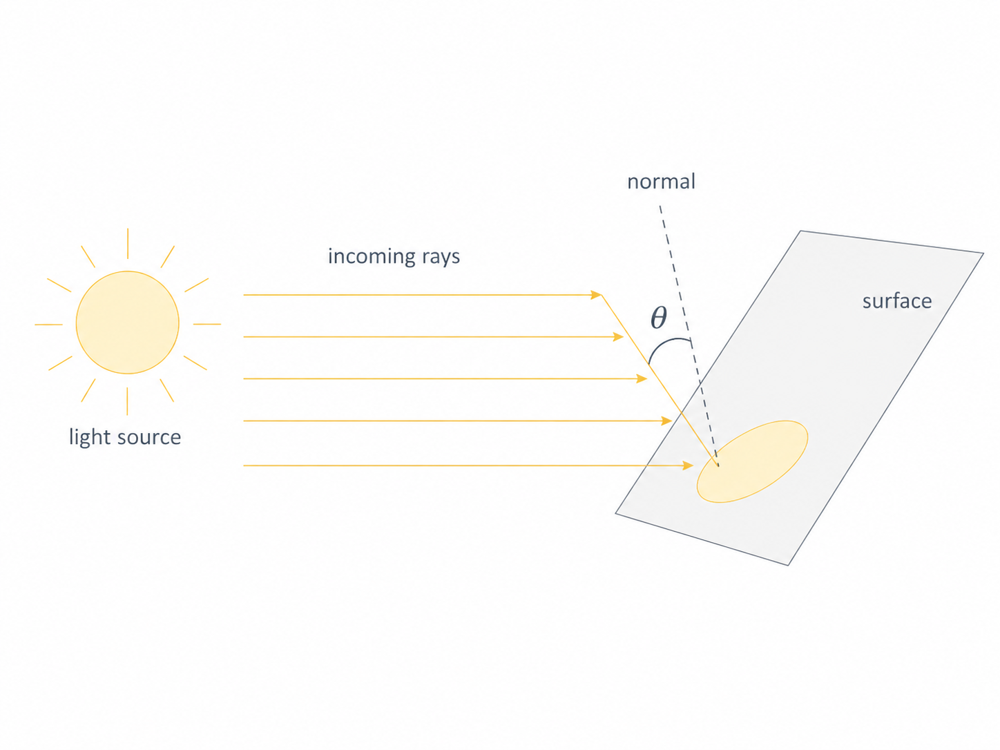

{/* add this script to the body  */}
{/* https://cdn.jsdelivr.net/gh/WLJSTeam/web-components@latest/src/common/app.js */}

<wljs-store kernel="./attachments/kernel-7753612222490941309.txt" json="./attachments/52721f63-62d0-470b-834e-8af2bdeedf0c.txt"></wljs-store>

The 3D story is the same - `GraphicsComplex` maps directly to THREE.js `BufferAttribute` objects written into GPU memory. The only difference is that you now also have `VertexNormals` for lighting.

Let's start with a dodecahedron:

<WLJSWrapper><wljs-editor display="codemirror" type="Input" editable="true"  >{`v = PolyhedronData["Dodecahedron", "Vertices"] // N;
	i = PolyhedronData["Dodecahedron", "FaceIndices"];`}</wljs-editor></WLJSWrapper>

Wireframe:

<WLJSWrapper><wljs-editor display="codemirror" type="Input" editable="true"  >{`GraphicsComplex[v, {Red, Line[i]}] // Graphics3D`}</wljs-editor></WLJSWrapper>

<WLJSWrapper><wljs-editor display="codemirror" type="Output"  >{`(*VB[*)(FrontEndRef["2c6cb17c-5b4e-4343-9b0d-5b171ff0c3e9"])(*,*)(*"1:eJxTTMoPSmNkYGAoZgESHvk5KRCeEJBwK8rPK3HNS3GtSE0uLUlMykkNVgEKGyWbJScZmifrmiaZpOqaGJsY61omGaQAuYbmhmlpBsnGqZYAhyUVyw=="*)(*]VB*)`}</wljs-editor></WLJSWrapper>

Solid:

<WLJSWrapper><wljs-editor display="codemirror" type="Input" editable="true"  >{`GraphicsComplex[v, Polygon[i]] // Graphics3D`}</wljs-editor></WLJSWrapper>

<WLJSWrapper><wljs-editor display="codemirror" type="Output"  >{`(*VB[*)(FrontEndRef["37733b48-ddf6-4f13-a9f0-ce05d97c09ae"])(*,*)(*"1:eJxTTMoPSmNkYGAoZgESHvk5KRCeEJBwK8rPK3HNS3GtSE0uLUlMykkNVgEKG5ubGxsnmVjopqSkmemapBka6yZaphnoJqcamKZYmicbWCamAgCB5hXd"*)(*]VB*)`}</wljs-editor></WLJSWrapper>

### Vertex colors in 3D

Same idea as in 2D - per-vertex colors get linearly interpolated by the GPU rasterizer:

<WLJSWrapper><wljs-editor display="codemirror" type="Input" editable="true"  >{`v = {{1, 0, 0}, {1, 1, 1}, {0, 0, 1}};
	Graphics3D[{Yellow, GraphicsComplex[v, Polygon[{1,2,3}], VertexColors -> {Red, Blue, Green}]}, ViewPoint->{1,1,1}]`}</wljs-editor></WLJSWrapper>

<WLJSWrapper><wljs-editor display="codemirror" type="Output"  >{`(*VB[*)(Graphics3D[{RGBColor[1, 1, 0], GraphicsComplex[{{1, 0, 0}, {1, 1, 1}, {0, 0, 1}}, Polygon[{1, 2, 3}], VertexColors -> {RGBColor[1, 0, 0], RGBColor[0, 0, 1], RGBColor[0, 1, 0]}]}, ViewPoint -> {1, 1, 1}])(*,*)(*"1:eJxTTMoPSmNkYGAoZgESHvk5KWlMIB4XkHAvSizIyEwuNnaBiIFU+GQWl6Qxg3gcQCLI3ck5Pye/KBNkAoQAYgaIAn4kI5zzcwtyUisgEqjmwHgI7UhmoErCCTRJuCaIJNg77EAiID+nMj0/D5tRIA9lgsQRXgsqzUkt5gEywlKLSlIrwB4rxuZiTJ+juRpFAZrjcChAhB2qezhB7slMLQ/Iz8zDGmBwAgDwxE9v"*)(*]VB*)`}</wljs-editor></WLJSWrapper>

Again, we recommend avoiding color symbols inside `VertexColors`; use triples of real numbers instead.

### Normals and lighting

> You may think of normals as a sort of workaround to avoid having an infinite number of polygon faces while modeling smooth surfaces. We will touch on this more closely after this next "formal" example.

Without explicit normals, the renderer computes flat normals from polygon faces, resulting in flat shading. Kinda like a 90s demo effect:

<WLJSWrapper><wljs-editor display="codemirror" type="Input" editable="true"  >{`v = {{1, 0, 0}, {1, 1, 1}, {0, 0, 1}};
	Graphics3D[{Yellow, GraphicsComplex[v, Polygon[{1,2,3}]]}, ViewPoint->{1,1,1}]`}</wljs-editor></WLJSWrapper>

<WLJSWrapper><wljs-editor display="codemirror" type="Output"  >{`(*VB[*)(Graphics3D[{RGBColor[1, 1, 0], GraphicsComplex[{{1, 0, 0}, {1, 1, 1}, {0, 0, 1}}, Polygon[{1, 2, 3}]]}, ViewPoint -> {1, 1, 1}])(*,*)(*"1:eJxTTMoPSmNkYGAoZgESHvk5KWlMIB4XkHAvSizIyEwuNnaBiIFU+GQWl6Qxg3gcQCLI3ck5Pye/KBNkAoQAYgaIcn4kI5zzcwtyUisgOlHNgfEQ2iFmYJGEE2iScE0QSbB32IFEQH5OZXp+HjajQC7MZIa7FSQZVJqTWswJZIRlppYH5GfmYXUgnAAAwhM2Hg=="*)(*]VB*)`}</wljs-editor></WLJSWrapper>

Supply your own `VertexNormals`, and you control exactly how light bounces off the surface:

<WLJSWrapper><wljs-editor display="codemirror" type="Input" editable="true"  >{`v = {{1, 0, 0}, {1, 1, 1}, {0, 0, 1}};
	n = {1, -1, 1};
	n2 = {-1, 0, -1};
	Graphics3D[{Yellow, GraphicsComplex[v, Polygon[{1,2,3}], VertexNormals -> {n2, n, n}]}, ViewPoint->{1,1,1}] `}</wljs-editor></WLJSWrapper>

<WLJSWrapper><wljs-editor display="codemirror" type="Output"  >{`(*VB[*)(Graphics3D[{RGBColor[1, 1, 0], GraphicsComplex[{{1, 0, 0}, {1, 1, 1}, {0, 0, 1}}, Polygon[{1, 2, 3}], VertexNormals -> {{-1, 0, -1}, {1, -1, 1}, {1, -1, 1}}]}, ViewPoint -> {1, 1, 1}])(*,*)(*"1:eJxTTMoPSmNkYGAoZgESHvk5KWlMIB4XkHAvSizIyEwuNnaBiIFU+GQWl6Qxg3gcQCLI3ck5Pye/KBNkAoQAYgaIAn4kI5zzcwtyUisgEqjmwHgI7UhmoErCCTRJuCaIJNg77EAiID+nMj0/D5tRIA9lgsQRXgsqzUkt5gUywlKLSlIr/PKLchNzivE6+T8QQCwGsbDZA1aBxclokqiO4AQ5IjO1PCA/Mw9rKMEJAEdeXAU="*)(*]VB*)`}</wljs-editor></WLJSWrapper>

The idea of having normals is not quite there if you have a single flat triangle. The change of color at the bottom is due to Lambert's law.

> Lambert's Cosine Law states that the radiant intensity or luminous intensity observed from an ideal diffusely reflecting surface is proportional to the **cosine of the angle between the observer's line of sight and the surface normal**. It is named after Johann Heinrich Lambert, from his Photometria, published in 1760.

$$
I(\theta) \propto \cos(\theta)
$$

Here is an example:

This is widely used in old and modern computer graphics to model realistic diffuse surfaces, as well as so-called normal map textures used in deferred lighting.

Let's generate a sphere mesh from randomly scattered points.

<WLJSWrapper><wljs-editor display="codemirror" type="Input" editable="true"  >{`mesh = DelaunayMesh[SpherePoints[50]];
	v = MeshCoordinates[mesh];
	i = MeshCells[mesh,2][[All,1]];`}</wljs-editor></WLJSWrapper>

<WLJSWrapper><wljs-editor display="codemirror" type="Input" editable="true"  >{`Graphics3D[{Orange, GraphicsComplex[v, Polygon/@i]}, ViewPoint->{1,1,1}]`}</wljs-editor></WLJSWrapper>

<WLJSWrapper><wljs-editor display="codemirror" type="Output"  >{`(*VB[*)(FrontEndRef["0cd0089e-d2ea-4bc9-b945-21d65c881890"])(*,*)(*"1:eJxTTMoPSmNkYGAoZgESHvk5KRCeEJBwK8rPK3HNS3GtSE0uLUlMykkNVgEKGySnGBhYWKbqphilJuqaJCVb6iZZmpjqGhmmmJkmW1gYWlgaAACJehV5"*)(*]VB*)`}</wljs-editor></WLJSWrapper>

One could sample more points, but it would be too expensive. Instead, let's define normals for each vertex based on the fact that the object has to represent a sphere:

<WLJSWrapper><wljs-editor display="codemirror" type="Input" editable="true"  >{`n = Map[Normalize, v];`}</wljs-editor></WLJSWrapper>

<WLJSWrapper><wljs-editor display="codemirror" type="Input" editable="true"  >{`Graphics3D[{Orange, GraphicsComplex[v, Polygon/@i, VertexNormals->n]}, ViewPoint->{1,1,1}] `}</wljs-editor></WLJSWrapper>

<WLJSWrapper><wljs-editor display="codemirror" type="Output"  >{`(*VB[*)(FrontEndRef["8ac892e7-1553-44c2-90c6-17e20990df5b"])(*,*)(*"1:eJxTTMoPSmNkYGAoZgESHvk5KRCeEJBwK8rPK3HNS3GtSE0uLUlMykkNVgEKWyQmW1gapZrrGpqaGuuamCQb6VoaJJvpGpqnGhlYWhqkpJkmAQB45hUd"*)(*]VB*)`}</wljs-editor></WLJSWrapper>

Oops! We have a problem here. Unfortunately, the indices of a triangulated mesh are often not sorted (in the best case, they should follow the CW or CCW rule), i.e. the 3D engine cannot tell whether a given polygon faces in or out. We can fix this by presorting them manually based on our normals:

<WLJSWrapper><wljs-editor display="codemirror" type="Input" editable="true"  >{`i = MapThread[With[{
	  A = (*TB[*)Indexed[(*|*)v(*|*), {(*|*)#2(*|*)}](*|*)(*1:eJxTTMoPSmMAgmIuIOGZl5JakZrilF8BAECTBhI=*)(*]TB*) - (*TB[*)Indexed[(*|*)v(*|*), {(*|*)#1(*|*)}](*|*)(*1:eJxTTMoPSmMAgmIuIOGZl5JakZrilF8BAECTBhI=*)(*]TB*),
	  B = (*TB[*)Indexed[(*|*)v(*|*), {(*|*)#3(*|*)}](*|*)(*1:eJxTTMoPSmMAgmIuIOGZl5JakZrilF8BAECTBhI=*)(*]TB*) - (*TB[*)Indexed[(*|*)v(*|*), {(*|*)#1(*|*)}](*|*)(*1:eJxTTMoPSmMAgmIuIOGZl5JakZrilF8BAECTBhI=*)(*]TB*),
	  normal = Mean[{(*TB[*)Indexed[(*|*)n(*|*), {(*|*)#1(*|*)}](*|*)(*1:eJxTTMoPSmMAgmIuIOGZl5JakZrilF8BAECTBhI=*)(*]TB*), (*TB[*)Indexed[(*|*)n(*|*), {(*|*)#2(*|*)}](*|*)(*1:eJxTTMoPSmMAgmIuIOGZl5JakZrilF8BAECTBhI=*)(*]TB*), (*TB[*)Indexed[(*|*)n(*|*), {(*|*)#3(*|*)}](*|*)(*1:eJxTTMoPSmMAgmIuIOGZl5JakZrilF8BAECTBhI=*)(*]TB*)}]
	},
	  If[Cross[A, B] . normal > 0,
	    {#1,#2,#3}
	  ,
	    {#1,#3,#2}
	  ]
	]&, Transpose@i];`}</wljs-editor></WLJSWrapper>

Let's plot it.

<WLJSWrapper><wljs-editor display="codemirror" type="Input" editable="true"  >{`Graphics3D[{Orange, GraphicsComplex[v, Polygon/@i, VertexNormals->n]}, ViewPoint->{1,1,1}] `}</wljs-editor></WLJSWrapper>

<WLJSWrapper><wljs-editor display="codemirror" type="Output"  >{`(*VB[*)(FrontEndRef["c5cd4ce3-4e4d-4970-bcba-73ee0e938c4d"])(*,*)(*"1:eJxTTMoPSmNkYGAoZgESHvk5KRCeEJBwK8rPK3HNS3GtSE0uLUlMykkNVgEKJ5smp5gkpxrrmqSapOiaWJob6CYlJyXqmhunphqkWhpbJJukAACUnRZm"*)(*]VB*)`}</wljs-editor></WLJSWrapper>

What a nice ball! You can avoid extra overhead by merging all lists of triangles into a single `Polygon` symbol. It will automatically detect this and submit all indices to the GPU: 

<WLJSWrapper><wljs-editor display="codemirror" type="Input" editable="true"  >{`Graphics3D[{Orange, GraphicsComplex[v, Polygon@i, VertexNormals->n]}, ViewPoint->{1,1,1}]`}</wljs-editor></WLJSWrapper>

<WLJSWrapper><wljs-editor display="codemirror" type="Output"  >{`(*VB[*)(FrontEndRef["52a09b13-a4cb-428e-ae3e-c241b9075449"])(*,*)(*"1:eJxTTMoPSmNkYGAoZgESHvk5KRCeEJBwK8rPK3HNS3GtSE0uLUlMykkNVgEKmxolGlgmGRrrJpokJ+maGFmk6iamGqfqJhuZGCZZGpibmphYAgCEDBVn"*)(*]VB*)`}</wljs-editor></WLJSWrapper>

Nice and smooth, with just 50 extra normals provided.

### Texture mapping in 3D

UV coordinates work identically to the 2D case:

<WLJSWrapper><wljs-editor display="codemirror" type="Input" editable="true"  >{`img = ExampleData[{"TestImage", "Lena"}];
	Graphics3D[{
	  Texture[img],
	  GraphicsComplex[
	    {{-1, -1, 0}, {1, -1, 0}, {1, 1, 0}, {-1, 1, 0}},
	    Polygon[{1, 2, 3, 4}],
	    VertexTextureCoordinates -> {{0, 1}, {0, 0}, {1, 0}, {1, 1}}
	  ]
	}] `}</wljs-editor></WLJSWrapper>

<WLJSWrapper><wljs-editor display="codemirror" type="Output"  >{`(*VB[*)(FrontEndRef["7c92593b-af20-4216-bd80-98adebcf1682"])(*,*)(*"1:eJxTTMoPSmNkYGAoZgESHvk5KRCeEJBwK8rPK3HNS3GtSE0uLUlMykkNVgEKmydbGplaGifpJqYZGeiaGBma6SalWBjoWlokpqQmJacZmlkYAQCAKxWm"*)(*]VB*)`}</wljs-editor></WLJSWrapper>

The mapping can also be done automatically.

<WLJSWrapper><wljs-editor display="codemirror" type="Input" editable="true"  >{`Graphics3D[{
	  Texture[img],
	  Cuboid[]
	}] `}</wljs-editor></WLJSWrapper>

<WLJSWrapper><wljs-editor display="codemirror" type="Output"  >{`(*VB[*)(FrontEndRef["63000b7d-dfb7-4742-8f9b-e674cb1bdb13"])(*,*)(*"1:eJxTTMoPSmNkYGAoZgESHvk5KRCeEJBwK8rPK3HNS3GtSE0uLUlMykkNVgEKmxkbGBgkmafopqQlmeuamJsY6VqkWSbpppqZmyQnGSalJBkaAwCByBXO"*)(*]VB*)`}</wljs-editor></WLJSWrapper>

How about animation and manipulation?

## Animating 3D meshes

### Fixed 10,000 vertices

Akin to the 2D case, we are free to mutate vertex data with ease. Normals can be provided as well; otherwise, the 3D engine will automatically estimate them based on the direction the polygon is facing - flat shading.

Here's a 100x100 grid - that's 10,000 vertices and ~20,000 triangles - animated in real time:

<WLJSWrapper><wljs-editor display="codemirror" type="Input" editable="true"  >{`vertices3 = Flatten[Table[{i,j, 0}, {i,1.0,100.0,1.0}, {j, 1.0,100.0,1.0}],1];
	idx[i_, j_] := (i - 1) 100 + j;
	tris = Flatten[
	  Table[
	    {
	      {idx[i, j],     idx[i + 1, j], idx[i, j + 1]},
	      {idx[i + 1, j], idx[i + 1, j + 1], idx[i, j + 1]}
	    },
	    {i, 1, 100 - 1},
	    {j, 1, 100 - 1}
	  ],
	  2
	];
	
	GraphicsComplex[vertices3//Offload, Polygon[tris]]//Graphics3D`}</wljs-editor></WLJSWrapper>

The triangle indices are computed once and stay fixed. Only the vertex positions change each frame - which means only the position buffer gets updated on the GPU:

<WLJSWrapper><wljs-editor display="codemirror" type="Input" editable="true"  >{`gen := Module[
	  {t = AbsoluteTime[], s = 0.13, cx, cy},
	  cx = 50 + 20 Cos[0.5 t];
	  cy = 50 + 20 Sin[0.7 t];
	  vertices3 = Flatten[
	    Table[
	      {
	        i, j,
	         5 Sin[s i + t] +
	         5 Sin[s j - 1.3 t] +
	        3 12 Exp[-((i - cx)^2 + (j - cy)^2)/120.]
	      },
	      {i, 1., 100.}, {j, 1., 100.}
	    ],
	    1
	  ]
	];
	
	Do[gen; Pause[1/30.0], {500}];`}</wljs-editor></WLJSWrapper>

<LazyVideo url="./rec1.mp4"/>

### Adding dynamic color

Same grid, but now we also update a color buffer each frame. Two GPU buffers updated per frame - positions and colors - still smooth:

<WLJSWrapper><wljs-editor display="codemirror" type="Input" editable="true"  >{`idx[i_, j_] := (i - 1) 100 + j;
	tris = Flatten[
	  Table[
	    {
	      {idx[i, j],     idx[i + 1, j], idx[i, j + 1]},
	      {idx[i + 1, j], idx[i + 1, j + 1], idx[i, j + 1]}
	    },
	    {i, 1, 100 - 1},
	    {j, 1, 100 - 1}
	  ],
	  2
	];
	
	cf = ColorData["DarkRainbow"];
	
	genData := Module[
	  {t = AbsoluteTime[], s = 0.12, verts, z, cols},
	
	  verts = Flatten[
	    Table[
	      {
	        i, j,
	        6 Sin[s i + 1.4 t] +
	        5 Sin[s j - 1.1 t] +
	        3 Sin[s (i + j) + 0.6 t] +
	        8 Cos[0.5 s Sqrt[(i - 50.)^2 + (j - 50.)^2] - 1.8 t]
	      },
	      {i, 1., 100.}, {j, 1., 100.}
	    ],
	    1
	  ];
	
	  z = verts[[All, 3]];
	
	  (* fixed range avoids color flicker *)
	  cols = (List@@cf[#]) &/@ Rescale[z, {-18, 18}];
	
	  data3 = {verts, cols};
	];
	
	genData;
	
	GraphicsComplex[data3[[1]]//Offload, Polygon[tris], VertexColors->Offload[data3[[2]]]]//Graphics3D 
	
	Do[genData; Pause[1/30.0];, {500}];`}</wljs-editor></WLJSWrapper>

<LazyVideo url="./rec2.mp4"/>

### Animated surface with `AnimationFrameListener`

For a cleaner animation loop, use `AnimationFrameListener` instead of `Do` + `Pause`. This ties the computation to the browser's refresh cycle:

<WLJSWrapper><wljs-editor display="codemirror" type="Input" editable="true"  >{`(* Grid dimensions *)
	nx = 50; ny = 50;
	
	(* Triangle indices - generated once *)
	indices = Flatten[Table[
	  With[{v = (i - 1) ny + j},
	    {{v, v + 1, v + ny + 1}, {v, v + ny + 1, v + ny}}
	  ],
	  {i, nx - 1}, {j, ny - 1}
	], 2];
	
	(* Generates {vertices, vertexColors} at time t *)
	generateFrame[t_] := Module[{verts, zVals, mn, mx},
	  verts = Flatten[Table[
	    With[{r = Sqrt[x^2 + y^2]},
	      {x, y,
	        Sin[4 r - 2 t] Exp[-0.3 r] +
	        0.3 Sin[2 x - t] Cos[2 y + 0.5 t]}
	    ],
	    {x, Subdivide[-2., 2., nx - 1]},
	    {y, Subdivide[-2., 2., ny - 1]}
	  ], 1];
	
	  zVals = verts[[All, 3]];
	  {mn, mx} = MinMax[zVals];
	
	  {verts, Map[
	    With[{s = Rescale[#[[3]], {mn, mx}]},
	      List@@RGBColor[s, 0.15 + 0.35 s, 1. - 0.8 s]
	    ]&, verts
	  ]}
	];
	
	(* Initialize *)
	complex = generateFrame[0.];
	
	(* Display *)
	Graphics3D[{GraphicsComplex[
	  Offload[complex[[1]]],
	  {Polygon[indices]},
	  VertexColors -> Offload[complex[[2]]]
	], EventHandler[AnimationFrameListener[complex//Offload], Function[Null,
	  complex = generateFrame[AbsoluteTime[]];
	]]}]`}</wljs-editor></WLJSWrapper>

<LazyVideo url="./rec3.mp4"/>

## Dynamic topology in 3D

The most demanding case: vertices, colors, __and__ triangle indices all changing every frame. For this case, we need to make sure that `"VertexFence"` is `True`; otherwise, indices and vertices may experience race conditions. Depending on the order of updates, the old indices might be mixed with new vertices, and vice versa. The aforementioned *fence* suspends the actual update of indices until new vertex data arrives.

Two orbiting holes punch through the mesh in real time:

<WLJSWrapper><wljs-editor display="codemirror" type="Input" editable="true"  >{`(* Grid dimensions *)
	nx = 50; ny = 50;
	
	(* All triangle indices *)
	allIndices = Flatten[Table[
	  With[{v = (i - 1) ny + j},
	    {{v, v + 1, v + ny + 1}, {v, v + ny + 1, v + ny}}
	  ],
	  {i, nx - 1}, {j, ny - 1}
	], 2];
	
	xs = Subdivide[-2., 2., nx - 1];
	ys = Subdivide[-2., 2., ny - 1];
	
	(* Precompute centroid XY of each triangle for fast filtering *)
	gridXY = Flatten[Table[{x, y}, {x, xs}, {y, ys}], 1];
	triCX = (gridXY[[#[[1]], 1]] + gridXY[[#[[2]], 1]] + gridXY[[#[[3]], 1]]) / 3. & /@ allIndices;
	triCY = (gridXY[[#[[1]], 2]] + gridXY[[#[[2]], 2]] + gridXY[[#[[3]], 2]]) / 3. & /@ allIndices;
	
	generateFrame[t_] := Module[{verts, zVals, mn, mx, h1, h2, d1, d2, mask},
	  verts = Flatten[Table[
	    With[{r = Sqrt[x^2 + y^2]},
	      {x, y,
	        Sin[4 r - 2 t] Exp[-0.3 r] +
	        0.3 Sin[2 x - t] Cos[2 y + 0.5 t]}
	    ],
	    {x, xs}, {y, ys}
	  ], 1];
	
	  zVals = verts[[All, 3]];
	  {mn, mx} = MinMax[zVals];
	
	  (* Two holes orbiting the center *)
	  h1 = {1.3 Cos[0.8 t], 1.3 Sin[0.8 t]};
	  h2 = {1.3 Cos[0.8 t + Pi], 1.3 Sin[0.8 t + Pi]};
	
	  (* Vectorized distance computation *)
	  d1 = Sqrt[(triCX - h1[[1]])^2 + (triCY - h1[[2]])^2];
	  d2 = Sqrt[(triCX - h2[[1]])^2 + (triCY - h2[[2]])^2];
	
	  (* Keep triangles outside both holes *)
	  mask = UnitStep[d1 - 0.55] UnitStep[d2 - 0.55];
	
	  {Pick[allIndices, mask, 1], {verts,
	   Map[With[{s = Rescale[#[[3]], {mn, mx}]},
	     List @@ RGBColor[s, 0.15 + 0.35 s, 1. - 0.8 s]] &, verts]}}
	];
	
	(* Initialize *)
	{indices, complex} = generateFrame[0.];
	
	Graphics3D[{GraphicsComplex[
	  Offload[complex[[1]]],
	  {Polygon[Offload[indices]]},
	  VertexColors -> Offload[complex[[2]]],
	  "VertexFence" -> True
	], EventHandler[AnimationFrameListener[complex // Offload], Function[Null,
	  {indices, complex} = generateFrame[AbsoluteTime[]];
	]]}]`}</wljs-editor></WLJSWrapper>

<LazyVideo url="./rec4.mp4"/>

## Hijacking plot functions as geometry generators

Here's a fun trick: you can use standard plotting functions like `ParametricPlot3D` as mesh generators, then feed their output into a `GraphicsComplex` that you control. This gives you the best of both worlds - automatic tessellation from the plotter and full GPU-level control over the result.

Define a function that interpolates between a torus and a seashell:

<WLJSWrapper><wljs-editor display="codemirror" type="Input" editable="true"  >{`sample[t_] := With[{
	   complex = ParametricPlot3D[
	     (1 - t) * {
	       (2 + Cos[v]) * Cos[u],
	       (2 + Cos[v]) * Sin[u],
	       Sin[v]
	     } + t * {
	       1.16^v * Cos[v] * (1 + Cos[u]),
	       -1.16^v * Sin[v] * (1 + Cos[u]),
	       -2 * 1.16^v * (1 + Sin[u]) + 1.0
	     },
	     {u, 0, 2\\[Pi]},
	     {v, -\\[Pi], \\[Pi]},
	     MaxRecursion -> 2,
	     Mesh -> None
	   ][[1, 1]]
	   },
	  {
	   complex[[1]],
	   Cases[complex[[2]], _Polygon, 6] // First // First,
	   complex[[3, 2]]
	  }
	]`}</wljs-editor></WLJSWrapper>

Now wire it up with a slider - the plotter generates new geometry, and `GraphicsComplex` pushes it to the GPU:

<WLJSWrapper><wljs-editor display="codemirror" type="Input" editable="true"  >{`Module[{
	    VerticesAndNormals = {{}, {}}, indices = {}
	  },
	    {
	      EventHandler[InputRange[0,1,0.1,0], Function[value,
	        With[{res  = sample[value]},
	          indices = res[[2]];
	          VerticesAndNormals = {res[[1]], res[[3]]};
	        ];
	      ]],
	
	      With[{res  = sample[0.0]},
	          indices = res[[2]];
	          VerticesAndNormals = {res[[1]], res[[3]]};
	      ];
	      
	      Graphics3D[{
	        Directive["Roughness"->0.0]
	        GraphicsComplex[Offload[VerticesAndNormals[[1]]], {
	          Polygon[Offload[indices]]
	        }, VertexNormals->Offload[VerticesAndNormals[[2]]], "VertexFence"->True]
	        
	      }]
	    } // Column // Panel 
	]`}</wljs-editor></WLJSWrapper>

<WLJSWrapper><wljs-editor display="codemirror" type="Output"  >{`(*BB[*)(Panel[(*GB[*){{(*VB[*)(EventObject[<|"Id" -> "946c4400-9032-4256-8297-37e2524107db", "Initial" -> 0, "View" -> "be1ef4dd-33b7-4fba-8fa9-d1fad8743be4"|>])(*,*)(*"1:eJxTTMoPSmNkYGAoZgESHvk5KRCeEJBwK8rPK3HNS3GtSE0uLUlMykkNVgEKJ6UapqaZpKToGhsnmeuapCUl6lqkJVrqphimJaZYmJsYJ6WaAACd1xbH"*)(*]VB*)}(*||*),(*||*){(*VB[*)(Graphics3D[{Directive["Roughness" -> 0.]*GraphicsComplex[Offload[VerticesAndNormals$327621[[1]]], {Polygon[Offload[indices$327621]]}, VertexNormals -> Offload[VerticesAndNormals$327621[[2]]], "VertexFence" -> True]}])(*,*)(*"1:eJylUMEKgkAQtSiiojp3DPqBFOocSXWIEovuprO6sO7Kzhr29+2iaNmxPTxmeG/em9nFQ/ikY1kW9jQcBYvKbqThIIMsoSE6bqM4UVSka7q+hhtNAUtyqMGlEkJFn1AqjN7PGVwN54s8TjggSqt6xPA4+wjaiTRjUJSGAw0XQpgIosbOC6TCuS7uIBUNAbc8OguZBgyXjr1Z2ytqhlv71n6eYK9Y8J8AnOqa8sg4Vj7fJ+CkyoSiivtvSaNtfdK4TtgD10OGuMkc3iBfX2s="*)(*]VB*)}}(*]GB*)])(*,*)(*"1:eJxTTMoPSmNiYGAo5gcSAUX5ZZkpqSn+BSWZ+XnFaYwgCV4gEZaZWu6SmpxflFiSXxTMClKamJeaA9HJAiSCSnNSg0EMj9TEFIQCAH5qF00="*)(*]BB*)`}</wljs-editor></WLJSWrapper>

*Try it!*

`GraphicsComplex` won't write your shaders for you, but it does give you a remarkably direct line from Wolfram Language arrays to GPU memory. For real-time visualization of simulations, generative art, or anything with thousands of moving parts - it's the right tool.