import { Accordion, Accordions } from 'fumadocs-ui/components/accordion';

{/* add this script to the body  */}
{/* https://cdn.jsdelivr.net/gh/WLJSTeam/web-components@latest/src/common/app.js */}
<wljs-store kernel="./attachments/kernel-8376462859940404957.txt" json="./attachments/bb30a8cb-2ebb-4a43-9712-7f57a37b10d7.txt"></wljs-store>

## Before the start
Here are all examples discussed in this article you can download and tinker by yourself

<Cards>

<DownloadFile
    title="Download"
    description="RC circuit calculator"
    href="./RC.wlw"
/>

<DownloadFile
    title="Download"
    description="Spray text example"
    href="./Spray.wlw"
/>

<DownloadFile
    title="Download"
    description="Image style transfer app"
    href="./2ImageStyle.wlw"
/>

<DownloadFile
    title="Download"
    description="XY line plotter app"
    href="./Plotter.wlw"
/>

<DownloadFile
    title="Download"
    description="Optical units converter"
    href="./Units.wlw"
/>

<DownloadFile
    title="Download"
    description="Lorentz Oscillator Fitter"
    href="./Lorentz.wlw"
/>

</Cards>


Everyone knows a million ways to write an app with Node (or Bun, but technically it is still JavaScript), Java, or Python. Any "adult" language: C/C++, C#, Pascal/Delphi, and many others - offers tons of options to choose from. But what about our symbolic friend Wolfram?

## The Answer
There is no way. Wolfram cannot be compiled into a binary; Mathematica costs a lot for a team, and it is slow and unstable when it comes to building UIs. CDF Player (Pro) is deprecated and subscription-based. Just use Claude Code with Bun, or Codex, or Kirbi; throw the rest into the garbage bin and vibe.


## Why bother?

<Callout>
The author (me) works in academia, i.e. in research labs. Please keep my professional bias in mind. The following practices may be valuable in science, but completely unnecessary or even harmful for normal businesses.
</Callout>

If I am writing a tool to operate one or more machines in a lab, the obvious choice would be something like LabView. This is nice if you have full support from the development team, since things often break after a new version is introduced or you accidentally reinstall the operating system. But let's leave such large-scale apps for later...

What if I need a small utility that solves one localized problem? One can always vibe-code something that solves it, which can be a total win compared to having nothing. One can write an interactive curve-fitting widget in pure JavaScript or even in C. But I would probably kill myself after doing that without helper libraries or frameworks. Or it could actually be a nice journey if I had nothing to do after work.

Julia, R, Python, or Matlab? Any of them could be a solid choice, especially the first ones, since they are open-source and have massive ecosystems of libraries. They are also often used in computational notebook interfaces such as Pluto or Jupyter Notebook, since this has proved to be one of the best kinds of IDE for research and app prototyping, compared with the traditional IDEs used with the "adult" languages mentioned at the beginning.

I am not here to decide what fits your needs best, and I will definitely not try to sell you anything. We will discuss one option - Wolfram & WLJS - and show its strong sides in tutorial form. Thus, let's focus on what you saw in the title. People often say that Wolfram is nice for prototyping, but why? Let me demonstrate with a minimal interactive example:

<WLJSWrapper><wljs-editor lazy="true" display="codemirror" type="Input" editable="true"  >{`Manipulate[
	 Module[{sol, \\[Tau], tmax},
	  \\[Tau] = R C (*SpB[*)Power[10(*|*),(*|*)-6](*]SpB*);              (* time constant in seconds *)
	  tmax = 5\\[Tau];           (* show 5 time constants = ~99% decay *)
	  sol = NDSolve[{v'[t] == -v[t]/τ, v[0] == V0}, v, {t, 0, tmax}];
	  
	  Plot[v[t] /. sol[[1]], {t, 0, tmax},
	   PlotRange -> {0, V0},
	   AxesLabel -> {"t (s)", "v (V)"},
	   PlotLabel -> "τ = " <> ToString[NumberForm[\\[Tau]//N, {6,4}]] <> " s",
	   PlotStyle -> {Thick, Blue}
	   ]
	  ],
	 {{R, 10, "Resistance R (Ω)"}, 10, 460, 10 },
	 {{C, 100, "Capacitance C (μF)"}, 1, (*SpB[*)Power[10(*|*),(*|*)3](*]SpB*), 1 100},
	 {{V0, 5, "Initial Voltage (V)"}, 1, 5, 0.1 10},
	 ContinuousAction->True
	]`}</wljs-editor></WLJSWrapper>

<div className="magrin-auto invertColor" style={{maxWidth:'500px'}}>

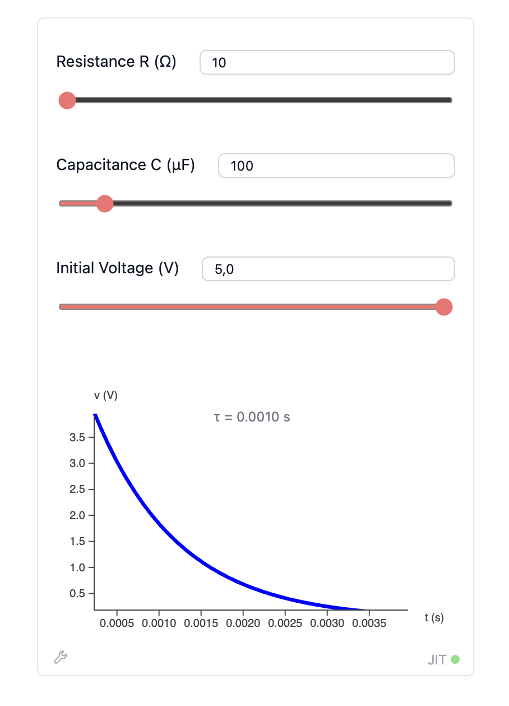

</div>

It is hard to say no. We have three things in one: a model, a solver, and a minimal UI layout.

Can we export it as an app...?
Well, yes and no. A zero-dependency binary - certainly not. Even if we tried to bundle an entire Wolfram Engine, it would be a waste of resources. If you have ever worked with LabView, for instance, you know that it provides a runtime that does all the heavy lifting while your "apps" use it. Alternatively, one can try cloud services if one wants to play roulette.

## Runtime
Having Wolfram Engine alone is not enough: it is just an interpreter, a console application with standard input and output. For a basic application, we need a UI and a window manager that can create a window and draw something on it. Ideally, the app itself should not need to know whether it runs on a Mac, PC, GNU/Linux machine, or server.

WLJS tries to solve exactly this problem by providing the infrastructure usually found in Wolfram notebooks. Since WLJS Notebooks are web-based by design, the same runtime can be used headlessly on a server, providing access to an "application" through a simple browser. When run as a desktop application, the runtime can also provide file-system dialogs and messages.


<div className="invertColor">

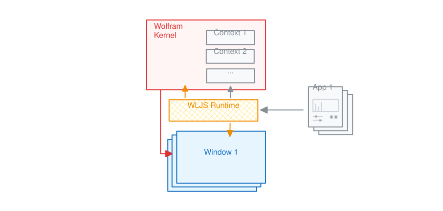

</div>

As shown in the diagram, all user apps share **the same Wolfram Kernel**, while each application remains contextually isolated in a randomly generated context. A notebook can still connect to the same kernel, without app symbols leaking into the global context.

With careful planning, the `Async*` functions available in WLJS can make a single computation kernel sufficient for most use cases, even in a multi-user environment on a server, since every instance is isolated in its own context. For heavy or long-running tasks, we provide a **Workers API** that uses isolated parallel kernels. Wolfram Language's standard `ParallelSubmit` can help too, as can the asynchronous variant we created, `ParallelSubmitAsync`.

<Callout>
WLJS Runtime is not a separate application, but a built-in feature of the default WLJS Notebook system.
</Callout>

### Async model
Let's compare the two approaches side by side. In a normal local notebook, you would probably query the user like this:

<WLJSWrapper><wljs-editor lazy="true" display="codemirror" type="Input" editable="true"  >{`res = ChoiceDialog["Export data?"];
	If[TrueQ[res],
	  Export["path.txt", "Data..."];
	  MessageDialog["Done!"];
	];`}</wljs-editor></WLJSWrapper>

A much safer, non-blocking approach would be:

<WLJSWrapper><wljs-editor lazy="true" display="codemirror" type="Input" editable="true"  >{`nb = EvaluationNotebook[];
	
	AsyncFunction[Null, Module[{res},
	  res = ChoiceDialogAsync["Export data?", "Notebook"->nb];
	  res = res // Await;
	  If[res,
	    ExportAsync["path.txt", "Data..."] // Await;
	    MessageDialog["Done!", "Notebook"->nb];
	    ClearAll[res];
	  ];
	]][];`}</wljs-editor></WLJSWrapper>

If you work with GUI elements such as `Button` or `InputRange` (a slider), they are asynchronous by default.

## Notebooks as Apps
Yes! Why reinvent the wheel or create a new entity when so many convenient things already exist? Computational notebooks are great: you write documentation, code, and tests in the same place. Existing symbols and APIs can be reused too, for example:

<WLJSWrapper><wljs-editor lazy="true" display="codemirror" type="Input" editable="true"  >{`NotebookDirectory[]`}</wljs-editor></WLJSWrapper>

would resolve to the app's folder. We formulate the following rules:
1. Initialization cells initialize the app.
2. **The very last cell** of the notebook becomes the main window.
3. Everything is evaluated in a randomly generated context.

Then you will not miss a thing - take advantage of the Wolfram, WLX, and JavaScript cells from WLJS Notebook in your applications.

## How to make one?
Let's start with our old example. Create **an empty notebook**, then add two cells:

<WLJSWrapper><wljs-editor lazy="true" display="codemirror" type="Input" editable="true"  >{`.md
	# RC Calculator
	Here is the code:`}</wljs-editor></WLJSWrapper>

<WLJSWrapper><wljs-editor lazy="true" display="codemirror" type="Input" editable="true"  >{`Manipulate[
	 Module[{sol, \\[Tau], tmax},
	  \\[Tau] = R C (*SpB[*)Power[10(*|*),(*|*)-6](*]SpB*);              (* time constant in seconds *)
	  tmax = 5\\[Tau];           (* show 5 time constants = ~99% decay *)
	  sol = NDSolve[{v'[t] == -v[t]/τ, v[0] == V0}, v, {t, 0, tmax}];
	  
	  Plot[v[t] /. sol[[1]], {t, 0, tmax},
	   PlotRange -> {0, V0},
	   AxesLabel -> {"t (s)", "v (V)"},
	   PlotLabel -> "τ = " <> ToString[NumberForm[\\[Tau]//N, {6,4}]] <> " s",
	   PlotStyle -> {Thick, Blue}
	   ]
	  ],
	 {{R, (*SpB[*)Power[10(*|*),(*|*)3](*]SpB*), "Resistance R (Ω)"}, 10, (*SpB[*)Power[10(*|*),(*|*)5](*]SpB*), 10},
	 {{C, 100, "Capacitance C (μF)"}, 1, (*SpB[*)Power[10(*|*),(*|*)3](*]SpB*), 1},
	 {{V0, 5, "Initial Voltage (V)"}, 0, 12, 0.1},
	 ContinuousAction->True
	]`}</wljs-editor></WLJSWrapper>

Now save it and click <small>Share</small> as a mini-app. Well, __that's all you need__.

It should create a `.wlw` file, which can be opened by the desktop app.

<div className="invertColor">

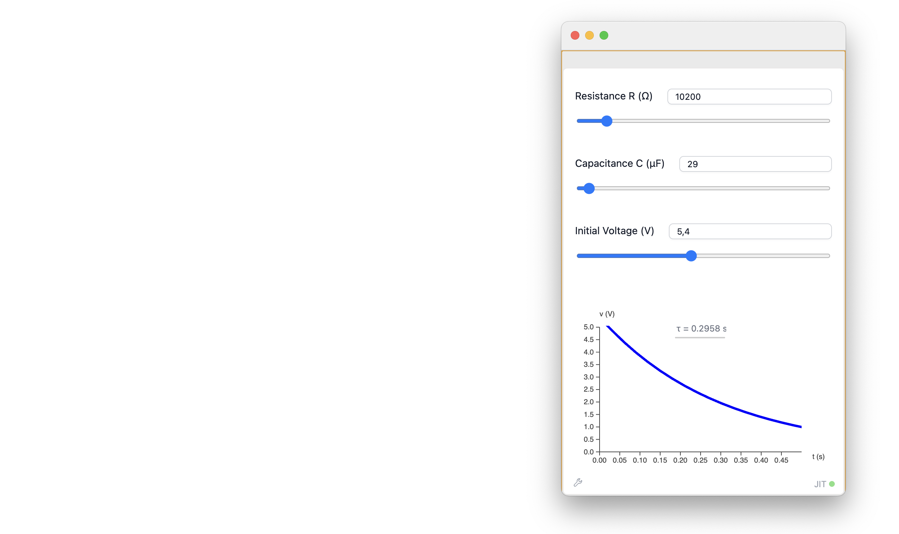

</div>

The same can be done if you serve it from a server by URL. It would look like this:

```
http://127.0.0.1:20560/...urlEncodedpath...RC.wlw
```


Here is an example:

<div className="invertColor">

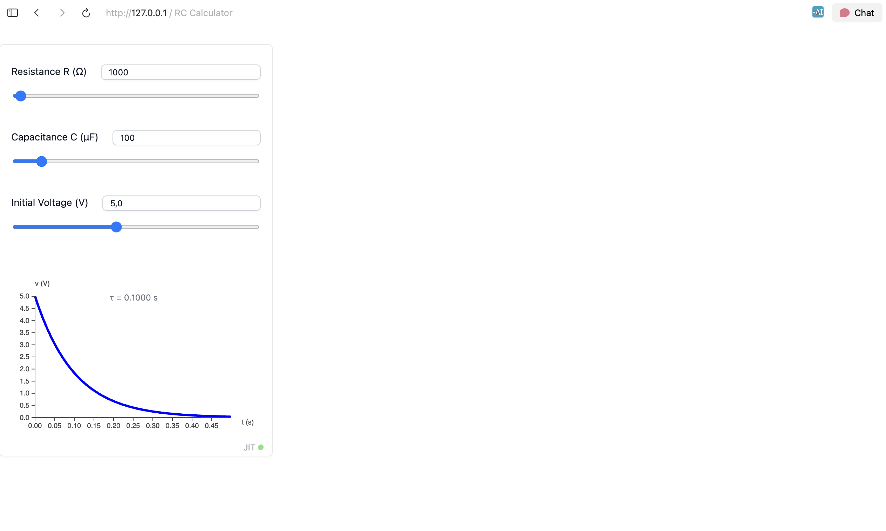

</div>

There are many distracting elements, and the window size is off. Let's customize the output using a WLX cell instead of plain Wolfram output:

<WLJSWrapper><wljs-editor lazy="true" display="codemirror" type="Input" editable="true"  >{`OutputWidget = Manipulate[
	 Module[{sol, \\[Tau], tmax},
	  \\[Tau] = R C (*SpB[*)Power[10(*|*),(*|*)-6](*]SpB*);              (* time constant in seconds *)
	  tmax = 5\\[Tau];           (* show 5 time constants = ~99% decay *)
	  sol = NDSolve[{v'[t] == -v[t]/τ, v[0] == V0}, v, {t, 0, tmax}];
	  
	  Plot[v[t] /. sol[[1]], {t, 0, tmax},
	   PlotRange -> {0, V0},
	   AxesLabel -> {"t (s)", "v (V)"},
	   PlotLabel -> "τ = " <> ToString[NumberForm[\\[Tau]//N, {6,4}]] <> " s",
	   PlotStyle -> {Thick, Blue}
	   ]
	  ],
	 {{R, (*SpB[*)Power[10(*|*),(*|*)3](*]SpB*), "Resistance R (Ω)"}, 10, (*SpB[*)Power[10(*|*),(*|*)5](*]SpB*), 10},
	 {{C, 100, "Capacitance C (μF)"}, 1, (*SpB[*)Power[10(*|*),(*|*)3](*]SpB*), 1},
	 {{V0, 5, "Initial Voltage (V)"}, 0, 12, 0.1},
	 ContinuousAction->True,
	 Appearance->None
	];`}</wljs-editor></WLJSWrapper>

Then make the cell above an <small>Initialization Cell</small>, while the last cell becomes:

<WLJSWrapper><wljs-editor lazy="true" display="codemirror" type="Input" editable="true"  >{`.wlx
	<div class="bg-white h-full">
	  <OutputWidget/>
	  <script>
	    resizeTo(400,538);
	  </script>
	</div>`}</wljs-editor></WLJSWrapper>

Here is the result:

<div className="invertColor">

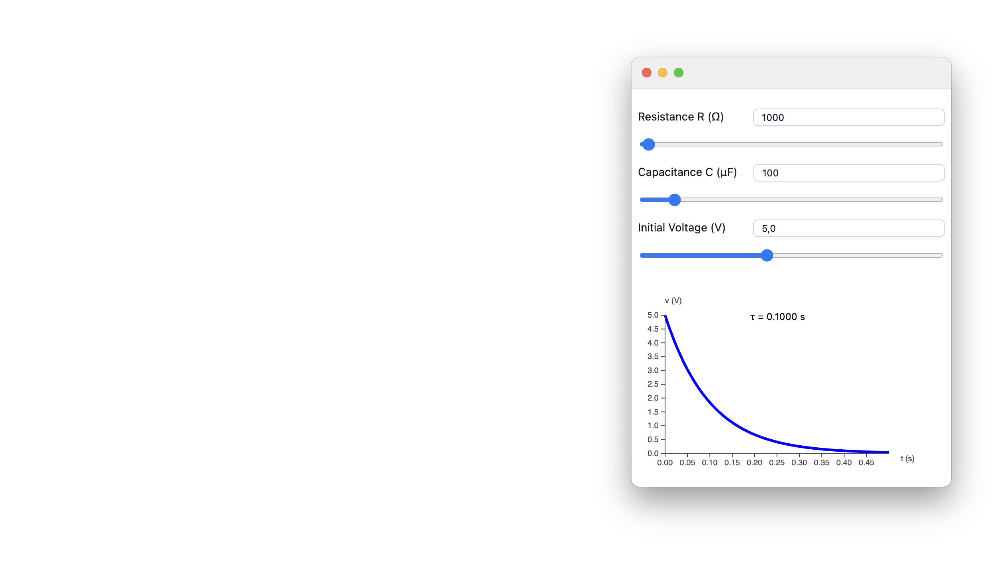

</div>


This works because `Manipulate`, along with many other symbols, has the output form `WLXForm` defined. Normally, everything that enters a WLX cell is converted to a string unless this output form is defined. Check our documentation for details.

However, if you still want to show something in WLX output while preserving the normal output look (a.k.a. `StandardForm`), use:

<WLJSWrapper><wljs-editor lazy="true" display="codemirror" type="Input" editable="true"  >{`OutputWidget = StandardForm[...];`}</wljs-editor></WLJSWrapper>

It will create a hidden container and render the inner expression as if it were a normal Wolfram output cell.

Note that the `OutputWidget` symbol is localized. You can check this by evaluating:

<WLJSWrapper><wljs-editor lazy="true" display="codemirror" type="Input" editable="true" encoded="true"  >{`Names%5B%22%2A%60OutputWidget%22%5D`}</wljs-editor></WLJSWrapper>

<WLJSWrapper><wljs-editor lazy="true" display="codemirror" type="Output" encoded="true"  >{`%7B%22freesia779w%60OutputWidget%22%2C%22service39aw%60OutputWidget%22%7D`}</wljs-editor></WLJSWrapper>

This tells us that two independent instances of this app have been created.


### A note on WLW format

The `.wlw` file we just exported is nothing more than a regular `.wln` notebook in terms of content. __The exporter changes only the file extension.__ This means that you can inspect the source notebook of any mini-app you have.

The best part is that these apps work like storybooks: narrative cells, experiments, and tests are not stripped from the `.wlw` file. Anyone can look through them, tweak them, or learn from them.

You can keep tests for your code there too. If you do not mark those cells as *Initialization cells*, they will not be evaluated when the app starts.


### Other examples

Let's try another example with basic text input and manual handling of all events. __Create two cells__ and export them as an app:

<WLJSWrapper><wljs-editor lazy="true" display="codemirror" type="Input" editable="true"  >{`.md
	# Spray Text Example
	A small test of low-level interactivity`}</wljs-editor></WLJSWrapper>

<WLJSWrapper><wljs-editor lazy="true" display="codemirror" type="Input" editable="true"  >{`text = "Hello World";
	
	Column[{
	  EventHandler[InputText[text], (text=#)&],
	  Graphics[Table[{
	      RandomColor[],
	      Rotate[
	        Text[text // Offload, RandomReal[{-1, 1}, 2]],
	        RandomReal[{0, 3.14}]
	      ]
	  }, {40}]]
	}, Spacings->1] // Deploy`}</wljs-editor></WLJSWrapper>

We applied `Deploy` to `Column` to make every item in the column container uneditable and unselectable. The result looks like this:

<div className="invertColor">


</div>

Let's design a different app that uses the OS file-open dialog and creates a new window with an interactive plot:

<WLJSWrapper><wljs-editor lazy="true" display="codemirror" type="Input" editable="true"  >{`.md
	# Plotter
	Interactive XY dataset loader and plotter`}</wljs-editor></WLJSWrapper>

<WLJSWrapper><wljs-editor lazy="true" display="codemirror" type="Input" editable="true"  >{`dataset = RandomReal[{0,1}, {50,2}];
	refreshEvent = EventObject[];
	selectionEvent = EventObject[];
	file = Null;
	
	nb = EvaluationNotebook[];
	
	selected[_] := False;
	selected[i_Integer] := selected[ToString[i]]
	selected["1"] = True;
	selected["2"] = True;
	
	EventHandler[selectionEvent, {
	  idx_ :> Function[state,
	    selected[idx] = state;
	]}];
	
	PreviewWidget = Refresh[
	  TableView@Prepend[Table[With[{idx=ToString[i]},
	    InputCheckbox[selectionEvent, 
	      selected[idx], "Topic"->idx]
	  ], {i,Length[dataset//First]}]][dataset],
	 refreshEvent
	];
	
	params = <|"Format"->"CSV", "Header"->1|>;
	format = InputGroup[<|
	  "Format"->InputSelect[{"CSV", "TSV"}, "CSV", "Label"->"Format"],
	  "Header"->InputRange[0,3,1,1, "Label"->"Header lines"]
	|>];
	
	
	loadFile = Function[Null,
	  If[!StringQ[file], Return[]];
	  With[{
	    result = Import[file, params["Format"], HeaderLines->params["Header"]]
	  },
	    If[!MatchQ[result, {{__}..}],
	      MessageDialog["Failed to load", "Notebook"->nb];
	      Return[];
	    ];
	    dataset = result;
	    EventFire[refreshEvent, True];
	  ];
	];
	
	EventHandler[format, Function[new, 
	  params = new;
	  loadFile[];
	]];
	
	controls = EventObject[];
	EventHandler[controls, {
	  "Load" -> Function[Null,
	    Then[SystemDialogInputAsync["FileOpen"], Function[path,
	      If[!StringQ[path], Return[]];
	      file = path;
	      loadFile[];
	    ]]
	  ],
	  
	  "Plot" -> Function[Null, With[{
	    tr = Transpose[dataset]
	  }, {
	    filtered = Select[
	      Transpose[
	        Table[If[selected[i], tr[[i]], Nothing], {i, Length[tr]}]
	      ],
	      MatchQ[{_?NumberQ, _?NumberQ}]
	    ]
	  },
	    If[Length[filtered] < 3,
	      MessageDialog[
	        "Data should contain 2 numerical columns", 
	        "Notebook"->nb
	      ];
	      Return[];
	    ];    
	    CreateWindow[
	      ListLinePlot[filtered, PlotRange->Full, ImageSize->{460,300}], 
	      WindowSize->{600,400}
	    ];
	  ]]
	}];
	
	ControlsWidget = Column[{
	  Row[{
	    InputButton[controls, "Load file", "Topic"->"Load"],
	    InputButton[controls, "Plot", "Topic"->"Plot"]
	  }],
	  format
	}];
	
	Row[
	  {PreviewWidget, ControlsWidget}, 
	  ImageSize->600, Alignment->{{Left,Right}, Top}
	] // Deploy`}</wljs-editor></WLJSWrapper>


<div className="invertColor">

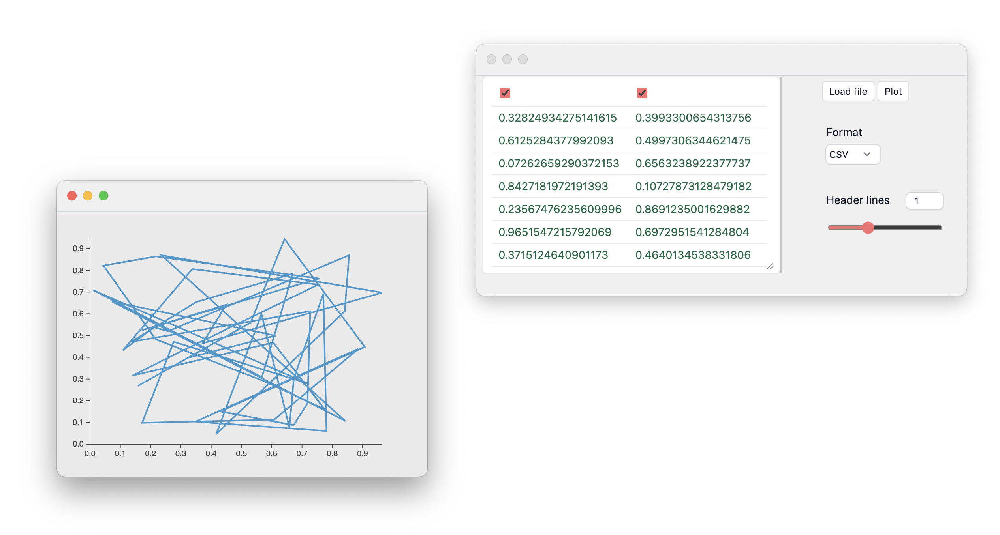

</div>

For the most part, we design safety checks because the input is arbitrary. Any file is imported and parsed according to `params`. Any change updates `TableView` in `PreviewWidget` by manually firing the corresponding event object passed to `Refresh`. The dataset is also prepended with a row of checkboxes synchronized with a "hashmap" called `selected`. When you click *Plot*, it filters the columns according to the indices in `selected` and plots the result in a new window.

<Callout>
`SystemDialogInput` is not available if the app is running on a server. Use `InputFile` instead.
</Callout>

Overall, the UI could be customized further using WLX cells.

Here is another example of an app that takes two images and uses a local CNN to exchange their drawing styles. Let's check it in our notebook first:

<WLJSWrapper><wljs-editor lazy="true" display="codemirror" type="Input" editable="true"  >{`img1 = ExampleData[{"TestImage", "Lena"}];
	img2 = ExampleData[{"TestImage", "Mandrill"}];
	
	Map[ImageResize[#, 200]&, 
	  {img1~ImageRestyle~img2, img2~ImageRestyle~img1}
	] // Row`}</wljs-editor></WLJSWrapper>

<WLJSWrapper><wljs-editor lazy="true" display="codemirror" type="Output"  >{`(*GB[*){{(*VB[*)(FrontEndRef["dee7fcb7-314e-41a5-90d6-c10740beee87"])(*,*)(*"1:eJxTTMoPSmNkYGAoZgESHvk5KRCeEJBwK8rPK3HNS3GtSE0uLUlMykkNVgEKp6SmmqclJ5nrGhuapOqaGCaa6loapJjpJhsamJsYJKWmplqYAwCRLRYE"*)(*]VB*)(*|*),(*|*)(*VB[*)(FrontEndRef["0c11a225-9369-4257-9b62-ada3e4aa10e5"])(*,*)(*"1:eJxTTMoPSmNkYGAoZgESHvk5KRCeEJBwK8rPK3HNS3GtSE0uLUlMykkNVgEKGyQbGiYaGZnqWhqbWeqaGJma61ommRnpJqYkGqeaJCYaGqSaAgBzuxUx"*)(*]VB*)}}(*||*)(*1:eJxTTMoPSmNkYGAo5gUSYZmp5S6pyflFiSX5RcEsQBH3oswUAJ89CUc=*)(*]GB*)`}</wljs-editor></WLJSWrapper>

What a horror...

Now we sketch an app that takes two files, processes them asynchronously, and then outputs the result:

<WLJSWrapper><wljs-editor lazy="true" display="codemirror" type="Input" editable="true"  >{`.md
	# 2 Image Restyler
	Upload two images to see the result`}</wljs-editor></WLJSWrapper>

<WLJSWrapper><wljs-editor lazy="true" display="codemirror" type="Input" editable="true"  >{`(* make it initialzation cell *)
	(* launch parallel kernels *)
	If[Kernels[] === {}, LaunchKernels[2]];
	
	process[img1_Image, img2_Image] := {
	  ParallelSubmitAsync[ImageRestyle[img1, img2]],
	  ParallelSubmitAsync[ImageRestyle[img2, img1]]
	};
	
	FileWidget = InputFile[];
	DownloadButton = InputButton["Save","Style"->"height:2.4rem"];
	nb = EvaluationNotebook[];
	files = {};
	refresh = EventObject[];
	output = Invisible[Null];
	images = Null;
	
	EventHandler[DownloadButton, Function[Null,
	  If[images === Null,
	    MessageDialog["Nothing to save", "Notebook"->nb];
	    Return[];
	  ];
	  FrontSubmit[
	    FrontFileDownload[
	      ExportByteArray[ImageCollage@images, "PNG"], 
	      "image.png"
	    ]
	  ];
	]];
	
	EventHandler[FileWidget, {"Transaction" -> Function[assoc,
	  files = {};
	  If[assoc["Length"] =!= 2,
	    MessageDialog["Failed. Upload 2 images", "Notebook"->nb];
	    EventRemove[FileWidget, "File"];
	    Return[];
	  ];
	  
	  EventHandler[FileWidget, {"File" -> Function[data,
	    AppendTo[files, ImportByteArray[data["Data"] // BaseDecode]];
	    If[Length[files] > 1,
	      EventRemove[FileWidget, "File"];
	      If[!MatchQ[files, {_Image..}],
	        MessageDialog["Files are not images", "Notebook"->nb];
	        Return[];
	      ];
	      
	      output = Style["Processing...", 10];
	      EventFire[refresh, "Refresh", True];
	      Then[process@@files, Function[results,
	        images = results;
	        output = Map[ImageResize[#, UpTo[350]]&, images] // Row // Deploy;
	        EventFire[refresh, "Refresh", True];
	      ]];
	    ];
	  ]}];
	]}];`}</wljs-editor></WLJSWrapper>

<WLJSWrapper><wljs-editor lazy="true" display="codemirror" type="Input" editable="true"  >{`.wlx
	
	With[{
	  OutputCanvas = Refresh[output, refresh]
	},
	  <div class="bg-white h-full w-full flex flex-col gap-y-2 p-2">
	    <div class="w-full gap-x-2 flex flex-row">
	      <FileWidget/><DownloadButton/>
	    </div>
	    <OutputCanvas/>
	    <script>resizeTo(400,500)</script>
	  </div>
	]`}</wljs-editor></WLJSWrapper>

<div className="invertColor">


</div>

Here we could have used `SystemDialogInput` to choose a path for saving our image, but that would not work remotely on a server. Therefore, instead of:

<WLJSWrapper><wljs-editor lazy="true" display="codemirror" type="Input" editable="true"  >{`Export[
	  FileNameJoin[{filePath, "image.png"}],
	  collage
	]`}</wljs-editor></WLJSWrapper>

we used:

<WLJSWrapper><wljs-editor lazy="true" display="codemirror" type="Input" editable="true"  >{`FrontFileDownload[
	  ExportByteArray[collage, "PNG"],
	  "image.png"
	] // FrontSubmit`}</wljs-editor></WLJSWrapper>

That creates a file-saving dialog even though the Wolfram Kernel has no direct access to your OS file system.

### How to use JavaScript
One of WLJS's selling points is that the cross-bindings between the JavaScript and Wolfram worlds are not limited to JSON serialization. They can be fast enough even for tasks such as video streaming. You can read more about [how this works in our documentation](https://wljs.io/frontend/Advanced/Frontend-functions/Overview).

Here, we shall try something without lengthy preparation. The simplest starting point is to create a custom UI element:

<WLJSWrapper><wljs-editor lazy="true" display="codemirror" type="Input" editable="true"  >{`.js
	
	core.CustomBlabla = async (args, env) => {
	  env.element.innerText = String(await interpretate(args[0], env));
	  env.element.style.borderRadius = "2px";
	  env.element.style.backgroundColor = "yellow";
	  env.element.style.padding = "1rem";
	}`}</wljs-editor></WLJSWrapper>

<WLJSWrapper><wljs-editor display="js" type="Output" encoded="true" class="wljs-hide-undefined" >{`%0Acore.CustomBlabla%20%3D%20async%20%28args%2C%20env%29%20%3D%3E%20%7B%0A%20%20env.element.innerText%20%3D%20String%28await%20interpretate%28args%5B0%5D%2C%20env%29%29%3B%0A%20%20env.element.style.borderRadius%20%3D%20%222px%22%3B%0A%20%20env.element.style.backgroundColor%20%3D%20%22yellow%22%3B%0A%20%20env.element.style.padding%20%3D%20%221rem%22%3B%0A%7D`}</wljs-editor></WLJSWrapper>

Then define two output forms: one for standard Wolfram Language output and another for WLX cells:

<WLJSWrapper><wljs-editor lazy="true" display="codemirror" type="Input" editable="true"  >{`CustomBlabla /: MakeBoxes[c_CustomBlabla, StandardForm] := ViewBox[c, c]
	CustomBlabla /: MakeBoxes[c_CustomBlabla, WLXForm] := CreateFrontEndObject[c]`}</wljs-editor></WLJSWrapper>

We will not go into the details yet; just try evaluating:

<WLJSWrapper><wljs-editor lazy="true" display="codemirror" type="Input" editable="true"  >{`CustomBlabla[54]`}</wljs-editor></WLJSWrapper>

<WLJSWrapper><wljs-editor lazy="true" display="codemirror" type="Output"  >{`(*VB[*)(CustomBlabla[54])(*,*)(*"1:eJxTTMoPSmNkYGAoZgESHvk5KRAeD5BwLi0uyc91yklMyknMNAMKAADT/gno"*)(*]VB*)`}</wljs-editor></WLJSWrapper>

For an app, it is better to keep the custom symbol lexically isolated as well, and to move its frontend definition into the WLX output cell. Let's do that:

<WLJSWrapper><wljs-editor lazy="true" display="codemirror" type="Input" editable="true"  >{`.md
	# Mini-app test with JS 1`}</wljs-editor></WLJSWrapper>

<WLJSWrapper><wljs-editor lazy="true" display="codemirror" type="Input" editable="true"  >{`.wlx
	
	IsolatedSymbol;
	IsolatedSymbol /: MakeBoxes[c_IsolatedSymbol, WLXForm] := CreateFrontEndObject[c];
	
	With[{Element = IsolatedSymbol[RandomReal[]]},
	  <div class="bg-white">
	    <p>This is a test of custom UI elements</p>
	    <Element/>
	
	    <script type="module">
	      core['<IsolatedSymbol/>'] = async (args, env) => {
	        env.element.innerText = String(await interpretate(args[0], env));
	        env.element.style.borderRadius = "2px";
	        env.element.style.backgroundColor = "lightblue";
	        env.element.style.padding = "1rem";
	      }
	    </script>
	  </div>
	]`}</wljs-editor></WLJSWrapper>

Scripts placed in a WLX output cell using a `script` tag have priority over the rest of the content. If we define an `.update` method, changing data can be bound to it. Here is a basic example with a slider and our custom element:

<WLJSWrapper><wljs-editor lazy="true" display="codemirror" type="Input" editable="true"  >{`.md
	# Mini-app test with JS 2`}</wljs-editor></WLJSWrapper>

<WLJSWrapper><wljs-editor lazy="true" display="codemirror" type="Input" editable="true"  >{`.wlx
	
	IsolatedSymbol;
	IsolatedSymbol /: MakeBoxes[c_IsolatedSymbol, WLXForm] := CreateFrontEndObject[c];
	dynamicData = 0.5;
	
	With[{}, {
	  Element = IsolatedSymbol[dynamicData // Offload],
	  Slider = EventHandler[InputRange[0,1,0.1,0.5, "Label"->"Drag me"],
	     (dynamicData = #)& 
	  ]
	},
	  dynamicData = 0.5;
	
	  <div class="bg-white">
	    <p>This is a test of custom UI elements. A slider:</p>
	    <Slider/>
	    <p>Output element:</p>
	    <Element/>
	
	    <script type="module">
	      core['<IsolatedSymbol/>'] = async (args, env) => {
	        env.element.innerText = String(await interpretate(args[0], env));
	        env.element.style.borderRadius = "2px";
	        env.element.style.backgroundColor = "lightblue";
	        env.element.style.padding = "1rem";
	      }
	      core['<IsolatedSymbol/>'].update = async (args, env) => {
	        env.element.innerText = String(await interpretate(args[0], env));
	      }
	      core['<IsolatedSymbol/>'].virtual = true;
	    </script>
	  </div>
	]`}</wljs-editor></WLJSWrapper>

<WLJSWrapper><wljs-editor display="wlx" type="Output"  >{`<div class="bg-white"><p >This is a test of custom UI elements. A slider:</p>FrontEndExecutable[d8216fbb-11ea-490c-aa28-46e91e3683d8]<p >Output element:</p>FrontEndExecutable[da76b6ff-867f-48f8-9c92-01a0a8ea9621]<script type="module"> core['IsolatedSymbol'] = async (args, env) => {
	        env.element.innerText = String(await interpretate(args[0], env));
	        env.element.style.borderRadius = "2px";
	        env.element.style.backgroundColor = "lightblue";
	        env.element.style.padding = "1rem";
	      }
	      core['IsolatedSymbol'].update = async (args, env) => {
	        env.element.innerText = String(await interpretate(args[0], env));
	      }
	      core['IsolatedSymbol'].virtual = true;</script></div>`}</wljs-editor></WLJSWrapper>


<Callout type="idea">
Read more about using frontend symbols for data visualization in the [Frontend symbols](https://wljs.io/frontend/Advanced/Frontend-functions/3rd-party-libs) guide.
</Callout>


Here is the __opposite example__, where data are sent back to the Wolfram Kernel. We start with a simple JavaScript button:

<WLJSWrapper><wljs-editor lazy="true" display="codemirror" type="Input" editable="true"  >{`.js
	
	core.CustomButton = async (args, env) => {
	  const evId = await interpretate(args[0], env);
	  env.element.innerText = "click me";
	  env.element.style.background = 'yellow';
	  env.element.addEventListener('click', () => {
	    server.kernel.io.fire(evId, true);
	  });
	}`}</wljs-editor></WLJSWrapper>

<WLJSWrapper><wljs-editor display="js" type="Output" encoded="true" class="wljs-hide-undefined" >{`%0Acore.CustomButton%20%3D%20async%20%28args%2C%20env%29%20%3D%3E%20%7B%0A%20%20const%20evId%20%3D%20await%20interpretate%28args%5B0%5D%2C%20env%29%3B%0A%20%20env.element.innerText%20%3D%20%22click%20me%22%3B%0A%20%20env.element.style.background%20%3D%20%27yellow%27%3B%0A%20%20env.element.addEventListener%28%27click%27%2C%20%28%29%20%3D%3E%20%7B%0A%20%20%20%20server.kernel.io.fire%28evId%2C%20true%29%3B%0A%20%20%7D%29%3B%0A%7D`}</wljs-editor></WLJSWrapper>

Then provide an event ID as an argument and attach an event handler:

<WLJSWrapper><wljs-editor lazy="true" display="codemirror" type="Input" editable="true"  >{`CustomButton /: MakeBoxes[c_CustomButton, StandardForm] := ViewBox[c, c];
	uid = CreateUUID[];
	
	CustomButton[uid]
	EventHandler[uid, Echo];`}</wljs-editor></WLJSWrapper>

<WLJSWrapper><wljs-editor lazy="true" display="codemirror" type="Output"  >{`(*VB[*)(CustomButton["df5716d3-d07f-45e7-9bf9-c1e2d704a46c"])(*,*)(*"1:eJxTTMoPSmNkYGAoZgESHvk5KRAeD5BwLi0uyc91Ki0pyc8LVgEKpKSZmhuapRjrphiYp+mamKaa61ompVnqJhumGqWYG5gkmpglAwDwGROu"*)(*]VB*)`}</wljs-editor></WLJSWrapper>


<Callout type="idea">
Read more about this in the [Custom UI components guide](https://wljs.io/frontend/Advanced/Frontend-functions/Custom-input).
</Callout>

One can get creative by combining WLX and JavaScript, but we shall leave that for another post.

## Lorentz Oscillator Fitter
Now we shall build something more complicated. Here is the outline:

- App
  - File loader ← entry point
  - Fitting UI

We can borrow the file-loading part from the plotter example discussed earlier. The fitting UI itself is the more interesting part.

### Physical model
Before looking at the equations, imagine pushing a swing. It has a preferred frequency: push near that frequency and the motion becomes large. Friction removes energy, so the motion does not grow forever and the resonance is not infinitely sharp. The Lorentz oscillator is the mathematical version of this idea.

The same pattern appears at many scales: bound electrons and nuclei, molecular vibrations, ionic bonds, and even an ordinary spring. After folding constants such as the mass into the other quantities, all of them can be represented by the same equation:

<WLJSWrapper><wljs-editor lazy="true" display="codemirror" type="Input" editable="true"  >{`lorentz = x''[t] + \\[Gamma] x'[t] + (*SpB[*)Power[\\[Nu](*|*),(*|*)2](*]SpB*) x[t] == e[t];`}</wljs-editor></WLJSWrapper>

Here `x[t]` is a generalized coordinate: it may be a literal displacement, but it can also stand for the polarization created by bound charges. The parameter $\nu$ is the natural resonance frequency - the frequency at which the system prefers to oscillate. The damping rate $\gamma$ tells us how quickly energy leaks into the surroundings: larger $\gamma$ means a broader, less sharp resonance. Finally, `e[t]` is the external drive, such as the electric field of light or a finger pushing a spring.

This is deliberately a model. It does not say where the lost energy goes or what microscopic process creates the damping. It also assumes a linear response: if we double a sufficiently small drive, the response doubles.

> In physics and mathematics, if you can solve a linear problem for a single sine or cosine wave, you can build the response to an arbitrary signal by Fourier decomposition. The same applies for a case a series of step functions or infinitely shorts spikes (Green's function or kernel).

So let us use a harmonic drive, $e(t)=e_0 e^{i\omega t}$, and look for a response with the same frequency, $x(t)=x_0 e^{i\omega t}$. The complex exponential is only compact notation; the measurable signal is its real part. Because the equation is linear, different frequency components do not mix.

<WLJSWrapper><wljs-editor lazy="true" display="codemirror" type="Input" editable="true"  >{`frequencyEquation = lorentz /. {
	  e[t] -> e0 Exp[I \\[Omega] t],
	  Derivative[n_][x][t] :> D[x0 Exp[I \\[Omega] t], {t, n}],
	  x[t] -> x0 Exp[I \\[Omega] t]
	} // FullSimplify`}</wljs-editor></WLJSWrapper>

<WLJSWrapper><wljs-editor lazy="true" display="codemirror" type="Output"  >{`((*SpB[*)Power[E(*|*),(*|*)I t \\[Omega]](*]SpB*)) (e0-x0 ((*SpB[*)Power[\\[Nu](*|*),(*|*)2](*]SpB*))+x0 \\[Omega] (-I \\[Gamma]+\\[Omega]))==0`}</wljs-editor></WLJSWrapper>

After the common factor $e^{i\omega t}$ cancels, the differential equation becomes an algebraic equation in the frequency domain. That is much easier to solve for the response amplitude $x_0$:

<WLJSWrapper><wljs-editor lazy="true" display="codemirror" type="Input" editable="true"  >{`responseRule = Solve[frequencyEquation, x0][[1, 1]]`}</wljs-editor></WLJSWrapper>

<WLJSWrapper><wljs-editor lazy="true" display="codemirror" type="Output"  >{`x0->(*FB[*)((e0)(*,*)/(*,*)((*SpB[*)Power[\\[Nu](*|*),(*|*)2](*]SpB*)+I \\[Gamma] \\[Omega]-(*SpB[*)Power[\\[Omega](*|*),(*|*)2](*]SpB*)))(*]FB*)`}</wljs-editor></WLJSWrapper>

This result is the frequency response $x_0/e_0$. Its magnitude becomes large when the driving frequency $\omega$ approaches the natural frequency $\nu$, while $\gamma$ controls how broad the peak is. The response is complex because the oscillator is also shifted in phase relative to the drive. Let us plot both magnitude and phase:

<WLJSWrapper><wljs-editor lazy="true" display="codemirror" type="Input" editable="true"  >{`Module[{h = x0/e0 /. responseRule},
	  Deploy@Row[{
	    Plot[Evaluate@Abs[h /. {\\[Nu] -> 5., \\[Gamma] -> 1.}], {\\[Omega], 0, 10},
	      Frame -> True, FrameLabel -> {"Driving frequency", "Response magnitude"}, Filling -> 0, ImageSize -> 300],
	    Plot[Evaluate@Arg[h /. {\\[Nu] -> 5., \\[Gamma] -> 1.}], {\\[Omega], 0, 10},
	      Frame -> True, FrameLabel -> {"Driving frequency", "Phase (radians)"},
	      PlotStyle -> ColorData[97][2], Filling -> -Pi/2, ImageSize -> 300]
	  }]
	]`}</wljs-editor></WLJSWrapper>

<WLJSWrapper><wljs-editor lazy="true" display="codemirror" type="Output"  >{`(*GB[*){{(*VB[*)(FrontEndRef["4749e447-2844-4fe2-8ef6-11e2c2873d1a"])(*,*)(*"1:eJxTTMoPSmNkYGAoZgESHvk5KRCeEJBwK8rPK3HNS3GtSE0uLUlMykkNVgEKm5ibWKaamJjrGlmYmOiapKUa6VqkppnpGhqmGiUbWZgbpxgmAgB1ABUh"*)(*]VB*)(*|*),(*|*)(*VB[*)(FrontEndRef["4d0642f4-7874-4c88-8056-fa765458dd86"])(*,*)(*"1:eJxTTMoPSmNkYGAoZgESHvk5KRCeEJBwK8rPK3HNS3GtSE0uLUlMykkNVgEKm6QYmJkYpZnomluYm+iaJFtY6FoYmJrppiWam5mamFqkpFiYAQBy0RTV"*)(*]VB*)}}(*||*)(*1:eJxTTMoPSmNiYGAo5gUSYZmp5S6pyflFiSX5RcEsQBH3oswUiDyIF1Sak1rMBWQEp+akJpckJgG5rECuW2JOcSoAqAgSkw==*)(*]GB*)`}</wljs-editor></WLJSWrapper>

Why does the phase become $\pi/2$ at resonance? Below resonance, the restoring force dominates and the oscillator follows the drive almost in phase. Far above resonance, inertia dominates and the response is almost opposite to the drive. Exactly at $\omega=\nu$, these two reactive contributions cancel: in the frequency-domain denominator, $\nu^2-\omega^2=0$, leaving only the damping term $i\gamma\omega$. A purely imaginary response means a phase difference of $\pi/2$.

There is also a direct energy interpretation. Write the drive and response as

$$
e(t)=e_0\cos(\omega t), \qquad x(t)=X\cos(\omega t-\delta).
$$

The instantaneous power delivered to the oscillator is the force times its velocity, $P(t)=e(t)\dot{x}(t)$. Averaged over one cycle,

$$
\langle P\rangle=\frac{1}{2}e_0\omega X\sin\delta.
$$

If the displacement is in phase with the drive ($\delta=0$), the drive stores energy in the oscillator during one part of the cycle and receives it back during another; the average transfer is zero. At $\delta=\pi/2$, the drive is in phase with the **velocity** rather than the displacement. It therefore keeps doing positive work, and the damping mechanism converts that supplied energy into heat, phonons, or some other form. This is the physical link between a quadrature response and loss.

The same idea appears in optics. Polarization in phase with the electric field mainly stores and returns energy; the out-of-phase component is represented by the imaginary part of the dielectric response and produces absorption.

One subtle point: the phase shift alone does not tell us how much energy is lost. At exact resonance, any finite damping gives the same $\pi/2$ shift, while the absorbed power also depends on the response amplitude and the damping strength. With no damping at all, there is no finite steady-state solution at exact resonance - the amplitude would keep growing.

The following plot shows the drive and the normalized response over one cycle. Their maxima are separated by a quarter-period:

<WLJSWrapper><wljs-editor lazy="true" display="codemirror" type="Input" editable="true"  >{`Module[{\\[Omega]0 = 5., \\[Gamma] = 1., h, period},
	  h = 1/(\\[Omega]0^2 - \\[Omega]0^2 + I \\[Gamma] \\[Omega]0);
	  period = 2 Pi/\\[Omega]0;
	  Plot[{Cos[\\[Omega]0 t], Re[h Exp[I \\[Omega]0 t]]/Abs[h]}, {t, 0, period},
	    Frame -> True, FrameLabel -> {"Time", "Normalized signal"},
	    PlotLegends -> {"Drive", "Response"}, PlotRange -> {-1.1, 1.1}]
	]`}</wljs-editor></WLJSWrapper>

<WLJSWrapper><wljs-editor lazy="true" display="codemirror" type="Output"  >{`(*VB[*)(Legended[ToExpression[FrontEndRef["9a384b43-6cc6-4523-84db-456912ad3052"], InputForm], Placed[LineLegend[{Directive[Opacity[1.], RGBColor[0.24, 0.6, 0.8], AbsoluteThickness[2]], Directive[Opacity[1.], RGBColor[0.95, 0.627, 0.1425], AbsoluteThickness[2]]}, {"Drive", "Response"}, LegendMarkers -> None, LabelStyle -> {}, LegendLayout -> "Column"], After, Identity]])(*,*)(*"1:eJylUjtOAzEQXT7hE4EEHAAJiTYSZJMoKaJVIAEhJQSyEb13dxasGDuyvUAOwCGgpeMEqTkABQ0HgAYhIbgBYy8fJQ0FUzxZM88zb569FohOPOU4jlpEOKJwXodQSKKF9Gcx04Rj4FE+pWQRGhHFmiHGEya3grAjBdcNHjUuIEw0CRj465iuELdcCApurhSGpVyhmHdz5UIU4KlU2cyTyN0o5uNJ02QaoZPgtTlzABK1ORvYbFcmMMYxKnxgENpJKmMEEKYg1TiDcMBICFGc+dbcpBzSRX5bNanS6Y15hDqV2I+eQbqU2bzdJyHVA+nYePdSshW4u7UtmJByuHr5eji896Rr48mT11cmXry0zTJCLVCCJRq6JzTscVCKGgn/nRzbePPk7cdDK1h69mQ1+3jTr979PXnEAd94VJc4/st61RdcjTluv0bqX4vIHkhlS/uCjxOt2SQA5usBg9gZMXuUuvDTs0kGItG+eThcLjnl9klrscZBRtReBFyjH5+n+63T"*)(*]VB*)`}</wljs-editor></WLJSWrapper>

How does this oscillator become an absorption spectrum? In a material, the electric field of light pushes bound charges. Their collective displacement produces a polarization, which we summarize with a complex dielectric function. For a non-magnetic medium, the complex refractive index is

$$
\hat{n} = n + i\kappa = \sqrt{\varepsilon}.
$$

The real part $n$ mainly controls refraction and phase velocity. The imaginary part $\kappa$, called the extinction coefficient, describes attenuation inside the material.

If several independent resonances contribute, their linear responses add. Using 1 as a simplified background dielectric constant, we write

$$
\varepsilon(\omega) = 1 + \sum_j\frac{S_j}{\nu_j^2 - \omega^2 + i \gamma_j \omega}.
$$

Each term has a resonance frequency $\nu_j$, damping $\gamma_j$, and strength $S_j$. Close to $\nu_j$, that oscillator absorbs energy efficiently and produces a peak.

To connect this with a transmission measurement, consider the intensity ratio

$$
T = |E_{\text{out}}/E_{\text{in}}|^2.
$$

For a thick, homogeneous sample, and when attenuation inside the material dominates over interference and interface reflections, this simplifies to

$$
T \approx \exp\Big(- \frac{2 \omega \kappa L}{c}\Big) = \exp(-\alpha L).
$$

Here $L$ is the sample thickness and $c$ is the speed of light. This is the Beer–Lambert law. The frequency-dependent absorption coefficient is

$$
\alpha(\omega) = \frac{2\omega}{c}\operatorname{Im}\sqrt{\varepsilon(\omega)}.
$$

The sign of the imaginary part depends on the Fourier convention; physically, $\alpha$ is taken as a positive loss.

This law is illustrated below: the intensity stays constant before the sample and then decays exponentially while light travels through it.

<WLJSWrapper><wljs-editor lazy="true" display="codemirror" type="Output"  >{`(*VB[*)(FrontEndRef["ab604450-e0b0-4f2e-8108-d93a095f8365"])(*,*)(*"1:eJxTTMoPSmNkYGAoZgESHvk5KRCeEJBwK8rPK3HNS3GtSE0uLUlMykkNVgEKJyaZGZiYmBrophokGeiapBml6loYGljoplgaJxpYmqZZGJuZAgB88RUN"*)(*]VB*)`}</wljs-editor></WLJSWrapper>

If the Lorentz-oscillator contribution is small compared with the background, we can use $\sqrt{1+z} \approx 1+z/2$. We also fold the constant factor $2/c$ into the oscillator strengths. Wolfram Language can perform this expansion directly:

<WLJSWrapper><wljs-editor lazy="true" display="codemirror" type="Input" editable="true"  >{`weakIndex = \\[Omega] Normal@Series[Sqrt[1 + z], {z, 0, 1}] /.
	  z -> S/(\\[Nu]^2 - \\[Omega]^2 + I \\[Gamma] \\[Omega])`}</wljs-editor></WLJSWrapper>

<WLJSWrapper><wljs-editor lazy="true" display="codemirror" type="Output"  >{`\\[Omega] (1+(*FB[*)((S)(*,*)/(*,*)(2 ((*SpB[*)Power[\\[Nu](*|*),(*|*)2](*]SpB*)+I \\[Gamma] \\[Omega]-(*SpB[*)Power[\\[Omega](*|*),(*|*)2](*]SpB*))))(*]FB*))`}</wljs-editor></WLJSWrapper>

<WLJSWrapper><wljs-editor lazy="true" display="codemirror" type="Input" editable="true"  >{`Assuming[{S > 0, \\[Nu] > 0, \\[Gamma] > 0, \\[Omega] > 0},
	  FullSimplify[-2 ComplexExpand[Im[weakIndex]]]
	]`}</wljs-editor></WLJSWrapper>

<WLJSWrapper><wljs-editor lazy="true" display="codemirror" type="Output"  >{`(*FB[*)((S \\[Gamma] ((*SpB[*)Power[\\[Omega](*|*),(*|*)2](*]SpB*)))(*,*)/(*,*)(((*SpB[*)Power[\\[Gamma](*|*),(*|*)2](*]SpB*)) ((*SpB[*)Power[\\[Omega](*|*),(*|*)2](*]SpB*))+(*SpB[*)Power[((*SpB[*)Power[\\[Nu](*|*),(*|*)2](*]SpB*)-(*SpB[*)Power[\\[Omega](*|*),(*|*)2](*]SpB*))(*|*),(*|*)2](*]SpB*)))(*]FB*)`}</wljs-editor></WLJSWrapper>

The absorptive part is the imaginary part of that expression. For one oscillator, apart from the constants already absorbed into the strength, it has the shape

$$
\alpha_j(\omega) \propto \frac{S_j\gamma_j\omega^2}{(\nu_j^2-\omega^2)^2+(\gamma_j\omega)^2}.
$$

For the UI, it is more convenient to replace $S_j$ with a parameter $A_j$ chosen so that the peak value at $\omega=\nu_j$ is exactly $A_j$, independent of the linewidth $\gamma_j$. This gives us the function below:

<WLJSWrapper><wljs-editor lazy="true" display="codemirror" type="Input" editable="true"  >{`lorentz[\\[Omega]0_, A_, \\[Gamma]_][\\[Omega]_] :=  (*FB[*)((\\[Omega])(*,*)/(*,*)(1))(*]FB*) (*FB[*)((A \\[Omega] (*SpB[*)Power[\\[Gamma](*|*),(*|*)2](*]SpB*))(*,*)/(*,*)(((*SpB[*)Power[\\[Gamma](*|*),(*|*)2](*]SpB*)) ((*SpB[*)Power[\\[Omega](*|*),(*|*)2](*]SpB*))+(*SpB[*)Power[(-((*SpB[*)Power[\\[Omega](*|*),(*|*)2](*]SpB*))+(*SpB[*)Power[\\[Omega]0(*|*),(*|*)2](*]SpB*))(*|*),(*|*)2](*]SpB*)))(*]FB*);`}</wljs-editor></WLJSWrapper>

This defines one Lorentz-oscillator contribution. Its three controls have direct visual meanings: $\omega_0$ moves the peak horizontally, $A$ sets its height, and $\gamma$ changes its width. In particular, `lorentz[ω0, A, γ][ω0]` is exactly `A`.

Real spectra also contain a slowly varying background from unresolved higher-energy excitations, scattering, or the instrument itself. Over a limited frequency range, we approximate it with a simple linear term:

$$
\alpha_{\text{background}}(\omega) = g\omega.
$$

This is not meant to describe another resolved resonance; it is merely a convenient local baseline. The following function adds that background to all Lorentz contributions, applies an overall scale, and samples the spectrum over the requested range:

<WLJSWrapper><wljs-editor lazy="true" display="codemirror" type="Input" editable="true"  >{`\\[Alpha][model_List, g_, scale_, {min_, max_, step_}] := Module[{\\[Omega]},
	  Table[{\\[Omega], scale(\\[Omega] g  + Sum[i[\\[Omega]], {i, model}])}, {\\[Omega], min, max, step}]
	];`}</wljs-editor></WLJSWrapper>

We can now generate a sample spectrum by supplying a list of Lorentz profiles:

<WLJSWrapper><wljs-editor lazy="true" display="codemirror" type="Input" editable="true"  >{`ListLinePlot[\\[Alpha][{
	  lorentz[1.3, 12.0, 0.1], lorentz[5.5, 4.0, 1.0]
	}, 0., 1., {0., 10., .01}], PlotRange -> Full, Filling -> 0,
	 AxesLabel -> {"Frequency", "Absorption"}]`}</wljs-editor></WLJSWrapper>

<WLJSWrapper><wljs-editor lazy="true" display="codemirror" type="Output"  >{`(*VB[*)(FrontEndRef["00b0cb2f-99f8-4630-8a20-6d4f8968772b"])(*,*)(*"1:eJxTTMoPSmNkYGAoZgESHvk5KRCeEJBwK8rPK3HNS3GtSE0uLUlMykkNVgEKGxgkGSQnGaXpWlqmWeiamBkb6FokGhnomqWYpFlYmlmYmxslAQB+BxUf"*)(*]VB*)`}</wljs-editor></WLJSWrapper>

This is similar to what one might get from a laboratory spectrometer in biology, chemistry, or solid-state physics: several peaks spread across the frequency axis. Our UI will let the user add those peaks and adjust the same three quantities visually - position $\omega_0$, height $A$, and width $\gamma$.

## Making UI
### Locator
Let's start with one oscillator. We will adjust $A_j$ and $\nu_j$ by dragging, and $\gamma_j$ with the mouse wheel or zoom gesture. These events can be captured from almost any graphical primitive using `EventHandler`:

<WLJSWrapper><wljs-editor lazy="true" display="codemirror" type="Input" editable="true"  >{`dragged = {0,0};
	zoomed = 1.0;
	Graphics[{EventHandler[Disk[{0,0}, Offset[{10,10}]], {
	  "drag" -> Function[xy, dragged = xy],
	  "zoom" -> Function[z, zoomed = z]
	}], Red, Disk[({0.5,0.5} + dragged)//Offload, 0.25 zoomed//Offload]}, 
	Axes->True, PlotRange->2, "Controls"->False, ImagePadding->30, 
	PlotLabel->"Try to drag a black disk"]`}</wljs-editor></WLJSWrapper>

<WLJSWrapper><wljs-editor lazy="true" display="codemirror" type="Output"  >{`(*VB[*)(Graphics[{EventListener[Disk[{0, 0}, Offset[{10, 10}]], {"drag" -> "ffa8fa83-8d50-4b6a-ad15-6012a47dc2ae", "zoom" -> "ffa8fa83-8d50-4b6a-ad15-6012a47dc2ae"}], RGBColor[1, 0, 0], Disk[Offload[{0.5, 0.5} + dragged], Offload[0.25*zoomed]]}, Axes -> True, PlotRange -> 2, "Controls" -> False, ImagePadding -> 30, PlotLabel -> "Try to drag a black disk"])(*,*)(*"1:eJyNkN1OwjAUxwf4Hb33yszE2yWAgNwRRUUTEsnGC5zR09lQVtMWoj6lj+Cj2NMJy1ATl+Xfc3q++jvnqYp5LQgCs+PkQUnG98g7cDLS8PIsZoY31vGxMJbXyTtxcrfC3NIV5qiLa0q6FWZeehQX7gy8FKNowhPnBu1W3hHlkVTvSy9eSkzIYBqy5IIyOfTdfxn1WbcZddIeRMBa3ajXbLWhc8VmbcBf6t+VWvy/vrFeSTy6GSqptKitiQqsKryH3C8gpQJWhidyaapsOvDf52Bj+Eriy5D90WrXyVQs0HwXfQz8TgkKWZXWG9evaLwx1cutbZhD/yxlY8gzFPUKjV8XcQ9VbrWSxk++B2m2uxw743EBGU6AMZFn4uxHo82kMaQok1P/nLfQqpBgQwhTCbN5yNwGvwBpZIv5"*)(*]VB*)`}</wljs-editor></WLJSWrapper>

In this example, when you drag or zoom over the black disk, the red one follows. For more precise adjustments, we recommend replacing the black `Disk[]` with a `Locator[]` primitive. It does not rescale with the plot and has a nice crosshair. Following that, we also recalculate the absorption spectrum after every change:

<WLJSWrapper><wljs-editor lazy="true" display="codemirror" type="Input" editable="true"  >{`Module[{abs = {}, recalc, params = {5.5,4.0,1.0}},
	  recalc = Function[Null,
	    abs = \\[Alpha][{lorentz[1.3, 12.0, 0.1], lorentz@@params}, 0., 1., {0., 10., .01}];
	  ]; recalc[];
	  
	  Graphics[{EventHandler[Locator[params[[{1,2}]]], {
	    "drag" -> Function[xy, params[[{1,2}]] = xy; recalc[]],
	    "zoom" -> Function[z, params[[3]] = z; recalc[]]
	  }], ColorData[97][1], Line[abs//Offload]}, 
	  Axes->True, PlotRange->{{0,10}, {0,10}}, "Controls"->False, ImagePadding->30, 
	  PlotLabel->"Try to pan/zoom crosshair"]
	]`}</wljs-editor></WLJSWrapper>

<WLJSWrapper><wljs-editor lazy="true" display="codemirror" type="Output"  >{`(*VB[*)(Graphics[{EventListener[Locator[{5.5, 4.}], {"drag" -> "131f6bff-57a4-49ed-a3bd-ec7a08cf3452", "zoom" -> "131f6bff-57a4-49ed-a3bd-ec7a08cf3452"}], RGBColor[0.368417, 0.506779, 0.709798], Line[Offload[abs$162872]]}, Axes -> True, PlotRange -> {{0, 10}, {0, 10}}, "Controls" -> False, ImagePadding -> 30, PlotLabel -> "Try to pan/zoom crosshair"])(*,*)(*"1:eJyNUEtKA0EQHY1/FFwJbiRCtoNOfqOrRINGMWCYeIGa6e5JQ6crdE9EXbtwLRI9gwfwCh7BrRsFb2H3xBiMivaieK+q6/PeeogBm3AcR0+ZcICCsBnL5kyoK+i2eaRZZlhvcJ2wScuWTNg7pTKxKSqpGgyZtZ8wggTV4N+wSznpW6l+gOXq1/qIBT1BWxYQBXErZ4BX8Fg5ZMwt+VB0i9uUuFAIiUsjHza3IlYolvI/9F8gdv7fnxmqDuq7NRSoVLd//ZK7eaoor/92e+U/V9Tj5d3R/cNrZWRYg0s6Un7MmEAgesFgCHXOK+e3/LHTUrBzRnUKTlSPjtXnDWgKTAKQMf3NJMu49ZHbXX/nU1OsuhrKRKHQetqQfRB6fP2iAYcdiGkTCOEy5mvfBn2e2ICQitZqquM8m2C2C3LD2p6NFGrdBq7eAeMFix8="*)(*]VB*)`}</wljs-editor></WLJSWrapper>

<Callout>
If you are reading this on our blog, zooming may not work. Run the code in WLJS Notebook for the best experience, either on the desktop or in Docker.
</Callout>

### Layout
For full control over the styling and positioning of elements, you can go all-in on HTML/CSS using WLX cells. Here, however, we shall cut a few corners and limit ourselves to Wolfram's built-in formatting. Thus, `Panel`, `Row`, and `Column` are the way to go.

Let's define our skeleton:

<WLJSWrapper><wljs-editor lazy="true" display="codemirror" type="Input" editable="true"  >{`makeBadge[title_, color_] := Row[{
	  Graphics[{color, Disk[]}, ImageSize->{18,18}, PlotRange->1.8],
	  Style[title, Black, 10]
	}, Alignment->{{Right, Left},Baseline}]
	
	Deploy@Column[{
	  (* Main graphics canvas *)
	  Panel[Graphics[
	    Text["Graphics", {0,0}, {0,0}], 
	    PlotRange->1, ImageSize->{1.5 323, 300}, 
	    Frame->True
	  ]],
	
	  (* Row of oscillators *)
	  Row[Join[Table[With[{i=i},
	
	    Panel[Column[{
	      makeBadge["Oscillator "<>ToString[i], ColorData[97][i]],
	      TextView["  \\[Nu] = 33.32", Appearance->None],
	      TextView["  \\[Gamma] = 13.32", Appearance->None]
	    }, Spacings->0, Alignment->Left]]
	
	  ], {i, 3}], 
	    {InputButton["Add more", "Topic"->"More"]}
	  ], Alignment->Join[{Left},Table[Center, {3}], {Right}], 
	    ImageSize->1.55 350],
	
	  (* Global controls *)
	  Column[{
	      Panel[Row[{InputGroup[{
	        InputRange[0,2,0.01, "Label"->"Background"],
	        InputRange[0,2,0.01,  "Label"->"Scale"]
	      }, "Layout"->"Horisontal"],
	        Column[{
	          InputButton["Import", "Topic"->"Import"],
	          InputButton["Export", "Topic"->"Export"],
	          InputButton["Save graph", "Topic"->"Save graph"]}]
	      }, ImageSize->1.48 350]]
	  }, Spacings->0, Alignment->Left]
	 }, Spacings->{0,1}, Alignment->Left]`}</wljs-editor></WLJSWrapper>


<div className="margin-auto invertColor" style={{maxWidth:'500px'}}>

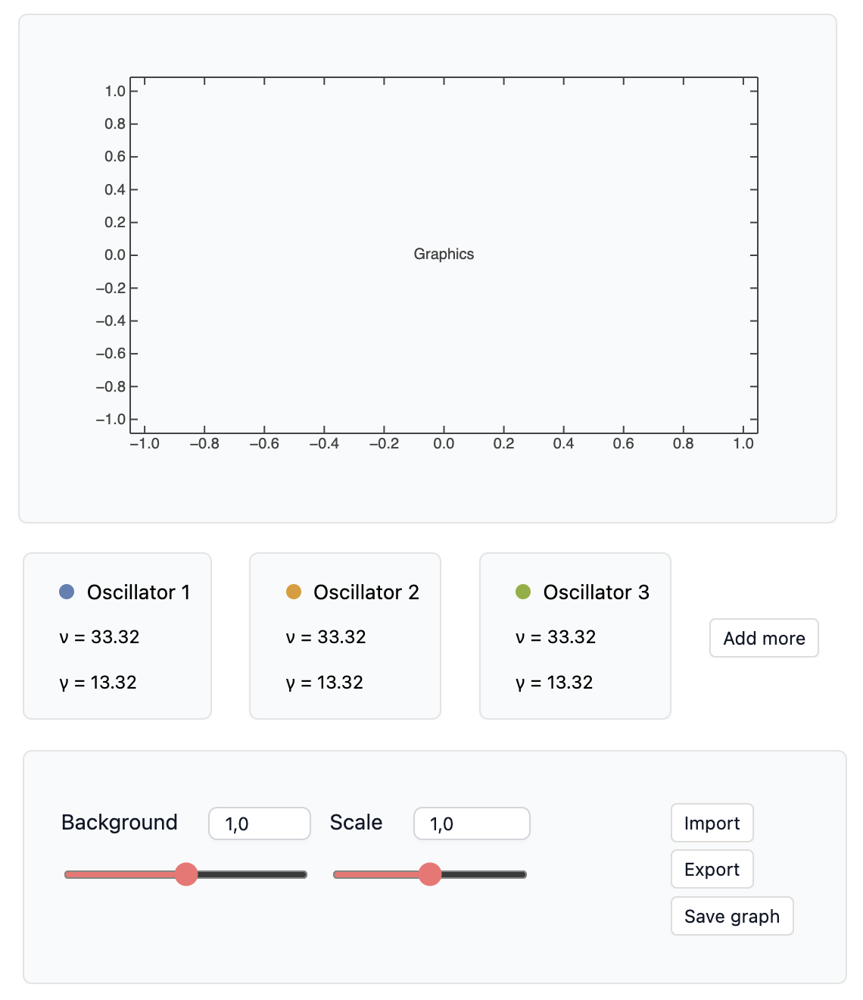

</div>

Here, `makeBadge` simply creates a `Row` with a colored disk and a title.

<WLJSWrapper><wljs-editor lazy="true" display="codemirror" type="Input" editable="true"  >{`makeBadge["Oscillator N", Blue]`}</wljs-editor></WLJSWrapper>

<WLJSWrapper><wljs-editor lazy="true" display="codemirror" type="Output"  >{`(*GB[*){{(*VB[*)(Graphics[{RGBColor[0, 0, 1], Disk[{0, 0}]}, ImageSize -> {18, 18}, PlotRange -> 1.8])(*,*)(*"1:eJxTTMoPSmNkYGAoZgESHvk5KWnMIB4HkHAvSizIyEwuTmOCyftkFpcg5IPcnZzzc/KLMoFsBggBMglhnEtmcTaqZoRShHhQaU5qMSeQ4ZmbmJ4anFmViqZHCKRHCLuegJz8kqDEvPTUorNnQOCPPQDFtyvB"*)(*]VB*)(*|*),(*|*)(*BB[*)("Oscillator N")(*,*)(*"1:eJxTTMoPSmNiYGAo5gcSAUX5ZZkpqSn+BSWZ+XnFEAk+IBFcUpmT6pKanF+UWJJflMYIEucEEu5FiZU+qWWpOZlADkMmF5CAaGIBEkGlOanBbGDdRZl56WCxkKLSVACOOxud"*)(*]BB*)}}(*||*)(*1:eJxTTMoPSmNiYGAo5gUSYZmp5S6pyflFiSX5RcEsQBH3oswUiDyIF1Sak1osABV2yq9wzMlMz8tNzStBKPHJLC5B1RDMDmQ45+eU5uYVo6orZgUpyUzPKIEIpaahawUz8suL0xhRzEfhFXMAGU6Jxak5mXmpAIwOLrs=*)(*]GB*)`}</wljs-editor></WLJSWrapper>

For the moment, we have not added any handlers to the UI elements or any actual data. This is just a mockup to see where each element goes and what we need to update.

### Updating layout
When a user clicks *Add more*, we need to append a new `Locator` and other elements to the `Graphics` object. This can be done very efficiently using `FrontInstanceGroup`. Here, however, performance at this step is not critical, so we can use `Refresh` for a more compact solution. Here are the two options side by side:

__Option A__:

<WLJSWrapper><wljs-editor lazy="true" display="codemirror" type="Input" editable="true"  >{`ref = FrontInstanceReference[];
	Graphics[{
	  Line[\\[Alpha][{lorentz[1.3, 12.0, 0.1]}, 0., 1., {0., 10., .01}]],
	  ref 
	}, ImageSize->Small, AspectRatio->1/2]`}</wljs-editor></WLJSWrapper>

<WLJSWrapper><wljs-editor lazy="true" display="codemirror" type="Output"  >{`(*VB[*)(FrontEndRef["ab55ba3a-f909-4314-a6a5-6cfd48c3fdeb"])(*,*)(*"1:eJxTTMoPSmNkYGAoZgESHvk5KRCeEJBwK8rPK3HNS3GtSE0uLUlMykkNVgEKJyaZmiYlGifqplkaWOqaGBua6CaaJZrqmiWnpZhYJBunpaQmAQCMjhZe"*)(*]VB*)`}</wljs-editor></WLJSWrapper>

Then we add a new group of primitives by evaluating:

<WLJSWrapper><wljs-editor lazy="true" display="codemirror" type="Input" editable="true"  >{`group = FrontInstanceGroup[];
	FrontSubmit[group[{
	  Red, Line[\\[Alpha][{lorentz[5.3, 12.0, 1]}, 0., 1., {0., 10., .01}]]
	}], ref];
	
	(* call FrontInstanceGroupRemove[group] to remove *)`}</wljs-editor></WLJSWrapper>

This is great if you need to add or remove many elements quickly and often.

__Option B__
Here is another solution using only `Refresh` and events:

<WLJSWrapper><wljs-editor lazy="true" display="codemirror" type="Input" editable="true"  >{`refreshContent = EventObject[];
	content = {
	  Line[\\[Alpha][{lorentz[1.3, 12.0, 0.1]}, 0., 1., {0., 10., .01}]]
	};
	
	Refresh[
	  Graphics[content, ImageSize->Small, AspectRatio->1/2],
	  refreshContent
	]`}</wljs-editor></WLJSWrapper>


Now, to update it:

<WLJSWrapper><wljs-editor lazy="true" display="codemirror" type="Input" editable="true"  >{`content = Append[content, {Red, Line[\\[Alpha][{lorentz[5.3, 12.0, 1]}, 0., 1., {0., 10., .01}]]}];
	EventFire[refreshContent];`}</wljs-editor></WLJSWrapper>

This approach is more universal than `FrontInstanceGroup`, but it causes a full reevaluation of the enclosed expression. In some cases that may add significant overhead, but not here if we do it infrequently.

In the same way, we can update the row of panels containing information about the oscillators:

<WLJSWrapper><wljs-editor lazy="true" display="codemirror" type="Input" editable="true"  >{`refreshContent = EventObject[];
	maxOsc = 3;
	Refresh[Table[Panel[i], {i,1,maxOsc}]//Row, refreshContent]`}</wljs-editor></WLJSWrapper>

<WLJSWrapper><wljs-editor lazy="true" display="codemirror" type="Output"  >{`(*GB[*){{(*BB[*)(Panel[1])(*,*)(*"1:eJxTTMoPSmNiYGAo5gcSAUX5ZZkpqSn+BSWZ+XnFaYwgCV4gEZaZWu6SmpxflFiSXxTMClKamJeaA9HJAiSCSnNSg0EMj9TEFIQCAH5qF00="*)(*]BB*)(*|*),(*|*)(*BB[*)(Panel[2])(*,*)(*"1:eJxTTMoPSmNiYGAo5gcSAUX5ZZkpqSn+BSWZ+XnFaYwgCV4gEZaZWu6SmpxflFiSXxTMClKamJeaA9HJAiSCSnNSg0EMj9TEFIQCAH5qF00="*)(*]BB*)(*|*),(*|*)(*BB[*)(Panel[3])(*,*)(*"1:eJxTTMoPSmNiYGAo5gcSAUX5ZZkpqSn+BSWZ+XnFaYwgCV4gEZaZWu6SmpxflFiSXxTMClKamJeaA9HJAiSCSnNSg0EMj9TEFIQCAH5qF00="*)(*]BB*)}}(*||*)(*1:eJxTTMoPSmNkYGAo5gUSYZmp5S6pyflFiSX5RcEsQBH3oswUAJ89CUc=*)(*]GB*)`}</wljs-editor></WLJSWrapper>

Then we update it like this:

<WLJSWrapper><wljs-editor lazy="true" display="codemirror" type="Input" editable="true"  >{`maxOsc = 5;
	EventFire[refreshContent];`}</wljs-editor></WLJSWrapper>

### Rasterization and Export
It would be nice to have export options for both PNG and PDF. Remember, we need to do all of this asynchronously, without blocking the Kernel. Fortunately, there are functions for that. Here is the process:

1. Request a file path with a dialog.
2. Depending on the selected extension, use `Export` or `Rasterize`.
3. Done.

<WLJSWrapper><wljs-editor lazy="true" display="codemirror" type="Input" editable="true"  >{`graphics = Plot[x, {x,0,1}];
	
	saveFunction = AsyncFunction[Null, Module[{path, data},
	
	  path = SystemDialogInputAsync["FileSave", 
	    {Null, {"Raster Formats" -> {"*.png", "*.jpg"}, 
	            "Portable Vector Document" -> {"*.pdf"}}
	  }] // Await;
	  
	  If[!StringQ[path], Return[Null, Module]];
	  
	  If[ToLowerCase[FileExtension[FileNameTake[path]]] === "pdf",
	    ExportAsync[path, graphics, "ExposureTime"->4] // Await;,
	    
	    data = RasterizeAsync[graphics, "ExposureTime"->4] // Await;
	    test = data;
	    ExportAsync[path, data] // Await;
	  ];
	  
	  ClearAll[path, data];
	  Beep[];
	]];
	
	saveFunction[];`}</wljs-editor></WLJSWrapper>

We use the `ExposureTime` parameter as a safe interval before capturing the image into a buffer. Note that rendering expressions to PDF or raster formats is not yet available when WLJS is running on a server.

### Displaying rapidly changing numeric and textual data
This sounds rather easy, right? If your numeric or textual data changes, just use `TextView`. Each change to a dependent symbol will __push an update__ to the text field:

<WLJSWrapper><wljs-editor lazy="true" display="codemirror" type="Input" editable="true"  >{`nData = RandomReal[];
	Row[{"\\[Omega] = ", TextView[nData // Offload]}]
	
	Do[nData = RandomReal[]; Pause[0.1], {10}]`}</wljs-editor></WLJSWrapper>

<WLJSWrapper><wljs-editor lazy="true" display="codemirror" type="Output"  >{`(*GB[*){{"\\[Omega] = "(*|*),(*|*)(*VB[*)(FrontEndRef["84563a97-bcc6-46bf-b62d-ed6293d74210"])(*,*)(*"1:eJxTTMoPSmNkYGAoZgESHvk5KRCeEJBwK8rPK3HNS3GtSE0uLUlMykkNVgEKW5iYmhknWprrJiUnm+mamCWl6SaZGaXopqaYGVkap5ibGBkaAACDrRV7"*)(*]VB*)}}(*||*)(*1:eJxTTMoPSmNkYGAo5gUSYZmp5S6pyflFiSX5RcEsQBH3oswUAJ89CUc=*)(*]GB*)`}</wljs-editor></WLJSWrapper>

Now you can see a problem: we do not have much control over the significant digits in this mode. One could use a temporary symbol to convert the value to a string:

<WLJSWrapper><wljs-editor lazy="true" display="codemirror" type="Input" editable="true"  >{`nData = RandomReal[];
	nText = ToString[NumberForm[nData, {3,2}]];
	Row[{"\\[Omega] = ", TextView[nText // Offload]}]
	
	Do[nData = RandomReal[]; nText = ToString[NumberForm[nData, {3,2}]]; Pause[0.1], {10}]`}</wljs-editor></WLJSWrapper>

<WLJSWrapper><wljs-editor lazy="true" display="codemirror" type="Output"  >{`(*GB[*){{"\\[Omega] = "(*|*),(*|*)(*VB[*)(FrontEndRef["44ce144d-4da9-4095-a7a3-20e692002484"])(*,*)(*"1:eJxTTMoPSmNkYGAoZgESHvk5KRCeEJBwK8rPK3HNS3GtSE0uLUlMykkNVgEKm5gkpxqamKTomqQkWuqaGFia6iaaJxrrGhmkmlkaGRgYmViYAAB+MxTa"*)(*]VB*)}}(*||*)(*1:eJxTTMoPSmNkYGAo5gUSYZmp5S6pyflFiSX5RcEsQBH3oswUAJ89CUc=*)(*]GB*)`}</wljs-editor></WLJSWrapper>

This is not great either. Another option is to poll it with `Refresh` and then use Wolfram Language's formatting fully. This is a good example of __immediate-mode__ programming:

<WLJSWrapper><wljs-editor lazy="true" display="codemirror" type="Input" editable="true"  >{`nData = RandomReal[];
	Refresh[Row[{"\\[Omega] = ", ToString[NumberForm[nData, {3,2}]]}], 0.1]
	
	Do[nData = RandomReal[]; Pause[0.1], {10}]`}</wljs-editor></WLJSWrapper>

<WLJSWrapper><wljs-editor lazy="true" display="codemirror" type="Output"  >{`(*GB[*){{"\\[Omega] = "(*|*),(*|*)"0.70"}}(*||*)(*1:eJxTTMoPSmNkYGAo5gUSYZmp5S6pyflFiSX5RcEsQBH3oswUAJ89CUc=*)(*]GB*)`}</wljs-editor></WLJSWrapper>

However, there is an even better approach that avoids polling while retaining a push-like update strategy:

<WLJSWrapper><wljs-editor lazy="true" display="codemirror" type="Input" editable="true"  >{`nData = RandomReal[];
	TextView[
	  StringJoin["\\[Omega] = ", ToString[NumberForm[nData, {3,2}]]] // Offload, 
	  Appearance->None
	]
	
	Do[nData = RandomReal[]; Pause[0.1], {10}]`}</wljs-editor></WLJSWrapper>

<WLJSWrapper><wljs-editor lazy="true" display="codemirror" type="Output"  >{`(*VB[*)(FrontEndRef["393451b7-a60e-43e4-87c3-e1459eec17e6"])(*,*)(*"1:eJxTTMoPSmNkYGAoZgESHvk5KRCeEJBwK8rPK3HNS3GtSE0uLUlMykkNVgEKG1sam5gaJpnrJpoZpOqaGKea6FqYJxvrphqamFqmpiYbmqeaAQB3ZRVO"*)(*]VB*)`}</wljs-editor></WLJSWrapper>

Here we moved the string-conversion logic entirely to the frontend using `Offload`. The frontend interpreter does not support the full Wolfram Language library, but rather a small subset made mostly of mathematical operations and a few useful string operations. This example is the most efficient and the fastest.

<Callout>
Check our documentation to see whether a particular symbol is supported on the frontend.
</Callout>

### Final version
Let's put everything together. Create an empty notebook with the following content, then export it as a mini-app:

<WLJSWrapper><wljs-editor lazy="true" display="codemirror" type="Input" editable="true"  >{`.md
	# Lorentz Fitting of an Absorption Spectrum
	This notebook builds a compact WLJS app for fitting absorption spectra with Lorentz oscillator line shapes. It imports measured data, initializes the resonance frequency, amplitude, and linewidth parameters, and exposes an interactive widget for tuning the model before reading out the fitted parameters and response function.`}</wljs-editor></WLJSWrapper>

<WLJSWrapper><wljs-editor lazy="true" display="codemirror" type="Input" editable="true"  >{`.md
	Model`}</wljs-editor></WLJSWrapper>

<WLJSWrapper><wljs-editor lazy="true" display="codemirror" type="Input" editable="true"  >{`(* make it initialization cell *)
	lorentz[\\[Omega]0_, A_, \\[Gamma]_][\\[Omega]_] :=  (*FB[*)((\\[Omega])(*,*)/(*,*)(1))(*]FB*) (*FB[*)((A \\[Omega] (*SpB[*)Power[\\[Gamma](*|*),(*|*)2](*]SpB*))(*,*)/(*,*)(((*SpB[*)Power[\\[Gamma](*|*),(*|*)2](*]SpB*)) ((*SpB[*)Power[\\[Omega](*|*),(*|*)2](*]SpB*))+(*SpB[*)Power[(-((*SpB[*)Power[\\[Omega](*|*),(*|*)2](*]SpB*))+(*SpB[*)Power[\\[Omega]0(*|*),(*|*)2](*]SpB*))(*|*),(*|*)2](*]SpB*)))(*]FB*);
	\\[Alpha][model_List, g_, scale_, {min_, max_, step_}] := Module[{\\[Omega]},
	  Table[{\\[Omega], scale(\\[Omega] g  + Sum[i[\\[Omega]], {i, model}])}, {\\[Omega], min, max, step}]
	];`}</wljs-editor></WLJSWrapper>

<WLJSWrapper><wljs-editor lazy="true" display="codemirror" type="Input" editable="true"  >{`.md
	Some helper functions for the widget`}</wljs-editor></WLJSWrapper>

<WLJSWrapper><wljs-editor lazy="true" display="codemirror" type="Input" editable="true"  >{`(* make it initialization cell *)
	
	makeBadge[title_, color_] := Row[{
	  Graphics[{color, Disk[]}, ImageSize->{18,18}, PlotRange->1.8],
	  Style[title, Black, 10]
	}, Alignment->{{Right, Left},Baseline}]
	
	testIfReal[any_] := $Failed;
	testIfReal[list_List] := With[{l = Select[list, MatchQ[{_?NumberQ, _?NumberQ, ___}]]},
	  If[Length[l] < 10, Return[$Failed]];
	  l[[All, {1,2}]]
	]`}</wljs-editor></WLJSWrapper>

<WLJSWrapper><wljs-editor lazy="true" display="codemirror" type="Input" editable="true"  >{`.md
	Define an interactive widget structure with all event handlers and computing logic:`}</wljs-editor></WLJSWrapper>

<WLJSWrapper><wljs-editor lazy="true" display="codemirror" type="Input" editable="true"  >{`(* This is the last cell *)
	(* do not make it initialization cell *)
	
	With[{
	  first = Unique[],
	  second = Unique[],
	  model = Unique[],
	  bg = Unique[],
	  L = Unique[],
	  rebuild = Unique[],
	  instance = CreateUUID[],
	  refresh = EventObject[],
	  controls = EventObject[],
	  graphics = Unique[],
	  ranges = Unique[],
	  experimentalData = Unique[],
	  lorentzParameters = Unique[]
	},
	
	  lorentzParameters = {{41.0, 30.0, 1.5}};
	  experimentalData = \\[Alpha][{
	    lorentz[44.0, 30.0, 1.0], lorentz[84.0, 3.0, 0.4]
	  }, 0.01, 1.0, {0, 100.0, 0.1}] + Table[RandomReal[], {i, 0, 100.0, 0.1}];
	
	  ranges = {MinMax[experimentalData[[All,1]]], 1.1 MinMax[experimentalData[[All,2]]]};
	
	  bg = 0.0;
	  L = 1.0;
	
	  rebuild = Function[Null, model = \\[Alpha][Table[lorentz@@i, {i,lorentzParameters}], bg, L, {ranges[[1,1]], ranges[[1,2]], (ranges[[1,2]]-ranges[[1,1]])/500.0}]];
	
	  rebuild[];
	
	  EventHandler[controls, {
	    "More"->Function[Null,
	      lorentzParameters = Join[lorentzParameters, {lorentzParameters[[1]] 0.9}];
	      rebuild[];
	      EventFire[refresh, True];
	    ],
	
	    "Import" -> AsyncFunction[Null, Module[{path},
	      path = SystemDialogInputAsync["FileOpen"] // Await;
	      If[!StringQ[path], Return[Null, Module]];
	      path = Import[path, HeaderLines->2];
	      path = testIfReal[path];
	      If[FailureQ[path],
	        MessageDialog["Failed to import a file"];
	        Return[Null, Module]
	      ];
	      experimentalData = path;
	      ranges = {MinMax[experimentalData[[All,1]]], 1.1 MinMax[experimentalData[[All,2]]]};
	      If[lorentzParameters[[1,1]] < ranges[[1,1]] || lorentzParameters[[1,1]] > ranges[[1,2]],
	        lorentzParameters = {Mean[{ranges[[1,2]],ranges[[1,2]]}], Mean[{ranges[[2,2]],ranges[[2,2]]}], 0.1 (ranges[[1,2]]-ranges[[1,1]])};
	      ];
	
	      Beep[];
	      rebuild[];
	      EventFire[refresh, True];
	    ]],
	
	    "Export" -> AsyncFunction[Null, Module[{path},
	      path = SystemDialogInputAsync["FileSave", {Null, {"Tabular Formats" -> {"*.csv", "*.tsv"}, "Plain Text Document" -> {"*.txt"}}}] // Await;
	      If[!StringQ[path], Return[Null, Module]];
	      ExportAsync[path, model] // Await;
	      ExportAsync[FileNameJoin[{DirectoryName[path], FileBaseName[path]<>"_parameters.dat"}], lorentzParameters] // Await;
	      Beep[];
	    ]],
	    "Save graph" -> AsyncFunction[Null, Module[{path, data},
	      path = SystemDialogInputAsync["FileSave", {Null, {"Raster Formats" -> {"*.png", "*.jpg"}, "Portable Vector Document" -> {"*.pdf"}}}] // Await;
	      If[!StringQ[path], Return[Null, Module]];
	      If[ToLowerCase[FileExtension[FileNameTake[path]]] === "pdf",
	        ExportAsync[path, graphics /. {Locator[_] :> Null, Rule[PlotLabel, _] :> Rule[PlotLabel, None]}] // Await;
	      ,
	        data = RasterizeAsync[graphics /. {Locator[_] :> Null, Rule[PlotLabel, _] :> Rule[PlotLabel, None]}, "ExposureTime"->4] // Await;
	        ExportAsync[path, data] // Await;
	      ];
	      ClearAll[path, data];
	      Beep[];
	    ]]
	  }];
	
	 Deploy@Column[{
	  Row[{Panel[Refresh[graphics = Graphics[{
	    PointSize[2 0.01], Point[experimentalData],
	    ColorData[97][4], Line[model//Offload],
	    Table[With[{i=i}, {l = lorentzParameters[[i]]},
	     {ColorData[97][i], EventHandler[Locator[l[[{1,2}]]], {
	      "drag" -> Function[xy,
	        lorentzParameters = ReplacePart[lorentzParameters, i->Clip[{xy[[1]], xy[[2]]/L - bg, lorentzParameters[[i, 3]]}, {0, Infinity}]];
	        rebuild[];
	      ],
	      "zoom" -> Function[z,
	        lorentzParameters = ReplacePart[lorentzParameters, i->Clip[{lorentzParameters[[i, 1]], lorentzParameters[[i, 2]], Max[{z l[[3]], 0.001}]}, {0, Infinity}]];
	        rebuild[];
	      ]
	     }]}], {i, Length[lorentzParameters]}]
	  }, ImageSize->{1.5 323, 300}, Frame->True,
	     FrameLabel->{"frequency", "absorption"},
	     "TransitionDuration"->150, PlotRange->ranges,
	     PlotLabel->"Use wheel on locators to adjust \\[Gamma]"
	  ], EventClone@refresh]]}],
	
	  Refresh[Row[Join[Table[With[{i=i},
	
	    Panel[Column[{
	      makeBadge["Oscillator "<>ToString[i], ColorData[97][i]],
	      TextView[StringJoin["  \\[Omega] = ", ToString[NumberForm[lorentzParameters[[i]][[1]], {5,2}]]]//Offload, Appearance->None],
	      TextView[StringJoin["  \\[Gamma] = ", ToString[NumberForm[lorentzParameters[[i]][[3]], {5,2}]]]//Offload, Appearance->None]
	    }, Spacings->0, Alignment->Left]]
	
	  ], {i, Length[lorentzParameters]}], If[Length[lorentzParameters]<4,{
	    InputButton[controls, "Add more", "Topic"->"More"]
	  }, {}]], Alignment->Join[{Left},Table[Center, {Length[lorentzParameters]}], {Right}], ImageSize->1.55 350], EventClone@refresh],
	
	  Column[{
	      Panel[Row[{EventHandler[InputGroup[{
	        InputRange[0,2,0.01,bg, "Label"->"Background"],
	        InputRange[0,2,0.01,L,  "Label"->"L/c"]
	      }, "Layout"->"Horisontal"], Function[d,
	        {bg, L} = d;
	        rebuild[];
	      ]],
	        Column[{
	          InputButton[controls, "Import", "Topic"->"Import"],
	          InputButton[controls, "Export", "Topic"->"Export"],
	          InputButton[controls, "Save graph", "Topic"->"Save graph"]}]
	      }, ImageSize->1.48 350]]
	  }, Spacings->0, Alignment->Left]
	 }, Spacings->{0,1}, Alignment->Left]
	]`}</wljs-editor></WLJSWrapper>

<div className="margin-auto invertColor" style={{maxWidth:'500px'}}>

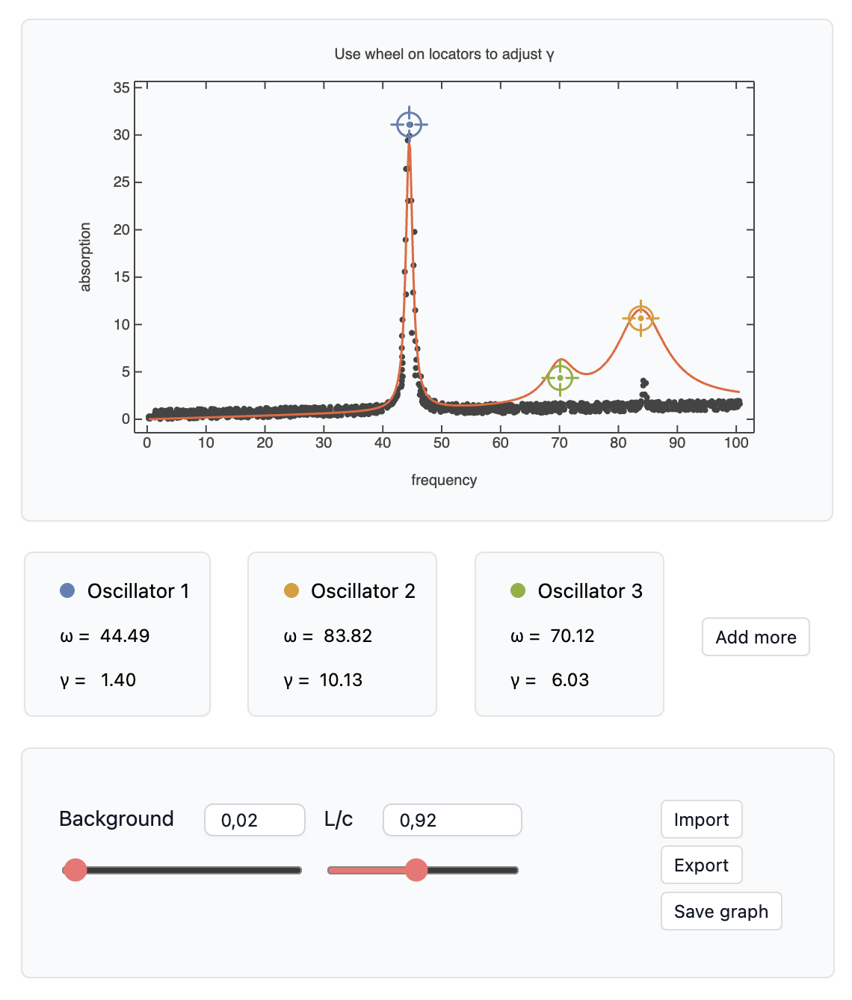

</div>

All right! Does it look great?


<Accordions>

<Accordion title="See it in action">

	<LazyVideo url="./action2.mp4"/>

</Accordion>

</Accordions>

Sure, one can still use the `resizeTo` trick to remove empty space from the created window and add a different background color. Another good option would be to combine it with the file importer from the plotter example, where the user can specify the format and number of header lines. To create a new window from an app, you still use the same API as in the notebook:

<WLJSWrapper><wljs-editor lazy="true" display="codemirror" type="Input" editable="true"  >{`CreateWindow[Plot[x, {x,0,1}], WindowSize->{500,300}];`}</wljs-editor></WLJSWrapper>

## Conclusion

For me, this feels like a natural transition from computational notebooks to apps. A notebook is already a sandbox with access to most of the resources on your machine. So why should we write tons of glue code - even in the web world - just to drag a few sliders around and update some graphs?

In many cases, a basic helper tool, even one that is not perfectly polished, can already be far more useful than having nothing. Please do not take this as a universal claim: native applications and highly optimized web apps can do things that cannot be compared directly with what WLJS offers. WLJS probably fills the niche between "real" software and a personal notebook - turning something you researched or developed for yourself into something more useful and shareable for others. Think of it as a portable toolbox for your field, one that you carry around to solve recurring problems.

### Driving force and motivation
> Why did you build all of this?

WLJS development as a whole is driven directly by real-time problem solving - literally.

The app side of it was originally motivated by an __optical-units converter__. Online services exist, but I wanted something local. Wolfram Language already provides physical quantities through `Quantity`, so the conversion itself takes only a few lines. Yet using it still meant opening a notebook, connecting a kernel, localizing symbols, and so on. Why not detach the output of a notebook cell into a separate window? Then I suddenly needed a spectrogram analyzer and a band-pass filter for time-domain spectra. Here we go...

<div className="invertColor">

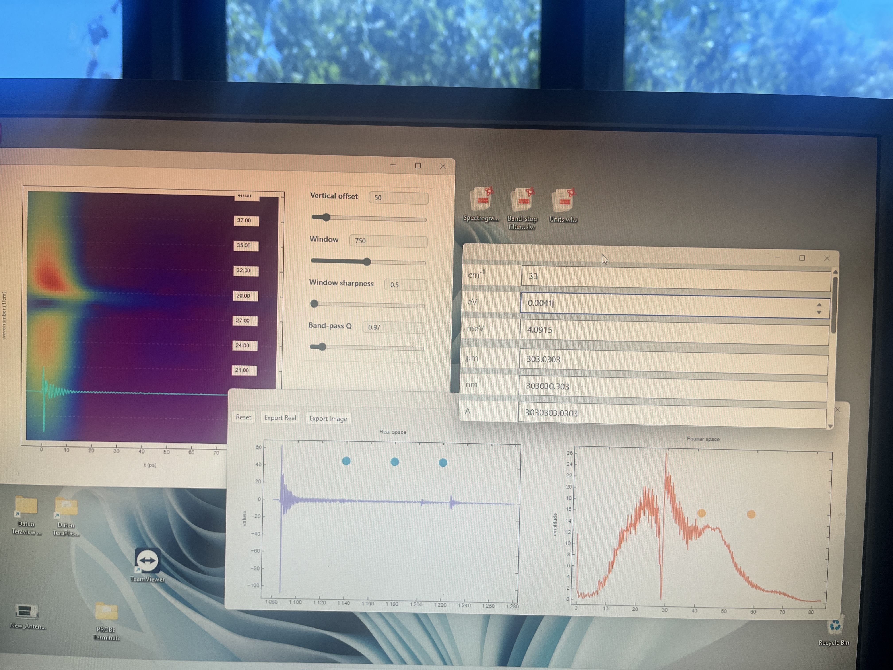

</div>

*Units converter, band-pass filter, and spectrogram analyzer windows*


The next step came when I needed a tool for processing many THz spectra in batches, with some manual tuning along the way. This is essentially a multi-window app that reads and writes data on disk and produces basic visualizations with `ListLinePlot`.


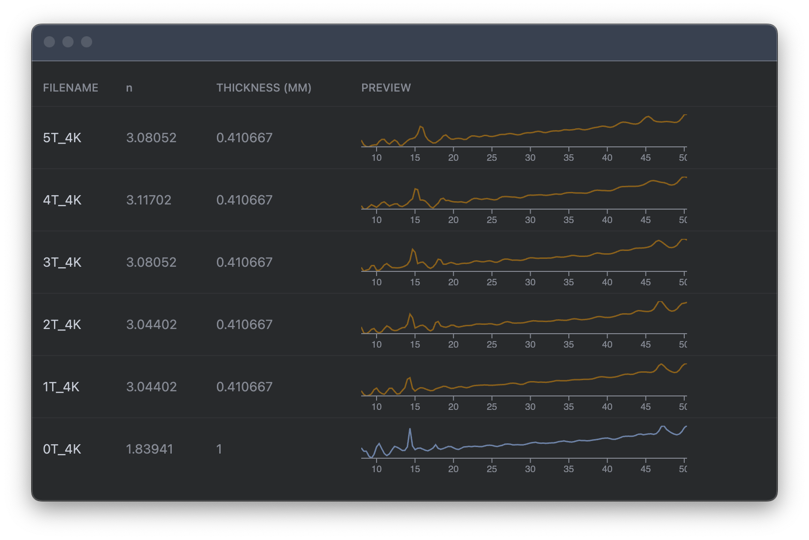

*Summary of spectra processed by TeraKitchen*


This again matched the existing notebook-related design nicely: features such as `CreateWindow[expr]` and `SystemDialogInput`, along with many UI building blocks from the Wolfram standard library, were already available. This application needs more than a single `.wlw` "executable"; it also uses several Wolfram Language package files, some written in WLX. Thanks to `OpenCLLink` and `LibraryLink`, it can use both the GPU and CPU for certain operations.


Then there was another project, one that is rather challenging for both Wolfram Language and WLJS: laboratory automation.


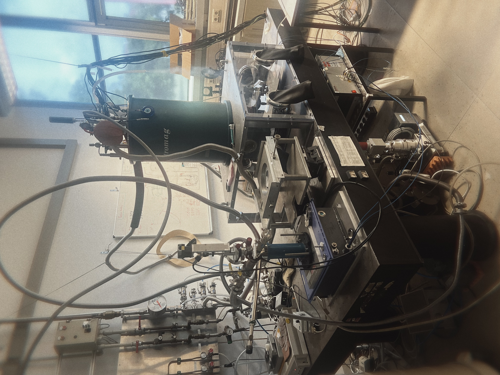


*Low-temperature TDS-THz transmission spectroscopy laboratory*

This system is used by several master's and PhD students in our group. It connects four Ethernet devices - including a spectrometer, a temperature controller, and several motors - and performs automated measurements and control. For most Wolfram users, it may be quite surprising to see something like this operating heavy equipment and running for more than eight hours a day.

<div className="invertColor">

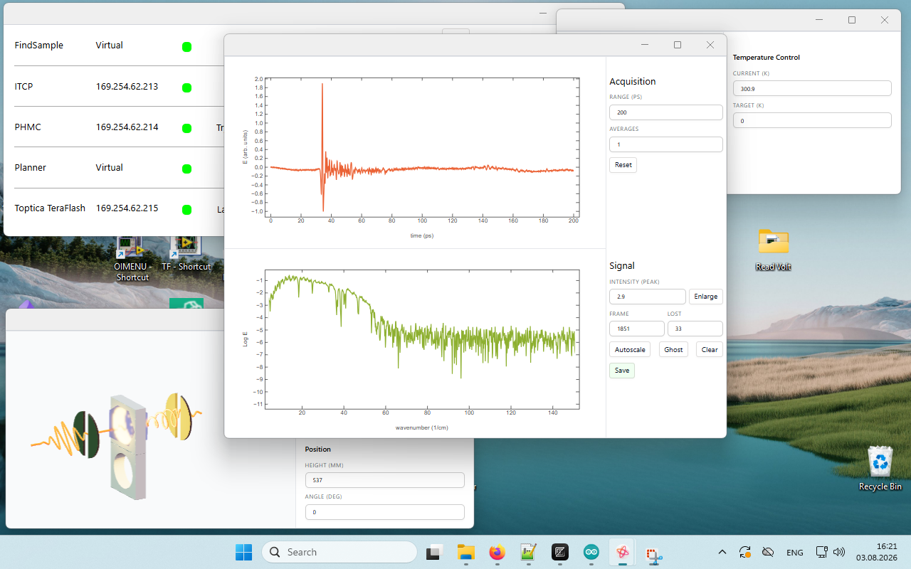

</div>

*Many windows controlling an entire lab*

The system captures $25 \times 4000$ data points per second while monitoring multiple devices. At the same time, one can __still run normal notebooks on the same kernel__, or even other applications. Because WLJS is event-based by design, a temporarily busy kernel causes only short pauses in this setup; incoming data are buffered, so acquisition can continue. A motor may pause briefly and then resume when the next command arrives. No catastrophe.

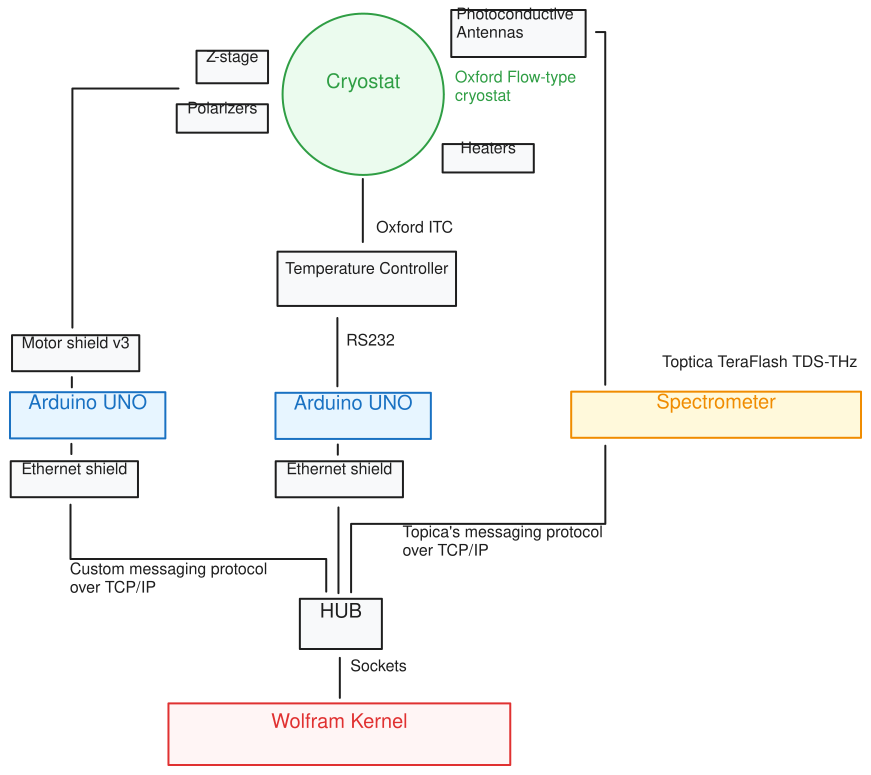

*The architecture of one of the setups in our lab automation project. Everyhting is driven by ethernet*


<Accordions>

<Accordion title="See it in action">

	<LazyVideo url="./action.mp4"/>

</Accordion>

</Accordions>

Of course, one could build something even more capable with Node.js, for instance, but at a higher development cost - at least for me. I am not claiming that reducing lines of code is automatically a virtue. The value is in extending the tools you already use for research and development. And the apps remain storybooks: narrative cells, experiments, and tests stay inside the `.wlw` file, where anyone can inspect them, change them, or learn from them.


### Side note 1
Why Wolfram again, you may ask? I personally trust Wolfram Language for the stability of its API, language, and standard library. I rarely need to worry whether code written twenty years ago will still run. The ecosystem is unified and fits together, although the closed-source kernel is the tradeoff.

The same kind of stability is a design goal for WLJS: architecture should be designed carefully, remain compatible, and expand without needless breakage. Everything is local, including the dependencies. This also fits well with the JavaScript and HTML parts - the sheer amount of legacy web content makes browsers and web languages remarkably conservative about breaking changes.

### Side note 2
WLJS might look like a lightweight framework for building applications. However, we have tried to impose as few boundaries as possible. There is no need to replace JavaScript or HTML with Wolfram built-in functions; the parts can complement one another.

If you do not like web development, stick to Wolfram constructs such as `Row`, `InputButton`, `Graphics`, and others. If you want full customization, use the power of web technology and integrate it with your Wolfram code. WLJS introduces as little overhead as possible: when you use *WLX* cells as output, you are literally inserting raw HTML, including *unsanitized and unsandboxed* JavaScript blocks. This power naturally assumes trusted content.

We did not discuss the integration of JavaScript and Wolfram Language in much detail here - perhaps next time. Meanwhile, you can check [our documentation on the subject](https://wljs.io/frontend/Advanced/Frontend-functions/Overview).

### Final final notes

I hope WLJS can become a useful platform for your small apps and widgets, just as it has for me - the author, @JerryI. Please let me, or the WLJS team, know what you think.
