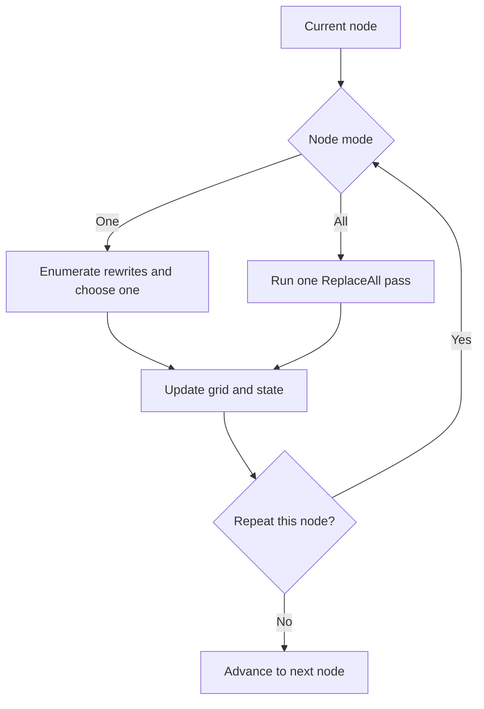

{/* add this script to the body  */}
{/* https://cdn.jsdelivr.net/gh/WLJSTeam/web-components@latest/src/common/app.js */}
<wljs-store json="./attachments/d9e5a063-8d79-402c-a4f2-ec3f70171983.txt"></wljs-store>


A Markov algorithm is a deterministic string-rewriting system: it transforms a word by repeatedly applying rules from an ordered list. Despite the name, it is unrelated to a Markov chain. There are no transition probabilities in the original formalism; the next step is fixed by rule priority and by the position of the match.

This tiny computational model is powerful enough to express arbitrary algorithms. It also provides a useful lens through which to view the Wolfram Language, where evaluation is built around matching expressions and replacing them with other expressions. We will begin with strings, move to arbitrary symbolic expressions, and then extend the idea to probabilistic rewriting on two-dimensional grids.


*Andrey Andreyevich Markov Jr.*

Markov introduced normal algorithms in the late 1940s while studying formal notions of computability. A normal algorithm has two parts:

1. an alphabet, whose symbols form the words being transformed;
2. a finite, ordered list of substitution rules.

Each rule has a left-hand side and a replacement. Some rules are terminating rules. At every step, the algorithm scans the rules from top to bottom, selects the first applicable rule, replaces the leftmost occurrence of its left-hand side, and then starts scanning again from the first rule. Execution stops when a terminating rule is used or when no rule applies.

## From String Replacement to a Markov Step

Wolfram Language already has excellent string-rewriting tools, so `StringReplace` is a natural place to start. There is one crucial semantic difference, however: a Markov step selects the first *applicable rule* and performs exactly one replacement. A list of rules passed to `StringReplace` is treated as a set of alternatives during one traversal, not as a pipeline whose output is fed from one rule into the next.

For the first examples, we omit explicit terminating rules and stop only when no rule applies.

For example, it is tempting to expect the following expression to turn `A` into `B` and then immediately turn that `B` into `C`:

<WLJSWrapper><div className="code-input"/><wljs-editor display="codemirror" type="Input" editable="true"  >{`StringReplace["AAA", {"A"->"B", "B"->"C"}]`}</wljs-editor></WLJSWrapper>

<WLJSWrapper><wljs-editor lazy="true" display="codemirror" type="Output"  >{`"BBB"`}</wljs-editor></WLJSWrapper>

Instead, the result is `"BBB"`. The newly produced `B` characters are not reconsidered by the second rule during the same call. To model a Markov algorithm, we need a function that chooses the first applicable rule, replaces only its leftmost match, and then repeats.

<WLJSWrapper><div className="code-input"/><wljs-editor display="codemirror" type="Input" editable="true"  >{`ClearAll[markovStep];
	
	markovStep[rules_][s_String] := Module[{rule},
	  rule = SelectFirst[
	    rules,
	    StringContainsQ[s, First[#]] &,
	    Missing["NotFound"]
	  ];
	
	  If[MissingQ[rule], s, StringReplace[s, rule, 1]]
	];
	
	rules = {"A" -> "B", "B" -> "C"};
	NestWhileList[markovStep[rules], "AAA", UnsameQ, 2, 12]`}</wljs-editor></WLJSWrapper>

<WLJSWrapper><wljs-editor lazy="true" display="codemirror" type="Output"  >{`{"BAA","CAA","CBA","CCA","CCB","CCC","CCC","CCC"}`}</wljs-editor></WLJSWrapper>

`SelectFirst` preserves rule priority, while the third argument of `StringReplace` limits the step to one, leftmost replacement. `NestWhileList` records the intermediate words and stops when a step leaves the word unchanged. The final numeric limit is only a safety bound for systems that do not halt.

With the single rule `BA -> AB`, repeated rewriting behaves like bubble sort: every step moves one `B` to the right.

<WLJSWrapper><div className="code-input"/><wljs-editor display="codemirror" type="Input" editable="true"  >{`rules = {"BA" -> "AB"};
	
	NestWhileList[
	  markovStep[rules],
	  "BABABA",
	  UnsameQ,
	  2,
	  20
	]`}</wljs-editor></WLJSWrapper>

<WLJSWrapper><wljs-editor lazy="true" display="codemirror" type="Output"  >{`{"ABBABA","ABABBA","AABBBA","AABBAB","AABABB","AAABBB"}`}</wljs-editor></WLJSWrapper>

Not every rewriting system halts. The following three-rule system enters a cycle, which is why practical interpreters often include a step limit:

<WLJSWrapper><div className="code-input"/><wljs-editor display="codemirror" type="Input" editable="true"  >{`rules = {
	  "BA" -> "AB",
	  "BB" -> "AA",
	  "A" -> "B"
	};
	
	NestList[markovStep[rules], "AAA", 12]`}</wljs-editor></WLJSWrapper>

<WLJSWrapper><wljs-editor lazy="true" display="codemirror" type="Output"  >{`{"AAA","AAA","BAA","ABA","ABA","BBA","BAB","BAB","BBB"}`}</wljs-editor></WLJSWrapper>

## From Strings to Wolfram Language Expressions

So far we have used strings only because they make the mechanics visible. Wolfram Language rules are more general: they can match and transform arbitrary symbolic expressions, lists, images, colors, graphs, or any other expression structure.

This is not an accidental resemblance. A definition such as the following is stored as a `DownValue`, which is essentially a rule associated with the symbol `f`:

<WLJSWrapper><div className="code-input"/><wljs-editor display="codemirror" type="Input" editable="true"  >{`f[x_] := x + 1`}</wljs-editor></WLJSWrapper>

<WLJSWrapper><div className="code-input"/><wljs-editor display="codemirror" type="Input" editable="true"  >{`DownValues[f]`}</wljs-editor></WLJSWrapper>

<WLJSWrapper><wljs-editor lazy="true" display="codemirror" type="Output"  >{`{HoldPattern[f[x_]]:>x+1}`}</wljs-editor></WLJSWrapper>

This is a function definition in ordinary Wolfram Language terminology, but operationally it says: whenever an expression matches `f[x_]`, replace it with `x + 1`. The pattern variable `x_` binds the matched argument for use on the right-hand side.

<WLJSWrapper><div className="code-input"/><wljs-editor display="codemirror" type="Input" editable="true"  >{`f[3]
	f[Red]`}</wljs-editor></WLJSWrapper>

<WLJSWrapper><wljs-editor lazy="true" display="codemirror" type="Output"  >{`4`}</wljs-editor></WLJSWrapper>

<WLJSWrapper><wljs-editor lazy="true" display="codemirror" type="Output"  >{`1+(*VB[*)(RGBColor[1, 0, 0])(*,*)(*"1:eJxTTMoPSmNiYGAo5gUSYZmp5S6pyflFiSX5RcEsQBHn4PCQNGaQPAeQCHJ3cs7PyS8qYgCDD/ZQBgMDnAEA4iUPRg=="*)(*]VB*)`}</wljs-editor></WLJSWrapper>

Patterns range from exact literals to structural and predicate-based forms. In particular, `_` matches one expression, `__` matches one or more expressions, and `___` matches zero or more expressions.

<WLJSWrapper><div className="code-input"/><wljs-editor display="codemirror" type="Input" editable="true"  >{`_        (*BB[*)(* Blank: one arbitrary expression *)(*,*)(*"1:eJxTTMoPSmNhYGAo5gcSAUX5ZZkpqSn+BSWZ+XnFaYwgCS4g4Zyfm5uaV+KUXxEMUqxsbm6exgSSBPGCSnNSg9mAjOCSosy8dLBYSFFpKpoKkDkeqYkpEFXBILO1sCgJSczMQVYCAOFrJEU="*)(*]BB*)`}</wljs-editor></WLJSWrapper>

<WLJSWrapper><div className="code-input"/><wljs-editor display="codemirror" type="Input" editable="true"  >{`__       (*BB[*)(* BlankSequence: one or more expressions *)(*,*)(*"1:eJxTTMoPSmNhYGAo5gcSAUX5ZZkpqSn+BSWZ+XnFaYwgCS4g4Zyfm5uaV+KUXxEMUqxsbm6exgSSBPGCSnNSg9mAjOCSosy8dLBYSFFpKpoKkDkeqYkpEFXBILO1sCgJSczMQVYCAOFrJEU="*)(*]BB*)`}</wljs-editor></WLJSWrapper>

<WLJSWrapper><div className="code-input"/><wljs-editor display="codemirror" type="Input" editable="true"  >{`___      (*BB[*)(* BlankNullSequence: zero or more expressions *)(*,*)(*"1:eJxTTMoPSmNhYGAo5gcSAUX5ZZkpqSn+BSWZ+XnFaYwgCS4g4Zyfm5uaV+KUXxEMUqxsbm6exgSSBPGCSnNSg9mAjOCSosy8dLBYSFFpKpoKkDkeqYkpEFXBILO1sCgJSczMQVYCAOFrJEU="*)(*]BB*)`}</wljs-editor></WLJSWrapper>

<WLJSWrapper><div className="code-input"/><wljs-editor display="codemirror" type="Input" editable="true"  >{`_Integer (*BB[*)(* One expression with head Integer *)(*,*)(*"1:eJxTTMoPSmNhYGAo5gcSAUX5ZZkpqSn+BSWZ+XnFaYwgCS4g4Zyfm5uaV+KUXxEMUqxsbm6exgSSBPGCSnNSg9mAjOCSosy8dLBYSFFpKpoKkDkeqYkpEFXBILO1sCgJSczMQVYCAOFrJEU="*)(*]BB*)`}</wljs-editor></WLJSWrapper>

<WLJSWrapper><div className="code-input"/><wljs-editor display="codemirror" type="Input" editable="true"  >{`3        (*BB[*)(* The exact expression 3 *)(*,*)(*"1:eJxTTMoPSmNhYGAo5gcSAUX5ZZkpqSn+BSWZ+XnFaYwgCS4g4Zyfm5uaV+KUXxEMUqxsbm6exgSSBPGCSnNSg9mAjOCSosy8dLBYSFFpKpoKkDkeqYkpEFXBILO1sCgJSczMQVYCAOFrJEU="*)(*]BB*)`}</wljs-editor></WLJSWrapper>

<WLJSWrapper><div className="code-input"/><wljs-editor display="codemirror" type="Input" editable="true"  >{`_?(Mod[#,2]==0&) (*BB[*)(* An expression for which the test returns True *)(*,*)(*"1:eJxTTMoPSmNhYGAo5gcSAUX5ZZkpqSn+BSWZ+XnFaYwgCS4g4Zyfm5uaV+KUXxEMUqxsbm6exgSSBPGCSnNSg9mAjOCSosy8dLBYSFFpKpoKkDkeqYkpEFXBILO1sCgJSczMQVYCAOFrJEU="*)(*]BB*)`}</wljs-editor></WLJSWrapper>

<WLJSWrapper><div className="code-input"/><wljs-editor display="codemirror" type="Input" editable="true"  >{`{_, _}   (*BB[*)(* A list containing exactly two expressions *)(*,*)(*"1:eJxTTMoPSmNhYGAo5gcSAUX5ZZkpqSn+BSWZ+XnFaYwgCS4g4Zyfm5uaV+KUXxEMUqxsbm6exgSSBPGCSnNSg9mAjOCSosy8dLBYSFFpKpoKkDkeqYkpEFXBILO1sCgJSczMQVYCAOFrJEU="*)(*]BB*)`}</wljs-editor></WLJSWrapper>

Exact and fallback definitions can even act like a small associative store. The specific definitions of `h[hash]` take precedence over the general fallback `h[_]`:

<WLJSWrapper><div className="code-input"/><wljs-editor display="codemirror" type="Input" editable="true"  >{`h[_] = Missing[];
	setHash[hash_, val_] := h[hash] = val
	getHash[hash_] := h[hash]`}</wljs-editor></WLJSWrapper>

<WLJSWrapper><div className="code-input"/><wljs-editor display="codemirror" type="Input" editable="true"  >{`getHash[31]
	setHash[31, Red];
	getHash[31]`}</wljs-editor></WLJSWrapper>

<WLJSWrapper><wljs-editor lazy="true" display="codemirror" type="Output"  >{`Missing[]`}</wljs-editor></WLJSWrapper>

<WLJSWrapper><wljs-editor lazy="true" display="codemirror" type="Output"  >{`(*VB[*)(RGBColor[1, 0, 0])(*,*)(*"1:eJxTTMoPSmNiYGAo5gUSYZmp5S6pyflFiSX5RcEsQBHn4PCQNGaQPAeQCHJ3cs7PyS8qYgCDD/ZQBgMDnAEA4iUPRg=="*)(*]VB*)`}</wljs-editor></WLJSWrapper>

<WLJSWrapper><div className="code-input"/><wljs-editor display="codemirror" type="Input" editable="true"  >{`getHash[32]`}</wljs-editor></WLJSWrapper>

<WLJSWrapper><wljs-editor lazy="true" display="codemirror" type="Output"  >{`Missing[]`}</wljs-editor></WLJSWrapper>

## A Native Expression-Rewriting Version

Let us return to the sorting rule, but replace characters with colors:

```
BR → RB
```

A pair of sequence patterns captures everything before and after the first blue-red pair, allowing the definition to swap that pair while preserving the rest of the list.

<WLJSWrapper><div className="code-input"/><wljs-editor display="codemirror" type="Input" editable="true"  >{`ClearAll[apply];
	
	(*BB[*)(* sorting rule *)(*,*)(*"1:eJxTTMoPSmNhYGAo5gcSAUX5ZZkpqSn+BSWZ+XnFaYwgCS4g4Zyfm5uaV+KUXxEMUqxsbm6exgSSBPGCSnNSg9mAjOCSosy8dLBYSFFpKpoKkDkeqYkpEFXBILO1sCgJSczMQVYCAOFrJEU="*)(*]BB*)
	apply[{b___, (*VB[*)(RGBColor[0, 0, 1])(*,*)(*"1:eJxTTMoPSmNiYGAo5gUSYZmp5S6pyflFiSX5RcEsQBHn4PCQNGaQPAeQCHJ3cs7PyS8qYoACdMYHewDM1w9G"*)(*]VB*),(*VB[*)(RGBColor[1, 0, 0])(*,*)(*"1:eJxTTMoPSmNiYGAo5gUSYZmp5S6pyflFiSX5RcEsQBHn4PCQNGaQPAeQCHJ3cs7PyS8qYgCDD/ZQBgMDnAEA4iUPRg=="*)(*]VB*), a___}] := {b, (*VB[*)(RGBColor[1, 0, 0])(*,*)(*"1:eJxTTMoPSmNiYGAo5gUSYZmp5S6pyflFiSX5RcEsQBHn4PCQNGaQPAeQCHJ3cs7PyS8qYgCDD/ZQBgMDnAEA4iUPRg=="*)(*]VB*),(*VB[*)(RGBColor[0, 0, 1])(*,*)(*"1:eJxTTMoPSmNiYGAo5gUSYZmp5S6pyflFiSX5RcEsQBHn4PCQNGaQPAeQCHJ3cs7PyS8qYoACdMYHewDM1w9G"*)(*]VB*), a}
	apply[any_] := any`}</wljs-editor></WLJSWrapper>

We can now apply `apply` repeatedly to a list of colors:

<WLJSWrapper><div className="code-input"/><wljs-editor display="codemirror" type="Input" editable="true"  >{`FixedPoint[apply, {(*VB[*)(RGBColor[0, 0, 1])(*,*)(*"1:eJxTTMoPSmNiYGAo5gUSYZmp5S6pyflFiSX5RcEsQBHn4PCQNGaQPAeQCHJ3cs7PyS8qYoACdMYHewDM1w9G"*)(*]VB*),(*VB[*)(RGBColor[1, 0, 0])(*,*)(*"1:eJxTTMoPSmNiYGAo5gUSYZmp5S6pyflFiSX5RcEsQBHn4PCQNGaQPAeQCHJ3cs7PyS8qYgCDD/ZQBgMDnAEA4iUPRg=="*)(*]VB*),(*VB[*)(RGBColor[0, 0, 1])(*,*)(*"1:eJxTTMoPSmNiYGAo5gUSYZmp5S6pyflFiSX5RcEsQBHn4PCQNGaQPAeQCHJ3cs7PyS8qYoACdMYHewDM1w9G"*)(*]VB*),(*VB[*)(RGBColor[1, 0, 0])(*,*)(*"1:eJxTTMoPSmNiYGAo5gUSYZmp5S6pyflFiSX5RcEsQBHn4PCQNGaQPAeQCHJ3cs7PyS8qYgCDD/ZQBgMDnAEA4iUPRg=="*)(*]VB*),(*VB[*)(RGBColor[0, 0, 1])(*,*)(*"1:eJxTTMoPSmNiYGAo5gUSYZmp5S6pyflFiSX5RcEsQBHn4PCQNGaQPAeQCHJ3cs7PyS8qYoACdMYHewDM1w9G"*)(*]VB*),(*VB[*)(RGBColor[1, 0, 0])(*,*)(*"1:eJxTTMoPSmNiYGAo5gUSYZmp5S6pyflFiSX5RcEsQBHn4PCQNGaQPAeQCHJ3cs7PyS8qYgCDD/ZQBgMDnAEA4iUPRg=="*)(*]VB*)}] `}</wljs-editor></WLJSWrapper>

<WLJSWrapper><wljs-editor lazy="true" display="codemirror" type="Output"  >{`{(*VB[*)(RGBColor[1, 0, 0])(*,*)(*"1:eJxTTMoPSmNiYGAo5gUSYZmp5S6pyflFiSX5RcEsQBHn4PCQNGaQPAeQCHJ3cs7PyS8qYgCDD/ZQBgMDnAEA4iUPRg=="*)(*]VB*),(*VB[*)(RGBColor[1, 0, 0])(*,*)(*"1:eJxTTMoPSmNiYGAo5gUSYZmp5S6pyflFiSX5RcEsQBHn4PCQNGaQPAeQCHJ3cs7PyS8qYgCDD/ZQBgMDnAEA4iUPRg=="*)(*]VB*),(*VB[*)(RGBColor[1, 0, 0])(*,*)(*"1:eJxTTMoPSmNiYGAo5gUSYZmp5S6pyflFiSX5RcEsQBHn4PCQNGaQPAeQCHJ3cs7PyS8qYgCDD/ZQBgMDnAEA4iUPRg=="*)(*]VB*),(*VB[*)(RGBColor[0, 0, 1])(*,*)(*"1:eJxTTMoPSmNiYGAo5gUSYZmp5S6pyflFiSX5RcEsQBHn4PCQNGaQPAeQCHJ3cs7PyS8qYoACdMYHewDM1w9G"*)(*]VB*),(*VB[*)(RGBColor[0, 0, 1])(*,*)(*"1:eJxTTMoPSmNiYGAo5gUSYZmp5S6pyflFiSX5RcEsQBHn4PCQNGaQPAeQCHJ3cs7PyS8qYoACdMYHewDM1w9G"*)(*]VB*),(*VB[*)(RGBColor[0, 0, 1])(*,*)(*"1:eJxTTMoPSmNiYGAo5gUSYZmp5S6pyflFiSX5RcEsQBHn4PCQNGaQPAeQCHJ3cs7PyS8qYoACdMYHewDM1w9G"*)(*]VB*)}`}</wljs-editor></WLJSWrapper>

`FixedPoint` repeatedly applies `apply` until the result no longer changes. The fallback definition `apply[any_] := any` therefore doubles as the halting condition.

The implementation is compact because the evaluator is already doing the matching and substitution for us. This effectively means that __we made a Markov-style rewriting machine using only a type system__! I believe we just surpassed the expressiveness of TypeScript.

## Beyond One Dimension

A normal Markov algorithm resolves ambiguity by choosing the leftmost occurrence of the first applicable rule. On a two-dimensional grid, however, "leftmost" is no longer a geometrically natural choice. We can impose a row-major order, but that order would be an implementation detail rather than part of the spatial model.

This problem is addressed directly in Maxim Gumin's [MarkovJunior](https://github.com/mxgmn/MarkovJunior), which inspired this post. MarkovJunior provides two relevant application modes:

- **`exists`:** choose one matching location at random;
- **`forall`:** greedily choose a maximal set of non-conflicting matches.

For readability, the small interpreter below calls analogous modes **one** and **all**. These spatial, stochastic semantics are no longer those of a classical deterministic normal algorithm. Gumin describes the change as a loss of Turing completeness because the procedure is nondeterministic. More precisely, nondeterminism alone does not determine computational universality, but the process no longer computes a single deterministic function in the classical sense. The practical point remains: the formalism describes a wide range of interesting random processes.

## Cellular Automaton on a Type System?

We are not yet building a language as complete as MarkovJunior. First, we will attach rewrite rules to a Wolfram Language symbol and use them as a small stochastic transition machine.

Begin with a 20 by 20 black grid:

<WLJSWrapper><div className="code-input"/><wljs-editor display="codemirror" type="Input" editable="true"  >{`field = Table[(*VB[*)(GrayLevel[0])(*,*)(*"1:eJxTTMoPSmNiYGAo5gUSYZmp5S6pyflFiSX5RcEsQBHn4PCQNGaQPAeQCHJ3cs7PyS8qYoACTAYAyrgOFw=="*)(*]VB*), {20}, {20}];`}</wljs-editor></WLJSWrapper>

Next define the rewrite rule

```
B → R
```

where `B` denotes a black cell and `R` denotes a red cell.

<WLJSWrapper><div className="code-input"/><wljs-editor display="codemirror" type="Input" editable="true"  >{`ClearAll[r];
	r[any_] := any;
	r[{b___, (*VB[*)(GrayLevel[0])(*,*)(*"1:eJxTTMoPSmNiYGAo5gUSYZmp5S6pyflFiSX5RcEsQBHn4PCQNGaQPAeQCHJ3cs7PyS8qYoACTAYAyrgOFw=="*)(*]VB*), a___}] := {b, (*VB[*)(RGBColor[1, 0, 0])(*,*)(*"1:eJxTTMoPSmNiYGAo5gUSYZmp5S6pyflFiSX5RcEsQBHn4PCQNGaQPAeQCHJ3cs7PyS8qYgCDD/ZQBgMDnAEA4iUPRg=="*)(*]VB*), a};`}</wljs-editor></WLJSWrapper>

<WLJSWrapper><div className="code-input"/><wljs-editor display="codemirror" type="Input" editable="true"  >{`field // ArrayPlot`}</wljs-editor></WLJSWrapper>

<WLJSWrapper><wljs-editor lazy="true" display="codemirror" type="Output" encoded="true"  >{`%28%2AVB%5B%2A%29%28CoffeeLiqueur%60Extensions%60Video%60Internal%60imgSymbol%24557070%29%28%2A%2C%2A%29%28%2A%221%3AeJxTTMoPSmNkYGAoZgESHvk5KRCeEJBwK8rPK3HNS3GtSE0uLUlMykkNVgEKm6dZpplZGhnqphqaJOmamFua6CYlmljoGhgYmRgmJaWlWRomAgB9nhV2%22%2A%29%28%2A%5DVB%2A%29`}</wljs-editor></WLJSWrapper>

That pattern expects a flat list, but the grid is a list of row lists. We therefore add an outer pair of sequence patterns to preserve the rows before and after the matched row:

<WLJSWrapper><div className="code-input"/><wljs-editor display="codemirror" type="Input" editable="true"  >{`ClearAll[r];
	r[any_] := any;
	r[{bf___, {b___, (*VB[*)(GrayLevel[0])(*,*)(*"1:eJxTTMoPSmNiYGAo5gUSYZmp5S6pyflFiSX5RcEsQBHn4PCQNGaQPAeQCHJ3cs7PyS8qYoACTAYAyrgOFw=="*)(*]VB*), a___}, af___}] := {bf, {b, (*VB[*)(RGBColor[1, 0, 0])(*,*)(*"1:eJxTTMoPSmNiYGAo5gUSYZmp5S6pyflFiSX5RcEsQBHn4PCQNGaQPAeQCHJ3cs7PyS8qYgCDD/ZQBgMDnAEA4iUPRg=="*)(*]VB*), a}, af};`}</wljs-editor></WLJSWrapper>

<WLJSWrapper><div className="code-input"/><wljs-editor display="codemirror" type="Input" editable="true"  >{`field // r // ArrayPlot`}</wljs-editor></WLJSWrapper>

<WLJSWrapper><wljs-editor lazy="true" display="codemirror" type="Output" encoded="true"  >{`%28%2AVB%5B%2A%29%28CoffeeLiqueur%60Extensions%60Video%60Internal%60imgSymbol%24557587%29%28%2A%2C%2A%29%28%2A%221%3AeJxTTMoPSmNkYGAoZgESHvk5KRCeEJBwK8rPK3HNS3GtSE0uLUlMykkNVgEKG5iZGJmnpZrppianJuuaGBha6iYlGxrrGidbWBobWloaGyQZAQCCjBVC%22%2A%29%28%2A%5DVB%2A%29`}</wljs-editor></WLJSWrapper>

Applying the rule twice rewrites two cells:

<WLJSWrapper><div className="code-input"/><wljs-editor display="codemirror" type="Input" editable="true"  >{`field // r // r // ArrayPlot`}</wljs-editor></WLJSWrapper>

<WLJSWrapper><wljs-editor lazy="true" display="codemirror" type="Output" encoded="true"  >{`%28%2AVB%5B%2A%29%28CoffeeLiqueur%60Extensions%60Video%60Internal%60imgSymbol%24558100%29%28%2A%2C%2A%29%28%2A%221%3AeJxTTMoPSmNkYGAoZgESHvk5KRCeEJBwK8rPK3HNS3GtSE0uLUlMykkNVgEKp1qaGyWbGZvpmpulpOmaGJub6FoaJRnpWqQlJadZJiWbJJpZAgCAHxW%2F%22%2A%29%28%2A%5DVB%2A%29`}</wljs-editor></WLJSWrapper>

The result is deterministic: the sequence patterns lead the matcher to the same earliest cell each time. As a quick experiment, we can guard the rewrite with a random condition:

<WLJSWrapper><div className="code-input"/><wljs-editor display="codemirror" type="Input" editable="true"  >{`ClearAll[r];
	r[any_] := any;
	r[{bf___, {b___, (*VB[*)(GrayLevel[0])(*,*)(*"1:eJxTTMoPSmNiYGAo5gUSYZmp5S6pyflFiSX5RcEsQBHn4PCQNGaQPAeQCHJ3cs7PyS8qYoACTAYAyrgOFw=="*)(*]VB*), a___}, af___}] := {bf, {b, (*VB[*)(RGBColor[1, 0, 0])(*,*)(*"1:eJxTTMoPSmNiYGAo5gUSYZmp5S6pyflFiSX5RcEsQBHn4PCQNGaQPAeQCHJ3cs7PyS8qYgCDD/ZQBgMDnAEA4iUPRg=="*)(*]VB*), a}, af} /; RandomReal[]<=(*FB[*)((1)(*,*)/(*,*)((*SpB[*)Power[20(*|*),(*|*)2](*]SpB*)))(*]FB*);`}</wljs-editor></WLJSWrapper>

The condition is tested while the evaluator searches through candidate matches. Repeated calls therefore produce a scattered fill rather than always selecting the first cell. This is useful for exploration, but it is not a guarantee of uniform sampling over all matching cells; later we will enumerate the alternatives explicitly and choose among them.

<WLJSWrapper><div className="code-input"/><wljs-editor display="codemirror" type="Input" editable="true"  >{`field // r // r // ArrayPlot`}</wljs-editor></WLJSWrapper>

<WLJSWrapper><wljs-editor lazy="true" display="codemirror" type="Output" encoded="true"  >{`%28%2AVB%5B%2A%29%28CoffeeLiqueur%60Extensions%60Video%60Internal%60imgSymbol%24560151%29%28%2A%2C%2A%29%28%2A%221%3AeJxTTMoPSmNkYGAoZgESHvk5KRCeEJBwK8rPK3HNS3GtSE0uLUlMykkNVgEKJxobJlsYpFjqmqemGumamJsZ6yYZWKTpJqUYpZqlpiQlGlukAACHjBY1%22%2A%29%28%2A%5DVB%2A%29`}</wljs-editor></WLJSWrapper>

Animating repeated applications makes the stochastic behavior visible:

<WLJSWrapper><div className="code-input"/><wljs-editor display="codemirror" type="Input" editable="true"  >{`Animate[
	  ArrayPlot[field = field // r // r // r // r], 
	  {n,1,10}, Appearance->None
	]`}</wljs-editor></WLJSWrapper>

<WLJSWrapper><wljs-editor lazy="true" display="codemirror" type="Output" encoded="true"  >{`%28%2AVB%5B%2A%29%28CoffeeLiqueur%60Extensions%60Video%60Internal%60imgSymbol%24555556%29%28%2A%2C%2A%29%28%2A%221%3AeJxTTMoPSmNkYGAoZgESHvk5KRCeEJBwK8rPK3HNS3GtSE0uLUlMykkNVgEKGxukGSWbpBrqppolmuuaJKYk6yaZJZnomhokJieapqaZG6SkAQCOiRaD%22%2A%29%28%2A%5DVB%2A%29`}</wljs-editor></WLJSWrapper>

Now consider a local growth rule:

```
RB → RR
```

A red cell converts an adjacent black cell to red. For this first version, we place a red seed in the grid manually.

<WLJSWrapper><div className="code-input"/><wljs-editor display="codemirror" type="Input" editable="true"  >{`field = Table[(*VB[*)(GrayLevel[0])(*,*)(*"1:eJxTTMoPSmNiYGAo5gUSYZmp5S6pyflFiSX5RcEsQBHn4PCQNGaQPAeQCHJ3cs7PyS8qYoACTAYAyrgOFw=="*)(*]VB*), {20}, {20}];
	field[[15,15]] = (*VB[*)(RGBColor[1, 0, 0])(*,*)(*"1:eJxTTMoPSmNiYGAo5gUSYZmp5S6pyflFiSX5RcEsQBHn4PCQNGaQPAeQCHJ3cs7PyS8qYgCDD/ZQBgMDnAEA4iUPRg=="*)(*]VB*);
	
	ClearAll[r];
	r[any_] := any;
	r[{bf___, {b___, (*VB[*)(GrayLevel[0])(*,*)(*"1:eJxTTMoPSmNiYGAo5gUSYZmp5S6pyflFiSX5RcEsQBHn4PCQNGaQPAeQCHJ3cs7PyS8qYoACTAYAyrgOFw=="*)(*]VB*),(*VB[*)(RGBColor[1, 0, 0])(*,*)(*"1:eJxTTMoPSmNiYGAo5gUSYZmp5S6pyflFiSX5RcEsQBHn4PCQNGaQPAeQCHJ3cs7PyS8qYgCDD/ZQBgMDnAEA4iUPRg=="*)(*]VB*), a___}, af___}] := {bf, {b, (*VB[*)(RGBColor[1, 0, 0])(*,*)(*"1:eJxTTMoPSmNiYGAo5gUSYZmp5S6pyflFiSX5RcEsQBHn4PCQNGaQPAeQCHJ3cs7PyS8qYgCDD/ZQBgMDnAEA4iUPRg=="*)(*]VB*),(*VB[*)(RGBColor[1, 0, 0])(*,*)(*"1:eJxTTMoPSmNiYGAo5gUSYZmp5S6pyflFiSX5RcEsQBHn4PCQNGaQPAeQCHJ3cs7PyS8qYgCDD/ZQBgMDnAEA4iUPRg=="*)(*]VB*), a}, af} /; RandomReal[]<=0.5;`}</wljs-editor></WLJSWrapper>

The written pattern is horizontal, so it cannot directly match a vertical pair. A square grid has eight dihedral symmetries: four rotations and four reflected rotations. Applying a rule through all eight orientations lets one compact pattern act in every cardinal direction.

The following code constructs those transformations and their inverses:

<WLJSWrapper><div className="code-input"/><wljs-editor display="codemirror" type="Input" editable="true" fade="true" >{`rot[0][m_] := m;
	rot[1][m_] := Transpose[Reverse[m]];
	rot[2][m_] := Reverse[Reverse /@ m];
	rot[3][m_] := Reverse[Transpose[m]];
	
	mirror[m_] := Reverse /@ m;  (* left-right mirror *)
	
	symmetries = Join[
	   Table[rot[k], {k, 0, 3}],
	   Table[rot[k] @* mirror, {k, 0, 3}]
	];
	
	inverseSymmetries = Join[
	   Table[rot[Mod[-k, 4]], {k, 0, 3}],
	   Table[mirror @* rot[Mod[-k, 4]], {k, 0, 3}]
	];
	
	applyInAllSymmetries[m_] :=
	  Fold[
	    #2[[2]][r[#2[[1]][#1]]] &,
	    m,
	    Transpose[{symmetries, inverseSymmetries}]
	  ];`}</wljs-editor></WLJSWrapper>

The local growth rule can now operate in every orientation:

<WLJSWrapper><div className="code-input"/><wljs-editor display="codemirror" type="Input" editable="true"  >{`Animate[
	  ArrayPlot[field = applyInAllSymmetries[field]], 
	  {n, 1, 30},
	  Appearance->None
	]`}</wljs-editor></WLJSWrapper>

<WLJSWrapper><wljs-editor lazy="true" display="codemirror" type="Output" encoded="true"  >{`%28%2AVB%5B%2A%29%28CoffeeLiqueur%60Extensions%60Video%60Internal%60imgSymbol%24542272%29%28%2A%2C%2A%29%28%2A%221%3AeJxTTMoPSmNkYGAoZgESHvk5KRCeEJBwK8rPK3HNS3GtSE0uLUlMykkNVgEKpxmlmZqYmJrrmlokJ%2BqamKeY6iamWJjpmhiZJ5klpySZmFgmAwCCPxW0%22%2A%29%28%2A%5DVB%2A%29`}</wljs-editor></WLJSWrapper>

### A Backtracking-Style Maze Generator

A compact maze-growth process can be expressed with two local rules:

```
RBB → GGR
RnG → GnR
```

Here `n` matches any single color. The red cell acts as the moving frontier, while green cells record the carved path. Applying the rules in every symmetry allows the frontier to move and backtrack across the grid.

<WLJSWrapper><div className="code-input"/><wljs-editor display="codemirror" type="Input" editable="true"  >{`ClearAll[r];
	r[{before___, {a___, (*VB[*)(RGBColor[1, 0, 0])(*,*)(*"1:eJxTTMoPSmNiYGAo5gUSYZmp5S6pyflFiSX5RcEsQBHn4PCQNGaQPAeQCHJ3cs7PyS8qYgCDD/ZQBgMDnAEA4iUPRg=="*)(*]VB*),(*VB[*)(GrayLevel[0])(*,*)(*"1:eJxTTMoPSmNiYGAo5gUSYZmp5S6pyflFiSX5RcEsQBHn4PCQNGaQPAeQCHJ3cs7PyS8qYoACTAYAyrgOFw=="*)(*]VB*),(*VB[*)(GrayLevel[0])(*,*)(*"1:eJxTTMoPSmNiYGAo5gUSYZmp5S6pyflFiSX5RcEsQBHn4PCQNGaQPAeQCHJ3cs7PyS8qYoACTAYAyrgOFw=="*)(*]VB*), b___}, after___}] := 
	  {before, {a, (*VB[*)(RGBColor[0, 1, 0])(*,*)(*"1:eJxTTMoPSmNiYGAo5gUSYZmp5S6pyflFiSX5RcEsQBHn4PCQNGaQPAeQCHJ3cs7PyS8qYoACKOODPVwEANd+D0Y="*)(*]VB*),(*VB[*)(RGBColor[0, 1, 0])(*,*)(*"1:eJxTTMoPSmNiYGAo5gUSYZmp5S6pyflFiSX5RcEsQBHn4PCQNGaQPAeQCHJ3cs7PyS8qYoACKOODPVwEANd+D0Y="*)(*]VB*),(*VB[*)(RGBColor[1, 0, 0])(*,*)(*"1:eJxTTMoPSmNiYGAo5gUSYZmp5S6pyflFiSX5RcEsQBHn4PCQNGaQPAeQCHJ3cs7PyS8qYgCDD/ZQBgMDnAEA4iUPRg=="*)(*]VB*), b}, after} /; (RandomReal[]<=0.5);
	r[{before___, {a___, (*VB[*)(RGBColor[1, 0, 0])(*,*)(*"1:eJxTTMoPSmNiYGAo5gUSYZmp5S6pyflFiSX5RcEsQBHn4PCQNGaQPAeQCHJ3cs7PyS8qYgCDD/ZQBgMDnAEA4iUPRg=="*)(*]VB*),n_,(*VB[*)(RGBColor[0, 1, 0])(*,*)(*"1:eJxTTMoPSmNiYGAo5gUSYZmp5S6pyflFiSX5RcEsQBHn4PCQNGaQPAeQCHJ3cs7PyS8qYoACKOODPVwEANd+D0Y="*)(*]VB*), b___}, after___}] := 
	  {before, {a, (*VB[*)(RGBColor[0, 1, 0])(*,*)(*"1:eJxTTMoPSmNiYGAo5gUSYZmp5S6pyflFiSX5RcEsQBHn4PCQNGaQPAeQCHJ3cs7PyS8qYoACKOODPVwEANd+D0Y="*)(*]VB*),n,(*VB[*)(RGBColor[1, 0, 0])(*,*)(*"1:eJxTTMoPSmNiYGAo5gUSYZmp5S6pyflFiSX5RcEsQBHn4PCQNGaQPAeQCHJ3cs7PyS8qYgCDD/ZQBgMDnAEA4iUPRg=="*)(*]VB*), b}, after} /; (RandomReal[]<=0.5);
	r[any_] := any 
	
	field = Table[(*VB[*)(GrayLevel[0])(*,*)(*"1:eJxTTMoPSmNiYGAo5gUSYZmp5S6pyflFiSX5RcEsQBHn4PCQNGaQPAeQCHJ3cs7PyS8qYoACTAYAyrgOFw=="*)(*]VB*), {20}, {20}];
	field[[RandomInteger[{1,20}],RandomInteger[{1,20}]]] = (*VB[*)(RGBColor[1, 0, 0])(*,*)(*"1:eJxTTMoPSmNiYGAo5gUSYZmp5S6pyflFiSX5RcEsQBHn4PCQNGaQPAeQCHJ3cs7PyS8qYgCDD/ZQBgMDnAEA4iUPRg=="*)(*]VB*);
	
	Animate[
	  ArrayPlot[field = applyInAllSymmetries[field]],
	  {n, 1, 30}, Appearance->None
	]`}</wljs-editor></WLJSWrapper>

<WLJSWrapper><wljs-editor lazy="true" display="codemirror" type="Output" encoded="true"  >{`%28%2AVB%5B%2A%29%28CoffeeLiqueur%60Extensions%60Video%60Internal%60imgSymbol%24528987%29%28%2A%2C%2A%29%28%2A%221%3AeJxTTMoPSmNkYGAoZgESHvk5KRCeEJBwK8rPK3HNS3GtSE0uLUlMykkNVgEKGxsamhomJSbpGqSkmOiaGJta6lqYp6TomqdZWJqbGVkamBobAgB8ThTq%22%2A%29%28%2A%5DVB%2A%29`}</wljs-editor></WLJSWrapper>

## Limitations of the First Version

The `DownValues` experiment demonstrates the idea, but it is not yet a good interpreter:

- match selection is indirect and not uniformly controlled;
- only one collection of rules is active at a time;
- only one successful match is applied per call;
- iteration counts and transitions between rule groups are implicit;
- repeatedly trying all symmetries is expensive.

### One Random Match Versus an `All` Pass

Explicit `Rule` and `RuleDelayed` objects give us more control than definitions attached to a symbol. For example, `ReplaceAll` performs a replacement traversal over an expression:

<WLJSWrapper><div className="code-input"/><wljs-editor display="codemirror" type="Input" editable="true"  >{`{(*VB[*)(RGBColor[1, 0, 0])(*,*)(*"1:eJxTTMoPSmNiYGAo5gUSYZmp5S6pyflFiSX5RcEsQBHn4PCQNGaQPAeQCHJ3cs7PyS8qYgCDD/ZQBgMDnAEA4iUPRg=="*)(*]VB*), (*VB[*)(RGBColor[0, 0, 1])(*,*)(*"1:eJxTTMoPSmNiYGAo5gUSYZmp5S6pyflFiSX5RcEsQBHn4PCQNGaQPAeQCHJ3cs7PyS8qYoACdMYHewDM1w9G"*)(*]VB*), (*VB[*)(RGBColor[0, 0, 1])(*,*)(*"1:eJxTTMoPSmNiYGAo5gUSYZmp5S6pyflFiSX5RcEsQBHn4PCQNGaQPAeQCHJ3cs7PyS8qYoACdMYHewDM1w9G"*)(*]VB*), (*VB[*)(RGBColor[0, 0, 1])(*,*)(*"1:eJxTTMoPSmNiYGAo5gUSYZmp5S6pyflFiSX5RcEsQBHn4PCQNGaQPAeQCHJ3cs7PyS8qYoACdMYHewDM1w9G"*)(*]VB*)} /. (*VB[*)(RGBColor[0, 0, 1])(*,*)(*"1:eJxTTMoPSmNiYGAo5gUSYZmp5S6pyflFiSX5RcEsQBHn4PCQNGaQPAeQCHJ3cs7PyS8qYoACdMYHewDM1w9G"*)(*]VB*) -> (*VB[*)(RGBColor[1, 0, 0])(*,*)(*"1:eJxTTMoPSmNiYGAo5gUSYZmp5S6pyflFiSX5RcEsQBHn4PCQNGaQPAeQCHJ3cs7PyS8qYgCDD/ZQBgMDnAEA4iUPRg=="*)(*]VB*)`}</wljs-editor></WLJSWrapper>

<WLJSWrapper><wljs-editor lazy="true" display="codemirror" type="Output"  >{`{(*VB[*)(RGBColor[1, 0, 0])(*,*)(*"1:eJxTTMoPSmNiYGAo5gUSYZmp5S6pyflFiSX5RcEsQBHn4PCQNGaQPAeQCHJ3cs7PyS8qYgCDD/ZQBgMDnAEA4iUPRg=="*)(*]VB*),(*VB[*)(RGBColor[1, 0, 0])(*,*)(*"1:eJxTTMoPSmNiYGAo5gUSYZmp5S6pyflFiSX5RcEsQBHn4PCQNGaQPAeQCHJ3cs7PyS8qYgCDD/ZQBgMDnAEA4iUPRg=="*)(*]VB*),(*VB[*)(RGBColor[1, 0, 0])(*,*)(*"1:eJxTTMoPSmNiYGAo5gUSYZmp5S6pyflFiSX5RcEsQBHn4PCQNGaQPAeQCHJ3cs7PyS8qYgCDD/ZQBgMDnAEA4iUPRg=="*)(*]VB*),(*VB[*)(RGBColor[1, 0, 0])(*,*)(*"1:eJxTTMoPSmNiYGAo5gUSYZmp5S6pyflFiSX5RcEsQBHn4PCQNGaQPAeQCHJ3cs7PyS8qYgCDD/ZQBgMDnAEA4iUPRg=="*)(*]VB*)}`}</wljs-editor></WLJSWrapper>

In this example, every blue element is replaced during one traversal. This is a useful approximation of an **all** node: apply a collection of non-overlapping rewrites in one pass.

For a **one** node, `ReplaceList` can enumerate the distinct results produced by replacing one match. We can then select one result explicitly:

<WLJSWrapper><div className="code-input"/><wljs-editor display="codemirror" type="Input" editable="true"  >{`ReplaceList[
	  {(*VB[*)(RGBColor[1, 0, 0])(*,*)(*"1:eJxTTMoPSmNiYGAo5gUSYZmp5S6pyflFiSX5RcEsQBHn4PCQNGaQPAeQCHJ3cs7PyS8qYgCDD/ZQBgMDnAEA4iUPRg=="*)(*]VB*), (*VB[*)(RGBColor[0, 0, 1])(*,*)(*"1:eJxTTMoPSmNiYGAo5gUSYZmp5S6pyflFiSX5RcEsQBHn4PCQNGaQPAeQCHJ3cs7PyS8qYoACdMYHewDM1w9G"*)(*]VB*), (*VB[*)(RGBColor[0, 0, 1])(*,*)(*"1:eJxTTMoPSmNiYGAo5gUSYZmp5S6pyflFiSX5RcEsQBHn4PCQNGaQPAeQCHJ3cs7PyS8qYoACdMYHewDM1w9G"*)(*]VB*), (*VB[*)(RGBColor[0, 0, 1])(*,*)(*"1:eJxTTMoPSmNiYGAo5gUSYZmp5S6pyflFiSX5RcEsQBHn4PCQNGaQPAeQCHJ3cs7PyS8qYoACdMYHewDM1w9G"*)(*]VB*)}, 
	  {a___, (*VB[*)(RGBColor[0, 0, 1])(*,*)(*"1:eJxTTMoPSmNiYGAo5gUSYZmp5S6pyflFiSX5RcEsQBHn4PCQNGaQPAeQCHJ3cs7PyS8qYoACdMYHewDM1w9G"*)(*]VB*), b___} -> {a, (*VB[*)(RGBColor[1, 0, 0])(*,*)(*"1:eJxTTMoPSmNiYGAo5gUSYZmp5S6pyflFiSX5RcEsQBHn4PCQNGaQPAeQCHJ3cs7PyS8qYgCDD/ZQBgMDnAEA4iUPRg=="*)(*]VB*), b}
	];
	RandomChoice[%]`}</wljs-editor></WLJSWrapper>

<WLJSWrapper><wljs-editor lazy="true" display="codemirror" type="Output"  >{`{(*VB[*)(RGBColor[1, 0, 0])(*,*)(*"1:eJxTTMoPSmNiYGAo5gUSYZmp5S6pyflFiSX5RcEsQBHn4PCQNGaQPAeQCHJ3cs7PyS8qYgCDD/ZQBgMDnAEA4iUPRg=="*)(*]VB*),(*VB[*)(RGBColor[0, 0, 1])(*,*)(*"1:eJxTTMoPSmNiYGAo5gUSYZmp5S6pyflFiSX5RcEsQBHn4PCQNGaQPAeQCHJ3cs7PyS8qYoACdMYHewDM1w9G"*)(*]VB*),(*VB[*)(RGBColor[1, 0, 0])(*,*)(*"1:eJxTTMoPSmNiYGAo5gUSYZmp5S6pyflFiSX5RcEsQBHn4PCQNGaQPAeQCHJ3cs7PyS8qYgCDD/ZQBgMDnAEA4iUPRg=="*)(*]VB*),(*VB[*)(RGBColor[0, 0, 1])(*,*)(*"1:eJxTTMoPSmNiYGAo5gUSYZmp5S6pyflFiSX5RcEsQBHn4PCQNGaQPAeQCHJ3cs7PyS8qYoACdMYHewDM1w9G"*)(*]VB*)}`}</wljs-editor></WLJSWrapper>

`RandomChoice` samples uniformly from the generated result list. If several rules or symmetries generate the same result, that duplicate appears more than once and therefore receives greater weight.

By default, `ReplaceList` applies the rule to the whole expression. The wrapper pattern `{a___, ..., b___}` makes each possible element-level replacement appear as a whole-list match while preserving the surrounding elements. The interpreter below generalizes this lifting step to two-dimensional grids.

## Building a Small Interpreter

We now have enough pieces to build a minimal two-dimensional rewriting language. Its program is an ordered list of nodes, and each node contains a set of rules. Nodes execute sequentially in one of two modes:

- **one:** enumerate possible rewrites and randomly choose one;
- **all:** use `ReplaceAll` as a deterministic, all-at-once-style replacement pass.

Each node also has an iteration limit. A `one` node with several overlapping rules naturally creates a weighted choice among their generated outcomes.

The control flow is:



The implementation uses a pure transition function rather than a JavaScript-style generator. Each call receives the current grid and interpreter state, then returns the next grid-state pair without relying on hidden mutable state.

We still apply the symmetry operators so that compact horizontal rules can act in every orientation.

<WLJSWrapper><div className="code-input"/><wljs-editor display="codemirror" type="Input" editable="true" fade="true" >{`ops = {symmetries, inverseSymmetries};
	tops = Transpose[ops];
	
	propagate[input_, state_] := With[{
	  nodeNumber = state["nodeNumber"]
	}, If[nodeNumber <= Length[state["nodes"]], With[{
	  rl = state["nodes"][[nodeNumber]],
	  step = state["step"]
	}, Switch[rl[[1]],
	  1,
	    Module[{variants},
	      variants = Join@@MapThread[
	        Map[#2, ReplaceList[rl[[3]] ][#1[input]] ] &,
	        ops
	      ];
	      
	      If[Length[variants]==0, Return[{
	        input, Join[state, <|"step"->0, "nodeNumber"->nodeNumber+1|>]
	      }]];
	
	      {
	        RandomChoice[variants], 
	        Join[state, If[step < rl[[2]]-1,
	            <|"step"->step+1|>,
	            <|"step"->0, "nodeNumber"->nodeNumber+1|>
	          ]
	        ]
	      }
	    ],
	
	  All, Module[{},
	    With[{transformed = Fold[
	      #2[[2]][ReplaceAll[#2[[1]][#1], rl[[3]]]] &,
	      input,
	      tops
	    ]},
	    
	      If[transformed === input, Return[{
	          input, Join[state, <|"step"->0, "nodeNumber"->nodeNumber+1|>]
	      }]];
	
	      {
	        transformed,
	        Join[state, If[step < rl[[2]]-1,
	            <|"step"->step+1|>,
	            <|"step"->0, "nodeNumber"->nodeNumber+1|>
	        ]]
	      }
	    ] ]
	]], {input, state}] ]`}</wljs-editor></WLJSWrapper>

Under the hood, the transition function is still built from two native operations: `ReplaceList` for enumerating one-step alternatives and `ReplaceAll` for replacement passes.

For this interpreter, compact zero-dimensional or one-dimensional rules are normalized into whole-grid patterns. That keeps matching, symmetry transforms, and state transitions in a single representation:

<WLJSWrapper><div className="code-input"/><wljs-editor display="codemirror" type="Input" editable="true" fade="true" >{`(* Lift compact rules into the full-grid form used by the interpreter. *)
	(* Zero-dimensional rules match cells; one-dimensional rules match rows. *)
	(* Rules already written in full two-dimensional form are left unchanged. *)
	
	levelUp[0][expr_] := expr;
	levelUp[1][expr_] := Module[{lr, rl}, expr /. {
	  (RuleDelayed | Rule)[a_, Verbatim[Condition][b_, c_]] :> RuleDelayed[{lr___, a, rl___}, Condition[{lr, b, rl}, c]],
	  (RuleDelayed | Rule)[a_, b_] :> RuleDelayed[{lr___, a, rl___}, {lr, b, rl}]
	}]
	
	levelUp[2][expr_] := Module[{lr, rl, af, bf}, expr /. {
	  (RuleDelayed | Rule)[a_, Verbatim[Condition][b_, c_]] :> RuleDelayed[{lr___, {af___, a, bf___}, rl___}, Condition[{lr, {af, b, bf}, rl}, c]],
	  (RuleDelayed | Rule)[a_, b_] :> RuleDelayed[{lr___, {af___, a, bf___}, rl___}, {lr, {af, b, bf}, rl}],  
	  (RuleDelayed | Rule)[a_, Verbatim[Condition][b_, c_]] :> RuleDelayed[{lr___, {af___, a, bf___}, rl___}, Condition[{lr, {af, b, bf}, rl}, c]],
	  (RuleDelayed | Rule)[a_, b_] :> RuleDelayed[{lr___, {af___, a, bf___}, rl___}, {lr, {af, b, bf}, rl}]
	}]
	
	correctRules[rl : {All, n_, rule_Rule | rule_RuleDelayed}] := If[!MatchQ[rule[[1]], {___, List[__], ___}] && MatchQ[rule[[1]], {___, expr_, ___}],
	  {All, n, rule},
	  {All, n, rule}
	]
	
	correctRules[rl : {All, n_, rules_List}] := If[Or @@ Map[(!MatchQ[#[[1]], {___, List[__], ___}] && MatchQ[#[[1]], {___, expr_, ___}])&, rules],
	  {All, n, rules},
	  {All, n, rules}
	]
	
	correctRules[rl : {All, n_, rules_}] := rl;
	
	
	correctRules[rl : {1  , n_, rule_Rule | rule_RuleDelayed}] := If[!MatchQ[rule[[1]], {___, List[__], ___}] && MatchQ[rule[[1]], {___, expr_, ___}],
	  {1, n, levelUp@rule},
	  {1, n, levelUp@rule}
	]
	
	correctRules[rl : {1  , n_, rules_List}] := If[Or @@ Map[(!MatchQ[#[[1]], {___, List[__], ___}] && MatchQ[#[[1]], {___, expr_, ___}])&, rules],
	  {1, n, levelUp/@rules},
	  {1, n, levelUp/@rules}
	]
	
	correctRules[rl : {1  , n_, rule_Rule | rule_RuleDelayed}] := {1, n, levelUp@rule}
	correctRules[rl : {1  , n_, rules_List}] := {1, n, levelUp/@rules}
	
	levelUp[testRl_Rule | testRl_RuleDelayed] := Which[
	  MatchQ[testRl[[1]], {___, List[__], ___}], 
	    testRl,
	  MatchQ[testRl[[1]], {___, expr_, ___}], 
	    levelUp[1][testRl],
	  True, 
	    levelUp[2][testRl]
	]`}</wljs-editor></WLJSWrapper>

For example, a cell-level rule is expanded into a grid-level pattern that preserves the surrounding row and all other rows:

<WLJSWrapper><div className="code-input"/><wljs-editor display="codemirror" type="Input" editable="true"  >{`(*VB[*)(GrayLevel[0])(*,*)(*"1:eJxTTMoPSmNiYGAo5gUSYZmp5S6pyflFiSX5RcEsQBHn4PCQNGaQPAeQCHJ3cs7PyS8qYoACTAYAyrgOFw=="*)(*]VB*) -> (*VB[*)(RGBColor[1, 0.5, 0])(*,*)(*"1:eJxTTMoPSmNiYGAo5gUSYZmp5S6pyflFiSX5RcEsQBHn4PCQNGaQPAeQCHJ3cs7PyS8qYgCDD/ZQxgMYg4EBAO47EGU="*)(*]VB*) // levelUp`}</wljs-editor></WLJSWrapper>

<WLJSWrapper><wljs-editor lazy="true" display="codemirror" type="Output"  >{`{lr$___,{af$___,(*VB[*)(GrayLevel[0])(*,*)(*"1:eJxTTMoPSmNiYGAo5gUSYZmp5S6pyflFiSX5RcEsQBHn4PCQNGaQPAeQCHJ3cs7PyS8qYoACTAYAyrgOFw=="*)(*]VB*),bf$___},rl$___}:>{lr$,{af$,(*VB[*)(RGBColor[1, 0.5, 0])(*,*)(*"1:eJxTTMoPSmNiYGAo5gUSYZmp5S6pyflFiSX5RcEsQBHn4PCQNGaQPAeQCHJ3cs7PyS8qYgCDD/ZQxgMYg4EBAO47EGU="*)(*]VB*),bf$},rl$}`}</wljs-editor></WLJSWrapper>

We can now revisit the earlier examples using nodes rather than ad hoc definitions.

### Growth Rule

Previously, we placed the initial seed manually. The interpreter lets the program express both seeding and growth as two `one` nodes:

```
one
  1x: B → O
one
  until no match: BO → OO
```

The first node chooses one black cell and turns it orange. The second repeatedly grows the orange region by one randomly selected neighboring cell.

<WLJSWrapper><div className="code-input"/><wljs-editor display="codemirror" type="Input" editable="true"  >{`nodes = {};
	
	AppendTo[nodes, {
	  1, 1, {
	    (*VB[*)(GrayLevel[0])(*,*)(*"1:eJxTTMoPSmNiYGAo5gUSYZmp5S6pyflFiSX5RcEsQBHn4PCQNGaQPAeQCHJ3cs7PyS8qYoACTAYAyrgOFw=="*)(*]VB*) -> (*VB[*)(RGBColor[1, 0.5, 0])(*,*)(*"1:eJxTTMoPSmNiYGAo5gUSYZmp5S6pyflFiSX5RcEsQBHn4PCQNGaQPAeQCHJ3cs7PyS8qYgCDD/ZQxgMYg4EBAO47EGU="*)(*]VB*)
	  }
	}];
	
	AppendTo[nodes, {
	  1, Infinity, {
	    {b___, (*VB[*)(GrayLevel[0])(*,*)(*"1:eJxTTMoPSmNiYGAo5gUSYZmp5S6pyflFiSX5RcEsQBHn4PCQNGaQPAeQCHJ3cs7PyS8qYoACTAYAyrgOFw=="*)(*]VB*),(*VB[*)(RGBColor[1, 0.5, 0])(*,*)(*"1:eJxTTMoPSmNiYGAo5gUSYZmp5S6pyflFiSX5RcEsQBHn4PCQNGaQPAeQCHJ3cs7PyS8qYgCDD/ZQxgMYg4EBAO47EGU="*)(*]VB*), a___} -> {b, (*VB[*)(RGBColor[1, 0.5, 0])(*,*)(*"1:eJxTTMoPSmNiYGAo5gUSYZmp5S6pyflFiSX5RcEsQBHn4PCQNGaQPAeQCHJ3cs7PyS8qYgCDD/ZQxgMYg4EBAO47EGU="*)(*]VB*),(*VB[*)(RGBColor[1, 0.5, 0])(*,*)(*"1:eJxTTMoPSmNiYGAo5gUSYZmp5S6pyflFiSX5RcEsQBHn4PCQNGaQPAeQCHJ3cs7PyS8qYgCDD/ZQxgMYg4EBAO47EGU="*)(*]VB*), a}
	  }
	}];`}</wljs-editor></WLJSWrapper>

Running the interpreter shows the two nodes advancing through the shared state:

<WLJSWrapper><div className="code-input"/><wljs-editor display="codemirror" type="Input" editable="true"  >{`state = <|
	  "nodes" -> correctRules/@nodes,
	  (*VB[*)(Sequence@@Uncompress["1:eJxTTMoPSmNiYGAoZgESPpnFJQheUGlOajAXkJGXn5LqV5qblFqUyQjkoqkAMYpLUgsygTQDAI5MEAA="])(*,*)(*"1:eJxTTMoPSmNmYGAo5gUSYZmp5S6pyflFiSX5RcEcQBHP5Py8zKrUlMwCICeNCaSQBUgEleakBrMCGT6JSak5YJaenp6CDgD6LBGy"*)(*]VB*)
	|>;
	
	field = Table[(*VB[*)(GrayLevel[0])(*,*)(*"1:eJxTTMoPSmNiYGAo5gUSYZmp5S6pyflFiSX5RcEsQBHn4PCQNGaQPAeQCHJ3cs7PyS8qYoACTAYAyrgOFw=="*)(*]VB*), {20}, {20}];
	Animate[
	  ArrayPlot[({field, state} = propagate[field, state])//First], 
	  {n,1,30}, Appearance->None
	]
	(* Refresh[ArrayPlot[({field, state} = propagate[field, state])//First], 1/30.0] *)`}</wljs-editor></WLJSWrapper>

<WLJSWrapper><wljs-editor lazy="true" display="codemirror" type="Output" encoded="true"  >{`%28%2AVB%5B%2A%29%28CoffeeLiqueur%60Extensions%60Video%60Internal%60imgSymbol%24586823%29%28%2A%2C%2A%29%28%2A%221%3AeJxTTMoPSmNkYGAoZgESHvk5KRCeEJBwK8rPK3HNS3GtSE0uLUlMykkNVgEKJ6daGJilGpjqmpiYWegCcZqupYlFqq6ZSYq5kUmKsYF5UhIAehUVKA%3D%3D%22%2A%29%28%2A%5DVB%2A%29`}</wljs-editor></WLJSWrapper>

### Maze Generator

The maze example can also be written as a node sequence. The first node creates a seed, the second grows a sparse path one random match at a time, and the final `all` node resolves the temporary yellow markers:

```
one
  1x: B → O
one
  until no match: OBB → OYO
all
  until no match: Y → O
```

Separating the phases makes their control flow explicit and lets each phase choose the matching semantics it needs.

<WLJSWrapper><div className="code-input"/><wljs-editor display="codemirror" type="Input" editable="true"  >{`nodes = {};
	
	AppendTo[nodes, {
	  1, 1, {
	    (*VB[*)(GrayLevel[0])(*,*)(*"1:eJxTTMoPSmNiYGAo5gUSYZmp5S6pyflFiSX5RcEsQBHn4PCQNGaQPAeQCHJ3cs7PyS8qYoACTAYAyrgOFw=="*)(*]VB*) -> (*VB[*)(RGBColor[1, 0.5, 0])(*,*)(*"1:eJxTTMoPSmNiYGAo5gUSYZmp5S6pyflFiSX5RcEsQBHn4PCQNGaQPAeQCHJ3cs7PyS8qYgCDD/ZQxgMYg4EBAO47EGU="*)(*]VB*)
	  }
	}];
	
	AppendTo[nodes, {
	  1, Infinity, {
	    {a___, (*VB[*)(RGBColor[1, 0.5, 0])(*,*)(*"1:eJxTTMoPSmNiYGAo5gUSYZmp5S6pyflFiSX5RcEsQBHn4PCQNGaQPAeQCHJ3cs7PyS8qYgCDD/ZQxgMYg4EBAO47EGU="*)(*]VB*),(*VB[*)(GrayLevel[0])(*,*)(*"1:eJxTTMoPSmNiYGAo5gUSYZmp5S6pyflFiSX5RcEsQBHn4PCQNGaQPAeQCHJ3cs7PyS8qYoACTAYAyrgOFw=="*)(*]VB*),(*VB[*)(GrayLevel[0])(*,*)(*"1:eJxTTMoPSmNiYGAo5gUSYZmp5S6pyflFiSX5RcEsQBHn4PCQNGaQPAeQCHJ3cs7PyS8qYoACTAYAyrgOFw=="*)(*]VB*), b___} :> {a, (*VB[*)(RGBColor[1, 0.5, 0])(*,*)(*"1:eJxTTMoPSmNiYGAo5gUSYZmp5S6pyflFiSX5RcEsQBHn4PCQNGaQPAeQCHJ3cs7PyS8qYgCDD/ZQxgMYg4EBAO47EGU="*)(*]VB*),(*VB[*)(RGBColor[1, 1, 0])(*,*)(*"1:eJxTTMoPSmNiYGAo5gUSYZmp5S6pyflFiSX5RcEsQBHn4PCQNGaQPAeQCHJ3cs7PyS8qYgCDD/boDAYGAO7rEHU="*)(*]VB*),(*VB[*)(RGBColor[1, 0.5, 0])(*,*)(*"1:eJxTTMoPSmNiYGAo5gUSYZmp5S6pyflFiSX5RcEsQBHn4PCQNGaQPAeQCHJ3cs7PyS8qYgCDD/ZQxgMYg4EBAO47EGU="*)(*]VB*), b}
	  }
	}];
	
	AppendTo[nodes, {
	  All, Infinity, {
	    (*VB[*)(RGBColor[1, 1, 0])(*,*)(*"1:eJxTTMoPSmNiYGAo5gUSYZmp5S6pyflFiSX5RcEsQBHn4PCQNGaQPAeQCHJ3cs7PyS8qYgCDD/boDAYGAO7rEHU="*)(*]VB*) -> (*VB[*)(RGBColor[1, 0.5, 0])(*,*)(*"1:eJxTTMoPSmNiYGAo5gUSYZmp5S6pyflFiSX5RcEsQBHn4PCQNGaQPAeQCHJ3cs7PyS8qYgCDD/ZQxgMYg4EBAO47EGU="*)(*]VB*)
	  }
	}];
	
	state = <|
	  "nodes" -> correctRules/@nodes,
	  (*VB[*)(Sequence@@Uncompress["1:eJxTTMoPSmNiYGAoZgESPpnFJQheUGlOajAXkJGXn5LqV5qblFqUyQjkoqkAMYpLUgsygTQDAI5MEAA="])(*,*)(*"1:eJxTTMoPSmNmYGAo5gUSYZmp5S6pyflFiSX5RcEcQBHP5Py8zKrUlMwCICeNCaSQBUgEleakBrMCGT6JSak5YJaenp6CDgD6LBGy"*)(*]VB*)
	|>;
	
	field = Table[(*VB[*)(GrayLevel[0])(*,*)(*"1:eJxTTMoPSmNiYGAo5gUSYZmp5S6pyflFiSX5RcEsQBHn4PCQNGaQPAeQCHJ3cs7PyS8qYoACTAYAyrgOFw=="*)(*]VB*), {20}, {20}];
	Animate[
	  ArrayPlot[(
	    {field, state} = propagate[field, state];
	    {field, state} = propagate[field, state];
	    {field, state} = propagate[field, state]
	  )//First], 
	  {n,1,10}, Appearance->None
	]
	(* Refresh[ArrayPlot[({field, state} = propagate[field, state])//First], 1/30.0] *)`}</wljs-editor></WLJSWrapper>

<WLJSWrapper><wljs-editor lazy="true" display="codemirror" type="Output" encoded="true"  >{`%28%2AVB%5B%2A%29%28CoffeeLiqueur%60Extensions%60Video%60Internal%60imgSymbol%24634868%29%28%2A%2C%2A%29%28%2A%221%3AeJxTTMoPSmNkYGAoZgESHvk5KRCeEJBwK8rPK3HNS3GtSE0uLUlMykkNVgEKJ1skJyammhvomqYZGOuaGAEJC3MDI10zS%2BNUs8QUQwsDw2QAgr0VNg%3D%3D%22%2A%29%28%2A%5DVB%2A%29`}</wljs-editor></WLJSWrapper>

### Rule Inference
To see rule inference clearly, we define a self-avoiding random walker. It uses two overlapping rules defined in a single __one__ node.

```
one
  until no match:
    BW → WL
    BW → WO
```

Note that you can also control the probability using a `/;` expression, as we did in the first iteration.

<WLJSWrapper><div className="code-input"/><wljs-editor display="codemirror" type="Input" editable="true"  >{`nodes = {};
	
	AppendTo[nodes, {
	  1, 1, {
	    (*VB[*)(GrayLevel[0])(*,*)(*"1:eJxTTMoPSmNiYGAo5gUSYZmp5S6pyflFiSX5RcEsQBHn4PCQNGaQPAeQCHJ3cs7PyS8qYoACTAYAyrgOFw=="*)(*]VB*) -> (*VB[*)(GrayLevel[1])(*,*)(*"1:eJxTTMoPSmNiYGAo5gUSYZmp5S6pyflFiSX5RcEsQBHn4PCQNGaQPAeQCHJ3cs7PyS8qYgCDD/aYDADxChGk"*)(*]VB*)
	  }
	}];
	
	AppendTo[nodes, {
	  1, Infinity, {
	    {a___, (*VB[*)(GrayLevel[0])(*,*)(*"1:eJxTTMoPSmNiYGAo5gUSYZmp5S6pyflFiSX5RcEsQBHn4PCQNGaQPAeQCHJ3cs7PyS8qYoACTAYAyrgOFw=="*)(*]VB*),(*VB[*)(GrayLevel[1])(*,*)(*"1:eJxTTMoPSmNiYGAo5gUSYZmp5S6pyflFiSX5RcEsQBHn4PCQNGaQPAeQCHJ3cs7PyS8qYgCDD/aYDADxChGk"*)(*]VB*), b___} :> {a, (*VB[*)(GrayLevel[1])(*,*)(*"1:eJxTTMoPSmNiYGAo5gUSYZmp5S6pyflFiSX5RcEsQBHn4PCQNGaQPAeQCHJ3cs7PyS8qYgCDD/aYDADxChGk"*)(*]VB*),(*VB[*)(RGBColor[0.368417, 0.506779, 0.709798])(*,*)(*"1:eJxTTMoPSmNiYGAo5gUSYZmp5S6pyflFiSX5RcEsQBHn4PCQNGaQPAeQCHJ3cs7PyS8qKpg26anKlOv2RYbTXk7vMH9gX3S8ZYb3qm3P7AF5kRs6"*)(*]VB*), b},
	    {a___, (*VB[*)(GrayLevel[0])(*,*)(*"1:eJxTTMoPSmNiYGAo5gUSYZmp5S6pyflFiSX5RcEsQBHn4PCQNGaQPAeQCHJ3cs7PyS8qYoACTAYAyrgOFw=="*)(*]VB*),(*VB[*)(GrayLevel[1])(*,*)(*"1:eJxTTMoPSmNiYGAo5gUSYZmp5S6pyflFiSX5RcEsQBHn4PCQNGaQPAeQCHJ3cs7PyS8qYgCDD/aYDADxChGk"*)(*]VB*), b___} :> {a, (*VB[*)(GrayLevel[1])(*,*)(*"1:eJxTTMoPSmNiYGAo5gUSYZmp5S6pyflFiSX5RcEsQBHn4PCQNGaQPAeQCHJ3cs7PyS8qYgCDD/aYDADxChGk"*)(*]VB*),(*VB[*)(RGBColor[0.880722, 0.611041, 0.142051])(*,*)(*"1:eJxTTMoPSmNiYGAo5gUSYZmp5S6pyflFiSX5RcEsQBHn4PCQNGaQPAeQCHJ3cs7PyS8q8jkS/fy+3hv7on/VH24t7X1sX7R51jr1XXqH7AGSkRxD"*)(*]VB*), b}
	  }
	}];
	
	
	state = <|
	  "nodes" -> correctRules/@nodes,
	  (*VB[*)(Sequence@@Uncompress["1:eJxTTMoPSmNiYGAoZgESPpnFJQheUGlOajAXkJGXn5LqV5qblFqUyQjkoqkAMYpLUgsygTQDAI5MEAA="])(*,*)(*"1:eJxTTMoPSmNmYGAo5gUSYZmp5S6pyflFiSX5RcEcQBHP5Py8zKrUlMwCICeNCaSQBUgEleakBrMCGT6JSak5YJaenp6CDgD6LBGy"*)(*]VB*)
	|>;
	
	field = Table[(*VB[*)(GrayLevel[0])(*,*)(*"1:eJxTTMoPSmNiYGAo5gUSYZmp5S6pyflFiSX5RcEsQBHn4PCQNGaQPAeQCHJ3cs7PyS8qYoACTAYAyrgOFw=="*)(*]VB*), {20}, {20}];
	Refresh[ArrayPlot[({field, state} = propagate[field, state])//First], 1/30.0]`}</wljs-editor></WLJSWrapper>

<WLJSWrapper><wljs-editor lazy="true" display="codemirror" type="Output" encoded="true"  >{`%28%2AVB%5B%2A%29%28CoffeeLiqueur%60Extensions%60Video%60Internal%60imgSymbol%244422921%29%28%2A%2C%2A%29%28%2A%221%3AeJxTTMoPSmNkYGAoZgESHvk5KRCeEJBwK8rPK3HNS3GtSE0uLUlMykkNVgEKp5ikWJqnJJvomlkkmemaGJgY6yYlG5nqmqUkplmkGJskJ5maAQCH9hXb%22%2A%29%28%2A%5DVB%2A%29`}</wljs-editor></WLJSWrapper>

### River Generator

A longer program can compose several local processes. The next example grows two competing regions, marks their boundary as water, clears the temporary colors, widens the river, and finally fills the remaining land with two shades of grass:

<WLJSWrapper><div className="code-input"/><wljs-editor display="codemirror" type="Input" editable="true"  >{`nodes = {};
	
	AppendTo[nodes, { 
	  1, 1,  { 
	    (* create one random seed *)
	    (*VB[*)(GrayLevel[0])(*,*)(*"1:eJxTTMoPSmNiYGAo5gUSYZmp5S6pyflFiSX5RcEsQBHn4PCQNGaQPAeQCHJ3cs7PyS8qYoACTAYAyrgOFw=="*)(*]VB*) -> (*VB[*)(RGBColor[1, 1, 0])(*,*)(*"1:eJxTTMoPSmNiYGAo5gUSYZmp5S6pyflFiSX5RcEsQBHn4PCQNGaQPAeQCHJ3cs7PyS8qYgCDD/boDAYGAO7rEHU="*)(*]VB*)
	  }
	}];
	
	AppendTo[nodes, {
	  1, 1,  { 
	    (* create one random seed *)
	    (*VB[*)(GrayLevel[0])(*,*)(*"1:eJxTTMoPSmNiYGAo5gUSYZmp5S6pyflFiSX5RcEsQBHn4PCQNGaQPAeQCHJ3cs7PyS8qYoACTAYAyrgOFw=="*)(*]VB*) -> (*VB[*)(RGBColor[1, 0, 0])(*,*)(*"1:eJxTTMoPSmNiYGAo5gUSYZmp5S6pyflFiSX5RcEsQBHn4PCQNGaQPAeQCHJ3cs7PyS8qYgCDD/ZQBgMDnAEA4iUPRg=="*)(*]VB*)
	  }
	}];
	
	AppendTo[nodes, {
	  1, Infinity,  {
	    (* flood outward from both seeds randomly *)
	    {a___, (*VB[*)(RGBColor[1, 0, 0])(*,*)(*"1:eJxTTMoPSmNiYGAo5gUSYZmp5S6pyflFiSX5RcEsQBHn4PCQNGaQPAeQCHJ3cs7PyS8qYgCDD/ZQBgMDnAEA4iUPRg=="*)(*]VB*),(*VB[*)(GrayLevel[0])(*,*)(*"1:eJxTTMoPSmNiYGAo5gUSYZmp5S6pyflFiSX5RcEsQBHn4PCQNGaQPAeQCHJ3cs7PyS8qYoACTAYAyrgOFw=="*)(*]VB*), b___} :> {a, (*VB[*)(RGBColor[1, 0, 0])(*,*)(*"1:eJxTTMoPSmNiYGAo5gUSYZmp5S6pyflFiSX5RcEsQBHn4PCQNGaQPAeQCHJ3cs7PyS8qYgCDD/ZQBgMDnAEA4iUPRg=="*)(*]VB*),(*VB[*)(RGBColor[1, 0, 0])(*,*)(*"1:eJxTTMoPSmNiYGAo5gUSYZmp5S6pyflFiSX5RcEsQBHn4PCQNGaQPAeQCHJ3cs7PyS8qYgCDD/ZQBgMDnAEA4iUPRg=="*)(*]VB*), b},
	    {a___, (*VB[*)(RGBColor[1, 1, 0])(*,*)(*"1:eJxTTMoPSmNiYGAo5gUSYZmp5S6pyflFiSX5RcEsQBHn4PCQNGaQPAeQCHJ3cs7PyS8qYgCDD/boDAYGAO7rEHU="*)(*]VB*),(*VB[*)(GrayLevel[0])(*,*)(*"1:eJxTTMoPSmNiYGAo5gUSYZmp5S6pyflFiSX5RcEsQBHn4PCQNGaQPAeQCHJ3cs7PyS8qYoACTAYAyrgOFw=="*)(*]VB*), b___} :> {a, (*VB[*)(RGBColor[1, 1, 0])(*,*)(*"1:eJxTTMoPSmNiYGAo5gUSYZmp5S6pyflFiSX5RcEsQBHn4PCQNGaQPAeQCHJ3cs7PyS8qYgCDD/boDAYGAO7rEHU="*)(*]VB*),(*VB[*)(RGBColor[1, 1, 0])(*,*)(*"1:eJxTTMoPSmNiYGAo5gUSYZmp5S6pyflFiSX5RcEsQBHn4PCQNGaQPAeQCHJ3cs7PyS8qYgCDD/boDAYGAO7rEHU="*)(*]VB*), b}
	  }
	}];
	
	AppendTo[nodes, {
	  All, Infinity,  {
	    (* mark the edge between the two regions *)
	    {a___, (*VB[*)(RGBColor[1, 0, 0])(*,*)(*"1:eJxTTMoPSmNiYGAo5gUSYZmp5S6pyflFiSX5RcEsQBHn4PCQNGaQPAeQCHJ3cs7PyS8qYgCDD/ZQBgMDnAEA4iUPRg=="*)(*]VB*), (*VB[*)(RGBColor[1, 1, 0])(*,*)(*"1:eJxTTMoPSmNiYGAo5gUSYZmp5S6pyflFiSX5RcEsQBHn4PCQNGaQPAeQCHJ3cs7PyS8qYgCDD/boDAYGAO7rEHU="*)(*]VB*), b___} :> {a, (*VB[*)(RGBColor[1/3, 1/3, 1])(*,*)(*"1:eJxTTMoPSmNiYGAo5gUSYZmp5S6pyflFiSX5RcEsQBHn4PCQNGaQPAeQCHJ3cs7PyS8qCgWDq/YIBgMYfLAHADmIFWo="*)(*]VB*),(*VB[*)(RGBColor[1/3, 1/3, 1])(*,*)(*"1:eJxTTMoPSmNiYGAo5gUSYZmp5S6pyflFiSX5RcEsQBHn4PCQNGaQPAeQCHJ3cs7PyS8qCgWDq/YIBgMYfLAHADmIFWo="*)(*]VB*), b}
	  }
	}];
	
	AppendTo[nodes, {
	  All, Infinity,  {
	    (* erase the remaining temporary regions *)
	    (*VB[*)(RGBColor[1, 1, 0])(*,*)(*"1:eJxTTMoPSmNiYGAo5gUSYZmp5S6pyflFiSX5RcEsQBHn4PCQNGaQPAeQCHJ3cs7PyS8qYgCDD/boDAYGAO7rEHU="*)(*]VB*) -> (*VB[*)(GrayLevel[0])(*,*)(*"1:eJxTTMoPSmNiYGAo5gUSYZmp5S6pyflFiSX5RcEsQBHn4PCQNGaQPAeQCHJ3cs7PyS8qYoACTAYAyrgOFw=="*)(*]VB*),
	    (*VB[*)(RGBColor[1, 0, 0])(*,*)(*"1:eJxTTMoPSmNiYGAo5gUSYZmp5S6pyflFiSX5RcEsQBHn4PCQNGaQPAeQCHJ3cs7PyS8qYgCDD/ZQBgMDnAEA4iUPRg=="*)(*]VB*) -> (*VB[*)(GrayLevel[0])(*,*)(*"1:eJxTTMoPSmNiYGAo5gUSYZmp5S6pyflFiSX5RcEsQBHn4PCQNGaQPAeQCHJ3cs7PyS8qYoACTAYAyrgOFw=="*)(*]VB*)
	  }
	}];
	
	AppendTo[nodes, {
	  All, 1,  {
	    (* extend the river edge once *)
	    {a___, (*VB[*)(RGBColor[1/3, 1/3, 1])(*,*)(*"1:eJxTTMoPSmNiYGAo5gUSYZmp5S6pyflFiSX5RcEsQBHn4PCQNGaQPAeQCHJ3cs7PyS8qCgWDq/YIBgMYfLAHADmIFWo="*)(*]VB*),(*VB[*)(GrayLevel[0])(*,*)(*"1:eJxTTMoPSmNiYGAo5gUSYZmp5S6pyflFiSX5RcEsQBHn4PCQNGaQPAeQCHJ3cs7PyS8qYoACTAYAyrgOFw=="*)(*]VB*), b___} :> {a, (*VB[*)(RGBColor[1/3, 1/3, 1])(*,*)(*"1:eJxTTMoPSmNiYGAo5gUSYZmp5S6pyflFiSX5RcEsQBHn4PCQNGaQPAeQCHJ3cs7PyS8qCgWDq/YIBgMYfLAHADmIFWo="*)(*]VB*),(*VB[*)(RGBColor[1/3, 1/3, 1])(*,*)(*"1:eJxTTMoPSmNiYGAo5gUSYZmp5S6pyflFiSX5RcEsQBHn4PCQNGaQPAeQCHJ3cs7PyS8qCgWDq/YIBgMYfLAHADmIFWo="*)(*]VB*), b}
	  }
	}];
	
	AppendTo[nodes, {
	  All, Infinity,  {
	    (* add green grass close to the river *)
	    {a___, (*VB[*)(RGBColor[1/3, 1/3, 1])(*,*)(*"1:eJxTTMoPSmNiYGAo5gUSYZmp5S6pyflFiSX5RcEsQBHn4PCQNGaQPAeQCHJ3cs7PyS8qCgWDq/YIBgMYfLAHADmIFWo="*)(*]VB*),(*VB[*)(GrayLevel[0])(*,*)(*"1:eJxTTMoPSmNiYGAo5gUSYZmp5S6pyflFiSX5RcEsQBHn4PCQNGaQPAeQCHJ3cs7PyS8qYoACTAYAyrgOFw=="*)(*]VB*), b___} :> {a, (*VB[*)(RGBColor[0, 1, 0])(*,*)(*"1:eJxTTMoPSmNiYGAo5gUSYZmp5S6pyflFiSX5RcEsQBHn4PCQNGaQPAeQCHJ3cs7PyS8qYoACKOODPVwEANd+D0Y="*)(*]VB*),(*VB[*)(RGBColor[0, 1, 0])(*,*)(*"1:eJxTTMoPSmNiYGAo5gUSYZmp5S6pyflFiSX5RcEsQBHn4PCQNGaQPAeQCHJ3cs7PyS8qYoACKOODPVwEANd+D0Y="*)(*]VB*), b}
	  }
	}];
	
	AppendTo[nodes, {
	  1, 13,  {
	    (* randomly spread 13 dark grass seeds *)
	    (*VB[*)(GrayLevel[0])(*,*)(*"1:eJxTTMoPSmNiYGAo5gUSYZmp5S6pyflFiSX5RcEsQBHn4PCQNGaQPAeQCHJ3cs7PyS8qYoACTAYAyrgOFw=="*)(*]VB*) -> (*VB[*)(RGBColor[0, 2/3, 0])(*,*)(*"1:eJxTTMoPSmNiYGAo5gUSYZmp5S6pyflFiSX5RcEsQBHn4PCQNGaQPAeQCHJ3cs7PyS8qYoCColAweGoPFwEA8+gROQ=="*)(*]VB*)
	  }
	}];
	
	AppendTo[nodes, {
	  1, Infinity,  {
	    (* flood the remaining cells with grass *)
	    {a___, (*VB[*)(RGBColor[0, 2/3, 0])(*,*)(*"1:eJxTTMoPSmNiYGAo5gUSYZmp5S6pyflFiSX5RcEsQBHn4PCQNGaQPAeQCHJ3cs7PyS8qYoCColAweGoPFwEA8+gROQ=="*)(*]VB*),(*VB[*)(GrayLevel[0])(*,*)(*"1:eJxTTMoPSmNiYGAo5gUSYZmp5S6pyflFiSX5RcEsQBHn4PCQNGaQPAeQCHJ3cs7PyS8qYoACTAYAyrgOFw=="*)(*]VB*), b___} :> {a, (*VB[*)(RGBColor[0, 2/3, 0])(*,*)(*"1:eJxTTMoPSmNiYGAo5gUSYZmp5S6pyflFiSX5RcEsQBHn4PCQNGaQPAeQCHJ3cs7PyS8qYoCColAweGoPFwEA8+gROQ=="*)(*]VB*),(*VB[*)(RGBColor[0, 2/3, 0])(*,*)(*"1:eJxTTMoPSmNiYGAo5gUSYZmp5S6pyflFiSX5RcEsQBHn4PCQNGaQPAeQCHJ3cs7PyS8qYoCColAweGoPFwEA8+gROQ=="*)(*]VB*), b},
	    {a___, (*VB[*)(RGBColor[0, 1, 0])(*,*)(*"1:eJxTTMoPSmNiYGAo5gUSYZmp5S6pyflFiSX5RcEsQBHn4PCQNGaQPAeQCHJ3cs7PyS8qYoACKOODPVwEANd+D0Y="*)(*]VB*),(*VB[*)(GrayLevel[0])(*,*)(*"1:eJxTTMoPSmNiYGAo5gUSYZmp5S6pyflFiSX5RcEsQBHn4PCQNGaQPAeQCHJ3cs7PyS8qYoACTAYAyrgOFw=="*)(*]VB*), b___} :> {a, (*VB[*)(RGBColor[0, 1, 0])(*,*)(*"1:eJxTTMoPSmNiYGAo5gUSYZmp5S6pyflFiSX5RcEsQBHn4PCQNGaQPAeQCHJ3cs7PyS8qYoACKOODPVwEANd+D0Y="*)(*]VB*),(*VB[*)(RGBColor[0, 1, 0])(*,*)(*"1:eJxTTMoPSmNiYGAo5gUSYZmp5S6pyflFiSX5RcEsQBHn4PCQNGaQPAeQCHJ3cs7PyS8qYoACKOODPVwEANd+D0Y="*)(*]VB*), b}
	  }
	}];
	
	`}</wljs-editor></WLJSWrapper>

The resulting animation exposes the program one transition at a time:

<WLJSWrapper><div className="code-input"/><wljs-editor display="codemirror" type="Input" editable="true"  >{`state = <|
	  "nodes" -> correctRules/@nodes,
	  (*VB[*)(Sequence@@Uncompress["1:eJxTTMoPSmNiYGAoZgESPpnFJQheUGlOajAXkJGXn5LqV5qblFqUyQjkoqkAMYpLUgsygTQDAI5MEAA="])(*,*)(*"1:eJxTTMoPSmNmYGAo5gUSYZmp5S6pyflFiSX5RcEcQBHP5Py8zKrUlMwCICeNCaSQBUgEleakBrMCGT6JSak5YJaenp6CDgD6LBGy"*)(*]VB*)
	|>;
	
	field = Table[(*VB[*)(GrayLevel[0])(*,*)(*"1:eJxTTMoPSmNiYGAo5gUSYZmp5S6pyflFiSX5RcEsQBHn4PCQNGaQPAeQCHJ3cs7PyS8qYoACTAYAyrgOFw=="*)(*]VB*), {20}, {20}];
	Animate[
	  ArrayPlot[(
	    Do[{field, state} = propagate[field, state];, {12}];
	       {field, state} = propagate[field, state]
	  )//First], 
	  {n,1,220}, Appearance->None, RefreshRate->20
	]`}</wljs-editor></WLJSWrapper>

<WLJSWrapper><wljs-editor lazy="true" display="codemirror" type="Output" encoded="true"  >{`%28%2AVB%5B%2A%29%28CoffeeLiqueur%60Extensions%60Video%60Internal%60imgSymbol%24762943%29%28%2A%2C%2A%29%28%2A%221%3AeJxTTMoPSmNkYGAoZgESHvk5KRCeEJBwK8rPK3HNS3GtSE0uLUlMykkNVgEKm5gaWZibm1vqGhmmGOuaJJuZ61pYmBnrGqRaJhtZpBqlWiaaAgBsVRTR%22%2A%29%28%2A%5DVB%2A%29`}</wljs-editor></WLJSWrapper>

## The End?
The result is not a literal implementation of a normal Markov algorithm. It is a Markov-inspired rewriting interpreter built from native Wolfram Language mechanisms. 

Once we move to a grid, we must make additional choices that the classical one-dimensional definition does not answer: how to orient a rule, how to choose among spatial matches, whether to update one location or many, and how to sequence groups of rules.

## Polishing into a library

What is missing:
- symmetry selection for individual nodes
- a nice interface for quick iterations

This library is publicly available as [JerryI\`MarkovJunior](https://github.com/JerryI/MarkovJunior) and is compatible with all Wolfram platforms. Download it and load it as follows:

<WLJSWrapper><div className="code-input"/><wljs-editor display="codemirror" type="Input" editable="true"  >{`PacletDirectoryLoad["MarkovJunior"]`}</wljs-editor></WLJSWrapper>

<WLJSWrapper><wljs-editor lazy="true" display="codemirror" type="Output"  >{`{"/Applications/WLJS Notebook.app/Contents/Resources/app","/Applications/WLJS Notebook.app/Contents/Resources/app/Packages","/Users/kirill/Library/CloudStorage/OneDrive-Personal/Документы/WLJS Notebooks/Markov/MarkovJunior"}`}</wljs-editor></WLJSWrapper>

Or if you are using WLJS Notebook:

<WLJSWrapper><div className="code-input"/><wljs-editor display="codemirror" type="Input" editable="true"  >{`LPMRepositories[{
	  "Github" -> "https://github.com/JerryI/MarkovJunior" -> "master"
	}]`}</wljs-editor></WLJSWrapper>

Then load:

<WLJSWrapper><div className="code-input"/><wljs-editor display="codemirror" type="Input" editable="true" encoded="true"  >{`Needs%5B%22CoffeeLiqueur%60Workshop%60MarkovJunior%60%22%20-%3E%20%22mj%60%22%5D%3B`}</wljs-editor></WLJSWrapper>

Node definitions have an extra part for specifying symmetries:

<WLJSWrapper><div className="code-input"/><wljs-editor display="codemirror" type="Input" editable="true"  >{`{
	  1 | All,             (* apply one random match, or all matches *)
	  _Integer | Infinity, (* maximum number of propagation steps for this group *)
	                       (* symmetry operations to be applied *)
	  Automatic | All | None | "Rotation" | "Mirror" | "MirrorX" | "MirrorY",    
	  {rules...}
	}`}</wljs-editor></WLJSWrapper>

### Flowers
As an example, let's try to grow some flowers 🌸

<WLJSWrapper><div className="code-input"/><wljs-editor display="codemirror" type="Input" editable="true" fade="true" >{`nodes = {};
	
	AppendTo[nodes, { 
	  1, 1, Automatic, { 
	    (* seed the soil region *)
	    (*VB[*)(GrayLevel[0])(*,*)(*"1:eJxTTMoPSmNiYGAo5gUSYZmp5S6pyflFiSX5RcEsQBHn4PCQNGaQPAeQCHJ3cs7PyS8qYoACTAYAyrgOFw=="*)(*]VB*) -> (*VB[*)(RGBColor[1, 1, 0])(*,*)(*"1:eJxTTMoPSmNiYGAo5gUSYZmp5S6pyflFiSX5RcEsQBHn4PCQNGaQPAeQCHJ3cs7PyS8qYgCDD/boDAYGAO7rEHU="*)(*]VB*)
	  }
	}];
	
	AppendTo[nodes, {
	  1, 3, Automatic, { 
	    (* seed several sky regions *)
	    (*VB[*)(GrayLevel[0])(*,*)(*"1:eJxTTMoPSmNiYGAo5gUSYZmp5S6pyflFiSX5RcEsQBHn4PCQNGaQPAeQCHJ3cs7PyS8qYoACTAYAyrgOFw=="*)(*]VB*) -> (*VB[*)(RGBColor[1, 0, 0])(*,*)(*"1:eJxTTMoPSmNiYGAo5gUSYZmp5S6pyflFiSX5RcEsQBHn4PCQNGaQPAeQCHJ3cs7PyS8qYgCDD/ZQBgMDnAEA4iUPRg=="*)(*]VB*)
	  }
	}];
	
	AppendTo[nodes, {
	  1, Infinity, Automatic, {
	    (* grow the sky and soil regions from their seeds *)
	    {a___, (*VB[*)(RGBColor[1, 0, 0])(*,*)(*"1:eJxTTMoPSmNiYGAo5gUSYZmp5S6pyflFiSX5RcEsQBHn4PCQNGaQPAeQCHJ3cs7PyS8qYgCDD/ZQBgMDnAEA4iUPRg=="*)(*]VB*),(*VB[*)(GrayLevel[0])(*,*)(*"1:eJxTTMoPSmNiYGAo5gUSYZmp5S6pyflFiSX5RcEsQBHn4PCQNGaQPAeQCHJ3cs7PyS8qYoACTAYAyrgOFw=="*)(*]VB*), b___} :> {a, (*VB[*)(RGBColor[1, 0, 0])(*,*)(*"1:eJxTTMoPSmNiYGAo5gUSYZmp5S6pyflFiSX5RcEsQBHn4PCQNGaQPAeQCHJ3cs7PyS8qYgCDD/ZQBgMDnAEA4iUPRg=="*)(*]VB*),(*VB[*)(RGBColor[1, 0, 0])(*,*)(*"1:eJxTTMoPSmNiYGAo5gUSYZmp5S6pyflFiSX5RcEsQBHn4PCQNGaQPAeQCHJ3cs7PyS8qYgCDD/ZQBgMDnAEA4iUPRg=="*)(*]VB*), b},
	    {a___, (*VB[*)(RGBColor[1, 1, 0])(*,*)(*"1:eJxTTMoPSmNiYGAo5gUSYZmp5S6pyflFiSX5RcEsQBHn4PCQNGaQPAeQCHJ3cs7PyS8qYgCDD/boDAYGAO7rEHU="*)(*]VB*),(*VB[*)(GrayLevel[0])(*,*)(*"1:eJxTTMoPSmNiYGAo5gUSYZmp5S6pyflFiSX5RcEsQBHn4PCQNGaQPAeQCHJ3cs7PyS8qYoACTAYAyrgOFw=="*)(*]VB*), b___} :> {a, (*VB[*)(RGBColor[1, 1, 0])(*,*)(*"1:eJxTTMoPSmNiYGAo5gUSYZmp5S6pyflFiSX5RcEsQBHn4PCQNGaQPAeQCHJ3cs7PyS8qYgCDD/boDAYGAO7rEHU="*)(*]VB*),(*VB[*)(RGBColor[1, 1, 0])(*,*)(*"1:eJxTTMoPSmNiYGAo5gUSYZmp5S6pyflFiSX5RcEsQBHn4PCQNGaQPAeQCHJ3cs7PyS8qYgCDD/boDAYGAO7rEHU="*)(*]VB*), b}
	  }
	}];
	
	AppendTo[nodes, {
	  All, Infinity, Automatic, {
	    (* convert temporary region colors into sky and soil *)
	    {a___, (*VB[*)(RGBColor[1, 0, 0])(*,*)(*"1:eJxTTMoPSmNiYGAo5gUSYZmp5S6pyflFiSX5RcEsQBHn4PCQNGaQPAeQCHJ3cs7PyS8qYgCDD/ZQBgMDnAEA4iUPRg=="*)(*]VB*), b___} :> {a, (*VB[*)(RGBColor[0.87, 0.94, 1])(*,*)(*"1:eJxTTMoPSmNiYGAo5gUSYZmp5S6pyflFiSX5RcEsQBHn4PCQNGaQPAeQCHJ3cs7PyS8qur64wJbr+mv7IpF17g+rRN7ZFzGAwQd7AFynFx0="*)(*]VB*), b},
	    {a___, (*VB[*)(RGBColor[1, 1, 0])(*,*)(*"1:eJxTTMoPSmNiYGAo5gUSYZmp5S6pyflFiSX5RcEsQBHn4PCQNGaQPAeQCHJ3cs7PyS8qYgCDD/boDAYGAO7rEHU="*)(*]VB*), b___} :> {a, (*VB[*)(RGBColor[0.6, 0.4, 0.2])(*,*)(*"1:eJxTTMoPSmNiYGAo5gUSYZmp5S6pyflFiSX5RcEsQBHn4PCQNGaQPAeQCHJ3cs7PyS8qMgaDx/ZFs2aCwE0Y46Q9AFKyGbk="*)(*]VB*), b}
	  }
	}];
	
	AppendTo[nodes, {
	  1, Infinity, All, {
	    (* plant the first stem segment along the soil line *)
	    {
	      bf___,
	      {a1___, (*VB[*)(RGBColor[0.87, 0.94, 1])(*,*)(*"1:eJxTTMoPSmNiYGAo5gUSYZmp5S6pyflFiSX5RcEsQBHn4PCQNGaQPAeQCHJ3cs7PyS8qur64wJbr+mv7IpF17g+rRN7ZFzGAwQd7AFynFx0="*)(*]VB*),(*VB[*)(RGBColor[0.87, 0.94, 1])(*,*)(*"1:eJxTTMoPSmNiYGAo5gUSYZmp5S6pyflFiSX5RcEsQBHn4PCQNGaQPAeQCHJ3cs7PyS8qur64wJbr+mv7IpF17g+rRN7ZFzGAwQd7AFynFx0="*)(*]VB*),(*VB[*)(RGBColor[0.87, 0.94, 1])(*,*)(*"1:eJxTTMoPSmNiYGAo5gUSYZmp5S6pyflFiSX5RcEsQBHn4PCQNGaQPAeQCHJ3cs7PyS8qur64wJbr+mv7IpF17g+rRN7ZFzGAwQd7AFynFx0="*)(*]VB*), b1___},
	      {a2___, (*VB[*)(RGBColor[0.87, 0.94, 1])(*,*)(*"1:eJxTTMoPSmNiYGAo5gUSYZmp5S6pyflFiSX5RcEsQBHn4PCQNGaQPAeQCHJ3cs7PyS8qur64wJbr+mv7IpF17g+rRN7ZFzGAwQd7AFynFx0="*)(*]VB*),(*VB[*)(RGBColor[0.87, 0.94, 1])(*,*)(*"1:eJxTTMoPSmNiYGAo5gUSYZmp5S6pyflFiSX5RcEsQBHn4PCQNGaQPAeQCHJ3cs7PyS8qur64wJbr+mv7IpF17g+rRN7ZFzGAwQd7AFynFx0="*)(*]VB*),(*VB[*)(RGBColor[0.87, 0.94, 1])(*,*)(*"1:eJxTTMoPSmNiYGAo5gUSYZmp5S6pyflFiSX5RcEsQBHn4PCQNGaQPAeQCHJ3cs7PyS8qur64wJbr+mv7IpF17g+rRN7ZFzGAwQd7AFynFx0="*)(*]VB*), b2___},
	      {a3___, (*VB[*)(RGBColor[0.6, 0.4, 0.2])(*,*)(*"1:eJxTTMoPSmNiYGAo5gUSYZmp5S6pyflFiSX5RcEsQBHn4PCQNGaQPAeQCHJ3cs7PyS8qMgaDx/ZFs2aCwE0Y46Q9AFKyGbk="*)(*]VB*),(*VB[*)(RGBColor[0.6, 0.4, 0.2])(*,*)(*"1:eJxTTMoPSmNiYGAo5gUSYZmp5S6pyflFiSX5RcEsQBHn4PCQNGaQPAeQCHJ3cs7PyS8qMgaDx/ZFs2aCwE0Y46Q9AFKyGbk="*)(*]VB*),(*VB[*)(RGBColor[0.6, 0.4, 0.2])(*,*)(*"1:eJxTTMoPSmNiYGAo5gUSYZmp5S6pyflFiSX5RcEsQBHn4PCQNGaQPAeQCHJ3cs7PyS8qMgaDx/ZFs2aCwE0Y46Q9AFKyGbk="*)(*]VB*), b3___},
	      af___
	    } :> {
	      bf,
	      {a1   , (*VB[*)(RGBColor[0.87, 0.94, 1])(*,*)(*"1:eJxTTMoPSmNiYGAo5gUSYZmp5S6pyflFiSX5RcEsQBHn4PCQNGaQPAeQCHJ3cs7PyS8qur64wJbr+mv7IpF17g+rRN7ZFzGAwQd7AFynFx0="*)(*]VB*),(*VB[*)(RGBColor[0.87, 0.94, 1])(*,*)(*"1:eJxTTMoPSmNiYGAo5gUSYZmp5S6pyflFiSX5RcEsQBHn4PCQNGaQPAeQCHJ3cs7PyS8qur64wJbr+mv7IpF17g+rRN7ZFzGAwQd7AFynFx0="*)(*]VB*),(*VB[*)(RGBColor[0.87, 0.94, 1])(*,*)(*"1:eJxTTMoPSmNiYGAo5gUSYZmp5S6pyflFiSX5RcEsQBHn4PCQNGaQPAeQCHJ3cs7PyS8qur64wJbr+mv7IpF17g+rRN7ZFzGAwQd7AFynFx0="*)(*]VB*), b1   },
	      {a2   , (*VB[*)(RGBColor[0.87, 0.94, 1])(*,*)(*"1:eJxTTMoPSmNiYGAo5gUSYZmp5S6pyflFiSX5RcEsQBHn4PCQNGaQPAeQCHJ3cs7PyS8qur64wJbr+mv7IpF17g+rRN7ZFzGAwQd7AFynFx0="*)(*]VB*),(*VB[*)(RGBColor[0, 2/3, 0])(*,*)(*"1:eJxTTMoPSmNiYGAo5gUSYZmp5S6pyflFiSX5RcEsQBHn4PCQNGaQPAeQCHJ3cs7PyS8qYoCColAweGoPFwEA8+gROQ=="*)(*]VB*),(*VB[*)(RGBColor[0.87, 0.94, 1])(*,*)(*"1:eJxTTMoPSmNiYGAo5gUSYZmp5S6pyflFiSX5RcEsQBHn4PCQNGaQPAeQCHJ3cs7PyS8qur64wJbr+mv7IpF17g+rRN7ZFzGAwQd7AFynFx0="*)(*]VB*), b2   },
	      {a3   , (*VB[*)(RGBColor[0.6, 0.4, 0.2])(*,*)(*"1:eJxTTMoPSmNiYGAo5gUSYZmp5S6pyflFiSX5RcEsQBHn4PCQNGaQPAeQCHJ3cs7PyS8qMgaDx/ZFs2aCwE0Y46Q9AFKyGbk="*)(*]VB*),(*VB[*)(RGBColor[0.6, 0.4, 0.2])(*,*)(*"1:eJxTTMoPSmNiYGAo5gUSYZmp5S6pyflFiSX5RcEsQBHn4PCQNGaQPAeQCHJ3cs7PyS8qMgaDx/ZFs2aCwE0Y46Q9AFKyGbk="*)(*]VB*),(*VB[*)(RGBColor[0.6, 0.4, 0.2])(*,*)(*"1:eJxTTMoPSmNiYGAo5gUSYZmp5S6pyflFiSX5RcEsQBHn4PCQNGaQPAeQCHJ3cs7PyS8qMgaDx/ZFs2aCwE0Y46Q9AFKyGbk="*)(*]VB*), b3   },
	      af
	    } /; Length[{a1}]==Length[{a2}]==Length[{a3}]  
	  }
	}];
	
	AppendTo[nodes, {
	  1, Infinity, "MirrorX", {
	    (* grow stems and leaves with mirrored variants *)
	
	    {
	      bf___,
	      {a1___, (*VB[*)(RGBColor[0.87, 0.94, 1])(*,*)(*"1:eJxTTMoPSmNiYGAo5gUSYZmp5S6pyflFiSX5RcEsQBHn4PCQNGaQPAeQCHJ3cs7PyS8qur64wJbr+mv7IpF17g+rRN7ZFzGAwQd7AFynFx0="*)(*]VB*),(*VB[*)(RGBColor[0.87, 0.94, 1])(*,*)(*"1:eJxTTMoPSmNiYGAo5gUSYZmp5S6pyflFiSX5RcEsQBHn4PCQNGaQPAeQCHJ3cs7PyS8qur64wJbr+mv7IpF17g+rRN7ZFzGAwQd7AFynFx0="*)(*]VB*),(*VB[*)(RGBColor[0.87, 0.94, 1])(*,*)(*"1:eJxTTMoPSmNiYGAo5gUSYZmp5S6pyflFiSX5RcEsQBHn4PCQNGaQPAeQCHJ3cs7PyS8qur64wJbr+mv7IpF17g+rRN7ZFzGAwQd7AFynFx0="*)(*]VB*), b1___},
	      {a2___, (*VB[*)(RGBColor[0.87, 0.94, 1])(*,*)(*"1:eJxTTMoPSmNiYGAo5gUSYZmp5S6pyflFiSX5RcEsQBHn4PCQNGaQPAeQCHJ3cs7PyS8qur64wJbr+mv7IpF17g+rRN7ZFzGAwQd7AFynFx0="*)(*]VB*),(*VB[*)(RGBColor[0.87, 0.94, 1])(*,*)(*"1:eJxTTMoPSmNiYGAo5gUSYZmp5S6pyflFiSX5RcEsQBHn4PCQNGaQPAeQCHJ3cs7PyS8qur64wJbr+mv7IpF17g+rRN7ZFzGAwQd7AFynFx0="*)(*]VB*),(*VB[*)(RGBColor[0, 2/3, 0])(*,*)(*"1:eJxTTMoPSmNiYGAo5gUSYZmp5S6pyflFiSX5RcEsQBHn4PCQNGaQPAeQCHJ3cs7PyS8qYoCColAweGoPFwEA8+gROQ=="*)(*]VB*), b2___},
	      {a3___, (*VB[*)(RGBColor[0.87, 0.94, 1])(*,*)(*"1:eJxTTMoPSmNiYGAo5gUSYZmp5S6pyflFiSX5RcEsQBHn4PCQNGaQPAeQCHJ3cs7PyS8qur64wJbr+mv7IpF17g+rRN7ZFzGAwQd7AFynFx0="*)(*]VB*),(*VB[*)(RGBColor[0.87, 0.94, 1])(*,*)(*"1:eJxTTMoPSmNiYGAo5gUSYZmp5S6pyflFiSX5RcEsQBHn4PCQNGaQPAeQCHJ3cs7PyS8qur64wJbr+mv7IpF17g+rRN7ZFzGAwQd7AFynFx0="*)(*]VB*),(*VB[*)(RGBColor[0.87, 0.94, 1])(*,*)(*"1:eJxTTMoPSmNiYGAo5gUSYZmp5S6pyflFiSX5RcEsQBHn4PCQNGaQPAeQCHJ3cs7PyS8qur64wJbr+mv7IpF17g+rRN7ZFzGAwQd7AFynFx0="*)(*]VB*), b3___},
	      af___
	    } :> {
	      bf,
	      {a1   , (*VB[*)(RGBColor[0.87, 0.94, 1])(*,*)(*"1:eJxTTMoPSmNiYGAo5gUSYZmp5S6pyflFiSX5RcEsQBHn4PCQNGaQPAeQCHJ3cs7PyS8qur64wJbr+mv7IpF17g+rRN7ZFzGAwQd7AFynFx0="*)(*]VB*),(*VB[*)(RGBColor[0.87, 0.94, 1])(*,*)(*"1:eJxTTMoPSmNiYGAo5gUSYZmp5S6pyflFiSX5RcEsQBHn4PCQNGaQPAeQCHJ3cs7PyS8qur64wJbr+mv7IpF17g+rRN7ZFzGAwQd7AFynFx0="*)(*]VB*),(*VB[*)(RGBColor[0.87, 0.94, 1])(*,*)(*"1:eJxTTMoPSmNiYGAo5gUSYZmp5S6pyflFiSX5RcEsQBHn4PCQNGaQPAeQCHJ3cs7PyS8qur64wJbr+mv7IpF17g+rRN7ZFzGAwQd7AFynFx0="*)(*]VB*), b1   },
	      {a2   , (*VB[*)(RGBColor[0.87, 0.94, 1])(*,*)(*"1:eJxTTMoPSmNiYGAo5gUSYZmp5S6pyflFiSX5RcEsQBHn4PCQNGaQPAeQCHJ3cs7PyS8qur64wJbr+mv7IpF17g+rRN7ZFzGAwQd7AFynFx0="*)(*]VB*),(*VB[*)(RGBColor[0, 2/3, 0])(*,*)(*"1:eJxTTMoPSmNiYGAo5gUSYZmp5S6pyflFiSX5RcEsQBHn4PCQNGaQPAeQCHJ3cs7PyS8qYoCColAweGoPFwEA8+gROQ=="*)(*]VB*),(*VB[*)(RGBColor[0, 2/3, 0])(*,*)(*"1:eJxTTMoPSmNiYGAo5gUSYZmp5S6pyflFiSX5RcEsQBHn4PCQNGaQPAeQCHJ3cs7PyS8qYoCColAweGoPFwEA8+gROQ=="*)(*]VB*), b2   },
	      {a3   , (*VB[*)(RGBColor[0.87, 0.94, 1])(*,*)(*"1:eJxTTMoPSmNiYGAo5gUSYZmp5S6pyflFiSX5RcEsQBHn4PCQNGaQPAeQCHJ3cs7PyS8qur64wJbr+mv7IpF17g+rRN7ZFzGAwQd7AFynFx0="*)(*]VB*),(*VB[*)(RGBColor[0.87, 0.94, 1])(*,*)(*"1:eJxTTMoPSmNiYGAo5gUSYZmp5S6pyflFiSX5RcEsQBHn4PCQNGaQPAeQCHJ3cs7PyS8qur64wJbr+mv7IpF17g+rRN7ZFzGAwQd7AFynFx0="*)(*]VB*),(*VB[*)(RGBColor[0.87, 0.94, 1])(*,*)(*"1:eJxTTMoPSmNiYGAo5gUSYZmp5S6pyflFiSX5RcEsQBHn4PCQNGaQPAeQCHJ3cs7PyS8qur64wJbr+mv7IpF17g+rRN7ZFzGAwQd7AFynFx0="*)(*]VB*), b3   },
	      af
	    } /; Length[{a1}]==Length[{a2}]==Length[{a3}],
	
	    {
	      bf___,
	      {a1___, (*VB[*)(RGBColor[0.87, 0.94, 1])(*,*)(*"1:eJxTTMoPSmNiYGAo5gUSYZmp5S6pyflFiSX5RcEsQBHn4PCQNGaQPAeQCHJ3cs7PyS8qur64wJbr+mv7IpF17g+rRN7ZFzGAwQd7AFynFx0="*)(*]VB*),(*VB[*)(RGBColor[0.87, 0.94, 1])(*,*)(*"1:eJxTTMoPSmNiYGAo5gUSYZmp5S6pyflFiSX5RcEsQBHn4PCQNGaQPAeQCHJ3cs7PyS8qur64wJbr+mv7IpF17g+rRN7ZFzGAwQd7AFynFx0="*)(*]VB*),(*VB[*)(RGBColor[0.87, 0.94, 1])(*,*)(*"1:eJxTTMoPSmNiYGAo5gUSYZmp5S6pyflFiSX5RcEsQBHn4PCQNGaQPAeQCHJ3cs7PyS8qur64wJbr+mv7IpF17g+rRN7ZFzGAwQd7AFynFx0="*)(*]VB*), b1___},
	      {a2___, (*VB[*)(RGBColor[0.87, 0.94, 1])(*,*)(*"1:eJxTTMoPSmNiYGAo5gUSYZmp5S6pyflFiSX5RcEsQBHn4PCQNGaQPAeQCHJ3cs7PyS8qur64wJbr+mv7IpF17g+rRN7ZFzGAwQd7AFynFx0="*)(*]VB*),(*VB[*)(RGBColor[0.87, 0.94, 1])(*,*)(*"1:eJxTTMoPSmNiYGAo5gUSYZmp5S6pyflFiSX5RcEsQBHn4PCQNGaQPAeQCHJ3cs7PyS8qur64wJbr+mv7IpF17g+rRN7ZFzGAwQd7AFynFx0="*)(*]VB*),(*VB[*)(RGBColor[0.87, 0.94, 1])(*,*)(*"1:eJxTTMoPSmNiYGAo5gUSYZmp5S6pyflFiSX5RcEsQBHn4PCQNGaQPAeQCHJ3cs7PyS8qur64wJbr+mv7IpF17g+rRN7ZFzGAwQd7AFynFx0="*)(*]VB*), b2___},
	      {a3___, (*VB[*)(RGBColor[0.87, 0.94, 1])(*,*)(*"1:eJxTTMoPSmNiYGAo5gUSYZmp5S6pyflFiSX5RcEsQBHn4PCQNGaQPAeQCHJ3cs7PyS8qur64wJbr+mv7IpF17g+rRN7ZFzGAwQd7AFynFx0="*)(*]VB*),(*VB[*)(RGBColor[0, 2/3, 0])(*,*)(*"1:eJxTTMoPSmNiYGAo5gUSYZmp5S6pyflFiSX5RcEsQBHn4PCQNGaQPAeQCHJ3cs7PyS8qYoCColAweGoPFwEA8+gROQ=="*)(*]VB*),(*VB[*)(RGBColor[0, 2/3, 0])(*,*)(*"1:eJxTTMoPSmNiYGAo5gUSYZmp5S6pyflFiSX5RcEsQBHn4PCQNGaQPAeQCHJ3cs7PyS8qYoCColAweGoPFwEA8+gROQ=="*)(*]VB*), b3___},
	      af___
	    } :> {
	      bf,
	      {a1   , (*VB[*)(RGBColor[0.87, 0.94, 1])(*,*)(*"1:eJxTTMoPSmNiYGAo5gUSYZmp5S6pyflFiSX5RcEsQBHn4PCQNGaQPAeQCHJ3cs7PyS8qur64wJbr+mv7IpF17g+rRN7ZFzGAwQd7AFynFx0="*)(*]VB*),(*VB[*)(RGBColor[0.87, 0.94, 1])(*,*)(*"1:eJxTTMoPSmNiYGAo5gUSYZmp5S6pyflFiSX5RcEsQBHn4PCQNGaQPAeQCHJ3cs7PyS8qur64wJbr+mv7IpF17g+rRN7ZFzGAwQd7AFynFx0="*)(*]VB*),(*VB[*)(RGBColor[0.87, 0.94, 1])(*,*)(*"1:eJxTTMoPSmNiYGAo5gUSYZmp5S6pyflFiSX5RcEsQBHn4PCQNGaQPAeQCHJ3cs7PyS8qur64wJbr+mv7IpF17g+rRN7ZFzGAwQd7AFynFx0="*)(*]VB*), b1   },
	      {a2   , (*VB[*)(RGBColor[0.87, 0.94, 1])(*,*)(*"1:eJxTTMoPSmNiYGAo5gUSYZmp5S6pyflFiSX5RcEsQBHn4PCQNGaQPAeQCHJ3cs7PyS8qur64wJbr+mv7IpF17g+rRN7ZFzGAwQd7AFynFx0="*)(*]VB*),(*VB[*)(RGBColor[0, 2/3, 0])(*,*)(*"1:eJxTTMoPSmNiYGAo5gUSYZmp5S6pyflFiSX5RcEsQBHn4PCQNGaQPAeQCHJ3cs7PyS8qYoCColAweGoPFwEA8+gROQ=="*)(*]VB*),(*VB[*)(RGBColor[0.87, 0.94, 1])(*,*)(*"1:eJxTTMoPSmNiYGAo5gUSYZmp5S6pyflFiSX5RcEsQBHn4PCQNGaQPAeQCHJ3cs7PyS8qur64wJbr+mv7IpF17g+rRN7ZFzGAwQd7AFynFx0="*)(*]VB*), b2   },
	      {a3   , (*VB[*)(RGBColor[0.87, 0.94, 1])(*,*)(*"1:eJxTTMoPSmNiYGAo5gUSYZmp5S6pyflFiSX5RcEsQBHn4PCQNGaQPAeQCHJ3cs7PyS8qur64wJbr+mv7IpF17g+rRN7ZFzGAwQd7AFynFx0="*)(*]VB*),(*VB[*)(RGBColor[0, 2/3, 0])(*,*)(*"1:eJxTTMoPSmNiYGAo5gUSYZmp5S6pyflFiSX5RcEsQBHn4PCQNGaQPAeQCHJ3cs7PyS8qYoCColAweGoPFwEA8+gROQ=="*)(*]VB*),(*VB[*)(RGBColor[0, 2/3, 0])(*,*)(*"1:eJxTTMoPSmNiYGAo5gUSYZmp5S6pyflFiSX5RcEsQBHn4PCQNGaQPAeQCHJ3cs7PyS8qYoCColAweGoPFwEA8+gROQ=="*)(*]VB*), b3   },
	      af
	    } /; Length[{a1}]==Length[{a2}]==Length[{a3}],    
	    
	    {
	      bf___,
	      {a0___, (*VB[*)(RGBColor[0.87, 0.94, 1])(*,*)(*"1:eJxTTMoPSmNiYGAo5gUSYZmp5S6pyflFiSX5RcEsQBHn4PCQNGaQPAeQCHJ3cs7PyS8qur64wJbr+mv7IpF17g+rRN7ZFzGAwQd7AFynFx0="*)(*]VB*),(*VB[*)(RGBColor[0.87, 0.94, 1])(*,*)(*"1:eJxTTMoPSmNiYGAo5gUSYZmp5S6pyflFiSX5RcEsQBHn4PCQNGaQPAeQCHJ3cs7PyS8qur64wJbr+mv7IpF17g+rRN7ZFzGAwQd7AFynFx0="*)(*]VB*),(*VB[*)(RGBColor[0.87, 0.94, 1])(*,*)(*"1:eJxTTMoPSmNiYGAo5gUSYZmp5S6pyflFiSX5RcEsQBHn4PCQNGaQPAeQCHJ3cs7PyS8qur64wJbr+mv7IpF17g+rRN7ZFzGAwQd7AFynFx0="*)(*]VB*), b0___},
	      {a1___, (*VB[*)(RGBColor[0.87, 0.94, 1])(*,*)(*"1:eJxTTMoPSmNiYGAo5gUSYZmp5S6pyflFiSX5RcEsQBHn4PCQNGaQPAeQCHJ3cs7PyS8qur64wJbr+mv7IpF17g+rRN7ZFzGAwQd7AFynFx0="*)(*]VB*),(*VB[*)(RGBColor[0.87, 0.94, 1])(*,*)(*"1:eJxTTMoPSmNiYGAo5gUSYZmp5S6pyflFiSX5RcEsQBHn4PCQNGaQPAeQCHJ3cs7PyS8qur64wJbr+mv7IpF17g+rRN7ZFzGAwQd7AFynFx0="*)(*]VB*),(*VB[*)(RGBColor[0.87, 0.94, 1])(*,*)(*"1:eJxTTMoPSmNiYGAo5gUSYZmp5S6pyflFiSX5RcEsQBHn4PCQNGaQPAeQCHJ3cs7PyS8qur64wJbr+mv7IpF17g+rRN7ZFzGAwQd7AFynFx0="*)(*]VB*), b1___},
	      {a2___, (*VB[*)(RGBColor[0.87, 0.94, 1])(*,*)(*"1:eJxTTMoPSmNiYGAo5gUSYZmp5S6pyflFiSX5RcEsQBHn4PCQNGaQPAeQCHJ3cs7PyS8qur64wJbr+mv7IpF17g+rRN7ZFzGAwQd7AFynFx0="*)(*]VB*),(*VB[*)(RGBColor[0.87, 0.94, 1])(*,*)(*"1:eJxTTMoPSmNiYGAo5gUSYZmp5S6pyflFiSX5RcEsQBHn4PCQNGaQPAeQCHJ3cs7PyS8qur64wJbr+mv7IpF17g+rRN7ZFzGAwQd7AFynFx0="*)(*]VB*),(*VB[*)(RGBColor[0.87, 0.94, 1])(*,*)(*"1:eJxTTMoPSmNiYGAo5gUSYZmp5S6pyflFiSX5RcEsQBHn4PCQNGaQPAeQCHJ3cs7PyS8qur64wJbr+mv7IpF17g+rRN7ZFzGAwQd7AFynFx0="*)(*]VB*), b2___},
	      {a3___, (*VB[*)(RGBColor[0.87, 0.94, 1])(*,*)(*"1:eJxTTMoPSmNiYGAo5gUSYZmp5S6pyflFiSX5RcEsQBHn4PCQNGaQPAeQCHJ3cs7PyS8qur64wJbr+mv7IpF17g+rRN7ZFzGAwQd7AFynFx0="*)(*]VB*),(*VB[*)(RGBColor[0, 2/3, 0])(*,*)(*"1:eJxTTMoPSmNiYGAo5gUSYZmp5S6pyflFiSX5RcEsQBHn4PCQNGaQPAeQCHJ3cs7PyS8qYoCColAweGoPFwEA8+gROQ=="*)(*]VB*),(*VB[*)(RGBColor[0.87, 0.94, 1])(*,*)(*"1:eJxTTMoPSmNiYGAo5gUSYZmp5S6pyflFiSX5RcEsQBHn4PCQNGaQPAeQCHJ3cs7PyS8qur64wJbr+mv7IpF17g+rRN7ZFzGAwQd7AFynFx0="*)(*]VB*), b3___},
	      af___
	    } :> {
	      bf,
	      {a0   , (*VB[*)(RGBColor[0.87, 0.94, 1])(*,*)(*"1:eJxTTMoPSmNiYGAo5gUSYZmp5S6pyflFiSX5RcEsQBHn4PCQNGaQPAeQCHJ3cs7PyS8qur64wJbr+mv7IpF17g+rRN7ZFzGAwQd7AFynFx0="*)(*]VB*),(*VB[*)(RGBColor[0.87, 0.94, 1])(*,*)(*"1:eJxTTMoPSmNiYGAo5gUSYZmp5S6pyflFiSX5RcEsQBHn4PCQNGaQPAeQCHJ3cs7PyS8qur64wJbr+mv7IpF17g+rRN7ZFzGAwQd7AFynFx0="*)(*]VB*),(*VB[*)(RGBColor[0.87, 0.94, 1])(*,*)(*"1:eJxTTMoPSmNiYGAo5gUSYZmp5S6pyflFiSX5RcEsQBHn4PCQNGaQPAeQCHJ3cs7PyS8qur64wJbr+mv7IpF17g+rRN7ZFzGAwQd7AFynFx0="*)(*]VB*), b0   },
	      {a1   , (*VB[*)(RGBColor[0.87, 0.94, 1])(*,*)(*"1:eJxTTMoPSmNiYGAo5gUSYZmp5S6pyflFiSX5RcEsQBHn4PCQNGaQPAeQCHJ3cs7PyS8qur64wJbr+mv7IpF17g+rRN7ZFzGAwQd7AFynFx0="*)(*]VB*),(*VB[*)(RGBColor[0.87, 0.94, 1])(*,*)(*"1:eJxTTMoPSmNiYGAo5gUSYZmp5S6pyflFiSX5RcEsQBHn4PCQNGaQPAeQCHJ3cs7PyS8qur64wJbr+mv7IpF17g+rRN7ZFzGAwQd7AFynFx0="*)(*]VB*),(*VB[*)(RGBColor[0.87, 0.94, 1])(*,*)(*"1:eJxTTMoPSmNiYGAo5gUSYZmp5S6pyflFiSX5RcEsQBHn4PCQNGaQPAeQCHJ3cs7PyS8qur64wJbr+mv7IpF17g+rRN7ZFzGAwQd7AFynFx0="*)(*]VB*), b1   },
	      {a2   , (*VB[*)(RGBColor[0.87, 0.94, 1])(*,*)(*"1:eJxTTMoPSmNiYGAo5gUSYZmp5S6pyflFiSX5RcEsQBHn4PCQNGaQPAeQCHJ3cs7PyS8qur64wJbr+mv7IpF17g+rRN7ZFzGAwQd7AFynFx0="*)(*]VB*),(*VB[*)(RGBColor[0, 2/3, 0])(*,*)(*"1:eJxTTMoPSmNiYGAo5gUSYZmp5S6pyflFiSX5RcEsQBHn4PCQNGaQPAeQCHJ3cs7PyS8qYoCColAweGoPFwEA8+gROQ=="*)(*]VB*),(*VB[*)(RGBColor[0.87, 0.94, 1])(*,*)(*"1:eJxTTMoPSmNiYGAo5gUSYZmp5S6pyflFiSX5RcEsQBHn4PCQNGaQPAeQCHJ3cs7PyS8qur64wJbr+mv7IpF17g+rRN7ZFzGAwQd7AFynFx0="*)(*]VB*), b2   },
	      {a3   , (*VB[*)(RGBColor[0.87, 0.94, 1])(*,*)(*"1:eJxTTMoPSmNiYGAo5gUSYZmp5S6pyflFiSX5RcEsQBHn4PCQNGaQPAeQCHJ3cs7PyS8qur64wJbr+mv7IpF17g+rRN7ZFzGAwQd7AFynFx0="*)(*]VB*),(*VB[*)(RGBColor[0, 2/3, 0])(*,*)(*"1:eJxTTMoPSmNiYGAo5gUSYZmp5S6pyflFiSX5RcEsQBHn4PCQNGaQPAeQCHJ3cs7PyS8qYoCColAweGoPFwEA8+gROQ=="*)(*]VB*),(*VB[*)(RGBColor[0.87, 0.94, 1])(*,*)(*"1:eJxTTMoPSmNiYGAo5gUSYZmp5S6pyflFiSX5RcEsQBHn4PCQNGaQPAeQCHJ3cs7PyS8qur64wJbr+mv7IpF17g+rRN7ZFzGAwQd7AFynFx0="*)(*]VB*), b3   },
	      af
	    } /; Length[{a1}]==Length[{a2}]==Length[{a3}]==Length[{a0}],
	    
	    {
	      bf___,
	      {a0___, (*VB[*)(RGBColor[0.87, 0.94, 1])(*,*)(*"1:eJxTTMoPSmNiYGAo5gUSYZmp5S6pyflFiSX5RcEsQBHn4PCQNGaQPAeQCHJ3cs7PyS8qur64wJbr+mv7IpF17g+rRN7ZFzGAwQd7AFynFx0="*)(*]VB*),(*VB[*)(RGBColor[0.87, 0.94, 1])(*,*)(*"1:eJxTTMoPSmNiYGAo5gUSYZmp5S6pyflFiSX5RcEsQBHn4PCQNGaQPAeQCHJ3cs7PyS8qur64wJbr+mv7IpF17g+rRN7ZFzGAwQd7AFynFx0="*)(*]VB*),(*VB[*)(RGBColor[0.87, 0.94, 1])(*,*)(*"1:eJxTTMoPSmNiYGAo5gUSYZmp5S6pyflFiSX5RcEsQBHn4PCQNGaQPAeQCHJ3cs7PyS8qur64wJbr+mv7IpF17g+rRN7ZFzGAwQd7AFynFx0="*)(*]VB*),(*VB[*)(RGBColor[0.87, 0.94, 1])(*,*)(*"1:eJxTTMoPSmNiYGAo5gUSYZmp5S6pyflFiSX5RcEsQBHn4PCQNGaQPAeQCHJ3cs7PyS8qur64wJbr+mv7IpF17g+rRN7ZFzGAwQd7AFynFx0="*)(*]VB*), b0___},
	      {a1___, (*VB[*)(RGBColor[0.87, 0.94, 1])(*,*)(*"1:eJxTTMoPSmNiYGAo5gUSYZmp5S6pyflFiSX5RcEsQBHn4PCQNGaQPAeQCHJ3cs7PyS8qur64wJbr+mv7IpF17g+rRN7ZFzGAwQd7AFynFx0="*)(*]VB*),(*VB[*)(RGBColor[0, 2/3, 0])(*,*)(*"1:eJxTTMoPSmNiYGAo5gUSYZmp5S6pyflFiSX5RcEsQBHn4PCQNGaQPAeQCHJ3cs7PyS8qYoCColAweGoPFwEA8+gROQ=="*)(*]VB*),(*VB[*)(RGBColor[0.87, 0.94, 1])(*,*)(*"1:eJxTTMoPSmNiYGAo5gUSYZmp5S6pyflFiSX5RcEsQBHn4PCQNGaQPAeQCHJ3cs7PyS8qur64wJbr+mv7IpF17g+rRN7ZFzGAwQd7AFynFx0="*)(*]VB*),(*VB[*)(RGBColor[0.87, 0.94, 1])(*,*)(*"1:eJxTTMoPSmNiYGAo5gUSYZmp5S6pyflFiSX5RcEsQBHn4PCQNGaQPAeQCHJ3cs7PyS8qur64wJbr+mv7IpF17g+rRN7ZFzGAwQd7AFynFx0="*)(*]VB*), b1___},
	      {a2___, (*VB[*)(RGBColor[0.87, 0.94, 1])(*,*)(*"1:eJxTTMoPSmNiYGAo5gUSYZmp5S6pyflFiSX5RcEsQBHn4PCQNGaQPAeQCHJ3cs7PyS8qur64wJbr+mv7IpF17g+rRN7ZFzGAwQd7AFynFx0="*)(*]VB*),(*VB[*)(RGBColor[0, 2/3, 0])(*,*)(*"1:eJxTTMoPSmNiYGAo5gUSYZmp5S6pyflFiSX5RcEsQBHn4PCQNGaQPAeQCHJ3cs7PyS8qYoCColAweGoPFwEA8+gROQ=="*)(*]VB*),(*VB[*)(RGBColor[0.87, 0.94, 1])(*,*)(*"1:eJxTTMoPSmNiYGAo5gUSYZmp5S6pyflFiSX5RcEsQBHn4PCQNGaQPAeQCHJ3cs7PyS8qur64wJbr+mv7IpF17g+rRN7ZFzGAwQd7AFynFx0="*)(*]VB*),(*VB[*)(RGBColor[0.87, 0.94, 1])(*,*)(*"1:eJxTTMoPSmNiYGAo5gUSYZmp5S6pyflFiSX5RcEsQBHn4PCQNGaQPAeQCHJ3cs7PyS8qur64wJbr+mv7IpF17g+rRN7ZFzGAwQd7AFynFx0="*)(*]VB*), b2___},
	      {a3___, (*VB[*)(RGBColor[0.87, 0.94, 1])(*,*)(*"1:eJxTTMoPSmNiYGAo5gUSYZmp5S6pyflFiSX5RcEsQBHn4PCQNGaQPAeQCHJ3cs7PyS8qur64wJbr+mv7IpF17g+rRN7ZFzGAwQd7AFynFx0="*)(*]VB*),(*VB[*)(RGBColor[0, 2/3, 0])(*,*)(*"1:eJxTTMoPSmNiYGAo5gUSYZmp5S6pyflFiSX5RcEsQBHn4PCQNGaQPAeQCHJ3cs7PyS8qYoCColAweGoPFwEA8+gROQ=="*)(*]VB*),(*VB[*)(RGBColor[0.87, 0.94, 1])(*,*)(*"1:eJxTTMoPSmNiYGAo5gUSYZmp5S6pyflFiSX5RcEsQBHn4PCQNGaQPAeQCHJ3cs7PyS8qur64wJbr+mv7IpF17g+rRN7ZFzGAwQd7AFynFx0="*)(*]VB*),(*VB[*)(RGBColor[0.87, 0.94, 1])(*,*)(*"1:eJxTTMoPSmNiYGAo5gUSYZmp5S6pyflFiSX5RcEsQBHn4PCQNGaQPAeQCHJ3cs7PyS8qur64wJbr+mv7IpF17g+rRN7ZFzGAwQd7AFynFx0="*)(*]VB*), b3___},
	      af___
	    } :> {
	      bf,
	      {a0   , (*VB[*)(RGBColor[0.87, 0.94, 1])(*,*)(*"1:eJxTTMoPSmNiYGAo5gUSYZmp5S6pyflFiSX5RcEsQBHn4PCQNGaQPAeQCHJ3cs7PyS8qur64wJbr+mv7IpF17g+rRN7ZFzGAwQd7AFynFx0="*)(*]VB*),(*VB[*)(RGBColor[0.87, 0.94, 1])(*,*)(*"1:eJxTTMoPSmNiYGAo5gUSYZmp5S6pyflFiSX5RcEsQBHn4PCQNGaQPAeQCHJ3cs7PyS8qur64wJbr+mv7IpF17g+rRN7ZFzGAwQd7AFynFx0="*)(*]VB*),(*VB[*)(RGBColor[0.87, 0.94, 1])(*,*)(*"1:eJxTTMoPSmNiYGAo5gUSYZmp5S6pyflFiSX5RcEsQBHn4PCQNGaQPAeQCHJ3cs7PyS8qur64wJbr+mv7IpF17g+rRN7ZFzGAwQd7AFynFx0="*)(*]VB*),(*VB[*)(RGBColor[0.87, 0.94, 1])(*,*)(*"1:eJxTTMoPSmNiYGAo5gUSYZmp5S6pyflFiSX5RcEsQBHn4PCQNGaQPAeQCHJ3cs7PyS8qur64wJbr+mv7IpF17g+rRN7ZFzGAwQd7AFynFx0="*)(*]VB*), b0   },
	      {a1   , (*VB[*)(RGBColor[0.87, 0.94, 1])(*,*)(*"1:eJxTTMoPSmNiYGAo5gUSYZmp5S6pyflFiSX5RcEsQBHn4PCQNGaQPAeQCHJ3cs7PyS8qur64wJbr+mv7IpF17g+rRN7ZFzGAwQd7AFynFx0="*)(*]VB*),(*VB[*)(RGBColor[0.87, 0.94, 1])(*,*)(*"1:eJxTTMoPSmNiYGAo5gUSYZmp5S6pyflFiSX5RcEsQBHn4PCQNGaQPAeQCHJ3cs7PyS8qur64wJbr+mv7IpF17g+rRN7ZFzGAwQd7AFynFx0="*)(*]VB*),(*VB[*)(RGBColor[0.87, 0.94, 1])(*,*)(*"1:eJxTTMoPSmNiYGAo5gUSYZmp5S6pyflFiSX5RcEsQBHn4PCQNGaQPAeQCHJ3cs7PyS8qur64wJbr+mv7IpF17g+rRN7ZFzGAwQd7AFynFx0="*)(*]VB*),(*VB[*)(RGBColor[0.87, 0.94, 1])(*,*)(*"1:eJxTTMoPSmNiYGAo5gUSYZmp5S6pyflFiSX5RcEsQBHn4PCQNGaQPAeQCHJ3cs7PyS8qur64wJbr+mv7IpF17g+rRN7ZFzGAwQd7AFynFx0="*)(*]VB*), b1   },
	      {a2   , (*VB[*)(RGBColor[0.87, 0.94, 1])(*,*)(*"1:eJxTTMoPSmNiYGAo5gUSYZmp5S6pyflFiSX5RcEsQBHn4PCQNGaQPAeQCHJ3cs7PyS8qur64wJbr+mv7IpF17g+rRN7ZFzGAwQd7AFynFx0="*)(*]VB*),(*VB[*)(RGBColor[0, 2/3, 0])(*,*)(*"1:eJxTTMoPSmNiYGAo5gUSYZmp5S6pyflFiSX5RcEsQBHn4PCQNGaQPAeQCHJ3cs7PyS8qYoCColAweGoPFwEA8+gROQ=="*)(*]VB*),(*VB[*)(RGBColor[0, 2/3, 0])(*,*)(*"1:eJxTTMoPSmNiYGAo5gUSYZmp5S6pyflFiSX5RcEsQBHn4PCQNGaQPAeQCHJ3cs7PyS8qYoCColAweGoPFwEA8+gROQ=="*)(*]VB*),(*VB[*)(RGBColor[0.87, 0.94, 1])(*,*)(*"1:eJxTTMoPSmNiYGAo5gUSYZmp5S6pyflFiSX5RcEsQBHn4PCQNGaQPAeQCHJ3cs7PyS8qur64wJbr+mv7IpF17g+rRN7ZFzGAwQd7AFynFx0="*)(*]VB*), b2   },
	      {a3   , (*VB[*)(RGBColor[0.87, 0.94, 1])(*,*)(*"1:eJxTTMoPSmNiYGAo5gUSYZmp5S6pyflFiSX5RcEsQBHn4PCQNGaQPAeQCHJ3cs7PyS8qur64wJbr+mv7IpF17g+rRN7ZFzGAwQd7AFynFx0="*)(*]VB*),(*VB[*)(RGBColor[0, 2/3, 0])(*,*)(*"1:eJxTTMoPSmNiYGAo5gUSYZmp5S6pyflFiSX5RcEsQBHn4PCQNGaQPAeQCHJ3cs7PyS8qYoCColAweGoPFwEA8+gROQ=="*)(*]VB*),(*VB[*)(RGBColor[0.87, 0.94, 1])(*,*)(*"1:eJxTTMoPSmNiYGAo5gUSYZmp5S6pyflFiSX5RcEsQBHn4PCQNGaQPAeQCHJ3cs7PyS8qur64wJbr+mv7IpF17g+rRN7ZFzGAwQd7AFynFx0="*)(*]VB*),(*VB[*)(RGBColor[0.87, 0.94, 1])(*,*)(*"1:eJxTTMoPSmNiYGAo5gUSYZmp5S6pyflFiSX5RcEsQBHn4PCQNGaQPAeQCHJ3cs7PyS8qur64wJbr+mv7IpF17g+rRN7ZFzGAwQd7AFynFx0="*)(*]VB*), b3   },
	      af
	    } /; RandomReal[]<0.5 && Length[{a0}]==Length[{a1}]==Length[{a2}]==Length[{a3}],
	
	    {
	      bf___,
	      {a1___, (*VB[*)(RGBColor[0.87, 0.94, 1])(*,*)(*"1:eJxTTMoPSmNiYGAo5gUSYZmp5S6pyflFiSX5RcEsQBHn4PCQNGaQPAeQCHJ3cs7PyS8qur64wJbr+mv7IpF17g+rRN7ZFzGAwQd7AFynFx0="*)(*]VB*),(*VB[*)(RGBColor[0.87, 0.94, 1])(*,*)(*"1:eJxTTMoPSmNiYGAo5gUSYZmp5S6pyflFiSX5RcEsQBHn4PCQNGaQPAeQCHJ3cs7PyS8qur64wJbr+mv7IpF17g+rRN7ZFzGAwQd7AFynFx0="*)(*]VB*),(*VB[*)(RGBColor[0.87, 0.94, 1])(*,*)(*"1:eJxTTMoPSmNiYGAo5gUSYZmp5S6pyflFiSX5RcEsQBHn4PCQNGaQPAeQCHJ3cs7PyS8qur64wJbr+mv7IpF17g+rRN7ZFzGAwQd7AFynFx0="*)(*]VB*), b1___},
	      {a2___, (*VB[*)(RGBColor[0.87, 0.94, 1])(*,*)(*"1:eJxTTMoPSmNiYGAo5gUSYZmp5S6pyflFiSX5RcEsQBHn4PCQNGaQPAeQCHJ3cs7PyS8qur64wJbr+mv7IpF17g+rRN7ZFzGAwQd7AFynFx0="*)(*]VB*),(*VB[*)(RGBColor[0.87, 0.94, 1])(*,*)(*"1:eJxTTMoPSmNiYGAo5gUSYZmp5S6pyflFiSX5RcEsQBHn4PCQNGaQPAeQCHJ3cs7PyS8qur64wJbr+mv7IpF17g+rRN7ZFzGAwQd7AFynFx0="*)(*]VB*),(*VB[*)(RGBColor[0.87, 0.94, 1])(*,*)(*"1:eJxTTMoPSmNiYGAo5gUSYZmp5S6pyflFiSX5RcEsQBHn4PCQNGaQPAeQCHJ3cs7PyS8qur64wJbr+mv7IpF17g+rRN7ZFzGAwQd7AFynFx0="*)(*]VB*), b2___},
	      {a3___, (*VB[*)(RGBColor[0.87, 0.94, 1])(*,*)(*"1:eJxTTMoPSmNiYGAo5gUSYZmp5S6pyflFiSX5RcEsQBHn4PCQNGaQPAeQCHJ3cs7PyS8qur64wJbr+mv7IpF17g+rRN7ZFzGAwQd7AFynFx0="*)(*]VB*),(*VB[*)(RGBColor[0, 2/3, 0])(*,*)(*"1:eJxTTMoPSmNiYGAo5gUSYZmp5S6pyflFiSX5RcEsQBHn4PCQNGaQPAeQCHJ3cs7PyS8qYoCColAweGoPFwEA8+gROQ=="*)(*]VB*),(*VB[*)(RGBColor[0.87, 0.94, 1])(*,*)(*"1:eJxTTMoPSmNiYGAo5gUSYZmp5S6pyflFiSX5RcEsQBHn4PCQNGaQPAeQCHJ3cs7PyS8qur64wJbr+mv7IpF17g+rRN7ZFzGAwQd7AFynFx0="*)(*]VB*), b3___},
	      af___
	    } :> {
	      bf,
	      {a1   , (*VB[*)(RGBColor[0.87, 0.94, 1])(*,*)(*"1:eJxTTMoPSmNiYGAo5gUSYZmp5S6pyflFiSX5RcEsQBHn4PCQNGaQPAeQCHJ3cs7PyS8qur64wJbr+mv7IpF17g+rRN7ZFzGAwQd7AFynFx0="*)(*]VB*),(*VB[*)(RGBColor[0.87, 0.94, 1])(*,*)(*"1:eJxTTMoPSmNiYGAo5gUSYZmp5S6pyflFiSX5RcEsQBHn4PCQNGaQPAeQCHJ3cs7PyS8qur64wJbr+mv7IpF17g+rRN7ZFzGAwQd7AFynFx0="*)(*]VB*),(*VB[*)(RGBColor[0.87, 0.94, 1])(*,*)(*"1:eJxTTMoPSmNiYGAo5gUSYZmp5S6pyflFiSX5RcEsQBHn4PCQNGaQPAeQCHJ3cs7PyS8qur64wJbr+mv7IpF17g+rRN7ZFzGAwQd7AFynFx0="*)(*]VB*), b1   },
	      {a2   , (*VB[*)(RGBColor[0.87, 0.94, 1])(*,*)(*"1:eJxTTMoPSmNiYGAo5gUSYZmp5S6pyflFiSX5RcEsQBHn4PCQNGaQPAeQCHJ3cs7PyS8qur64wJbr+mv7IpF17g+rRN7ZFzGAwQd7AFynFx0="*)(*]VB*),(*VB[*)(RGBColor[1, 0, 0])(*,*)(*"1:eJxTTMoPSmNiYGAo5gUSYZmp5S6pyflFiSX5RcEsQBHn4PCQNGaQPAeQCHJ3cs7PyS8qYgCDD/ZQBgMDnAEA4iUPRg=="*)(*]VB*),(*VB[*)(RGBColor[0.87, 0.94, 1])(*,*)(*"1:eJxTTMoPSmNiYGAo5gUSYZmp5S6pyflFiSX5RcEsQBHn4PCQNGaQPAeQCHJ3cs7PyS8qur64wJbr+mv7IpF17g+rRN7ZFzGAwQd7AFynFx0="*)(*]VB*), b2   },
	      {a3   , (*VB[*)(RGBColor[0.87, 0.94, 1])(*,*)(*"1:eJxTTMoPSmNiYGAo5gUSYZmp5S6pyflFiSX5RcEsQBHn4PCQNGaQPAeQCHJ3cs7PyS8qur64wJbr+mv7IpF17g+rRN7ZFzGAwQd7AFynFx0="*)(*]VB*),(*VB[*)(RGBColor[0, 2/3, 0])(*,*)(*"1:eJxTTMoPSmNiYGAo5gUSYZmp5S6pyflFiSX5RcEsQBHn4PCQNGaQPAeQCHJ3cs7PyS8qYoCColAweGoPFwEA8+gROQ=="*)(*]VB*),(*VB[*)(RGBColor[0.87, 0.94, 1])(*,*)(*"1:eJxTTMoPSmNiYGAo5gUSYZmp5S6pyflFiSX5RcEsQBHn4PCQNGaQPAeQCHJ3cs7PyS8qur64wJbr+mv7IpF17g+rRN7ZFzGAwQd7AFynFx0="*)(*]VB*), b3   },
	      af
	    } /; RandomReal[]<0.2 && Length[{a1}]==Length[{a2}]==Length[{a3}]
	  }
	}];
	
	AppendTo[nodes, {
	  All, Infinity, All, {
	    (* turn mature stems into blossoms *)
	    {
	      bf___,
	      {a0___, (*VB[*)(RGBColor[0.87, 0.94, 1])(*,*)(*"1:eJxTTMoPSmNiYGAo5gUSYZmp5S6pyflFiSX5RcEsQBHn4PCQNGaQPAeQCHJ3cs7PyS8qur64wJbr+mv7IpF17g+rRN7ZFzGAwQd7AFynFx0="*)(*]VB*),(*VB[*)(RGBColor[0.87, 0.94, 1])(*,*)(*"1:eJxTTMoPSmNiYGAo5gUSYZmp5S6pyflFiSX5RcEsQBHn4PCQNGaQPAeQCHJ3cs7PyS8qur64wJbr+mv7IpF17g+rRN7ZFzGAwQd7AFynFx0="*)(*]VB*),(*VB[*)(RGBColor[0.87, 0.94, 1])(*,*)(*"1:eJxTTMoPSmNiYGAo5gUSYZmp5S6pyflFiSX5RcEsQBHn4PCQNGaQPAeQCHJ3cs7PyS8qur64wJbr+mv7IpF17g+rRN7ZFzGAwQd7AFynFx0="*)(*]VB*), b0___},
	      {a1___, (*VB[*)(RGBColor[0.87, 0.94, 1])(*,*)(*"1:eJxTTMoPSmNiYGAo5gUSYZmp5S6pyflFiSX5RcEsQBHn4PCQNGaQPAeQCHJ3cs7PyS8qur64wJbr+mv7IpF17g+rRN7ZFzGAwQd7AFynFx0="*)(*]VB*),(*VB[*)(RGBColor[1, 0, 0])(*,*)(*"1:eJxTTMoPSmNiYGAo5gUSYZmp5S6pyflFiSX5RcEsQBHn4PCQNGaQPAeQCHJ3cs7PyS8qYgCDD/ZQBgMDnAEA4iUPRg=="*)(*]VB*),(*VB[*)(RGBColor[0.87, 0.94, 1])(*,*)(*"1:eJxTTMoPSmNiYGAo5gUSYZmp5S6pyflFiSX5RcEsQBHn4PCQNGaQPAeQCHJ3cs7PyS8qur64wJbr+mv7IpF17g+rRN7ZFzGAwQd7AFynFx0="*)(*]VB*), b1___},
	      {a2___, (*VB[*)(RGBColor[0.87, 0.94, 1])(*,*)(*"1:eJxTTMoPSmNiYGAo5gUSYZmp5S6pyflFiSX5RcEsQBHn4PCQNGaQPAeQCHJ3cs7PyS8qur64wJbr+mv7IpF17g+rRN7ZFzGAwQd7AFynFx0="*)(*]VB*),(*VB[*)(RGBColor[0, 2/3, 0])(*,*)(*"1:eJxTTMoPSmNiYGAo5gUSYZmp5S6pyflFiSX5RcEsQBHn4PCQNGaQPAeQCHJ3cs7PyS8qYoCColAweGoPFwEA8+gROQ=="*)(*]VB*),(*VB[*)(RGBColor[0.87, 0.94, 1])(*,*)(*"1:eJxTTMoPSmNiYGAo5gUSYZmp5S6pyflFiSX5RcEsQBHn4PCQNGaQPAeQCHJ3cs7PyS8qur64wJbr+mv7IpF17g+rRN7ZFzGAwQd7AFynFx0="*)(*]VB*), b2___},
	      {a3___, (*VB[*)(RGBColor[0.87, 0.94, 1])(*,*)(*"1:eJxTTMoPSmNiYGAo5gUSYZmp5S6pyflFiSX5RcEsQBHn4PCQNGaQPAeQCHJ3cs7PyS8qur64wJbr+mv7IpF17g+rRN7ZFzGAwQd7AFynFx0="*)(*]VB*),(*VB[*)(RGBColor[0, 2/3, 0])(*,*)(*"1:eJxTTMoPSmNiYGAo5gUSYZmp5S6pyflFiSX5RcEsQBHn4PCQNGaQPAeQCHJ3cs7PyS8qYoCColAweGoPFwEA8+gROQ=="*)(*]VB*),(*VB[*)(RGBColor[0.87, 0.94, 1])(*,*)(*"1:eJxTTMoPSmNiYGAo5gUSYZmp5S6pyflFiSX5RcEsQBHn4PCQNGaQPAeQCHJ3cs7PyS8qur64wJbr+mv7IpF17g+rRN7ZFzGAwQd7AFynFx0="*)(*]VB*), b3___},
	      af___
	    } :> {
	      bf,
	      {a0   , (*VB[*)(RGBColor[0.87, 0.94, 1])(*,*)(*"1:eJxTTMoPSmNiYGAo5gUSYZmp5S6pyflFiSX5RcEsQBHn4PCQNGaQPAeQCHJ3cs7PyS8qur64wJbr+mv7IpF17g+rRN7ZFzGAwQd7AFynFx0="*)(*]VB*),(*VB[*)(RGBColor[1, 0, 0])(*,*)(*"1:eJxTTMoPSmNiYGAo5gUSYZmp5S6pyflFiSX5RcEsQBHn4PCQNGaQPAeQCHJ3cs7PyS8qYgCDD/ZQBgMDnAEA4iUPRg=="*)(*]VB*),(*VB[*)(RGBColor[0.87, 0.94, 1])(*,*)(*"1:eJxTTMoPSmNiYGAo5gUSYZmp5S6pyflFiSX5RcEsQBHn4PCQNGaQPAeQCHJ3cs7PyS8qur64wJbr+mv7IpF17g+rRN7ZFzGAwQd7AFynFx0="*)(*]VB*), b0   },
	      {a1   , (*VB[*)(RGBColor[1, 0, 0])(*,*)(*"1:eJxTTMoPSmNiYGAo5gUSYZmp5S6pyflFiSX5RcEsQBHn4PCQNGaQPAeQCHJ3cs7PyS8qYgCDD/ZQBgMDnAEA4iUPRg=="*)(*]VB*),(*VB[*)(RGBColor[1, 1, 0])(*,*)(*"1:eJxTTMoPSmNiYGAo5gUSYZmp5S6pyflFiSX5RcEsQBHn4PCQNGaQPAeQCHJ3cs7PyS8qYgCDD/boDAYGAO7rEHU="*)(*]VB*),(*VB[*)(RGBColor[1, 0, 0])(*,*)(*"1:eJxTTMoPSmNiYGAo5gUSYZmp5S6pyflFiSX5RcEsQBHn4PCQNGaQPAeQCHJ3cs7PyS8qYgCDD/ZQBgMDnAEA4iUPRg=="*)(*]VB*), b1   },
	      {a2   , (*VB[*)(RGBColor[0.87, 0.94, 1])(*,*)(*"1:eJxTTMoPSmNiYGAo5gUSYZmp5S6pyflFiSX5RcEsQBHn4PCQNGaQPAeQCHJ3cs7PyS8qur64wJbr+mv7IpF17g+rRN7ZFzGAwQd7AFynFx0="*)(*]VB*),(*VB[*)(RGBColor[1, 0, 0])(*,*)(*"1:eJxTTMoPSmNiYGAo5gUSYZmp5S6pyflFiSX5RcEsQBHn4PCQNGaQPAeQCHJ3cs7PyS8qYgCDD/ZQBgMDnAEA4iUPRg=="*)(*]VB*),(*VB[*)(RGBColor[0.87, 0.94, 1])(*,*)(*"1:eJxTTMoPSmNiYGAo5gUSYZmp5S6pyflFiSX5RcEsQBHn4PCQNGaQPAeQCHJ3cs7PyS8qur64wJbr+mv7IpF17g+rRN7ZFzGAwQd7AFynFx0="*)(*]VB*), b2   },
	      {a3   , (*VB[*)(RGBColor[0.87, 0.94, 1])(*,*)(*"1:eJxTTMoPSmNiYGAo5gUSYZmp5S6pyflFiSX5RcEsQBHn4PCQNGaQPAeQCHJ3cs7PyS8qur64wJbr+mv7IpF17g+rRN7ZFzGAwQd7AFynFx0="*)(*]VB*),(*VB[*)(RGBColor[0, 2/3, 0])(*,*)(*"1:eJxTTMoPSmNiYGAo5gUSYZmp5S6pyflFiSX5RcEsQBHn4PCQNGaQPAeQCHJ3cs7PyS8qYoCColAweGoPFwEA8+gROQ=="*)(*]VB*),(*VB[*)(RGBColor[0.87, 0.94, 1])(*,*)(*"1:eJxTTMoPSmNiYGAo5gUSYZmp5S6pyflFiSX5RcEsQBHn4PCQNGaQPAeQCHJ3cs7PyS8qur64wJbr+mv7IpF17g+rRN7ZFzGAwQd7AFynFx0="*)(*]VB*), b3   },
	      af
	    } /; Length[{a0}]==Length[{a1}]==Length[{a2}]==Length[{a3}]  
	  }
	}];`}</wljs-editor></WLJSWrapper>

Using these nodes we create an initial state:

<WLJSWrapper><div className="code-input"/><wljs-editor display="codemirror" type="Input" editable="true" encoded="true"  >{`state%20%3D%20mj%60MarkovState%5BTable%5B%28%2AVB%5B%2A%29%28GrayLevel%5B0%5D%29%28%2A%2C%2A%29%28%2A%221%3AeJxTTMoPSmNiYGAo5gUSYZmp5S6pyflFiSX5RcEsQBHn4PCQNGaQPAeQCHJ3cs7PyS8qYoACTAYAyrgOFw%3D%3D%22%2A%29%28%2A%5DVB%2A%29%2C%20%7B30%7D%2C%20%7B30%7D%5D%2C%20nodes%5D`}</wljs-editor></WLJSWrapper>

<WLJSWrapper><wljs-editor lazy="true" display="codemirror" type="Output" encoded="true"  >{`%28%2AVB%5B%2A%29BoxForm%60temporalStorage%24299571%28%2A%2C%2A%29%28%2A%221%3AeJxdkluvmkAAhO0tafor2vOk2ERAFO0boAIrFxFB5OQkB2URcN3ljvgv%2B4%2BqTZ%2F6MpmZzNs3P45kG33q9Xrlt4csw6QihZvA1v79odeTSBRBqCV5DevifU%2BKSxmT7F0PigtpQI0TUvwLdhVU8LVPueIrNfjep35Sgz71wvyCoGPSktFaWrBucDMWueK8jUSn3TeCISOp0Rya7NXbJY%2BxMb8CLbF53wt37Gg4LDnG0TgQQIz1O6gmM75Zb92s3k8CdEcCzPxzJ6W2H0gBt8ZQPx0u3VIzDt0mZ7TOi4%2B0dM%2FyKcCmyY0XKj%2FpkttqdVPw8nBfi5kxO%2BddcOsWMh%2BbRhuXsyXezAsSs5ICvLBOFwnivTjlGtTU11hID1OflnmcI2x5404Y4vk8y1ezQyRbynRBq1Kds3THRYS2ncCWjdHNGS9jt6o705mMrVksaI2e6msWmXeUBmp0Pa%2FVxS5mvHYS%2BaoxAl650pghCS%2BOGbdRcdrgowoahWf0lrXCElTGWbxaV0W%2BjokyXLH8xgfiut3PBMYZHQFz1hP7AJo2AsTNQk0Q2qR0tZcnizdXpAZv0ccn6c8P2dYI2l%2BfBgahiVH3t90VNfxv87yFDRE8VcERwfLLI64CVMI%2F5ei0LQ%3D%3D%22%2A%29%28%2A%5DVB%2A%29`}</wljs-editor></WLJSWrapper>

Now we run the interpreter continuously:

<WLJSWrapper><div className="code-input"/><wljs-editor display="codemirror" type="Input" editable="true" encoded="true"  >{`Refresh%5B%28%0A%20%20%20%20state%3Dmj%60Propagate%5Bstate%5D%0A%20%20%29%2F%2Fmj%60GetArray%2F%2FArrayPlot%2C%20%0A%20%201%2F30.0%0A%5D`}</wljs-editor></WLJSWrapper>

<WLJSWrapper><wljs-editor lazy="true" display="codemirror" type="Output" encoded="true"  >{`%28%2AVB%5B%2A%29%28CoffeeLiqueur%60Extensions%60Video%60Internal%60imgSymbol%24338480%29%28%2A%2C%2A%29%28%2A%221%3AeJxTTMoPSmNkYGAoZgESHvk5KRCeEJBwK8rPK3HNS3GtSE0uLUlMykkNVgEKG5kbGxkZpqbomqalmeuapBqb6ialmSfpGpgapFqmGJubm5hYAAB%2F0xVP%22%2A%29%28%2A%5DVB%2A%29`}</wljs-editor></WLJSWrapper>

### Falling Sand Simulation
Let's start with a few simple rules:

```
one
  until no match:
    1       0
    0  →   1

    10     01
    1x →  1x

    01     10
    x1 →  x1

```

Here is an implementation:

<WLJSWrapper><div className="code-input"/><wljs-editor display="codemirror" type="Input" editable="true" encoded="true"  >{`nodes%20%3D%20%7B%7D%3B%0A%0AAppendTo%5Bnodes%2C%20%7B%0A%20%201%2C%20Infinity%2C%20None%2C%20%7B%0A%20%20%20%20%7B%0A%20%20%20%20%20%20bf___%2C%0A%20%20%20%20%20%20%7Ba1___%2C%201%2C%20b1___%7D%2C%0A%20%20%20%20%20%20%7Ba2___%2C%200%2C%20b2___%7D%2C%0A%20%20%20%20%20%20af___%0A%20%20%20%20%7D%20%3A%3E%20%7B%0A%20%20%20%20%20%20bf%2C%0A%20%20%20%20%20%20%7Ba1%20%20%20%2C%200%2C%20b1%20%20%20%7D%2C%0A%20%20%20%20%20%20%7Ba2%20%20%20%2C%201%2C%20b2%20%20%20%7D%2C%0A%20%20%20%20%20%20af%0A%20%20%20%20%7D%20%2F%3B%20Length%5B%7Ba1%7D%5D%3D%3DLength%5B%7Ba2%7D%5D%2C%0A%20%20%20%20%0A%20%20%20%20%7B%0A%20%20%20%20%20%20bf___%2C%0A%20%20%20%20%20%20%7Ba1___%2C%20%20%20%200%2C%20%20%20%201%2C%20%20b1___%7D%2C%0A%20%20%20%20%20%20%7Ba2___%2C%20%20%20%20k_%2C%20%20%20%201%2C%20%20b2___%7D%2C%0A%20%20%20%20%20%20af___%0A%20%20%20%20%7D%20%3A%3E%20%7B%0A%20%20%20%20%20%20bf%2C%0A%20%20%20%20%20%20%7Ba1%20%20%20%2C%20%20%20%201%2C%20%20%20%200%2C%20%20b1%20%20%20%7D%2C%0A%20%20%20%20%20%20%7Ba2%20%20%20%2C%20%20%20%20k%2C%20%20%20%201%2C%20%20b2%20%20%20%7D%2C%0A%20%20%20%20%20%20af%0A%20%20%20%20%7D%20%2F%3B%20Length%5B%7Ba1%7D%5D%3D%3DLength%5B%7Ba2%7D%5D%2C%0A%0A%20%20%20%20%7B%0A%20%20%20%20%20%20bf___%2C%0A%20%20%20%20%20%20%7Ba1___%2C%20%20%20%201%2C%20%20%20%200%2C%20%20b1___%7D%2C%0A%20%20%20%20%20%20%7Ba2___%2C%20%20%20%201%2C%20%20%20%20k_%2C%20%20b2___%7D%2C%0A%20%20%20%20%20%20af___%0A%20%20%20%20%7D%20%3A%3E%20%7B%0A%20%20%20%20%20%20bf%2C%0A%20%20%20%20%20%20%7Ba1%20%20%20%2C%20%20%20%200%2C%20%20%20%201%2C%20%20b1%20%20%20%7D%2C%0A%20%20%20%20%20%20%7Ba2%20%20%20%2C%20%20%20%201%2C%20%20%20%20k%2C%20%20b2%20%20%20%7D%2C%0A%20%20%20%20%20%20af%0A%20%20%20%20%7D%20%2F%3B%20Length%5B%7Ba1%7D%5D%3D%3DLength%5B%7Ba2%7D%5D%0A%20%20%7D%0A%7D%5D%3B%0A%0Astate%20%3D%20mj%60MarkovState%5BTable%5BRandomChoice%5B%7B0%2C0%2C0%2C0%2C0%2C1%7D%5D%2C%20%7B20%7D%2C%20%7B20%7D%5D%2C%20nodes%5D%3B%0A%0ARefresh%5BArrayPlot%5B%28%0A%20%20%20%20state%3Dmj%60Propagate%5Bstate%5D%3B%0A%20%20%20%20state%3Dmj%60Propagate%5Bstate%5D%3B%0A%20%20%20%20state%3Dmj%60Propagate%5Bstate%5D%0A%20%20%29%2F%2Fmj%60GetArray%2C%20ColorFunction-%3E%22Pastel%22%5D%2C%20%0A%20%201%2F30.0%0A%5D`}</wljs-editor></WLJSWrapper>

<WLJSWrapper><wljs-editor lazy="true" display="codemirror" type="Output" encoded="true"  >{`%28%2AVB%5B%2A%29%28CoffeeLiqueur%60Extensions%60Video%60Internal%60imgSymbol%241291354%29%28%2A%2C%2A%29%28%2A%221%3AeJxTTMoPSmNkYGAoZgESHvk5KRCeEJBwK8rPK3HNS3GtSE0uLUlMykkNVgEKGyaZGRpYJhvrGlokJumapBmZ61omWVjomluYp1pYJJklG1qkAgB7mBVa%22%2A%29%28%2A%5DVB%2A%29`}</wljs-editor></WLJSWrapper>

Could we add more complex shapes? Better yet, could we generate them procedurally?

<WLJSWrapper><div className="code-input"/><wljs-editor display="codemirror" type="Input" editable="true" encoded="true" fade="true" >{`nodes%20%3D%20%7B%7D%3B%0A%0AAppendTo%5Bnodes%2C%20%7B%0A%20%201%2C%202%2C%20None%2C%20%7B%0A%20%20%20%20%7Bbf___%2C%0A%20%20%20%20%7B0%2C%20b1__%7D%7D%20%3A%3E%20%7Bbf%2C%0A%20%20%20%20%20%20%20%20%20%20%20%20%20%20%20%20%20%20%20%20%7B5%2C%20b1%7D%7D%2C%0A%0A%20%20%20%20%7Bbf___%2C%0A%20%20%20%20%7Bb1__%2C%200%7D%7D%20%3A%3E%20%7Bbf%2C%0A%20%20%20%20%20%20%20%20%20%20%20%20%20%20%20%20%20%20%20%20%7Bb1%2C%205%7D%7D%20%20%20%20%0A%20%20%7D%20%0A%7D%5D%3B%0A%0AAppendTo%5Bnodes%2C%20%7B%0A%20%201%2C%2013%2C%20None%2C%20%7B%0A%20%20%20%20%7B%0A%20%20%20%20%20%20bf___%2C%0A%20%20%20%20%20%20%7Ba1___%2C%200%2C%20b1___%7D%2C%0A%20%20%20%20%20%20%7Ba2___%2C%205%2C%20b2___%7D%2C%0A%20%20%20%20%20%20af___%0A%20%20%20%20%7D%20%3A%3E%20%7B%0A%20%20%20%20%20%20bf%2C%0A%20%20%20%20%20%20%7Ba1%2C%20%20%20%205%2C%20b1%7D%2C%0A%20%20%20%20%20%20%7Ba2%2C%20%20%20%205%2C%20b2%7D%2C%0A%20%20%20%20%20%20af%0A%20%20%20%20%7D%20%20%20%2F%3B%20Length%5B%7Ba1%7D%5D%3D%3DLength%5B%7Ba2%7D%5D%20%0A%20%20%7D%20%0A%7D%5D%3B%0A%0AAppendTo%5Bnodes%2C%20%7B%0A%20%20All%2C%20Infinity%2C%20None%2C%20%7B%0A%20%20%20%20%7B%0A%20%20%20%20%20%20bf___%2C%0A%20%20%20%20%20%20%7Ba1___%2C%205%2C%200%2C%20b1___%7D%2C%0A%20%20%20%20%20%20%7Ba2___%2C%20k_%2C%200%2C%20b2___%7D%2C%0A%20%20%20%20%20%20af___%0A%20%20%20%20%7D%20%3A%3E%20%7B%0A%20%20%20%20%20%20bf%2C%0A%20%20%20%20%20%20%7Ba1%2C%20%20%20%205%2C%200%2C%20b1%7D%2C%0A%20%20%20%20%20%20%7Ba2%2C%20%20%20%20k%2C%205%2C%20b2%7D%2C%0A%20%20%20%20%20%20af%0A%20%20%20%20%7D%20%20%20%2F%3B%20Length%5B%7Ba1%7D%5D%3D%3DLength%5B%7Ba2%7D%5D%2C%20%20%20%20%0A%20%20%20%20%0A%20%20%20%20%7B%0A%20%20%20%20%20%20bf___%2C%0A%20%20%20%20%20%20%7Ba1___%2C%200%2C%205%2C%20b1___%7D%2C%0A%20%20%20%20%20%20%7Ba2___%2C%200%2C%20k_%2C%20b2___%7D%2C%0A%20%20%20%20%20%20af___%0A%20%20%20%20%7D%20%3A%3E%20%7B%0A%20%20%20%20%20%20bf%2C%0A%20%20%20%20%20%20%7Ba1%2C%20%20%20%200%2C%205%2C%20b1%7D%2C%0A%20%20%20%20%20%20%7Ba2%2C%20%20%20%205%2C%20k%2C%20b2%7D%2C%0A%20%20%20%20%20%20af%0A%20%20%20%20%7D%20%20%20%2F%3B%20Length%5B%7Ba1%7D%5D%3D%3DLength%5B%7Ba2%7D%5D%0A%20%20%20%20%0A%20%20%7D%20%0A%7D%5D%3B%0A%0AAppendTo%5Bnodes%2C%20%7B%0A%20%20All%2C%20Infinity%2C%20None%2C%20%7B%0A%20%20%20%20%7B%0A%20%20%20%20%20%20bf___%2C%0A%20%20%20%20%20%20%7Ba1___%2C%205%2C%20b1___%7D%2C%0A%20%20%20%20%20%20%7Ba2___%2C%200%2C%20b2___%7D%2C%0A%20%20%20%20%20%20af___%0A%20%20%20%20%7D%20%3A%3E%20%7B%0A%20%20%20%20%20%20bf%2C%0A%20%20%20%20%20%20%7Ba1%2C%20%20%20%205%2C%20b1%7D%2C%0A%20%20%20%20%20%20%7Ba2%2C%20%20%20%205%2C%20b2%7D%2C%0A%20%20%20%20%20%20af%0A%20%20%20%20%7D%20%20%20%2F%3B%20Length%5B%7Ba1%7D%5D%3D%3DLength%5B%7Ba2%7D%5D%20%0A%20%20%7D%20%0A%7D%5D%3B%0A%0AAppendTo%5Bnodes%2C%20%7B%0A%20%20All%2C%20Infinity%2C%20None%2C%20%7B%0A%20%20%20%20%7B%0A%20%20%20%20%20%20%7Ba1___%2C%200%2C%20b1___%7D%2C%0A%20%20%20%20%20%20%7Ba2___%2C%200%2C%20b2___%7D%2C%0A%20%20%20%20%20%20%7Ba3___%2C%200%2C%20b3___%7D%2C%0A%20%20%20%20%20%20af___%0A%20%20%20%20%7D%20%3A%3E%20%7B%0A%20%20%20%20%20%20%7Ba1%2C%20%20%20%201%2C%20b1%7D%2C%0A%20%20%20%20%20%20%7Ba2%2C%20%20%20%201%2C%20b2%7D%2C%0A%20%20%20%20%20%20%7Ba3%2C%20%20%20%201%2C%20b3%7D%2C%0A%20%20%20%20%20%20af%0A%20%20%20%20%7D%20%20%20%2F%3B%20Length%5B%7Ba1%7D%5D%3D%3DLength%5B%7Ba2%7D%5D%3D%3DLength%5B%7Ba3%7D%5D%20%20%0A%20%20%7D%20%0A%7D%5D%3B%0A%0A%0AAppendTo%5Bnodes%2C%20%7B%0A%20%201%2C%20Infinity%2C%20None%2C%20%7B%0A%20%20%20%20%7B%0A%20%20%20%20%20%20bf___%2C%0A%20%20%20%20%20%20%7Ba1___%2C%201%2C%20b1___%7D%2C%0A%20%20%20%20%20%20%7Ba2___%2C%200%2C%20b2___%7D%2C%0A%20%20%20%20%20%20af___%0A%20%20%20%20%7D%20%3A%3E%20%7B%0A%20%20%20%20%20%20bf%2C%0A%20%20%20%20%20%20%7Ba1%20%20%20%2C%200%2C%20b1%20%20%20%7D%2C%0A%20%20%20%20%20%20%7Ba2%20%20%20%2C%201%2C%20b2%20%20%20%7D%2C%0A%20%20%20%20%20%20af%0A%20%20%20%20%7D%20%2F%3B%20Length%5B%7Ba1%7D%5D%3D%3DLength%5B%7Ba2%7D%5D%2C%0A%20%20%20%20%0A%20%20%20%20%7B%0A%20%20%20%20%20%20bf___%2C%0A%20%20%20%20%20%20%7Ba1___%2C%20%20%20%200%2C%20%20%20%201%2C%20%20b1___%7D%2C%0A%20%20%20%20%20%20%7Ba2___%2C%20%20%20%20k_%2C%20%20%20%201%2C%20%20b2___%7D%2C%0A%20%20%20%20%20%20af___%0A%20%20%20%20%7D%20%3A%3E%20%7B%0A%20%20%20%20%20%20bf%2C%0A%20%20%20%20%20%20%7Ba1%20%20%20%2C%20%20%20%201%2C%20%20%20%200%2C%20%20b1%20%20%20%7D%2C%0A%20%20%20%20%20%20%7Ba2%20%20%20%2C%20%20%20%20k%2C%20%20%20%201%2C%20%20b2%20%20%20%7D%2C%0A%20%20%20%20%20%20af%0A%20%20%20%20%7D%20%2F%3B%20Length%5B%7Ba1%7D%5D%3D%3DLength%5B%7Ba2%7D%5D%2C%0A%0A%20%20%20%20%7B%0A%20%20%20%20%20%20bf___%2C%0A%20%20%20%20%20%20%7Ba1___%2C%20%20%20%201%2C%20%20%20%200%2C%20%20b1___%7D%2C%0A%20%20%20%20%20%20%7Ba2___%2C%20%20%20%201%2C%20%20%20%20k_%2C%20%20b2___%7D%2C%0A%20%20%20%20%20%20af___%0A%20%20%20%20%7D%20%3A%3E%20%7B%0A%20%20%20%20%20%20bf%2C%0A%20%20%20%20%20%20%7Ba1%20%20%20%2C%20%20%20%200%2C%20%20%20%201%2C%20%20b1%20%20%20%7D%2C%0A%20%20%20%20%20%20%7Ba2%20%20%20%2C%20%20%20%201%2C%20%20%20%20k%2C%20%20b2%20%20%20%7D%2C%0A%20%20%20%20%20%20af%0A%20%20%20%20%7D%20%2F%3B%20Length%5B%7Ba1%7D%5D%3D%3DLength%5B%7Ba2%7D%5D%0A%20%20%7D%0A%7D%5D%3B%0A%0Astate%20%3D%20mj%60MarkovState%5BTable%5B0%2C%20%7B20%7D%2C%20%7B20%7D%5D%2C%20nodes%5D%3B%0A%0ARefresh%5BArrayPlot%5B%28%0A%20%20%20%20state%3Dmj%60Propagate%5Bstate%5D%3B%0A%20%20%20%20state%3Dmj%60Propagate%5Bstate%5D%3B%0A%20%20%20%20state%3Dmj%60Propagate%5Bstate%5D%0A%20%20%29%2F%2Fmj%60GetArray%2C%20ColorFunction-%3E%22Pastel%22%5D%2C%20%0A%20%201%2F30.0%0A%5D%3B`}</wljs-editor></WLJSWrapper>

<WLJSWrapper><wljs-editor lazy="true" display="codemirror" type="Output" encoded="true"  >{`%28%2AVB%5B%2A%29%28CoffeeLiqueur%60Extensions%60Video%60Internal%60imgSymbol%242802943%29%28%2A%2C%2A%29%28%2A%221%3AeJxTTMoPSmNkYGAoZgESHvk5KRCeEJBwK8rPK3HNS3GtSE0uLUlMykkNVgEKJ5obJaemGBvomiUamuiaWBgk6VqmGKfqpqakWiQD5SwNTcwAifQV1A%3D%3D%22%2A%29%28%2A%5DVB%2A%29`}</wljs-editor></WLJSWrapper>

By the way, this is how sand and water work in *Noita*, a physics-heavy pixel-art platformer.

## Limitations

At its core, this approach constructs complex cellular automata on top of Wolfram Language's general-purpose pattern system. That flexibility has a cost: sequence patterns such as `___` may match expressions of many lengths and at many positions. When a rule has a large number of matches, `ReplaceList` can quickly generate many candidate grids, including duplicate results. Some of this duplication could be removed, but evaluating conditions (`/;`) and sequence patterns would still be computationally expensive.

Nevertheless, Wolfram Language is an excellent playground for exploring cellular automata and rewrite systems before reimplementing promising models with a fixed alphabet and a more specialized, efficient matcher.