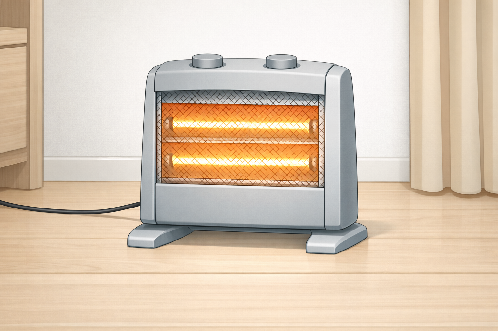
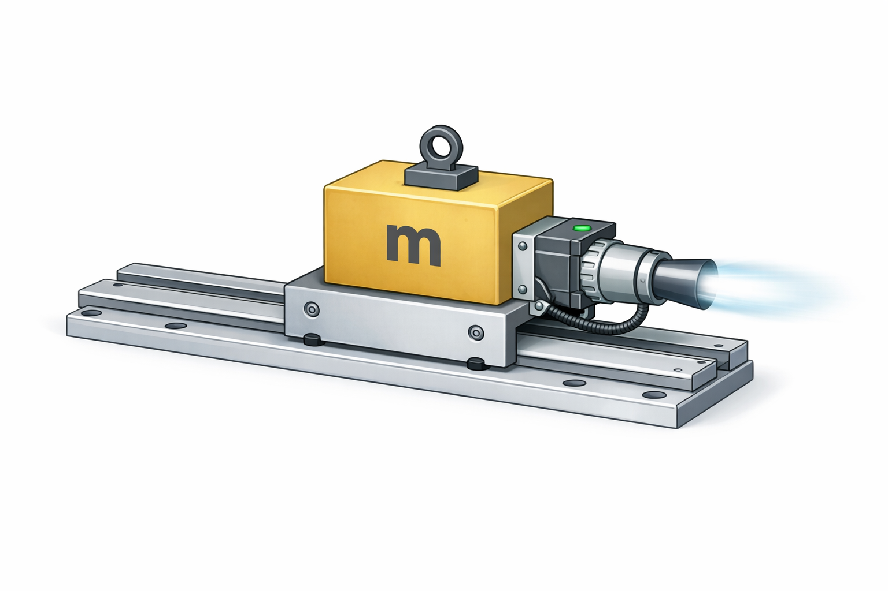
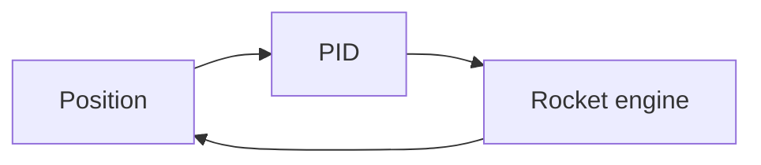
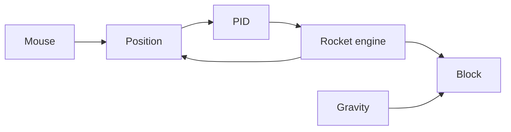
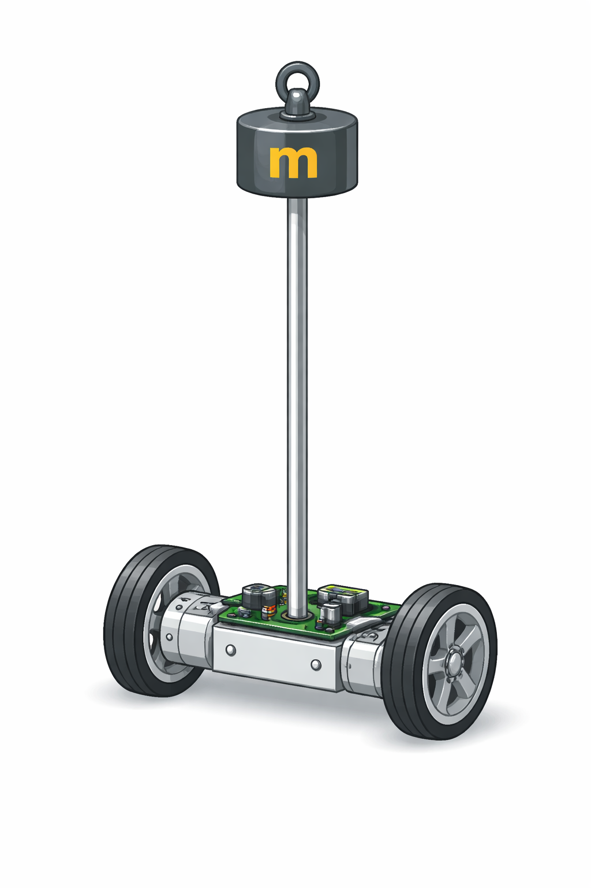
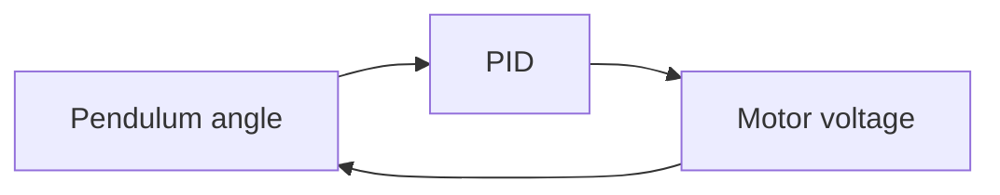
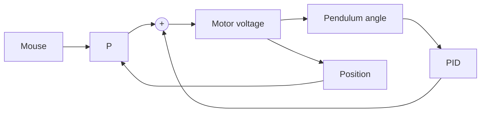

{/* add this script to the body  */}
{/* https://cdn.jsdelivr.net/gh/WLJSTeam/web-components@latest/src/common/app.js */}
<wljs-store kernel="./attachments/kernel-2586198314663249549.txt" json="./attachments/9c673000-6b4c-436e-b4a6-d378d6d85afc.txt"></wljs-store>

Let's start with a familiar example as on the preview picture. In this example, the water level must be full, i.e., if we have *a non-zero error* $e(t) = h_{\text{full}} - h_{\text{water}}(t)$, this will open a valve, i.e., send *a control signal* $u(t)$, which is proportional to our error:

$$
u(t) = K_{p}~e(t)
$$

Of course, in this case $u(t)$ cannot be negative and is clamped to the maximum water flow we can have in the system.

## Heater Story
Let's have a look at the example with a heater. 

It usually takes some time for heat to reach the thermometer due to the finite air conductivity as well as the heating material. These processes are described by the heat equation—a parabolic partial differential equation:

$$
\frac{\partial w}{\partial t} = \Delta w
$$

We can try to solve it for a 2-dimensional material, which is heated from one spot at (-2, 0):

$$
\frac{\partial w}{\partial t} = \Delta w + f(x,y,t)
$$

where $f$ is a heating function:

<WLJSWrapper>
<wljs-editor lazy="true" display="codemirror" type="Input" editable="true"  >{`sol = NDSolveValue[
	  {
	    D[w[x, y, t], t] == Laplacian[w[x, y, t], {x, y}] + If[(*SpB[*)Power[(x+2)(*|*),(*|*)2](*]SpB*)+(*SpB[*)Power[y(*|*),(*|*)2](*]SpB*) < 0.1 && t > 0.0, 100.0, 0],
	    w[x, y, 0] == 0
	  },
	  w,
	  {x, y} ∈ Rectangle[{-2, -1}, {2, 1}],
	  {t, 0, 10}
	];`}</wljs-editor></WLJSWrapper>

<WLJSWrapper>
<wljs-editor lazy="true" display="codemirror" type="Input" editable="true"  >{`Table[DensityPlot[
	  sol[x,y,t], {x,-2,2}, {y,-1,1}, 
	  Epilog->{
	    Text["🔥", {-2,0}],
	    Text[Style["A", White, FontSize->14], {1.6,0.}, {0,0}]
	  },
	  PlotLabel->("t = "<>ToString[t]), ColorFunctionScaling->False,
	  ImageSize->200
	], {t, {0.2, 1, 10}}]//Row`}</wljs-editor></WLJSWrapper>

<WLJSWrapper><wljs-editor lazy="true" display="codemirror" type="Output"  >{`(*GB[*){{(*VB[*)(FrontEndRef["28dcf07c-ca9a-4ef5-b565-37adbd6c571f"])(*,*)(*"1:eJxTTMoPSmNkYGAoZgESHvk5KRCeEJBwK8rPK3HNS3GtSE0uLUlMykkNVgEKG1mkJKcZmCfrJidaJuqapKaZ6iaZmpnqGpsnpiSlmCWbmhumAQCUbRZp"*)(*]VB*)(*|*),(*|*)(*VB[*)(FrontEndRef["dea8a804-8078-4bca-8d3c-d0f31d616379"])(*,*)(*"1:eJxTTMoPSmNkYGAoZgESHvk5KRCeEJBwK8rPK3HNS3GtSE0uLUlMykkNVgEKp6QmWiRaGJjoWhiYW+iaJCUn6lqkGCfrphikGRummBmaGZtbAgCLZBWn"*)(*]VB*)(*|*),(*|*)(*VB[*)(FrontEndRef["f4c3fcb4-eebd-4aa7-ae1f-1ea4a08f50ad"])(*,*)(*"1:eJxTTMoPSmNkYGAoZgESHvk5KRCeEJBwK8rPK3HNS3GtSE0uLUlMykkNVgEKp5kkG6clJ5nopqYmpeiaJCaa6yamGqbpGqYmmiQaWKSZGiSmAACjjBcQ"*)(*]VB*)}}(*]GB*)`}</wljs-editor></WLJSWrapper>

Let's look at the temperature at the fixed point `A` over time:

<WLJSWrapper>
<wljs-editor lazy="true" display="codemirror" type="Input" editable="true"  >{`Plot[sol[1.6,0.,t], {t,0,10}, AxesLabel->{"time", "Temperature"}, PlotLabel->"A", PlotRange->Full]`}</wljs-editor></WLJSWrapper>

<WLJSWrapper><wljs-editor lazy="true" display="codemirror" type="Output"  >{`(*VB[*)(FrontEndRef["80780f8c-ec23-4ef6-839a-2f426404c55f"])(*,*)(*"1:eJxTTMoPSmNkYGAoZgESHvk5KRCeEJBwK8rPK3HNS3GtSE0uLUlMykkNVgEKWxiYWxikWSTrpiYbGeuapKaZ6VoYWybqGqWZGJmZGJgkm5qmAQB/KRVR"*)(*]VB*)`}</wljs-editor></WLJSWrapper>

This curve is our system's reaction. It is delayed. Unlike electromagnetic or elastic waves, the heat equation describes *diffusion waves*. The speed of a diffusion wave is a function of time and constantly drops. On the other hand, you can also think about diffusion waves as a case of over-damped elastic waves.

We can't readily include our controller in this equation — doing so creates a feedback loop that `NDSolve` and other built-in solvers cannot handle. Instead, we need to discretize the problem.

## FDTD Method
To solve such equations, we can try to discretize them in both time and space. Descrete version of Laplacian is already quite known. Let's write a basic solver:

<WLJSWrapper>
<wljs-editor lazy="true" display="codemirror" type="Input" editable="true"  >{`solveHeat[w_, f_, dt_:0.0025, dx_:0.1] := Table[
	      
	  If[i>1 && i<50 && j>1 && j<50,
	    (*TB[*)Indexed[(*|*)w(*|*), {(*|*)i,j(*|*)}](*|*)(*1:eJxTTMoPSmNkYGAo5gUSYZmp5S6pyflFiSX5RcHsQBHPvJTUitQUAL2qCoU=*)(*]TB*) + (*FB[*)((dt ((*TB[*)Indexed[(*|*)w(*|*), {(*|*)-1+i,j(*|*)}](*|*)(*1:eJxTTMoPSmNkYGAo5gUSYZmp5S6pyflFiSX5RcHsQBHPvJTUitQUAL2qCoU=*)(*]TB*)+(*TB[*)Indexed[(*|*)w(*|*), {(*|*)i,-1+j(*|*)}](*|*)(*1:eJxTTMoPSmNkYGAo5gUSYZmp5S6pyflFiSX5RcHsQBHPvJTUitQUAL2qCoU=*)(*]TB*)-4 ((*TB[*)Indexed[(*|*)w(*|*), {(*|*)i,j(*|*)}](*|*)(*1:eJxTTMoPSmNkYGAo5gUSYZmp5S6pyflFiSX5RcHsQBHPvJTUitQUAL2qCoU=*)(*]TB*))+(*TB[*)Indexed[(*|*)w(*|*), {(*|*)i,1+j(*|*)}](*|*)(*1:eJxTTMoPSmNkYGAo5gUSYZmp5S6pyflFiSX5RcHsQBHPvJTUitQUAL2qCoU=*)(*]TB*)+(*TB[*)Indexed[(*|*)w(*|*), {(*|*)1+i,j(*|*)}](*|*)(*1:eJxTTMoPSmNkYGAo5gUSYZmp5S6pyflFiSX5RcHsQBHPvJTUitQUAL2qCoU=*)(*]TB*)))(*,*)/(*,*)((*SpB[*)Power[dx(*|*),(*|*)2](*]SpB*)))(*]FB*) + dt f[i,j]
	  ,
	    (*TB[*)Indexed[(*|*)w(*|*), {(*|*)i,j(*|*)}](*|*)(*1:eJxTTMoPSmNkYGAo5gUSYZmp5S6pyflFiSX5RcHsQBHPvJTUitQUAL2qCoU=*)(*]TB*)
	
	  ], 
	  
	{i, 50}, {j, 50}];`}</wljs-editor></WLJSWrapper>

Let's place a source at the same corner:

<WLJSWrapper>
<wljs-editor lazy="true" display="codemirror" type="Input" editable="true"  >{`Module[{w = Table[0., {50}, {50}]},
	  FixedPoint[
	    solveHeat[#, 
	      Function[{i,j}, If[Max[Abs[{i,j}-{25,2}]]<1, 1.0, 0.0]]
	    ]&, 
	    w, 20
	  ] // ListDensityPlot 
	]`}</wljs-editor></WLJSWrapper>

<WLJSWrapper><wljs-editor lazy="true" display="codemirror" type="Output"  >{`(*VB[*)(FrontEndRef["df167aeb-d5f6-4861-866c-4d8d0e5c3129"])(*,*)(*"1:eJxTTMoPSmNkYGAoZgESHvk5KRCeEJBwK8rPK3HNS3GtSE0uLUlMykkNVgEKp6QZmpknpibpppimmemaWJgZ6lqYmSXrmqRYpBikmiYbGxpZAgCNHBWy"*)(*]VB*)`}</wljs-editor></WLJSWrapper>

Plot time evolution:

<WLJSWrapper>
<wljs-editor lazy="true" display="codemirror" type="Input" editable="true"  >{`Module[{w = Table[0., {50}, {50}]}, Table[With[{
	  heater = If[steps > 100 && steps < 300, 100.0, 0.0]
	},
	  w = solveHeat[w, 
	      Function[{i,j}, If[Max[Abs[{i,j}-{25,2}]]<1, heater, 0.0]]
	  ]; 
	  {{steps, w[[25,25]]}, {steps, Clip[heater, {0,0.002}]}}
	], {steps,1,1000}]];
	ListLinePlot[% // Transpose, Filling->0, PlotLegends->{"Temperature (A)", "Heater"}]`}</wljs-editor></WLJSWrapper>

<WLJSWrapper><wljs-editor lazy="true" display="codemirror" type="Output"  >{`(*VB[*)(Legended[ToExpression[FrontEndRef["7bd97157-da9c-4545-9434-493be5c2e559"], InputForm], Placed[LineLegend[{Directive[PointSize[0.006944444444444445], RGBColor[0.24, 0.6, 0.8], AbsoluteThickness[2]], Directive[PointSize[0.006944444444444445], RGBColor[0.95, 0.627, 0.1425], AbsoluteThickness[2]]}, {"Temperature (A)", "Heater"}, LegendMarkers -> {{False, Automatic}, {False, Automatic}}, Joined -> {True, True}, LabelStyle -> {}, LegendLayout -> "Column"], After, Identity]])(*,*)(*"1:eJylUrtOwzAULW+oQDxmQCAxwNCBNlGVoYoCLS+1ojQVu5PcgNXUbh0HKGLlI2Bl4ws6s3RjYOEDYEFISPwBtiNatUJCiDsc2df3cXzuXXVoxR9JJBLhjIBjDOd5cClDnDJ7QniKcALES/vDMiQpoOBh8SYD/SHpWxCwwyjhBeIVLsCNOHICsNeEO+t4RnZTz6Y8ZLgpTdf0lKFltJRmZBzQ3TTouhEXHhVQiUTapDwA8g5J0FLeKosg5jcuoBwgFzx//JtMEROIGfbqFHHI44wpAXnMwOX4DGK20lWmmHAbXwJb6jQXO80rMw5XvXe3tmlAGWsvX78ftR9NllH2YrLbG2lvZlxoXoDlhDSIOFRPsVsjEIZYkvh/b1/Zh8nuP59KztyryXLJ57tG7uH33n0q2LNSQKg3QMwzYrCybm3YUrs9QBxYv/Rq/rGWJcRqwMIBSftu4ZgcOwpCUN+yIk7riGP3r1Gqs6R0IISBgSl2F6C3Cf2JagWQA4HNWwH4iZ/5qtDp7u+KqEUjrnQQckd1olhavlBEjWHfA8Ixb30BG37Lug=="*)(*]VB*)`}</wljs-editor></WLJSWrapper>

<Callout>
CFL (Courant-Friedrichs-Lewy) stability condition means $\delta t/\delta x^2 \leq 0.25$.
</Callout>

### Proportional regulator (P)
Let's engage our controller

<WLJSWrapper>
<wljs-editor lazy="true" display="codemirror" type="Input" editable="true"  >{`Module[{w = Table[0., {50}, {50}]}, Table[With[{
	  error = (0.0022 - w[[25,25]])
	},
	{
	  heater = 100000.0 Clip[error, {0,Infinity}]
	},
	  w = solveHeat[w, 
	      Function[{i,j}, If[Max[Abs[{i,j}-{25,2}]]<1, heater, 0.0]]
	  ]; 
	  {{steps, w[[25,25]]}, {steps,heater/30000.0}}
	], {steps,1,3000}]];
	ListLinePlot[
	  % // Transpose, Filling->0, 
	  PlotLegends->{"Temperature (A)", "Heater"},
	  Epilog->{Red, Dashed, Line[{{0, 0.0022}, {5000,0.0022}}]},
	  PlotRange->{Automatic, {0,0.0022}},
	  PlotLabel->"1x heater power"
	]`}</wljs-editor></WLJSWrapper>

<WLJSWrapper><wljs-editor lazy="true" display="codemirror" type="Output"  >{`(*VB[*)(Legended[ToExpression[FrontEndRef["b148255d-b9c9-4042-9b78-74d781a89309"], InputForm], Placed[LineLegend[{Directive[PointSize[1/180], RGBColor[0.24, 0.6, 0.8], AbsoluteThickness[2]], Directive[PointSize[1/180], RGBColor[0.95, 0.627, 0.1425], AbsoluteThickness[2]]}, {"Temperature (A)", "Heater"}, LegendMarkers -> {{False, Automatic}, {False, Automatic}}, Joined -> {True, True}, LabelStyle -> {}, LegendLayout -> "Column"], After, Identity]])(*,*)(*"1:eJytUr1KA0EQjv8/KP48gChYaBGIMZJcEY5o4h8Royf2e3dzumSzG/b21Nj7ENraWVuk9gEsbHwAbUQQfANndzESEURwio/d2ZnZb76ZOV/sR32pVCoeRzikcFqGQEiihPSG0FOFI+BhNurVIaMIlZDimw6MerRvGmFdCq4qPKycQZAo4jPw5tHtL+UK2ZWVMO07gZPOZXLZtOPnC+l8LswXlkjBWc44tnA/wn6CacP6ACTc5axlvAcyActvEKHGSABhNPhJpko5WIZfdao0VjZjBKFMJQSKnoBlq101Qbny6DnYHPMlUVRwwqgOorcItoJ521hdE0xI2Z65eN1r37ty2diTK68utb24tvYUQsmPBUsUHBzToM4hjmlvp9g/04mMvbny5v1hx598dmVx9PG6Wbz7nU6XVt6ElhkaTcCpJxJmF0qLnlZ4E4gC2T0gsyVW8R0i6yDjb8J33eIBvRyExWA6LSVKNLC14K9R5mdNaRu1gm+z7qzJ1750J5pFIT4wT7UYRKmf+ZrQsU53VdISiTI6oNxJgxuWpQgVMWPYCoErqlof++bO8w=="*)(*]VB*)`}</wljs-editor></WLJSWrapper>

There is a systematic error! Let's ramp up the heater power:

<WLJSWrapper>
<wljs-editor lazy="true" display="codemirror" type="Input" editable="true"  >{`Module[{w = Table[0., {50}, {50}]}, Table[With[{
	  error = (0.0022 - w[[25,25]])
	},
	{
	  heater = 100000.0 Clip[error, {0,Infinity}]
	},
	  w = solveHeat[w, 
	      Function[{i,j}, If[Max[Abs[{i,j}-{25,2}]]<1, heater, 0.0]]
	  ]; 
	  {{steps, w[[25,25]]}, {steps,heater/30000.0}}
	], {steps,1,3000}]];
	ListLinePlot[
	  % // Transpose, Filling->0, 
	  PlotLegends->{"Temperature (A)", "Heater"},
	  Epilog->{Red, Dashed, Line[{{0, 0.0022}, {5000,0.0022}}]},
	  PlotRange->{Automatic, {0,3 0.0022}},
	  PlotLabel->"10x heater power"
	]`}</wljs-editor></WLJSWrapper>

<WLJSWrapper><wljs-editor lazy="true" display="codemirror" type="Output"  >{`(*VB[*)(Legended[ToExpression[FrontEndRef["2557c277-fb74-4b20-bed0-5e45226db0d0"], InputForm], Placed[LineLegend[{Directive[PointSize[1/360], RGBColor[0.24, 0.6, 0.8], AbsoluteThickness[2]], Directive[PointSize[1/360], RGBColor[0.95, 0.627, 0.1425], AbsoluteThickness[2]]}, {"Temperature (A)", "Heater"}, LegendMarkers -> {{False, Automatic}, {False, Automatic}}, Joined -> {True, True}, LabelStyle -> {}, LegendLayout -> "Column"], After, Identity]])(*,*)(*"1:eJy1UslKA0EQjfuC4vIBouBBD4EwJuYUhqhxI8FlxHv3dI02drqlp0eNdz9Cr978gpz9AA9e/AC9iCD4B1Z3oxIRxIN1eMxU1/LqVc1QtZv05HK5dBRhn8PpCsRKE6N0NICeOhyAZEHSbUOGEWqM45sNTLqsbxJhVStpapLVziDODKEColl0B6VSOQ7K5XxCy8V8kQaFPAVWyJegWAqCRUYLrOAL9yLsZpg2aD+AsC0pWs67pzPw/PoRtgWJgSX9H2TqXIJn+FWnzlPjM4YQVriG2PAT8Gyta1txaSJ+Dj7HtSSGK0kEt0H8ENFXcG9rS8tKKK3bUxcvO+27UC84ewz11aW159DXnkCo0lSJzMDeIY+PJKQptz3+hU7i7DXUN2/3DTr+FOrK8MP1ceX2dzodWkVjVmZoHgNuPdMwPVedj6zC60AM6M4FuSvxijeIPgKdfhO+4y/ts8dBRApu0mpmVBNHi/8a5TpbSpuoFXzb9eeZfN1LZ6I7FEJBRKYlIMn9zNeFjnxOVyctlRmnA8qdNaVjWU1QEbeGDQbScNN6B5E5zvk="*)(*]VB*)`}</wljs-editor></WLJSWrapper>

Let's make an animation out of it:

<WLJSWrapper>
<wljs-editor lazy="true" display="codemirror" type="Input" editable="true"  >{`frames = Module[{w = Table[0., {50}, {50}]}, Table[Do[With[{
	  error = (0.0022 - w[[25,25]])
	},
	{
	  heater = (*BB[*)(100000.0 Clip[error, {0,Infinity}])(*,*)(*"1:eJxTTMoPSmNkYGAoZgESHvk5KRAeB5AILqnMSXXKr0hjgskHleakFnMBGU6JydnpRfmleSlpzDDlQe5Ozvk5+UVFDGDwwR6dwcAAAAHdFiw="*)(*]BB*)
	},
	  w = solveHeat[w, 
	      Function[{i,j}, If[Max[Abs[{i,j}-{25,2}]]<1, heater, 0.0]]
	  ]; 
	], {5}]; w, {steps,1,300}]];`}</wljs-editor></WLJSWrapper>

<WLJSWrapper>
<wljs-editor lazy="true" display="codemirror" type="Input" editable="true"  >{`ImageResize[AnimatedImage[Colorize/@Image/@Rescale[(*SqB[*)Sqrt[frames](*]SqB*)]], Scaled[4]]`}</wljs-editor></WLJSWrapper>

<WLJSWrapper><wljs-editor lazy="true" display="codemirror" type="Output" encoded="true"  >{`%28%2AVB%5B%2A%29%28CoffeeLiqueur%60Extensions%60Video%60Internal%60imgSymbol%242247394%29%28%2A%2C%2A%29%28%2A%221%3AeJxTTMoPSmNkYGAoZgESHvk5KRCeEJBwK8rPK3HNS3GtSE0uLUlMykkNVgEKp6ZaJKcaGFvoJhkYGOqamBuY6iaaJKfoppgZp6SZppglJ6elAQCKNhZf%22%2A%29%28%2A%5DVB%2A%29`}</wljs-editor></WLJSWrapper>

This looks better, but the system now oscillates continuously and a systematic error persists.

### Integration (I)
So far we've played with the proportional component of the PID controller. The second most essential part is the *integral*, which accumulates *error* over time.

How do we do that? In the same way we did integration of our heat equation:

<WLJSWrapper>
<wljs-editor lazy="true" display="codemirror" type="Input" editable="true"  >{`Module[{w = Table[0., {50}, {50}], accError = 0.0}, Table[With[{
	  error = (0.0022 - w[[25,25]])
	},
	{
	  heater = 100000.0 Clip[(*BB[*)(error)(*,*)(*"1:eJxTTMoPSmNkYGAoZgESHvk5KRAeB5AILqnMSXXKr0hjgskHleakFnMBGU6JydnpRfmleSlpzDDlQe5Ozvk5+UVFDGDwwR6dwcAAAAHdFiw="*)(*]BB*) + (*BB[*)(0.001 accError)(*,*)(*"1:eJxTTMoPSmNkYGAoZgESHvk5KRAeB5AILqnMSXXKr0hjgskHleakFnMBGU6JydnpRfmleSlpzDDlQe5Ozvk5+UVFDGDwwR6dwcAAAAHdFiw="*)(*]BB*), {0,Infinity}]
	},
	  accError += error;
	
	  w = solveHeat[w, 
	      Function[{i,j}, If[Max[Abs[{i,j}-{25,2}]]<1, heater, 0.0]]
	  ]; 
	  {{steps, w[[25,25]]}, {steps,heater/30000.0}}
	], {steps,1,3000}]];
	ListLinePlot[
	  % // Transpose, Filling->0, 
	  PlotLegends->{"Temperature (A)", "Heater"},
	  Epilog->{Red, Dashed, Line[{{0, 0.0022}, {5000,0.0022}}]},
	  PlotRange->{Automatic, {0,3 0.0022}},
	  PlotLabel->"10x heater power + I"
	]`}</wljs-editor></WLJSWrapper>

<WLJSWrapper><wljs-editor lazy="true" display="codemirror" type="Output"  >{`(*VB[*)(Legended[ToExpression[FrontEndRef["27ce2619-6d1b-49a4-a457-709a3e3c84c2"], InputForm], Placed[LineLegend[{Directive[PointSize[1/360], RGBColor[0.24, 0.6, 0.8], AbsoluteThickness[2]], Directive[PointSize[1/360], RGBColor[0.95, 0.627, 0.1425], AbsoluteThickness[2]]}, {"Temperature (A)", "Heater"}, LegendMarkers -> {{False, Automatic}, {False, Automatic}}, Joined -> {True, True}, LabelStyle -> {}, LegendLayout -> "Column"], After, Identity]])(*,*)(*"1:eJy1UslKA0EQjVvUoLh8gCh40EPALBpzkCGauJHgMsF7T0+NNul0S0+PGu9+hF69+QU5+wEevPgBehFB8A+s7nEhQRAP1uExU13Lq1c148n9oC+RSISjCAcMTstApSJaKncQPVU4BOFng14TkkKo+AzfTGDQY3yTCOtKCl0RfuUMaKSJx8GdRXe2QCG7lCmml/yMl84XST5N8ouFdGGhSHKQo8t5+lG4H2E/wrQh8wHE3xG8Zb11FUHML4mwywkFP0h+kqkyATHD7zpVFuo4YxihzBRQzU4gZmtcu5IJ7bJziHNsS6KZFIQzE8SOEOMK9m1jdU1yqVR76uJlr33nqJy1R0ddXRp7duLaEwglL5Q80lA/YrQhIAyZ6fEvdAJrr466ebuveeNPjlpJPVwfr9z+TqdDK3fMyAzNY8CtRwqm50rzrlF4E4gG1bkgeyWx4jWiGqDCLuE7/sIBcxyEh2AnLUVaNnE0+tco29lQ2katoGvXX2fyfS+difZQiAfc1S0OQeJnvjZ05Gu6KmnJSFsdUO6oKSzLUoCK2DVs+SA00613Oa3O2Q=="*)(*]VB*)`}</wljs-editor></WLJSWrapper>

The baseline slowly climbs toward the target! Let's reduce the total power and check again:

<WLJSWrapper>
<wljs-editor lazy="true" display="codemirror" type="Input" editable="true"  >{`Module[{w = Table[0., {50}, {50}], accError = 0.0}, Table[With[{
	  error = (0.0022 - w[[25,25]])
	},
	{
	  heater = 20000.0 Clip[error + 0.001 accError, {0,Infinity}]
	},
	  accError += error;
	
	  w = solveHeat[w, 
	      Function[{i,j}, If[Max[Abs[{i,j}-{25,2}]]<1, heater, 0.0]]
	  ]; 
	  {{steps, w[[25,25]]}, {steps,heater/30000.0}}
	], {steps,1,3000}]];
	ListLinePlot[
	  % // Transpose, Filling->0, 
	  PlotLegends->{"Temperature (A)", "Heater"},
	  Epilog->{Red, Dashed, Line[{{0, 0.0022}, {5000,0.0022}}]},
	  PlotRange->{Automatic, {0,3 0.0022}},
	  PlotLabel->"2x heater power + I"
	]`}</wljs-editor></WLJSWrapper>

<WLJSWrapper><wljs-editor lazy="true" display="codemirror" type="Output"  >{`(*VB[*)(Legended[ToExpression[FrontEndRef["e3b386d0-dd5c-4b39-8e73-cd69e74001af"], InputForm], Placed[LineLegend[{Directive[PointSize[1/180], RGBColor[0.24, 0.6, 0.8], AbsoluteThickness[2]], Directive[PointSize[1/180], RGBColor[0.95, 0.627, 0.1425], AbsoluteThickness[2]]}, {"Temperature (A)", "Heater"}, LegendMarkers -> {{False, Automatic}, {False, Automatic}}, Joined -> {True, True}, LabelStyle -> {}, LegendLayout -> "Column"], After, Identity]])(*,*)(*"1:eJytUstKQzEQre8Hio8PEAUXuihUb7V1IZeq9UXFxxX3uTdzNTRNJDdXrXs/QrfuXLtw7Qe4cOMH6EYEwT9wkmClRRDBWRySyczkzJmZCOVe3JHJZJJBhAMGpysQSUW0VEEPeipwCILOxu0mpB+hTBm+mcC4zfhGEVaVFLosaPkMolSTkEMwiW7wQq84T3NZSueibD70FrJFKHjZiM4vQCGfy82Q2BXuRNhLMa3XHIDQbcHr1ruvUnD8uhF2OImAxt1fZCpMgGP4XafCEu0y+hBWmIJIsxNwbI1rRzKhA3YOLsd+STSTgnBmgtgtgqtg39aWliWXSt2NXbzt3j34yrP27KurS2Ovvqs9glAKE8lTDftHLKoKSBLW3ij2z3Ria+++uvl43AqHX3y12P90fbx4/zudJq2CISMz1I4Bp54qGJ8qTQdG4XUgGlTzgOyWOMW3iKqCSlqEb7olXWY5CE/AdlpKtaxha9Ffo+zPhtImagUts26syfe+NCfaRSEh8EDXOcSZn/na0IFGdxVSl6m2OqDcaU1YlqUYFbFj2KAgNNP1T/eK0AI="*)(*]VB*)`}</wljs-editor></WLJSWrapper>

Success! Can we improve it further?

### Differentiation (D)
We can also react to how fast the error changes — this allows us to damp oscillations before they grow:

<WLJSWrapper>
<wljs-editor lazy="true" display="codemirror" type="Input" editable="true"  >{`Module[{g=0, w = Table[0., {50}, {50}], accError = 0.0, prevError = 0.0022}, Table[With[{
	  error = (0.0022 - w[[25,25]])
	},
	{
	  heater = 100000.0 Clip[(*BB[*)(0.9 error)(*,*)(*"1:eJxTTMoPSmNkYGAoZgESHvk5KRAeB5AILqnMSXXKr0hjgskHleakFnMBGU6JydnpRfmleSlpzDDlQe5Ozvk5+UVFDGDwwR6dwcAAAAHdFiw="*)(*]BB*) + (*BB[*)(0.001 accError)(*,*)(*"1:eJxTTMoPSmNkYGAoZgESHvk5KRAeB5AILqnMSXXKr0hjgskHleakFnMBGU6JydnpRfmleSlpzDDlQe5Ozvk5+UVFDGDwwR6dwcAAAAHdFiw="*)(*]BB*) + (*BB[*)(100 (error-prevError))(*,*)(*"1:eJxTTMoPSmNkYGAoZgESHvk5KRAeB5AILqnMSXXKr0hjgskHleakFnMBGU6JydnpRfmleSlpzDDlQe5Ozvk5+UVFDGDwwR6dwcAAAAHdFiw="*)(*]BB*), {0,Infinity}]
	},
	  accError += error;
	  prevError = error;
	
	  w = solveHeat[w, 
	      Function[{i,j}, If[Max[Abs[{i,j}-{25,2}]]<1, heater, 0.0]]
	  ]; 
	  w = solveHeat[w, 
	      Function[{i,j}, If[Max[Abs[{i,j}-{25,2}]]<1, heater, 0.0]]
	  ];
	  
	  {{2 steps, w[[25,25]]}, {2 steps,heater/30000.0}}
	], {steps,1,3000/2}]];
	ListLinePlot[
	  % // Transpose, Filling->0, 
	  PlotLegends->{"Temperature (A)", "Heater"},
	  Epilog->{Red, Dashed, Line[{{0, 0.0022}, {5000,0.0022}}]},
	  PlotRange->{Automatic, {0,3 0.0022}},
	  PlotLabel->"10x heater power + I + D"
	]`}</wljs-editor></WLJSWrapper>

<WLJSWrapper><wljs-editor lazy="true" display="codemirror" type="Output"  >{`(*VB[*)(Legended[ToExpression[FrontEndRef["ef98d0f7-615a-4be0-b5a5-d796ea9fd5e5"], InputForm], Placed[LineLegend[{Directive[PointSize[1/180], RGBColor[0.24, 0.6, 0.8], AbsoluteThickness[2]], Directive[PointSize[1/180], RGBColor[0.95, 0.627, 0.1425], AbsoluteThickness[2]]}, {"Temperature (A)", "Heater"}, LegendMarkers -> {{False, Automatic}, {False, Automatic}}, Joined -> {True, True}, LabelStyle -> {}, LegendLayout -> "Column"], After, Identity]])(*,*)(*"1:eJytUrtKRDEQXd8PFB8fIAoWWiz4uuoWcll1fbHi44p97s1Ew2YTyc1V196P0NbO2sLaD7Cw8QO0EUHwD5wkuLIiiOAUh2QyMzlzZkZitctacrlc2ouwz+FkGRKliVE66kBPGQ5A0inWbEO6EUqU45sNZE3WN4iwopU0JUlLp5BkhsQColF0AyvM0wk2l5+dDEh+JoaJfByQIE/nCrNACowGEPjCrQi7GaZ12gMQuiVFzXn3dAaeXzvCtiAJUNb+SabMJXiGX3XKPDU+owthmWtIDD8Gz9a6thWXJuJn4HPcl8RwJYngNojfIPgK7m11cUkJpfXt0Pnrzu19qKedPYX68sLaS+hrDyAU41SJzMDeIU8qEtKUN9eL/TMd5uwt1NfvD5tx/3OoF7ofr44W7n6n06BV1GdlhuoR4NQzDcNjxfHIKrwGxIBuHJDbEq/4JtEV0Ok34RtuaZtdDiJScJ0WM6Oq2Fry1yj3s6W0gVrBt1nX1+RrXxoT3aKQGERkagJY7me+LrSn3l2Z1FRmnA4od1aVjmWRoSJuDOsUpOGm9gEqp9Bw"*)(*]VB*)`}</wljs-editor></WLJSWrapper>

We significantly reduced the *rise time*, but introduced weak oscillations from the large D component. Tuning PID gains is an art and a science of its own — well beyond the scope of this article.

Here is a comparison with zero D:

<WLJSWrapper><wljs-editor lazy="true" display="codemirror" type="Output"  >{`(*VB[*)(Legended[ToExpression[FrontEndRef["50fa522f-d5b8-4f58-b713-7a82fefe5706"], InputForm], Placed[LineLegend[{Directive[PointSize[1/180], RGBColor[0.24, 0.6, 0.8], AbsoluteThickness[2]], Directive[PointSize[1/180], RGBColor[0.95, 0.627, 0.1425], AbsoluteThickness[2]]}, {"Temperature (A)", "Heater"}, LegendMarkers -> {{False, Automatic}, {False, Automatic}}, Joined -> {True, True}, LabelStyle -> {}, LegendLayout -> "Column"], After, Identity]])(*,*)(*"1:eJytUs1KAzEQrvVfFH8eQBQ86KGg1bW9yFK1/tFidYv37O5Eg2ki2axa7z6EXr159uDZB/DgxQfQiwiCb+AkwUpFEME5fCSTmck338xkKHdpZyaTSYYQ9hicrEIkFdFSBb3oqcA+iDhPsyZkAKEcM3wzgbTD+MYQ1pQUuizi8ilEqSYhh2AK3d4sJV4+T3OxFxZzC9Qr5sLC3HyuQIp5ChS8wuyiK9yFsJtiWp85AIm3BW9ab12l4Pj1INQ4iSCmPZ9kKkyAY/hVp8IS7TL6EVaZgkizY3BsjasmmdABOwOXY78kmklBODNB7AbBVbBv68srkkulbsfPX3du7301b+3JV5cXxl58V3sUoRQmkqca6gcsOhSQJCzbKvbPdKi1N19dvz9Uw5FnXy0NPF4dLd39TqdNq2DYyAyNI8CppwompkszgVF4A4gG1T4guyVO8SpRh6CSb8K33ZJusxyEJ2A7LaVaNrC16K9R9mdDaQu1gm+zbq3J1760J9pFISHwQDc50MzPfG3oYKu7CmnKVFsdUO60ISzLEkVF7Bg2YxCa6eYHfwTP2A=="*)(*]VB*)`}</wljs-editor></WLJSWrapper>

We used an FDTD-simulated heater as our virtual playground to discover why each component — P, I, and D — matters. What a journey!

 

---

 

## Formal Definition of PID
Finally, we got it! Here is a generalized expression for our controller:

<WLJSWrapper>
<wljs-editor lazy="true" display="codemirror" type="Input" editable="true"  >{`u[t] == (*SbB[*)Subscript[K(*|*),(*|*)"p"](*]SbB*) e[t] + (*SbB[*)Subscript[K(*|*),(*|*)"i"](*]SbB*) (*TB[*)Integrate[(*|*)e[\\[Tau]](*|*), {(*|*)\\[Tau](*|*),(*|*)0(*|*),(*|*)t(*|*)}](*|*)(*1:eJxTTMoPSmNmYGAo5gUSYZmp5S6pyflFiSX5RcGcQBHPvJLUdCA3NZMRpIgFSIQUlaYCAIJ9Dew=*)(*]TB*) + (*SbB[*)Subscript[K(*|*),(*|*)"d"](*]SbB*) e'[t]`}</wljs-editor></WLJSWrapper>

Where:
- $u(t)$ is the **control signal** (e.g., voltage, force, or acceleration)
- $e(t)$ is the **error** between the setpoint and the measured value
- $K_p$, $K_i$, $K_d$ are the **tuning parameters** (gains) for each component

| Component | Effect | Too Low | Too High |
|-----------|--------|---------|----------|
| **P** (Proportional) | Reduces rise time | Slow response | Oscillations, overshoot |
| **I** (Integral) | Eliminates steady-state error | Residual error | Instability, windup |
| **D** (Derivative) | Reduces overshoot & settling time | More overshoot | Noise sensitivity |

## Position Control

Let's explore a simpler example - stabilizing the position of a block at a target coordinate.

### Simplifying the Equation

To solve this analytically, let's differentiate both sides to eliminate the integral term and work with derivatives only:

<WLJSWrapper>
<wljs-editor lazy="true" display="codemirror" type="Input" editable="true"  >{`D[u[t] == (*SbB[*)Subscript[K(*|*),(*|*)"p"](*]SbB*) e[t] + (*SbB[*)Subscript[K(*|*),(*|*)"i"](*]SbB*) (*TB[*)Integrate[(*|*)e[\\[Tau]](*|*), {(*|*)\\[Tau](*|*),(*|*)0(*|*),(*|*)t(*|*)}](*|*)(*1:eJxTTMoPSmNmYGAo5gUSYZmp5S6pyflFiSX5RcGcQBHPvJLUdCA3NZMRpIgFSIQUlaYCAIJ9Dew=*)(*]TB*) + (*SbB[*)Subscript[K(*|*),(*|*)"d"](*]SbB*) e'[t], t]`}</wljs-editor></WLJSWrapper>

<WLJSWrapper><wljs-editor lazy="true" display="codemirror" type="Output"  >{`(u')[t]==e[t] ((*SbB[*)Subscript[K(*|*),(*|*)"i"](*]SbB*))+((*SbB[*)Subscript[K(*|*),(*|*)"p"](*]SbB*)) (e')[t]+((*SbB[*)Subscript[K(*|*),(*|*)"d"](*]SbB*)) (e'')[t]`}</wljs-editor></WLJSWrapper>

Note that you would need to keep the initial condition:

<WLJSWrapper>
<wljs-editor lazy="true" display="codemirror" type="Input" editable="true"  >{`u[0] == e[0] ((*SbB[*)Subscript[K(*|*),(*|*)"p"](*]SbB*))`}</wljs-editor></WLJSWrapper>

It is usually much easier to have only differential equations.

### The Physical System
We apply our position control system on a block of mass, attached to a rail with a little rocket engine controlled by PID. Here is how it may look like in your imagination:

The corresponding system of ODE follows:

<WLJSWrapper>
<wljs-editor lazy="true" display="codemirror" type="Input" editable="true"  >{`system = {
	  x''[t] == u[t]/m,
	  x'[0] == 0,
	  x[0] == 0
	};`}</wljs-editor></WLJSWrapper>

### Sanity Check: Constant Force

Before connecting the PID controller, let's verify our system works correctly with a constant force:

<WLJSWrapper>
<wljs-editor lazy="true" display="codemirror" type="Input" editable="true"  >{`DSolve[system /. {u[t_] :> 1}, x, t]`}</wljs-editor></WLJSWrapper>

<WLJSWrapper><wljs-editor lazy="true" display="codemirror" type="Output"  >{`{{x->Function[{t},(*FB[*)(((*SpB[*)Power[t(*|*),(*|*)2](*]SpB*))(*,*)/(*,*)(2 m))(*]FB*)]}}`}</wljs-editor></WLJSWrapper>

As expected, we get the classic parabolic motion $x = \frac{t^2}{2m}$ — Newton's second law in action:

<WLJSWrapper>
<wljs-editor lazy="true" display="codemirror" type="Input" editable="true"  >{`Function[{t},(*FB[*)(((*SpB[*)Power[t(*|*),(*|*)2](*]SpB*))(*,*)/(*,*)(2 m))(*]FB*)] /.{m->1.0};
	Plot[%[t], {t,0,10}, AxesLabel->{"t", "x"}, Epilog->{
	  Inset[Graphics3D[Rotate[{Cuboid[1.2{-1,-1,-1},1.2{1,1,0.1}], Orange, Cuboid[{-1,-1,-1},{1,1,1}]}, 30Degree, {1,0,0}], ImageSize->100, ViewPoint->{8.5,-4.5,3}], {5,15}]
	}]`}</wljs-editor></WLJSWrapper>

<WLJSWrapper><wljs-editor lazy="true" display="codemirror" type="Output"  >{`(*VB[*)(FrontEndRef["a165c240-03c0-4d6a-8f80-a227fd593da0"])(*,*)(*"1:eJxTTMoPSmNkYGAoZgESHvk5KRCeEJBwK8rPK3HNS3GtSE0uLUlMykkNVgEKJxqamSYbmRjoGhgnG+iapJgl6lqkWRjoJhoZmaelmFoapyQaAAB7QBVg"*)(*]VB*)`}</wljs-editor></WLJSWrapper>

### Connecting the P Controller

Now let's connect our control signal $u(t)$ to the position $x(t)$ through the error function. The error is the difference between the target position $a$ and the current position:

Here is our ODE:

<WLJSWrapper>
<wljs-editor lazy="true" display="codemirror" type="Input" editable="true"  >{`system = {
	  u[t]==(*SbB[*)Subscript[K(*|*),(*|*)"p"](*]SbB*) e[t],
	  x''[t] == u[t]/m + 1,
	  x'[0] == 0,
	  x[0] == 0,
	
	  e[t] == (a - x[t])
	};`}</wljs-editor></WLJSWrapper>

Solve it analytically:

<WLJSWrapper>
<wljs-editor lazy="true" display="codemirror" type="Input" editable="true"  >{`sol = DSolve[system, {u,x,e}, t] // Flatten;
	sol = Simplify[sol, Assumptions->{Element[a, Reals], m > 0, (*SbB[*)Subscript[K(*|*),(*|*)"p"](*]SbB*) > 0}];`}</wljs-editor></WLJSWrapper>

<WLJSWrapper>
<wljs-editor lazy="true" display="codemirror" type="Input" editable="true"  >{`x /. sol/. {m -> 1.0, a -> 1.0} /. {{(*SbB[*)Subscript[K(*|*),(*|*)"p"](*]SbB*) -> 1}, {(*SbB[*)Subscript[K(*|*),(*|*)"p"](*]SbB*) -> 0.01}};
	Plot[
	  #[t]&/@%//Evaluate, {t,0,10}, 
	  Epilog->{Dashed, Red, Line[{{0,1.0}, {10,1.0}}]},
	  PlotLegends->Placed[{"Regulated", "Unregulated"}, {0.15,0.5}]
	]`}</wljs-editor></WLJSWrapper>

<WLJSWrapper><wljs-editor lazy="true" display="codemirror" type="Output"  >{`(*VB[*)(Legended[ToExpression[FrontEndRef["4fd0fce2-abda-45e3-b237-f68534ce252e"], InputForm], Placed[LineLegend[{Directive[Opacity[1.], RGBColor[0.24, 0.6, 0.8], AbsoluteThickness[2]], Directive[Opacity[1.], RGBColor[0.95, 0.627, 0.1425], AbsoluteThickness[2]]}, {"Regulated", "Unregulated"}, LegendMarkers -> None, LabelStyle -> {}, LegendLayout -> "Column"], {0.15, 0.5}, Identity]])(*,*)(*"1:eJylUU0vA0EYXt9aJPgBEonrJrLb4iIbtESyVbrlPrvzTk26ZprZWfQH+BFc3fyCnrk7uLhKuIhE+AdmZ1qyLg7ew5N5v5953sWQN8iIZVnJjIIjCmcViLhAkotgQkV8aAHDDhnOSooKqpiqXFZIhrLYvIJtwZmsMlw9hyiVKIwhWFLhEsHLJALHRiFGdqkMrh067qpNVtbKbkklyg6YwaMKGqlqm8wegHCdxV0dbYoUDL9xBfsxigCTsQEZnzIwDH/m+DSRpqOgoEIFRJKegmGbfaneQRGVXWFp+/BMsd68s7nFYy5Eb+Hi7aB37wlX27Mnri4ze/XMmDkFG2HC41RC85hGbQZJQjMK/91MtL174ubzoRbOvnhivfh43Vm//XtzToGgoJVspTGSgIMp5R0yMfDzquvTGxlrSLRBJDq1x9mv8xjNUQhxILsxECuneb50+numj7o8lUF2P/XH9ITlmfY1vvP6sjx5WpFdDEwqsb4AQk+tFw=="*)(*]VB*)`}</wljs-editor></WLJSWrapper>

Notice the oscillations! With only proportional control, the system overshoots and oscillates around the target. This is exactly where the **D** and **I** terms become essential.

### Extending to PID

Here we can no longer have an analytical solution, therefore we use `NDSolve`:

<WLJSWrapper>
<wljs-editor lazy="true" display="codemirror" type="Input" editable="true"  >{`system = {
	  (u')[t]==e[t] ((*SbB[*)Subscript[K(*|*),(*|*)"i"](*]SbB*))+((*SbB[*)Subscript[K(*|*),(*|*)"p"](*]SbB*)) (e')[t]+((*SbB[*)Subscript[K(*|*),(*|*)"d"](*]SbB*)) (e'')[t],
	  u[0] == ((*SbB[*)Subscript[K(*|*),(*|*)"p"](*]SbB*)) (a - x[0]),
	  x''[t] == u[t]/m + 1.0,
	  x'[0] == 0.,
	  x[0] == 0.,
	
	  e[t] == (a - x[t])
	};
	
	ClearAll[sol];
	sol[p_, i_, d_] := Flatten@NDSolve[system /. {m -> 5.0, a -> 2.5, (*SbB[*)Subscript[K(*|*),(*|*)"p"](*]SbB*) -> p, (*SbB[*)Subscript[K(*|*),(*|*)"i"](*]SbB*) -> i p, (*SbB[*)Subscript[K(*|*),(*|*)"d"](*]SbB*) -> d p}, {u,x,e}, {t,0,200}];`}</wljs-editor></WLJSWrapper>

Let's make it interactive

<WLJSWrapper>
<wljs-editor lazy="true" display="codemirror" type="Input" editable="true"  >{`Manipulate[
	 With[{eqs = {Clip[x[t],{-0.5,4}]+0.05, Clip[0.01 u[t],{-0.5,4}]} /. sol[10.0,i,d]},
	   Plot[eqs, {t,0,50},  Frame->True, PlotLegends->{"x[t]", "u[t]"}, FrameLabel->{"t (time)", "value"}, Epilog->{Dashed, Red, Line[{{0,2.5}, {50,2.5}}]},
	   PlotRange->{{-1,50}, {-1,4.5}}]
	 ]
	,
	  {{i, 0, "I"}, 0, 0.1, 0.025},
	  {{d, 0, "D"}, 0, 1.0, 0.25},
	  ContinuousAction->True,
	  Appearance->None
	]`}</wljs-editor></WLJSWrapper>

<WLJSWrapper><wljs-editor display="codemirror" type="Output"  >{`(*VB[*)(FrontEndRef["53935cc0-d312-4ed3-b821-80321e483580"])(*,*)(*"1:eJxTTMoPSmNkYGAoZgESHvk5KRCeEJBwK8rPK3HNS3GtSE0uLUlMykkNVgEKmxpbGpsmJxvophgbGumapKYY6yZZGBnqWhgYGxmmmlgYm1oYAAB3JhSo"*)(*]VB*)`}</wljs-editor></WLJSWrapper>

As you can see:

<Callout type="warn">
**D** damps the oscillations (over-regulation), while **I** eliminates the systematic error.
</Callout>

### Even more interactive version
To achieve that, we need to do the integration iteratively (again!):

Discretize it:

<WLJSWrapper>
<wljs-editor lazy="true" display="codemirror" type="Input" editable="true"  >{`{
	  u[t] == (*SbB[*)Subscript[K(*|*),(*|*)"p"](*]SbB*) e[t] + (*SbB[*)Subscript[K(*|*),(*|*)"i"](*]SbB*) (*TB[*)Integrate[(*|*)e[\\[Tau]](*|*), {(*|*)\\[Tau](*|*),(*|*)0(*|*),(*|*)t(*|*)}](*|*)(*1:eJxTTMoPSmNmYGAo5gUSYZmp5S6pyflFiSX5RcGcQBHPvJLUdCA3NZMRpIgFSIQUlaYCAIJ9Dew=*)(*]TB*) + (*SbB[*)Subscript[K(*|*),(*|*)"d"](*]SbB*) e'[t],
	  x''[t] == u[t]/m,
	  x'[0] == 0,
	  x[0] == 0,
	
	  e[t] == (a - x[t])
	}`}</wljs-editor></WLJSWrapper>

Lift the integral:

<WLJSWrapper>
<wljs-editor lazy="true" display="codemirror" type="Input" editable="true"  >{`{
	  u'[t] == (*SbB[*)Subscript[K(*|*),(*|*)"p"](*]SbB*) e'[t] + (*SbB[*)Subscript[K(*|*),(*|*)"i"](*]SbB*) e[t] + (*SbB[*)Subscript[K(*|*),(*|*)"d"](*]SbB*) e''[t],
	  x''[t] == u[t]/m,
	  x'[0] == 0,
	  x[0] == 0,
	
	  e[t] == (a - x[t])
	}`}</wljs-editor></WLJSWrapper>

Remove 2nd order:

<WLJSWrapper>
<wljs-editor lazy="true" display="codemirror" type="Input" editable="true"  >{`{
	  h[t] == e'[t],
	  u'[t] == (*SbB[*)Subscript[K(*|*),(*|*)"p"](*]SbB*) h[t] + (*SbB[*)Subscript[K(*|*),(*|*)"i"](*]SbB*) e[t] + (*SbB[*)Subscript[K(*|*),(*|*)"d"](*]SbB*) h'[t]
	}`}</wljs-editor></WLJSWrapper>

Discretize:

<WLJSWrapper>
<wljs-editor lazy="true" display="codemirror" type="Input" editable="true"  >{`{
	  h[t] == e'[t],
	  u'[t] == (*SbB[*)Subscript[K(*|*),(*|*)"p"](*]SbB*) h[t] + (*SbB[*)Subscript[K(*|*),(*|*)"i"](*]SbB*) e[t] + (*SbB[*)Subscript[K(*|*),(*|*)"d"](*]SbB*) h'[t]
	} /. {(e_)'[t] :> (*FB[*)((e[n]-e[n-1])(*,*)/(*,*)(\\[Delta]t))(*]FB*), e_[t] :> e[n]};
	(dsol = Solve[%, {h[n],u[n]}]//Flatten)//FullSimplify//TableForm `}</wljs-editor></WLJSWrapper>

<WLJSWrapper><wljs-editor lazy="true" display="codemirror" type="Output"  >{`(*GB[*){{h[n]->(*FB[*)((-e[-1+n]+e[n])(*,*)/(*,*)(\\[Delta]t))(*]FB*)}(*||*),(*||*){u[n]->(*FB[*)((-e[-1+n] ((*SbB[*)Subscript[K(*|*),(*|*)"d"](*]SbB*)+\\[Delta]t ((*SbB[*)Subscript[K(*|*),(*|*)"p"](*]SbB*)))+e[n] ((*SbB[*)Subscript[K(*|*),(*|*)"d"](*]SbB*)+\\[Delta]t (\\[Delta]t ((*SbB[*)Subscript[K(*|*),(*|*)"i"](*]SbB*))+(*SbB[*)Subscript[K(*|*),(*|*)"p"](*]SbB*)))+\\[Delta]t (-h[-1+n] ((*SbB[*)Subscript[K(*|*),(*|*)"d"](*]SbB*))+u[-1+n]))(*,*)/(*,*)(\\[Delta]t))(*]FB*)}}(*]GB*)`}</wljs-editor></WLJSWrapper>

Define a constructor for our discrete PID controller and automatically apply our solution:

<WLJSWrapper>
<wljs-editor lazy="true" display="codemirror" type="Input" editable="true"  >{`createPID := Module[{uState, hState, eState}, With[{
	  rules1 = dsol,
	  rules2 = {
	    e[n-1] -> Indexed[eState, 2],
	    e[n] -> Indexed[eState, 1],
	
	    h[n-1] -> Indexed[hState, 2],
	    h[n] -> Indexed[hState, 1],
	
	    u[n-1] -> Indexed[uState, 2],
	    u[n] -> Indexed[uState, 1],
	
	    \\[Delta]t -> #5,
	    (*SbB[*)Subscript[K(*|*),(*|*)"d"](*]SbB*) -> #4,
	    (*SbB[*)Subscript[K(*|*),(*|*)"p"](*]SbB*) -> #2,
	    (*SbB[*)Subscript[K(*|*),(*|*)"i"](*]SbB*) -> #3
	  }
	},
	  Hold@Module[{},
	  
	    uState = {0,0}; 
	    hState = {0,0};
	    eState = {0,0};
	    
	    (
	      eState[[2]] = eState[[1]];
	      eState[[1]] = #1;
	      
	      hState[[2]] = hState[[1]];
	      hState[[1]] = h[n];
	
	      uState[[2]] = uState[[1]];
	      uState[[1]] = u[n]
	    )&
	  ] /. rules1 /. rules2  
	] ] // ReleaseHold;`}</wljs-editor></WLJSWrapper>

Now we have a constructor, let's create!

<WLJSWrapper>
<wljs-editor lazy="true" display="codemirror" type="Input" editable="true"  >{`pid = createPID;`}</wljs-editor></WLJSWrapper>

<Callout type="info">
One could potentially reduce each integration step to a simple matrix multiplication, since the coefficients remain constant.
</Callout>

Now we can solve it iteratively:

<WLJSWrapper>
<wljs-editor lazy="true" display="codemirror" type="Input" editable="true"  >{`pid[0.1, 0.1,0.1,0.1,0.1]`}</wljs-editor></WLJSWrapper>

<WLJSWrapper><wljs-editor lazy="true" display="codemirror" type="Output" encoded="true"  >{`-0.08900000000000002%60`}</wljs-editor></WLJSWrapper>

Now we have our discretized controller, let's make a test subject:

<WLJSWrapper>
<wljs-editor lazy="true" display="codemirror" type="Input" editable="true"  >{`{
	  x''[t] == u[t]/m,
	  x'[0] == 0,
	  x[0] == 0,
	
	  e[t] == (a - x[t])
	}`}</wljs-editor></WLJSWrapper>

Following the same procedure:

<WLJSWrapper>
<wljs-editor lazy="true" display="codemirror" type="Input" editable="true"  >{`{
	  v'[t] == u[t]/m,
	  x'[t] == v[t],
	  e[t] == (a - x[t])
	} /. {
	  v'[t] -> (*FB[*)((v[n] - v[n-1])(*,*)/(*,*)(\\[Delta]t))(*]FB*),
	  v[t] -> v[n],
	  x'[t] -> (*FB[*)((x[n] - x[n-1])(*,*)/(*,*)(\\[Delta]t))(*]FB*),
	  x[t] -> x[n],
	  e[t] -> e[n]
	}//Simplify;
	
	Solve[%, {v[n], x[n], e[n]}]//Flatten//TableForm`}</wljs-editor></WLJSWrapper>

<WLJSWrapper><wljs-editor lazy="true" display="codemirror" type="Output"  >{`(*GB[*){{v[n]->-(*FB[*)((-\\[Delta]t u[t]-m v[-1+n])(*,*)/(*,*)(m))(*]FB*)}(*||*),(*||*){x[n]->-(*FB[*)((-((*SpB[*)Power[\\[Delta]t(*|*),(*|*)2](*]SpB*)) u[t]-m \\[Delta]t v[-1+n]-m x[-1+n])(*,*)/(*,*)(m))(*]FB*)}(*||*),(*||*){e[n]->-(*FB[*)((-a m+((*SpB[*)Power[\\[Delta]t(*|*),(*|*)2](*]SpB*)) u[t]+m \\[Delta]t v[-1+n]+m x[-1+n])(*,*)/(*,*)(m))(*]FB*)}}(*]GB*)`}</wljs-editor></WLJSWrapper>

Here we can do it manually since it is quite simple system of equations:

<WLJSWrapper>
<wljs-editor lazy="true" display="codemirror" type="Input" editable="true"  >{`testSystem[initialPos_, mass_] := Module[{stateV = {0., 0.}, stateX = {1.,1.} initialPos},
	  Function[{u, target, dt},
	    stateV[[2]] = stateV[[1]];
	    stateV[[1]] = If[Abs[stateX[[1]]] > 1, -stateV[[1]], stateV[[2]] + (*FB[*)((dt)(*,*)/(*,*)(mass))(*]FB*) u];
	    stateX[[2]] = stateX[[1]];
	    stateX[[1]] = Clip[stateX[[2]] + dt stateV[[1]], {-0.9,0.9}, {-0.88, 0.88}];
	
	    {stateX[[1]], target - stateX[[1]]}
	  ]
	];`}</wljs-editor></WLJSWrapper>

Don't forget to add boundary conditions, that our block will bounce off the wall and won't shoot into space.
Let's test it under the constant force and then flip it to slow down back to the original state:

<WLJSWrapper>
<wljs-editor lazy="true" display="codemirror" type="Input" editable="true"  >{`sys = testSystem[0., 1.0];
	Table[sys[1, 0., 0.01][[1]], {10}];
	Join[%, Table[sys[0., 0., 0.01][[1]], {100}]];
	Join[%, Table[sys[-1.0, 0., 0.01][[1]], {10}]];
	Join[%, Table[sys[0., 0., 0.01][[1]], {100}]];
	ListLinePlot[%]`}</wljs-editor></WLJSWrapper>

<WLJSWrapper><wljs-editor lazy="true" display="codemirror" type="Output"  >{`(*VB[*)(FrontEndRef["f11c2e35-61ae-4f47-a09e-0bb036019505"])(*,*)(*"1:eJxTTMoPSmNkYGAoZgESHvk5KRCeEJBwK8rPK3HNS3GtSE0uLUlMykkNVgEKpxkaJhulGpvqmhkmpuqapJmY6yYaWKbqGiQlGRibGRhamhqYAgCDkRUv"*)(*]VB*)`}</wljs-editor></WLJSWrapper>

Great! Now we are ready to assemble.

### Putting it all together
Again the same scheme, but the target position is no longer stationary, but controlled by a user's input in real time:

Let's go!

<WLJSWrapper>
<wljs-editor lazy="true" display="codemirror" type="Input" editable="true"  >{`pid = createPID;
	sys = testSystem[0., 1.0];
	
	Module[{
	  value = 0.0,
	  error = 0.0,
	  target = 0.5,
	  control = 0.0,
	  gravity = 0.25,
	  history = Table[{i,0.}, {i,300}],
	  p = <|"P" -> 1.0, "I" -> 0.0, "D" -> 0.0|>,
	  handler
	},
	  handler = Function[Null,
	    {value, error} = sys[Clip[pid[error, p["P"], p["I"], p["D"], 0.1], {-10,10}] - gravity, target, 0.1];
	    history[[1,2]] = error;
	    history = Transpose[{history[[All,1]], RotateLeft[history[[All,2]]]}];
	  ];
	  
	 Row[{EventHandler[Graphics[{
	    Red, Line[{{-1,target}, {1, target}}] // Offload,
	    Blue, Line[{{-1,value}, {1, value}}] // Offload,
	    EventHandler[AnimationFrameListener[value // Offload], handler]
	  }, PlotRange->{{-1,1}, {-1,1}}, ImageSize->{100,300}], {"mousemove" -> Function[xy,
	    target = Clip[xy[[2]], {-0.8,0.8}];
	  ]}],
	    Graphics[Line[history // Offload], PlotRange->{{1,300}, {-1,1}}, ImageSize->{200,300}, Axes->True, AxesOrigin->{0,0.00001}, Ticks->{False, True}, "TransitionType"->None, Frame->True, PlotLabel->"Error"],
	    EventHandler[InputGroup[<|
	      "P" -> InputRange[0, 2.0, 0.01, p["P"], "Label"->"P"],
	      "I" -> InputRange[0, 2.0, 0.01, p["I"], "Label"->"I"],
	      "D" -> InputRange[0, 2.0, 0.01, p["D"], "Label"->"D"]
	    |>], Function[data, p = data]]
	  }]
	  
	]`}</wljs-editor></WLJSWrapper>

<LazyVideo url="./attachments/pid-1.mp4"/>

Try it yourself. You will notice that **D** is essential to reduce oscillations and **I** to compensate for gravity.

## Self-balancing Robot
Let's make something cool!

Before diving into the full robot, let's build up from simpler systems.

### Newton's 2nd Law for Rotational Motion
Let's have a look at the simplest rotational system—a pendulum:

<wljs-html className="invertColor" encoded="true">{`%3Cdiv%20class%3D%22text-center%20w-full%22%3E%3Csvg%20version%3D%221.1%22%20xmlns%3D%22http%3A%2F%2Fwww.w3.org%2F2000%2Fsvg%22%20viewBox%3D%220%200%20918.6922024869934%20362.5394956210729%22%3E%0A%20%20%3C%21--%20svg-source%3Aexcalidraw%20--%3E%0A%20%20%0A%20%20%3Cdefs%3E%0A%20%20%20%20%3Cstyle%20class%3D%22style-fonts%22%3E%0A%20%20%20%20%20%20%40font-face%20%7B%0A%20%20%20%20%20%20%20%20font-family%3A%20%22Virgil%22%3B%0A%20%20%20%20%20%20%20%20src%3A%20url%28%22https%3A%2F%2Funpkg.com%2F%40excalidraw%2Fexcalidraw%40undefined%2Fdist%2Fexcalidraw-assets%2FVirgil.woff2%22%29%3B%0A%20%20%20%20%20%20%7D%0A%20%20%20%20%20%20%40font-face%20%7B%0A%20%20%20%20%20%20%20%20font-family%3A%20%22Cascadia%22%3B%0A%20%20%20%20%20%20%20%20src%3A%20url%28%22https%3A%2F%2Funpkg.com%2F%40excalidraw%2Fexcalidraw%40undefined%2Fdist%2Fexcalidraw-assets%2FCascadia.woff2%22%29%3B%0A%20%20%20%20%20%20%7D%0A%20%20%20%20%20%20%40font-face%20%7B%0A%20%20%20%20%20%20%20%20font-family%3A%20%22Assistant%22%3B%0A%20%20%20%20%20%20%20%20src%3A%20url%28%22https%3A%2F%2Funpkg.com%2F%40excalidraw%2Fexcalidraw%40undefined%2Fdist%2Fexcalidraw-assets%2FAssistant-Regular.woff2%22%29%3B%0A%20%20%20%20%20%20%7D%0A%20%20%20%20%3C%2Fstyle%3E%0A%20%20%20%20%0A%20%20%3C%2Fdefs%3E%0A%20%20%3Cg%20stroke-linecap%3D%22round%22%3E%3Cg%20transform%3D%22translate%28346.38477781366237%20303.1621173804732%29%20rotate%280%2051.7109375%200%29%22%3E%3Cpath%20d%3D%22M0.59%201.2%20C17.77%201.12%2C%2086.91%200.53%2C%20104.04%200.29%20M-0.55%200.78%20C16.43%200.26%2C%2086.23%20-1.72%2C%20103.41%20-1.68%22%20stroke%3D%22%231e1e1e%22%20stroke-width%3D%222%22%20fill%3D%22none%22%3E%3C%2Fpath%3E%3C%2Fg%3E%3C%2Fg%3E%3Cmask%3E%3C%2Fmask%3E%3Cg%20stroke-linecap%3D%22round%22%3E%3Cg%20stroke-opacity%3D%220.6%22%20fill-opacity%3D%220.6%22%20transform%3D%22translate%28396.52149656366237%20318.3535236304732%29%20rotate%280%200%20-115.166015625%29%22%3E%3Cpath%20d%3D%22M0.31%20-0.01%20C0.42%20-38.23%2C%200.58%20-192.25%2C%200.34%20-230.44%20M-0.99%20-1.05%20C-0.98%20-38.99%2C%20-0.8%20-190.65%2C%20-0.43%20-228.96%22%20stroke%3D%22%231e1e1e%22%20stroke-width%3D%222%22%20fill%3D%22none%22%3E%3C%2Fpath%3E%3C%2Fg%3E%3C%2Fg%3E%3Cmask%3E%3C%2Fmask%3E%3Cg%20stroke-opacity%3D%220.6%22%20fill-opacity%3D%220.6%22%20stroke-linecap%3D%22round%22%20transform%3D%22translate%28364.84962156366237%2023.306648630473234%29%20rotate%280%2032.529296875%2032.529296875%29%22%3E%3Cpath%20d%3D%22M26.94%201.35%20C33.04%200.05%2C%2041.34%201.51%2C%2047.14%203.96%20C52.95%206.41%2C%2058.66%2010.77%2C%2061.75%2016.06%20C64.85%2021.35%2C%2066.68%2029.38%2C%2065.73%2035.7%20C64.77%2042.03%2C%2060.47%2049.18%2C%2056%2054%20C51.54%2058.82%2C%2045.12%2063.27%2C%2038.93%2064.64%20C32.75%2066%2C%2024.62%2064.92%2C%2018.88%2062.18%20C13.15%2059.43%2C%207.71%2053.79%2C%204.52%2048.17%20C1.33%2042.55%2C%20-0.9%2034.85%2C%20-0.26%2028.46%20C0.38%2022.07%2C%203.68%2014.51%2C%208.37%209.84%20C13.06%205.16%2C%2024.25%201.84%2C%2027.89%200.42%20C31.53%20-1.01%2C%2029.89%200.82%2C%2030.22%201.29%20M24.46%20-0.08%20C30.29%20-1.82%2C%2038.62%200.85%2C%2044.41%203.27%20C50.19%205.69%2C%2055.62%209.21%2C%2059.15%2014.43%20C62.67%2019.65%2C%2065.79%2028.24%2C%2065.55%2034.58%20C65.31%2040.92%2C%2061.85%2047.4%2C%2057.72%2052.47%20C53.59%2057.54%2C%2047%2063.2%2C%2040.79%2065.01%20C34.58%2066.81%2C%2026.5%2065.45%2C%2020.44%2063.29%20C14.38%2061.13%2C%207.98%2057.12%2C%204.46%2052.02%20C0.93%2046.92%2C%20-0.93%2039.11%2C%20-0.73%2032.7%20C-0.53%2026.29%2C%201.64%2018.68%2C%205.65%2013.58%20C9.65%208.49%2C%2020.24%204.05%2C%2023.3%202.14%20C26.37%200.23%2C%2023.91%201.95%2C%2024.01%202.12%22%20stroke%3D%22none%22%20stroke-width%3D%220%22%20fill%3D%22%23e9ecef%22%3E%3C%2Fpath%3E%3Cpath%20d%3D%22M45.04%203.69%20C50.77%205.58%2C%2057.39%2010.1%2C%2060.56%2015.51%20C63.73%2020.91%2C%2064.59%2029.73%2C%2064.05%2036.13%20C63.52%2042.52%2C%2061.6%2049.2%2C%2057.35%2053.87%20C53.09%2058.54%2C%2044.81%2062.65%2C%2038.52%2064.16%20C32.23%2065.67%2C%2025.37%2065.34%2C%2019.59%2062.93%20C13.8%2060.51%2C%207.14%2055.18%2C%203.8%2049.68%20C0.47%2044.19%2C%20-1.15%2036.41%2C%20-0.42%2029.95%20C0.3%2023.49%2C%203.78%2015.7%2C%208.14%2010.93%20C12.51%206.16%2C%2018.66%202.19%2C%2025.77%201.31%20C32.87%200.43%2C%2045.64%203.94%2C%2050.76%205.65%20C55.88%207.35%2C%2056.83%2010.93%2C%2056.5%2011.55%20M40.29%201.22%20C45.99%202.58%2C%2052.83%208.52%2C%2056.8%2013.7%20C60.76%2018.87%2C%2063.43%2026.24%2C%2064.1%2032.27%20C64.78%2038.3%2C%2064.42%2044.58%2C%2060.85%2049.88%20C57.29%2055.19%2C%2048.93%2061.63%2C%2042.71%2064.1%20C36.49%2066.56%2C%2029.73%2066.74%2C%2023.55%2064.66%20C17.37%2062.58%2C%209.78%2056.53%2C%205.64%2051.6%20C1.49%2046.67%2C%20-1.19%2041.35%2C%20-1.32%2035.1%20C-1.45%2028.85%2C%201.01%2019.39%2C%204.88%2014.11%20C8.74%208.83%2C%2016.01%205.42%2C%2021.88%203.4%20C27.75%201.38%2C%2036.9%202.3%2C%2040.1%201.98%20C43.3%201.66%2C%2040.8%201.11%2C%2041.09%201.49%22%20stroke%3D%22%231e1e1e%22%20stroke-width%3D%222%22%20fill%3D%22none%22%3E%3C%2Fpath%3E%3C%2Fg%3E%3Cg%20stroke-linecap%3D%22round%22%3E%3Cg%20transform%3D%22translate%28368.84512361812074%20320.2402246907177%29%20rotate%28344.99999999999994%200%20-115.166015625%29%22%3E%3Cpath%20d%3D%22M0.91%20-0.11%20C1.02%20-38.24%2C%200.21%20-191.39%2C%200.02%20-229.77%20M-0.06%20-1.22%20C-0.06%20-39.62%2C%20-0.74%20-193.62%2C%20-0.92%20-231.59%22%20stroke%3D%22%231e1e1e%22%20stroke-width%3D%222%22%20fill%3D%22none%22%3E%3C%2Fpath%3E%3C%2Fg%3E%3C%2Fg%3E%3Cmask%3E%3C%2Fmask%3E%3Cg%20stroke-linecap%3D%22round%22%20transform%3D%22translate%28299.1849008217415%2029.96929566362371%29%20rotate%28344.99999999999994%2032.529296875%2032.529296875%29%22%3E%3Cpath%20d%3D%22M27.81%200.78%20C33.7%20-0.84%2C%2041.79%20-0.04%2C%2047.48%202.91%20C53.17%205.87%2C%2059.22%2012.69%2C%2061.93%2018.5%20C64.65%2024.32%2C%2064.79%2031.65%2C%2063.79%2037.83%20C62.8%2044.01%2C%2060.31%2051.12%2C%2055.95%2055.58%20C51.59%2060.04%2C%2044%2063.48%2C%2037.63%2064.61%20C31.25%2065.75%2C%2023.36%2065.3%2C%2017.72%2062.39%20C12.08%2059.47%2C%206.77%2052.99%2C%203.79%2047.13%20C0.81%2041.26%2C%20-1.18%2033.4%2C%20-0.15%2027.17%20C0.88%2020.94%2C%205.03%2014.32%2C%209.97%209.75%20C14.91%205.17%2C%2026.29%201.41%2C%2029.5%20-0.26%20C32.71%20-1.92%2C%2029.31%20-0.82%2C%2029.24%20-0.23%20M16.66%205.14%20C21.95%201.8%2C%2030.16%200.2%2C%2036.43%200.96%20C42.69%201.73%2C%2049.79%205.44%2C%2054.28%209.74%20C58.77%2014.03%2C%2062.06%2020.6%2C%2063.38%2026.75%20C64.69%2032.89%2C%2064.72%2040.92%2C%2062.17%2046.62%20C59.62%2052.31%2C%2053.63%2058.1%2C%2048.08%2060.92%20C42.52%2063.74%2C%2035.22%2064.22%2C%2028.83%2063.53%20C22.45%2062.83%2C%2014.63%2060.78%2C%209.75%2056.74%20C4.87%2052.7%2C%200.67%2045.74%2C%20-0.45%2039.28%20C-1.57%2032.82%2C%200.23%2023.75%2C%203.05%2018%20C5.88%2012.24%2C%2013.88%207.14%2C%2016.5%204.76%20C19.12%202.37%2C%2018.31%203.38%2C%2018.77%203.66%22%20stroke%3D%22none%22%20stroke-width%3D%220%22%20fill%3D%22%23e9ecef%22%3E%3C%2Fpath%3E%3Cpath%20d%3D%22M29.5%200.19%20C35.39%20-0.64%2C%2042.75%202.16%2C%2048.34%205.38%20C53.92%208.61%2C%2060.36%2013.94%2C%2063.02%2019.53%20C65.68%2025.11%2C%2065.7%2032.81%2C%2064.29%2038.9%20C62.88%2045%2C%2059.29%2051.62%2C%2054.54%2056.1%20C49.79%2060.58%2C%2042.07%2064.95%2C%2035.78%2065.79%20C29.5%2066.62%2C%2022.42%2064.45%2C%2016.84%2061.08%20C11.26%2057.72%2C%205.05%2051.33%2C%202.29%2045.58%20C-0.47%2039.83%2C%20-1.04%2032.89%2C%200.28%2026.58%20C1.6%2020.27%2C%204.47%2012.18%2C%2010.2%207.73%20C15.93%203.27%2C%2029.68%201%2C%2034.64%20-0.14%20C39.6%20-1.27%2C%2039.85%200.25%2C%2039.95%200.92%20M32.96%200.99%20C38.92%200.28%2C%2045.08%201.7%2C%2050.38%205.08%20C55.69%208.45%2C%2062.76%2015.23%2C%2064.78%2021.25%20C66.8%2027.27%2C%2064.8%2034.76%2C%2062.5%2041.21%20C60.2%2047.66%2C%2055.9%2056.04%2C%2050.98%2059.93%20C46.05%2063.83%2C%2039.19%2065.01%2C%2032.97%2064.59%20C26.74%2064.16%2C%2018.79%2061.07%2C%2013.61%2057.4%20C8.44%2053.72%2C%203.9%2048.48%2C%201.91%2042.53%20C-0.07%2036.58%2C%20-0.34%2027.49%2C%201.71%2021.69%20C3.76%2015.89%2C%209.2%2011.31%2C%2014.21%207.73%20C19.21%204.15%2C%2028.5%201.59%2C%2031.74%200.21%20C34.98%20-1.18%2C%2033.53%20-1.29%2C%2033.65%20-0.57%22%20stroke%3D%22%231e1e1e%22%20stroke-width%3D%222%22%20fill%3D%22none%22%3E%3C%2Fpath%3E%3C%2Fg%3E%3Cg%20transform%3D%22translate%28367.41581641034486%20129.41114595918438%29%20rotate%280%205.609992980957031%2012.5%29%22%3E%3Ctext%20x%3D%220%22%20y%3D%220%22%20font-family%3D%22Virgil%2C%20Segoe%20UI%20Emoji%22%20font-size%3D%2220px%22%20fill%3D%22%231e1e1e%22%20text-anchor%3D%22start%22%20style%3D%22white-space%3A%20pre%3B%22%20direction%3D%22ltr%22%20dominant-baseline%3D%22text-before-edge%22%3E%CE%B8%3C%2Ftext%3E%3C%2Fg%3E%3Cg%20transform%3D%22translate%28362.50460021469814%20175.8454604257355%29%20rotate%280%2020.201835110920314%20-10.143444846539808%29%22%20stroke%3D%22none%22%3E%3Cpath%20fill%3D%22%231e1e1e%22%20d%3D%22M%20-1.67%2C-1.22%20Q%20-1.67%2C-1.22%20-0.22%2C-3.03%201.22%2C-4.84%202.75%2C-6.33%204.28%2C-7.81%206.93%2C-9.87%209.57%2C-11.92%2011.75%2C-13.46%2013.93%2C-15.01%2015.73%2C-16.19%2017.53%2C-17.36%2018.96%2C-18.25%2020.39%2C-19.14%2021.55%2C-19.80%2022.71%2C-20.45%2023.72%2C-20.92%2024.73%2C-21.39%2026.51%2C-21.90%2028.28%2C-22.41%2029.50%2C-22.51%2030.72%2C-22.62%2032.62%2C-22.62%2034.52%2C-22.62%2035.90%2C-22.06%2037.28%2C-21.50%2039.92%2C-19.21%2042.56%2C-16.92%2042.75%2C-16.51%2042.94%2C-16.11%2042.99%2C-15.66%2043.03%2C-15.22%2042.94%2C-14.78%2042.84%2C-14.34%2042.62%2C-13.96%2042.39%2C-13.58%2042.05%2C-13.29%2041.71%2C-13.00%2041.29%2C-12.83%2040.88%2C-12.66%2040.43%2C-12.64%2039.98%2C-12.61%2039.55%2C-12.73%2039.12%2C-12.85%2038.75%2C-13.10%2038.38%2C-13.35%2038.11%2C-13.70%2037.84%2C-14.06%2037.69%2C-14.48%2037.55%2C-14.91%2037.55%2C-15.35%2037.55%2C-15.80%2037.69%2C-16.22%2037.83%2C-16.65%2038.10%2C-17.01%2038.37%2C-17.36%2038.74%2C-17.61%2039.11%2C-17.87%2039.54%2C-17.99%2039.97%2C-18.11%2040.42%2C-18.08%2040.86%2C-18.06%2041.28%2C-17.90%2041.69%2C-17.73%2042.03%2C-17.44%2042.38%2C-17.16%2042.61%2C-16.77%2042.84%2C-16.39%2042.94%2C-15.95%2043.03%2C-15.52%2042.99%2C-15.07%2042.94%2C-14.63%2042.75%2C-14.22%2042.57%2C-13.82%2042.26%2C-13.49%2041.95%2C-13.16%2041.56%2C-12.95%2041.16%2C-12.74%2040.72%2C-12.67%2040.28%2C-12.60%2039.84%2C-12.67%2039.40%2C-12.74%2039.00%2C-12.95%2038.61%2C-13.16%2038.30%2C-13.48%2037.99%2C-13.80%2037.99%2C-13.80%2037.99%2C-13.80%2036.99%2C-14.87%2035.99%2C-15.94%2034.88%2C-16.71%2033.77%2C-17.48%2032.34%2C-17.65%2030.91%2C-17.81%2029.27%2C-17.81%2027.62%2C-17.81%2025.95%2C-17.47%2024.28%2C-17.13%2023.14%2C-16.70%2022.00%2C-16.27%2020.61%2C-15.57%2019.21%2C-14.88%2017.50%2C-13.68%2015.79%2C-12.49%2013.72%2C-10.91%2011.65%2C-9.33%209.23%2C-7.31%206.81%2C-5.28%205.52%2C-3.96%204.23%2C-2.63%202.95%2C-0.70%201.67%2C1.22%201.50%2C1.40%201.33%2C1.58%201.12%2C1.72%200.91%2C1.85%200.67%2C1.93%200.44%2C2.02%200.19%2C2.04%20-0.05%2C2.06%20-0.30%2C2.03%20-0.54%2C1.99%20-0.77%2C1.90%20-1.01%2C1.80%20-1.21%2C1.65%20-1.41%2C1.51%20-1.57%2C1.32%20-1.73%2C1.12%20-1.84%2C0.90%20-1.95%2C0.68%20-2.00%2C0.43%20-2.06%2C0.19%20-2.05%2C-0.05%20-2.04%2C-0.30%20-1.98%2C-0.54%20-1.91%2C-0.78%20-1.79%2C-1.00%20-1.67%2C-1.22%20-1.67%2C-1.22%20L%20-1.67%2C-1.22%20Z%22%3E%3C%2Fpath%3E%3C%2Fg%3E%3Cg%20stroke-linecap%3D%22round%22%3E%3Cg%20transform%3D%22translate%28333.092176964791%2062.70640397674583%29%20rotate%280%200%2072.02751260788816%29%22%3E%3Cpath%20d%3D%22M-0.15%20-0.14%20C-0.13%2023.67%2C%20-0.2%20119.98%2C%20-0.28%20143.99%20M-1.69%20-1.26%20C-1.81%2023.26%2C%20-1.37%20121.09%2C%20-1.37%20145.5%22%20stroke%3D%22%231e1e1e%22%20stroke-width%3D%221%22%20fill%3D%22none%22%3E%3C%2Fpath%3E%3C%2Fg%3E%3Cg%20transform%3D%22translate%28333.092176964791%2062.70640397674583%29%20rotate%280%200%2072.02751260788816%29%22%3E%3Cpath%20d%3D%22M0.45%20145.76%20L-7.41%20131.81%20L5.18%20133.76%20L-0.57%20146.87%22%20stroke%3D%22none%22%20stroke-width%3D%220%22%20fill%3D%22%231e1e1e%22%20fill-rule%3D%22evenodd%22%3E%3C%2Fpath%3E%3Cpath%20d%3D%22M-1.37%20145.5%20C-3.37%20141.54%2C%20-4.96%20137.49%2C%20-7.74%20131.92%20M-1.37%20145.5%20C-3.54%20142.2%2C%20-5.37%20137.62%2C%20-7.74%20131.92%20M-7.74%20131.92%20C-5.9%20131.56%2C%20-2.6%20133.15%2C%204.93%20131.89%20M-7.74%20131.92%20C-2.99%20131.56%2C%201.05%20131.96%2C%204.93%20131.89%20M4.93%20131.89%20C4.46%20134.56%2C%200.84%20139.48%2C%20-1.37%20145.5%20M4.93%20131.89%20C3.04%20136.3%2C%200.72%20140.03%2C%20-1.37%20145.5%20M-1.37%20145.5%20C-1.37%20145.5%2C%20-1.37%20145.5%2C%20-1.37%20145.5%20M-1.37%20145.5%20C-1.37%20145.5%2C%20-1.37%20145.5%2C%20-1.37%20145.5%22%20stroke%3D%22%231e1e1e%22%20stroke-width%3D%221%22%20fill%3D%22none%22%3E%3C%2Fpath%3E%3C%2Fg%3E%3C%2Fg%3E%3Cmask%3E%3C%2Fmask%3E%3Cg%20transform%3D%22translate%28415.5457351276836%20178.66049272558672%29%20rotate%280%202.6299972534179688%2012.5%29%22%3E%3Ctext%20x%3D%220%22%20y%3D%220%22%20font-family%3D%22Virgil%2C%20Segoe%20UI%20Emoji%22%20font-size%3D%2220px%22%20fill%3D%22%231e1e1e%22%20text-anchor%3D%22start%22%20style%3D%22white-space%3A%20pre%3B%22%20direction%3D%22ltr%22%20dominant-baseline%3D%22text-before-edge%22%3El%3C%2Ftext%3E%3C%2Fg%3E%3Cg%20transform%3D%22translate%28290.77340679626803%20182.62239003648835%29%20rotate%280%2011.339988708496094%2012.5%29%22%3E%3Ctext%20x%3D%220%22%20y%3D%220%22%20font-family%3D%22Virgil%2C%20Segoe%20UI%20Emoji%22%20font-size%3D%2220px%22%20fill%3D%22%231e1e1e%22%20text-anchor%3D%22start%22%20style%3D%22white-space%3A%20pre%3B%22%20direction%3D%22ltr%22%20dominant-baseline%3D%22text-before-edge%22%3Emg%3C%2Ftext%3E%3C%2Fg%3E%3Cg%20transform%3D%22translate%28405.2952861293951%20309.2933561373942%29%20rotate%280%207.2599945068359375%2012.5%29%22%3E%3Ctext%20x%3D%220%22%20y%3D%220%22%20font-family%3D%22Virgil%2C%20Segoe%20UI%20Emoji%22%20font-size%3D%2220px%22%20fill%3D%22%231e1e1e%22%20text-anchor%3D%22start%22%20style%3D%22white-space%3A%20pre%3B%22%20direction%3D%22ltr%22%20dominant-baseline%3D%22text-before-edge%22%3EO%3C%2Ftext%3E%3C%2Fg%3E%3Cg%20stroke-linecap%3D%22round%22%20transform%3D%22translate%2810%2010%29%20rotate%280%20449.3461012434967%20171.26974781053644%29%22%3E%3Cpath%20d%3D%22M32%200%20C362.6%20-2.42%2C%20694.56%20-2.79%2C%20866.69%200%20M32%200%20C264.39%201.45%2C%20496.55%201%2C%20866.69%200%20M866.69%200%20C886.53%20-0.6%2C%20898.17%209.09%2C%20898.69%2032%20M866.69%200%20C886.69%202.3%2C%20900.61%2012.47%2C%20898.69%2032%20M898.69%2032%20C897.71%20112.38%2C%20896.55%20191.27%2C%20898.69%20310.54%20M898.69%2032%20C899.55%20131.56%2C%20899.27%20232.62%2C%20898.69%20310.54%20M898.69%20310.54%20C898.5%20331.74%2C%20886.03%20343.2%2C%20866.69%20342.54%20M898.69%20310.54%20C898.47%20330.55%2C%20888.13%20343.18%2C%20866.69%20342.54%20M866.69%20342.54%20C661.25%20340.67%2C%20457.12%20340.73%2C%2032%20342.54%20M866.69%20342.54%20C588.41%20345.83%2C%20311.17%20345.92%2C%2032%20342.54%20M32%20342.54%20C9.45%20342.25%2C%201.02%20332.66%2C%200%20310.54%20M32%20342.54%20C9.22%20344.36%2C%20-1.37%20331.52%2C%200%20310.54%20M0%20310.54%20C3.14%20201.63%2C%202.13%2093.01%2C%200%2032%20M0%20310.54%20C-0.4%20247.41%2C%20-0.07%20184.8%2C%200%2032%20M0%2032%20C-1.37%2012.41%2C%2010.17%200.53%2C%2032%200%20M0%2032%20C0.56%2012.69%2C%2011.38%201.53%2C%2032%200%22%20stroke%3D%22transparent%22%20stroke-width%3D%221%22%20fill%3D%22none%22%3E%3C%2Fpath%3E%3C%2Fg%3E%3C%2Fsvg%3E%3C%2Fdiv%3E`}</wljs-html>

Then we solve motion equation for rotation:

$$
\hat{I} \dot{\vec{L}} = [\vec{l} \times \vec{g}] m
$$

restricting ourselves to one coordinate:

$$
\ddot{\theta} = (g /l) \sin(\theta)
$$

Now if we move our origin to the moving (accelerating) frame, i.e.

<wljs-html className="invertColor" encoded="true">{`%3Cdiv%20class%3D%22text-center%20w-full%22%3E%3Csvg%20version%3D%221.1%22%20xmlns%3D%22http%3A%2F%2Fwww.w3.org%2F2000%2Fsvg%22%20viewBox%3D%220%200%20918.6922024869934%20464.88719832169625%22%3E%0A%20%20%3C%21--%20svg-source%3Aexcalidraw%20--%3E%0A%20%20%0A%20%20%3Cdefs%3E%0A%20%20%20%20%3Cstyle%20class%3D%22style-fonts%22%3E%0A%20%20%20%20%20%20%40font-face%20%7B%0A%20%20%20%20%20%20%20%20font-family%3A%20%22Virgil%22%3B%0A%20%20%20%20%20%20%20%20src%3A%20url%28%22https%3A%2F%2Funpkg.com%2F%40excalidraw%2Fexcalidraw%40undefined%2Fdist%2Fexcalidraw-assets%2FVirgil.woff2%22%29%3B%0A%20%20%20%20%20%20%7D%0A%20%20%20%20%20%20%40font-face%20%7B%0A%20%20%20%20%20%20%20%20font-family%3A%20%22Cascadia%22%3B%0A%20%20%20%20%20%20%20%20src%3A%20url%28%22https%3A%2F%2Funpkg.com%2F%40excalidraw%2Fexcalidraw%40undefined%2Fdist%2Fexcalidraw-assets%2FCascadia.woff2%22%29%3B%0A%20%20%20%20%20%20%7D%0A%20%20%20%20%20%20%40font-face%20%7B%0A%20%20%20%20%20%20%20%20font-family%3A%20%22Assistant%22%3B%0A%20%20%20%20%20%20%20%20src%3A%20url%28%22https%3A%2F%2Funpkg.com%2F%40excalidraw%2Fexcalidraw%40undefined%2Fdist%2Fexcalidraw-assets%2FAssistant-Regular.woff2%22%29%3B%0A%20%20%20%20%20%20%7D%0A%20%20%20%20%3C%2Fstyle%3E%0A%20%20%20%20%0A%20%20%3C%2Fdefs%3E%0A%20%20%3Cg%20stroke-linecap%3D%22round%22%3E%3Cg%20transform%3D%22translate%28346.38477781366237%20303.1621173804732%29%20rotate%280%2051.7109375%200%29%22%3E%3Cpath%20d%3D%22M0%200%20C17.24%200%2C%2086.18%200%2C%20103.42%200%20M0%200%20C17.24%200%2C%2086.18%200%2C%20103.42%200%22%20stroke%3D%22%231e1e1e%22%20stroke-width%3D%222%22%20fill%3D%22none%22%3E%3C%2Fpath%3E%3C%2Fg%3E%3C%2Fg%3E%3Cmask%3E%3C%2Fmask%3E%3Cg%20stroke-linecap%3D%22round%22%3E%3Cg%20stroke-opacity%3D%220.6%22%20fill-opacity%3D%220.6%22%20transform%3D%22translate%28396.52149656366237%20318.3535236304732%29%20rotate%280%200%20-115.166015625%29%22%3E%3Cpath%20d%3D%22M0%200%20C0%20-38.39%2C%200%20-191.94%2C%200%20-230.33%20M0%200%20C0%20-38.39%2C%200%20-191.94%2C%200%20-230.33%22%20stroke%3D%22%231e1e1e%22%20stroke-width%3D%222%22%20fill%3D%22none%22%3E%3C%2Fpath%3E%3C%2Fg%3E%3C%2Fg%3E%3Cmask%3E%3C%2Fmask%3E%3Cg%20stroke-opacity%3D%220.6%22%20fill-opacity%3D%220.6%22%20stroke-linecap%3D%22round%22%20transform%3D%22translate%28364.84962156366237%2023.306648630473234%29%20rotate%280%2032.529296875%2032.529296875%29%22%3E%3Cpath%20d%3D%22M65.06%2032.53%20C65.06%2034.23%2C%2064.92%2035.94%2C%2064.66%2037.62%20C64.39%2039.29%2C%2063.99%2040.97%2C%2063.47%2042.58%20C62.94%2044.19%2C%2062.28%2045.79%2C%2061.51%2047.3%20C60.74%2048.81%2C%2059.84%2050.28%2C%2058.85%2051.65%20C57.85%2053.02%2C%2056.73%2054.33%2C%2055.53%2055.53%20C54.33%2056.73%2C%2053.02%2057.85%2C%2051.65%2058.85%20C50.28%2059.84%2C%2048.81%2060.74%2C%2047.3%2061.51%20C45.79%2062.28%2C%2044.19%2062.94%2C%2042.58%2063.47%20C40.97%2063.99%2C%2039.29%2064.39%2C%2037.62%2064.66%20C35.94%2064.92%2C%2034.23%2065.06%2C%2032.53%2065.06%20C30.83%2065.06%2C%2029.12%2064.92%2C%2027.44%2064.66%20C25.77%2064.39%2C%2024.09%2063.99%2C%2022.48%2063.47%20C20.86%2062.94%2C%2019.27%2062.28%2C%2017.76%2061.51%20C16.25%2060.74%2C%2014.78%2059.84%2C%2013.41%2058.85%20C12.04%2057.85%2C%2010.73%2056.73%2C%209.53%2055.53%20C8.33%2054.33%2C%207.21%2053.02%2C%206.21%2051.65%20C5.22%2050.28%2C%204.32%2048.81%2C%203.55%2047.3%20C2.78%2045.79%2C%202.12%2044.19%2C%201.59%2042.58%20C1.07%2040.97%2C%200.67%2039.29%2C%200.4%2037.62%20C0.14%2035.94%2C%200%2034.23%2C%200%2032.53%20C0%2030.83%2C%200.14%2029.12%2C%200.4%2027.44%20C0.67%2025.77%2C%201.07%2024.09%2C%201.59%2022.48%20C2.12%2020.86%2C%202.78%2019.27%2C%203.55%2017.76%20C4.32%2016.25%2C%205.22%2014.78%2C%206.21%2013.41%20C7.21%2012.04%2C%208.33%2010.73%2C%209.53%209.53%20C10.73%208.33%2C%2012.04%207.21%2C%2013.41%206.21%20C14.78%205.22%2C%2016.25%204.32%2C%2017.76%203.55%20C19.27%202.78%2C%2020.86%202.12%2C%2022.48%201.59%20C24.09%201.07%2C%2025.77%200.67%2C%2027.44%200.4%20C29.12%200.14%2C%2030.83%200%2C%2032.53%200%20C34.23%200%2C%2035.94%200.14%2C%2037.62%200.4%20C39.29%200.67%2C%2040.97%201.07%2C%2042.58%201.59%20C44.19%202.12%2C%2045.79%202.78%2C%2047.3%203.55%20C48.81%204.32%2C%2050.28%205.22%2C%2051.65%206.21%20C53.02%207.21%2C%2054.33%208.33%2C%2055.53%209.53%20C56.73%2010.73%2C%2057.85%2012.04%2C%2058.85%2013.41%20C59.84%2014.78%2C%2060.74%2016.25%2C%2061.51%2017.76%20C62.28%2019.27%2C%2062.94%2020.86%2C%2063.47%2022.48%20C63.99%2024.09%2C%2064.39%2025.77%2C%2064.66%2027.44%20C64.92%2029.12%2C%2064.99%2031.68%2C%2065.06%2032.53%20C65.13%2033.38%2C%2065.13%2031.68%2C%2065.06%2032.53%22%20stroke%3D%22none%22%20stroke-width%3D%220%22%20fill%3D%22%23e9ecef%22%3E%3C%2Fpath%3E%3Cpath%20d%3D%22M65.06%2032.53%20C65.06%2034.23%2C%2064.92%2035.94%2C%2064.66%2037.62%20C64.39%2039.29%2C%2063.99%2040.97%2C%2063.47%2042.58%20C62.94%2044.19%2C%2062.28%2045.79%2C%2061.51%2047.3%20C60.74%2048.81%2C%2059.84%2050.28%2C%2058.85%2051.65%20C57.85%2053.02%2C%2056.73%2054.33%2C%2055.53%2055.53%20C54.33%2056.73%2C%2053.02%2057.85%2C%2051.65%2058.85%20C50.28%2059.84%2C%2048.81%2060.74%2C%2047.3%2061.51%20C45.79%2062.28%2C%2044.19%2062.94%2C%2042.58%2063.47%20C40.97%2063.99%2C%2039.29%2064.39%2C%2037.62%2064.66%20C35.94%2064.92%2C%2034.23%2065.06%2C%2032.53%2065.06%20C30.83%2065.06%2C%2029.12%2064.92%2C%2027.44%2064.66%20C25.77%2064.39%2C%2024.09%2063.99%2C%2022.48%2063.47%20C20.86%2062.94%2C%2019.27%2062.28%2C%2017.76%2061.51%20C16.25%2060.74%2C%2014.78%2059.84%2C%2013.41%2058.85%20C12.04%2057.85%2C%2010.73%2056.73%2C%209.53%2055.53%20C8.33%2054.33%2C%207.21%2053.02%2C%206.21%2051.65%20C5.22%2050.28%2C%204.32%2048.81%2C%203.55%2047.3%20C2.78%2045.79%2C%202.12%2044.19%2C%201.59%2042.58%20C1.07%2040.97%2C%200.67%2039.29%2C%200.4%2037.62%20C0.14%2035.94%2C%200%2034.23%2C%200%2032.53%20C0%2030.83%2C%200.14%2029.12%2C%200.4%2027.44%20C0.67%2025.77%2C%201.07%2024.09%2C%201.59%2022.48%20C2.12%2020.86%2C%202.78%2019.27%2C%203.55%2017.76%20C4.32%2016.25%2C%205.22%2014.78%2C%206.21%2013.41%20C7.21%2012.04%2C%208.33%2010.73%2C%209.53%209.53%20C10.73%208.33%2C%2012.04%207.21%2C%2013.41%206.21%20C14.78%205.22%2C%2016.25%204.32%2C%2017.76%203.55%20C19.27%202.78%2C%2020.86%202.12%2C%2022.48%201.59%20C24.09%201.07%2C%2025.77%200.67%2C%2027.44%200.4%20C29.12%200.14%2C%2030.83%200%2C%2032.53%200%20C34.23%200%2C%2035.94%200.14%2C%2037.62%200.4%20C39.29%200.67%2C%2040.97%201.07%2C%2042.58%201.59%20C44.19%202.12%2C%2045.79%202.78%2C%2047.3%203.55%20C48.81%204.32%2C%2050.28%205.22%2C%2051.65%206.21%20C53.02%207.21%2C%2054.33%208.33%2C%2055.53%209.53%20C56.73%2010.73%2C%2057.85%2012.04%2C%2058.85%2013.41%20C59.84%2014.78%2C%2060.74%2016.25%2C%2061.51%2017.76%20C62.28%2019.27%2C%2062.94%2020.86%2C%2063.47%2022.48%20C63.99%2024.09%2C%2064.39%2025.77%2C%2064.66%2027.44%20C64.92%2029.12%2C%2064.99%2031.68%2C%2065.06%2032.53%20C65.13%2033.38%2C%2065.13%2031.68%2C%2065.06%2032.53%22%20stroke%3D%22%231e1e1e%22%20stroke-width%3D%222%22%20fill%3D%22none%22%3E%3C%2Fpath%3E%3C%2Fg%3E%3Cg%20stroke-linecap%3D%22round%22%20transform%3D%22translate%2810%2010%29%20rotate%280%20449.3461012434967%20171.26974781053644%29%22%3E%3Cpath%20d%3D%22M32%200%20C296.15%200%2C%20560.31%200%2C%20866.69%200%20M32%200%20C346.26%200%2C%20660.52%200%2C%20866.69%200%20M866.69%200%20C888.03%200%2C%20898.69%2010.67%2C%20898.69%2032%20M866.69%200%20C888.03%200%2C%20898.69%2010.67%2C%20898.69%2032%20M898.69%2032%20C898.69%2089.33%2C%20898.69%20146.66%2C%20898.69%20310.54%20M898.69%2032%20C898.69%20142.97%2C%20898.69%20253.94%2C%20898.69%20310.54%20M898.69%20310.54%20C898.69%20331.87%2C%20888.03%20342.54%2C%20866.69%20342.54%20M898.69%20310.54%20C898.69%20331.87%2C%20888.03%20342.54%2C%20866.69%20342.54%20M866.69%20342.54%20C681.75%20342.54%2C%20496.82%20342.54%2C%2032%20342.54%20M866.69%20342.54%20C639.29%20342.54%2C%20411.89%20342.54%2C%2032%20342.54%20M32%20342.54%20C10.67%20342.54%2C%200%20331.87%2C%200%20310.54%20M32%20342.54%20C10.67%20342.54%2C%200%20331.87%2C%200%20310.54%20M0%20310.54%20C0%20223.21%2C%200%20135.88%2C%200%2032%20M0%20310.54%20C0%20210.25%2C%200%20109.95%2C%200%2032%20M0%2032%20C0%2010.67%2C%2010.67%200%2C%2032%200%20M0%2032%20C0%2010.67%2C%2010.67%200%2C%2032%200%22%20stroke%3D%22transparent%22%20stroke-width%3D%221%22%20fill%3D%22none%22%3E%3C%2Fpath%3E%3C%2Fg%3E%3Cg%20stroke-linecap%3D%22round%22%20transform%3D%22translate%28245.01759031366237%20305.2832111304732%29%20rotate%280%20151.958984375%2035.189453125%29%22%3E%3Cpath%20d%3D%22M17.59%200%20C105.89%200%2C%20194.18%200%2C%20286.32%200%20M17.59%200%20C122.75%200%2C%20227.9%200%2C%20286.32%200%20M286.32%200%20C298.05%200%2C%20303.92%205.86%2C%20303.92%2017.59%20M286.32%200%20C298.05%200%2C%20303.92%205.86%2C%20303.92%2017.59%20M303.92%2017.59%20C303.92%2024.63%2C%20303.92%2031.67%2C%20303.92%2052.78%20M303.92%2017.59%20C303.92%2025.01%2C%20303.92%2032.42%2C%20303.92%2052.78%20M303.92%2052.78%20C303.92%2064.51%2C%20298.05%2070.38%2C%20286.32%2070.38%20M303.92%2052.78%20C303.92%2064.51%2C%20298.05%2070.38%2C%20286.32%2070.38%20M286.32%2070.38%20C203.59%2070.38%2C%20120.85%2070.38%2C%2017.59%2070.38%20M286.32%2070.38%20C222.58%2070.38%2C%20158.84%2070.38%2C%2017.59%2070.38%20M17.59%2070.38%20C5.86%2070.38%2C%200%2064.51%2C%200%2052.78%20M17.59%2070.38%20C5.86%2070.38%2C%200%2064.51%2C%200%2052.78%20M0%2052.78%20C0%2044.83%2C%200%2036.87%2C%200%2017.59%20M0%2052.78%20C0%2040.56%2C%200%2028.34%2C%200%2017.59%20M0%2017.59%20C0%205.86%2C%205.86%200%2C%2017.59%200%20M0%2017.59%20C0%205.86%2C%205.86%200%2C%2017.59%200%22%20stroke%3D%22%231e1e1e%22%20stroke-width%3D%222%22%20fill%3D%22none%22%3E%3C%2Fpath%3E%3C%2Fg%3E%3Cg%20stroke-linecap%3D%22round%22%20transform%3D%22translate%28362.4484634269645%20344.8223184977212%29%20rotate%280%2034.41651517844815%2034.41651517844815%29%22%3E%3Cpath%20d%3D%22M68.83%2034.42%20C68.83%2036.21%2C%2068.69%2038.03%2C%2068.41%2039.8%20C68.13%2041.57%2C%2067.7%2043.34%2C%2067.15%2045.05%20C66.59%2046.76%2C%2065.9%2048.44%2C%2065.08%2050.04%20C64.27%2051.64%2C%2063.31%2053.19%2C%2062.26%2054.65%20C61.21%2056.1%2C%2060.02%2057.48%2C%2058.75%2058.75%20C57.48%2060.02%2C%2056.1%2061.21%2C%2054.65%2062.26%20C53.19%2063.31%2C%2051.64%2064.27%2C%2050.04%2065.08%20C48.44%2065.9%2C%2046.76%2066.59%2C%2045.05%2067.15%20C43.34%2067.7%2C%2041.57%2068.13%2C%2039.8%2068.41%20C38.03%2068.69%2C%2036.21%2068.83%2C%2034.42%2068.83%20C32.62%2068.83%2C%2030.81%2068.69%2C%2029.03%2068.41%20C27.26%2068.13%2C%2025.49%2067.7%2C%2023.78%2067.15%20C22.07%2066.59%2C%2020.39%2065.9%2C%2018.79%2065.08%20C17.19%2064.27%2C%2015.64%2063.31%2C%2014.19%2062.26%20C12.74%2061.21%2C%2011.35%2060.02%2C%2010.08%2058.75%20C8.81%2057.48%2C%207.63%2056.1%2C%206.57%2054.65%20C5.52%2053.19%2C%204.57%2051.64%2C%203.75%2050.04%20C2.94%2048.44%2C%202.24%2046.76%2C%201.68%2045.05%20C1.13%2043.34%2C%200.7%2041.57%2C%200.42%2039.8%20C0.14%2038.03%2C%200%2036.21%2C%200%2034.42%20C0%2032.62%2C%200.14%2030.81%2C%200.42%2029.03%20C0.7%2027.26%2C%201.13%2025.49%2C%201.68%2023.78%20C2.24%2022.07%2C%202.94%2020.39%2C%203.75%2018.79%20C4.57%2017.19%2C%205.52%2015.64%2C%206.57%2014.19%20C7.63%2012.74%2C%208.81%2011.35%2C%2010.08%2010.08%20C11.35%208.81%2C%2012.74%207.63%2C%2014.19%206.57%20C15.64%205.52%2C%2017.19%204.57%2C%2018.79%203.75%20C20.39%202.94%2C%2022.07%202.24%2C%2023.78%201.68%20C25.49%201.13%2C%2027.26%200.7%2C%2029.03%200.42%20C30.81%200.14%2C%2032.62%200%2C%2034.42%200%20C36.21%200%2C%2038.03%200.14%2C%2039.8%200.42%20C41.57%200.7%2C%2043.34%201.13%2C%2045.05%201.68%20C46.76%202.24%2C%2048.44%202.94%2C%2050.04%203.75%20C51.64%204.57%2C%2053.19%205.52%2C%2054.65%206.57%20C56.1%207.63%2C%2057.48%208.81%2C%2058.75%2010.08%20C60.02%2011.35%2C%2061.21%2012.74%2C%2062.26%2014.19%20C63.31%2015.64%2C%2064.27%2017.19%2C%2065.08%2018.79%20C65.9%2020.39%2C%2066.59%2022.07%2C%2067.15%2023.78%20C67.7%2025.49%2C%2068.13%2027.26%2C%2068.41%2029.03%20C68.69%2030.81%2C%2068.76%2033.52%2C%2068.83%2034.42%20C68.9%2035.31%2C%2068.9%2033.52%2C%2068.83%2034.42%22%20stroke%3D%22none%22%20stroke-width%3D%220%22%20fill%3D%22%231e1e1e%22%3E%3C%2Fpath%3E%3Cpath%20d%3D%22M68.83%2034.42%20C68.83%2036.21%2C%2068.69%2038.03%2C%2068.41%2039.8%20C68.13%2041.57%2C%2067.7%2043.34%2C%2067.15%2045.05%20C66.59%2046.76%2C%2065.9%2048.44%2C%2065.08%2050.04%20C64.27%2051.64%2C%2063.31%2053.19%2C%2062.26%2054.65%20C61.21%2056.1%2C%2060.02%2057.48%2C%2058.75%2058.75%20C57.48%2060.02%2C%2056.1%2061.21%2C%2054.65%2062.26%20C53.19%2063.31%2C%2051.64%2064.27%2C%2050.04%2065.08%20C48.44%2065.9%2C%2046.76%2066.59%2C%2045.05%2067.15%20C43.34%2067.7%2C%2041.57%2068.13%2C%2039.8%2068.41%20C38.03%2068.69%2C%2036.21%2068.83%2C%2034.42%2068.83%20C32.62%2068.83%2C%2030.81%2068.69%2C%2029.03%2068.41%20C27.26%2068.13%2C%2025.49%2067.7%2C%2023.78%2067.15%20C22.07%2066.59%2C%2020.39%2065.9%2C%2018.79%2065.08%20C17.19%2064.27%2C%2015.64%2063.31%2C%2014.19%2062.26%20C12.74%2061.21%2C%2011.35%2060.02%2C%2010.08%2058.75%20C8.81%2057.48%2C%207.63%2056.1%2C%206.57%2054.65%20C5.52%2053.19%2C%204.57%2051.64%2C%203.75%2050.04%20C2.94%2048.44%2C%202.24%2046.76%2C%201.68%2045.05%20C1.13%2043.34%2C%200.7%2041.57%2C%200.42%2039.8%20C0.14%2038.03%2C%200%2036.21%2C%200%2034.42%20C0%2032.62%2C%200.14%2030.81%2C%200.42%2029.03%20C0.7%2027.26%2C%201.13%2025.49%2C%201.68%2023.78%20C2.24%2022.07%2C%202.94%2020.39%2C%203.75%2018.79%20C4.57%2017.19%2C%205.52%2015.64%2C%206.57%2014.19%20C7.63%2012.74%2C%208.81%2011.35%2C%2010.08%2010.08%20C11.35%208.81%2C%2012.74%207.63%2C%2014.19%206.57%20C15.64%205.52%2C%2017.19%204.57%2C%2018.79%203.75%20C20.39%202.94%2C%2022.07%202.24%2C%2023.78%201.68%20C25.49%201.13%2C%2027.26%200.7%2C%2029.03%200.42%20C30.81%200.14%2C%2032.62%200%2C%2034.42%200%20C36.21%200%2C%2038.03%200.14%2C%2039.8%200.42%20C41.57%200.7%2C%2043.34%201.13%2C%2045.05%201.68%20C46.76%202.24%2C%2048.44%202.94%2C%2050.04%203.75%20C51.64%204.57%2C%2053.19%205.52%2C%2054.65%206.57%20C56.1%207.63%2C%2057.48%208.81%2C%2058.75%2010.08%20C60.02%2011.35%2C%2061.21%2012.74%2C%2062.26%2014.19%20C63.31%2015.64%2C%2064.27%2017.19%2C%2065.08%2018.79%20C65.9%2020.39%2C%2066.59%2022.07%2C%2067.15%2023.78%20C67.7%2025.49%2C%2068.13%2027.26%2C%2068.41%2029.03%20C68.69%2030.81%2C%2068.76%2033.52%2C%2068.83%2034.42%20C68.9%2035.31%2C%2068.9%2033.52%2C%2068.83%2034.42%22%20stroke%3D%22%231e1e1e%22%20stroke-width%3D%222%22%20fill%3D%22none%22%3E%3C%2Fpath%3E%3C%2Fg%3E%3Cg%20stroke-linecap%3D%22round%22%20transform%3D%22translate%28349.7668549496733%20331.5855092221793%29%20rotate%280%2046.70196903590492%2046.70196903590491%29%22%3E%3Cpath%20d%3D%22M93.4%2046.7%20C93.4%2048.92%2C%2093.24%2051.16%2C%2092.93%2053.35%20C92.61%2055.54%2C%2092.14%2057.73%2C%2091.51%2059.86%20C90.89%2061.99%2C%2090.1%2064.09%2C%2089.18%2066.1%20C88.26%2068.12%2C%2087.19%2070.09%2C%2085.99%2071.95%20C84.79%2073.81%2C%2083.45%2075.61%2C%2082%2077.29%20C80.55%2078.96%2C%2078.96%2080.55%2C%2077.29%2082%20C75.61%2083.45%2C%2073.81%2084.79%2C%2071.95%2085.99%20C70.09%2087.19%2C%2068.12%2088.26%2C%2066.1%2089.18%20C64.09%2090.1%2C%2061.99%2090.89%2C%2059.86%2091.51%20C57.73%2092.14%2C%2055.54%2092.61%2C%2053.35%2092.93%20C51.16%2093.24%2C%2048.92%2093.4%2C%2046.7%2093.4%20C44.49%2093.4%2C%2042.25%2093.24%2C%2040.06%2092.93%20C37.86%2092.61%2C%2035.67%2092.14%2C%2033.54%2091.51%20C31.42%2090.89%2C%2029.32%2090.1%2C%2027.3%2089.18%20C25.29%2088.26%2C%2023.32%2087.19%2C%2021.45%2085.99%20C19.59%2084.79%2C%2017.79%2083.45%2C%2016.12%2082%20C14.44%2080.55%2C%2012.86%2078.96%2C%2011.41%2077.29%20C9.96%2075.61%2C%208.61%2073.81%2C%207.41%2071.95%20C6.22%2070.09%2C%205.14%2068.12%2C%204.22%2066.1%20C3.3%2064.09%2C%202.52%2061.99%2C%201.89%2059.86%20C1.27%2057.73%2C%200.79%2055.54%2C%200.48%2053.35%20C0.16%2051.16%2C%200%2048.92%2C%200%2046.7%20C0%2044.49%2C%200.16%2042.25%2C%200.48%2040.06%20C0.79%2037.86%2C%201.27%2035.67%2C%201.89%2033.54%20C2.52%2031.42%2C%203.3%2029.32%2C%204.22%2027.3%20C5.14%2025.29%2C%206.22%2023.32%2C%207.41%2021.45%20C8.61%2019.59%2C%209.96%2017.79%2C%2011.41%2016.12%20C12.86%2014.44%2C%2014.44%2012.86%2C%2016.12%2011.41%20C17.79%209.96%2C%2019.59%208.61%2C%2021.45%207.41%20C23.32%206.22%2C%2025.29%205.14%2C%2027.3%204.22%20C29.32%203.3%2C%2031.42%202.52%2C%2033.54%201.89%20C35.67%201.27%2C%2037.86%200.79%2C%2040.06%200.48%20C42.25%200.16%2C%2044.49%200%2C%2046.7%200%20C48.92%200%2C%2051.16%200.16%2C%2053.35%200.48%20C55.54%200.79%2C%2057.73%201.27%2C%2059.86%201.89%20C61.99%202.52%2C%2064.09%203.3%2C%2066.1%204.22%20C68.12%205.14%2C%2070.09%206.22%2C%2071.95%207.41%20C73.81%208.61%2C%2075.61%209.96%2C%2077.29%2011.41%20C78.96%2012.86%2C%2080.55%2014.44%2C%2082%2016.12%20C83.45%2017.79%2C%2084.79%2019.59%2C%2085.99%2021.45%20C87.19%2023.32%2C%2088.26%2025.29%2C%2089.18%2027.3%20C90.1%2029.32%2C%2090.89%2031.42%2C%2091.51%2033.54%20C92.14%2035.67%2C%2092.61%2037.86%2C%2092.93%2040.06%20C93.24%2042.25%2C%2093.32%2045.59%2C%2093.4%2046.7%20C93.48%2047.81%2C%2093.48%2045.59%2C%2093.4%2046.7%22%20stroke%3D%22%231e1e1e%22%20stroke-width%3D%222%22%20fill%3D%22none%22%3E%3C%2Fpath%3E%3C%2Fg%3E%3Cg%20stroke-linecap%3D%22round%22%3E%3Cg%20transform%3D%22translate%28243.0894067921136%20343.2604189008323%29%20rotate%280%20-35.65624610640092%200%29%22%3E%3Cpath%20d%3D%22M0%200%20C-11.89%200%2C%20-59.43%200%2C%20-71.31%200%20M0%200%20C-11.89%200%2C%20-59.43%200%2C%20-71.31%200%22%20stroke%3D%22%231971c2%22%20stroke-width%3D%222%22%20fill%3D%22none%22%3E%3C%2Fpath%3E%3C%2Fg%3E%3Cg%20transform%3D%22translate%28243.0894067921136%20343.2604189008323%29%20rotate%280%20-35.65624610640092%200%29%22%3E%3Cpath%20d%3D%22M-71.31%200%20L-57.72%20-6.34%20L-57.72%206.34%20L-71.31%200%22%20stroke%3D%22none%22%20stroke-width%3D%220%22%20fill%3D%22%231971c2%22%20fill-rule%3D%22evenodd%22%3E%3C%2Fpath%3E%3Cpath%20d%3D%22M-71.31%200%20C-67.55%20-1.75%2C%20-63.8%20-3.51%2C%20-57.72%20-6.34%20M-71.31%200%20C-66.63%20-2.19%2C%20-61.94%20-4.37%2C%20-57.72%20-6.34%20M-57.72%20-6.34%20C-57.72%20-3.73%2C%20-57.72%20-1.12%2C%20-57.72%206.34%20M-57.72%20-6.34%20C-57.72%20-1.29%2C%20-57.72%203.76%2C%20-57.72%206.34%20M-57.72%206.34%20C-63%203.88%2C%20-68.28%201.41%2C%20-71.31%200%20M-57.72%206.34%20C-63.07%203.84%2C%20-68.42%201.35%2C%20-71.31%200%20M-71.31%200%20C-71.31%200%2C%20-71.31%200%2C%20-71.31%200%20M-71.31%200%20C-71.31%200%2C%20-71.31%200%2C%20-71.31%200%22%20stroke%3D%22%231971c2%22%20stroke-width%3D%222%22%20fill%3D%22none%22%3E%3C%2Fpath%3E%3C%2Fg%3E%3C%2Fg%3E%3Cmask%3E%3C%2Fmask%3E%3Cg%20transform%3D%22translate%28173.60854711572318%20303.4958163546179%29%20rotate%280%205.5615234375%2011.5%29%22%3E%3Ctext%20x%3D%220%22%20y%3D%220%22%20font-family%3D%22Helvetica%2C%20Segoe%20UI%20Emoji%22%20font-size%3D%2220px%22%20fill%3D%22%231971c2%22%20text-anchor%3D%22start%22%20style%3D%22white-space%3A%20pre%3B%22%20direction%3D%22ltr%22%20dominant-baseline%3D%22text-before-edge%22%3Ea%3C%2Ftext%3E%3C%2Fg%3E%3Cg%20stroke-linecap%3D%22round%22%3E%3Cg%20transform%3D%22translate%28503.3688397169934%2057.27940941566473%29%20rotate%28180%20-35.656246106400914%200%29%22%3E%3Cpath%20d%3D%22M0%200%20C-11.89%200%2C%20-59.43%200%2C%20-71.31%200%20M0%200%20C-11.89%200%2C%20-59.43%200%2C%20-71.31%200%22%20stroke%3D%22%23f08c00%22%20stroke-width%3D%222%22%20fill%3D%22none%22%3E%3C%2Fpath%3E%3C%2Fg%3E%3Cg%20transform%3D%22translate%28503.3688397169934%2057.27940941566473%29%20rotate%28180%20-35.656246106400914%200%29%22%3E%3Cpath%20d%3D%22M-71.31%200%20L-57.72%20-6.34%20L-57.72%206.34%20L-71.31%200%22%20stroke%3D%22none%22%20stroke-width%3D%220%22%20fill%3D%22%23f08c00%22%20fill-rule%3D%22evenodd%22%3E%3C%2Fpath%3E%3Cpath%20d%3D%22M-71.31%200%20C-66.4%20-2.29%2C%20-61.49%20-4.58%2C%20-57.72%20-6.34%20M-71.31%200%20C-67.76%20-1.66%2C%20-64.21%20-3.31%2C%20-57.72%20-6.34%20M-57.72%20-6.34%20C-57.72%20-2.14%2C%20-57.72%202.06%2C%20-57.72%206.34%20M-57.72%20-6.34%20C-57.72%20-3.55%2C%20-57.72%20-0.75%2C%20-57.72%206.34%20M-57.72%206.34%20C-60.76%204.92%2C%20-63.8%203.5%2C%20-71.31%200%20M-57.72%206.34%20C-62.58%204.07%2C%20-67.45%201.8%2C%20-71.31%200%20M-71.31%200%20C-71.31%200%2C%20-71.31%200%2C%20-71.31%200%20M-71.31%200%20C-71.31%200%2C%20-71.31%200%2C%20-71.31%200%22%20stroke%3D%22%23f08c00%22%20stroke-width%3D%222%22%20fill%3D%22none%22%3E%3C%2Fpath%3E%3C%2Fg%3E%3C%2Fg%3E%3Cmask%3E%3C%2Fmask%3E%3Cg%20transform%3D%22translate%28488.5281666712438%2020.762594500006315%29%20rotate%280%207.470703125%2011.5%29%22%3E%3Ctext%20x%3D%220%22%20y%3D%220%22%20font-family%3D%22Helvetica%2C%20Segoe%20UI%20Emoji%22%20font-size%3D%2220px%22%20fill%3D%22%23f08c00%22%20text-anchor%3D%22start%22%20style%3D%22white-space%3A%20pre%3B%22%20direction%3D%22ltr%22%20dominant-baseline%3D%22text-before-edge%22%3Ea%27%3C%2Ftext%3E%3C%2Fg%3E%3Cg%20transform%3D%22translate%28409.0434194115811%20271.38864957767566%29%20rotate%280%2060.576171875%2011.5%29%22%3E%3Ctext%20x%3D%220%22%20y%3D%220%22%20font-family%3D%22Helvetica%2C%20Segoe%20UI%20Emoji%22%20font-size%3D%2220px%22%20fill%3D%22%23f08c00%22%20text-anchor%3D%22start%22%20style%3D%22white-space%3A%20pre%3B%22%20direction%3D%22ltr%22%20dominant-baseline%3D%22text-before-edge%22%3Emoving%20frame%3C%2Ftext%3E%3C%2Fg%3E%3Cg%20transform%3D%22translate%2891.53929181376722%20431.88719832169625%29%20rotate%280%2071.6943359375%2011.5%29%22%3E%3Ctext%20x%3D%220%22%20y%3D%220%22%20font-family%3D%22Helvetica%2C%20Segoe%20UI%20Emoji%22%20font-size%3D%2220px%22%20fill%3D%22%231971c2%22%20text-anchor%3D%22start%22%20style%3D%22white-space%3A%20pre%3B%22%20direction%3D%22ltr%22%20dominant-baseline%3D%22text-before-edge%22%3Estationary%20frame%3C%2Ftext%3E%3C%2Fg%3E%3C%2Fsvg%3E%3C%2Fdiv%3E`}</wljs-html>

the effect will appear as some phantom moment of force in the moving frame:

$$
\ddot{\theta} = (g /l) \sin(\theta) + (1/l) \cos(\theta) a_{x}^\prime
$$

To complete the picture, let's add friction as well:

$$
\ddot{\theta} = (g /l) \sin(\theta) + (1/l) \cos(\theta) a_{x}^\prime - d \dot{\theta}
$$

Let's create a system of equations for that:

<WLJSWrapper>
<wljs-editor lazy="true" display="codemirror" type="Input" editable="true"  >{`createPendulum[i\\[Theta]_, g_, l_, d_:0.1] := Module[{\\[Omega] = {0., 0.}, \\[Theta] = {1.,1.} i\\[Theta]},
	  Function[{ax, dt},
	    \\[Omega][[2]] = \\[Omega][[1]];
	    \\[Omega][[1]] = (1.0 - d) \\[Omega][[2]] + (*FB[*)((dt g)(*,*)/(*,*)(l))(*]FB*) Sin[\\[Theta][[1]]] + (*FB[*)((dt ax)(*,*)/(*,*)(l))(*]FB*) Cos[\\[Theta][[1]]];
	    \\[Theta][[2]] = \\[Theta][[1]];
	    \\[Theta][[1]] = \\[Theta][[2]] + dt \\[Omega][[1]];
	
	    \\[Theta][[1]]
	  ]
	];`}</wljs-editor></WLJSWrapper>

Let's see how unstable it is:

<WLJSWrapper>
<wljs-editor lazy="true" display="codemirror" type="Input" editable="true"  >{`pen = createPendulum[0.01, 9.9, 1.0, 0.003];
	Module[{pos = {0,1.0}, t = 0.0}, Animate[
	  t = pen[0.0, 0.1];
	  pos = {Sin[t], Cos[t]};
	  Graphics[{Line[{{0,0}, pos}], Disk[pos, 0.05]}, PlotRange->{{-1,1}, {-1,1}}, AxesOrigin->{0.00001,0}, Axes->True, Ticks->None]
	, {dummy, 0, 0.5, 0.01}, Appearance->None]]`}</wljs-editor></WLJSWrapper>

<WLJSWrapper><wljs-editor display="codemirror" type="Output"  >{`(*VB[*)(FrontEndRef["097f178b-de59-4ed6-a091-e938dc08bc62"])(*,*)(*"1:eJxTTMoPSmNkYGAoZgESHvk5KRCeEJBwK8rPK3HNS3GtSE0uLUlMykkNVgEKG1iapxmaWyTppqSaWuqapKaY6SYaWBrqploaW6QkG1gkJZsZAQCD+xW1"*)(*]VB*)`}</wljs-editor></WLJSWrapper>

Now what if we apply a constant acceleration to one of the sides:

<WLJSWrapper>
<wljs-editor lazy="true" display="codemirror" type="Input" editable="true"  >{`pen = createPendulum[0.01, 9.9, 1.0, 0.03];
	Module[{pos = {0,1.0}, t = 0.0}, Animate[
	  t = pen[30.0, 0.1];
	  pos = {Sin[t], Cos[t]};
	  Graphics[{{Red,Arrow[{{0,0}, {0.8,0}}]}, Line[{{0,0}, pos}], Disk[pos, 0.05]}, PlotRange->{{-1,1}, {-1,1}}, AxesOrigin->{0.00001,0}, Axes->True, Ticks->None]
	, {dummy, 0, 0.5, 0.01}, Appearance->None]]`}</wljs-editor></WLJSWrapper>

<WLJSWrapper><wljs-editor display="codemirror" type="Output"  >{`(*VB[*)(FrontEndRef["26d78d07-a987-49ef-a975-873f1807789e"])(*,*)(*"1:eJxTTMoPSmNkYGAoZgESHvk5KRCeEJBwK8rPK3HNS3GtSE0uLUlMykkNVgEKG5mlmFukGJjrJlpamOuaWKamAVnmproW5sZphhYG5uYWlqkAe/sVFQ=="*)(*]VB*)`}</wljs-editor></WLJSWrapper>

### Wheels for the Robot
What about our vehicle? The PID controller will certainly control the voltage of the motors or current...

> In electric motors (especially DC), voltage determines speed (velocity/RPM) and current determines torque (loading force).

Then we go with voltage. The revolutions of a wheel will be directly transferred to the $x$ coordinate:

<WLJSWrapper>
<wljs-editor lazy="true" display="codemirror" type="Input" editable="true"  >{`createPlatform[initialPos_, mass_] := Module[{stateV = {0., 0.}, stateX = {1.,1.} initialPos},
	  Function[{u, dt},
	    stateV[[2]] = stateV[[1]];
	    (* stateV[[1]] = If[Sign[stateV[[2]]] Sign[u] > 0, Sign[u] Max[Abs[u], Abs[stateV[[2]]]], u]; *)
	    stateV[[1]] = If[Abs[Abs[stateX[[1]]] - 2.0] < 0.01, 0, u];
	    stateX[[2]] = stateX[[1]];
	    stateX[[1]] = Clip[stateX[[2]] + dt stateV[[1]], {-2,2}];
	
	    {stateX[[1]], (*FB[*)((stateV[[1]] - stateV[[2]])(*,*)/(*,*)(dt))(*]FB*)}
	  ]
	];`}</wljs-editor></WLJSWrapper>

We made it in a way that if the platform goes too far, the motors will stop spinning (vehicle got trapped):

<WLJSWrapper>
<wljs-editor lazy="true" display="codemirror" type="Input" editable="true"  >{`Module[{
	  platform = createPlatform[0.0, 3.0],
	  pen = createPendulum[0.00, 9.9, 1.0, 0.003],
	  x = .0,
	  ac = .0,
	  voltage = .0,
	  pos = {0., 0.},
	  angle = 0.0,
	  handler
	},
	
	  handler = Function[Null,
	    {x, ac} = platform[voltage, 0.01];
	    angle = pen[-ac, 0.01];
	    pos = {Sin[angle], Cos[angle]};
	  ];
	  
	  EventHandler[Graphics[{
	    Translate[{{Brown, Disk[{0,-0.8+1.0}, 0.1]},
	      Rectangle[{-0.4,-1.0+0.2+1.0}, {0.4,-1.0+0.4+1.0}],
	      Red, Line[{{0,0.4}, pos// Offload}], Disk[pos// Offload, 0.05]
	    }, {x,-0.1 - 1.0} // Offload],
	    Line[{{-2.0, -1.0}, {2, -1.0}}],
	    EventHandler[AnimationFrameListener[x//Offload], handler]
	  }, PlotRange->{{-2,2}, {-1,1}}, ImageSize->{400,200}], {
	    "mousemove" -> Function[xy, voltage = 2.0 xy[[1]]]
	  }]
	]`}</wljs-editor></WLJSWrapper>

<LazyVideo url="./attachments/pid-2.mp4"/>

You can't keep it stable with just your mouse!

### Add PID Controller
Let's add a PID controller for the angular position, so it will drive our motors to keep the angle of the pendulum at 0. This can be illustrated as:

However, in order to control the position of our robot, we can add a bias voltage to the motors:

Here is our assembled code:

<WLJSWrapper>
<wljs-editor lazy="true" display="codemirror" type="Input" editable="true"  >{`Module[{p = <|"P" -> 11.71, "I" -> 36.56, "D" -> 0|>}, Module[{
	  platform = createPlatform[0.0, 1.0],
	  pid = createPID,
	  pid2 = createPID,
	  pen = createPendulum[0.01, 9., 1.0, 0.03],
	  x = .0,
	  ac = .0,
	  
	  target = 0.0,
	  voltage = .0,
	  pos = {0., 0.},
	  angle = 0.0,
	  history = Table[{i,0.}, {i,300}],
	  handler
	},
	
	  handler = Function[Null,
	    
	    voltage = Clip[pid[angle, p["P"], p["I"], p["D"], 2 0.02], {-15,15}];
	    voltage = Clip[pid[angle, p["P"], p["I"], p["D"], 2 0.02], {-15,15}];
	    {x, ac} = platform[ voltage + 2.0 (x-target), 2 0.02];
	    angle = pen[-ac, 2 0.02];
	    {x, ac} = platform[ voltage + 2.0 (x-target), 2 0.02];
	    angle = pen[-ac, 2 0.02];
	    pos = {Sin[angle], Cos[angle]};
	    history[[1,2]] = voltage;
	    history = Transpose[{history[[All,1]], RotateLeft[history[[All,2]]]}];
	  ];
	  
	  Row[{EventHandler[Graphics[{
	    Translate[{{Brown, Disk[{0,-0.8+1.0}, 0.1]},
	      Rectangle[{-0.4,-1.0+0.2+1.0}, {0.4,-1.0+0.4+1.0}],
	      Red, Line[{{0,0.4}, pos// Offload}], Disk[pos// Offload, 0.05]
	    }, {x,-0.1 - 1.0} // Offload],
	    Line[{{-2.0, -1.0}, {2, -1.0}}],
	    EventHandler[AnimationFrameListener[pos//Offload], handler],
	    Green, Arrow[{{target, -1.2}, {target, -1.0}} // Offload]
	  }, 
	    "TransitionType"->None,
	    PlotRange->{{-2,2}, {-1- 0.2,1- 0.2}}, ImageSize->{400,200}], {
	    "mousemove" -> Function[xy, 
	      target = 0.6 target + 0.4 xy[[1]]
	    ]
	  }],
	  
	  Graphics[Line[history // Offload], PlotRange->{{1,300}, {-2,2}}, ImageSize->{200,300}, Axes->True, AxesOrigin->{0,0.00001}, Ticks->{False, True}, "TransitionType"->None, Frame->True, PlotLabel->"Voltage"],
	    Column[{Button["Reset", 
	      platform = createPlatform[0.0, 1.0];
	      pid = createPID;
	      pen = createPendulum[0.01, 9., 1.0, 0.03];
	      ac = .0;
	      voltage = .0;
	      angle = 0.0;
	    
	    ], EventHandler[InputGroup[<|
	      "P" -> InputRange[0, 40.0, 0.01, p["P"], "Label"->"P"],
	      "I" -> InputRange[0, 40.0, 0.01, p["I"], "Label"->"I"],
	      "D" -> InputRange[0, 10.0, 0.01, p["D"], "Label"->"D"]
	    |>], Function[data, p = data]]}]
	  }]
	] ]`}</wljs-editor></WLJSWrapper>

<LazyVideo url="./attachments/pid-3.mp4"/>

As you can see, **I** and **P** are the most critical here. Our system is highly non-linear: pendulum rotation is coupled to linear motion through the motor. This makes it quite different from the heater or the block-on-a-rail we examined earlier.

It would be great to test one in real life.

Behind every basic device — heaters, motors, e-scooters — lie beautiful and clever ideas carefully crafted by engineers and scientists.
What a time to be alive.

Embrace the power of knowledge!

Cheers,
Kirill