The idea of programmatically generating slides and graphics for presentations, reports, or lecture notes is far from new. Today, you can do this using [Python](https://python-pptx.readthedocs.io/en/latest/), [HTML](https://revealjs.com/), [JSX](https://motioncanvas.io/), [Julia](https://github.com/piever/Remark.jl), and more. Most of these tools follow a similar concept—combining declarative markup like Markdown and HTML. We’ll follow a similar path but add support for dynamic elements, reusable components, and event bindings. Sounds complicated? Actually, the goal is to simplify.

<Callout>This approach involves traditional text-based programming</Callout>

<Callout type="warning">Lots of images ahead. It *is* about presentations 😄</Callout>

---

## Introduction & Motivation

In academic settings or at conferences, presentations can be critical to conveying ideas. In Russian academic culture, form was historically considered secondary to content. But times have changed. Visuals are richer, animations more common. Some [journals](https://onlinelibrary.wiley.com/journal/21983844) even require *eye-catching thumbnails* to attract broader readership. 

Yet, interactivity in presentations—and in publications—is often overlooked. This area has potential, especially for internal reports, lecture notes, or educational materials where interactivity could aid understanding.

Take a look at **this example**

  <DownloadFile
    title="Open HTML presentation"
    description="Get the complete notebook"
    href="./ppt_blog.html"
  />

Creating traditional slides is time-consuming: drag items, align, format... And if you're dealing with 3D content (protein structures, crystal models), you’ll often resort to GIFs.

My personal issue with this workflow is the cycle:

1. Prepare data in one environment  
2. Plot it in another  
3. Export to file  
4. Format into slides  
5. Repeat from step 2 if changes are needed

Wouldn’t it be better if we could reuse visual elements like templates? This is where a declarative, component-based approach starts to shine 

---

## Declarative Markup

Let’s revisit our roots. TeX Beamer is likely one of the earliest tools in this space:

```latex
\documentclass{beamer}

\title{Sample title}
\author{Anonymous}
\institute{Overleaf}
\date{2021}

\begin{document}
\frame{\titlepage}

\begin{frame}
\frametitle{Hi Harbor}
This is some text in the first frame.
\end{frame}
\end{document}
```

<div className="invertColor">

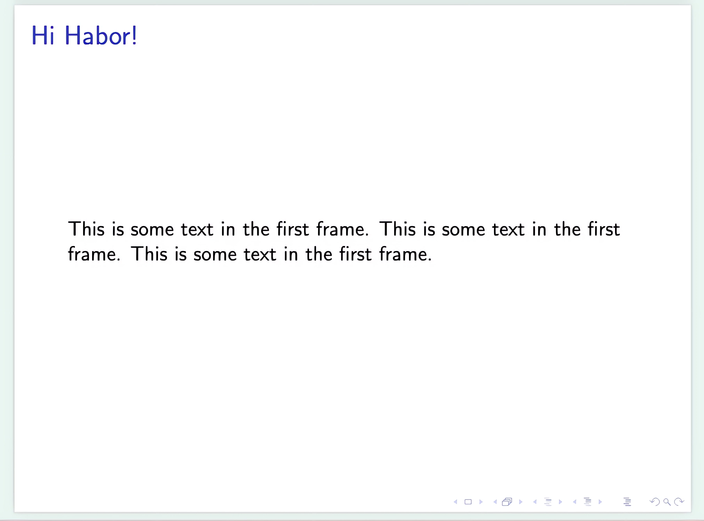

</div>

Beamer is extremely powerful, but also intimidating. For something easier and web-native, there's [RevealJS](https://revealjs.com/):

```markdown
# Heading
## Subheading

Hi there!

---

# Next Heading
Hi again!
```

<WLJSWrapper>
<wljs-editor lazy="true" type="Output" display="slide">{`
# Heading
## Subheading

Hi there!

---

# Next Heading
Hi again!
`}</wljs-editor>
</WLJSWrapper>

Slides are separated by `---`, and the layout is controlled by CSS. Since RevealJS runs in a browser, you can use raw HTML—allowing things like video, audio, PDFs, even entire websites using `iframe`. Want [Mermaid diagrams](https://mermaid.js.org/)? You can embed those too.

But interactivity and reusable components? Not quite built-in.

RevealJS is a framework, not a full system. Even referencing an image locally can become tricky. This is where tools like [Motion Canvas](https://motioncanvas.io/) shine. Based on JSX and React, they treat everything as a component:

```tsx
import {makeScene2D, Txt} from '@motion-canvas/2d';
import {beginSlide, createRef, waitFor} from '@motion-canvas/core';

export default makeScene2D(function* (view) {
  const title = createRef<Txt>();
  view.add(<Txt ref={title} />);

  title().text('FIRST SLIDE');
  yield* beginSlide('first slide');
  yield* waitFor(1);

  title().text('SECOND SLIDE');
  yield* beginSlide('second slide');
  yield* waitFor(1);

  title().text('LAST SLIDE');
  yield* beginSlide('last slide');
  yield* waitFor(1);
});
```

Or MDX:

```jsx
import Tabs from '@theme/Tabs';  
import TabItem from '@theme/TabItem';

## Universal approach

<Tabs>
  <TabItem>Blahblahblah</TabItem>  
  <TabItem>Lahlahlha</TabItem>  
  <TabItem>Gagagagagaga</TabItem>
</Tabs>
```

JSX might feel complex, but it introduces very useful concepts:

- Components as functions
- Custom HTML-like tags

So you can write something like this once:

```jsx
<MakeTitle>Slide Header</MakeTitle>

Here's your content.

<SomeWidget align="center" />
```

Feels like a cross between Beamer and JSX. Now let’s see how to implement it.

---

## Bridging Worlds ⚗️

> As a physicist, it’s easier to demonstrate calculations with sliders—especially during lectures.

JSX/React means adopting frontend tooling (Vite, bundlers, etc.), which may be too much overhead for quick educational material. Plus, JavaScript isn’t ideal for scientific plotting. Python, R, Julia, or even MATLAB often provide a smoother experience.

But as of 2025, **no platform beats Wolfram Mathematica** for producing clean, precise, interactive plots with minimal setup.

```wolfram
ContourPlot[Cos[x] + Cos[y], {x, 0, 4 Pi}, {y, 0, 4 Pi}]
```

<div className="invertColor">

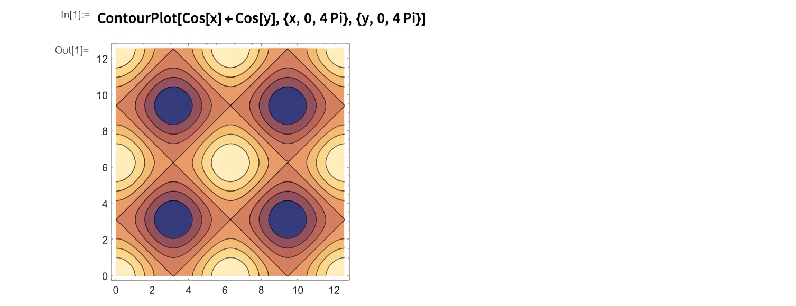

</div>

Want interactivity?

```wolfram
Manipulate[Plot[Sin[a x], {x, 0, 2 Pi}], {a, 1, 10}]
```

Our goal is to make these tools feel **native** inside Markdown + HTML.

```wolfram
Figure = ContourPlot[Cos[x] + Cos[y], {x, 0, 4 Pi}, {y, 0, 4 Pi}];
```

```wolfram
# First Slide

Look at this plot:

<Figure />
```

Want to style it?

```wolfram
<div style="background: gray; border: solid 1px red;">
  <Figure />
</div>
```

Or make it a reusable component. This is where [Wolfram Language XML](./../../frontend/Cell-types/WLX) (WLX) comes in—a syntax extension designed to bring this all together. You don’t need to install anything extra—it’s already integrated in the environment we’ll explore next.

---

## TL;DR – How to Code Presentation Slides 

### Environment: WLJS Notebook

Download binaries [here](https://wljs.io). **You don’t need** the app to view presentations—**a browser is enough**, even offline.

<div className="invertColor">

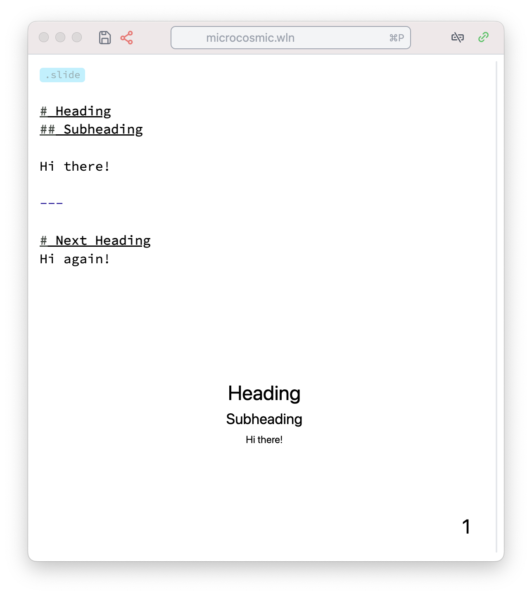

</div>

This is a client-server setup. The client is your browser (or Electron app), and computations happen on the server.

Cells are typed—starting with extensions like `.slide`. If you don’t specify anything, it's treated as standard Wolfram Language.

You can attach images, insert code blocks, define graphics inline, or dynamically. Everything gets evaluated and embedded inside your final slide.

## First Slide with Images and Graphs

Let’s create our first `.slide` cell with an image. Simply drag and drop a picture into the cell:

```markdown
.slide

# Hey There!


```

The image is automatically uploaded to the notebook directory and inserted as a Markdown image reference. Press <kbd>Shift-Enter</kbd> or click the play button to render the slide.

<div className="invertColor">

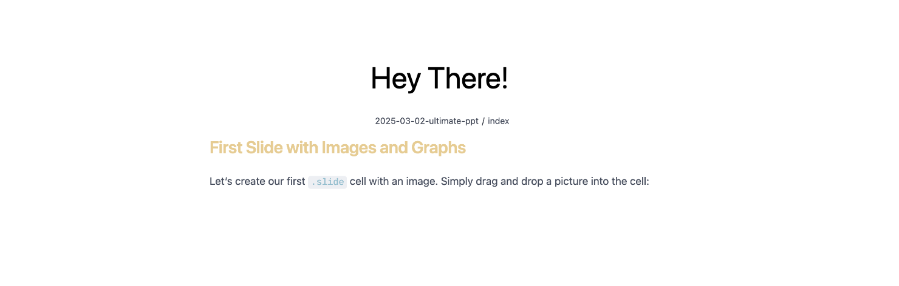

</div>


Now let’s move from 2D to 3D with a custom graph. First, define a helper function:

```wolfram
square[{{imin_, imax_}, {jmin_, jmax_}}] := 
 Table[
  UnitStep[i - imin, imax - i] UnitStep[j - jmin, jmax - j],
  {i, 0, 20}, {j, 0, 20}
]
```

Then create the plot:

```wolfram
OurPlot = ListPlot3D[square[{{2, 5}, {3, 7}}], Mesh -> None];
```

Now insert it into your slide:

```markdown
.slide

# Hey there!

<OurPlot />
```

<div className="invertColor">

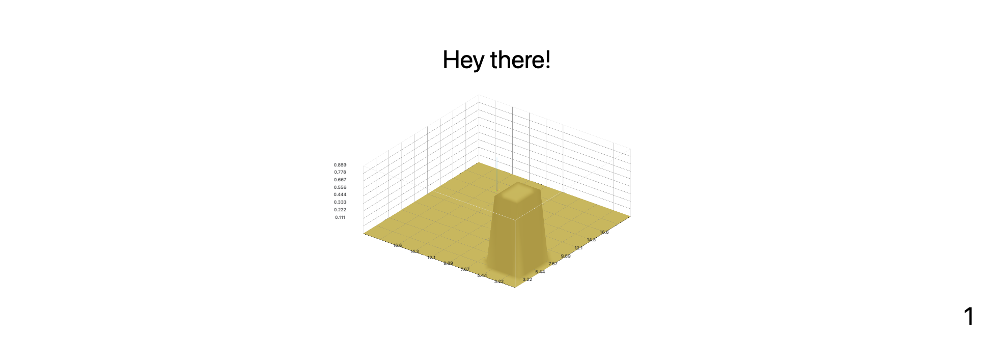

</div>

Yes—you can rotate it live in the browser.

Prefer Plotly? We’ve got you covered. The Plotly interface is available and works identically to the JS version:

```wolfram
OurPlotly = With[{data = square[{{2, 5}, {3, 7}}]},
  Plotly[<|"type" -> "surface", "z" -> data|>]
]
```

<div className="invertColor">


</div>

---

## Important Notes on WLX

- Tags starting with a lowercase letter are interpreted as HTML.
- Tags starting with an uppercase letter are WL symbols.
- All tags must be properly closed.
- Leave a blank line above and below Markdown headers and HTML blocks to avoid parsing issues.

<Cards>

<Card href="./../../frontend/Cell-types/WLX" title="WLX Cells">

A guide on basics of WLX cells

</Card>

</Cards>

## Read more 

<Cards>


<Card
    href="./../../frontend/Advanced/Component-based-markup"
    title="Component-based markup"
  >
    An advanced guide on how to build reusable components for slides and more
  </Card>

</Cards>

---

## Presenting Slides

Want fullscreen mode? Press <kbd>f</kbd> on any slide or choose “Project to a New Window” (<kbd>Ctrl-Shift-Enter</kbd> or <kbd>⌘-Shift-Enter</kbd>) in cell settings.

Want to show all slides in sequence? Just use the `.slides` cell to collect content from all other `.slide` cells:

```markdown
.slides

Thank you for your attention
```

This aggregates slides across the notebook regardless of order or location.

---

## Styling Your Slides

Minimalist slides are often best—just a graphic and a short list. But if you want custom fonts, themes, or logos, use a `.wlx` cell to insert CSS:

```html
.wlx
<style>
  .reveal h1 {
    font-family: consolas;
  }
</style>
```

<div className="invertColor">


</div>

Reusable headers or footers? Easy. Let’s define and use them as components next...


## Reusable Local Components

### Columns Layout

Want to create a two-column layout? Here’s a simple component implementation using WLX:

```jsx
.wlx

Columns[data__, OptionsPattern[]] := With[{
  Style = OptionValue["Style"]
},
  With[{DataList = Table[
    <div>
      <Item />
    </div>,
    {Item, List[data]}
  ]},

  <div class="flex flex-row justify-between" style="{Style}">
    <DataList />
  </div>
  ]
]

Options[Columns] = {"Style" -> ""};
```

Use it on a slide like this:

```markdown
.slide

# Hey There!

<Columns>
  <p>Column 1</p>
  <p>Column 2</p>
</Columns>
```

<div className="invertColor">


</div>

You can safely use Markdown by wrapping content in `<p>` tags and adding blank lines:

```markdown
<Columns>
  <p>
  
# Heading 1

  </p>
  <p>

# Heading 2

  </p>
</Columns>
```

<div className="invertColor">


</div>

Style the component directly:

```markdown
<Columns Style={"
  border-radius: 4px;
  color: #ffffff;
  background: rgb(49 87 170);
  padding: 1rem;
"}>

  <p>Heading 1</p>
  <p>Heading 2</p>
</Columns>
```

<div className="invertColor">


</div>

---

### Row Layout and Grouped Plots

You can also use the built-in `Row` layout. Example: a signal and its Fourier transform side-by-side.

```wolfram
square[{{imin_, imax_}, {jmin_, jmax_}}] := 
 Table[
  UnitStep[i - imin, imax - i] UnitStep[j - jmin, jmax - j],
  {i, 0, 20}, {j, 0, 20}
]

OurPlot = Row[{
  ListPlot3D[square[{{2, 5}, {3, 7}}], Mesh -> None],
  ListPlot3D[Abs@Fourier@square[{{2, 5}, {3, 7}}], Mesh -> None, ColorFunction -> "Rainbow"]
}];
```

```markdown
.slide

# Example

<OurPlot/>
```

<div className="invertColor">


</div>

You can also bind each to a separate variable and use them together:

```wolfram
{Figure1, Figure2} = {
  ListPlot3D[square[{{2, 5}, {3, 7}}], Mesh -> None],
  ListPlot3D[Abs@Fourier@square[{{2, 5}, {3, 7}}], Mesh -> None, ColorFunction -> "Rainbow"]
};
```

```markdown
.slide

# Example

<Row>
  <Figure1 />
  <Figure2 />
</Row>
```

---

### Footers and Headers

You can use the same pattern to define reusable headers and footers—great for academic presentations. Example:

```jsx
.wlx

MakeTitle[Title__String] := MakeTitle[StringJoin[Title]]
MakeTitle[Title_String] := <div class="relative flex w-full text-left flex-row gap-x-4" style="align-items: center; margin-bottom:1.5rem;">
  <div style="bottom:0; z-index:1; position: absolute; background: linear-gradient(to left, red, blue, green); width: 100%; height: 0.7rem;"></div>
  
  <h2><Title /></h2>
</div>

Footer = <div class="w-full ml-auto mr-auto bottom-0 text-sm absolute">
  DFG Retreat Meeting TRR360: <i>C4 Ultrastrong matter-magnon coupling</i>, Kirill Vasin
</div>;
```

Use them like this:

```markdown
.slide

<!-- .slide: style="height:100vh" -->

<MakeTitle>Ultrastrong coupling</MakeTitle>

Content goes here...

<Footer />
```

<div className="invertColor">

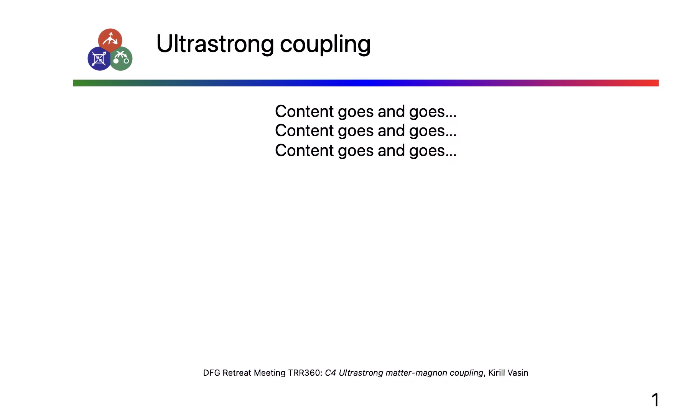

</div>

## Fragments & Animations

RevealJS supports slide fragments, which allow staged reveals of content. This can be used to animate text appearance or any HTML element.

### Basic Example

```markdown
.slide

<!-- .slide: data-background-color="black" -->

# Red <!-- .element: style="color:red" class="fragment" -->

# White <!-- .element: style="color:white" class="fragment" -->
```

<div className="invertColor">


</div>

Each `.fragment` appears step-by-step as the user presses →. You can also control the order using `data-fragment-index`:

```markdown
# Red <!-- .element: style="color:red" data-fragment-index="1" class="fragment" -->

# White <!-- .element: style="color:white" data-fragment-index="1" class="fragment" -->
```


You can apply the same styling to any HTML element.

---

## Math & LaTeX

Wolfram supports LaTeX rendering directly. Just avoid single backslashes unless you escape them (`\\`).

```markdown
.slide

## LaTeX

$$
\\begin{align*}
\\mathbf{E}(t,x) &= \\sum_{\omega} \\mathbf{E}_0^{\omega} ~\\exp\\Big( i\\omega t - \\frac{i\\hat{n}(\\omega) \\omega x}{c}\\Big) \\\\
&= \\sum\\mathbf{E}_0^{\\omega} \\colorbox{white}{$\\exp(-\\frac{\\alpha x}{2})$} ~\\exp\\Big(i\\omega t - \\frac{i n \\omega x}{c}\\Big)
\\end{align*}
$$
```

<div className="invertColor">

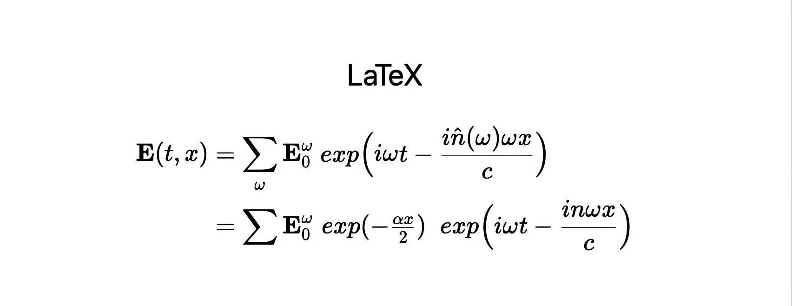

</div>

### Animated Equations

Use the `data-eq-speed` attribute for animated reveal:

```markdown
$$
\\begin{align*}
...your equation here...
\\end{align*}
$$ <!-- .element: data-eq-speed="0.1" -->
```

<div className="invertColor">

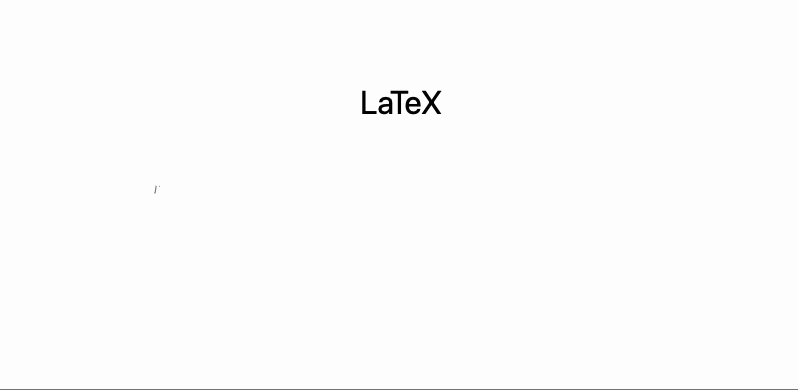

</div>

---

## Diagrams with Mermaid

You can embed [Mermaid](https://mermaid.js.org/) diagrams using `CellView`:

```wolfram
MyDiagram = CellView["
  graph LR
      A[Text Header] --> B[Binary Header]
      B --> C1[Trace 1] --> T1[Samples 1]
      B --> C2[Trace 2] --> T2[Samples 2]
", ImageSize -> 650, "Display" -> "mermaid"];
```

Use it in a slide:

```markdown
.slide

# Embedded Diagram

<MyDiagram />
```

<div className="invertColor">


</div>

---

## More examples

<Cards>
  <Card
    href="./../../frontend/Advanced/Advanced-Slides"
    title="Advanced Slides"
  >
    A guide on how to make dynamic event-based slides, use components and layout helpers
  </Card>
</Cards>

## Excalidraw Integration

[Excalidraw](https://excalidraw.com/) is a vector-based sketching tool that feels like a digital whiteboard. It’s lightweight, fast, and outputs SVG graphics.

To embed a drawing area, just use this simple syntax in a `.slide` cell:

```markdown
.slide

!![]
```

This creates an embedded drawing canvas. Your sketch is saved inside the widget itself, allowing it to be moved or nested inside other tags.

<div className="invertColor">

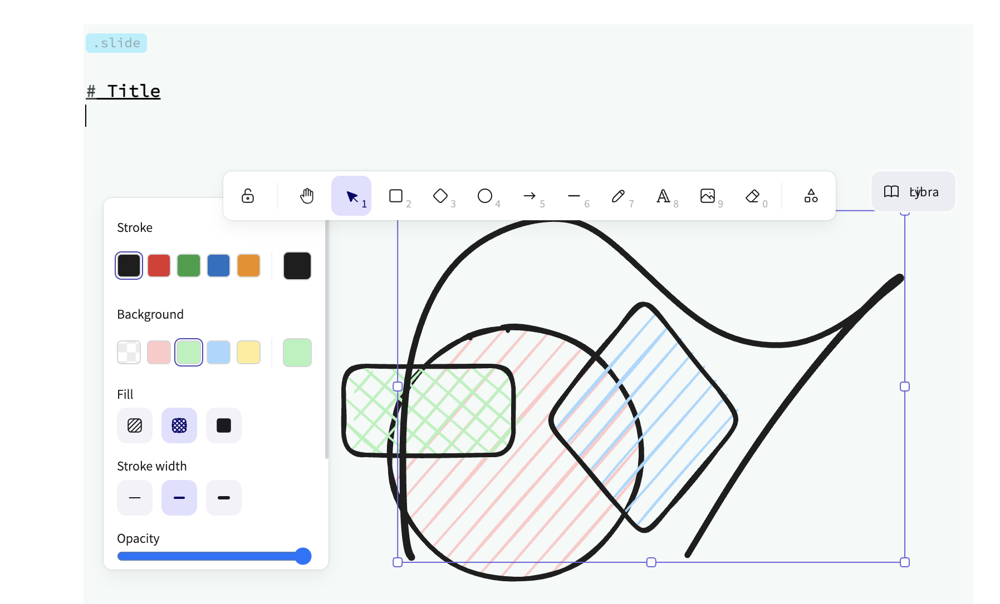

</div>

Support is still evolving, but it works well for basic annotation and ideas.

---

## Dynamic Elements with Slide Events 🧙

Let’s build a simple dynamic counter that reacts to slide transitions.

### Step 1: Static Widget

```jsx
.wlx

Stat[Text_, OptionsPattern[]] := With[{
  Count = OptionValue["Count"]
},

  <div class="text-center text-gray-600 m-4 p-4 rounded bg-gray-100 flex flex-col">
    <Count />
    <span class="text-md"><Text /></span>
  </div>
]

Options[Stat] = {"Count" -> 1};
```

Render it on a slide:

```markdown
.slide

# Basic counter

<Stat Count={11}>Number of publications</Stat>
```

<div className="invertColor">


</div>

### Step 2: Make It Dynamic

Add a module and use `SlideEventListener` to update it in real-time:

```jsx
.wlx

Stat[Text_, OptionsPattern[]] := Module[{
  cnt = 0,
  task
}, With[{
  ev = CreateUUID[],
  HTMLCounter = HTMLView[cnt // Offload],
  max = OptionValue["Count"]
},

  EventHandler[ev, {
    "Destroy" -> Function[Null, EventRemove[ev]; If[task["TaskStatus"] === "Running", TaskRemove[task]]; ClearAll[task];],
    "Left" -> Function[Null, cnt = 0],
    "Slide" -> Function[Null, task = SetInterval[
      If[cnt < max, cnt += 1, TaskRemove[task]], 15]]
  }];

  <div class="text-center text-gray-600 m-4 p-4 rounded bg-gray-100 flex flex-col">
    <HTMLCounter/>
    <span class="text-md"><Text/></span>
    <SlideEventListener Id={ev}/>
  </div>
      
] ]

Options[Stat] = {"Count" -> 1};
```

Now use multiple instances:

```markdown
.slide

# Dynamic Counters

<Row>
  <Stat Count={11}>Citations</Stat>
  <Stat Count={110}>Hours</Stat>
  <Stat Count={1010}>Symbols</Stat>
</Row>
```

<div className="invertColor">


</div>

Each counter is self-contained and responds only when the slide is active.


## Interactive Plots with Manipulate

Remember `Manipulate` in Wolfram Language? In this system, there's a more efficient version called `ManipulatePlot`, which works great for presentations.

Try it first in a regular cell:

```wolfram
Widget = ManipulatePlot[{
  Sin[x t], 
  Sum[((Sin[w x t])/(w)), {w,1,n}] 
} // Re,  {t, 0, 10 Pi}, {x, 0, 2}, {n, 1, 15, 1}]
```

<div className="invertColor">

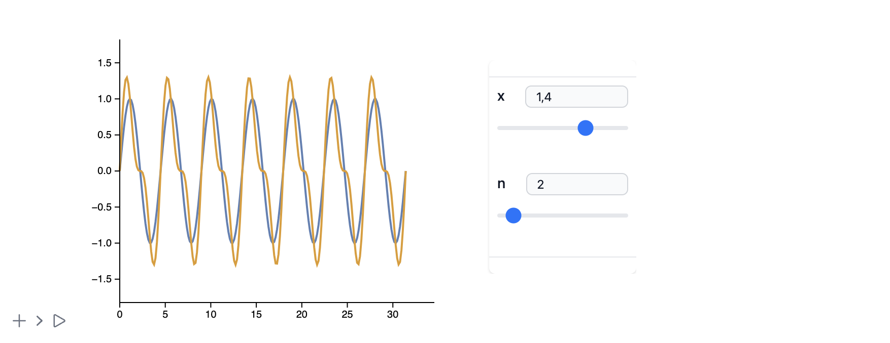

</div>

Now let’s embed it directly into a slide:

```markdown
.slide

# Interactivity

You can drag the sliders!

<Widget />
```

<div className="invertColor">

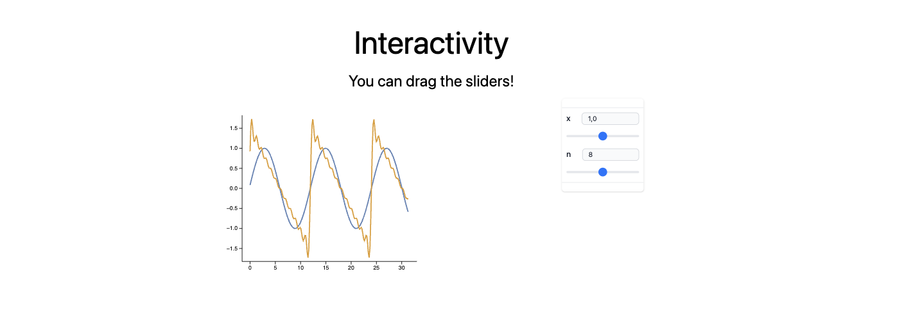

</div>

Each slider input sends a signal back to the WL kernel to re-evaluate the plot in real time. But this doesn’t mean you can’t export it to HTML.

---

## Precomputed Animations with AnimatePlot

Sometimes, full reactivity isn’t necessary. Use `AnimatePlot` for looping, client-side animations.

```wolfram
AnimatePlot[
  Sum[(Sin[2π(2j - 1) x])/(2j), {j, 1.0, n}],
  {x, -1, 1},
  {n, 1, 30, 1}
]
```

<div className="invertColor">

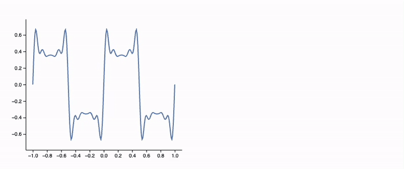

</div>

This approach caches every frame in advance—great for offline use or lighter devices.

---

## Reactive Data: Real-Time Graphics Updates

Let’s simulate data updates using `Offload`, which enables reactive primitives like `Line`, `Disk`, etc.

```wolfram
myData = Table[{x, Sin[x]}, {x, 0, 5 Pi, 0.1}];

Graphics[{
  ColorData[97][1], Line[myData // Offload]
}, Axes -> True, TransitionDuration -> 1000]
```

Update the data elsewhere:

```wolfram
myData = Table[{x, Sinc[x]}, {x, 0, 5 Pi, 0.1}];
```

<div className="invertColor">

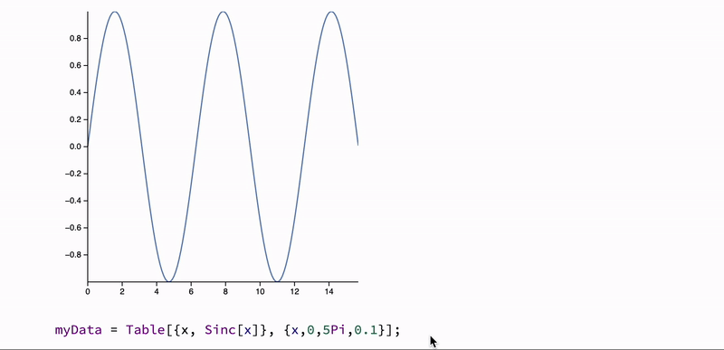

</div>

You can combine this with slide fragments, animations, or event triggers.


## Custom Widgets Reacting to Fragments

Want to go beyond sliders? Let’s create a custom widget that reacts to slide fragments. For example, a reactive chart with a flying disk that moves when a fragment appears.

### Step 1: The Widget Module

```jsx
.wlx

PlotWidget[OptionsPattern[]] := Module[{
  data = OptionValue["DataA"],
  disk = OptionValue["DataA"] // Last
},

  With[{
    Canvas = Graphics[{
      ColorData[97][1], Line[data // Offload],
      ColorData[97][3], Disk[disk // Offload, {0.4,0.05}]
    }, Axes -> True, ImageSize -> 500, PlotRange -> {{-0.2, 1.1 5 Pi}, 1.1 {-1, 1}},
       TransitionDuration -> 500],
    uid = CreateUUID[],
    dataA = OptionValue["DataA"],
    dataB = OptionValue["DataB"]
  },
    EventHandler[uid, {
      "fragment-1" -> Function[Null,
        data = dataB;
        disk = dataB // Last;
      ],
      ("Left" | "Destroy" | "Slide") -> Function[Null,
        data = dataA;
        disk = dataB // First;
      ]
    }];

    <div class="flex flex-col gap-y-2">
      <Canvas />
      <div class="fragment">Dummy text</div>
      <SlideEventListener Id={uid} />
    </div>
  ]
]

Options[PlotWidget] = {"DataA" -> {}, "DataB" -> {}};
```

### Step 2: Generate the Data

```wolfram
{dataA, dataB} = {
  Table[{x, Sin[x]}, {x, 0, 5 Pi, 0.1}],
  Table[{x, Tan[x]}, {x, 0, 5 Pi, 0.1}]
};
```

### Step 3: Use in a Slide

```markdown
.slide

# Interactivity

<PlotWidget DataA={dataA} DataB={dataB} />

---

# Second slide
```

<div className="invertColor">

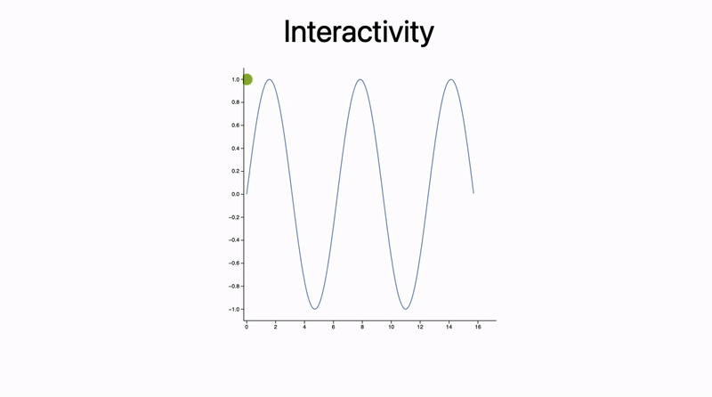

</div>

---

## Confetti with External JS

### Step 1: Load the Library

```html
.wlx
<script src="https://cdn.jsdelivr.net/npm/party-js@latest/bundle/party.min.js"></script>
```

### Step 2: Define a JS Function to Trigger It

```js
.js
core.RunFireworks = async (args, env) => {
  const id = await interpretate(args[0], env);
  party.confetti(document.getElementById(id).parentNode, {
    count: party.variation.range(20, 40),
    size: party.variation.range(0.8, 2.2),
  });
}
```

### Step 3: Trigger from Slide Event

```jsx
.wlx

Party := Module[{
  UId = CreateUUID[],
  Ev = CreateUUID[]
},

EventHandler[Ev, {
  "Slide" -> Function[Null,
      FrontSubmit[RunFireworks[UId]]
  ]
}];

<div id="{UId}">
  <SlideEventListener Id={Ev}/>
</div>

]
```

### Step 4: Use It

```markdown
.slide

# Let's have

---

# A Party!

<Party />
```

<div className="invertColor">


</div>

---


## Published Examples 

These presentations were all exported using the techniques above:

<Cards>

    <DownloadFile 
    title="Example with `Manipulate`"
    href="./ppt_manipulate.html"
  />
    <DownloadFile 
    title="2-slide animation demo"
    href="./ppt_2slide.html"
  />

  <DownloadFile 
    title="THz report on Fe₂Mo₃O₈ in a magnetic field"
    href="./ppt_report.html"
  />  
</Cards>


---

## Conclusion

This approach blends code and content into a single framework. At a glance:

- Simpler than PowerPoint for tech-heavy talks
- Fully reproducible (every visual has traceable code)
- Supports dynamic or static export to a [single HTML file](./../../frontend/Share/Standalone-HTML) or PDF

Markdown becomes your structure, Wolfram Language your engine (sometimes with a help of Javascript). With a little setup, you can focus on content — not formatting.

And yes, interactivity makes learning and presenting way more engaging. Your students and colleagues will thank you ☺️

---

## Links

- [RevealJS](https://revealjs.com/) – Markdown presentations (core engine)
- [Excalidraw](https://excalidraw.com/) – drawing board (SVG tool)
- [WLJS Notebook Docs](https://wljs.io/)
- [Wolfram Engine](https://www.wolfram.com/engine/)

---

Happy sliding ✨

## Bonus
Source code for the preview image:

```wolfram
With[{a = 30, b = 30}, {
  {
    {
      Graphics3D`Materials["Glass"], 
      Directive[
        "MaterialThickness" -> 0, 
        "Transmission" -> 0.8, 
        "Roughness" -> 0.5
      ], 
      Orange, 
      GeometricTransformation[
        Cuboid[{-1.1 a, -1.1 a, -b 0.03}, {1.1 a, 1.1 a, b 0.03}], 
        RotationMatrix[-45 Degree, {0, 1, 0}]
      ]
    },
    {
      Graphics3D`Materials["Iridescent"], 
      Pink, 
      With[{i = Interpolation[
        {
          {0, {-a, -a, b}}, 
          {0.25, {-a, a, b}}, 
          {0.5, {a, a, -b}}, 
          {0.75, {a, -a, -b}}, 
          {1.0, {-a, -a, b}}
        }, InterpolationOrder -> 1
      ]},
      Tube[Join[Table[i[j], {j, 0, 1, 0.01}], {}]]
      ]
    }
  },
  Red, 
  Directive["Emissive" -> Red], 
  Translate[
    GeometricTransformation[
      PolyhedronData["RhombicHexecontahedron", "Faces"] // N, 
      IdentityMatrix[3] * 8
    ], 
    {40, 0, 0}
  ]
}];

Graphics3D[%, 
  ViewProjection -> "Perspective", 
  "Renderer" -> "PathTracing", 
  ImageSize -> 600
]
```