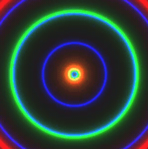

The key to achieving real-time performance lies in using compiled code for the heavy computation and efficient buffer updates for rendering:


```wolfram
gen = Compile[{{time, _Real}, {f1, _Real}, {f2, _Real}, {f3, _Real}},
Table[With[{fpos = {i,j}},
  With[{result = Module[{
      d0 = Norm[fpos], 
      d1 = 1.0, 
      d2 = 1.0, 
      d3 = 1.0
    },
    
    d1 = Sin[d0 f1 + time]/6.;
    d2 = Sin[d0 f2 + time]/6.;
    d3 = Sin[d0 f3 + time]/6.;
    
    d1 = Abs[d1];
    d2 = Abs[d2];
    d3 = Abs[d3];
    
    d1 = 0.02 / (d1 + 0.01);
    d2 = 0.02 / (d2 + 0.01);
    d3 = 0.02 / (d3 + 0.01);
    
    {d1, d2, d3, 1.0} 255.0
  ]},
    result
  ]
], {i, -0.5, 0.5, 1.0/250.0}, {j, -0.5, 0.5, 1.0/250.0}]
, CompilationTarget->"C", RuntimeOptions->"Speed"];

a = .0;

render = Function[Null,
  a = a + 0.1;
  buffer = NumericArray[gen[a, 5.0, 8.0, 16.0], "Byte", "ClipAndRound"];
];

render[];

Image[
  buffer // Offload, "Byte", 
  Epilog->EventHandler[AnimationFrameListener[buffer//Offload], render]
]
```




The `render` function updates the animation by incrementing time and generating new frames as `NumericArray` buffers. You can use normal arrays as well, but the `NumericArray` wrapper guarantees that the data will be packed more efficiently. 
