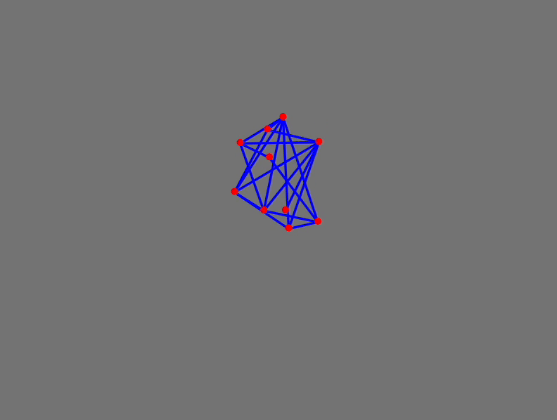
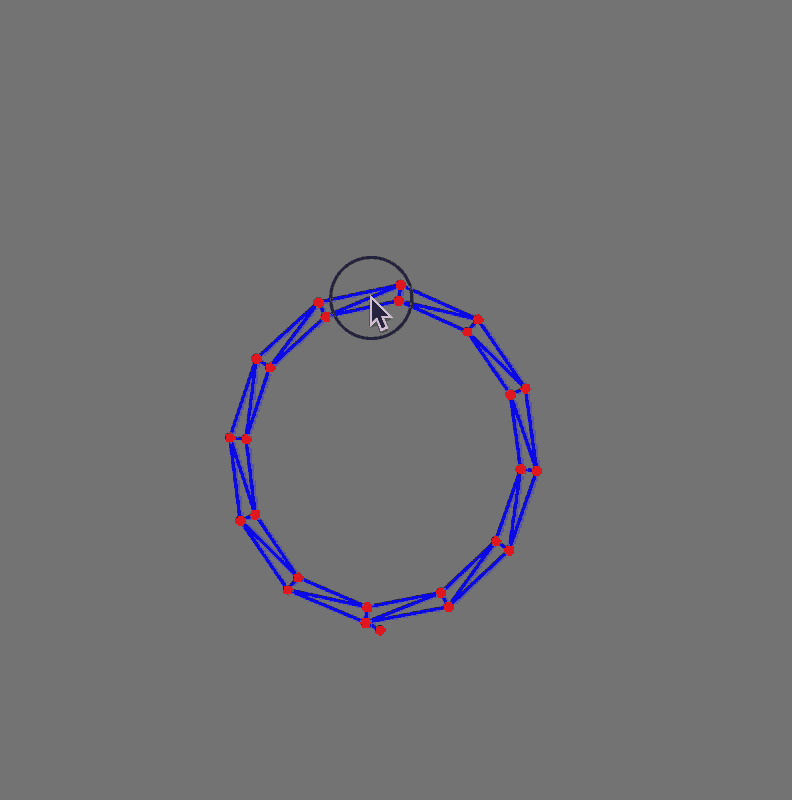
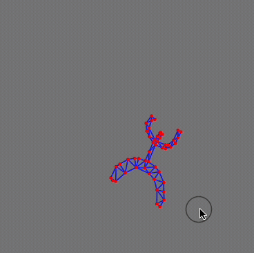

{/* add this script to the body  */}
{/* https://cdn.jsdelivr.net/gh/WLJSTeam/web-components@latest/src/common/app.js */}
<wljs-store json="./attachments/c3b70aa8-f837-4944-9561-992bbee22fea.txt"></wljs-store>

  <DownloadFile 
    title="Download Notebook"
    description="Get the complete code"
    href="./attachments/notebook-c3b.wln"
  />

## Set of Points
Define a set of random points.

<WLJSWrapper><wljs-editor lazy="true" display="codemirror" type="Input" editable="true"  >{`pts0 = RandomReal[{-1,1}, {10, 2}];
	pts1 = pts0; pts2 = pts0;
	
	Graphics[{Rectangle[{-10,-10}, {10,10}], Red, Point[pts0 // Offload]}, "Controls"->False]`}</wljs-editor></WLJSWrapper>

<WLJSWrapper><wljs-editor lazy="true" display="codemirror" type="Output"  >{`(*VB[*)(Graphics[{Rectangle[{-10, -10}, {10, 10}], RGBColor[1, 0, 0], Point[Offload[pts0]]}, "Controls" -> False])(*,*)(*"1:eJxdjlsKAjEMResLH7twB67BAccPQakrqDOtBkIzNHXr/ta0pQj+HHLzuLn7B2k3U0rxUnAmHN08q42gD2Z6wcBu0eYX4FjnW4G2QzT+iba22gJ8UkoFf/2dFAXVML/Q/bEjpAA5AqiGmmgluBH4WOVacHUOyYzFc4p8+H3Qb7T3bNmRj4GQy/nJINsvH7wzTQ=="*)(*]VB*)`}</wljs-editor></WLJSWrapper>

The **Størmer–Verlet method** is a variant of the discretization of Newton's equations of motion:

$$
x_{i+1} = 2x_i - x_{i-1} + a_i\, \delta t^2
$$

This method only requires storing the current position $x_{i+1}$ and the two previous positions $x_i$ and $x_{i-1}$; velocity is not needed. Try running this cell below.

<WLJSWrapper><wljs-editor lazy="true" display="codemirror" type="Input" editable="true"  >{`With[{\\[Delta]t = 0.5},
	  pts0  = 2 pts1 - pts2 + Table[{0,-1}, {Length[pts0]}] (*SpB[*)Power[\\[Delta]t(*|*),(*|*)2](*]SpB*);
	  pts2 = pts1;
	  pts1 = pts0;
	]`}</wljs-editor></WLJSWrapper>

We can add random connections to our points (forming bonds) using graphs.

<WLJSWrapper><wljs-editor lazy="true" display="codemirror" type="Input" editable="true"  >{`bonds = RandomGraph[Length[pts0]{1, 2}, VertexCoordinates->pts0]`}</wljs-editor></WLJSWrapper>

<WLJSWrapper><wljs-editor lazy="true" display="codemirror" type="Output"  >{`(*VB[*)(Graph[{1, 2, 3, 4, 5, 6, 7, 8, 9, 10}, {Null, SparseArray[Automatic, {10, 10}, 0, {1, {{0, 4, 7, 12, 15, 20, 26, 29, 32, 37, 40}, {{3}, {6}, {8}, {9}, {5}, {7}, {8}, {1}, {5}, {6}, {7}, {9}, {6}, {8}, {10}, {2}, {3}, {6}, {7}, {9}, {1}, {3}, {4}, {5}, {9}, {10}, {2}, {3}, {5}, {1}, {2}, {4}, {1}, {3}, {5}, {6}, {10}, {4}, {6}, {9}}}, Pattern}]}, {VertexCoordinates -> {{0.2126626578645796, 0.8506301137777257}, {-0.9802254366176415, 0.8833724976923256}, {0.6106164552801325, 0.0058377193055974}, {-0.9040792039957166, -0.11731512343905948}, {0.5872746970312108, 0.3000207391905336}, {0.006153278514754668, -0.5609492226769}, {0.8725662176217783, -0.03600001519931384}, {-0.9511118497129036, -0.6592978283275275}, {-0.932124311790465, 0.5010962453657455}, {-0.12320119811984487, 0.20360719642477454}}}])(*,*)(*"1:eJxTTMoPSmNkYGAoZgESHvk5KWlMIB4HkHAvSizIyEwuhojwI4k45+cW5KRWpIIkuIAYRCe89V3TbnHaniHx65IYi9f2L2Lk9zDGvd+/5nhF2jSXN/ZXqq1atbse2zOoMd/welluH/HjSJP5uzf7GSzrtWI59u036TPw+3LqkX1AzR79LuPL9gxr9snrmVTaKyw9fML788P9GV85/vK/eW3v0HKff0beov0CMdpyTfnv9s/ZFH/ou8TT/TpecbHfLr/dz3PR/t8vjgf2DlsOyMh27d+/4cv7L2f4T9lDfAHypU9mcUkaMyaPE0i4ZBalJpdklqVCAoUdSPgXJCZnllQWpYHBM3uIYhDhUZpaZAwGj+3h0gh1cBOcEwvc8otyg1mB7KD80rwUiBQo5ByLivLLM1ITU4qLGKAAER1gp4GdzQpTmiaCKQnjeYI0GoJJY5wyZjhlLHDKWGKRMQKTpjhlzHHKYLPHGKdpxjhdbYzTHmOcrjbBaZoJTreZeILEDA2wSJniNM4Up+NMcTrODI8MTidYQqWKOD5e25f4eqp9GjdmCkFN2djTLyTxPYAxPkDTL6ggcE1JTwUlYGyGMcKEgGVDpU9qWWpOJiIRY80+cD+4ZBZnZ4LUIdyOKseER44ZjxwLHjlWPHJseOTY8chx4JHjxCPHhSLHihlvIF5QaU4quKgAxUBiSUhlQSq4LA4pSkzJLMnMz0vMQcQNqoaixNzUkMzk7GKwuF9+XiqaKh4gwzM3MT01IDElJTMvHZc6Tpi64Myq1MwToPhFURAMCgHn/LySovycYnBh5ZaYU5wKAMwig+U="*)(*]VB*)`}</wljs-editor></WLJSWrapper>

<wljs-html encoded="true">{`%3Cdetails%20%3E%0AThe%20%2A%2ASt%C3%B8rmer%E2%80%93Verlet%20method%2A%2A%20really%20shines%20when%20it%20comes%20to%20solving%20equations%20with%20constraints.%20In%20our%20case%2C%20we%20want%20to%20keep%20the%20distances%20between%20points%20fixed%20according%20to%20a%20connection%20graph.%20Normally%2C%20this%20would%20involve%20approximating%20motion%20using%20a%20combination%20of%20acceleration%2C%20velocity%2C%20and%20position.%0A%0AHowever%2C%20things%20can%20become%20complicated%20quickly.%20With%20the%20St%C3%B8rmer%E2%80%93Verlet%20method%2C%20we%20only%20work%20with%20positions%20%5C%28%20x_i%20%5C%29.%20By%20directly%20adjusting%20the%20positions%20of%20two%20points%20connected%20by%20a%20bond%20to%20maintain%20the%20bond%20length%2C%20we%20effectively%20account%20for%20all%20forces%20in%20a%20single%20step.%0A%3C%2Fdetails%3E`}</wljs-html>

The stiffness of the bond is not directly in the differential equation. It’s introduced through how you enforce the constraint — either strictly (hard) or partially (soft). Let's define the initial length $L=|\mathbf{d}|$

$$
\mathbf{d} := \mathbf{x}_a - \mathbf{x}_b
$$

To enforce the bond, we compute the correction vector

$$
\Delta \mathbf{d} :=  \mathbf{d} \cdot k \Big( \frac{L}{|\mathbf{d}| } - 1 \Big)
$$

and then apply it to each point

$$
\begin{align*}
\mathbf{x}_a &= \mathbf{x}_a +  \frac{1}{2} \Delta \mathbf{d} \\
\mathbf{x}_b &= \mathbf{x}_b - \frac{1}{2} \Delta \mathbf{d} \\
\end{align*}
$$

where $k$ is a stiffness parameter. There are two cases:

- $k=1$ hard bond
- $k < 1$ soft bond (kinda bouncy like a spring)

Let's try to implement this in pure functions.

<WLJSWrapper><wljs-editor lazy="true" display="codemirror" type="Input" editable="true"  >{`getDir[bonds_, pts_] := Map[(pts[[#[[1]]]] - pts[[#[[2]]]]) &, bonds] 
	
	applyBond[pairs_, k_:1.0, maxDelta_:0.1][p_] := Module[{pts = p},
	  MapThread[Function[{edge, length}, With[{
	    diff = pts[[edge[[1]]]] - pts[[edge[[2]]]]
	  },
	    With[{
	      delta =Min[k ( (*FB[*)((length)(*,*)/(*,*)(Norm[diff]+0.001))(*]FB*) - 1), maxDelta] diff
	    },
	      pts[[edge[[1]]]] += delta/2.0;
	      pts[[edge[[2]]]] -= delta/2.0;
	    ]
	  ] ], RandomSample[pairs]//Transpose];
	
	  pts
	] `}</wljs-editor></WLJSWrapper>

Here is a helper function to draw bonds, keeping them coupled to a dynamic symbol so that we can see how they change in real time.

<WLJSWrapper><wljs-editor lazy="true" display="codemirror" type="Input" editable="true"  >{`showGeometry[points_, bonds_, opts___] := Graphics[{
	  Gray, Rectangle[5{-1,-1}, 5{1,1}], Blue,
	  
	  Table[
	    With[{i = edge[[1]], j = edge[[2]]},
	      Line[With[{
	        p = points
	      }, {p[[i]], p[[j]]}]] // Offload
	    ]
	  , {edge, bonds}],
	  
	  Red, Point[points // Offload]
	}, opts]
	
	SetAttributes[showGeometry, HoldFirst];`}</wljs-editor></WLJSWrapper>

Show it using our randomly generated points

<WLJSWrapper><wljs-editor lazy="true" display="codemirror" type="Input" editable="true"  >{`showGeometry[pts0, EdgeList @ bonds]`}</wljs-editor></WLJSWrapper>

<WLJSWrapper><wljs-editor lazy="true" display="codemirror" type="Output"  >{`(*VB[*)(FrontEndRef["545975a9-aa04-4e6b-84fd-bfb205f610d7"])(*,*)(*"1:eJxTTMoPSmNkYGAoZgESHvk5KRCeEJBwK8rPK3HNS3GtSE0uLUlMykkNVgEKm5qYWpqbJlrqJiYamOiapJol6VqYpKXoJqUlGRmYppkZGqSYAwCAUxWm"*)(*]VB*)`}</wljs-editor></WLJSWrapper>

We are almost set for our animation! Let's regenerate random points and connections each time we evaluate the next cell and run the main update loop, which consists of Verlet methods combined with hard constraints

<WLJSWrapper><wljs-editor lazy="true" display="codemirror" type="Input" editable="true"  >{`pts0 = RandomReal[{-1,1}, {10, 2}];
	pts1 = pts0; pts2 = pts0;
	
	bonds = EdgeList[RandomGraph[Length[pts0]{1, 3}]];
	lengths = Norm /@ getDir[bonds, pts0];
	pairs = {bonds, lengths} // Transpose;
	
	Do[With[{\\[Delta]t = 0.05},
	  pts0 = Clip[applyBond[pairs, 1.0][
	    2 pts1 - pts2 + Table[{0,-1}, {i, Length[pts0]}] (*SpB[*)Power[\\[Delta]t(*|*),(*|*)2](*]SpB*)
	  ], {-5,5}];
	  
	  pts2 = pts1;
	  pts1 = pts0;
	  
	  Pause[0.03];
	  
	], {i, 200}]`}</wljs-editor></WLJSWrapper>

## Procedurally Generated Structures
Even without any optimizations of the present code (normally you would need to use vectorization tricks or `Compile` or switch to `OpenCLLink`), we can still try to model something more complex than a random graph of 10 points and add interaction with a user's mouse.

### Rim
Here is a quick way of making this using just tables.

<WLJSWrapper><wljs-editor lazy="true" display="codemirror" type="Input" editable="true"  >{`rim = Join @@
	  (Table[#{Sin[x], Cos[x]}, {x,-Pi, Pi, Pi/6}] &/@ {1, 0.9} // Transpose);
	  
	rbonds = Graph[
	  Join[
	    Table[i<->i+1, {i, 1, Length[rim]-1}],
	    Table[i<->i+2, {i, 1, Length[rim]-2, 2 }],
	    Table[i<->i+2, {i, 2, Length[rim]-4, 2 }],
	    {Length[rim]-2 <-> 2},
	    {Length[rim]-1 <-> 1}
	  ]
	, VertexCoordinates->rim]
	
	rbonds = EdgeList[rbonds];
	rpairs = {rbonds, Norm /@ getDir[rbonds, 2.0 rim]} // Transpose;`}</wljs-editor></WLJSWrapper>

<WLJSWrapper><wljs-editor lazy="true" display="codemirror" type="Output"  >{`(*VB[*)(CoffeeLiqueur\`Extensions\`Boxes\`Workarounds\`temporal$1937052)(*,*)(*"1:eJxTTMoPSmNkYGAoZgESHvk5KRCeEJBwK8rPK3HNS3GtSE0uLUlMykkNVgEKm6RamlgkmhvrGiclp+maGJon6yalpZromqelWBqkpqSlpVmaAQCMShZ+"*)(*]VB*)`}</wljs-editor></WLJSWrapper>

Prepare variables for storing positions.

<WLJSWrapper><wljs-editor lazy="true" display="codemirror" type="Input" editable="true"  >{`rim0 = 2.0 rim; rim1 = rim0; rim2 = rim0;
	rimR = rim0;
	
	mousePos   = {100.,0.};`}</wljs-editor></WLJSWrapper>

Here we will automate our update cycle by attaching an animation frame listener to the `rimR` symbol. It will trigger an event to prepare the next frame of animation within the update cycle of your screen (actually - the app window). Each time, the timer is reset by an update of the `rimR` symbol, ensuring that the next frame will only come after the previous one has been finished.

<WLJSWrapper><wljs-editor lazy="true" display="codemirror" type="Input" editable="true"  >{`EventHandler[
	  showGeometry[rimR, rbonds, TransitionType->None, "Controls"->False, Epilog->{
	    AnimationFrameListener[rimR // Offload, "Event"->"anim"], 
	    Circle[mousePos // Offload, 0.5]
	  }, PlotRange->{{-5,5}, {-5,5}}]
	, {"mousemove" -> Function[xy,
	    mousePos = xy;
	]}]`}</wljs-editor></WLJSWrapper>

Animation controls.

<WLJSWrapper><wljs-editor lazy="true" display="codemirror" type="Input" editable="true" fade="true" >{`Button["Start", 
	 EventHandler["anim", With[{}, Do[With[{\\[Delta]t = 0.006}, 
	  rim0 = applyBond[rpairs, 1.0, 0.8][
	    Clip[(2 rim1 - rim2) + Table[
	       If[Max[Abs[i - mousePos]] < 2.0, {0,-1} - 7.0 (i - mousePos), {0,-1}]
	    , {i, rim0}] (*SpB[*)Power[\\[Delta]t(*|*),(*|*)2](*]SpB*), {-5,5}]
	  ];
	
	  
	  rim2 = rim1;
	  rim1 = rim0;
	  
	 ], {i, 10}];
	  rimR = rim0;
	
	 ]&]; 
	 rimR = rim0;
	]
	
	Button["Stop", EventRemove["anim"]]
	
	Button["Reset", With[{}, rim0 = 2.0 rim; rim1 = rim0; rim2 = rim0;
	rimR = rim0;]]`}</wljs-editor></WLJSWrapper>

## Generate a Mesh from an Image
The more challenging, the more fun! It would be great to sketch a bitmap image using a brush and transform it into a mesh that can be modeled.

<WLJSWrapper><wljs-editor lazy="true" display="codemirror" type="Input" editable="true"  >{`mask = NotebookRead[NotebookStore["carnivorous-284"]];
	EventHandler[InputRaster[mask], (mask = #)&]`}</wljs-editor></WLJSWrapper>

<WLJSWrapper><wljs-editor lazy="true" display="codemirror" type="Output"  >{`(*VB[*)(EventObject[<|"Id" -> "3739131e-90d3-4cf3-9216-fd102cc87a94", "View" -> "80599663-0321-47e3-942c-f8dac95d57e1"|>])(*,*)(*"1:eJxTTMoPSmNkYGAoZgESHvk5KRCeEJBwK8rPK3HNS3GtSE0uLUlMykkNVgEKWxiYWlqamRnrGhgbGeqamKca61qaGCXrplmkJCZbmqaYmqcaAgBr0xT2"*)(*]VB*)`}</wljs-editor></WLJSWrapper>

Now convert this image to a mesh, triangulate it, and render it as an index graph. Using a `Graph` object is a bit easier than working with a triangulated mesh, since all bonds are sorted and can easily be extracted.

<WLJSWrapper><wljs-editor lazy="true" display="codemirror" type="Input" editable="true"  >{`mesh = TriangulateMesh[
	  ImageMesh[ImageResize[mask , 100]// ColorNegate]
	, MaxCellMeasure->{"Area"->100}];
	
	graph = MeshConnectivityGraph[mesh, 0] // IndexGraph
	vertices = graph // GraphEmbedding;
	edges = (List @@ #) &/@ (graph // EdgeList) (*BB[*)(*convert to list of lists*)(*,*)(*"1:eJxTTMoPSmNhYGAo5gcSAUX5ZZkpqSn+BSWZ+XnFaYwgCS4g4Zyfm5uaV+KUXxEMUqxsbm6exgSSBPGCSnNSg9mAjOCSosy8dLBYSFFpKpoKkDkeqYkpEFXBILO1sCgJSczMQVYCAOFrJEU="*)(*]BB*);
	
	vertices = Map[Function[x, x - {0.4,-1.2}], 0.04 vertices] (*BB[*)(*scale and translate*)(*,*)(*"1:eJxTTMoPSmNhYGAo5gcSAUX5ZZkpqSn+BSWZ+XnFaYwgCS4g4Zyfm5uaV+KUXxEMUqxsbm6exgSSBPGCSnNSg9mAjOCSosy8dLBYSFFpKpoKkDkeqYkpEFXBILO1sCgJSczMQVYCAOFrJEU="*)(*]BB*);`}</wljs-editor></WLJSWrapper>

<WLJSWrapper><wljs-editor lazy="true" display="codemirror" type="Output"  >{`(*VB[*)(CoffeeLiqueur\`Extensions\`Boxes\`Workarounds\`temporal$824230)(*,*)(*"1:eJxTTMoPSmNkYGAoZgESHvk5KRCeEJBwK8rPK3HNS3GtSE0uLUlMykkNVgEKJ6ampBlbpFnompknmuqaGBsa6VqaJVvqmpuaGyWnGFokGacYAQCH7xWE"*)(*]VB*)`}</wljs-editor></WLJSWrapper>

Animation cycle (*as before*).

<WLJSWrapper><wljs-editor lazy="true" display="codemirror" type="Input" editable="true"  >{`vertices0 =  vertices; vertices1 = vertices0; vertices2 = vertices0;
	verticesR = vertices0;
	
	vpairs = {edges, Norm /@ getDir[edges, vertices0]} // Transpose;
	
	mousePos   = {100.,0.};`}</wljs-editor></WLJSWrapper>

<WLJSWrapper><wljs-editor lazy="true" display="codemirror" type="Input" editable="true"  >{`EventHandler[
	  showGeometry[verticesR, edges, TransitionType->None, "Controls"->False, Epilog->{
	    AnimationFrameListener[verticesR // Offload, "Event"->"anim2"], 
	    Circle[mousePos // Offload, 0.5]
	  }, PlotRange->{{-5,5}, {-5,5}}]
	, {"mousemove" -> Function[xy,
	    mousePos = xy;
	]}]`}</wljs-editor></WLJSWrapper>

Animation controls:

<WLJSWrapper><wljs-editor lazy="true" display="codemirror" type="Input" editable="true" fade="true" >{`Button["Start", 
	 EventHandler["anim2", With[{}, Do[With[{\\[Delta]t = 0.003}, 
	  vertices0 = applyBond[vpairs, 1.0, 0.8][
	    Clip[(2 vertices1 - vertices2) + Table[
	       If[Max[Abs[i - mousePos]] < 2.0, {0,-1} - 7.0 (i - mousePos), {0,-1}]
	    , {i, vertices0}] (*SpB[*)Power[\\[Delta]t(*|*),(*|*)2](*]SpB*), {-5,5}]
	  ];
	
	  
	  vertices2 = vertices1;
	  vertices1 = vertices0;
	  
	 ], {i, 3}];
	  verticesR = vertices0;
	
	 ]&]; 
	 verticesR = vertices0;
	]
	
	Button["Stop", EventRemove["anim2"]]
	
	Button["Reset", With[{}, vertices0 =  vertices; vertices1 = vertices0; vertices2 = vertices0;
	verticesR = vertices0;]]`}</wljs-editor></WLJSWrapper>

The performance can definetly be improved using `Compile` function.