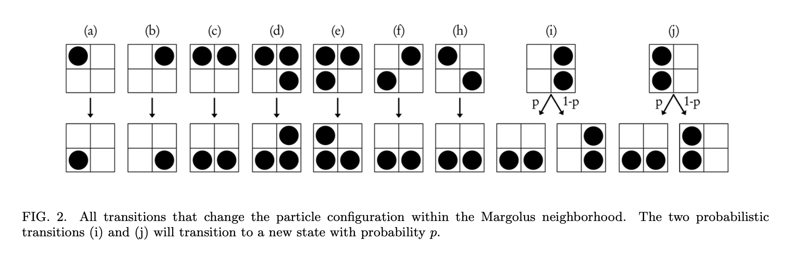

{/* add this script to the body  */}
{/* https://cdn.jsdelivr.net/gh/WLJSTeam/web-components@latest/src/common/app.js */}
<wljs-store json="./attachments/09a035ea-7f18-432b-a64e-c971ec82a320.txt"></wljs-store>

It is not going to be a physically accurate solver or something. Just a visual model can be done with a few simple invariants: 
1. cells live on a square lattice, 
2. cells are never created or destroyed by the update rules, 
3. all motion is expressed as swaps or rearrangements inside non-overlapping 2x2 blocks.

After sand is working, water can be added as another cell type with stronger sideways spreading compared to sand. The implementation follows the idea in Jonathan Devlin and Micah D. Schuster's *Probabilistic Cellular Automata for Granular Media in Video Games* ([arXiv:2008.06341](https://arxiv.org/abs/2008.06341)). Their model uses a square lattice, a custom modified Margolus neighborhood, and probabilistic transitions tuned for sand-like friction. In this notebook we keep the same spirit and add a second material, water.

A useful way to classify the update scheme is as a [block cellular automaton](https://en.wikipedia.org/wiki/Block_cellular_automaton): instead of updating each cell from a fixed neighborhood, the grid is partitioned into non-overlapping blocks and a transition rule is applied to each whole block. The common two-dimensional case is the [Margolus neighborhood](https://en.wikipedia.org/wiki/Block_cellular_automaton#Neighborhoods), where 2x2 partitions alternate by one cell on consecutive steps.

## Rules and Algorithm

Each cell stores one integer state:

- `0`: empty space
- `1`: sand
- `2`: wall
- `3`: water

For sand alone, the local rule can be read as a tiny gravity model: sand falls into empty space, piles up on walls or other sand, and probabilistically tumbles when a 2x2 block contains an unstable arrangement:

The randomness is important; without it, piles tend to look too regular and grid-aligned. Inside each 2x2 block we only swap or rearrange existing states; this is why the number of sand and water cells is conserved except when the user draws or erases material.

Unlike deterministic automata such as Conway's Game of Life, these rules are probabilistic. A fall can be forced, while sideways spreading or toppling can happen with a chosen probability `p`. That small amount of randomness gives the pile a less grid-locked look and plays a role similar to the probabilistic rule selection in [MarkovJunior blog post](https://wljs.io/blog/markov).

It is common for the performance reasons to work on non-overlapping 2x2 blocks, which can be easily parallelized using a thread-safe pull pattern. However, in such case grains could only interact with the same immediate partners forever. The one-cell offset on the second pass lets neighboring blocks exchange sand, so avalanches and settling can propagate through the whole field while every local update remains small and cheap. That's what it called [Margolus-neighborhood](https://cell-auto.com/neighbourhood/margolus/#:~:text=One%20of%20the%20simplest%20partitioning,rule%20is%20applied%20completely%20locally.) or Margolus method.

The same sand pile is shown below under the two Margolus phases. Orange cells are sand, gray cells are walls, and the colored outlines show the 2x2 blocks that are updated together. The phase shift matters because a grain that is blocked in one partition may be able to fall or topple in the next one:

<WLJSWrapper><wljs-editor display="codemirror" type="Input" editable="true" fade="true" >{`With[{n = 8, off = 11},
	  Module[{sand, walls, gridLines, phase0, phase1, shifted, cellRects},
	    sand = {{2, 5}, {4, 6}, {5, 5}, {3, 3}, {2, 2}, {3, 2}, {4, 2}, {1, 1}, {2, 1}, {3, 1}, {4, 1}, {5, 1}};
	    walls = Table[{x, 0}, {x, 0, n - 1}];
	    shifted[cells_, dx_] := cells /. {x_, y_} :> {x + dx, y};
	    cellRects[cells_] := Rectangle[# + 0.08, # + 0.92] & /@ cells;
	
	    gridLines = Join[
	      Table[{{x, 0}, {x, n}}, {x, 0, n}],
	      Table[{{0, y}, {n, y}}, {y, 0, n}],
	      Table[{{off + x, 0}, {off + x, n}}, {x, 0, n}],
	      Table[{{off, y}, {off + n, y}}, {y, 0, n}]
	    ];
	    phase0 = Flatten[
	      Table[{{x, y}, {x + 2, y}, {x + 2, y + 2}, {x, y + 2}, {x, y}},
	        {x, 0, n - 2, 2}, {y, 0, n - 2, 2}],
	      1
	    ];
	    phase1 = Flatten[
	      Table[{{off + x, y}, {off + x + 2, y}, {off + x + 2, y + 2}, {off + x, y + 2}, {off + x, y}},
	        {x, 1, n - 2, 2}, {y, 1, n - 2, 2}],
	      1
	    ];
	
	    Graphics[
	      {GrayLevel[0.84], Line[gridLines // Offload],
	        GrayLevel[0.45], cellRects[walls], cellRects[shifted[walls, off]],
	        RGBColor[0.86, 0.58, 0.16], cellRects[sand], cellRects[shifted[sand, off]],
	        RGBColor[0.15, 0.36, 0.76], Thickness[0.06], Line[phase0 // Offload],
	        RGBColor[0.84, 0.39, 0.12], Thickness[0.06], Line[phase1 // Offload],
	        Black, Text["phase 0", {n/2, -0.7}], Text["phase 1", {off + n/2, -0.7}]},
	      PlotRange -> {{-0.2, off + n + 0.2}, {-1.2, n + 0.2}},
	      ImageSize -> {520, 260},
	      "Controls" -> False
	    ]
	  ]
	]`}</wljs-editor></WLJSWrapper>

<WLJSWrapper><wljs-editor display="codemirror" type="Output"  >{`(*VB[*)(FrontEndRef["a8e1c361-745a-430f-a6c8-1b1fc7b6717e"])(*,*)(*"1:eJxTTMoPSmNkYGAoZgESHvk5KRCeEJBwK8rPK3HNS3GtSE0uLUlMykkNVgEKJ1qkGiYbmxnqmpuYJuqaGBuk6SaaJVvoGiYZpiWbJ5mZG5qnAgCCWRWf"*)(*]VB*)`}</wljs-editor></WLJSWrapper>

## Sandbox

Now we can build the interactive sandbox. Firstly we need state symbols for drawing on a grid, colors and the field itself

<WLJSWrapper><wljs-editor display="codemirror" type="Input" editable="true"  >{`penPosition = {0,0};
	pickedRadius = 10.0;
	drawingQ = False;
	pickedType = 1;
	pickedRoundness = 1;
	
	colors[0] = List@@RGBColor[ColorData["Pastel"][0.8]];
	colors[1] = List@@RGBColor[ColorData["Pastel"][0.5]];
	colors[2] = List@@RGBColor[ColorData["Pastel"][0.3]];
	colors[3] = List@@RGBColor[ColorData["Pastel"][1]];
	
	pickedColor = colors[1];
	
	colorize = Function[value, If[value==0, colors[0], If[value==1, colors[1], If[value==2, colors[2], colors[3]]]]] /. DownValues[colors];
	
	field = Table[0, {262}, {350}];
	screen = NumericArray[255 Map[colorize, field, {2}], "Byte", "ClipAndRound"]; 
	
	fps = 0;`}</wljs-editor></WLJSWrapper>

Here `field` is the integer numeric array for the simulated medium: `0` is empty, `1` is sand, `2` is wall, and `3` is water. For each frame we map those integers through `colorize` function and store the result in `screen`, a byte image that the UI can display efficiently.

The palette and state encoding are quite obvious. Keeping the grid numeric makes it easier for Wolfram Language to use compact numeric arrays and vectorized array operations in the hot path. 

<Callout>Note, that we do not want WL to "unpack" `field` array: use only vectorized operators on it and do not mix data types. If you follow these rules, it will stay a large linear block in RAM, which is extremely efficient and fast to work with. One can always check it using ``Developer`PackedArrayQ[field]``</Callout>

<WLJSWrapper><wljs-editor display="codemirror" type="Input" editable="true" fade="true" >{`SetAttributes[draw, HoldFirst];
	draw[field_, startPos_, pos_, radius_, roundness_, type_] := Module[
	  {h, w, rad, q, steps, t, ix, iy, r, c, rmin, rmax, cmin, cmax, rows, cols, rr, cc, mask},
	  {h, w} = Dimensions[field];
	  rad = Max[1, Round[radius]];
	  q = 2 / Max[0.001, Min[1, roundness]];
	
	  steps = Max[1, Ceiling[2 * EuclideanDistance[startPos, pos]]];
	
	  Do[
	    t = If[steps == 1, 0., (i - 1) / (steps - 1.)];
	    {ix, iy} = Round[startPos + t * (pos - startPos)];
	    r = h - iy + 1; c = ix;
	    rmin = Max[1, r - rad]; rmax = Min[h, r + rad];
	    cmin = Max[1, c - rad]; cmax = Min[w, c + rad];
	    If[rmin <= rmax && cmin <= cmax,
	      rows = Range[rmin, rmax];
	      cols = Range[cmin, cmax];
	      rr = N[Abs[(rows - r) / rad]];
	      cc = N[Abs[(cols - c) / rad]];
	      mask = Unitize[Clip[1 - Outer[Power[#1, q] + Power[#2, q] &, rr, cc], {0, 1}]];
	      field[[rows, cols]] = mask * type + (1 - mask) * field[[rows, cols]];
	    ],
	    {i, 1, steps}
	  ];
	];`}</wljs-editor></WLJSWrapper>

`draw` mutates `field` in place. That is intentional: during painting, copying the whole grid for every mouse movement would dominate the cost. The function samples along the line between the previous and current pointer positions, then stamps a rounded or rectangular mask into the affected cells.

The simulation step uses the same in-place style. Following a modified Margolus scheme, `nextField` performs two block passes: first over 2x2 blocks starting at the top-left corner, then over blocks shifted by one cell. Both sand and water are handled in the same block pass, including their interaction: sand can fall through water, which makes water move upward relative to sand.

<WLJSWrapper><wljs-editor display="codemirror" type="Input" editable="true" fade="true" >{`SetAttributes[nextField, HoldFirst];
	SetAttributes[blockStepWater, HoldFirst];
	
	nextField[field_, pSand_: 0.5, pWater_: 0.8] := (
	  blockStepWater[field, pSand, pWater, 0];
	  blockStepWater[
	    field,
	    pSand,
	    pWater,
	    1
	  ];);
	
	blockStepWater[field_, pSand_: 0.5, pWater_: 0.8, phase_: 0] := Module[
	  {
	    out = field, nr, nc, r0, c0, r1, c1, rows, cols,
	    sub, dims, blocks, tl, tr, bl, br,
	    sandFallL, sandFallR, waterFallL, waterFallR,
	    stackL, stackR, sandTumble,
	    waterTopL, waterTopR, waterBotL, waterBotR,
	    waterMoveTop, waterMoveBot
	  },
	
	  {nr, nc} = Dimensions[field];
	  {r0, c0} = {1, 1} + phase;
	
	  r1 = r0 + 2 Quotient[nr - r0 + 1, 2] - 1;
	  c1 = c0 + 2 Quotient[nc - c0 + 1, 2] - 1;
	
	  rows = r0 ;; r1;
	  cols = c0 ;; c1;
	  sub = out[[rows, cols]];
	  dims = Quotient[Dimensions[sub], 2];
	
	  blocks = Transpose[
	    ArrayReshape[sub, {dims[[1]], 2, dims[[2]], 2}],
	    {1, 3, 2, 4}
	  ];
	
	  tl = blocks[[All, All, 1, 1]];
	  tr = blocks[[All, All, 1, 2]];
	  bl = blocks[[All, All, 2, 1]];
	  br = blocks[[All, All, 2, 2]];
	
	  (* Sand falls through air or water *)
	  sandFallL =
	    (1 - Unitize[tl - 1]) *
	    ((1 - Unitize[bl]) + (1 - Unitize[bl - 3]));
	
	  sandFallR =
	    (1 - Unitize[tr - 1]) *
	    ((1 - Unitize[br]) + (1 - Unitize[br - 3]));
	
	  tl = tl - sandFallL + 3 sandFallL (1 - Unitize[bl - 3]);
	  bl = bl + sandFallL - 3 sandFallL (1 - Unitize[bl - 3]);
	
	  tr = tr - sandFallR + 3 sandFallR (1 - Unitize[br - 3]);
	  br = br + sandFallR - 3 sandFallR (1 - Unitize[br - 3]);
	
	  (* Water falls through air *)
	  waterFallL = (1 - Unitize[tl - 3]) * (1 - Unitize[bl]);
	  waterFallR = (1 - Unitize[tr - 3]) * (1 - Unitize[br]);
	
	  tl = tl - 3 waterFallL;
	  bl = bl + 3 waterFallL;
	
	  tr = tr - 3 waterFallR;
	  br = br + 3 waterFallR;
	
	  (* Sand stacked in one column may spread into empty/water other column *)
	  stackL =
	    (1 - Unitize[tl - 1]) (1 - Unitize[bl - 1]) *
	    (1 - Unitize[tr]) (1 - Unitize[br]);
	
	  stackR =
	    (1 - Unitize[tr - 1]) (1 - Unitize[br - 1]) *
	    (1 - Unitize[tl]) (1 - Unitize[bl]);
	
	  sandTumble = Unitize[stackL + stackR] *
	    UnitStep[pSand - RandomReal[1, dims]];
	
	  tl = (tl - stackL) (1 - sandTumble);
	  bl = (bl - stackL) (1 - sandTumble) + sandTumble;
	  tr = (tr - stackR) (1 - sandTumble);
	  br = (br - stackR) (1 - sandTumble) + sandTumble;
	
	  tl = tl + sandTumble;
	  tr = tr + sandTumble;
	
	  (* Water spreads horizontally into air, independently per row *)
	  waterTopL = (1 - Unitize[tl - 3]) * (1 - Unitize[tr]);
	  waterTopR = (1 - Unitize[tr - 3]) * (1 - Unitize[tl]);
	  waterBotL = (1 - Unitize[bl - 3]) * (1 - Unitize[br]);
	  waterBotR = (1 - Unitize[br - 3]) * (1 - Unitize[bl]);
	
	  waterMoveTop =
	    Unitize[waterTopL + waterTopR] *
	    UnitStep[pWater - RandomReal[1, dims]];
	
	  waterMoveBot =
	    Unitize[waterBotL + waterBotR] *
	    UnitStep[pWater - RandomReal[1, dims]];
	
	  tl = tl + 3 waterMoveTop (waterTopR - waterTopL);
	  tr = tr + 3 waterMoveTop (waterTopL - waterTopR);
	
	  bl = bl + 3 waterMoveBot (waterBotR - waterBotL);
	  br = br + 3 waterMoveBot (waterBotL - waterBotR);
	
	  blocks[[All, All, 1, 1]] = tl;
	  blocks[[All, All, 1, 2]] = tr;
	  blocks[[All, All, 2, 1]] = bl;
	  blocks[[All, All, 2, 2]] = br;
	
	  field[[rows, cols]] = ArrayReshape[
	    Transpose[blocks, {1, 3, 2, 4}],
	    Dimensions[sub]
	  ];
	];`}</wljs-editor></WLJSWrapper>

Within each block, the rule is organized as a sequence of simple masks: sand falls, water falls, stacked sand may topple, and water may spread sideways. The probabilities `pSand` and `pWater` control the non-deterministic parts. Lower sand probability makes piles more stable; higher water probability makes water spread faster and behave much less like dry grains.

<WLJSWrapper><wljs-editor display="codemirror" type="Input" editable="true" encoded="true"  >{`time%20%3D%20AbsoluteTime%5B%5D%3B%0A%0Aanimate%20%3D%20Function%5BNull%2C%0A%20%20If%5BRandomReal%5B%5D%3C0.2%2C%20fps%20%3D%20StringTemplate%5B%22%60%60%20FPS%22%5D%5BNumberForm%5BRound%5B1.0%2F%28AbsoluteTime%5B%5D%20-%20time%29%5D%2C2%5D%5D%5D%3B%0A%20%20time%20%3D%20AbsoluteTime%5B%5D%3B%0A%20%20screen%20%3D%20NumericArray%5B255%20Map%5Bcolorize%2C%20field%2C%20%7B2%7D%5D%2C%20%22Byte%22%2C%20%22ClipAndRound%22%5D%3B%0A%20%20nextField%5Bfield%5D%3B%0A%5D%3B%0A%0AWith%5B%7Bout%20%3D%20EventHandler%5B%0A%20%20Graphics%5B%7B%0A%20%20%20%20Inset%5BImage%5Bscreen%2F%2FOffload%2C%20%22Byte%22%5D%2C%20%7B0%2C262%7D%2C%20%7BTop%2C%20Left%7D%2C%20%7B350%2C262%7D%5D%2C%0A%20%20%20%20Text%5Bfps%2F%2FOffload%2C%20%7B10%2C250%7D%2C%20%7B-1%2C0%7D%5D%2C%0A%20%20%20%20RGBColor%5BpickedColor%2F%2FOffload%5D%2C%0A%20%20%20%20Rectangle%5B%0A%20%20%20%20%20%20Offload%5BpenPosition-%7B%20pickedRadius%2C%20pickedRadius%7D%5D%2C%20%0A%20%20%20%20%20%20Offload%5BpenPosition%2B%7B%20pickedRadius%2C%20pickedRadius%7D%5D%2C%20%0A%20%20%20%20%20%20RoundingRadius-%3EOffload%5BpickedRoundness%5D%0A%20%20%20%20%5D%2C%0A%20%20%20%20EventHandler%5B%0A%20%20%20%20%20%20AnimationFrameListener%5Bscreen%2F%2FOffload%5D%2C%20animate%5D%0A%20%20%7D%2C%20PlotRange-%3E%7B%7B0%2C350%7D%2C%20%7B0%2C262%7D%7D%2C%20%22Controls%22-%3EFalse%2C%20ImageSize-%3E%7B350%2C262%7D%5D%2C%20%0A%20%20%7B%0A%20%20%20%20%22mousemove%22%20-%3E%20Function%5Bxy%2C%20%0A%20%20%20%20%20%20If%5B%21drawingQ%2C%20penPosition%20%3D%20xy%3B%20Return%5B%5D%5D%3B%20%0A%20%20%20%20%20%20draw%5Bfield%2C%20penPosition%2C%20xy%2C%20pickedRadius%2C%20pickedRoundness%2C%20pickedType%5D%3B%0A%20%20%20%20%20%20penPosition%20%3D%20xy%3B%20%0A%20%20%20%20%5D%2C%0A%20%20%20%20%22mousedown%22%20-%3E%20Function%5Bxy%2C%20%0A%20%20%20%20%20%20penPosition%20%3D%20xy%3B%20drawingQ%20%3D%20True%3B%20%0A%20%20%20%20%20%20draw%5Bfield%2C%20xy%2Cxy%2C%20pickedRadius%2C%20pickedRoundness%2C%20pickedType%5D%0A%20%20%20%20%5D%2C%0A%20%20%20%20%22mouseup%22%20-%3E%20Function%5BNull%2C%20drawingQ%20%3D%20False%5D%0A%20%20%7D%5D%7D%2C%0A%0A%20%20Row%5B%7B%0A%20%20%20%20out%2C%0A%20%20%20%20Column%5B%7B%0A%20%20%20%20%20%20EventHandler%5BInputRadio%5B%7B0-%3E%22Erase%22%2C%201-%3E%22Sand%22%2C%202-%3E%22Wall%22%2C%203-%3E%22Water%22%7D%2C%201%5D%2C%0A%20%20%20%20%20%20%20%20%28pickedType%20%3D%20%23%3B%20pickedColor%20%3D%20colors%5B%23%5D%29%26%0A%20%20%20%20%20%20%5D%2C%0A%20%20%20%20%20%20EventHandler%5BInputRange%5B1%2C40%2C1%5D%2C%20%28pickedRadius%20%3D%20%23%29%26%5D%2C%0A%20%20%20%20%20%20EventHandler%5BInputRadio%5B%7B0.01-%3E%22Rectangle%22%2C%201-%3E%22Round%22%7D%2C%201%5D%2C%20%0A%20%20%20%20%20%20%20%20%28pickedRoundness%20%3D%20%23%29%26%0A%20%20%20%20%20%20%5D%2C%0A%20%20%20%20%20%20Button%5B%22Clear%22%2C%20field%20%3D%20field%200%5D%0A%20%20%20%20%7D%5D%0A%20%20%7D%5D%0A%5D`}</wljs-editor></WLJSWrapper>

Finally, the UI overlays a drawing cursor on top of the byte image and exposes controls for material, brush size and shape. Remeber, this is still pure Wolfram Language code, so it can be resource-heavy compared with a compiled or GPU-backed version. If the animation keeps the kernel busy, clearing the output cell will stop it. Have fun 🕹️

<LazyVideo className='invertColor' url="./vid1.mp4"/>

<LazyVideo className='invertColor' url="./vid2.mp4"/>

## References

- Jonathan Devlin and Micah D. Schuster, *Probabilistic Cellular Automata for Granular Media in Video Games* ([arXiv:2008.06341](https://arxiv.org/abs/2008.06341)).
- [Block cellular automaton](https://en.wikipedia.org/wiki/Block_cellular_automaton), especially the Margolus-neighborhood description.