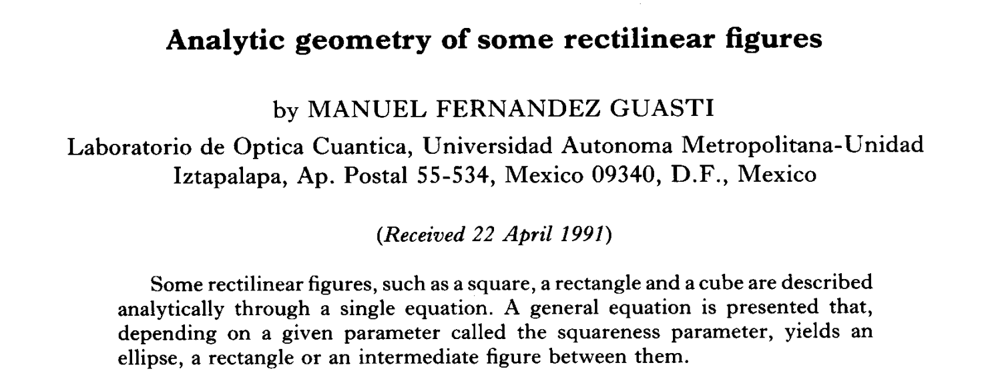

{/* add this script to the body  */}
{/* https://cdn.jsdelivr.net/gh/WLJSTeam/web-components@latest/src/common/app.js */}
<wljs-store kernel="./attachments/kernel-3138499539191000322.txt" json="./attachments/b38f74d2-6e06-448f-96e9-2ef682d8aff3.txt"></wljs-store>

They should not be mixed up with rounded squares ~it is totally different~. Despite their popularity in UI, there are multiple definitions and approximations that can be used to describe something called a *squircle*.

## Superellipse
Using a superellipse-based approach (4th degree), it is relatively easy to draw it using this parametric equation:

<WLJSWrapper><wljs-editor display="codemirror" type="Input" editable="true"  >{`RegionPlot[(*SpB[*)Power[x(*|*),(*|*)4](*]SpB*) + (*SpB[*)Power[y(*|*),(*|*)4](*]SpB*) < 1, {x, -1,1}, {y,-1,1}]`}</wljs-editor></WLJSWrapper>

<WLJSWrapper><wljs-editor display="codemirror" type="Output"  >{`(*VB[*)(FrontEndRef["e218b897-f808-4fb0-939f-965ba3d2ada2"])(*,*)(*"1:eJxTTMoPSmNkYGAoZgESHvk5KRCeEJBwK8rPK3HNS3GtSE0uLUlMykkNVgEKpxoZWiRZWJrrplkYWOiapCUZ6FoaW6bpWpqZJiUapxglpiQaAQB/mhWy"*)(*]VB*)`}</wljs-editor></WLJSWrapper>

## Fernández-Guasti
> In 1992, Manuel Fernández-Guasti introduced a smooth algebraic curve that lies between the circle and the square.

Following his original paper, we can define a squircle as:

<WLJSWrapper><wljs-editor display="codemirror" type="Input" editable="true"  >{`Manipulate[
	  RegionPlot[(*SpB[*)Power[x(*|*),(*|*)2](*]SpB*) + (*SpB[*)Power[y(*|*),(*|*)2](*]SpB*) - (*SpB[*)Power[s(*|*),(*|*)2](*]SpB*) (*SpB[*)Power[x(*|*),(*|*)2](*]SpB*)(*SpB[*)Power[y(*|*),(*|*)2](*]SpB*) < 1, {x,-1,1}, {y,-1,1}]
	, {{s,0.75}, 0,1,0.25}, Appearance->None]`}</wljs-editor></WLJSWrapper>

<WLJSWrapper><wljs-editor display="codemirror" type="Output"  >{`(*VB[*)(FrontEndRef["8a0ff739-632b-4626-a855-39608a48a083"])(*,*)(*"1:eJxTTMoPSmNkYGAoZgESHvk5KRCeEJBwK8rPK3HNS3GtSE0uLUlMykkNVgEKWyQapKWZG1vqmhkbJemamBmZ6SZamJrqGluaGVgkmgClLYwBePIUwA=="*)(*]VB*)`}</wljs-editor></WLJSWrapper>

This is basically a continuous transformation from a circle to a square without invoking infinity. You can pick your own squircle!

## Scatter plots
Jokes aside, the idea is to use them to plot data points, ideally with error bars. We can't simply put our squircles as `PlotMarker`, since it is very inefficient and will eventually crash on over 1000 data points.

For this reason, we use the power of JavaScript and the simplest superellipse approach. I will leave out the details of implementation, since this is a plain frontend symbol with a generated path using a bunch of SVG magic:

<WLJSWrapper><wljs-editor display="codemirror" type="Input" editable="true" encoded="true" fade="true" >{`.js%0Afunction%20normalizePoints%28data%29%20%7B%0A%20%20if%20%28%21Array.isArray%28data%29%29%20return%20%5B%5D%3B%0A%20%20if%20%28data.length%20%3D%3D%3D%200%29%20return%20%5B%5D%3B%0A%20%20if%20%28%21Array.isArray%28data%5B0%5D%29%29%20return%20%5Bdata%5D%3B%0A%20%20return%20data%3B%0A%7D%0A%0Afunction%20squirclePath%28cx%2C%20cy%2C%20size%2C%20n%20%3D%204%2C%20steps%20%3D%2032%29%20%7B%0A%20%20const%20a%20%3D%20size%20%2F%202%3B%0A%20%20const%20b%20%3D%20size%20%2F%202%3B%0A%20%20const%20pts%20%3D%20%5B%5D%3B%0A%0A%20%20for%20%28let%20i%20%3D%200%3B%20i%20%3C%20steps%3B%20i%2B%2B%29%20%7B%0A%20%20%20%20const%20t%20%3D%20%28i%20%2F%20steps%29%20%2A%20Math.PI%20%2A%202%3B%0A%20%20%20%20const%20ct%20%3D%20Math.cos%28t%29%3B%0A%20%20%20%20const%20st%20%3D%20Math.sin%28t%29%3B%0A%0A%20%20%20%20const%20px%20%3D%20cx%20%2B%20a%20%2A%20Math.sign%28ct%29%20%2A%20Math.pow%28Math.abs%28ct%29%2C%202%20%2F%20n%29%3B%0A%20%20%20%20const%20py%20%3D%20cy%20%2B%20b%20%2A%20Math.sign%28st%29%20%2A%20Math.pow%28Math.abs%28st%29%2C%202%20%2F%20n%29%3B%0A%0A%20%20%20%20pts.push%28%5Bpx%2C%20py%5D%29%3B%0A%20%20%7D%0A%0A%20%20return%20pts.length%0A%20%20%20%20%3F%20%60M%20%24%7Bpts%5B0%5D%5B0%5D%7D%20%24%7Bpts%5B0%5D%5B1%5D%7D%20%60%20%2B%0A%20%20%20%20%20%20%20%20pts.slice%281%29.map%28p%20%3D%3E%20%60L%20%24%7Bp%5B0%5D%7D%20%24%7Bp%5B1%5D%7D%60%29.join%28%22%20%22%29%20%2B%0A%20%20%20%20%20%20%20%20%22%20Z%22%0A%20%20%20%20%3A%20%22%22%3B%0A%7D%0A%0Acore.Squircle%20%3D%20async%20%28args%2C%20env%29%20%3D%3E%20%7B%0A%20%20let%20data%20%3D%20await%20interpretate%28args%5B0%5D%2C%20env%29%3B%0A%20%20if%20%28data%20instanceof%20NumericArrayObject%29%20%7B%0A%20%20%20%20data%20%3D%20data.normal%28%29%3B%0A%20%20%7D%0A%0A%20%20const%20x%20%3D%20env.xAxis%3B%0A%20%20const%20y%20%3D%20env.yAxis%3B%0A%0A%20%20data%20%3D%20normalizePoints%28data%29%3B%0A%0A%20%20const%20size%20%3D%20env.pointSize%20%2A%20200%3B%0A%20%20const%20exponent%20%3D%204%3B%0A%20%20const%20steps%20%3D%2032%3B%0A%0A%20%20const%20object%20%3D%20env.svg.append%28%22g%22%29%0A%20%20%20%20.style%28%22opacity%22%2C%20env.opacity%29%3B%0A%0A%20%20data.forEach%28%28d%29%20%3D%3E%20%7B%0A%20%20%20%20const%20cx%20%3D%20x%28d%5B0%5D%29%3B%0A%20%20%20%20const%20cy%20%3D%20y%28d%5B1%5D%29%3B%0A%0A%20%20%20%20object.append%28%22path%22%29%0A%20%20%20%20%20%20.attr%28%22d%22%2C%20squirclePath%28cx%2C%20cy%2C%20size%2C%20exponent%2C%20steps%29%29%0A%20%20%20%20%20%20.style%28%22fill%22%2C%20env.color%29%3B%0A%20%20%7D%29%3B%0A%0A%20%20return%20object%3B%0A%7D%3B%0A%0Acore.SquircleErr%20%3D%20async%20%28args%2C%20env%29%20%3D%3E%20%7B%0A%20%20let%20data%20%3D%20await%20interpretate%28args%5B0%5D%2C%20env%29%3B%0A%20%20if%20%28data%20instanceof%20NumericArrayObject%29%20%7B%0A%20%20%20%20data%20%3D%20data.normal%28%29%3B%0A%20%20%7D%0A%0A%20%20const%20x%20%3D%20env.xAxis%3B%0A%20%20const%20y%20%3D%20env.yAxis%3B%0A%0A%20%20data%20%3D%20normalizePoints%28data%29%3B%0A%0A%20%20const%20size%20%3D%20env.pointSize%20%2A%20200%3B%0A%20%20const%20exponent%20%3D%204%3B%0A%20%20const%20steps%20%3D%2032%3B%0A%0A%20%20const%20object%20%3D%20env.svg.append%28%22g%22%29%0A%20%20%20%20.style%28%22opacity%22%2C%20env.opacity%29%3B%0A%0A%20%20data.forEach%28%28d%29%20%3D%3E%20%7B%0A%20%20%20%20const%20cx%20%3D%20x%28d%5B0%5D%29%3B%0A%20%20%20%20const%20cy%20%3D%20y%28d%5B1%5D%29%3B%0A%20%20%20%20const%20err%20%3D%20d%5B2%5D%3B%0A%0A%20%20%20%20if%20%28typeof%20err%20%3D%3D%3D%20%22number%22%20%26%26%20Number.isFinite%28err%29%29%20%7B%0A%20%20%20%20%20%20const%20y1%20%3D%20y%28d%5B1%5D%20-%20err%29%3B%0A%20%20%20%20%20%20const%20y2%20%3D%20y%28d%5B1%5D%20%2B%20err%29%3B%0A%20%20%20%20%20%20const%20capWidth%20%3D%20Math.max%286%2C%20size%20%2A%200.35%29%3B%0A%0A%20%20%20%20%20%20object.append%28%22line%22%29%0A%20%20%20%20%20%20%20%20.attr%28%22x1%22%2C%20cx%29%0A%20%20%20%20%20%20%20%20.attr%28%22y1%22%2C%20y1%29%0A%20%20%20%20%20%20%20%20.attr%28%22x2%22%2C%20cx%29%0A%20%20%20%20%20%20%20%20.attr%28%22y2%22%2C%20y2%29%0A%20%20%20%20%20%20%20%20.style%28%22stroke%22%2C%20env.color%29%0A%20%20%20%20%20%20%20%20.style%28%22stroke-width%22%2C%201.5%29%0A%20%20%20%20%20%20%20%20.style%28%22fill%22%2C%20%22none%22%29%3B%0A%0A%20%20%20%20%20%20object.append%28%22line%22%29%0A%20%20%20%20%20%20%20%20.attr%28%22x1%22%2C%20cx%20-%20capWidth%20%2F%202%29%0A%20%20%20%20%20%20%20%20.attr%28%22y1%22%2C%20y1%29%0A%20%20%20%20%20%20%20%20.attr%28%22x2%22%2C%20cx%20%2B%20capWidth%20%2F%202%29%0A%20%20%20%20%20%20%20%20.attr%28%22y2%22%2C%20y1%29%0A%20%20%20%20%20%20%20%20.style%28%22stroke%22%2C%20env.color%29%0A%20%20%20%20%20%20%20%20.style%28%22stroke-width%22%2C%201.5%29%0A%20%20%20%20%20%20%20%20.style%28%22fill%22%2C%20%22none%22%29%3B%0A%0A%20%20%20%20%20%20object.append%28%22line%22%29%0A%20%20%20%20%20%20%20%20.attr%28%22x1%22%2C%20cx%20-%20capWidth%20%2F%202%29%0A%20%20%20%20%20%20%20%20.attr%28%22y1%22%2C%20y2%29%0A%20%20%20%20%20%20%20%20.attr%28%22x2%22%2C%20cx%20%2B%20capWidth%20%2F%202%29%0A%20%20%20%20%20%20%20%20.attr%28%22y2%22%2C%20y2%29%0A%20%20%20%20%20%20%20%20.style%28%22stroke%22%2C%20env.color%29%0A%20%20%20%20%20%20%20%20.style%28%22stroke-width%22%2C%201.5%29%0A%20%20%20%20%20%20%20%20.style%28%22fill%22%2C%20%22none%22%29%3B%0A%20%20%20%20%7D%0A%0A%20%20%20%20object.append%28%22path%22%29%0A%20%20%20%20%20%20.attr%28%22d%22%2C%20squirclePath%28cx%2C%20cy%2C%20size%2C%20exponent%2C%20steps%29%29%0A%20%20%20%20%20%20.style%28%22fill%22%2C%20env.color%29%3B%0A%20%20%7D%29%3B%0A%0A%20%20return%20object%3B%0A%7D%3B`}</wljs-editor></WLJSWrapper>

<WLJSWrapper><wljs-editor display="js" type="Output" encoded="true" class="wljs-hide-undefined" >{`function%20normalizePoints%28data%29%20%7B%0A%20%20if%20%28%21Array.isArray%28data%29%29%20return%20%5B%5D%3B%0A%20%20if%20%28data.length%20%3D%3D%3D%200%29%20return%20%5B%5D%3B%0A%20%20if%20%28%21Array.isArray%28data%5B0%5D%29%29%20return%20%5Bdata%5D%3B%0A%20%20return%20data%3B%0A%7D%0A%0Afunction%20squirclePath%28cx%2C%20cy%2C%20size%2C%20n%20%3D%204%2C%20steps%20%3D%2032%29%20%7B%0A%20%20const%20a%20%3D%20size%20%2F%202%3B%0A%20%20const%20b%20%3D%20size%20%2F%202%3B%0A%20%20const%20pts%20%3D%20%5B%5D%3B%0A%0A%20%20for%20%28let%20i%20%3D%200%3B%20i%20%3C%20steps%3B%20i%2B%2B%29%20%7B%0A%20%20%20%20const%20t%20%3D%20%28i%20%2F%20steps%29%20%2A%20Math.PI%20%2A%202%3B%0A%20%20%20%20const%20ct%20%3D%20Math.cos%28t%29%3B%0A%20%20%20%20const%20st%20%3D%20Math.sin%28t%29%3B%0A%0A%20%20%20%20const%20px%20%3D%20cx%20%2B%20a%20%2A%20Math.sign%28ct%29%20%2A%20Math.pow%28Math.abs%28ct%29%2C%202%20%2F%20n%29%3B%0A%20%20%20%20const%20py%20%3D%20cy%20%2B%20b%20%2A%20Math.sign%28st%29%20%2A%20Math.pow%28Math.abs%28st%29%2C%202%20%2F%20n%29%3B%0A%0A%20%20%20%20pts.push%28%5Bpx%2C%20py%5D%29%3B%0A%20%20%7D%0A%0A%20%20return%20pts.length%0A%20%20%20%20%3F%20%60M%20%24%7Bpts%5B0%5D%5B0%5D%7D%20%24%7Bpts%5B0%5D%5B1%5D%7D%20%60%20%2B%0A%20%20%20%20%20%20%20%20pts.slice%281%29.map%28p%20%3D%3E%20%60L%20%24%7Bp%5B0%5D%7D%20%24%7Bp%5B1%5D%7D%60%29.join%28%22%20%22%29%20%2B%0A%20%20%20%20%20%20%20%20%22%20Z%22%0A%20%20%20%20%3A%20%22%22%3B%0A%7D%0A%0Acore.Squircle%20%3D%20async%20%28args%2C%20env%29%20%3D%3E%20%7B%0A%20%20let%20data%20%3D%20await%20interpretate%28args%5B0%5D%2C%20env%29%3B%0A%20%20if%20%28data%20instanceof%20NumericArrayObject%29%20%7B%0A%20%20%20%20data%20%3D%20data.normal%28%29%3B%0A%20%20%7D%0A%0A%20%20const%20x%20%3D%20env.xAxis%3B%0A%20%20const%20y%20%3D%20env.yAxis%3B%0A%0A%20%20data%20%3D%20normalizePoints%28data%29%3B%0A%0A%20%20const%20size%20%3D%20env.pointSize%20%2A%20200%3B%0A%20%20const%20exponent%20%3D%204%3B%0A%20%20const%20steps%20%3D%2032%3B%0A%0A%20%20const%20object%20%3D%20env.svg.append%28%22g%22%29%0A%20%20%20%20.style%28%22opacity%22%2C%20env.opacity%29%3B%0A%0A%20%20data.forEach%28%28d%29%20%3D%3E%20%7B%0A%20%20%20%20const%20cx%20%3D%20x%28d%5B0%5D%29%3B%0A%20%20%20%20const%20cy%20%3D%20y%28d%5B1%5D%29%3B%0A%0A%20%20%20%20object.append%28%22path%22%29%0A%20%20%20%20%20%20.attr%28%22d%22%2C%20squirclePath%28cx%2C%20cy%2C%20size%2C%20exponent%2C%20steps%29%29%0A%20%20%20%20%20%20.style%28%22fill%22%2C%20env.color%29%3B%0A%20%20%7D%29%3B%0A%0A%20%20return%20object%3B%0A%7D%3B%0A%0Acore.SquircleErr%20%3D%20async%20%28args%2C%20env%29%20%3D%3E%20%7B%0A%20%20let%20data%20%3D%20await%20interpretate%28args%5B0%5D%2C%20env%29%3B%0A%20%20if%20%28data%20instanceof%20NumericArrayObject%29%20%7B%0A%20%20%20%20data%20%3D%20data.normal%28%29%3B%0A%20%20%7D%0A%0A%20%20const%20x%20%3D%20env.xAxis%3B%0A%20%20const%20y%20%3D%20env.yAxis%3B%0A%0A%20%20data%20%3D%20normalizePoints%28data%29%3B%0A%0A%20%20const%20size%20%3D%20env.pointSize%20%2A%20200%3B%0A%20%20const%20exponent%20%3D%204%3B%0A%20%20const%20steps%20%3D%2032%3B%0A%0A%20%20const%20object%20%3D%20env.svg.append%28%22g%22%29%0A%20%20%20%20.style%28%22opacity%22%2C%20env.opacity%29%3B%0A%0A%20%20data.forEach%28%28d%29%20%3D%3E%20%7B%0A%20%20%20%20const%20cx%20%3D%20x%28d%5B0%5D%29%3B%0A%20%20%20%20const%20cy%20%3D%20y%28d%5B1%5D%29%3B%0A%20%20%20%20const%20err%20%3D%20d%5B2%5D%3B%0A%0A%20%20%20%20if%20%28typeof%20err%20%3D%3D%3D%20%22number%22%20%26%26%20Number.isFinite%28err%29%29%20%7B%0A%20%20%20%20%20%20const%20y1%20%3D%20y%28d%5B1%5D%20-%20err%29%3B%0A%20%20%20%20%20%20const%20y2%20%3D%20y%28d%5B1%5D%20%2B%20err%29%3B%0A%20%20%20%20%20%20const%20capWidth%20%3D%20Math.max%286%2C%20size%20%2A%200.35%29%3B%0A%0A%20%20%20%20%20%20object.append%28%22line%22%29%0A%20%20%20%20%20%20%20%20.attr%28%22x1%22%2C%20cx%29%0A%20%20%20%20%20%20%20%20.attr%28%22y1%22%2C%20y1%29%0A%20%20%20%20%20%20%20%20.attr%28%22x2%22%2C%20cx%29%0A%20%20%20%20%20%20%20%20.attr%28%22y2%22%2C%20y2%29%0A%20%20%20%20%20%20%20%20.style%28%22stroke%22%2C%20env.color%29%0A%20%20%20%20%20%20%20%20.style%28%22stroke-width%22%2C%201.5%29%0A%20%20%20%20%20%20%20%20.style%28%22fill%22%2C%20%22none%22%29%3B%0A%0A%20%20%20%20%20%20object.append%28%22line%22%29%0A%20%20%20%20%20%20%20%20.attr%28%22x1%22%2C%20cx%20-%20capWidth%20%2F%202%29%0A%20%20%20%20%20%20%20%20.attr%28%22y1%22%2C%20y1%29%0A%20%20%20%20%20%20%20%20.attr%28%22x2%22%2C%20cx%20%2B%20capWidth%20%2F%202%29%0A%20%20%20%20%20%20%20%20.attr%28%22y2%22%2C%20y1%29%0A%20%20%20%20%20%20%20%20.style%28%22stroke%22%2C%20env.color%29%0A%20%20%20%20%20%20%20%20.style%28%22stroke-width%22%2C%201.5%29%0A%20%20%20%20%20%20%20%20.style%28%22fill%22%2C%20%22none%22%29%3B%0A%0A%20%20%20%20%20%20object.append%28%22line%22%29%0A%20%20%20%20%20%20%20%20.attr%28%22x1%22%2C%20cx%20-%20capWidth%20%2F%202%29%0A%20%20%20%20%20%20%20%20.attr%28%22y1%22%2C%20y2%29%0A%20%20%20%20%20%20%20%20.attr%28%22x2%22%2C%20cx%20%2B%20capWidth%20%2F%202%29%0A%20%20%20%20%20%20%20%20.attr%28%22y2%22%2C%20y2%29%0A%20%20%20%20%20%20%20%20.style%28%22stroke%22%2C%20env.color%29%0A%20%20%20%20%20%20%20%20.style%28%22stroke-width%22%2C%201.5%29%0A%20%20%20%20%20%20%20%20.style%28%22fill%22%2C%20%22none%22%29%3B%0A%20%20%20%20%7D%0A%0A%20%20%20%20object.append%28%22path%22%29%0A%20%20%20%20%20%20.attr%28%22d%22%2C%20squirclePath%28cx%2C%20cy%2C%20size%2C%20exponent%2C%20steps%29%29%0A%20%20%20%20%20%20.style%28%22fill%22%2C%20env.color%29%3B%0A%20%20%7D%29%3B%0A%0A%20%20return%20object%3B%0A%7D%3B`}</wljs-editor></WLJSWrapper>

This cell above defined 2 frontend symbols named `Squircle` and `SquircleErr`, which are at your service now.

I gave the same interface to `Squircle` as for `Point`. The modifiers such as color, `PointSize` will affect them accordingly. Here is a quick test:

<WLJSWrapper><wljs-editor display="codemirror" lazy="true" type="Input" editable="true"  >{`Graphics[{
	  White, Rectangle[{-0.5,-0.5}, {0.5,0.5}], Black,
	  Squircle[{-0.2,0.0}],
	  SquircleErr[{0.2,0.0, 0.1}]
	}, ImageSize->250]`}</wljs-editor></WLJSWrapper>

<WLJSWrapper><wljs-editor lazy="true" display="codemirror" type="Output"  >{`(*VB[*)(Graphics[{GrayLevel[1], Rectangle[{-0.5, -0.5}, {0.5, 0.5}], GrayLevel[0], Squircle[{-0.2, 0.}], SquircleErr[{0.2, 0., 0.1}]}, ImageSize -> 250])(*,*)(*"1:eJxTTMoPSmNkYGAoZgESHvk5KWlMIB4HkHAvSizIyEwuTmOFyftkFpdAVHNC5Ct9UstSczJBQhB9IPGg1OSSxLz0nFSIEExjEQMYPNgPZ2CXt4czsFkFkoGIg5wYXFiaWZSMYdOsmSBwEmYTTAc3kg7XoqI0Zmya7OGaoCI77RGmB5XmpIId5JmbmJ4anFmVmvkLyAMAUxlLcA=="*)(*]VB*)`}</wljs-editor></WLJSWrapper>

Finally we can replace all `Point` primitives with it! Let's try the default `ListPlot` with points and squircles:

<WLJSWrapper><wljs-editor lazy="true" display="codemirror" type="Input" editable="true"  >{`ListPlot[Table[{i, Sin[i/3.0] + 0.1 RandomReal[{-1,1}]}, {i,40}], PlotStyle->PointSize[0.03], PlotLabel->"Default"]
	ListPlot[Table[{i, Sin[i/3.0] + 0.1 RandomReal[{-1,1}]}, {i,40}], PlotStyle->PointSize[0.03], PlotLabel->"Squircles"] /. Point -> Squircle`}</wljs-editor></WLJSWrapper>

<WLJSWrapper><wljs-editor lazy="true" display="codemirror" type="Output"  >{`(*VB[*)(FrontEndRef["8a1e32b7-04b0-4ac6-a0e0-bfeeb317645c"])(*,*)(*"1:eJxTTMoPSmNkYGAoZgESHvk5KRCeEJBwK8rPK3HNS3GtSE0uLUlMykkNVgEKWyQaphobJZnrGpgkGeiaJCab6SYapBroJqWlpiYZG5qbmZgmAwCHdBXr"*)(*]VB*)`}</wljs-editor></WLJSWrapper>

<WLJSWrapper><wljs-editor lazy="true" display="codemirror" type="Output"  >{`(*VB[*)(FrontEndRef["f848a248-5b6d-40a1-a1be-26b8c68efafd"])(*,*)(*"1:eJxTTMoPSmNkYGAoZgESHvk5KRCeEJBwK8rPK3HNS3GtSE0uLUlMykkNVgEKp1mYWCQamVjomiaZpeiaGCQa6iYaJqXqGpklWSSbWaSmJaalAACEOxY1"*)(*]VB*)`}</wljs-editor></WLJSWrapper>

Now with error bars

<WLJSWrapper><wljs-editor lazy="true" display="codemirror" type="Input" editable="true"  >{`ListPlot[Table[{i, Sin[i/3.0] + 0.1 RandomReal[{-1,1}]}, {i,40}], PlotStyle->PointSize[0.03]];
	% /. Point[xy_] :> SquircleErr[Transpose@Join[Transpose[xy], {Table[0.3, Length[xy]]}]]`}</wljs-editor></WLJSWrapper>

<WLJSWrapper><wljs-editor lazy="true" display="codemirror" type="Output"  >{`(*VB[*)(FrontEndRef["03ab27ef-9dae-4898-9003-89cf4e1a2d90"])(*,*)(*"1:eJxTTMoPSmNkYGAoZgESHvk5KRCeEJBwK8rPK3HNS3GtSE0uLUlMykkNVgEKGxgnJhmZp6bpWqYkpuqaWFha6FoaGBjrWlgmp5mkGiYapVgaAACH7BWt"*)(*]VB*)`}</wljs-editor></WLJSWrapper>

It might be just my personal opinion, but experimentally measured points on graphs look better when depicted with squares - it sort of gives them power. Nature cannot be altered; models and theory should look like lines or disks, but the experiment is rather solid. However, plain rectangles or squares are too pointy on the edges; here superellipses or squircles come into play. Well, we have hi-DPI screens anyway, so why not use them for good?

Embrace the power of squircles! 

Cheers,
Kirill