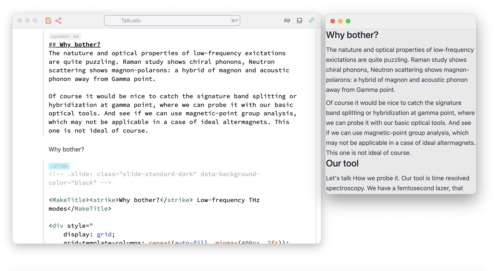

<div className='invertColor'>


</div>

## Timer

The title is quite self-explanatory. During the recent DPG meeting I was wondering if I could have some sort of presenter mode, but without an actual secondary screen. Then the idea came to my mind: why not just overlay the presentation with some stats, like the time elapsed during the presentation? To avoid distraction, I made it appear for only a short period of time so that the speaker could see it and then have it dissolve back into the background.

### How it works
It has to be placed on one of your slides, where it attaches to it and accesses the container of your presentation. Then periodically it will append a DOM element with the current time using a JavaScript function, and later remove it. The timer runs on the WL side, while UI operations are done by frontend symbols (functions).

### How to use it
Download this notebook

  <DownloadFile
    title="Download"
    description="Timer module"
    href="./timer.wln"
  />

Then place it to your notebook directory and load it as a module:

```wolfram
Then[NotebookEvaluateAsModuleAsync["timer.wln"], Function[module,
    TimerWidget = module
]];
```

<Callout type="info">Notebooks loaded as libraries or modules have to be loaded asynchronously, since the order of evaluation is altered.</Callout>

Now we place it on some of our slides (for example on a final one):

```jsx
.slide

# Slide

<Timer Color={Gray} Timeout={Quantity[5, "Minutes"], Period={Quantity[15, "Seconds"]}/>
```

Here:
- `Color` sets the text color of current time
- `Timeout` max time for your talk (reglament)
- `Period` how often show the current time 

## Speaker notes 
I usually leave my speaker notes in between the slides as plain markdown cells. However, it would be nice to compile them later into a single large text.

For this reason we can "abuse" input cells:

1. Use the first line and type something like this: `speaker.md` instead of just `.md`
This will still use markdown formatting, but can be used later as a "marker"
2. Write there your speaker notes in markdown language
3. __Do not evaluate them__, otherwise it will probably assume you want to create a markdown file `speaker.md` with your content and will actually create it — not the end of the world, but still.
4. Find all of these cells in the notebook, merge the text and print to a new window like this:

```wolfram
With[
  {text = StringRiffle[
        Map[
            StringDrop[#, StringLength["speaker.md\n"]] &, 
            Select[NotebookRead[Cells[]], 
                MatchQ[Cell[_?(StringMatchQ["speaker.md"~~___]), "Input", ___]]
            ][[All,1]]
        ],
    "\n"]},
  {container = StringTemplate["<div style=\"height:100vh; overflow-y:scroll\">\n\n``\n\n</div>"][text]},
  CreateWindow[Cell[container, "Output", "markdown"]]
];
```

Here we also wrapped it with a scrollable `<div>` for convenience. Here is how it may look:

<div className='invertColor'>



</div>

Hope you will find it helpful for your presentations in WLJS!