{/* add this script to the body  */}
{/* https://cdn.jsdelivr.net/gh/WLJSTeam/web-components@latest/src/common/app.js */}
<wljs-store json="./attachments/12844ce6-5fd7-4d21-b215-c95ae591da6c.txt"></wljs-store>

In this post, I want to show how the idea of "purely positional" integration without explicitly using velocities turns into a working animation, starting from simple examples and ending with meshes.

## Basics
All credit belongs to these people:

<Cards>

<Card
	title="Loup Verlet"
	description="French physicist, pioneer in molecular dynamics (1967)"
>
	
</Card>

<Card
	title="Carl Størmer"
	description="Norwegian mathematician and physicist (1907)"
>
	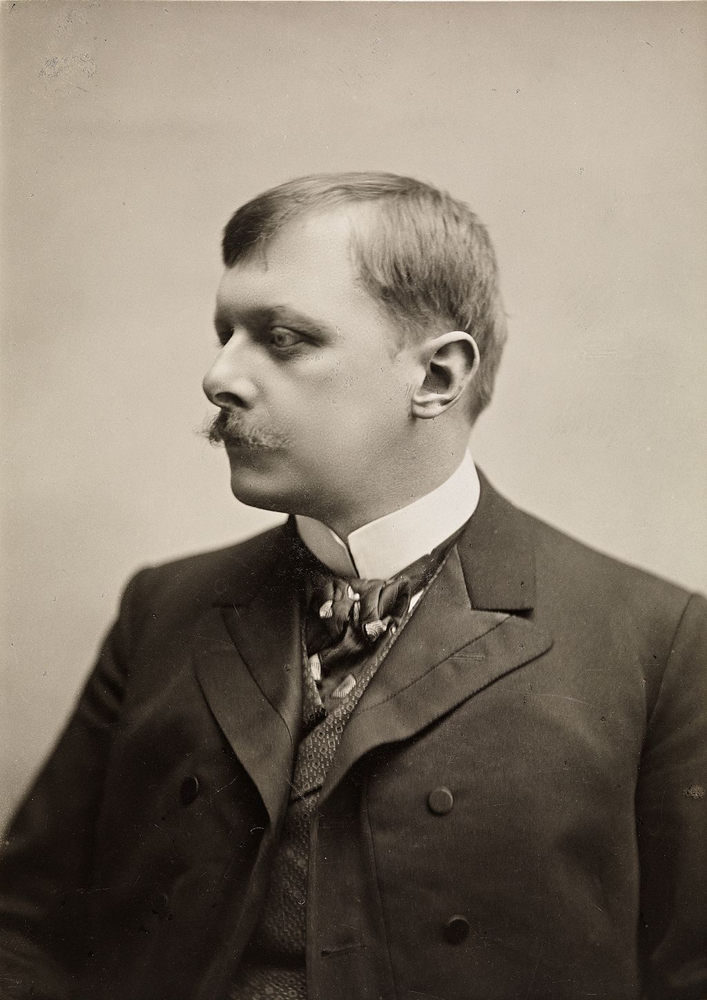
</Card>

</Cards>

As shown in [the video](https://www.youtube.com/shorts/6eLUQDEBBHI?feature=share), a simple system of discretized equations of motion for a point mass

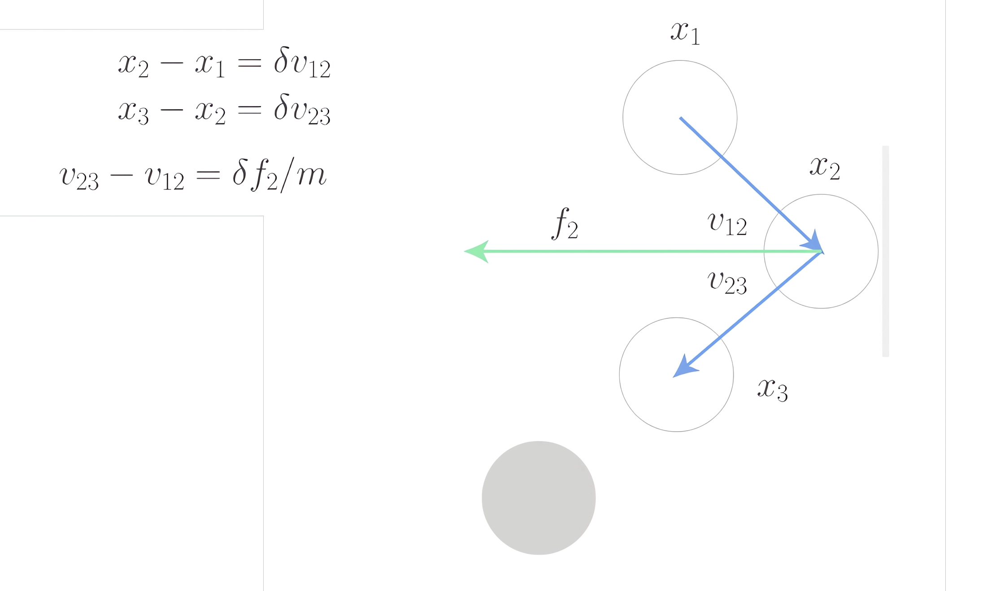

leads us to the following numerical solution for both kinematic and dynamic problems:

$$
x_{n+1} = 2 x_{n} - x_{n-1} + \delta^{2} f_{n}/m
$$

where n is the iteration number or time step ($\delta$). As you can see, there's no velocity here — only positions and forces.

---

## Turning Equations into Animation
This equation translates conveniently into code:

<WLJSWrapper><wljs-editor display="codemirror" type="Input" editable="true"  >{`With[{
	  ball = Unique["ball"], 
	  handler = Unique[]
	},
	
	  (* initial position x3 *)  
	
	  ball = Table[{0, 0}, {3}];
	
	  (* update function *) 
	     
	  handler = Function[Null,
	    (* Verlet method *)  
	                             
	    ball[[3]] = ball[[2]];
	    ball[[2]] = ball[[1]];
	
	    ball[[1]] = 2 ball[[2]] - ball[[3]] + {0, -1} 0.01;
	    If[ball[[1, 2]] < -1.0, ball[[{1, 2}]] = ball[[{2, 1}]]];
	
	    (* reassign to triggen synchronization with a screen *)      
	                             
	    ball = ball;
	  ];
	
	  (* graphical output *)
	     
	  Graphics[{
	    {Gray, Line[{{-1, 0}, {1, 0}}]},
	    Point[ball[[1]] // Offload],
	    EventHandler[AnimationFrameListener[ball // Offload], handler]
	  }, PlotRange -> {{-1, 1}, {-1, 1}}]
	]`}</wljs-editor></WLJSWrapper>

All three $x_{n+1}$, $x_{n}$, $x_{n-1}$ of a single bouncing ball are stored in the symbol `ball`. To solve this problem, the Verlet equation unfolds into:

$$
\begin{align*} &ball_{n-1} &=& ~ ball_{n} \\ &ball_{n} &=& ~ball_{n+1} \\ &ball_{n+1} &=& ~2 ball_{n} - ball_{n-1} + \begin{bmatrix}0 \\ -1 \end{bmatrix} \alpha^2 \end{align*}
$$
where the last term $\alpha^2$ corresponds to the gravitational force acting on a unit-mass ball multiplied by the square of the time constant, i.e., $\alpha^2 = g \delta t^2 / m$.

__Boundary conditions__: if the ball crosses the ground surface, we swap $ball_n$ and $ball_{n+1}$—this implicitly means "flipping" the velocity vector:

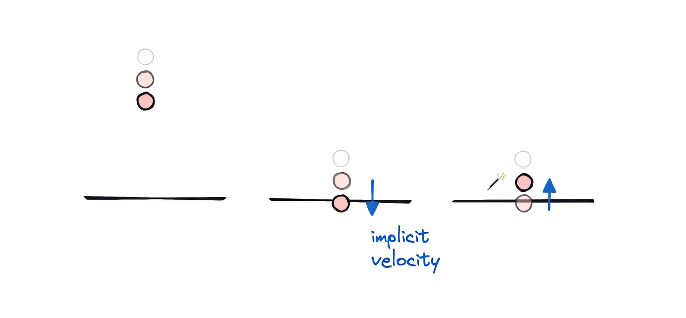

Demonstration

## Heat Losses
To account for inelastic collisions, we can reduce the reflected momentum (velocity) by a factor of, say, 0.95–0.8:

<WLJSWrapper><wljs-editor display="codemirror" type="Input" editable="true"  >{`  If[ball[[1, 2]] < -1.0, 
	    With[{vel = ball[[1]]-ball[[2]]},
	      ball[[2]] = ball[[1]];
	      ball[[1]] = ball[[1]] - 0.95 vel;
	    ];
	  ];`}</wljs-editor></WLJSWrapper>

## Numerical Method Accuracy
Even with a small time step $\delta t$, boundary-crossing errors are possible. Most often after a strong impact:

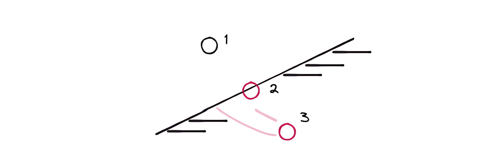

> Yes, you have to "cheat" here, as almost all physics engine developers do.

In such cases, you can simply clamp one of the coordinates to the region boundaries manually, bypassing any physics:

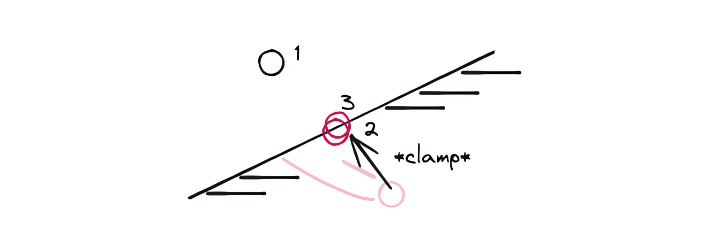

In code, this becomes the following correction:

<WLJSWrapper><wljs-editor display="codemirror" type="Input" editable="true"  >{`  If[ball[[1, 2]] < -1.0, 
	    With[{vel = ball[[1]]-ball[[2]]},
	      ball[[2]] = ball[[1]];
	      ball[[1]] = Clip[ball[[1]] - 0.95 vel, {-1, Infinity}]; (* <-- *)
	    ];
	  ];`}</wljs-editor></WLJSWrapper>

If you have a more elegant solution, feel free to share it in the comments!

### General Boundary Conditions
If the surface is tilted, you need to reflect the velocity relative to the normal. This is a good exercise to try on your own:

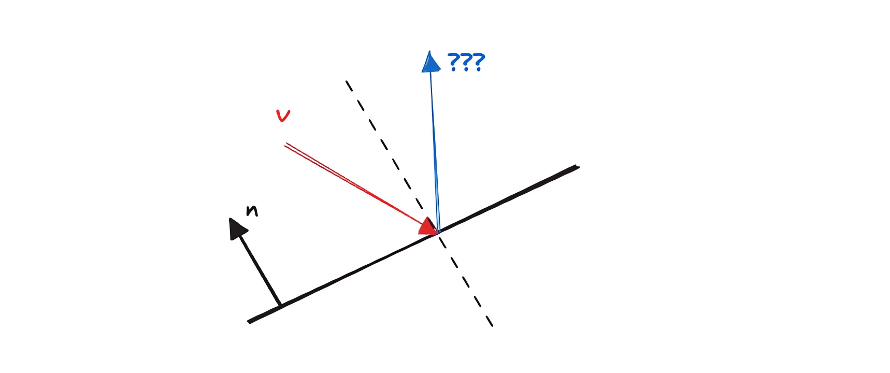

Here, I'll simply provide the answer:

$$
\mathbf{v}^{\prime} = \mathbf{v} - 2~\mathbf{n} (\mathbf{n} \cdot \mathbf{v})
$$

---

## Ball in a Rim
Let's say

<WLJSWrapper><wljs-editor display="codemirror" type="Input" editable="true"  >{`Circle[] // Graphics`}</wljs-editor></WLJSWrapper>

will be our boundary condition. We do everything the same way, but reflect the velocity vector off the surface defined by the inner "side" of the rim:

<WLJSWrapper><wljs-editor display="codemirror" type="Input" editable="true"  >{`With[{
	  p = Unique["bbb"], 
	  frame = CreateUUID[],
	  circ = {0,0}
	},
	  p = Table[{0,0}, {3}];
	
	  EventHandler[frame, Function[Null,
	    Module[{b = p, \\[Delta]t = 0.01},
	      Do[
	        If[Norm[b[[1]]-circ] > 1.0,
	          With[{n = -Normalize[b[[1]]-circ], delta = b[[1]]-b[[2]]},
	            b[[2]] = b[[1]];
	            b[[1]] = b[[1]] -  n (n.delta);
	          ]
	        ];
	
	        b[[3]] = b[[2]];
	        b[[2]] = b[[1]];
	        b[[1]] = 2 b[[2]] - b[[3]] + {0,-1} \\[Delta]t \\[Delta]t;
	      , {5}];
	    
	      p = b;
	    ];
	  ]];
	
	  Graphics[{
	    Circle[circ, 1.0], 
	    Lighter[Lighter[Red]], Disk[p[[3]]//Offload, 0.01],
	    Lighter[Red], Disk[p[[2]]//Offload, 0.01],
	    Red, Disk[p[[1]]//Offload, 0.01],
	    AnimationFrameListener[p//Offload, "Event"->frame]
	  }, PlotRange->{{-1,1}, {-1,1}}, AspectRatio->1]
	]`}</wljs-editor></WLJSWrapper>

However, if the rim is static, we won't see any difference between it and a flat surface when the ball falls straight down... So let's make the rim movable:

<WLJSWrapper><wljs-editor display="codemirror" type="Input" editable="true"  >{`With[{
	  p = Unique["bbb"], 
	  frame = CreateUUID[],
	  circ = Unique["bbb"]
	},
	  circ = {0,0};
	  p = Table[{0,0}, {3}];
	
	  EventHandler[frame, Function[Null,
	    Module[{b = p, \\[Delta]t = 0.01},
	      Do[
	        If[Norm[b[[1]]-circ] > 1.0,
	          With[{n = -Normalize[b[[1]]-circ], delta = b[[1]]-b[[2]]},
	            b[[2]] = b[[1]];
	            b[[1]] = b[[1]] -  n (n.delta);
	          ]
	        ];
	
	        b[[3]] = b[[2]];
	        b[[2]] = b[[1]];
	        b[[1]] = 2 b[[2]] - b[[3]] + {0,-1} \\[Delta]t \\[Delta]t;
	      , {5}];
	    
	      p = b;
	    ];
	  ]];
	
	 {
	  Graphics[{
	    Circle[circ//Offload, 1.0], 
	    Lighter[Lighter[Red]], Disk[p[[3]]//Offload, 0.01],
	    Lighter[Red], Disk[p[[2]]//Offload, 0.01],
	    Red, Disk[p[[1]]//Offload, 0.01],
	    AnimationFrameListener[p//Offload, "Event"->frame]
	  }, PlotRange->{{-1,1}, {-1,1}}, AspectRatio->1],
	
	  (* new input element *)            
	  EventHandler[InputJoystick[], Function[xy, circ = xy]]
	 } // Column
	]`}</wljs-editor></WLJSWrapper>

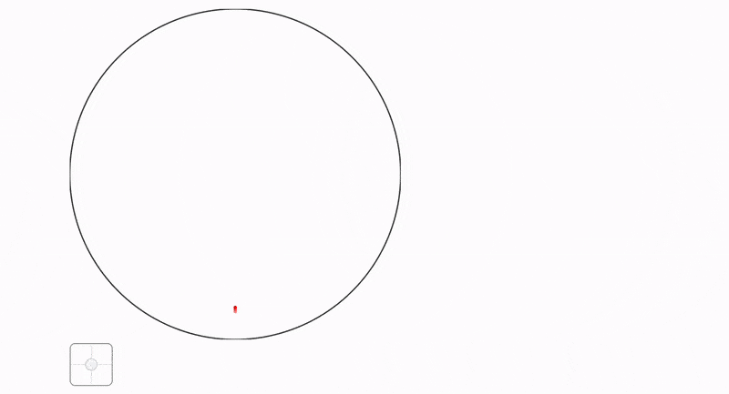

It works! Almost... But something is missing. The rim itself (or circle, if you prefer) also has velocity and momentum. However, we're not transferring them to the ball right now.

---

## Momentum Transfer

> When things get complicated—switch to a different reference frame.

Let's move the calculations to the rim's reference frame (moving along with it):

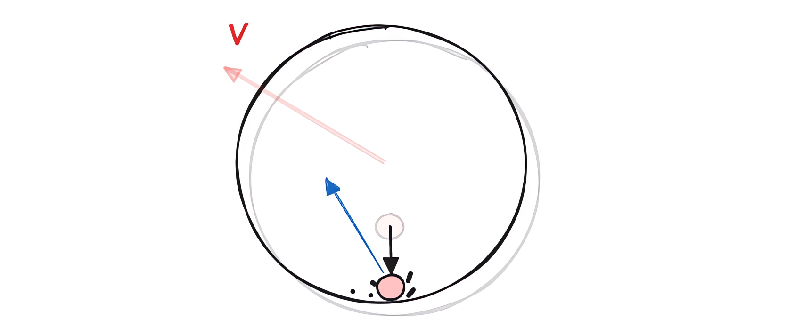

In that frame, the rim's velocity is zero—it's stationary. We solve the problem with boundary conditions as before, and then return to the original (stationary) reference frame:

<WLJSWrapper><wljs-editor display="codemirror" type="Input" editable="true"  >{`u[[1]] = u[[1]] - rimVel;
	                
	With[{
	  n = -Normalize[u[[1]]-circ[[2]]], 
	  delta = u[[1]]-u[[2]]
	},
	  u[[2]] = u[[1]];
	  u[[1]] = u[[1]] -  0.8 n (n.delta);
	];
	  
	u[[1]] = u[[1]] + rimVel;`}</wljs-editor></WLJSWrapper>

Full solution for multiple balls:

<WLJSWrapper><wljs-editor display="codemirror" type="Input" editable="true"  >{`With[{
	  p = Unique["bbb"],
	  circ = Unique["bbb"],
	  target = Unique["bbb"],
	  frame = CreateUUID[]
	},
	  p = Table[RandomReal[{-1,1}, 2]0.001, {3}, {100}];
	  circ = {{0,0}, {0,0}};
	  target = {0,0};
	  
	  EventHandler[frame, Function[Null,
	    Module[{b = p, \\[Delta]t = 0.005},
	      Do[
	        circ[[1]] = circ[[1]] + \\[Delta]t (target - circ[[1]]);
	
	        (* boundary conditions for each ball *)
	        
	        b[[{1,2}]] = MapThread[If[Norm[#1-circ[[2]]] > 1.0, Module[{
	          u = {#1, #2},
	          vel = (circ[[1]] - circ[[2]])
	        },
	
	          (* change reference frame *)
	                                                                   
	          u[[1]] = u[[1]] - vel;
	          
	          
	          With[{n = -Normalize[u[[1]]-circ[[2]]], delta = u[[1]]-u[[2]]},
	            u[[2]] = u[[1]];
	            u[[1]] = u[[1]] -  0.8 n (n.delta);
	          ];
	
	          (* change reference frame back *)    
	                                                                   
	          u[[1]] = u[[1]] + vel;
	
	          (* clamp coordinate if it went out of bounds *)  
	                                                                   
	          If[Norm[u[[1]]-circ[[2]]] > 1.0, 
	            u[[1]] += (1.0 - Norm[u[[1]]-circ[[2]]]) Normalize[u[[1]]-circ[[2]]];
	          ];
	  
	          u
	        ], {#1, #2}]&, {b[[1]], b[[2]]}] // Transpose;
	
	        (* standard Verlet method *)
	        b[[2]] = b[[1]];
	        b[[1]] = 2 b[[2]] - b[[3]] + Table[{0,-1}, {Length[b[[1]]]}] \\[Delta]t \\[Delta]t;
	  
	  
	        circ[[2]] = circ[[1]];
	      , {10}];
	  
	      circ = circ;
	  
	      p = b;
	    ];
	  ]];
	
	  {
	    Graphics[{
	      Circle[circ[[1]] // Offload, 1.0], 
	      Pink, Point[p[[1]] // Offload],
	      AnimationFrameListener[p//Offload, "Event"->frame]
	    }, PlotRange->{1.4{-1,1}, 1.4{-1,1}}, AspectRatio->1, ImageSize->Medium, TransitionType->None],
	  
	    EventHandler[InputJoystick[], Function[xy, target = xy;]]
	  } // Row
	]`}</wljs-editor></WLJSWrapper>

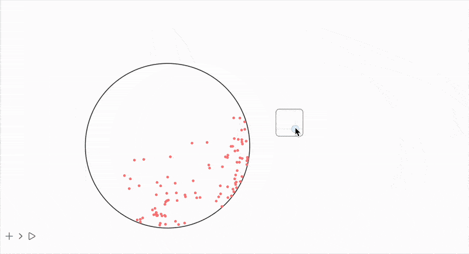

Much better!

## Balls and Rods (Constraint Algorithm)

When modeling a system with balls connected by rods, explicitly calculating tensions and momentum transfer quickly turns into a mess. Here, the Verlet method significantly simplifies all calculations since all the fuss with velocities and forces happens automatically and behind the scenes.

As I mentioned in a previous post ✂️

> ...if we want to maintain fixed distances between points according to a graph, this would require non-trivial work with velocity and position, but the Verlet method leaves us with only x_i

> The stiffness of such connections is not set through differential equations, but through a special algorithm that approximates the real potentials of these bonds. There's an entire science dedicated to avoiding solving differential equations by manipulating coordinates instead. Here, the most naive and simple approach is presented.
>

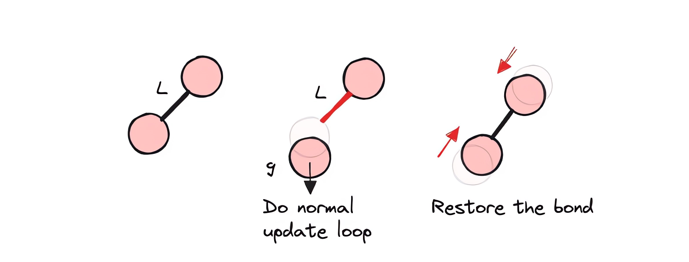

First, we perform our usual Verlet iteration, and then apply the constraint enforcement algorithm. Since each connection affects both vertices simultaneously, "information" (momentum, tension, etc.) propagates throughout the entire node system. This means that if, for example, our mesh of connections hits the ground with one of its vertices, the entire body stops and bounces back.

Additionally, here's an example similar to what you (perhaps) saw in YT Shorts:

### Image2Mesh

Converting a black-and-white image into a mesh of interconnected vertices.

Let's take this example image:

<WLJSWrapper><wljs-editor display="codemirror" type="Input" editable="true"  >{`dude = "1:eJztXWeIHVUU3uxmk6hBYwM7idg7iknEmkQJCRp1N7GAhU3ydo0ku7q7EQv+UYP/NFhTFLGggg2JgjVGNBqjoGAEEeIaBXuNdU053uOcj3fezZ15896Wd2fevfDtm51y55zz3XPb3DkzYW5XS/vIhoaGnmbzZ8aito5CeyP/O9b8mbV4UaF7wbwp3d1tN8xtMjvmC/gCIsoaRhg0GYwUNDrQ5IGceUej2D/t+U3CXTX3GSFo9EBvH6HtwpxMN2g3WGqw1mCd4F2D1Qaz1fnVcBIQD9Q9BxksMfiE0qVeg90q4AR+caTBWwZvynbwkx25mGbwk7L1NoMtgq0ObJPzNhkcm9KmqN8eVfd51JKjngH7TTH4U+zzr7J1ufSP/N4t+ZRre3A/ru/A65vWsawBfZumAeqA9nRfgx/ErlvTkKAS+w5zt4LK84H77WnwpcF2yWO9Ol5r29YSsF2v2OXfVAyUJvhRH0XtCGzuuh/qo+PU/ZiTpZY8WQF84XCDRwyepPT1dhIfK8UuW9IQ4EjwqTll7Iq24145H/xPUcdrbeNq+FirbLHeOlYNH8skr2r54OuYz6co3q7g4lTrXl8b7ELJfuUrIO/bog+3pf0GhyXYIQ0fyy0bVZrgHx9Ycrru9SxF3PXLdVdUKbsPgE5zRP9++V1epU6Dzcc6cvOB+1xkyf1KlXL7Avj0KIONFJUz9BnHU3FeqVI+BlpfJfEBeSYYfE9R+w8+zqLsz4PBhteJTn/L752yv7mKvFZIHgPl430q5QPl4wCDz+UcjFeq9WnfgPmG/Q1+FVug33g5ldo5LR93i40G2p4/TqU2Rv4vy3nwi88MdlW61Nqmg+UjnaLfP2IPHtMdbNkkCTjnLMkn7ZjcTuCxRckHP10kx/pFxj4lY1bH40mcPCz6oh74WB1Lwwls8gYV26NKErjgOd9myQ9c8HxYv5wDH55kyZ8XwNd57mGj2ATjK64fDkqpt+0jlfABf+J5r6Mln9HyO9XgLyr2bTndKMcqaeOyBJTtQwx+t3Tn9nMCFTlJqhtw7Hm5Ng0n4IL7E2fL9aOolAtO8NtVVMp/XoHyf6WyFWywSdkKtgA3uh3FfMtYitpabW9XwjzgLwZnWPKcT8V5YsjxGkVj8Ly03+WAMnca7divZNvx84UTHNeNUEAdwn00PO9wpe2C3yhqH8YY7GMwk6LxHRL89HWDnSTvPLXfaTnhOupTZROUc7Yv83KZwRGUXG+8qK6JS5w3zz1xn/sXtR/PrzixX9QjFwDqrnEUzf1q2+n6h7eZs/cc4PnJ7+S87eROfL3NFfpRSM8Z7Ez1ywWgdWdf+FDZSM/jlUtxXJRLXGedo2Soh/aiHPTzEK6XmJd3qDi3Um2Cj/EYh+dY+LnJMgH3ZU9RMtRL210J7DaC25aZYjtuI7B+x1Vv/Si2136C+ujphHtiHV2tdfcVsE+lZXWJxYHmZjNF401ur0ZRcQ1j4KEyYG5bj0FsjJTfMymqn+xxCNqeVskzb/MevgF+xOX+C7G95gRzuZj7CHwMPdAXWCMc6P6YfvYU2uzhAcr8rWJ7VxvyB0XrthoCJ0MO+Md4iuaiMEdic4K589CODy1Q3vkZHtbzuviYGPgYVj72MPg58FFzgI/dAx9eIPDhFwIffiHw4RcCH34h8OEXAh9+IfDhFwIffiHw4RcCH34h8OEXAh9+IfDhFwIffiHw4RcCH34h8OEXAh9+IfDhFwIffiEtH5OodM1vWBc3+DxwWW8WG+9Vho+THHkgXmy1cWDrHbBfXIykJD74fU72oT3ld3RMHvX8vlpauN6b4fVvJ1P0ju1tFL0DiPXsrsTvgfys0EfR+7R3GFxIxXc5wXvgxQ1tF8Tb5XgXeCdqsNJGyfsodb/Q9heBtpe3R4utfrVsiBgmSe+g63M18N6tfS3H8XjG4BgqclLvbYv2CY4N8I6yF2K2VvtObVxCPGUkjukxL0amegJ8gutz9gnEFklqGwY7aV4epCh+BstUT/WXbkOPp9J30ZPiYeh6R/tOOWxV58fljft+RMV4N/XAidbxKoreZyKK94lqYl8lJR3f3U6IC6VjEOW57gIXHIfpBWWHOPvY7wf2URSf7D6DqymKjTVJMNEB3j+Zon4yx3H8KiZvnVB/cR+MYw/m9fsGaCs4BhXivCT5BOzC44ceimLNjBmgDDw25Li66DPE9RVw7zWUz3Gj5kK32a6kyy1/h+MIKy+M2zH3kQZ2TAAu80vUfVz+ibrrEkuHrMPFhUt/2yeupeJYwBWrrBroOUb+fxYVY5S54guwTBsoPz6CMslx6ZO40Ptepah9gf2Gwg46zhnPdbne1eUEX82Dj4CL8ZT8DQ9wwXxdT6U+MdQyghOOw+TqD9s+ktWxO8o0j/PWJ3CBfdyXQdy+4e7PgJMnRBa7XYOMl9LwlZPBBOzJ49zXLJ1ceuq+fi3ireJbPhwX1tXfw76XqLSsZQWop1YpfdJwUctyB5kfc8iMOuwLGnh/e7gBm3aJDojlqRP04zrKl3kJzOtyHDnMy9iJ+7/4nkkWfMSOp+8aayFuFcdkRR/Kh/pYP5d3xeGAP19Apc8GfAbK+EMiu11P6XJ3rkdcaE4Y6ywOtC53WLr6Cvgvxx9GfPC4vvzVHnKh5XmAdvyGGMrRN1TZNz9rrUu3ZXubi5s85ULLNLuMDi3W+T5Cf1/Nnh9H2dpAxTiJPpYt1Ffch0Jsc1c8wLs85wO23ZuKz7xdsVg7PddDy7bUkp1TuW+D+QK0bdNFXldfkfVCf8rnviL4aLU44IQyxmtd9vCYE+hws7I9ErjhmOzNnsqvgbJyKLm/0Yp+yolUWhZ9gu6X2Hxg+2GP5XeB25A+kV37exbme5O+FYjt+z2W3wZ8xDX3Bn1u8VifpG9pYnu5da7PgIz3JOjzgpzjo7/nlY/5Dn30N7yxBti3NjFvfKDMTxbZXevn+XnyuMDHsPJxcgIfvGbsADnPt/573vhAeee5uM0OTlBnzaBS/nyB5sOeh8Mcw8oM8QFOuNx/JHq4+lgdnupkf9dZP4PCmOpaT2WPA+qg1TF8cBlr81QnPIfi589Yy6S/Lcc+fyBla90lbMzf4eP6SY/Vwc3pco5v9ZUuT7yWaZOS/SfZp8/JAmDjixUHXL70N195vYbP7+7C3vztgfME+2WQC1uf26k0fUtRXzgLernk813mJKDs8zr5aygaI+6fMb3wfizWNdVanoEib2UsD8Aa+bysqw4IyCRaxzU0NMzp7FnQ0VmYP6Ozt9BR6J7cOtLsnHpDb6G90Wz08H8tixcWenY2G9O6FnZ1t17TNq/Q2sT7p0+1ThprNjij7oWFtusWdHb8f2R29+LCfwMzo0I=" // Uncompress;`}</wljs-editor></WLJSWrapper>

It accidentally turned out transparent, but that's easy to fix:

<WLJSWrapper><wljs-editor display="codemirror" type="Input" editable="true"  >{`dude // Colorize`}</wljs-editor></WLJSWrapper>

<WLJSWrapper><wljs-editor display="codemirror" type="Output"  >{`(*VB[*)(FrontEndRef["4ebb971c-d5c3-4270-b36c-3dc52e21e7f3"])(*,*)(*"1:eJxTTMoPSmNkYGAoZgESHvk5KRCeEJBwK8rPK3HNS3GtSE0uLUlMykkNVgEKm6QmJVmaGybrppgmG+uaGJkb6CYZmyXrGqckmxqlGhmmmqcZAwCJWxXM"*)(*]VB*)`}</wljs-editor></WLJSWrapper>

Let's write a helper function that transforms the image into a mesh, triangulates it, and then extracts the vertices and edges:

<WLJSWrapper><wljs-editor display="codemirror" type="Input" editable="true"  >{`SetAttributes[UndirectedEdge, Orderless];
	
	getMesh[img_Image] := With[{
	  mesh = TriangulateMesh[ImageMesh[img], MaxCellMeasure->{"Area"->45}]
	}, Module[{
	  vertices = MeshCoordinates[mesh],
	  edges = (Cases[mesh//MeshCells, _Polygon, 2] /. {
	  Polygon[{a_, b_, c_}] :> Sequence[UndirectedEdge[a,b], UndirectedEdge[b,c], UndirectedEdge[a,c]]
	} // DeleteDuplicates) /. {UndirectedEdge -> List}
	},
	  {vertices, edges}
	] ]`}</wljs-editor></WLJSWrapper>

 There's probably a simpler way to do this—the author doesn't claim to have great knowledge of computational geometry and graphs in Wolfram. `MeshCells` returns lines and polygons, from which edges are then extracted using replacement rules.

Let's apply this to our dude:

<WLJSWrapper><wljs-editor display="codemirror" type="Input" editable="true"  >{`dudeMesh = dude // getMesh;
	Graphics[GraphicsComplex[%[[1]], {Line /@ %[[2]]}], "Controls"->False, ImageSize->250]`}</wljs-editor></WLJSWrapper>

<WLJSWrapper><wljs-editor display="codemirror" type="Output"  >{`(*VB[*)(FrontEndRef["360dff94-caba-4b78-815b-58db73ab3b38"])(*,*)(*"1:eJxTTMoPSmNkYGAoZgESHvk5KRCeEJBwK8rPK3HNS3GtSE0uLUlMykkNVgEKG5sZpKSlWZroJicmJeqaJJlb6FoYmibpmlqkJJkbJyYZJxlbAACNbxYF"*)(*]VB*)`}</wljs-editor></WLJSWrapper>

### Rendering
The traditional approach to animation using `Graphics` has a problem when working with a large number of lines since it renders using vector graphics (SVG). Therefore, we'll use the Canvas API for drawing:

<WLJSWrapper><wljs-editor display="codemirror" type="Input" editable="true" encoded="true"  >{`Needs%5B%22Canvas2D%60%22-%3E%22ctx%60%22%5D%20%2F%2F%20Quiet%3B`}</wljs-editor></WLJSWrapper>

Helper function for drawing all rods and balls:

<WLJSWrapper><wljs-editor display="codemirror" type="Input" editable="true" encoded="true"  >{`drawBonds%5Bcontext_%2C%20vert_%2C%20edges_%5D%20%3A%3D%20Module%5B%7B%7D%2C%0A%0A%20%20ctx%60ClearRect%5Bcontext%2C%20%7B0%2C0%7D%2C%20%7B500%2C500%7D%5D%3B%0A%0A%20%20ctx%60BeginPath%5Bcontext%5D%3B%0A%20%20ctx%60SetLineWidth%5Bcontext%2C%204%5D%3B%0A%20%20ctx%60SetStrokeStyle%5Bcontext%2C%20RGBColor%5B0.4%2C%200.6%2C%200.9%5D%5D%3B%0A%0A%20%20Do%5B%0A%20%20%20%20ctx%60MoveTo%5Bcontext%2C%20%7B0%2C%20500%7D%20-%20%7B-5%2C%205%7D%20vert%5B%5Bp%5B%5B1%5D%5D%5D%5D%5D%3B%0A%20%20%20%20ctx%60LineTo%5Bcontext%2C%20%7B0%2C%20500%7D%20-%20%7B-5%2C%205%7D%20vert%5B%5Bp%5B%5B2%5D%5D%5D%5D%5D%3B%0A%20%20%2C%20%7Bp%2C%20edges%7D%5D%3B%0A%0A%20%20ctx%60Stroke%5Bcontext%5D%3B%0A%0A%20%20ctx%60SetFillStyle%5Bcontext%2C%20RGBColor%5B0.4%2C%200.9%2C%200.6%5D%5D%3B%0A%0A%20%20%28%0A%20%20%20%20ctx%60BeginPath%5Bcontext%5D%3B%0A%20%20%20%20ctx%60Arc%5Bcontext%2C%20%7B0%2C%20500%7D%20-%20%7B-5%2C%205%7D%20%23%2C%206%2C%200%2C%202.0%20Pi%5D%3B%0A%20%20%20%20ctx%60Fill%5Bcontext%5D%3B%0A%20%20%29%20%26%2F%40%20vert%3B%0A%0A%20%20ctx%60Dispatch%5Bcontext%5D%3B%0A%5D%3B`}</wljs-editor></WLJSWrapper>

### Simulation
Now for the most interesting part—the simulation:

<WLJSWrapper><wljs-editor display="codemirror" type="Input" editable="true"  >{`generatorSimulation[finalVerts_, finalBonds_] := Module[{
	  coords, coords3, coords2
	},
	
	coords = finalVerts;
	coords2 = finalVerts;
	coords3 = finalVerts;
	
	Function[Null, Do[
	    (* standard Verlet method *)
	  
	    coords3 = coords2;
	    coords2 = coords;
	    
	    Module[{
	      new = 2 coords2 - coords3 + Table[{0,-1}, Length[coords]] 0.0001
	    },
	           
	      (* apply connection constraints *)
	    
	      MapThread[Function[{i,j,l}, With[{d = new[[i]]-new[[j]]}, With[{m = Min[(l/(Norm[d]+0.001) - 1), 0.1]},
	        new[[i]] +=  0.5 m d;
	        new[[j]] -=  0.5 m d;
	      ] ]], RandomSample[finalBonds]// Transpose]; 
	      
	      new = Map[Function[xy,
	        If[xy[[2]] < 0.0, {xy[[1]], 0.0}, xy]
	      ], new];
	      
	      coords = new;
	    ];
	
	    , {2 5}];
	
	    coords
	]]`}</wljs-editor></WLJSWrapper>

We defined a factory function above. Now the final simulation:

<WLJSWrapper><wljs-editor display="codemirror" type="Input" editable="true" encoded="true"  >{`%7BfinalVerts%2C%20finalPairs%7D%20%3D%20dudeMesh%3B%0A%0AfinalBonds%20%3D%20%7B%0A%20%20%20%20finalPairs%5B%5BAll%2C1%5D%5D%2C%20%28%2A%20%D0%BF%D0%B5%D1%80%D0%B2%D1%8B%D0%B5%20%D1%83%D0%B7%D0%BB%D1%8B%20%2A%29%0A%20%20%20%20finalPairs%5B%5BAll%2C2%5D%5D%2C%20%28%2A%20%D0%B2%D1%82%D0%BE%D1%80%D1%8B%D0%B5%20%D1%83%D0%B7%D0%BB%D1%8B%20%2A%29%0A%20%20%20%20%28%2A%20%D0%BD%D0%B0%D1%87%D0%B0%D0%BB%D1%8C%D0%BD%D1%8B%D0%B5%20%D0%B4%D0%BB%D0%B8%D0%BD%D1%8B%20%2A%29%0A%20%20%20%20Norm%5BfinalVerts%5B%5B%23%5B%5B1%5D%5D%5D%5D%20-%20finalVerts%5B%5B%23%5B%5B2%5D%5D%5D%5D%5D%20%26%2F%40%20finalPairs%0A%7D%20%2F%2F%20Transpose%3B%0A%0AWith%5B%7B%0A%20%20context2D%20%3D%20ctx%60Canvas2D%5B%5D%2C%0A%20%20frame%20%3D%20CreateUUID%5B%5D%2C%0A%20%20calc%20%3D%20generatorSimulation%5B%7B%23%5B%5B1%5D%5D%2C%20%23%5B%5B2%5D%5D%20%2B%2050.0%7D%20%26%2F%40%20finalVerts%2C%20finalBonds%5D%0A%7D%2C%0A%20%20%20%20%20%0A%20%20EventHandler%5Bframe%2C%20Function%5BNull%2C%0A%20%20%20%20drawBonds%5Bcontext2D%2C%20calc%5B%5D%2C%20finalPairs%5D%0A%20%20%5D%5D%3B%0A%20%20%20%20%20%0A%20%20Image%5Bcontext2D%2C%20ImageResolution-%3E%7B500%2C500%7D%2C%20Epilog-%3E%7B%0A%20%20%20%20AnimationFrameListener%5Bcontext2D%2C%20%22Event%22-%3Eframe%5D%0A%20%20%7D%5D%0A%5D`}</wljs-editor></WLJSWrapper>

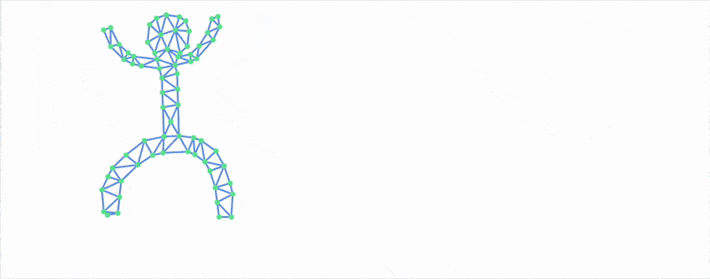

# Many-Body Problem

A well-known and widespread problem in computational physics (and beyond) is working with systems where many objects are connected by pairwise functions.

Similar to the constraint enforcement algorithm, collisions between balls or disks can be resolved by simply shifting their positions. This method isn't completely physically correct, but it can approximately describe situations where particles collide inelastically, losing momentum and energy to heat:

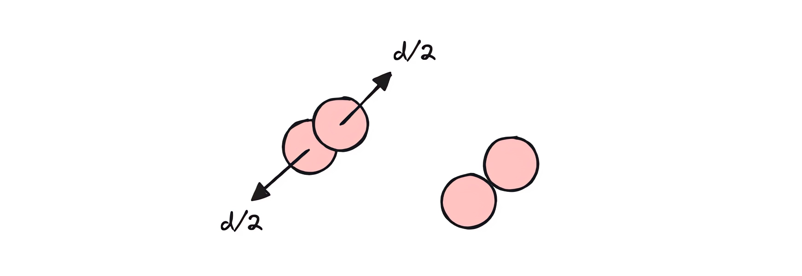

Unfortunately, this also means that the complexity of our algorithm grows as N², where N is the number of particles. As a result, performance problems inevitably arise. There are many ways to deal with this, but the simplest is to compile our small subroutine.

Fortunately, Wolfram Language has a built-in `Compile` expression that allows you to directly translate code either to C or to internal bytecode. Of course, this imposes its own restrictions—for example, the use of strictly typed data structures and a number of other peculiarities:

<WLJSWrapper><wljs-editor display="codemirror" type="Input" editable="true"  >{`compiled = Compile[{
	  {p, _Real, 3}, {c, _Real, 2}, {target, _Real, 1}
	}, Module[{b = p, \\[Delta]t = 0.005, circ = c},
	    Do[
	      
	      (* smooth the rim movement *)
	      
	      circ[[1]] = circ[[1]] + \\[Delta]t (target - circ[[1]]);
	      
	      b[[{1,2}]] = MapThread[If[Norm[#1-circ[[2]]] > 1.0, Module[{
	        u = {#1, #2},
	        vel = (circ[[1]] - circ[[2]])
	      },
	
	        
	        u[[1]] = u[[1]] - vel;
	        
	        
	        With[{n = -Normalize[u[[1]]-circ[[2]]], delta = u[[1]]-u[[2]]},
	          u[[2]] = u[[1]];
	          u[[1]] = u[[1]] -  0.9 n (n.delta);
	        ];
	
	        u[[1]] = u[[1]] + vel;
	
	        If[Norm[u[[1]]-circ[[2]]] > 1.0, (* clamp to the region *)
	
	        u
	      ], {#1, #2}]&, {b[[1]], b[[2]]}] // Transpose;
	
	      b[[3]] = b[[2]];
	      b[[2]] = b[[1]];
	      b[[1]] = 2 b[[2]] - b[[3]] + Table[{0,-1}, {Length[b[[1]]]}] \\[Delta]t \\[Delta]t;
	
	
	    (* Ball collisions *)
	      
	    Do[
	      Do[
	        If[i < j,
	          Module[{pi = b[[1, i]], pj = b[[1, j]], d, dist, n, overlap},
	            d = pj - pi;
	            dist = Norm[d];
	            If[dist < 0.05, (* explicit radius *)
	              n = Normalize[d];
	              overlap = 0.05 - dist;
	              b[[1, i]] -= 0.5 overlap n;
	              b[[1, j]] += 0.5 overlap n;
	            ];
	          ]
	        ],
	        {j, Length[b[[1]]]}
	      ],
	      {i, Length[b[[1]]]}
	    ];
	
	
	      circ[[2]] = circ[[1]];
	      
	    , {10}];
	
	    (* write new rim positions to the end *)
	    b[[-1, 1]] = circ[[1]];
	    b[[-1, 2]] = circ[[2]];
	
	    b
	  ], CompilationOptions -> {"InlineExternalDefinitions" -> True}, 
	    "CompilationTarget" -> "C","RuntimeOptions" -> "Speed"];`}</wljs-editor></WLJSWrapper>

In Wolfram Language, compiled expressions cannot return nested structures, so you have to resort to a trick: serialize the data into a numerical tensor, and then deserialize it back. In this case, this is implemented using `Part`.

The rest is up to us—we just need to plug our function back into the main loop:

<WLJSWrapper><wljs-editor display="codemirror" type="Input" editable="true"  >{`With[{
	  p = Unique["ppp"],
	  toDraw = Unique["ppp"],
	  circ = Unique["ppp"],
	  target = Unique["ppp"],
	  frame = CreateUUID[]
	},
	  p = Table[Exp[-i/80.0]{Sin[i], Cos[i]}, {3}, {i, 100}];
	  toDraw = p[[1]];
	  circ = {{0,0}, {0,0}};
	  target = {0,0};
	
	  EventHandler[frame, Function[Null,
	      With[{
	        c = compiled[Join[p, {p[[3]]}], circ, target]
	      },
	        (* unpack data *)   
	        circ = c[[4, {1,2}]];
	        p = c[[1;;3]];
	        toDraw = p[[1]];
	      ]
	  ]];
	
	  {
	    Graphics[{
	      PointSize[0.03],
	      Circle[circ[[1]] // Offload, 1.0], 
	      Pink, Point[toDraw // Offload],
	      AnimationFrameListener[p//Offload, "Event"->frame]
	    }, 
	      PlotRange->{1.4{-1,1}, 1.4{-1,1}}, 
	      AspectRatio->1, ImageSize->Medium, 
	      TransitionType->None
	    ],
	
	    EventHandler[InputJoystick[], Function[xy, target = xy;]]
	  } // Row
	]`}</wljs-editor></WLJSWrapper>

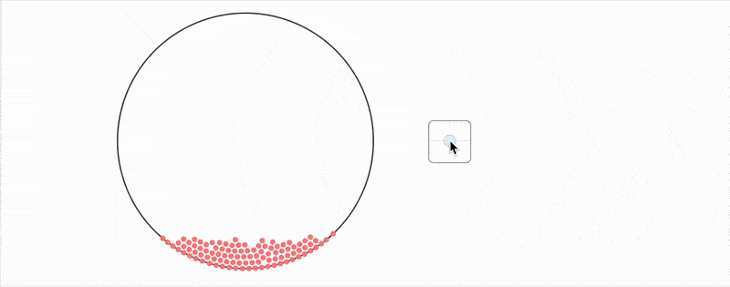

As you can see, you can get pretty far with this set of tools.

Well, hope you learned something and/or had fun today!

## A Note on the Animation

What you saw in [the video](https://www.youtube.com/shorts/6eLUQDEBBHI?feature=share) (YouTube Short) was created entirely using the WLJS Notebook and its built-in Animation Framework utilities.
