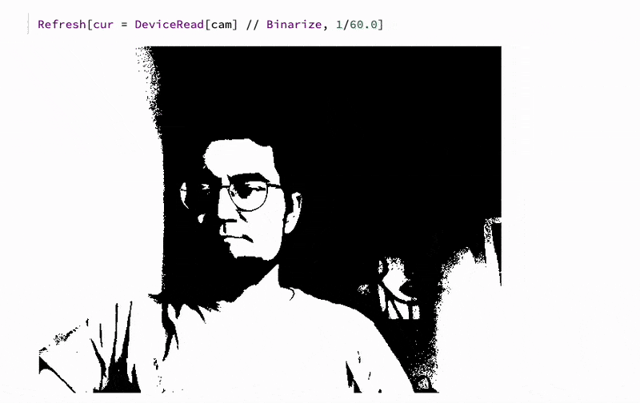
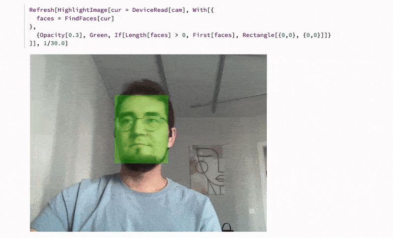

{/* add this script to the body  */}
{/* https://cdn.jsdelivr.net/gh/WLJSTeam/web-components@latest/src/common/app.js */}
<wljs-store json="./attachments/ae290057-00f6-4afb-a426-41c1f9e04df0.txt"></wljs-store>

How to take a photo in WL?

<WLJSWrapper><wljs-editor display="codemirror" type="Input" editable="true"  >{`CurrentImage[]`}</wljs-editor></WLJSWrapper>

<WLJSWrapper><wljs-editor display="codemirror" type="Output"  >{`(*VB[*)(FrontEndRef["00464a90-c955-4c55-8dfe-5f22dfb89cbd"])(*,*)(*"1:eJxTTMoPSmNkYGAoZgESHvk5KRCeEJBwK8rPK3HNS3GtSE0uLUlMykkNVgEKGxiYmJkkWhroJluamuqaJAMJi5S0VF3TNCOjlLQkC8vkpBQAedAV3g=="*)(*]VB*)`}</wljs-editor></WLJSWrapper>

However, there is a better way if you need to stream the data from a camera __continuously__:

<WLJSWrapper><wljs-editor display="codemirror" type="Input" editable="true"  >{`cam = DeviceOpen["Camera"]
	cam["FrameRate"] = 30;`}</wljs-editor></WLJSWrapper>

<WLJSWrapper><wljs-editor display="codemirror" type="Input" editable="true"  >{`RefreshRate[cur = DeviceRead[cam], 1/30.0]`}</wljs-editor></WLJSWrapper>

This should go without any lag. If your device support `60`, change the code accordingly. 

<Callout>
`Refresh` will not force Wolfram Kernel to work faster, than it can deliver even if you set *1/100.0* update interval.
</Callout>

## Basic data-processing
Let's try binarize our images

<WLJSWrapper><wljs-editor display="codemirror" type="Input" editable="true"  >{`Refresh[cur = DeviceRead[cam] // Binarize, 1/30.0]`}</wljs-editor></WLJSWrapper>

One could also try applying neural network processing, for instance, to identify faces. There is a built-in function for it in Wolfram Language Standard Library:

<WLJSWrapper><wljs-editor display="codemirror" type="Input" editable="true"  >{`cur // FindFaces `}</wljs-editor></WLJSWrapper>

<WLJSWrapper><wljs-editor display="codemirror" type="Output" encoded="true"  >{`%7BRectangle%5B%7B190.5%60%2C244.5%60%7D%2C%7B310.5%60%2C397.5%60%7D%5D%7D`}</wljs-editor></WLJSWrapper>

<WLJSWrapper><wljs-editor display="codemirror" type="Input" editable="true"  >{`HighlightImage[cur, {Green, Opacity[0.3], %}]`}</wljs-editor></WLJSWrapper>

<WLJSWrapper><wljs-editor display="codemirror" type="Output"  >{`(*VB[*)(FrontEndRef["d667025f-ba56-4807-ae23-8a12a3dc386b"])(*,*)(*"1:eJxTTMoPSmNkYGAoZgESHvk5KRCeEJBwK8rPK3HNS3GtSE0uLUlMykkNVgEKp5iZmRsYmabpJiWamumaWBiY6yamGhnrWiQaGiUapyQbW5glAQB9axVt"*)(*]VB*)`}</wljs-editor></WLJSWrapper>

Let's apply this in real-time:

*Make sure to stop other widgets by cleaning the output cells*

<WLJSWrapper><wljs-editor display="codemirror" type="Input" editable="true"  >{`Refresh[HighlightImage[cur = DeviceRead[cam], With[{
	  faces = FindFaces[cur]
	}, 
	  {Opacity[0.3], Green, If[Length[faces] > 0, First[faces], Rectangle[{0,0}, {0,0}]]}
	]], 1/30.0]`}</wljs-editor></WLJSWrapper>

Here we keep the reactangle even if there is no faces detected. This helps JIT to avoid deoptimizations of the output expression, since the number of primitives stays consistent.