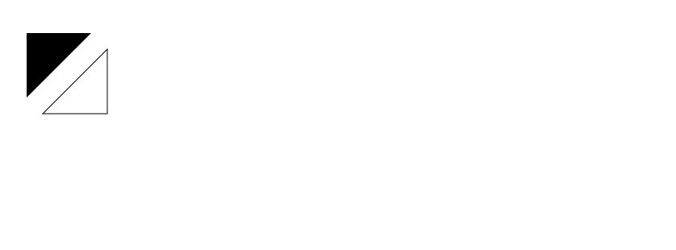
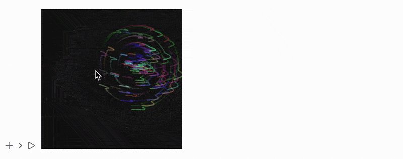

> __Canvas2D__ is an optional package used to bridge [HTML Canvas API](https://www.w3schools.com/tags/ref_canvas.asp) with Wolfram Language allowing low-level raster realtime render.

## Setting up
Firstly, you need to load this package into any context except `Global`:

```wolfram
Needs["Canvas2D`"->"ctx`"];
```

To create canvas context use the following constructor:

```wolfram
context = ctx`Canvas2D[]
```

Then to display and render graphics in the given context - provide [Image](./../../Image/Image):

```wolfram
Image[context, ImageResolution->{300,300}]
```

## Draw basic shapes
Created context is used to pipe commands to Canvas API (and then internally to GPU). Let's make basic shapes:

```wolfram
ctx`BeginPath[context];
ctx`MoveTo[context, {25, 25}];
ctx`LineTo[context, {105, 25}];
ctx`LineTo[context, {25, 105}];
ctx`Fill[context];

ctx`BeginPath[context];
ctx`MoveTo[context, {125, 125}];
ctx`LineTo[context, {125, 45}];
ctx`LineTo[context, {45, 125}];
ctx`ClosePath[context];
ctx`Stroke[context];

(* Send the buffer of commands *)
ctx`Dispatch[context];
```
<div className='invertColor'>



</div>

API allows to make gradients and change filling colors as well:

```wolfram
(* top-left quarter *)
ctx`SetFillStyle[context, "#FD0"];
ctx`FillRect[context, {0, 0}, 2{75, 75}];

(* top-right quarter *)
ctx`SetFillStyle[context, "#6C0"];
ctx`FillRect[context, 2{75, 0}, 2{75, 75}];

(* bottom-left quarter *)
ctx`SetFillStyle[context, "#09F"];
ctx`FillRect[context, 2{0, 75}, 2{75, 75}];

(* bottom-right quarter *)
ctx`SetFillStyle[context, "#F30"];
ctx`FillRect[context, 2{75, 75}, 2{75, 75}];

ctx`SetFillStyle[context, "#FFF"];

ctx`SetGlobalAlpha[context, 0.2];

Do[
  ctx`BeginPath[context];
  ctx`Arc[context, 2{75, 75}, 2 10 + 2 10 i, 0, 2.0 π];
  ctx`Fill[context];
, {i, 0, 6}];

ctx`Dispatch[context];
```

<div className='invertColor'>


</div>

## Animation
Passing `Image` to [`EventHandler`](./../../Misc/Events) expression allows to capture user events: for example mouse tracking feature. 

[AnimationFrameListener](./../../Graphics/AnimationFrameListener) is also extended to work with canvas `context` symbols, i.e:

```wolfram
AnimationFrameListener[context_, "Event"->event_String]
```

Let's make some complex animations!

<details>
<summary>Handler generator function</summary>

```wolfram

SetAttributes[handler, HoldRest]

handler[c_, tcursor_, {width_ height_}] := Module[
  {
  w = width, h = height,               (* initial canvas size *)
  n = 101,    
  cursor = tcursor,
  (* number of particles *)
  rotSpeed = 0.02,                  (* angular velocity *)
  particles,
  theta, rad, col, old
  },
  
  (* center point *)
  cx = w/2;
  cy = h/2;
  
  (* semi-transparent drawing *)
  ctx`SetGlobalAlpha[c, 0.5];
  
  (* initialize particles: random angle, radius, colour *)
 particles = Table[
   {
    RandomReal[{0, 2 π}], 
    RandomReal[{0, 150}], 
    ctx`ColorToString[RandomColor[]],
    cursor
   },
   {n}
 ];

  Function[Null,
      cursor = cursor + 0.1 (tcursor - cursor);
      
      ctx`SetFillStyle[c, {Black, Opacity[0.05]}];
      ctx`FillRect[c, {0, 0}, {w, h}];
      
      (* draw each particle: from last cursor pos to new one *)
      Do[
        particles[[i, 1]] += rotSpeed;
        {theta, rad, col, old} = particles[[i]];
        Module[{newPos},
          newPos = cursor + {Cos[theta], Sin[theta]} rad;
          
          ctx`BeginPath[c];
          ctx`SetLineWidth[c, 4];
          ctx`SetStrokeStyle[c, col];
          ctx`MoveTo[c, old];
          ctx`LineTo[c, newPos];
          ctx`Stroke[c];

          particles[[i,4]] = newPos; 
        ],
        {i, n}
      ];
      ctx`Dispatch[c];
  ]
]


```


</details>

```wolfram
aContext = ctx`Canvas2D[];
tcursor = {250,250};

EventHandler["frame", handler[aContext, tcursor, {500,500}]];
  EventHandler[
    Image[aContext, ImageResolution->{500,500}, Epilog->{
      AnimationFrameListener[aContext, "Event"->"frame"]
    }], {
      "mousemove" -> Function[xy, 
        tcursor = {xy[[1]], xy[[2]]}
      ]
  }
]
```

<div className='invertColor'>



</div>

