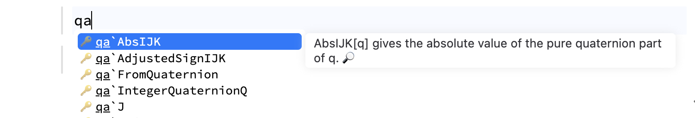

An input cell is a multi-tool. By default, it assumes Wolfram Language as input if no other patterns are found in the first line:

<WLJSWrapper>
<div className="code-input"/>
<wljs-editor type="Input" display="codemirror">{`1+1`}</wljs-editor>
</WLJSWrapper>

<WLJSWrapper>
<wljs-editor type="Output" display="codemirror">{`2`}</wljs-editor>
</WLJSWrapper>


<Callout type="idea">
Read our fast-track introduction on Wolfram Language at [that page](./../Wolfram-Language)
</Callout>

<Callout>
If an output is too large, it may be truncated or converted into a temporary symbol to reduce editor load. This can be adjusted in the editor's settings.
</Callout>

## Morph Output Cell into Input
If you modify a Wolfram Language __output cell__, it will automatically be converted into a new __input cell__.

## History of evaluation
You can access the last evaluated expresion using either `Out[]` symbol or `%`, i.e.

```wolfram
1 + 1;
% - 1
```

It also works across different cells. Note, that unlike Mathematica, the output is preseved only for the latest evaluation.

## Information on symbols
Evaluate

```wolfram
?Plot
```

to get a structured output on the properties of a given symbol. Use `??` to get extra information. To discover symbols within a given context (a package for instace) - use `Names[""]`

```wolfram
Needs["Quaternions`"];
Names["Quaternions`*"] // TableForm 
```

or in general:

```wolfram
Names["*Plot*"]
```

## Auto-upload Files
Drag and drop files into the editor or paste media from the clipboard

## Syntax Highlighting & Symbol Tracking
Wolfram Language autocomplete and highlighting can be extended using external packages.

Once a symbol is defined in the `Global`` context of a Wolfram Kernel session, it appears in the autocomplete window and is shared across open notebooks.

At startup, the Wolfram Kernel loads all imported packages, reads `::usage` directives for defined symbols.

### Autocomplete for loaded packages
You can enable periodic checking in the editor's settings (see: <small>Settings, Editor Settigns, Autocomplete, Enable active rescanning of definitions when Get or Needs called</small>) for newly loaded packages (not user-defined symbols) information upon `Get` or `Needs` commands.

Context aliases are also supported, i.e. this will be picked as well:

```wolfram
Needs["Quaternions`"->"qa`"]
```

<div className="invertColor">

</div>

<Callout>
    Note, that there is a slight delay between rescans - a few seconds
</Callout>

## Access to Documentation
Click the 🔎 icon in the autocomplete window to open the documentation for a symbol in a new tab.

<Callout type="idea">Opening documentation for another symbol will not create an extra window, but it will refresh the existing one. Therefore you can safely arrange the windows __in a fixed layout__</Callout>
