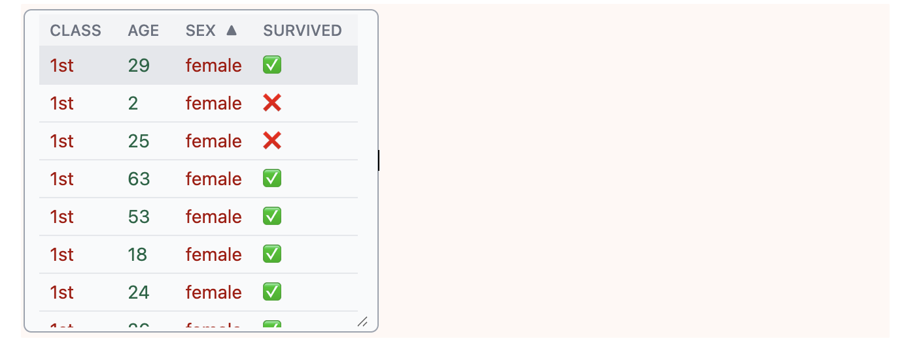

`Tabular[data]` represents a structured tabular dataset, providing an efficient way to work with row-column data.

`Tabular[data, headers]` creates a tabular object with specified column headers.

## Examples

Create a basic tabular object:

```wolfram
Tabular[{{1, 2, 3}, {4, 5, 6}}]
```

Create a tabular object with column headers:

```wolfram
Tabular[{{1, x, Today}, {4, y, Tomorrow}}, {"col1", "col2", "col3"}]
```

Use with entity data:

```wolfram
EntityValue[
  EntityClass["Book", "DuneBooks"], 
  {"FirstPublished", "Author", "Image"}, 
  "Tabular"
]
```

## Output forms
Visual representation of `Tabular` supports:

- lazy loading
- progressive rendering
- sorting (both: using Kernel and frontend)

Click on one of the headers to sort the tabular content.

## Output forms
Visual representation of `Dataset` supports:

- lazy loading
- sorting (both: using Kernel and frontend)

Click on one of the headers to sort that dataset content

<div class="invertColor">



</div>

Something isn't working? [Report](https://github.com/WLJSTeam/wljs-notebook/issues) an issue.

Please visit the official [Wolfram Language Reference](https://reference.wolfram.com/language/ref/Tabular.html) for more details.
