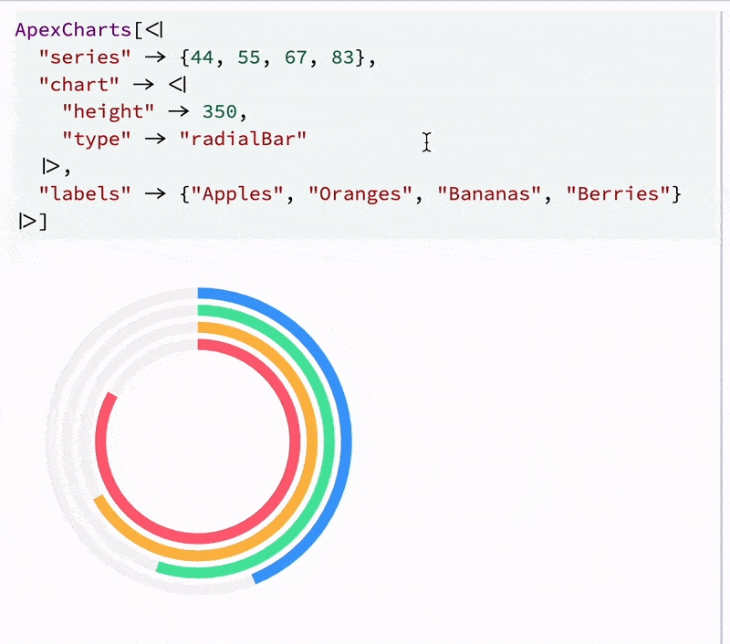

<Callout>
A ready to-go example is in [this repository](https://github.com/WLJSTeam/wljs-plugin-example-1)


Clone it to `<Documents>/WLJS Notebooks/Extensions/` using:

```bash
git clone https://github.com/WLJSTeam/wljs-plugin-example-1
```

Then restart WLJS Notebook.
</Callout>

<Callout>
Folder name of the extension must match with its __unique name__
</Callout>

Here is the simples example on what you can do with extensions. Why not to add [ApexCharts](https://apexcharts.com/)? They looks beautiful and already animated. What we need

- Kernel package, which implements `ApexCharts[]` symbols
- Javascript bundle, which should include *ApexCharts* and bridge it with Wolfram Kernel using [frontend symbols](./../../../Advanced/Frontend-functions/Overview)

__Summary__ what will be done
- package for *evaluation kernel*, which adds a new symbol `ApexCharts`
- Javascript module, which renders the content of `ApexCharts` expression

## Preparations
Use [wljs-plugin-template](https://github.com/WLJSTeam/wljs-plugin-template) template and create a new repository or use a ready-to-go example given in the heading of this tutorial.

Then edit the content of `package.json`

```json title="package.json"
{
    "name": "wljs-plugin-example-1",
    "version": "0.0.1",
    "scripts": {
        "build": "node --max-old-space-size=8192 ./node_modules/.bin/rollup --config rollup.config.mjs"
    },
    "description": "An example plugin for WLJS Notebook. Library functions",
    "wljs-meta": {
        "kernel": [
            "src/Kernel.wl"
        ],
        "js": "dist/kernel.js",
        "minjs": "dist/kernel.min.js",
        "priority": 5000,
        "category": "Notebook Extensions"
    },
    "repository": {
        "type": "git",
        "url": "https://github.com/WLJSTeam/wljs-plugin-example-1"
    },
    "dependencies": {
        "@rollup/plugin-commonjs": "^25.0.4",
        "@rollup/plugin-json": "^6.0.0",
        "@rollup/plugin-node-resolve": "^15.2.1",
        "@rollup/plugin-terser": "^0.4.4",
        "rollup": "^3.21.6"
    }
}
```

By the default a template implies, that we will use *rollup.js* for bundling. Run in the root directory of this package

```bash
npm i
```

And then install `apexcharts`

```bash
npm i apexcharts
```

## Kernel package
Create a new file in `src/Kernel.wl`, which is going to be our package for evaluation kernel. Looking at ApexCharts API, it is easy to imagine the way how it can be used

```wolfram
ApexCharts[<|
    "series" -> {44, 55, 67, 83},
    "labels" -> {"Apples", "Oranges", "Bananas", "Berries"},
    "chart" -> <|
        "height" -> 350, 
        "type" -> "radialBar"
    |>
|>]
```

or any other way, one can pre-transform the data and use intermediate symbols. Following the simplest path, we write to our Kernel file

```wolfram title="src/Kernel.wl"
BeginPackage["CoffeeLiqueur`Extensions`ApexCharts`"]

(* Public context *)

ApexCharts::usage = "ApexCharts[a_Association] constructor"

Begin["`Private`"]


End[]
EndPackage[]
```


Now we can think about `ApexCharts` as if it was a new entity, and the interpretation of this entity will be our graphs. To draw actual graphs instead of a symbolic representation we need to define an output form. For that [ViewBox](./../../../Formatting/Low-level/ViewBox) comes in hand, which is provided in ``CoffeeLiqueur`Extensions`Boxes``` context. We define an internal symbol, that will be used for rendering:

```wolfram
BeginPackage["CoffeeLiqueur`Extensions`ApexCharts`", {
    "CoffeeLiqueur`Extensions`Boxes`"
}]

(* Public context *)

ApexCharts::usage = "ApexCharts[a_Association] constructor"

Begin["`Private`"]

(* Output forms *)

iApexCharts;

ApexCharts /: MakeBoxes[a: ApexCharts[data_Association], StandardForm ] := With[{},
    ViewBox[a, iApexCharts[data]]
]

End[]
EndPackage[]
```

First `a` will be an underlying expression (behind the graph), while `iApexCharts` is going to be rendered instead of it. However, if you try to evaluate this with defined output form, you get a similar error

```
BROKEN BOX
```

`ViewBox` tries to evaluate a non-existing frontend symbol `iApexCharts` or more specifically ``CoffeeLiqueur`Extensions`ApexCharts`Private`iApexCharts``.

<Callout type="tip">
As a rule: do not expose internal symbols in packages to the public context
</Callout>


## Javascript Library
Now we need to define `iApexCharts` symbol on the frontend. The idea is simple: take the provided data and using Apex API render a graph on the given DOM element. This DOM element will be provided by `ViewBox` behind the scenes

```js title="src/kernel.js"
let ApexCharts;

core['CoffeeLiqueur`Extensions`ApexCharts`Private`iApexCharts'] = async (args, env) => {
    if (!ApexCharts) ApexCharts = (await import('apexcharts')).default; //lazy loading

    const options = await interpretate(args[0], env);
    const chart = new ApexCharts(env.element, options);
    chart.render();
}
```

Our association will be in `options` object after the interpretation. 

<Callout type="idea">
Implement dynamic imports (lazy) if possible
</Callout>

Now we need to bundle this

```bash
npm run build
```

After the restart, it should work with our extension like a charm

<div className="invertColor">



</div>

However, after several evaluation dead instances of `ApexCharts` will pile up as a garbage in Javascript memory. It is recommended to properly remove them. For that we need to identify each instance of `ApexCharts` and assign destructor function. We use [instanced frontend symbools](./../../../Advanced/Frontend-functions/Overview), which behave like classes

```js title="src/kernel.js"
let ApexCharts;

const apex = async (args, env) => {
    if (!ApexCharts) ApexCharts = (await import('apexcharts')).default; //lazy loading

    const options = await interpretate(args[0], env);
    const chart = new ApexCharts(env.element, options);
    chart.render();

    env.local.chart = chart;
}

apex.destroy = (args, env) => {
    env.local.chart.destroy();
} 

apex.virtual = true

core['CoffeeLiqueur`Extensions`ApexCharts`Private`iApexCharts']  = apex;
```

Now we need to bundle this

```bash
npm run build
```


## Polishing

We might make a few more tweaks. If the `ApexCharts` expression becomes too large, it can slow down the editor. For this reason, we use [Frontend Objects](./../../../Frontend-Objects/CreateFrontEndObject), which allow the data to be stored separately as a JSON blob. From the kernel’s perspective, there is no visible difference: synchronization, packing, and unpacking are handled automatically.

```wolfram
BeginPackage["CoffeeLiqueur`Extensions`ApexCharts`", {
    "CoffeeLiqueur`Extensions`Boxes`",
    "CoffeeLiqueur`Extensions`FrontendObject`"
}]

(* Public context *)
```

```wolfram
ApexCharts /: MakeBoxes[a: ApexCharts[data_Association], form: StandardForm] := With[{
    o = CreateFrontEndObject[data]
}, {
    odata = MakeBoxes[o, form],
    name = ToString[ApexCharts, InputForm]
},
    ViewBox[RowBow[{name, "[", odata, "]"}], iApexCharts[o]]
] /; ByteCount[a] > 1024*4
```

Here, we manually construct the inner expression using low-level boxes. Note that we convert `ApexCharts` to a string instead of writing `"ApexCharts"` directly. This is required when the package is not imported into the global context, because the full symbol path may be used instead, for example `CoffeeLiqueur`Extensions`ApexCharts`ApexCharts`.

In this case, `odata` is a [FrontEndRef](./../../../Frontend-Objects/FrontEndRef), which expands to the original association `data` during the next evaluation. The variable `o` is a [FrontEndExecutable](./../../../Frontend-Objects/FrontEndExecutable): it is a reference to the same compressed expression `data`, but it can only be evaluated on the frontend. It is picked up by the `iApexCharts` function and rendered into the DOM element that covers the visible `ApexCharts` expression.

This complexity gives us full control over what is visible and what remains underneath. We want to avoid either layer leaking into the other. As a result, if you copy the raw expression from the output cell into a plain text editor, it may look like this:

```text
(*VB[*)(ApexCharts[FrontEndRef["someUUID"]])(*,*)(*"1:eJxTTMo....=="*)(*]VB*)
```

Here, the comment containing `1:eJxTTMo` stores the encoded form of `iApexCharts[FrontEndExecutable["someUUID"]]`. If you evaluate this cell again, `FrontEndRef[]` automatically expands back into the original data association, and the whole process repeats.

This makes the expression copyable, valid for reevaluation and mutation, and compact in the editor. Frontend objects are stored in the notebook, so they are not lost if the kernel dies.

Another improvement can be `WLXForm`, if we decide to use those charts on slides or markdown cells. For all WLX-like cells we only need to pass a frontend object instance:

```wolfram
ApexCharts /: MakeBoxes[a: ApexCharts[_Association], form: WLXForm ] := With[{o = CreateFrontEndObject[a]},
    MakeBoxes[o, form]
]
```

