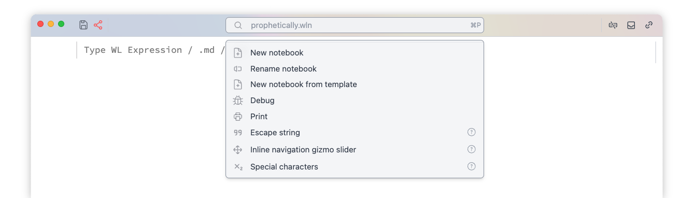
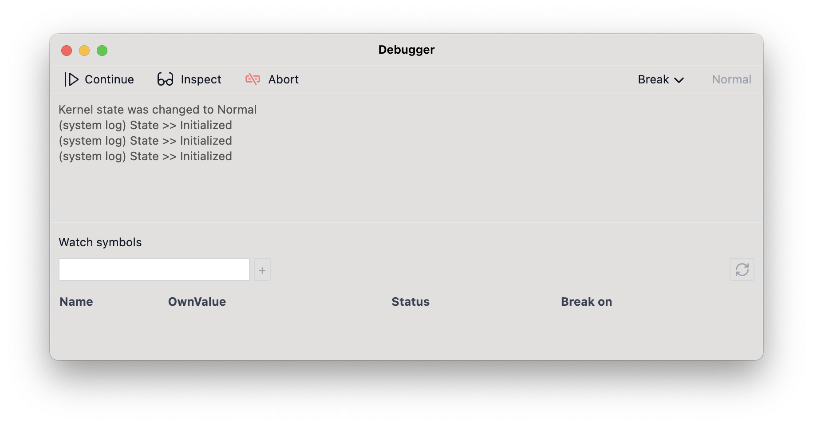

WLJS Notebook is fully accessible from the keyboard. One of the most important key combinations to know is <kbd>Ctrl-P</kbd> or <kbd>⌘-P</kbd>, which brings up the Command Palette. From here, you have access to many small helper utilities, toolboxes, shortcuts: 


<div className='relative group'>
<div className="absolute -inset-0.5 bg-gradient-to-r from-fd-primary/50 to-purple-500/50 rounded-lg blur blur-3xl opacity-5 group-hover:opacity-10 transition duration-500" />
<div className="invertColor">

</div>
</div>

import { Share2, CircleQuestionMark } from 'lucide-react';

Most of the utilities are notebooks themselves, which are evaluated in an isolated context whenever you click on a command palette item. You can find the information on each by clicking on <span className='inline-flex' ><CircleQuestionMark style={{height:"1rem"}}/></span> icon, that will open the source notebook.

<Callout>User's utilities are stored in `~/Documents/WLJS Notebooks/User palette/`</Callout>


## Shortcuts
Type any of those words to call the action:

<Card>

- __New notebook__ - create a new notebook (in a new window)
- __New notebook from template__ - create a new notebook from a template
- __Rename notebook__ - rename current notebook
- __Debug__ - attach a debugger
- __Print__ - export an entire notebook to PDF

<Callout>Notebooks can be edited outside WLJS Notebook app and will be automatically hot-reloaded</Callout>

</Card>

## Utilities
Every tool is a normal notebook, which is evaluated in the background and manipulates your working notebook, creating temporal cells whenever you call it from the palette. 

import { Accordion, Accordions } from 'fumadocs-ui/components/accordion';


### Insert matrix
Creates a small widget in the cell below the focused one that helps to generate and insert matrices (lists of lists).

<Accordions>
<Accordion title="Demonstration">

<LazyAutoplayVideo url={"/palette-matrix.mp4"}/>

</Accordion>
</Accordions>

Place a cursor to the desired place in the cell and click <small>Insert</small> on the widget.


### Special characters
Adds a toolbar to the notebook with special characters and snippets for writing nice-looking integrals, sums, and other constructs. 

<Accordions>
<Accordion title="Demonstration">

<LazyAutoplayVideo url={"/palette-chars.mp4"}/>

</Accordion>
</Accordions>

Select the piece of code and apply operation from the toolbar. Or place a cursor to a cell and insert a symbol/expression from the toolbar.

### Format text
Adds a toolbar to the notebook for formatting code (font size, color, background, font face). 

<Callout>The widget automatically detect the cell type (Wolfram, Markdown or HTML) of the selected text and adjust wrapping accordingly</Callout>

Select the piece of code and apply operation from the toolbar. 

### Upload ASCII data file
Creates a widget with importing wizard allowing to import CSV/TSV/DAT files, strip headers and insert a file to a cell as an iconized expression

### Upload file
Basic widget for uploading files

### Escape string
A helper tool to safely insert strings containing double quotes or other "unsafe" sequences. It will prompt a user to enter text and print a cell with the result.

### Beautify code 
Formats selected code or entire Wolfram input cell and attempts to apply syntax sugar if possible. If it fails, try <small>Format code</small> instead.

<Accordions>
<Accordion title="Demonstration">

<LazyAutoplayVideo url={"/palette-beauty.mp4"}/>

</Accordion>
</Accordions>

Select the code or place a cursor in the desired cell and call this tool from the command palette.

### Format code 
Formats selected code or entire Wolfram input cell. Action is the same as the previous one, but syntactic sugar is not applied.

### Find in cells
Creates a floating search window and tries to find given expression in all visible cells of the notebook.

<Callout>You can still use a standard search box locally in the individial cells with <kbd>Ctrl/⌘-F</kbd></Callout>

### Show options
Attempts to discover the possible options of the given symbol in the cell and present them as an interactive table.

<Accordions>
<Accordion title="Demonstration">

<LazyAutoplayVideo url={"/palette-options.mp4"}/>

</Accordion>
</Accordions>

Start typing:

```wolfram
Plot[x, {x,0} 
```

and then call this widget. It will automatically __find the unclosed bracket__ and fetch the head `Plot`. Click on the desired options in the table to insert them later, once you click on the green mark icon.

### Notebook directory
Opens a notebook directory using OS's explorer.

<Callout type="warning">This will only work with WLJS desktop application</Callout>

### Inline navigation helper (Slider)
A helper tool that creates a syntactic sugar inline widget on a selected number. It is used in 2D and 3D graphics or any other expression that supports [Offload](./../Interpreter/Offload) aka live-updates:

<Accordions>
<Accordion title="Demonstration">

<LazyAutoplayVideo url={"/palette-slider.mp4"}/>

</Accordion>
</Accordions>

For example: select a number you want to manipulate and call this tool. It will create an inline widget with a slider. Evaluate your cell, manipulate the slider, and once you are satisfied, click on the mark icon.

<Callout type="idea">Check the reference for primitives, that support live updates with `Offload`</Callout>

### Inline navigation helper (Drag)
A helper tool that creates a syntactic sugar inline widget on a selected pair `{x,y}` or triplet of numbers `{x,y,z}`. It is used in 2D and 3D graphics that support [Offload](./../Interpreter/Offload) aka live-updates:

<Accordions>
<Accordion title="Demonstration">

<LazyAutoplayVideo url={"/palette-drag.mp4"}/>

</Accordion>
</Accordions>

For example: select a parameter's initial value you want to manipulate and call this tool. It will create an inline widget with a display and place a dragging gizmo on your 2D or 3D canvas. Evaluate your cell, drag the red dot (or 3D sphere), and once you are satisfied, click on the mark icon.

<Callout type="tip">

If your dragging point overlaps with an object, offset the coordinates before applying this tool:

<WLJSWrapper>
<div className="code-input"/>
<wljs-editor lazy="true" type="Input" display="codemirror">{`
Text["Hello World", Offload[{-0.3,-0.3} + (*BB[*)({0,0})(*,*)(*"1:eJxTTMoPSmNkYGAoZgESHvk5KRAeB5AILqnMSXXKr0hjgskHleakFnMBGU6JydnpRfmleSlpzDDlQe5Ozvk5+UVFDGDwwR6dwcAAAAHdFiw="*)(*]BB*)]]
`}</wljs-editor></WLJSWrapper>

Apply dragging tool on highlighted list. Why we used `Offload` - check [this guide](./Dynamic).

</Callout>

### Inline navigation helper (Joystick)
A helper tool that creates a syntactic sugar inline widget on a selected pair `{x,y}`. It is used in 2D and any other expression that supports [Offload](./../Interpreter/Offload) aka live-updates and accepts a pair of numbers:

<Accordions>
<Accordion title="Demonstration">

<LazyAutoplayVideo url={"/palette-joy.mp4"}/>

</Accordion>
</Accordions>

For example: select a parameter's initial value you want to manipulate and call this tool. It will create an inline widget with a joystick. Evaluate your cell, manipulate the joystick, and once you are satisfied, click on the mark icon.

### Take a picture
Creates a widget, which uses any available video recording device to take a picture and place it as `Image` to a notebook's cell.

### Record voice
Creates a widget which uses any available audio recording device to record live audio and place it to a cell as `Audio` object.

### Crop image
Select an image or image-producing expression in your cell and call this tool. It will evaluate the selected expression and append an interactive widget allowing to do rectangular cropping.

### Copy InputForm
Select the code in the cell and call this tool. It will strip all syntactic sugar from it and copy the pure `InputForm` of the expression to your clipboard.

## Debugger
Debugger can be called from the top <small>Misc</small> menu or from the command palette. It is a tool that attaches to a notebook and a working kernel to intercept the evaluation process and monitor symbol changes.


__What it can do:__

<Card>

- Interrupt cell evaluation and possibly inspect the intermediate results
- Track changes in symbols values
- Break on assertions or symbol changes 
- See low-level system log

</Card>


__What it cannot do:__

<Card>

- Profile and trace evaluation
- Step in / step out

</Card>

Let's have a look at the interface:

<div className='relative group'>
<div className="absolute -inset-0.5 bg-gradient-to-r from-fd-primary/50 to-purple-500/50 rounded-lg blur blur-3xl opacity-5 group-hover:opacity-10 transition duration-500" />
<div className="invertColor">

</div>
</div>

__Inspect__ is a central mode for debugging.

### Inspecting Mode
It stops the current execution and allows you to interact with any other cells in the sub-session, enabling you to check the status of various symbols. You can write and evaluate other cells in `Inspect` mode.

For example, evaluate this one:

```wolfram
Do[k = i; Pause[1], {i, 100}];
```

Then switch to `Inspect` mode; it will pause the evaluation. Now, you can check the state of the `k` symbol by running a new cell with:

```wolfram
k
```

<Callout>
You can always continue execution from this mode by clicking <small>Continue</small> until the next possible break. All transitions take time and depend on the current kernel occupancy.
</Callout>

### Watching Symbols
You can add a symbol to a tracking list to monitor its `OwnValue` in real-time automatically. It won't interrupt your execution unless you enable the checkbox for that option.

<Callout>
Live updates are supported only for assignments, i.e., when `symbol = *newValue*`. If you mutate a part of a `List`, it won't trigger an update.
</Callout>

### Breakpoints
In Wolfram Language, traditional breakpoints are difficult to implement since there is no *source code file* in the classical sense. Everything is an expression, and a breakpoint must be an expression as well.

There are two sources for breaking events, both of which immediately switch the kernel to <small>Inspecting Mode</small>.

#### Asserts
First, __enable breaking on assertions__ from the dropdown menu in the top bar of the debugger. Then, whenever execution encounters `False` in an [Assert](./../Misc/Assert), it will break.

For example:

```wolfram
Do[k = i; If[i > 6, Assert[False, "Hey"]]; Pause[1], {i, 100}];
```

This code will break automatically after 6 seconds. In <small>Inspect</small> mode, evaluating `k` will return `7`.

If you track the `k` symbol at the same time, you will see it changing in the debugger window.

#### Symbols
When a symbol is assigned a new value, it generates an event in the debugger. Use the <small>Break on</small> checkbox to enable breaking.

For example:

```wolfram
Do[k = i; If[i > 6, test = Now]; Pause[1], {i, 100}];
```

This code will break after 6 iterations.


## MCP Server [#mcp-server]
Model-Contex-Protocol server is always running in the background allowing LLM agents to interact with the notebook, run, edit, create cells and run code directly on the kernel. By the default it is available at:

This is a __streaming__ (HTTP) MCP server with no authentification and `/` endpoint:

```bash
http://127.0.0.1:20564/
```

It also provides specific skills for various cell types, documentation and fits into 500-600 tokens at the start. 

We carefully crafted our tools, all responces to avoid unnecessary information noise, long random UIDs providing the bare mimimum data required to inspect, edit and add cells.

<Callout type="note">
This feature is only available for WLJS Desktop application
</Callout>

### Installation
You can add it to your favourite coding tool as follows:

__Claude Code__

```bash
claude mcp add --transport http --scope user wljs-notebook http://127.0.0.1:20564/
```

__Codex__

```bash
codex mcp add wljs-notebook --url http://127.0.0.1:20564/
```

or add to it your `config.toml` as

```toml
[mcp_servers.wljs_notebook]
url = "http://127.0.0.1:20564/"
```

### Tips

- Models are not allowed to create notebooks, but can find the "focused one"

- Mention `focused cell` in the prompt to avoid model to spend tokens for searching the whole notebook.

- Mention `consult docs` in the prompt for weaker models to force them checking the documentation on different cell types or features of interactive evaluation in Wolfram language cells.

- Use smaller models for grammar corrections, primitive tasks, i.e. Haiku 3.0 for example

- Anthropic models are generally better trained on Wolfram Language and their training data includes WLJS ecosyste

- It is cheaper to firstly find focused notebook, then focused cell instead of using `notebook context` path, that will list all cells and their content (only first line)


### Documentation for LLM
If needed MCP searches the documentiation on a given symbol using LLM-friendly compilation of our entire website: https://wljs.io/llms-full.txt


## CLI

WLJS Notebook includes a small command-line interface for evaluating code, opening notebooks, inspecting the active notebook, editing cells, evaluating cells, and consulting local WLJS/Wolfram documentation.

Most notebook-related commands print JSON to stdout. Errors are printed to stderr and return a non-zero exit code.

### Basic usage

```bash
wljs .
```

Open the current directory in WLJS Notebook.

```bash
wljs path/to/file
```

Open a directory or a file by path

```bash
wljs 'path/to/file'
wljs 'path/to/file/notebook.wln'
```

Use `''` to shield white-space characters

```bash
wljs new
```

Create a new notebook

```bash
wljs wl '<wolfram-expression>'
```

Evaluate code in a ready kernel (akin to `wolframscript`), without creating a notebook cell.

Examples:

```bash
wljs wl 'Total[Range[100]]'
wljs wl 'Plot[Sin[x], {x, 0, 10}]'
```

Here are some aliases:

```bash
wljs code 'Total[Range[100]]'
wljs c 'Plot[Sin[x], {x, 0, 10}]'
wljs -c 'Plot[Sin[x], {x, 0, 10}]'
```

Note, that any such evaluation temporary changes the working directory to one, where a script was called. Here is analog of `ls` or `dir` command:

```bash
wljs -c 'FileNames["*"]'
```

### Notebook inspection


```bash
wljs new
```

Create empty notebook.

```bash
wljs notebooks
```

List notebooks known to the application.

```bash
wljs focused
```

Print the id/hash of the currently focused notebook.

```bash
wljs context
wljs context --Notebook <notebook>
```

Print notebook context, including notebook id, cell list, and focused cell/selection when available. If `--Notebook` is omitted, the focused notebook is used.

```bash
wljs cells <notebook>
```

List cells in a notebook.

```bash
wljs focused-cell <notebook>
```

Print the currently focused cell and selected line range.

```bash
wljs lines <cell> <from> <to>
```

Read an inclusive, 1-indexed line range from a cell.

Example:

```bash
wljs lines cell123 1 40
```

Print the full cell content bypassing any shortening or formatting tricks normally done in the notebook:

```bash
wljs full <cell>
```

### Documentation

```bash
wljs docs <query>
```

Consult bundled WLJS skill docs first, then local Wolfram Language docs.

Useful queries include:

```bash
wljs docs javascript
wljs docs html
wljs docs markdown
wljs docs mermaid
wljs docs slides
wljs docs dynamics
wljs docs Manipulate
wljs docs EventHandler
wljs docs Offload
wljs docs Plot
```

### Editing cells

```bash
wljs add <notebook> --content <text|@file|-> [--after <cell>] [--before <cell>] [--eval]
```

Add a new input cell.

Examples:

```bash
wljs add notebook123 --content-escaped '.md\none-line markdown'
wljs add notebook123 --content @example.wl
printf '.md\nHello World\n' | wljs add notebook123 --content - --eval
```

Use `--content-escaped` for converting `\n` to new lines.

Use `--after` or `--before` to choose where the new cell is inserted. These options are mutually exclusive.

Use `--eval` to evaluate the new cell after adding it.

```bash
wljs set-lines <cell> <from> <to> --content <text|@file|->
```

Replace an inclusive, 1-indexed line range in an input cell.

Example:

```bash
wljs set-lines cell123 3 5 --content 'replacement text'
```

```bash
wljs insert-lines <cell> <after> --content <text|@file|->
```

Insert content after a line. Use `0` to insert at the beginning.

Example:

```bash
wljs insert-lines cell123 0 --content '.md'
```

```bash
wljs delete-cell <cell>
```

Delete an input cell. Deleting an input cell also deletes its outputs.

### Evaluation

```bash
wljs eval <cell>
```

Evaluate an input cell. Evaluation creates output cells.

```bash
wljs project <cell>
```

Project an input cell into a standalone window.


### Content input

The `--content` option supports three forms.

#### Inline literal text

```bash
wljs add notebook123 --content 'one line'
```

Inline content is passed literally. A string like `\n` is not converted into a newline.

#### File input

```bash
wljs add notebook123 --content @example.wl
```

Reads content from `example.wl`.

#### Standard input

```bash
printf '.md\nHello World\n' | wljs add notebook123 --content -
```

or:

```bash
wljs add notebook123 --content - <<'EOF'
.md
Hello World
EOF
```

This is the recommended form for multiline content.

### Cell type markers

Cell type is determined by the first line of the input cell.

| First line | Cell type        |
| ---------- | ---------------- |
| `.md`      | Markdown         |
| `.html`    | HTML             |
| `.js`      | JavaScript       |
| `.mermaid` | Mermaid diagram  |
| `.slide`   | RevealJS slide   |
| no marker  | Wolfram Language |

Example Markdown cell:

```bash
wljs add notebook123 --content - --eval <<'EOF'
.md
# Hello World

This is a Markdown cell.
EOF
```


## Printing option
Locate <small>Print</small> from the <small>File</small> menu or from the command palette to print an entire notebook as PDF.

<Callout>This feature requires WLJS desktop application and will not work from a web-browser</Callout>

### Page breaks
Use [Markdown cell](./../Cell-types/Markdown) with `PageBreakAbove` or `PageBreakBelow` symbols to force page breaks, i.e.:

```markdown
.md

<PageBreakAbove/>
```


## Application styles

You can apply custom CSS styles to all notebooks by adding them via **Settings → Custom CSS**. These styles are injected into the document head and apply globally.

### Adding global styles

import { Settings, Dot } from 'lucide-react';

<div class="fd-steps">
    <div class="fd-step py-3 items-center flex flex-row">
        <div class="flex flex-row items-center text-sm gap-x-2"> <Settings width={"1rem"}/> Settings</div>
    </div>
    <div class="fd-step py-3 items-center flex flex-row">
        <div class="flex flex-row items-center text-sm gap-x-2"> <Dot width={"1rem"}/> General</div>
    </div>
    <div class="fd-step">
        <div class="flex flex-row items-center text-sm gap-x-2"> <Dot width={"1rem"}/> Custom CSS</div>
    </div>
    <div class="fd-step">
        <div class="flex flex-row items-center text-sm gap-x-2"> Add your CSS rules</div>
    </div>  
    <div class="fd-step">
        <div class="flex flex-row items-center text-sm gap-x-2"> Restart app</div>
    </div>       
</div>

<Callout type="idea">
Play around with styles using HTML cells, before injecting them globally
</Callout>

The styles will be applied to all windows automatically.

### Available CSS classes

WLJS Notebook exposes predefined CSS classes for styling various elements:

#### Document structure

| Selector | Description |
|----------|-------------|
| `body` | The whole document |
| `main` | Main window container |
| `.ccontainer` | Cells container (extends to full size of main) |
| `.cgroup` | A single group of cells: input + outputs + tools |
| `.cframe` | Inner group of cells: input + outputs |
| `.cborder` | Vertical line at the right side of cell group |
| `.cwrapper` | Input/output cell wrapper |
| `.cseparator` | Thin space between cells |

#### Cell states and types

| Selector | Description |
|----------|-------------|
| `.cinit` | Initialization cells |
| `.cin` | Input cells parent element |
| `.cout` | Output cells parent element |
| `.ttint` | Focused cells |
| `.cgi-ico` | Initialization cell group icon (teal dot) |
| `#sidebar-right` | Right sidebar in exported HTML |

#### Input cell languages

| Selector | Description |
|----------|-------------|
| `.clang-generic` | Unknown cell type / language |
| `.clang-markdown` | Markdown cells |
| `.clang-html` | HTML cells |
| `.clang-wlx` | WLX cells |
| `.clang-js` | JavaScript cells |
| `.clang-slide` | Slide cells |

<Callout type="info">
Wolfram Language input cells have an empty class field.
</Callout>

#### Markdown output

| Selector | Description |
|----------|-------------|
| `.markdown` | All content in textual cells |
| `.cout.markdown` | Markdown output cells |
| `.markdown h1` | Heading level 1 in markdown |
| `.markdown h2` | Heading level 2 in markdown |
| `.markdown p` | Paragraphs in markdown |

### Styling examples

#### Change notebook background

```css
.ccontainer {
  background: lightblue;
}

body {
  background: lightblue !important;
}

main {
  background: lightblue !important;
}
```

#### Style the input cell border marker

The vertical line on the left side of input cells:

```css
.cin > :nth-child(2)::after {
  border-color: #5e8a8b;
}
```

#### Custom heading colors

```css
.markdown h1 {
  color: #2e7d32;
}

.markdown h2 {
  color: #1565c0;
}
```

### Fonts and colors

The following CSS variables control syntax highlighting, UI colors:

```css
:root {
  /* Syntax highlighting */
  --editor-key-meta: #404740;
  --editor-key-keyword: #708;
  --editor-key-atom: #219;
  --editor-key-literal: #164;
  --editor-key-string: #a11;
  --editor-key-escape: #e40;
  --editor-key-variable: #00f;
  --editor-local-variable: #30a;
  --editor-key-type: #085;
  --editor-key-class: #167;
  --editor-special-variable: #256;
  --editor-key-property: #00c;
  --editor-key-comment: #940;
  --editor-key-invalid: #f00;
  --editor-outline: #696969;
}
```

UI fonts can be changed using the following patch:

```css
:root {
  /* Typography UI */
  font-size: medium;
  font-family: system-ui, -apple-system, BlinkMacSystemFont, 
    'Segoe UI', Roboto, Oxygen, Ubuntu, Cantarell, 
    'Open Sans', 'Helvetica Neue', sans-serif;
}

/* Typography code editor */
.cm-line {
  font-family: 'consolas' !important;
}

/* Typography textual cells */
.markdown {
  font-family: 'cursive' !important;
}
```

<Callout type="info">
Global styles are also copied to exported standalone HTML files.
</Callout>


## Installing Packages

### How to install new packages locally?

#### Via Command Palette
Open your notebook and **paste the GitHub link to a repo**<sup>+</sup> or **URL to `.paclet` file** to the command palette located on the top bar.

<Callout>
<sup>+</sup> It must contain a `PacletInfo.wl` file in the root directory of the repository.
</Callout>

#### Via LPM
Create a new cell and insert:

```wolfram
LPMRepositories[{
    "Github" -> "https://github.com/user/MyLibrary"
}]

<<MyLibrary`
```

*or using direct link to a paclet file*

```wolfram
LPMRepositories[{
    "Github" -> "https://publicURL/MyLibrary.paclet"
}]

<<MyLibrary`
```

This will create a local folder named `wl_packages`, where installed packages will be stored.

### Global Installation (Classic)

#### Via Paclets
If the package is hosted on the Wolfram repository, then you can simply run:

```wolfram
PacletInstall["Username/Paclet"]

<<PacletContextName`
```

Or from a local paclet file:

```wolfram
PacletInstall["path_to_it.paclet"]

<<PacletContextName`
```

### Namespaces
If you have conflicting symbol names or want to scope loaded package into an alias context:

```wolfram
Needs["PacletContextName`"->"myAlias`"]
```

## Settings
In the settings menu <Settings width={"1rem"}/> you can adjust **accent-colors**, **light/dark mode**, **home folder**, **backups** and many other things related to the editing and exporting.


