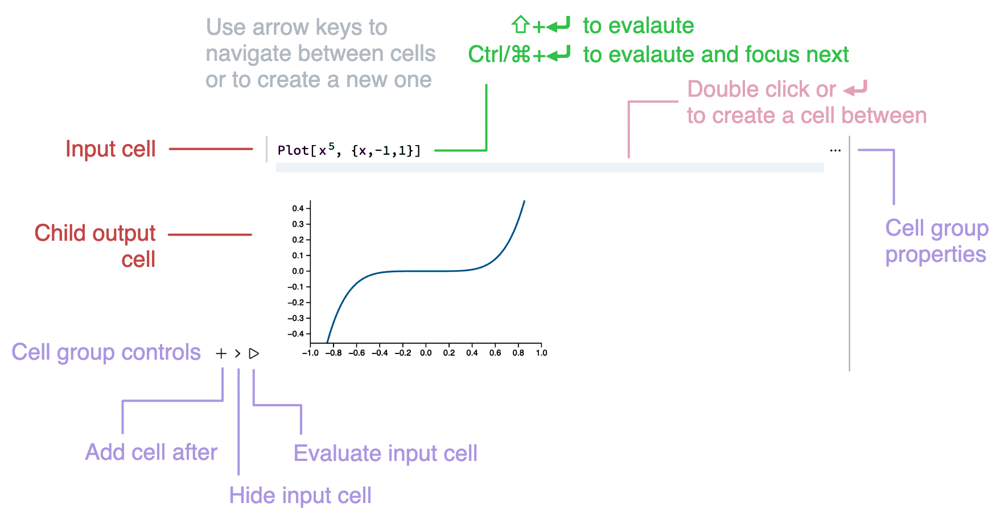

## The notebook interface

The notebook interface (or IDE) combines live code in Wolfram, Javascript  and others. We provide GUI building blocks for user input/output, a subset of LaTeX for equations, Markdown for narrative text and for data-driven presentations.

<div className='relative group'>
<div className="absolute -inset-0.5 bg-gradient-to-r from-fd-primary/50 to-purple-500/50 rounded-lg blur blur-3xl opacity-5 group-hover:opacity-10 transition duration-500" />
<div className="invertColor">

</div>
</div>

Think about it as a multitool platform for research, experiments or as a powerful sandbox, where you can try out your ideas, write a story about it alongside and then publish it somewhere on web. Like this one:

<Callout type="idea">
Read our fast-track introduction on Wolfram Language at [that page](./Wolfram-Language.mdx)
</Callout>

<Card className={"text-sm"}>

<WLJSWrapper>
<span className="absolute -inset-1 bg-gradient-to-r from-fd-primary/50 to-purple-500/50 rounded-lg blur-xl opacity-5 group-hover:opacity-50 transition duration-500" />
<wljs-editor type="Input" display="codemirror">{`.md
Let\'s write a function to generate notes in the given scale:`}</wljs-editor>
</WLJSWrapper>

Let's write a function to generate notes in the given scale:

<WLJSWrapper>
<span className="absolute -inset-1 bg-gradient-to-r from-fd-primary/50 to-purple-500/50 rounded-lg blur-xl opacity-10 group-hover:opacity-50 transition duration-500" />
<wljs-editor type="Input" display="codemirror">{`
scale["Major"] = {2, 2, 1, 2, 2, 2, 1};

makeScale[root_, sc_, pos_] := With[{b = Accumulate @ Prepend[sc, root]},
    (Cycle[b][[pos]] + 12 Quotient[pos, Length[b]]) // MapThread[Plus, {#, 0 #}] & @ pos
]`}</wljs-editor>
</WLJSWrapper>

<WLJSWrapper>
<span className="absolute -inset-1 bg-gradient-to-r from-fd-primary/50 to-purple-500/50 rounded-lg blur-xl opacity-10 group-hover:opacity-50 transition duration-500" />
<wljs-editor type="Input" display="codemirror">{`.md
Now we can generate any chord progressions in a major scale, for ex. **I-V-VI-IV**`}</wljs-editor>
</WLJSWrapper>

Now we can generate any chord progressions in a major scale, for ex. **I-V-VI-IV**

<WLJSWrapper>
<span className="absolute -inset-1 bg-gradient-to-r from-fd-primary/50 to-purple-500/50 rounded-lg blur-xl opacity-10 group-hover:opacity-50 transition duration-500" />
<wljs-editor type="Input" display="codemirror">{`SoundNote[makeScale[1, scale["Major"], {#,2+#,4+#}]] &/@ {
  1, 1, 5, 5, 6, 6, 4, 4, 1 
} // Sound `}</wljs-editor>
</WLJSWrapper>

<WLJSWrapper>
<wljs-editor type="Output" display="codemirror">{`(*VB[*)(Null)(*,*)(*"1:eJxTTMoPSmNkYGAoZgUSwfmleSlpnCAuC5DwySwugUhywiT98ktS05iRFWSCFGSCdGdyAAnqqwepyuQBEfw0Uc8FUsoLIgRpop4NpBSuifrqUcMTAOwDUao="*)(*]VB*)`}</wljs-editor></WLJSWrapper>

<WLJSWrapper>
<span className="absolute -inset-1 bg-gradient-to-r from-fd-primary/50 to-purple-500/50 rounded-lg blur-xl opacity-10 group-hover:opacity-50 transition duration-500" />
<wljs-editor type="Input" display="codemirror">{`.md
Visualize it on imaginary piano `}</wljs-editor>
</WLJSWrapper>

Visualize it on imaginary piano 

<WLJSWrapper>
<span className="absolute -inset-1 bg-gradient-to-r from-fd-primary/50 to-purple-500/50 rounded-lg blur-xl opacity-10 group-hover:opacity-50 transition duration-500" />
<wljs-editor type="Input" display="codemirror">{`blackQ[y_] := MemberQ[{2,4,7,9,11}, Mod[y-1,12]+1];
ListStepPlot[d, PlotStyle->(*VB[*)(Hue[0.03561231666487014, 0.8918383801498982, 0.8795337025157177, 1.])(*,*)(*"1:eJxTTMoPSmNiYGAo5gUSYZmp5S6pyflFiSX5RcEsQBHn4PCQNBCjmANIBLk7Oefn5BcVicky3lVWfWNfpLliouDmCxfsi/5vOjStL2qHfREDGHywBwA7SBsq"*)(*]VB*), Prolog->Flatten@Table[{If[blackQ[y],(*VB[*)(RGBColor[0.5666666666666667, 0.5666666666666667, 0.5666666666666667])(*,*)(*"1:eJxTTMoPSmNiYGAo5gUSYZmp5S6pyflFiSX5RcEsQBHn4PCQNGaQPAeQCHJ3cs7PyS8qUgKDR/aYDAAR9RPe"*)(*]VB*),(*VB[*)(GrayLevel[0.95])(*,*)(*"1:eJxTTMoPSmNiYGAo5gUSYZmp5S6pyflFiSX5RcEsQBHn4PCQNGaQPAeQCHJ3cs7PyS8qSgODd/aYDABY1RjK"*)(*]VB*)], Rectangle[{.5,y-.5},{9.5,y+.5}], (*VB[*)(GrayLevel[0])(*,*)(*"1:eJxTTMoPSmNiYGAo5gUSYZmp5S6pyflFiSX5RcEsQBHn4PCQNGaQPAeQCHJ3cs7PyS8qYoACTAYAyrgOFw=="*)(*]VB*), Line[{{.5,y-.5},{9.5,y-.5}}]}, {y, 0, 18}]]`}</wljs-editor>
</WLJSWrapper>

<WLJSWrapper>
<wljs-editor type="Output" display="codemirror">{`(*VB[*)(Null)(*,*)(*"1:eJztWmtsFEUcvxYEhEJLaWoFKX0RXgEsJCTExx60UJq0cPQK0cQPLHdz14G93WN2D3uYGCXhA8Zv8kVDNKKJQQ0xBgyaGBI+SBQFJOCDRwQFgYBSA1FM8DEzuzN3u7e30zt2TQA36e7M/mf+z9/+5z9zbV6v9SUqQ6GQPgbfupCcHoAx3XwzEt96oG4kRth6oULaWHxboqqaIRtQUxMVthEPeMy29ypdeI0olEZuKzIAbXpi7LdvpS9KaCG9fso1EmSC/iC+dUIEYgbcDEylyKuIBlUjCreAnN19VJasQDIIPo5v5vCJRJf1uqZkDNCPHbNRBboOyTS7Jrubj0849NguCS3+48W3h7Zfk1D91IqzrdOvSSaf0fi2Ki3HoJFFIXoNSfleUgEgTGvxX2WIXUMSe+78h16S/X0ozPpHKHl02E4fY/Wbwia9mvfNZw3vX6L0SQ56nfVss+gP8b75bHDQpzjoj/BxJn2aY14T79+k9GYHvcVhTxvvR+vxo2NARgZUk+siCG6WDbCuX062tpeKoZqaDcu2/n3tXsdQXdiOIRZbhqG6sB1DjM4wNNOBoZnWs4b37RhidMZntgNDs61ng4M+xUFnGGpzYIhhoYn37Rhi9BaHHm28XxxDC0rF0AcvzTi6tf3gvY6hJgeGmO8ZhpocGGJ0hqF5DgzNs541vG/HEKOz2LU7MNRuPRsc9CkOOsPQbAeGGMaaeN+OIUZvcYzLYa84hhaacRmHb0t0XYtBE0R8We3LKCBKoroCJgcU/GcsU0AKqIa19HpPJCtqj7weKPaVNkrC+9TTJsU+gzSWyopzwnjc6FbjMIb1jlO6fdp4KiirZYxVaaKHnqgSa1eNGxFZBUpE0QxztrnOe0+jnwSe0SerSeAoQGw9SJghFovitPawi9uWIznlyV2no2RFB7lWKSOoJJo7BoG+CsEkVF1UpDcXB3Sn5CTI5QQ+Z6CCDSci+2EK6I53Ee1ZgKiLuzQlDlSaSiDBswsUiG4Oo0ijH2UAb7iYRJEVNbIKcCvc+FAzzmmc76gSZehIUNYJEnJGMUxx9ux7N2TV/3X0R0c7MCaH8lImhSPOvMszaszMTsPInTRlaxqKQxUnPb1f0xSW2yqYoYyhI09UcIttg/ibbgxpAyufS7JRnM+ot3KcIni1cBkAOfPAJFSGClJODRkQk12cWCQ55ith16jkcTyr4HUzBQn4dM+sMoqkjY7lipwsmnZJoxcYsglsbxwQ060UwwFlN4Iup51ZVU7hHTF5uVJTnRKJJngBBYOequcHU69i7A2QJuudY+wEYibSMmmuVc5cU2lToyJKe+6v7b1GgcYdmmogTdGLuVuvpplDTytylltXPNY6UZ4v8BE5jr/ApBfYTAyPsiAK4ui5uj1d57fskIoTypz/2qvk2i3l8gdRuBNgw0Ccpjeid7dqACSTNElATWrktoLXLiZbIFsq4/jRtcwOsiqLOzt6ibqfw5Tg8Ltd/3vG3Duug/TyajW6fpNpjp0An0sSWZGMppdSujpdX2J8/7N6nBpFJbl4ZPj+Gbb/qKh+XAh5L6Y0TBlDS+Hwx+y9ckby0HchGCd7eTfYeKk+IX+uCX5eDuYqxEr2CqM+2wM2A8Uq1s5JViL93lG10VSL1+UBLZ6odvdHbt8wCHW2NojTPJ1Wl/fVahk1LqMsVd7LT7SQtCaxr5dnhoLTHvtUUhasxd8vHmcd9NxwqlRLv0s5trFXy+ggoumwsJzMfcXFyhkiaFkigf2ueypE7MyVAxUeI4kkRJONSzE4IZ8NLf/L50Uhg7S0UghDF1clEAAJDaU6MkjXUK8WL7oLJXxxeonRsxJPvkT1wShx25KCYw1Cy0aLlHR5i0Av0AfyvoP8fQ7fHsFRhdbnsSBrhcnCBfn2D4uGmO6zupZ2aIqG0P7GbVdX7z+Sd7BofmBXJOHGa1j8E/T6VULv/na8d33NBQnRX1SeOOgT/2lE/cazkiXoZwmd30K+4S984n9i3+9Prtn2i4TOzH/j/YY930loZlfFrnWf+cX/4rGW038+/6OE+mgkzrFAXPWJf9++syN/2HtZQjtXTX1vx+unJTT08PZjYxZ94hN/lo6tzInjG6LXkE/8GTercZk1hnEwUIL+V3LrihWIyz7pf3s3wT12y1dfkuuC3/qvoHDH+DQbJxl+Dvuk/+zF0ztr38FuCZ+8ubprr+/41Ma9OX5D83UJDXTcvrT1As4/p04erTp16EOf+L8c2rTk41cuSeijG3+dGLzyjYR6Fq185nDDOZ/474osbD11/WuWdnD+SZ75/NOZg6eHyZ8ndHIO3onrCKiWWJuQ7YJtv+u99eTzJoXIUZgBU3iFIUtIr4w24pKj2LJIhnerMSUTB3wFx9I8KyDbci8umPzRiB744GUe4eU7CtzOPoJTyePkz6uQcNnU3IcnhZOo89IQxNfKSgbcf54Y1jHDcH71IykhmtUNkOoh55463D+uwNvkK1mjA2SNqJlRMGKiNcJ+yuFxHhDoT2vcG1RChwLTaZJ+iqhztxwE2vavEYSXlGSip5CxfS/MaurcCtWH1ydsqfMoKbdrthoHXOmtYT7QRZx5GGP7Bd/LkyXLPOCviZK3uFtBmCiQiemFhUMLvXDhX9Ao2eZbAvkjw/7bLJLp6ufywzoy7C2uKgATRTIxPdCwVgnk1wZgs0imq5/LD2utQFx9ACaKZLq6tXwT6wXiJgdgokhmfcDInSyQ3xiAzSKZrn4uP6yNAnHNAZgoktkYcFibBfJbA7BZJNPVz+WHtVUgbnoAJopktgYc1ukC+TMCsFkk09XP5Yd1hkDcrABMFMl0dWv5Js4SiJsTgIkimbMCRu4cgfy5Adgskunq5/LDOlcgbn4AJopkzg04rPO95b/waAA2C2S6+7nssBITPE1s999EoUxXt5ZvYrtA3IIATBTJLDhUMv/VueC/KMT/DXEn/xL0Lx60es4="*)(*]VB*)`}</wljs-editor></WLJSWrapper>

</Card>

<wljs-store kernel="./../kernel-2636797554030104060.txt" json="./../455633c4-b341-4b7f-b93b-72e838d21fd4.txt"></wljs-store>


WLJS is __more__ than just a <abbr title="Read-Eval-Print-Loop">REPL</abbr> or Jupyter clone ducktaped on Wolfram Engine; it provides its own standard libraries, runtime, UI kit and implements all manipulate features, graphics, sound from scratch allowing it to run expressions __even without a kernel, just in the browser__:

<Card>

<WLJSWrapper>
<span className="absolute -inset-1 bg-gradient-to-r from-fd-primary/50 to-purple-500/50 rounded-lg blur-xl opacity-10 group-hover:opacity-50 transition duration-500" />
<wljs-editor display="codemirror" type="Input"  >{`Manipulate[ParametricPlot[{Sin[u] u , Cos[u] u}, 
 {u, 0, t}, PlotPoints -> 125, Axes -> False, MaxRecursion -> 0, 
 PlotStyle -> Thick], {t,10,100,10}, ContinuousAction->True]`}</wljs-editor>
 </WLJSWrapper>

<WLJSWrapper>
<wljs-editor display="codemirror" type="Output"  >{`(*VB[*)(FrontEndRef["243bf338-3fd1-494e-897f-7baf372bfca3"])(*,*)(*"1:eJxTTMoPSmNkYGAoZgESHvk5KRCeEJBwK8rPK3HNS3GtSE0uLUlMykkNVgEKG5kYJ6UZG1voGqelGOqaWJqk6lpYmqfpmiclphmbGyWlJScaAwCAaBXf"*)(*]VB*)`}</wljs-editor>
 </WLJSWrapper>

</Card>

<br/>

<Card>

## Is it like Mathematica?

WLJS Notebook is **free and open-source software** , that connects to and uses freeware [Wolfram Engine](https://www.wolfram.com/engine/). We provide compatibility layer for Wolfram Mathematica features as well as extend the language with event system, async functions, integration with web-technologies and many more. Notably:

- Output cells are editable and mostly are valid for evaluation
- Wide support for syntax sugar, math typesetting
- `Graphics`, `Graphics3D`, `Sound`, `Image3D` work and also are interactive
- Most plotting functions work out of the box
- `Manipulate`, `Animate` are supported, but with <abbr title="See reference on Manipulate">some limitations</abbr>
- Output expressions are also valid for console input, unlike Mathematica's output form

import { Accordion, Accordions } from 'fumadocs-ui/components/accordion';

<Accordions>
<Accordion title="Differences">

- Text or expression formatting is not as rich as in Mathematica
- `Dynamic` and `DynamicModule` were removed in a favour of more fine-grained and optimized update methods
- Event-based approach for input elements such as `Slider`
- Flat Jupyter-like notebook structure 
- Markdown language is used for text cells
- There might not be full support of all plotting functions or <abbr title="Please, forgive us, there are over 5000 symbols in the standard library. We are getting there with your support :)">symbols representations</abbr>

</Accordion>
</Accordions>

<Callout title="If something is not working, but you really need it">
Apply `MMAView` expression on anything to make it looks like in Mathematica. It will bypass all WLJS pipleines and be rendered to an image.
</Callout>

> **Can it open `.nb` files?**
> __Yes!__ There are some limitations regarding complex styling / formatting of the text, and dynamic modules (see below). But we gradually improve the compatibility with every update. 

</Card>

<br/>

<Card>

## Why not Jupyter Lab or VSCode?
We chose to build our own system because:
- A Jupyter kernel for Wolfram Engine already exists
- We wanted powerful syntax sugar, editable output cells, __multimedia__ cells — which require a custom extendable code editor
- __Frontend - Kernel__ interface based on ZMQ is quite robust, but it doesn't meet our needs for a low-latency communication with text and binary large payloads
- Adding a 3rd main language or API would increase long-term maintenance

</Card>

## Under the hood
A combination of <abbr title="Native kernel, IO interface and other critical parts written in C for each platform">native</abbr> and <abbr title="UI, code editor are written in Javascript and HTML">web-technologies</abbr> allows WLJS Notebook to run remotely on a server or on a desktop computer. 

We heavily rely on Javascript and HTML for 3 reasons:

1. It is safe sandbox for experiments and research
2. Easy access to GPU resources and fantastic libraries for data-visualization
3. <u>The interactive content of the notebook can be exported and published on web</u>


## User Interface

Your notebook is a file and is an entry point for taking notes on your data, research, and processing, or even creating interactive reports in the form of presentations. You may store files inside a notebook via `NotebookStore`, but we recommend keeping large files in a separate folder:

import { File, Folder, Files } from 'fumadocs-ui/components/files';
import {Notebook} from 'lucide-react'

<Files>
  <Folder name="Documents" defaultOpen>
    <File name="Notebook.wln" icon={<Notebook />}/>
    <Folder name="attachments" defaultOpen>
        <File name="tables.csv" />
        <File name="images.png" />
        <File name="data.dat" />
    </Folder>
  </Folder>
</Files>

The notebook consits of cells or groups of *input-output* cells. <span className='relative inline-block group'><span className="absolute -inset-1 bg-gradient-to-r from-fd-primary/50 to-purple-500/50 rounded-lg blur-3xl opacity-80 group-hover:opacity-50 transition duration-500" />
<span className="relative">Input cell gives you a superpower</span></span> to switch between languages or type of produced content with a single line:

<WLJSWrapper>
<span className="absolute -inset-1 bg-gradient-to-r from-fd-primary/50 to-purple-500/50 rounded-lg blur-xl opacity-20 group-hover:opacity-50 transition duration-500" />
<wljs-editor display="codemirror" type="Input"  >{`1+1`}</wljs-editor>
 </WLJSWrapper>

<WLJSWrapper>
<span className="absolute -inset-1 bg-gradient-to-r from-fd-primary/50 to-purple-500/50 rounded-lg blur-xl opacity-20 group-hover:opacity-50 transition duration-500" />
<wljs-editor display="codemirror" type="Input"  >{`.md
Here is a text note`}</wljs-editor>
 </WLJSWrapper>

<WLJSWrapper>
<span className="absolute -inset-1 bg-gradient-to-r from-fd-primary/50 to-purple-500/50 rounded-lg blur-xl opacity-20 group-hover:opacity-50 transition duration-500" />
<wljs-editor display="codemirror" type="Input"  >{`.js
return 1+1;`}</wljs-editor>
 </WLJSWrapper> 


<WLJSWrapper>
<span className="absolute -inset-1 bg-gradient-to-r from-fd-primary/50 to-purple-500/50 rounded-lg blur-xl opacity-20 group-hover:opacity-50 transition duration-500" />
<wljs-editor display="codemirror" type="Input"  >{`.slide
# Slide

My presentation
`}</wljs-editor>
 </WLJSWrapper>  


<WLJSWrapper>
<span className="absolute -inset-1 bg-gradient-to-r from-fd-primary/50 to-purple-500/50 rounded-lg blur-xl opacity-20 group-hover:opacity-50 transition duration-500" />
<wljs-editor display="codemirror" type="Input"  >{`data.txt
Write directly to a file
`}</wljs-editor>
 </WLJSWrapper>

> Think of it like an anonymous file. We intentionally avoid menus, lists to give the most space for the content you write

If __nothing matches the pattern in the first line__, it will assume Wolfram Language input.

After typing, press <kbd>Shift-Enter</kbd> or <kbd>Ctrl/⌘-Enter</kbd> to make the magic happen.

The output cells are results of evaluation. They can be many things: markdown rendered content, a slide of a presentation, a DOM element returned by Javascript cell or a Mermaid diagram:

<WLJSWrapper>
<span className="absolute -inset-1 bg-gradient-to-r from-fd-primary/50 to-purple-500/50 rounded-lg blur-xl opacity-20 group-hover:opacity-50 transition duration-500" />
<wljs-editor display="codemirror" type="Input">{`{1,2,3} /. i_Integer :> Hue[i/3] `}</wljs-editor>
 </WLJSWrapper>

<WLJSWrapper>
<wljs-editor display="codemirror" type="Output"  >{`{(*VB[*)(Hue[1/3])(*,*)(*"1:eJxTTMoPSmNiYGAo5gUSYZmp5S6pyflFiSX5RcEsQBHn4PCQNGaQPAeQCHJ3cs7PyS8qYoACKOODPVwEANd+D0Y="*)(*]VB*),(*VB[*)(Hue[2/3])(*,*)(*"1:eJxTTMoPSmNiYGAo5gUSYZmp5S6pyflFiSX5RcEsQBHn4PCQNGaQPAeQCHJ3cs7PyS8qYoACdMYHewDM1w9G"*)(*]VB*),(*VB[*)(Hue[1])(*,*)(*"1:eJxTTMoPSmNiYGAo5gUSYZmp5S6pyflFiSX5RcEsQBHn4PCQNGaQPAeQCHJ3cs7PyS8qYgCDD/ZQBgMDnAEA4iUPRg=="*)(*]VB*)}`}</wljs-editor>
 </WLJSWrapper>

<WLJSWrapper>
<span className="absolute -inset-1 bg-gradient-to-r from-fd-primary/50 to-purple-500/50 rounded-lg blur-xl opacity-20 group-hover:opacity-50 transition duration-500" />
<wljs-editor display="codemirror" type="Input"  >{`.mermaid
gantt
    section Waffle
        Iron  : 1982, 3y
        House : 1986, 3y
`}</wljs-editor>
 </WLJSWrapper>

 <WLJSWrapper>
<wljs-editor display="mermaid" type="Output"  >{`gantt
    section Waffle
        Iron  : 1982, 3y
        House : 1986, 3y
`}</wljs-editor>
 </WLJSWrapper>


<Callout type="info">
You can mutate Wolfram output cells to new input cells by editing them.
</Callout>


### Cell group properties
Even plain text cells are evaluated and produce output. For this reason you can change the properties of the group and, for example, __hide input cell__ for clarity:

import cellProp from './../cell-prop.png'

<div style={{'justifyContent': 'space-between'}}className="text-left align-right items-center w-full flex-start flex flex-wrap">
<div className='text-xs' style={{maxWidth:'350px'}}>

- __Clear output__ - removed all output cells
- __Project to a window__ - evaluates input cell in a new window; it can be used for projecting slides, or control sliders
- __Make initialization cell__ - marks input to be evaluated at the startup
- __Copy group__ - copies a group as a special compressed string; paste it to an empty input cell 
- __Split to new notebook__ - cuts all cells below and inserts to a new notebook
- __Insert cell before__
- __Hide / Show__ - hide or show input cell of the group; it can be used for markdown text cell
- __Shrink / Expand__ - hides large content of the input cell
- __Lock / Unlock__ - enables / disables editing of the input cell and hides the content
- __Vanish__ - permanently hides input cell
- __Delete__ - deletes the whole group


</div>
<Image width={400} height={400} src={cellProp}/>
</div>


<b>Project to a window</b> is a particularly useful feature that lets you evaluate a cell in a new window. This is especially helpful when presenting slides or distributing multiple controls / graphics outputs across windows.

## Math typesetting and shortcuts
To be honest, typing mathicamtical expressions in the most modern IDE for programming languages did not evolve since 1964. Our goal is to change that in a similar way as Mathematica did (over nearly 20 years), but in open-source.

So to style code expressions, replace them, or add additional elements in between we use decorations. The most common one for example:

<WLJSWrapper>
<span className="absolute -inset-1 bg-gradient-to-r from-fd-primary/50 to-purple-500/50 rounded-lg blur-xl opacity-20 group-hover:opacity-50 transition duration-500" />
<wljs-editor display="codemirror" type="Input"  >{`(*FB[*)((1)(*,*)/(*,*)(2))(*]FB*)`}</wljs-editor>
 </WLJSWrapper>

used to render fractions, if you copy it to a text editor you will still see a valid expression of `(1/2)`

```wolfram
(*FB[*)((1)(*,*)/(*,*)(2))(*]FB*)
```

the meta information is stored safely in comments, the same works with graphical, sound or any other non-textual output. In this sense __the standard output form of WLJS is decorated `InputForm`__. Here is more complex example:

<WLJSWrapper>
<span className="absolute -inset-1 bg-gradient-to-r from-fd-primary/50 to-purple-500/50 rounded-lg blur-xl opacity-20 group-hover:opacity-50 transition duration-500" />
<wljs-editor display="codemirror" type="Input"  >{`(*TB[*)Integrate[(*|*)f[x](*|*), (*|*)x(*|*)](*|*)(*1:eJxTTMoPSmNmYGAo5gUSYZmp5S6pyflFiSX5RcGcQBHPvJLUdCA3NZMRpIgVSLgl5hSnAgCQTg44*)(*]TB*)`}</wljs-editor>
 </WLJSWrapper>

while under the hood we have:

```wolfram
(*TB[*)Integrate[(*|*)f[x](*|*), (*|*)x(*|*)](*|*)(*1:eJx...metainfo*)(*]TB*)
```


Decorated expressions can be infinitely nested and fully navigable with keyboard input: 

<LazyAutoplayVideo url={"/math_input_crop.mov"}/>

<Callout>
Use arrow keys <kbd>↔</kbd> to navigate your cursor inside boxed expressions or <u>click</u> to edit them directly.
</Callout>


To assist with writing basic mathematical expressions, we provide special keyboard shortcuts to insert templates or apply formatting to selected text:

<Card className="text-xs">

<div className="grid grid-cols-1 md:grid-cols-2 gap-6">

<div>

#### Cells

- <kbd>Ctrl-/</kbd>: Create fraction
- <kbd>Ctrl-6</kbd>: Power
- <kbd>Ctrl-2</kbd>: Square root
- <kbd>Ctrl--</kbd>: Subscript
- <kbd>Ctrl-=</kbd>: Semantic input
- <kbd>ESC</kbd>: Open suggestions for greek symbol
- <kbd>Alt-/</kbd> or <kbd>⌘-/</kbd>: Comment a line
- <kbd>Ctrl-F</kbd> or <kbd>⌘-F</kbd>: Search inside cell

</div>

<div>

#### Evaluation

- <kbd>Shift-Enter</kbd>: Evaluate cell
- <kbd>Ctrl-Enter</kbd> or <kbd>⌘-Enter</kbd>: Evaluate cell and jump to the next
- <kbd>Alt-I</kbd> or <kbd>⌘-I</kbd>: Evaluate initialization cells

</div>

<div>

#### Notebook

- <kbd>Alt-2</kbd> or <kbd>⌘-2</kbd>: Hide/show input cell
- <kbd>Ctrl-U</kbd> or <kbd>⌘-U</kbd>: Clear output cell
- <kbd>Ctrl-N</kbd> or <kbd>⌘-N</kbd>: New notebook
- <kbd>Ctrl-S</kbd> or <kbd>⌘-S</kbd>: Save notebook
- <kbd>Ctrl-O</kbd> or <kbd>⌘-O</kbd>: Open notebook
- <kbd>Ctrl-P</kbd> or <kbd>⌘-P</kbd>: Open command palette

</div>

</div>

</Card>

### Command Palette
Use <kbd>Ctrl-P</kbd> or <kbd>⌘-P</kbd> to access useful tools like matrix builders, color pickers, and more:

<LazyAutoplayVideo url={"/palette_input_cropped.mov"}/>

Palette items are also normal notebooks with special cells inside.

### Overlay

<span className='relative inline-block group'><span className="absolute -inset-1 bg-gradient-to-r from-fd-primary/50 to-purple-500/50 rounded-lg blur opacity-10 group-hover:opacity-50 transition duration-500" />There is also a global shortcut to call WLJS overlay for quick evaluations available on desktop <kbd>Shift-Alt-Space</kbd>.</span>

## Interactivity

Interactive elements like `Manipulate`, `Animate`, `ManipulatePlot`, and `AnimatePlot` optimize performance by using low-level, fine-grained updates that avoid full re-evaluation of expressions. Here's an example of this approach: 

<Card>

<WLJSWrapper>
<span className="absolute -inset-1 bg-gradient-to-r from-fd-primary/50 to-purple-500/50 rounded-lg blur-xl opacity-20 group-hover:opacity-50 transition duration-500" />
<wljs-editor display="codemirror" type="Input"  >{`var = 1.0;
Graphics[{
    (*VB[*)(RGBColor[0.9324328496246868, 0.4779810744981178, 0.2076180267119551, 1.])(*,*)(*"1:eJxTTMoPSmNiYGAo5gUSYZmp5S6pyflFiSX5RcEsQBHn4PCQNBCjmANIBLk7Oefn5BcVvQqJzqq99ta+iOnxkXe20+/ZF329mWJrNfmUfREDGHywBwB/2B0I"*)(*]VB*), Rectangle[{0,-.1}, {Offload[var], .1}], 
    (*VB[*)(RGBColor[0.5767811690402207, 0.576646915402451, 0.5765764507985959, 1.])(*,*)(*"1:eJxTTMoPSmNiYGAo5gUSYZmp5S6pyflFiSX5RcEsQBHn4PCQNBCjmANIBLk7Oefn5BcVLbKzP/G35JF9keDReOsnxUDG++hfJQEgBgMYfLAHAHLqHLY="*)(*]VB*), Text[var//Offload, {Offload[var + 0.05], 0}]
}, AspectRatio->0.1]`}</wljs-editor>
</WLJSWrapper>

The nearest parent symbols (`Rectangle` and `Text`) become dependent on the symbol `var` wrapped with `Offload`, though this doesn't apply to simple math operations. Changing `var` will trigger an update of only these dependent elements. 

<WLJSWrapper>
<wljs-editor display="codemirror" type="Output"  >{`(*VB[*)(Graphics[{RGBColor[0.9324328496246868, 0.4779810744981178, 0.2076180267119551, 1.], Rectangle[{0, -0.1}, {Offload[var], 0.1}], Directive[RGBColor[0.5767811690402207, 0.576646915402451, 0.5765764507985959, 1.], FontWeight -> 800], Text[Offload[var], {Offload[var + 0.05], 0}, {1, 0}]}, AspectRatio -> 0.1, "Controls" -> False, PlotRange -> {{0, 1.2}, Automatic}])(*,*)(*"1:eJxTTMoPSmNkYGAoZgESHvk5KWkgRjEHkHAvSizIyEwuhoiACJ/M4hKEfJC7k3N+Tn5R0auQ6Kzaa2/ti5geH3lnO/2efdHXmym2VpNP2RcxgMEH+zQmkC5OkK7U5JLEvPScVIgQzNhMkLqiWTNBYOd+VDmIA9mBhH9aWk5+YkoxM5BdllgEU49kvEtmEdCCzLJULO5cZGd/4m/JI/siwaPx1k+KgYz30b9KAkAMVHeCtAaV5qQWcwEZbvl5JeGpmekZJZkKQHvTmGEqQlIrcDuNgA8Q0gE5pcVo/llpDw4NtAACGYEmDnYjN5DhWFwA9HVQYklmPlqYwJQFg0LCGeiVovyc4mJWkL8Sc4pT0cziBDsoH2hSXjpaBGGLLmMw+GwP1udYWpKfC3RBMgA53ZpC"*)(*]VB*)`}</wljs-editor></WLJSWrapper>

For user input, we use an event-based approach by assigning handler functions to interactive elements like sliders:


<WLJSWrapper>
<span className="absolute -inset-1 bg-gradient-to-r from-fd-primary/50 to-purple-500/50 rounded-lg blur-xl opacity-20 group-hover:opacity-50 transition duration-500" />
<wljs-editor display="codemirror" type="Input"  >{`EventHandler[InputRange[0,1,0.1], Function[val, var=val]]`}</wljs-editor></WLJSWrapper>

Try dragging the slider to see the result:

<WLJSWrapper>
<wljs-editor display="codemirror" type="Output"  >{`(*VB[*)(EventObject[<|"Id" -> "71ade53b-7a60-40e5-84f3-279c2f7c5c16", "Initial" -> 0.5, "View" -> "81b5b125-693b-4830-868c-be07d724e831"|>])(*,*)(*"1:eJxTTMoPSmNkYGAoZgESHvk5KRCeEJBwK8rPK3HNS3GtSE0uLUlMykkNVgEKWxgmmSYZGpnqmlkaJ+maWBgb6FqYWSTrJqUamKeYG5mkWhgbAgB1kxTp"*)(*]VB*)`}</wljs-editor></WLJSWrapper>

</Card>

### Performance
How far can we push `Offload`? WLJS architecture is optimized for rapid mutations, binary payloads, and streaming updates. Here are some real-time <abbr title="Performed on Mac M1 2021. WLJS 2.9.2">benchmarks</abbr> demonstrating interactive performance:

<Accordions>

<Accordion title="Vector graphics (1000 objects)">

Animation made using `Graphics`:

<LazyAutoplayVideo url={"/flock-fps-1000-ezgif.com-crop-video.mov"}/>
</Accordion>

<Accordion title="Raster graphics (480p 32-bit uncompressed stream)">

Animation made using `Image`:

<LazyAutoplayVideo url={"/image-stream-852-480-4-ezgif.com-crop-video.mov"}/>
</Accordion>

<Accordion title="Vector field (fluid simulation)">


Animation made using `Graphics`:

<LazyAutoplayVideo url={"/fluid-sim-15-15-ezgif.com-crop-video.mov"}/>
</Accordion>

<Accordion title="3D graphics (300 spheres)">

Animation made using `Graphics3D`:

<LazyAutoplayVideo url={"/balls-300-fps-ezgif.com-crop-video.mov"}/>
</Accordion>

<Accordion title="Marching cubes (240000 polygons)">


Animation made using `Graphics3D`:

<LazyAutoplayVideo url={"/marching-cubes-24642-tri-ezgif.com-crop-video.mov"}/>
</Accordion>

</Accordions>

All examples were captured using a screenrecording app on the notebook cells.

## Portability
WLJS Notebook offers multiple export formats that <u>preserve interactivity</u>, allowing you to share your work in the way that best suits your needs:

### Self-contained HTML file
Everything is embedded in a single file: all cells, internal notebook storage, and images.

**No internet dependency** — works completely offline and remains functional even after future updates. You can always re-import the exported notebook back into WLJS.

> Best for long-term storage, sharing notes, presentations, or reports with colleagues. No external programs or plugins needed—just a browser


### Embeddable HTML
Cells are converted to web components with interactivity metadata provided as JSON assets. Works both offline and online via CDN (default):

<GithubInfo
      owner="wljsteam"
      repo="web-components"
/>

> Ideal for basic blog pages and publishing notes on the web

### MDX
Similar to *Embeddable HTML*, but adapted for JSX environments, particularly the Next.js framework. A working template is published in the repository:

<GithubInfo
      owner="wljsteam"
      repo="web-components-mdx"
/>

> Ideal for modern blogs and content platforms that support Next.js or React

### Markdown
Only input cells and output text cells are converted to Markdown; all other outputs are stripped.

> Best for documentation or AI engines when interactivity isn't needed

### PDF
Export the entire notebook to PDF or slides only from your presentation.

> Perfect for static documents, printing or projecting slides (when other options are not available)

### Mini application
WLJS Notebook can be used as a runtime for mini apps. It's a single-window application that uses the full capabilities of a normal notebook (similar to Wolfram CDF or LabView programs) and runs in an isolated, generated context.

> Great for distributing standalone tools

### Mathematica Notebook
Convert a `.wln` notebook to a `.nb` file with some limitations.

> Useful for sharing work with Mathematica users

## Technology stack

Both the server and desktop applications run on the same technology stack.

<Card className="text-xs">

### Backend
- **Wolfram Engine** - acts as [TCP/HTTP/WebSocket server](https://github.com/WLJSTeam/HTTP) and handles logic
- **libuv** - acts as crossplatform sockets library
- **WLX** - [template engine](https://github.com/JerryI/wl-wlx) for server-side rendering (similar to JSX)

</Card>

<br/>

<Card className="text-xs">

### Frontend
- **WLJS Interpreter** - reduced 3kB Wolfram Language interpreter
- **CodeMirror 6** - main code editor and the heart of the system
- **D3.js, Plotly.js** - vector graphics rendering
- **THREE.js** - 3D graphics rendering
- **Custom WebGL shaders** - for 3D images and complex 2D graphics
- **Marked.js** - markdown renderer
- **KaTeX** - equation rendering
- **Reveal.js** - markdown engine for presentations
- **Tone.js** - sound generation
- **XTerm.js** - terminal emulation
- **Excalidraw** - hand drawing input in markdown cells

</Card>

Backend and frontend communicate via Wolfram expressions transported over binary or textual WebSockets.

The desktop application adds **Electron Framework** and **Electron Builder** to the mix, along with **PDF.js** and **napi-rs/canvas** for PDF generation and a bunch of native modules (**electron-trackpad-utils**, **native-prompt**) for better desktop integration.