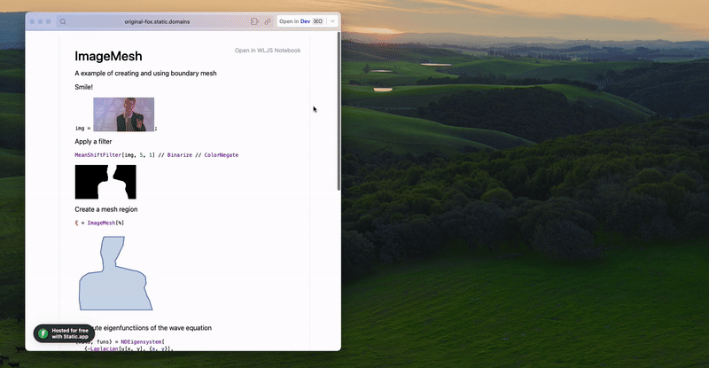

> Users don't need any app installed to view a WLJS notebook

import { Share2, CircleQuestionMark } from 'lucide-react';

Call <small>Share</small> from the top menu or click the <Share2 style={{height:"1rem"}}/> icon and choose <small>HTML File</small>.

<Callout>No internet connection required</Callout>

<Card>

## Use cases
- Share a notebook with a colleague (no WLJS app required)
- Share your work on the internet
- Lecture notes & offline presentations
- Make a report on data analysis, experiment
- Documentation 
- Cross-platform personal notes

</Card>

Local images are embedded automatically, [NotebookStore](./../Advanced/Notebook-Operations) is preserved, and [embedded files](./Embed-Notebook-Files) are included. You can open the HTML file locally or [publish it as a webpage](./Deploy-to-Github-Pages).

import { Accordion, Accordions } from 'fumadocs-ui/components/accordion';

<Accordions>
<Accordion title="Example of posted notebook">
<iframe className='rounded' src="/Spiral.html" width="100%" height="500px"></iframe>
</Accordion>
</Accordions>

## Importing
The original cell metadata is preserved, __allowing an HTML notebook to be converted back to a normal WLJS notebook__ format when opened or using deep-links—click the <CircleQuestionMark style={{height:"1rem"}}/> icon in the exported HTML file:

<Accordions>
<Accordion title="Example">

</Accordion>
</Accordions>

## Static Export Option
The most basic export option is <small>Static</small>:

import { Ellipsis, Dot } from 'lucide-react';

    

        
 <Share2 width={"1rem"}/> Share

    

    

        
 <Dot width={"1rem"}/> HTML File

    

    

        
 <Dot width={"1rem"}/> Static

    

What it does:

<Card>

- Keeps all standard plots, images, 3D graphics, and 3rd-party JavaScript assets __intact and interactive__
- Keeps all outputs of all cell types, including slides
- Keeps all objects in `NotebookStore` (can be used when the document is reimported)
- `AnimatePlot` and `AnimateParametericPlot` will still work (since they're based on precomputed states)

However:

- Dynamic features provided by `ManipulatePlot`, `InputRange`, `Offload`, animations made using `Animate`, `AnimationFrameListener`, or `SetInterval` __will not work__ and will display the latest captured state in your HTML document.

</Card>

This option is ideal for creating reports, compact notes for long-term storage, basic presentations, and shipping as a standalone HTML file. 

## Interactive Export Option
This is a dynamic version of the HTML exporter designed to recreate the full (or partial) interactivity of normal notebooks.

<Accordions>
<Accordion title="How it works">

It records calculated data for all possible combinations of input elements and stores them in a large compressed table. Missing values are interpolated using the IDW method. 

This means the output should be a pure function (in the general sense) of its state and should be fully determined by the input elements. Nevertheless, any side effects will be captured, but the final result doesn't guarantee that hysteresis-like behavior can be reproduced properly.

At the frontend, we create a "fake kernel" that mimics the behavior of a real Wolfram Kernel. The notebook content doesn't know anything about the execution environment.

</Accordion>
</Accordions>

There are two presets to choose from:

### Automatic
Following the steps

    

        
 <Share2 width={"1rem"}/> Share

    

    

        
 <Dot width={"1rem"}/> HTML File

    

    

        
 <Dot width={"1rem"}/> Interactive

    

    

        
 <Dot width={"1rem"}/> Automatic

    
    

you get the following

<Card>

- Everything that <small>Static HTML</small> export option provides
- `Manipulate`
- `ManipulatePlot` and related symbols `Manipulate*`, which produce interactive widgets
- `Animate`

However:

- Dynamic features provided by `InputRange`, `Offload`, animations made using `AnimationFrameListener`, or `SetInterval` __will not work__ and will display the latest captured state in your HTML document.
- Missing states are interpolated using a stairstep-like method.

</Card>

This mode is easy and optimal for most use cases that involve interactivity.

<Callout type="idea">Optimize the number of possible states by reducing the number of sliders and steps. For example, avoid 3 sliders with 100 steps each, as this results in 106 combinations, which is impossible to sample. Avoid manipulated raster images and JIT failures in `Animate` and `Manipulate`.</Callout>

The result is a fully interactive widget that works offline without an internet connection or the Wolfram Kernel.

### Manual sampling
Following the steps

    

        
 <Share2 width={"1rem"}/> Share

    

    

        
 <Dot width={"1rem"}/> HTML File

    

    

        
 <Dot width={"1rem"}/> Interactive

    

    

        
 <Dot width={"1rem"}/> Manual sampling

    
    

you get the following

<Card>

- Everything that <small>Static HTML</small> export option provides
- Dynamic features provided by `Manipulate*`, `Animate`, input elements like `InputRange`, anything with `Offload`, and animations made using `AnimationFrameListener` can be captured.
- `FrontSubmit` calls caused by events can be captured.
- Events generated by presentation slides can be captured.
- The missing states are interpolated using IDW method.

However:

- Dynamic features provided by `SetInterval` __will not be captured__.
- The procedure requires manual sampling by dragging all sliders or activating other event-generating elements.

</Card>

This method is the most comprehensive and the only way to keep your custom-made dynamics, animations like this one:

<Accordions>
<Accordion title="Example">

<WLJSWrapper>

<wljs-editor display="codemirror" type="Input"  >{`
length = 1;
slider = InputRange[-1,1,0.1, "Label"->"Length"]
EventHandler[slider, Function[l, length = l]];

Graphics[Rectangle[{-1,-1}, {length // Offload, 1}]]
`}</wljs-editor>
</WLJSWrapper>

</Accordion>
</Accordions>

Your dynamic system must follow a *call-and-response* architecture. This means it must generate events (via user interaction or code) and produce a response (e.g., symbol mutation or `FrontSubmit` call).

How to use:

import { Step, Steps } from 'fumadocs-ui/components/steps';

<Steps>
<Step>

#### Prepare the notebook

Connect to the Wolfram Kernel and evaluate your dynamics. Minimize the number of input elements and their states. Limit the number and complexity of dynamic symbols.

</Step>

<Step>

#### Run Export
Navigate to the export option and run it. 

</Step>

<Step>

#### Sampling

__For sliders/input elements__

Move each slider/input element across its full range. This is necessary, as the sampling phase will only use values observed during sniffing. 

<Callout>
For multiple inputs (2–3 sliders), move each one fully once. Cross-combinations __are not needed__—they will be resampled recursively and automatically.
</Callout>

__For animations made with `AnimationFrameListener`__
Start the animation (evaluate) and wait for the desired number of frames to be captured.

__For presentation events or anything related to `FrontSubmit`__
Go through slides or activate buttons/other event emitters.

</Step>

</Steps>

Depending on what was sampled, a special sampling preset will be assigned __automatically__ to process the gathered data. Here are a few examples of dynamic content for each:

<Accordions>
<Accordion title="State machine">

Higher-order function that generates dynamic content:

<WLJSWrapper>

<wljs-editor display="codemirror" type="Input"  >{`
ManipulatePlot[f[w x], {x, -10, 10}, {w, 0, 10}, {f, {Sinc, Sin}}]
`}</wljs-editor>
</WLJSWrapper>

<LazyAutoplayVideo url={"/export-manipulate.mp4"}/>

Here is an example of low-level implementation:

<WLJSWrapper>

<wljs-editor display="codemirror" type="Input"  >{`
radius = 1.0;
Graphics[{Hue[radius // Offload], Disk[{0, 0}, radius // Offload]}, ImageSize -> Small]

EventHandler[InputRange[0, 1, 0.1], (radius = #)&]
`}</wljs-editor>
</WLJSWrapper>

Here is an example of sampling complex contntieous events on 2D canvas:

<WLJSWrapper>

<wljs-editor display="codemirror" type="Input"  >{`
udata = {{-1,0}, {1,0}};

Graphics[{
  Cyan, Line[udata // Offload], Red, PointSize[0.05],
  EventHandler[Point[{0,0.5}], {
    "drag" -> ((udata = generate[#, 0.1])&)
  }]
}, PlotRange->{{-1,1}, {0,1}}, ImagePadding->None, Axes->{True, False}, ImageSize->Small]

ClearAll[generate];
generate[{x_, y_}, k_] := Table[{t, y Exp[- (*FB[*)(((*SpB[*)Power[(x - t)(*|*),(*|*)2](*]SpB*))(*,*)/(*,*)(2 k))(*]FB*)]}, {t,-1,1, 0.03}]
`}</wljs-editor>
</WLJSWrapper>

<LazyAutoplayVideo url={"/export-drag.mp4"}/>

Missing values will be interpolated using our own method: Categorical-Aware Inverse Distance Weighted Interpolation (IDW) with support for structured output decomposition and recomposition.

This also means: the more features you sample, the more accurate the result will be for continuously changing data.

Here is an example with `Animate`:

<WLJSWrapper>

<wljs-editor display="codemirror" type="Input"  >{`
Animate[Row[{Sin[x], "==", Series[Sin[x], {x,0,n}], Invisible[1/2]}], {n, 1, 10, 1}, RefreshRate->3]
`}</wljs-editor>
</WLJSWrapper>

It might seem misleading, but the built-in `Animate` works similarly to `Manipulate`, but with an automatically moving single slider. Therefore, it's also suitable for the <small>State Machine</small> preset.

</Accordion>

<Accordion title="Animation machine">

<WLJSWrapper>

<wljs-editor display="codemirror" type="Input"  >{`
ballsteps = 
  NDSolve[{x''[t] == 0, y''[t] == -9.8, y[0] == 6, y'[0] == 0, 
    x[0] == 0, x'[0] == 1, a[0] == 5, 
    WhenEvent[Mod[x[t], 1] == 0, 
     If[a[t] > 0, a[t] -> a[t] - 1, "RemoveEvent"]], 
    WhenEvent[
     y[t] == a[t], {x'[t], y'[t]} -> .9 {x'[t], -y'[t]}]}, {x, y, 
    a}, {t, 0, 15}, DiscreteVariables -> {a}];
trajectory = {x, y} /. ballsteps[[1]];

staircase = 
 Plot[Clip[Floor[6 - x], {0, Infinity}], {x, -1, 15}, Filling -> 0, 
  Exclusions -> None];

Module[{
  pos = {0.,0.},
  t = 0.
},

  Show[staircase, Graphics[{
    (*VB[*)(RGBColor[1, 0, 0])(*,*)(*"1:eJxTTMoPSmNkYGAoZgESHvk5KRCeGJAIcndyzs/JLwouTyxJzghJzS3ISSxJTWMGyXMgyRcxgMEHeyiDgQHOAAALpBNd"*)(*]VB*), Disk[pos // Offload, 0.12]
  }], Epilog->{
    EventHandler[
        AnimationFrameListener[pos // Offload], 
        Function[Null,
            pos = #[t] &/@ trajectory;
            t = If[t >= 15.0, 0., t + 0.1];
        ]
    ]
  }]
]
`}</wljs-editor>
</WLJSWrapper>

<LazyAutoplayVideo url={"/export-animation.mp4"}/>

</Accordion>

<Accordion title="Pavlov machine">

<WLJSWrapper>

<wljs-editor display="codemirror" type="Input"  >{`
EventHandler[InputButton[], (Sound[SoundNote["C5"]] // EmitSound)&]
`}</wljs-editor>
</WLJSWrapper>

Here is another example with `Plotly`, that internally uses `FrontSubmit`:

<WLJSWrapper>

<wljs-editor display="codemirror" type="Input"  >{`
p = Plotly[{<|
  "values" -> {19, 26, 10},
  "labels" -> {"Residential", "Non-Residential", "Utility"},
  "type" -> "pie"
|>}]

EventHandler[InputRange[0, 100, 10], PlotlyAnimate[p,   
  <|"data" -> {<|"values" -> {19, 26, #}|>},
    "traces" -> {0}
  |>, <||>]&
]
`}</wljs-editor>
</WLJSWrapper>

</Accordion>
</Accordions>

## Bundler features

### Modules

To reduce the output file size, you can exclude certain modules from the final bundle. It can be done from the settings menu:

import { Settings } from 'lucide-react';

    

        
 <Settings width={"1rem"}/> Settings

    

    

        
 <Dot width={"1rem"}/> Export settings

    

    

        
 <Dot width={"1rem"}/> Exclude from bundle

    

For example, if you do not use 3D graphics: exclude `shared-threejs-*`, `graphics3d-*`.

### External images
Compress all external images and embed them inline to HTML file used on slides, WLX, HTML or Markdown cells:

    

        
 <Settings width={"1rem"}/> Settings

    

    

        
 <Dot width={"1rem"}/> Export settings

    

    

        
 <Dot width={"1rem"}/> Include

    

### Misc
You can enable automatic dark/light mode from the same page of the settings menu:

    

        
 <Settings width={"1rem"}/> Settings

    

    

        
 <Dot width={"1rem"}/> Export settings

    

    

        
 <Dot width={"1rem"}/> General

    

