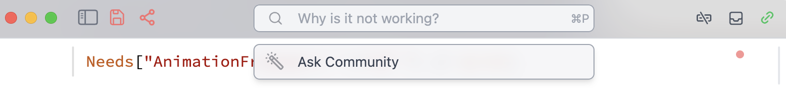

This page collects short answers to questions that repeatedly appear in the support chat and [GitHub Discussions](https://github.com/WLJSTeam/wljs-notebook/discussions). Follow the links in each answer for the complete documentation.

<Callout type="info" title="Where should I ask?">
Use this page for known solutions, [GitHub Discussions](https://github.com/WLJSTeam/wljs-notebook/discussions) for questions and workarounds, and [GitHub Issues](https://github.com/WLJSTeam/wljs-notebook/issues) for reproducible bugs. For real-time help, join the [Telegram support group](https://t.me/wljs_support).
</Callout>

## Installation and startup

### Which Wolfram Engine version should I use?

Wolfram Engine versions **14.1–15.0** are well tested with WLJS Notebook. Install and activate Wolfram Engine before installing WLJS Notebook. See the [installation guide](./setup) for platform-specific instructions.

### Why does the launcher show `exit code -1`?

Close WLJS Notebook, open a terminal, and activate Wolfram Engine:

```bash
wolframscript -activate
```

Then start WLJS Notebook again. If activation succeeds but WLJS still cannot start, collect a debug log as described in [How do I collect logs?](#how-do-i-collect-logs).

### Why do I see a license error or a kernel timeout?

The launcher can display a license error for several startup failures, not only an invalid license. First:

1. Close other `wolframscript`, Wolfram Kernel, Mathematica, and WLJS processes.
2. Run `wolframscript` in a terminal and confirm that it starts normally.
3. Check [your Wolfram products](https://account.wolfram.com/products) and confirm that a Wolfram Engine key is available.
4. Update WLJS Notebook to the latest release and try again.

WLJS normally uses two kernel processes, which is the maximum permitted by the free Wolfram Engine license. If the problem remains, include your Wolfram version, operating system, and the early debug-log messages in a support request. See the related [license-error discussion](https://github.com/WLJSTeam/wljs-notebook/discussions/431).

### Can I install WLJS Notebook on another drive?

The desktop application's installation location is controlled by the platform installer. If you need full control over the location, you can [run WLJS from source](./setup#running-from-source) from another drive. A source installation does not provide every desktop integration, such as file associations and some native dialogs.

### Does WLJS require a permanent internet connection?

No. WLJS itself works offline. Wolfram Engine may require internet access for initial activation, periodic license validation, or account-related operations. See [installation and connectivity](./setup#install-in-two-steps).

## Notebooks and evaluation

### How do I evaluate the entire notebook?

Use the **Evaluate all** action from the notebook menu. <kbd>Alt-I</kbd> or <kbd>⌘-I</kbd> evaluates only cells marked as initialization cells; it is not an evaluate-all shortcut.

To make a cell run when the notebook starts, open the cell-group menu and choose **Make initialization cell**. See [cell group properties](./Overview#cell-group-properties).

### Can WLJS open Mathematica `.nb` files?

Yes. Open a `.nb` file with WLJS Notebook and it will be converted to the plain-text `.wln` format. Import is still experimental: complex text formatting, `DynamicModule`, some graphics styling, and embedded media may not convert exactly. See [Mathematica notebook import and export](./Share/Mathematica).

Wolfram Language package files such as `.wl` and `.m` can be loaded with `Get` as usual.

### Can I edit a notebook with VS Code, Codex, or another coding assistant?

Yes. The `.wln` format is designed to be readable by people, version control, and LLM tools. Changes made by an external editor are automatically hot-reloaded. WLJS also provides an [MCP server and command-line tools](./Guides/Command-palette#mcp-server) for inspecting, editing, and evaluating notebook cells.

### Can I draw a matrix in a Markdown cell?

Yes. Use a LaTeX block in a Markdown cell. For example, this renders a column vector as a matrix:

```markdown
.md

$$
\\vec{v} = \\begin{bmatrix} X \\\\ Y \\end{bmatrix}
$$
```

In Markdown cells, escape LaTeX backslashes as shown. See [LaTeX in Markdown cells](./Cell-types/Markdown#latex) for inline equations, block equations, and other supported syntax.

### How can I generate an HTML table from data?

Use a WLX or HTML cell and generate the table rows and cells with `Table`. For example, after evaluating `data = Table[RandomWord[], {4}, {4}];`, this WLX cell creates a table from `data`:

```jsx
.wlx

With[{TableBody = Table[
  With[{Row = Table[
    <td class="px-3 py-2"><Item/></td>,
    {Item, Rows}
  ]},
    <tr class="bg-white border-b"><Row/></tr>
  ],
  {Rows, data}
]},
  <table class="table-auto"><TableBody/></table>
]
```

For raw HTML, use the same nested `Table` expressions through WSP templates. See [generating tables in WLX](./Cell-types/WLX#generate-a-table-from-data) or [HTML cells and WSP](./Cell-types/HTML#generate-a-table-from-data).

### Is there a command palette?

Yes. Press <kbd>Ctrl-P</kbd> on Windows or Linux, or <kbd>⌘-P</kbd> on macOS. You can also click the title bar that displays the notebook name or path. See [Notebook Tools](./Guides/Command-palette) for the available commands.

## Graphics and formatting

### Why does a plot look different from Mathematica?

WLJS uses its own web-based renderer, so some Mathematica styling options do not have an exact frontend equivalent. When you need Wolfram Engine's native appearance, wrap the expression with [`MMAView`](./GUI/MMAView):

```wolfram
Plot[Sin[x], {x, 0, 2 Pi}] // MMAView
```

`MMAView` rasterizes the expression using a parallel kernel. It is a useful compatibility fallback, but the result is an image rather than a native WLJS graphic.

### How do I save a plot or graphic?
For interactive plots - use export feature [Standalone HTML file](./Share/Standalone-HTML) or MDX, embdeded HTML if you want to use it on your blog page. For programmatic export, use [`Export`](./File-Operations/Export):

*Vector Graphics*

```wolfram
Export["plot.pdf", Plot[Sin[x], {x, 0, 2 Pi}]]
```

*Raster graphics*

```wolfram
Export["plot.png", Plot[Sin[x], {x, 0, 2 Pi}] // Rasterize]
```

For complete notebooks, printable documents, or slides, see the [PDF export guide](./Share/PDF). 

### How can I use Mathematica-style rendering for an unsupported expression?

Apply [`MMAView`](./GUI/MMAView) to that expression. Please still report rendering incompatibilities: a small example can help improve WLJS support for many related expressions.

### Why is part of a `TeXView` label cropped?

The browser may estimate the LaTeX container too early or make it too small. Give the container an explicit width and height:

```wolfram
TeXView["x^2 - 1", ImageSize -> {100, 50}]
```

in the full context:

```wolfram
Plot[x^2-1, {x,0,10}, Epilog->{
  Inset[TeXView["x^2 - 1", ImageSize -> {100, 50}], {5,60}]
}]
```

If the label also needs to be positioned within that box, use `AlignmentPoint`, for example `AlignmentPoint -> {Left, Top}`. See [`TeXView`](./GUI/TeXView#options) for the available values.

### Why are labels, legends, or insets missing after `Rasterize` or PDF export?

Labels, legends, insets, and other frontend elements may render asynchronously. If `Rasterize` or PDF `Export` captures the expression before every element is ready, increase the capture delay with `"ExposureTime"`:

```wolfram
Export["figure.pdf", expression, "ExposureTime" -> 6]

Rasterize[expression, "ExposureTime" -> 6]
```

The value is a delay in seconds. Use the shortest delay that consistently captures the complete expression.

<Callout type="warning">
`Rasterize` and PDF `Export` require the WLJS Notebook Desktop application. They are not available in server mode.
</Callout>

See [exporting frontend-rendered output](./File-Operations/Export#frontend-rendered-output) and [`Rasterize`](./Image/Rasterize).

## Sharing and interactive exports

### Why is my `Manipulate` static in an exported HTML file?

A static HTML file has no Wolfram Kernel, so kernel-dependent controls preserve only their last captured state. Choose the **Interactive** HTML export when the interaction can be sampled and replayed in the browser. The exporter records input/output states and can interpolate missing values; it does not ship a live kernel inside the file.

Read [HTML File](./Share/Standalone-HTML#interactive-export-option) for automatic and manual sampling, limitations, and examples.

### Can someone view an exported notebook without installing WLJS?

Yes. A [standalone HTML notebook](./Share/Standalone-HTML) opens in a normal browser and can include plots, media, stored state, and supported interactive elements. No WLJS installation is required for the reader.

## Cache and diagnostics

### Why do I still see old content after an update?

This is most common when WLJS runs in a browser or Docker. Try, in order:

- <kbd>Ctrl-F5</kbd> or <kbd>⌘-R</kbd>
- **Force Reload** from the desktop application's menu
- **Reload Window**
- **Clear Cache and Reload**

### How do I collect logs?

If the logs do not contain private data you cannot share:

1. Restart WLJS Notebook and select **DEBUG** in the launcher.
2. Reproduce the problem.
3. Close the application normally.
4. A window containing the collected log file will appear.
5. Attach the log to a GitHub Issue or send it through the support group.

### What should I include when reporting a problem?

Include:

- a minimal expression or notebook that reproduces the problem;
- what you expected and what happened instead;
- your operating system and whether you use the desktop app, Docker, or server mode;
- the output of `$Version` and `$SystemID`;
- screenshots or a short screen recording when the issue is visual;
- a debug log for startup or kernel-connection failures.

Before opening an issue, search this documentation and [GitHub Discussions](https://github.com/WLJSTeam/wljs-notebook/discussions). If you are not sure whether something is a bug, start a Discussion.

## Ask the community

The command palette can create a GitHub Discussion containing a focused group of notebook cells:



- [GitHub Discussions](https://github.com/WLJSTeam/wljs-notebook/discussions) — questions, workarounds, and examples
- [Telegram support group](https://t.me/wljs_support) — real-time community help
- [Reddit](https://www.reddit.com/r/wljs/) — news and shared experiments
- [GitHub Issues](https://github.com/WLJSTeam/wljs-notebook/issues) — reproducible bugs and feature requests
