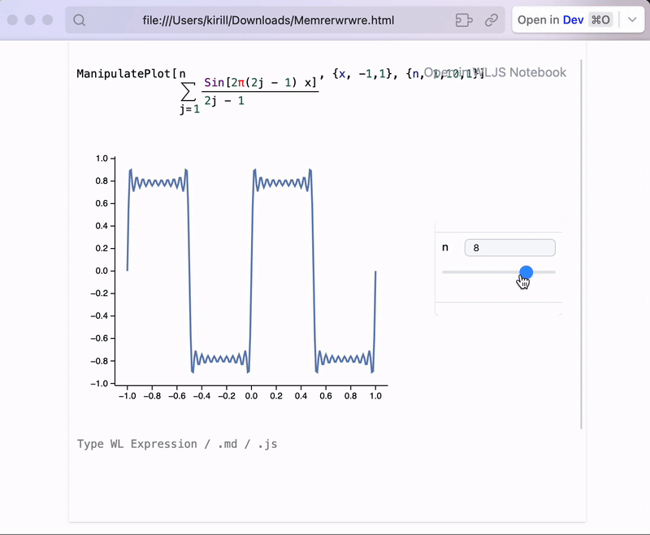

{/* add this script to the body  */}
{/* https://cdn.jsdelivr.net/gh/WLJSTeam/web-components@latest/src/common/app.js */}
<wljs-store json="./attachments/b755e4a2-cb35-409a-9f8a-dcf112064392.txt"></wljs-store>

Minor changes in UI and `Graphics3D` and massive changes in possibilities of exporting notebooks.

## Graphics3D now has ticks
Ticks cannot be customized, but this is a big step compared to what we had before

<WLJSWrapper><wljs-editor display="codemirror" type="Output"  >{`(*VB[*)(FrontEndRef["74d6e22e-f100-48d6-8919-18e749ee3477"])(*,*)(*"1:eJxTTMoPSmNkYGAoZgESHvk5KRCeEJBwK8rPK3HNS3GtSE0uLUlMykkNVgEKm5ukmKUaGaXqphkaGOiaWKSY6VpYGlrqGlqkmptYpqYam5ibAwB6+BT/"*)(*]VB*)`}</wljs-editor></WLJSWrapper>

## AnimatePlot
We have more function for making animations easier. It is important to note, that `AnimatePlot` keeps the data inside notebook and __is safe to be exported to HTML file or using Figure export or embedded to a page__

<WLJSWrapper><wljs-editor display="codemirror" type="Input" editable="true"  >{`AnimatePlot[(*TB[*)Sum[(*|*)(*FB[*)((Sin[2π(2j - 1) x])(*,*)/(*,*)(2j - 1))(*]FB*)(*|*), {(*|*)j(*|*),(*|*)1.0(*|*),(*|*)n(*|*)}](*|*)(*1:eJxTTMoPSmNiYGAoZgMSwaW5TvkVmYwgPguQCCkqTQUAeAcHBQ==*)(*]TB*), {x, -1,1}, {n, 1,30, 1}]`}</wljs-editor></WLJSWrapper>

<WLJSWrapper><wljs-editor display="codemirror" type="Output"  >{`(*VB[*)(FrontEndRef["a813f88d-91cb-4111-9ffe-faa53209ac3f"])(*,*)(*"1:eJxTTMoPSmNkYGAoZgESHvk5KRCeEJBwK8rPK3HNS3GtSE0uLUlMykkNVgEKJ1oYGqdZWKToWhomJ+maGBoa6lqmpaXqpiUmmhobGVgmJhunAQCHNBYC"*)(*]VB*)`}</wljs-editor></WLJSWrapper>

## Dynamic HTML export
A new experimental feature now is available! It order to make the system more general and be able to capture the effects of `ManipulatePlot`, any combinations of `InputRange`, `InputButton`, `Offload` and many more it is abstracted by the design from the controlling elements and purely analyses the events and mutations of symbols.

<wljs-html encoded="true">{`%3Cbr%20%2F%3E`}</wljs-html>

Please see the documentation for more details

