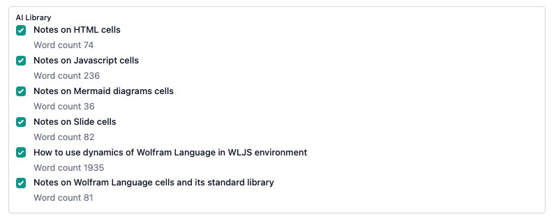

{/* add this script to the body  */}
{/* https://cdn.jsdelivr.net/gh/WLJSTeam/web-components@latest/src/common/app.js */}
<wljs-store json="./attachments/b31ccee8-d26f-40ff-9230-09b5eedb6da0.txt"></wljs-store>

A massive perfomance improvements: we adopted a binary format WXF (instead of JSON) for updating the data on the frontend from Wolfram Kernel, fixed UI bugs on Linux, slide cells and improved an import feature for Mathematica's notebook

## WXF Format and Compute Shaders
Compared to JSON it results in $~10-100$ speed up depending on what kind of data you is transported. Raw video streaming is now possible check out this example

<WLJSWrapper><wljs-editor display="codemirror" type="Input" editable="true" fade="true" >{`v = Video["ExampleData/Caminandes.mp4"];
	encoded = Map[Function[frame, NumericArray[255.0 ImageData[frame], "UnsignedInteger8", "ClipAndRound"]], VideoExtractFrames[v, Range[60]]];
	
	index = 1;
	time = AbsoluteTime[];
	
	EventHandler["film", Function[Null,
	  frame = encoded[[index]];
	  index++;
	  If[index >= Length[encoded], index = 1];
	  
	  With[{t = AbsoluteTime[]},
	    fps = Round[ (*FB[*)((fps + 1/(t - time))(*,*)/(*,*)(2.0))(*]FB*)];
	    time = t;
	  ];
	]];
	
	frame = encoded // First;
	fps = 0.4;
	Graphics[{
	  Inset[Image[frame // Offload, "Byte"], {0,0}, ViewMatrix->None],
	  Red, Directive[FontSize->18,Bold], Text[fps // Offload, {0.1,0.2}],
	  AnimationFrameListener[fps // Offload, "Event"->"film"]
	
	}, PlotRange->{{0,1}, {0,1}}, ImageSize->{600, 500}, Controls->False]
	`}</wljs-editor></WLJSWrapper>

An average result on Mac Air M1 was around `50~FPS`. Which is quite large for a video playback, but this is just a benchmark 😉

### OpenCL as a main language for compute shaders
Since we have a decent speed for raw raster data, one can program and run GPU code from WL and display the data as a raster image. For now `OpenCLLink` is the only choice if target a notebook to be crossplatform. 

If you have `OpenCL` - compatible hardware, you can try to run this beautiful shader designed by [@](https://www.shadertoy.com/view/mtyGWy) in his *Shader Coding Art*

<WLJSWrapper><wljs-editor display="codemirror" type="Input" editable="true" encoded="true"  >{`Needs%5B%22OpenCLLink%60%22%5D%0AIf%5B%21OpenCLQ%5B%5D%2C%20Alert%5B%22Sorry%2C%20OpenCLLink%20is%20not%20supported%22%5D%20%2F%2F%20FrontSubmit%5D`}</wljs-editor></WLJSWrapper>

Then run this

<WLJSWrapper><wljs-editor display="codemirror" type="Input" editable="true" fade="true" >{`image = OpenCLMemoryLoad[Table[{0, 0, 0, 0}, {i, 512}, {j, 512}], "UnsignedByte[4]"];
	render = OpenCLFunctionLoad[File[FileNameJoin[{"attachments", "art.cl"}]], 
	  "render", {{"UnsignedByte[4]", _, "Output"}, _Integer, _Integer, "Float"}, 256, "ShellOutputFunction"->Print];
	
	Module[{buffer, t=0.0, ev = CreateUUID[]},
	  EventHandler[ev, Function[Null,
	    render[image, 512, 512, t, 512 512];
	    buffer = NumericArray[image // OpenCLMemoryGet, "UnsignedInteger8"];
	    t += 0.1;
	  ]];
	
	  EventFire[ev, True];
	
	  Graphics[{
	    Inset[Image[buffer // Offload, "Byte"], {0,0}, ViewMatrix->None],
	    AnimationFrameListener[buffer // Offload, "Event"->ev]
	  }, ImageSize->{512, 512}, PlotRange->{{0,1}, {0,1}}, ImagePadding->None]
	]`}</wljs-editor></WLJSWrapper>

Check out a new section in `Examples` (or `Demos`)!

Please read our [Blog](https://jerryi.github.io/wljs-docs/blog) for more info.

## Better support for Mathematica notebooks format
This feature was highly requested by different members from the beginning of our WLJS project. 

See [issue](https://github.com/JerryI/wljs-notebook/issues/70)

## AI assistant Library
We splitted and sorted out all knowldge needed for AI to work properly with cells. Now it is available on demand to AI, which __saves up a lot of tokens__. You can tune this settings

Even if all of them are enabled, it doesn not mean, they consume tokens on start. Each item can be fetched AI if needed by the context of a provided problem.

## More examples and tutorials!
Check you `Examples` section, we have some new stuff to show 😉

[__WLJS Demonstration Project__](https://jerryi.github.io/wljs-docs/wljs-demo) was updated and includes interactive web-notebooks you can try (no Wolfram Kernel running is needed or WLJS App)

## Render cells inside other cells
We introduce a new view-component

<WLJSWrapper><wljs-editor display="codemirror" type="Input" editable="true"  >{`CellView["
	graph LR
	    A[Text Header 3200 byte]  --> B[Binary Header 400 byte]
	    B --> C1[240 byte 1-st trace header] --> T1[samples of 1-st trace]
	    B --> C2[240 byte 2-st trace header] --> T2[samples of 1-st trace]
	    B --> CN[240 byte n-st trace header] --> T3[samples of 1-st trace] 
	", "Display"->"mermaid"]`}</wljs-editor></WLJSWrapper>

<WLJSWrapper><wljs-editor display="codemirror" type="Output"  >{`(*VB[*)(FrontEndRef["ea164bfe-1a61-45eb-8280-f508462829eb"])(*,*)(*"1:eJxTTMoPSmNkYGAoZgESHvk5KRCeEJBwK8rPK3HNS3GtSE0uLUlMykkNVgEKpyYampkkpaXqGiaaGeqamKYm6VoYWRjoppkaWJiYGVkYWaYmAQCH4BV1"*)(*]VB*)`}</wljs-editor></WLJSWrapper>

It is aimed to embed diagrams and other cells to presentations (slide cells). But, may be you will come up with other applications as well...

## Sponsors
We have a new sponsor for this release

__Gani Ganapathi, USA 🥳__

Thank you for supporting our project 💛

<wljs-html encoded="true">{`%0A%3Cstyle%3E%0A%20%20%5Btransparency%3D%22false%22%5D%20.bg-g-trans%20%7B%0A%20%20%20%20background%3A%20transparent%20%21important%3B%0A%20%20%7D%0A%0A%20%20%5Btransparency%3D%22true%22%5D%20.bg-g-trans%20%7B%0A%20%20%20%20background%3A%20transparent%20%21important%3B%0A%20%20%7D%0A%3C%2Fstyle%3E`}</wljs-html>