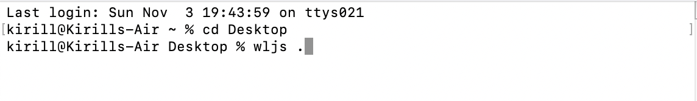
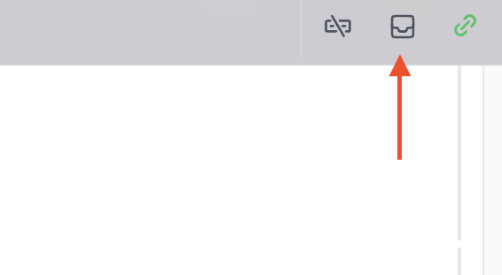

{/* add this script to the body  */}
{/* https://cdn.jsdelivr.net/gh/WLJSTeam/web-components@latest/src/common/app.js */}
<wljs-store json="./attachments/a5957dd9-96a4-47f9-a5d1-a5e2ed2bf620.txt"></wljs-store>


## GraphicsComplex now supports VertexNormals
It was an old bug, that provided normals were ignored, which leaded to some visual artifacts in terms of lighting. Looks at the differece now

<WLJSWrapper><wljs-editor display="codemirror" type="Output"  >{`(*GB[*){{(*VB[*)(FrontEndRef["f9b15308-6ceb-467a-a96d-df7639cc80ad"])(*,*)(*"1:eJxTTMoPSmNkYGAoZgESHvk5KRCeEJBwK8rPK3HNS3GtSE0uLUlMykkNVgEKp1kmGZoaG1jomiWnJumamJkn6iZamqXopqSZmxlbJidbGCSmAACH2hYR"*)(*]VB*)(*|*),(*|*)(*VB[*)(Graphics[Arrow[{{0, 0}, {1, 0}}], ImageSize -> 50, ImagePadding -> None])(*,*)(*"1:eJxTTMoPSmNkYGAoZgESHvk5KWnMIB4HkHAvSizIyEwuhsizAgnHoqL88jQmmHKfzOISVF4mkGYAE2jijJjiQaU5qcWcQIZnbmJ6anBmVWqmEaYCHpiCgMSUlMy8dLCMX35eKgCWRCRi"*)(*]VB*)(*|*),(*|*)(*VB[*)(FrontEndRef["37227be2-25df-4d3c-a000-35796369ef66"])(*,*)(*"1:eJxTTMoPSmNkYGAoZgESHvk5KRCeEJBwK8rPK3HNS3GtSE0uLUlMykkNVgEKG5sbGZknpRrpGpmmpOmapBgn6yYaGBjoGpuaW5oZm1mmppmZAQB7PxUY"*)(*]VB*)}}(*]GB*)`}</wljs-editor></WLJSWrapper>

## Dynamic indexed & non-indexed geometry for Polygon
There is no such thing defined in standard library of Wolfram Language, but we did bring it to you from WebGL world, since it may come handy for complex dynamic 3D geometry.

### Non-indexed
The idea now, it that you can define starting and ending index for all your triangles using `Polygon` inside `GraphicsComplex`

<WLJSWrapper><wljs-editor display="codemirror" type="Input" editable="true"  >{`maxIndex = 312;
	EventHandler[InputRange[1, 312, 1, 312], (maxIndex = #) &]
	
	With[{vertices = (*VB[*)(Get[FileNameJoin[{".iconized", "iconized-3957.wl"}]])(*,*)(*"1:eJxTTMoPSmNkYGAoZgESHvk5KWlMIB4fkPBMzs/LrEp1y8xJdcqvyCyQY2CASIKUBpXmpAazAhk+iUmpOcEcQFZYalFJZnJqMQADMRNT"*)(*]VB*)},
	  GraphicsComplex[vertices, {
	    Polygon[1, maxIndex // Offload]
	  }] // Graphics3D 
	]`}</wljs-editor></WLJSWrapper>

<WLJSWrapper><wljs-editor display="codemirror" type="Output"  >{`(*VB[*)(EventObject[<|"Id" -> "1febcf3d-7f14-4e31-a718-4d1768d67879", "Initial" -> 312, "View" -> "78b77dc8-871b-480a-a4a7-44576564267a"|>])(*,*)(*"1:eJxTTMoPSmNkYGAoZgESHvk5KRCeEJBwK8rPK3HNS3GtSE0uLUlMykkNVgEKm1skmZunJFvoWpgbJumaWBgk6iaaJJrrmpiYmpuZmpkYmZknAgB9RhT2"*)(*]VB*)`}</wljs-editor></WLJSWrapper>

<WLJSWrapper><wljs-editor display="codemirror" type="Output"  >{`(*VB[*)(FrontEndRef["83dd6324-65b2-4296-814d-1d9ccb12fd8d"])(*,*)(*"1:eJxTTMoPSmNkYGAoZgESHvk5KRCeEJBwK8rPK3HNS3GtSE0uLUlMykkNVgEKWxinpJgZG5nompkmGemaGFma6VoYmqToGqZYJicnGRqlpVikAAB30xV5"*)(*]VB*)`}</wljs-editor></WLJSWrapper>

It means you can specify only the range of your geometry, without indexes. The benifit of this approach, you can use fixed length buffer for vertices and limit your drawing range using two arguments of Polygon.

## Indexed geometry
This is more a traditional way of defining 3D shapes. One can morph one complicated shape into another!

Have a look at this dynamic parameteric plot

<WLJSWrapper><wljs-editor display="codemirror" type="Input" editable="true" fade="true" >{`sample[t_] := With[{
	   complex = ParametricPlot3D[
	     (1 - t) * {
	       (2 + Cos[v]) * Cos[u],
	       (2 + Cos[v]) * Sin[u],
	       Sin[v]
	     } + t * {
	       1.16^v * Cos[v] * (1 + Cos[u]),
	       -1.16^v * Sin[v] * (1 + Cos[u]),
	       -2 * 1.16^v * (1 + Sin[u]) + 1.0
	     },
	     {u, 0, 2\\[Pi]},
	     {v, -\\[Pi], \\[Pi]},
	     MaxRecursion -> 2,
	     Mesh -> None
	   ][[1, 1]]
	   },
	  {
	   complex[[1]],
	   Cases[complex[[2]], _Polygon, 6] // First // First,
	   complex[[3, 2]]
	  }
	]
	
	(* Now make a scene *)
	
	LeakyModule[{
	    vertices, normals, indices
	  },
	    {
	      EventHandler[InputRange[0,1,0.1,0], Function[value,
	        With[{res  = sample[value]},
	          normals = res[[3]];
	          indices = res[[2]];
	          vertices = res[[1]];
	        ];
	      ]],
	
	      {vertices, indices, normals} = sample[0];
	      
	      Graphics3D[{
	        White, 
	        SpotLight[Red, 5 {1,1,1}], SpotLight[Blue, 5 {-1,-1,1}], 
	        SpotLight[Green, 5 {1,-1,1}], 
	        PointLight[Magenta, {10,10,10}],
	        
	        GraphicsComplex[vertices // Offload, {
	          Polygon[indices // Offload]
	        }, VertexNormals->Offload[normals, "Static"->True]]
	        
	      }, Lighting->None]
	    } // Column // Panel 
	]`}</wljs-editor></WLJSWrapper>

<WLJSWrapper><wljs-editor display="codemirror" type="Output"  >{`(*BB[*)(Panel[(*GB[*){{(*VB[*)(EventObject[<|"Id" -> "83d20c8f-e5b4-4fbb-a44d-d015185217fe", "Initial" -> 0, "View" -> "bf44ef25-0eee-4d64-8a64-03abf5de810a"|>])(*,*)(*"1:eJxTTMoPSmNkYGAoZgESHvk5KRCeEJBwK8rPK3HNS3GtSE0uLUlMykkNVgEKJ6WZmKSmGZnqGqSmpuqapJiZ6FokAgkD48SkNNOUVAtDg0QAkN8WLQ=="*)(*]VB*)}(*||*),(*||*){(*VB[*)(Graphics3D[{MeshMaterial[MeshToonMaterial[]], GrayLevel[0.5], SpotLight[RGBColor[1, 0, 0], {5, 5, 5}], SpotLight[RGBColor[0, 0, 1], {-5, -5, 5}], SpotLight[RGBColor[0, 1, 0], {5, -5, 5}], PointLight[RGBColor[1, 0, 1], {10, 10, 10}], GraphicsComplex[Offload[vertices$2642384], {Polygon[Offload[indices$2642384]]}, VertexNormals -> Offload[normals$2642384, "Static" -> True]]}, Lighting -> None])(*,*)(*"1:eJyVkd9OwjAUxgv+AY1GX8HEJwBivDMRE7wYYAbxvrJ2a1J6lrYQeFvfw4vZ07pNBjHIxRf2nbPf+XbO3QfEvEUIMadOXkEmvI1Pl05GmuaZWJj+C++UHZEwNvRfORkzk42pZVpQyQm6tz/uHEBVFd9/EYjbiK2Z1MT/Pp/CNKzNcrCRSDPLT9DqOolHz0OQoAUCBCklNJRpxBn6lRwHrFge3QB+FUUR5J/A1l8JG0Bc8BsIdcQ3H4iIb9cSije/TjaEZS7ZJmwejzflXAJN/H3WTFuxYOa+9zDo9R8H9f3r63Z8PLlNQe1DcJJQyQ6jXTLilWTm2v15d2PYZgJ6SaUJ9SZEheJhyOwcd26py+q9uV6xxpiuz+z2J1Tq3Qko9g0K1J5I"*)(*]VB*)}}(*]GB*)])(*,*)(*"1:eJxTTMoPSmNkYGAoZgESHvk5KWlMIB4/kAgoyi/LTElN8S8oyczPK05jAElwgCQS81JznPIrIEpBGoNKc1KDwSakJqYEs8LUAADiShU/"*)(*]BB*)`}</wljs-editor></WLJSWrapper>

__See new examples!__

## Shared JS libraries
D3.js, THREE.js, KaTeX.js, Marked.js used by many modules of WLJS system are now available as sort of shared libraries. It reduces the size of Javascript code for different plugins as well as gives an access to them from JS cells (you to play with them)

<WLJSWrapper><wljs-editor display="codemirror" type="Input" editable="true" fade="true" >{`.js
	const dom = document.createElement('div');
	let animation;
	
	async function buildScene() {
	  await interpretate.shared.THREE.load(); //here
	  const THREE = interpretate.shared.THREE.THREE;
	
	  const scene = new THREE.Scene();
	  const camera = new THREE.PerspectiveCamera( 25, window.innerWidth / window.innerHeight, 0.1, 1000 );
	
	  const renderer = new THREE.WebGLRenderer();
	  renderer.setSize( 400, 300);
	
	  dom.appendChild( renderer.domElement );
	
	  const geometry = new THREE.BoxGeometry( 1, 1, 1 );
	  const material = new THREE.MeshBasicMaterial( { color: 0x00ff00 } );
	  const cube = new THREE.Mesh( geometry, material );
	  scene.add( cube );
	
	  camera.position.z = 5 
	
	  function animate() {
	
		cube.rotation.x += 0.01;
		cube.rotation.y += 0.01;
	
		renderer.render( scene, camera );
	    animation = requestAnimationFrame(animate);
	
	  } 
	
	  animate();
	}
	
	this.ondestroy = () => {
	  cancelAnimationFrame(animation);
	  console.log('removed');
	}
	
	buildScene();
	
	
	return dom;`}</wljs-editor></WLJSWrapper>

<WLJSWrapper><wljs-editor display="js" type="Output" encoded="true" class="wljs-hide-undefined" >{`%0Aconst%20dom%20%3D%20document.createElement%28%27div%27%29%3B%0Alet%20animation%3B%0A%0Aasync%20function%20buildScene%28%29%20%7B%0A%20%20await%20interpretate.shared.THREE.load%28%29%3B%0A%20%20const%20THREE%20%3D%20interpretate.shared.THREE.THREE%3B%0A%0A%20%20const%20scene%20%3D%20new%20THREE.Scene%28%29%3B%0A%20%20const%20camera%20%3D%20new%20THREE.PerspectiveCamera%28%2025%2C%20window.innerWidth%20%2F%20window.innerHeight%2C%200.1%2C%201000%20%29%3B%0A%0A%20%20const%20renderer%20%3D%20new%20THREE.WebGLRenderer%28%29%3B%0A%20%20renderer.setSize%28%20400%2C%20300%29%3B%0A%0A%20%20dom.appendChild%28%20renderer.domElement%20%29%3B%0A%0A%20%20const%20geometry%20%3D%20new%20THREE.BoxGeometry%28%201%2C%201%2C%201%20%29%3B%0A%20%20const%20material%20%3D%20new%20THREE.MeshBasicMaterial%28%20%7B%20color%3A%200x00ff00%20%7D%20%29%3B%0A%20%20const%20cube%20%3D%20new%20THREE.Mesh%28%20geometry%2C%20material%20%29%3B%0A%20%20scene.add%28%20cube%20%29%3B%0A%0A%20%20camera.position.z%20%3D%205%20%0A%0A%20%20function%20animate%28%29%20%7B%0A%0A%09cube.rotation.x%20%2B%3D%200.01%3B%0A%09cube.rotation.y%20%2B%3D%200.01%3B%0A%0A%09renderer.render%28%20scene%2C%20camera%20%29%3B%0A%20%20%20%20animation%20%3D%20requestAnimationFrame%28animate%29%3B%0A%0A%20%20%7D%20%0A%0A%20%20animate%28%29%3B%0A%7D%0A%0Athis.ondestroy%20%3D%20%28%29%20%3D%3E%20%7B%0A%20%20cancelAnimationFrame%28animation%29%3B%0A%20%20console.log%28%27removed%27%29%3B%0A%7D%0A%0AbuildScene%28%29%3B%0A%0A%0Areturn%20dom%3B`}</wljs-editor></WLJSWrapper>

It won't cause double loading, shared libraries manager will take care about loading process

### Custom shaders
Using Javascript one can define custom vertex/fragment shader materials

<WLJSWrapper><wljs-editor display="codemirror" type="Input" editable="true" encoded="true" fade="true" >{`.js%0Afunction%20vertexShader%28%29%20%7B%0A%20%20return%20%60%0A%20%20%20%20varying%20vec3%20vUv%3B%20%0A%0A%20%20%20%20void%20main%28%29%20%7B%0A%20%20%20%20%20%20vUv%20%3D%20position%3B%20%0A%0A%20%20%20%20%20%20vec4%20modelViewPosition%20%3D%20modelViewMatrix%20%2A%20vec4%28position%2C%201.0%29%3B%0A%20%20%20%20%20%20gl_Position%20%3D%20projectionMatrix%20%2A%20modelViewPosition%3B%20%0A%20%20%20%20%7D%0A%20%20%60%3B%0A%7D%0A%0Afunction%20fragmentShader%28%29%20%20%7B%0A%20%20return%20%60%0A%20%20%20%20%20%20uniform%20vec3%20colorA%3B%20%0A%20%20%20%20%20%20uniform%20vec3%20colorB%3B%20%0A%20%20%20%20%20%20varying%20vec3%20vUv%3B%0A%0A%20%20%20%20%20%20void%20main%28%29%20%7B%0A%20%20%20%20%20%20%20%20gl_FragColor%20%3D%20vec4%28mix%28colorA%2C%20colorB%2C%20vUv.z%29%2C%201.0%29%3B%0A%20%20%20%20%20%20%7D%0A%20%20%60%3B%0A%7D%0A%0Alet%20THREE%3B%0Ainterpretate.shared.THREE.load%28%29.then%28%28%29%20%3D%3E%20%7B%0A%20%20THREE%20%3D%20interpretate.shared.THREE.THREE%3B%0A%7D%29%0A%0Acore.CustomMaterial%20%3D%20async%20%28args%2C%20env%29%20%3D%3E%20%7B%0A%20%20let%20uniforms%20%3D%20%7B%0A%20%20%20%20colorB%3A%20%7Btype%3A%20%27vec3%27%2C%20value%3A%20new%20THREE.Color%280xACB6E5%29%7D%2C%0A%20%20%20%20colorA%3A%20%7Btype%3A%20%27vec3%27%2C%20value%3A%20new%20THREE.Color%280x74ebd5%29%7D%0A%20%20%7D%0A%0A%20%20return%20%28function%28%29%20%7B%0A%20%20%20%20return%20new%20THREE.ShaderMaterial%28%7B%0A%20%20%20%20%20%20uniforms%3A%20uniforms%2C%0A%20%20%20%20%20%20fragmentShader%3A%20fragmentShader%28%29%2C%0A%20%20%20%20%20%20vertexShader%3A%20vertexShader%28%29%2C%0A%20%20%20%20%7D%29%3B%0A%20%20%7D%29%0A%7D`}</wljs-editor></WLJSWrapper>

<WLJSWrapper><wljs-editor display="js" type="Output" encoded="true" class="wljs-hide-undefined" >{`function%20vertexShader%28%29%20%7B%0A%20%20return%20%60%0A%20%20%20%20varying%20vec3%20vUv%3B%20%0A%0A%20%20%20%20void%20main%28%29%20%7B%0A%20%20%20%20%20%20vUv%20%3D%20position%3B%20%0A%0A%20%20%20%20%20%20vec4%20modelViewPosition%20%3D%20modelViewMatrix%20%2A%20vec4%28position%2C%201.0%29%3B%0A%20%20%20%20%20%20gl_Position%20%3D%20projectionMatrix%20%2A%20modelViewPosition%3B%20%0A%20%20%20%20%7D%0A%20%20%60%3B%0A%7D%0A%0Afunction%20fragmentShader%28%29%20%20%7B%0A%20%20return%20%60%0A%20%20%20%20%20%20uniform%20vec3%20colorA%3B%20%0A%20%20%20%20%20%20uniform%20vec3%20colorB%3B%20%0A%20%20%20%20%20%20varying%20vec3%20vUv%3B%0A%0A%20%20%20%20%20%20void%20main%28%29%20%7B%0A%20%20%20%20%20%20%20%20gl_FragColor%20%3D%20vec4%28mix%28colorA%2C%20colorB%2C%20vUv.z%29%2C%201.0%29%3B%0A%20%20%20%20%20%20%7D%0A%20%20%60%3B%0A%7D%0A%0Alet%20THREE%3B%0Ainterpretate.shared.THREE.load%28%29.then%28%28%29%20%3D%3E%20%7B%0A%20%20THREE%20%3D%20interpretate.shared.THREE.THREE%3B%0A%7D%29%0A%0Acore.CustomMaterial%20%3D%20async%20%28args%2C%20env%29%20%3D%3E%20%7B%0A%20%20let%20uniforms%20%3D%20%7B%0A%20%20%20%20colorB%3A%20%7Btype%3A%20%27vec3%27%2C%20value%3A%20new%20THREE.Color%280xACB6E5%29%7D%2C%0A%20%20%20%20colorA%3A%20%7Btype%3A%20%27vec3%27%2C%20value%3A%20new%20THREE.Color%280x74ebd5%29%7D%0A%20%20%7D%0A%0A%20%20return%20%28function%28%29%20%7B%0A%20%20%20%20return%20new%20THREE.ShaderMaterial%28%7B%0A%20%20%20%20%20%20uniforms%3A%20uniforms%2C%0A%20%20%20%20%20%20fragmentShader%3A%20fragmentShader%28%29%2C%0A%20%20%20%20%20%20vertexShader%3A%20vertexShader%28%29%2C%0A%20%20%20%20%7D%29%3B%0A%20%20%7D%29%0A%7D`}</wljs-editor></WLJSWrapper>

a as it material normal now use

<WLJSWrapper><wljs-editor display="codemirror" type="Input" editable="true"  >{`Graphics3D[{
	  Translate[PolyhedronData["Dodecahedron"][[1]]//N , {-2,-3,0}],
	  MeshMaterial[CustomMaterial[]],
	  Translate[PolyhedronData["Dodecahedron"][[1]]//N , {2,3,0}]
	}]`}</wljs-editor></WLJSWrapper>

<WLJSWrapper><wljs-editor display="codemirror" type="Output"  >{`(*VB[*)(FrontEndRef["b69687c3-703f-4f4d-80dc-f117c1e6f420"])(*,*)(*"1:eJxTTMoPSmNkYGAoZgESHvk5KRCeEJBwK8rPK3HNS3GtSE0uLUlMykkNVgEKJ5lZmlmYJxvrmhsYp+mapJmk6FoYpCTrphkamicbppqlmRgZAACATxV6"*)(*]VB*)`}</wljs-editor></WLJSWrapper>

## CLI
After 2.6.0 version WLJS Notebook Desktop application is available globally from the terminal. Simply type

```bash
wljs .
```

like on the screenshot here




to open the an app in the current directory

## Inbox
To show all accumulated messages (prints, warnings, errors) click on a inbox button




## EvaluateCell
There is a programmatic way of evaluating printed cells

<WLJSWrapper><wljs-editor display="codemirror" type="Input" editable="true"  >{`cell = CellPrint[Cell["Red", "Input"]];
	EvaluateCell[cell];`}</wljs-editor></WLJSWrapper>

<WLJSWrapper><wljs-editor display="codemirror" type="Input" editable="true"  >{`Red`}</wljs-editor></WLJSWrapper>

<WLJSWrapper><wljs-editor display="codemirror" type="Output"  >{`(*VB[*)(RGBColor[1, 0, 0])(*,*)(*"1:eJxTTMoPSmNiYGAo5gUSYZmp5S6pyflFiSX5RcEsQBHn4PCQNGaQPAeQCHJ3cs7PyS8qYgCDD/ZQBgMDnAEA4iUPRg=="*)(*]VB*)`}</wljs-editor></WLJSWrapper>

## CellPrint to a new window
There is a new option of `CellPrint` to specify the target

<WLJSWrapper><wljs-editor display="codemirror" type="Input" editable="true"  >{`cell = CellPrint[Plot[x,{x,0,1}], 
	  "Target"->_
	];`}</wljs-editor></WLJSWrapper>

Then you can delete it as normal cell, which will cause closing of a window.

<WLJSWrapper><wljs-editor display="codemirror" type="Input" editable="true"  >{`Delete[cell];`}</wljs-editor></WLJSWrapper>


<wljs-html encoded="true">{`%0A%3Cstyle%3E%0A%20%20%5Btransparency%3D%22false%22%5D%20.bg-g-trans%20%7B%0A%20%20%20%20background%3A%20transparent%20%21important%3B%0A%20%20%7D%0A%0A%20%20%5Btransparency%3D%22true%22%5D%20.bg-g-trans%20%7B%0A%20%20%20%20background%3A%20transparent%20%21important%3B%0A%20%20%7D%0A%3C%2Fstyle%3E`}</wljs-html>