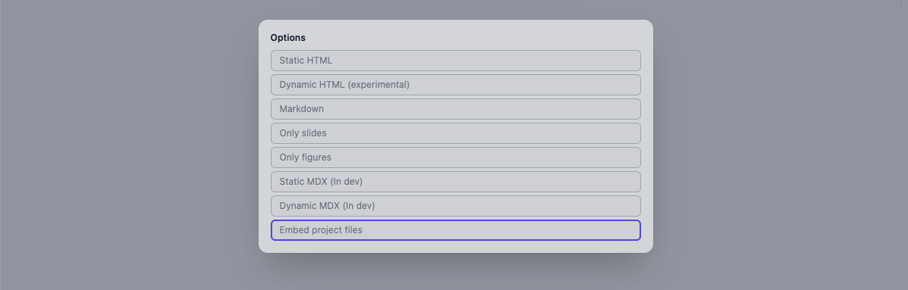

{/* add this script to the body  */}
{/* https://cdn.jsdelivr.net/gh/WLJSTeam/web-components@latest/src/common/app.js */}
<wljs-store json="./attachments/153fa6a3-11af-41ef-87a0-aec56103b8b4.txt"></wljs-store>

## Improved support for SummaryBox and special symbols
Now `ResourceFunction` has its representation, and many other from the function repository can render correctly

<WLJSWrapper><wljs-editor display="codemirror" type="Input" editable="true"  >{`metric = ResourceFunction["MetricTensor"];`}</wljs-editor></WLJSWrapper>

<WLJSWrapper><wljs-editor display="codemirror" type="Input" editable="true" encoded="true"  >{`metric%20%3D%20ResourceFunction%5B%28%2AVB%5B%2A%29%20ResourceObject%5B%3C%7C%22Name%22%20-%3E%20%22MetricTensor%22%2C%20%22ShortName%22%20-%3E%20%22MetricTensor%22%2C%20%22UUID%22%20-%3E%20%22c6c98873-a3bc-43e4-a1a4-ed6e5dbbaa32%22%2C%20%22ResourceType%22%20-%3E%20%22Function%22%2C%20%22Version%22%20-%3E%20%221.0.0%22%2C%20%22Description%22%20-%3E%20%22Represent%20a%20metric%20tensor%20%28field%29%20for%20a%20Riemannian%20or%20pseudo-Riemannian%20manifold%22%2C%20%22RepositoryLocation%22%20-%3E%20URL%5B%22https%3A%2F%2Fwww.wolframcloud.com%2Fobj%2Fresourcesystem%2Fapi%2F1.0%22%5D%2C%20%22SymbolName%22%20-%3E%20%22FunctionRepository%60%24e8bf75f345d9428d8514b42f99452556%60MetricTensor%22%2C%20%22FunctionLocation%22%20-%3E%20CloudObject%5B%22https%3A%2F%2Fwww.wolframcloud.com%2Fobj%2F841aede1-5fed-4606-91bd-ebe5f6619e11%22%5D%7C%3E%2C%20ResourceSystemBase%20-%3E%20Automatic%5D%20%28%2A%2C%2A%29%28%2A%221%3AeJxNj09rwzAMxbN2659dBr0MeloP%2FQI59taxlBWyFpIs57qxPAy2BbLD1m8%2FOS60lx96T9KztTpjpcZZlvkl4x3%2Fdkj2tCUS7gdk3Vsr6MK2eogzL4wdoQuFk62m0AuTGo%2BMTzRyKA7o4GaX2gc1iur17oVr8j6AbTX81pO4Jyxs3tLsM6OQOiDFdkqbMo5KGRQyGXPGd1V%2BQIcS6gWrdZ5%2FQSDdNeA8EssUFz9S9QbqWSxAyKMzl8FtqAf%2FFO8SxsM%2FDdFEIQ%3D%3D%22%2A%29%28%2A%5DVB%2A%29%5D%5B%7B%22Schwarzschild%22%2C%201%7D%2C%20%7Bt%2C%20r%2C%20a1%2C%20a2%7D%5D`}</wljs-editor></WLJSWrapper>

<WLJSWrapper><wljs-editor display="codemirror" type="Output" encoded="true"  >{`%28%2AVB%5B%2A%29BoxForm%60temporalStorage%24271064%28%2A%2C%2A%29%28%2A%221%3AeJxdkstum0AARa20lap%2BRZtFldiRADPgpDtwAGMMgwEDJsqCxxgDE8AMmMfXN%2B6ym6N7r%2B7y%2FIoq6%2FRlNpuRH5%2BQkqytGjdDvf37bjbTUdtksYNKUjVvD3NXfJs%2F%2FnyYP80fH%2Bb3zB%2B0HdsDw%2Bz6STiUAQUytN6BLVwjewSN7sOWZ5PkNUsawyjpRbAUjbqoIY4pEFJLbZ%2FAnBJ0v%2BfYzbUzo7g0FpjT1GhAF8YbAaBNqRoCy6mOmnYE8sfzcX8plbbOmPNhPHl4a5%2FSY7hdl1qgyHWnMzQLSWUT2R0YCCeoxoW%2FFlV150TtwKmWtXG7LrLMXf6xvXQnxyaeGjMWgaFzjCR3D43cp70wWIw08By9p1gM92ZugNcoYCLX0oF5IXzLOrQm62uv1PBBmlbusWj1emk4vbGYOCkttqlTgf6F2AdbCgF9Vcqzp3TTSs6FTKT7LcwCKR7Pq4WhuHhfa7LqNv7SxfUkeUA%2BWoSLLDplhWnUVVJ88Jndx%2FmQKEJcwL0CI%2F5sp0v%2BOavEvgUmV12JmSNeROq57J9Hb10lLJNWQ9xeAwrvTENgSt4XdMoc3XbpV2iiumh4iVlMJrXUuLg2eUYszQMnpocx2KT%2BDundcjJepKIbVsmqyCuSCSzYFMWmr9hUGbOOw%2Fc3B95dcf74frq76fP1E1aHkf39FlCYwBKP%2F1an6dB%2Fn5trNsIobsMII%2FLts8ohJugvJZfNvg%3D%3D%22%2A%29%28%2A%5DVB%2A%29`}</wljs-editor></WLJSWrapper>

## Improved support for primitives Graphics3D

### Tubes, Spheres inside `GraphicsComplex`

`GraphicsComplex` expression is an efficient way of rendering many objects with shared coordinates, vertices, normals and colors. For a long time it was only possible for `Polygon` to work with such structures. Now we added the support for `Tube`, `Sphere`, `Line`

<WLJSWrapper><wljs-editor display="codemirror" type="Input" editable="true"  >{`decomposition = ResourceFunction["DiscreteHypersurfaceDecomposition"][
	  metric, {t, 0, 1}, {r, 0, 4}, {a1, -Pi, Pi}, 200, 1.5];
	decomposition["CoordinatizedPolarGraphColored"] // GraphPlot3D `}</wljs-editor></WLJSWrapper>

<WLJSWrapper><wljs-editor display="codemirror" type="Output"  >{`(*VB[*)(FrontEndRef["d935435c-c070-49da-b160-7822545d2d50"])(*,*)(*"1:eJxTTMoPSmNkYGAoZgESHvk5KRCeEJBwK8rPK3HNS3GtSE0uLUlMykkNVgEKp1gam5oYmybrJhuYG+iaWKYk6iYZmhnomlsYGZmamKYYpZgaAAB4dhTc"*)(*]VB*)`}</wljs-editor></WLJSWrapper>

## Tube supports variable radius and dynamics!

The original implementation of Tube geometry from the standard library of THREE.js was quite limited. We reimplemented `Tube` from scratch in Javascript manually generating each vertex, normal and then passing it to a dynamic buffer of GPU.

Now it works much faster and does support dynamic updates of both: coordinates and radius. We don't waste the resources of GPU and heavily reuse the created buffers

<WLJSWrapper><wljs-editor display="codemirror" type="Input" editable="true"  >{`Tube[{{0,1,0}, {0,0,0}, {0,-1,0}}, {0.2,0.3,0.1}] // Graphics3D `}</wljs-editor></WLJSWrapper>

<WLJSWrapper><wljs-editor display="codemirror" type="Output"  >{`(*VB[*)(Graphics3D[Tube[{{0, 1, 0}, {0, 0, 0}, {0, -1, 0}}, {0.2, 0.3, 0.1}]])(*,*)(*"1:eJxTTMoPSmNkYGAoZgESHvk5KRAeF5BwL0osyMhMLjZ2SWOCqQgpTUpNY4bxfDKLS1B5mUCaIRNkBJiFTZIBn+R/IMAiWTRrJgictC8yBoPL9lCRnfYA05Irhw=="*)(*]VB*)`}</wljs-editor></WLJSWrapper>

Here is a beautiful example of using tubes to draw scalar fields (taken from [stackoverflow](https://mathematica.stackexchange.com/questions/687/id-like-to-display-field-lines-for-a-point-charge-in-3-dimensions))

<WLJSWrapper><wljs-editor display="codemirror" type="Output"  >{`(*VB[*)(FrontEndRef["730749d0-16d4-41b0-874c-cf9fa7d38b91"])(*,*)(*"1:eJxTTMoPSmNkYGAoZgESHvk5KRCeEJBwK8rPK3HNS3GtSE0uLUlMykkNVgEKmxsbmJtYphjoGpqlmOiaGCYZ6FqYmyTrJqdZpiWapxhbJFkaAgB1ZBVM"*)(*]VB*)`}</wljs-editor></WLJSWrapper>

There are still some issues with calculating normals at the ends, but we will fix it later.

## New export feature

__Keep the filesystem within the notebook__

It allows you to compress the whole notebook folder and embed it to a notebook. It uses simple `gzip` and stores the binary data as Base64 string

<wljs-html encoded="true">{`%3Cbr%20%2F%3E`}</wljs-html>

Then you only need to share your `.wln` file and on the first start it will self extract the files maintaining the original folder structure.

## Experimental: Import WLN notebook
It might come handy, if you don't want to create a library, but still like to reuse some functions or templates from the other notebook.

We have registered the converter for that reason. What it does?<wljs-html encoded="true">{`%3Cbr%20%2F%3E`}</wljs-html><wljs-html encoded="true">{`%3Cbr%20%2F%3E`}</wljs-html>

1. Evaluate all initialization cells in the isolated context (__can be any kind of cell__)
2. Evalaute the last input cell in the notebook and return the result (__must be wolfram language cell__)

Since it involves breaking the order of  evaluation, that cell will will be evaluated 2 times. For example I have WLX templates defined in other notebook, that I would like to reuse here

<WLJSWrapper><wljs-editor display="codemirror" type="Input" editable="true"  >{`MyBigHeader = NotebookEvaluateAsModule[
	  FileNameJoin[{NotebookDirectory[], "attachments", "detect.wln"}]
	];`}</wljs-editor></WLJSWrapper>

<WLJSWrapper><wljs-editor display="codemirror" type="Input" editable="true"  >{`MyBigHeader`}</wljs-editor></WLJSWrapper>

<WLJSWrapper><wljs-editor display="codemirror" type="Output" encoded="true"  >{`rm1159692765922806780G%60Header`}</wljs-editor></WLJSWrapper>

Now we can safely use it

<WLJSWrapper><wljs-editor display="codemirror" type="Input" editable="true"  >{`.slide
	
	<MyBigHeader>Title</MyBigHeader>`}</wljs-editor></WLJSWrapper>

<WLJSWrapper><wljs-editor display="slide" type="Output"  >{`<dummy ><h2 style="
	    white-space: nowrap;
	    display: inline-block;
	    font-size: 400px;">Title</h2></dummy>`}</wljs-editor></WLJSWrapper>

You can see the unique context of the given symbol

<WLJSWrapper><wljs-editor display="codemirror" type="Input" editable="true"  >{`MyBigHeader`}</wljs-editor></WLJSWrapper>

<WLJSWrapper><wljs-editor display="codemirror" type="Output" encoded="true"  >{`bespeak6311g%60Header`}</wljs-editor></WLJSWrapper>

Or something even cooller! Let it be a __piano view__

<WLJSWrapper><wljs-editor display="codemirror" type="Input" editable="true"  >{`pianoView = NotebookEvaluateAsModule[
	  FileNameJoin[{NotebookDirectory[], "attachments", "Piano.wln"}]
	];`}</wljs-editor></WLJSWrapper>

Try to play

<WLJSWrapper><wljs-editor display="codemirror" type="Input" editable="true"  >{`pianoView[]`}</wljs-editor></WLJSWrapper>

<WLJSWrapper><wljs-editor display="codemirror" type="Output"  >{`(*VB[*)(FrontEndRef["6c4b3601-e742-44ed-b67e-db2ce6b04f2d"])(*,*)(*"1:eJxTTMoPSmNkYGAoZgESHvk5KRCeEJBwK8rPK3HNS3GtSE0uLUlMykkNVgEKmyWbJBmbGRjqppqbGOmamKSm6CaZmafqpiQZJaeaJRmYpBmlAACDGRX7"*)(*]VB*)`}</wljs-editor></WLJSWrapper>

## TabView implemented!
We have added the support for `TabView`

<WLJSWrapper><wljs-editor display="codemirror" type="Input" editable="true"  >{`TabView[{
	  Sin->Plot3D[Sin[x] Sin[y], {x,-2Pi,2Pi}, {y,-2Pi,2Pi}], 
	  Sinh->Plot3D[Sinh[x] Sinh[y], {x,-2Pi,2Pi}, {y,-2Pi,2Pi}]
	}] `}</wljs-editor></WLJSWrapper>

<WLJSWrapper><wljs-editor display="codemirror" type="Output"  >{`(*VB[*)(Null)(*,*)(*"1:eJytUstu00AUDZQFYskfNGKRGEbyczJmF0euI6dNy9hJhKtKzLMxfozr2DT5Pz6McVGFxAZVYnM05+jeueeemXOqsHw1Go0ObzQsVcnl2cDeawjU8UK11beU0G0uHjWVr58rL/ND97tvqLxoVd2FNQ+PgvUdoaVIPmhZQk4l8zggtkmAy2wT+Nx1gT2zTRdSQbnp/PMSyNAMeh4D3LZ84LouBb7nmoA7CFHoIWsG/b98PbF3GkKed6odzCc/NZ0Y2+DWmE6eJ2Ehb8dU+2KMCyAhtYDLTW0X2g6YIcmkL4k2C8d304nxSXcaY+uziI9peqVukmpdfI3mKrsPk+WPwlvhhQjj4HGF2puVs1wnTtQlodlfbsqrU1Gst/fhKvaKIjpt6gamD01TlJF4IE2QF3BBSITrtir7IiY8a/INqXCfzb8sso84+z4eZt9tA2P6Z1Xc64TeDgdB+HVdnp7UtO3FywKwLFtYemWAPNfRr2QyQIRwALWpKREiiNnovwUQHRVpsKqqfd3smpxE1z2Jg0MBT6Rq9m0b73UoBGe7BdZ6l83nAYJ4t3lZAPnwqX4BI4TKKw=="*)(*]VB*)`}</wljs-editor></WLJSWrapper>

And it will work offline, since the widget prerenders all states and just swap between them using HTML and JS.

It has `WLXForm` implemented, therefore it can work on slides too

<WLJSWrapper><wljs-editor display="codemirror" type="Input" editable="true"  >{`TabWidget = TabView[{
	  Sin->Plot3D[Sin[x] Sin[y], {x,-2Pi,2Pi}, {y,-2Pi,2Pi}], 
	  Sinh->Plot3D[Sinh[x] Sinh[y], {x,-2Pi,2Pi}, {y,-2Pi,2Pi}]
	}];`}</wljs-editor></WLJSWrapper>

<WLJSWrapper><wljs-editor display="codemirror" type="Input" editable="true"  >{`.slide
	
	## My Tab Widget
	
	<TabWidget/>`}</wljs-editor></WLJSWrapper>

<WLJSWrapper><wljs-editor display="slide" type="Output"  >{`<dummy >
	## My Tab Widget
	
	FrontEndExecutable[e065d062-f0a0-4f67-8c4c-0abbce0ad31c]</dummy>`}</wljs-editor></WLJSWrapper>

## ChoiceDialog and MessageDialog
We added the support for dialog-tools. For example to show the message

<WLJSWrapper><wljs-editor display="codemirror" type="Input" editable="true"  >{`MessageDialog[Plot[x, {x,0,1}]]`}</wljs-editor></WLJSWrapper>

If you want to prompt user to click yes or no, use 

<WLJSWrapper><wljs-editor display="codemirror" type="Input" editable="true"  >{`ChoiceDialog[Plot[x, {x,0,1}]]`}</wljs-editor></WLJSWrapper>

Or choose from the options

<WLJSWrapper><wljs-editor display="codemirror" type="Input" editable="true"  >{`ChoiceDialog["Click on a plot", {
	  Plot[x^2, {x,0,1}] -> 1, 
	  Plot[x^3, {x,0,1}] -> 2
	}]`}</wljs-editor></WLJSWrapper>

<WLJSWrapper><wljs-editor display="codemirror" type="Output"  >{`2`}</wljs-editor></WLJSWrapper>

There is also async version, which returns a `Promise`

<WLJSWrapper><wljs-editor display="codemirror" type="Input" editable="true"  >{`Then[ChoiceDialogAsync["Click on a plot", {
	  Plot[x^2, {x,0,1}] -> 1, 
	  Plot[x^3, {x,0,1}] -> 2
	}], Function[result,
	  Do[Beep[]; Pause[0.2], {result}]
	]];`}</wljs-editor></WLJSWrapper>

<wljs-html encoded="true">{`%0A%3Cstyle%3E%0A%20%20%5Btransparency%3D%22false%22%5D%20.bg-g-trans%20%7B%0A%20%20%20%20background%3A%20transparent%20%21important%3B%0A%20%20%7D%0A%0A%20%20%5Btransparency%3D%22true%22%5D%20.bg-g-trans%20%7B%0A%20%20%20%20background%3A%20transparent%20%21important%3B%0A%20%20%7D%0A%3C%2Fstyle%3E`}</wljs-html>