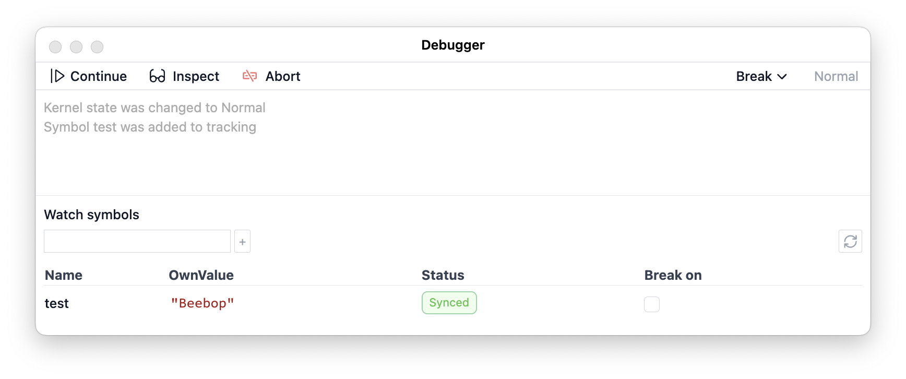
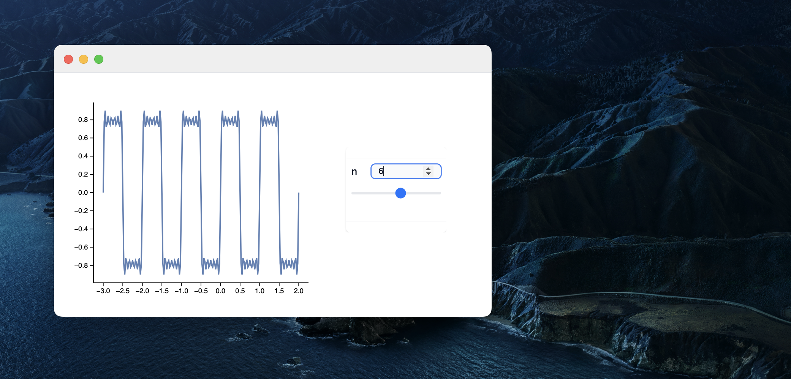

{/* add this script to the body  */}
{/* https://cdn.jsdelivr.net/gh/WLJSTeam/web-components@latest/src/common/app.js */}
<wljs-store json="./attachments/127d3bf8-f8d6-400c-b556-a72fc09ec4b6.txt"></wljs-store>

## Debugger
Now it is part of command palette toolbox, which attaches to a notebook and a working kernel in order to intercept the evaluation process and watch symbol changes

It is still in it's early stage of development. Due to Wolfram Language nature, it is hard to implement traditional `Step in`, `Step out` features. However, one can always watch symbols or `Assert` calls and break on them automatically. In theory it should cover most needs.

See the documentation for the details.

## Standalone widgets
__Write small useful apps using WL, JS, whatever with GUI and isolated resources__. WLJS Notebook can be used as a runtime for standalone widgets.

It is 1 window app, which uses the full capabilities of a normal notebook (similar to Wolfram CDF or LabView programs) and runs in the isolated generated context.

More information [here](https://jerryi.github.io/wljs-docs/frontend/Exporting/Standalone%20Widgets).

## SystemDialogInput
We added the support for more dialog-tools. For example

<WLJSWrapper><wljs-editor display="codemirror" type="Input" editable="true"  >{`SystemDialogInput["FileOpen", {Null, {"Tabular Formats" -> {"*.csv", "*.tsv"}, "Plain Text Document" -> {"*.txt"}}}]`}</wljs-editor></WLJSWrapper>

<WLJSWrapper><wljs-editor display="codemirror" type="Output"  >{`False`}</wljs-editor></WLJSWrapper>

or to save a file

<WLJSWrapper><wljs-editor display="codemirror" type="Input" editable="true"  >{`SystemDialogInput["FileSave", {Null, {"Tabular Formats" -> {"*.csv", "*.tsv"}, "Plain Text Document" -> {"*.txt"}}}]`}</wljs-editor></WLJSWrapper>

## EmitSound
Now it is easier to emit sounds without any widgets, but directly in the background

<WLJSWrapper><wljs-editor display="codemirror" type="Input" editable="true"  >{`EventHandler[InputButton[], EmitSound[(*VB[*)(Audio[FrontEndRef["32a0beab-3455-4368-b998-81ba389257c0"], "SignedInteger16"])(*,*)(*"1:eJxTTMoPSmNkYGAoZgESHvk5KRCeEJBwK8rPK3HNS3GtSE0uLUlMykkNVgEKW6YZWVqmGJrpJidaJumamBlY6CYmJSYCCRNDEwuTJDOL5DQAiJgWCA=="*)(*]VB*)]&]`}</wljs-editor></WLJSWrapper>

<WLJSWrapper><wljs-editor display="codemirror" type="Output"  >{`(*VB[*)(EventObject[<|"Id" -> "4eaec5f1-72eb-4377-8238-480c42e120f2", "Initial" -> False, "View" -> "1e64d51d-a1c0-43a6-ade3-daf8cc9f68c3"|>])(*,*)(*"1:eJxTTMoPSmNkYGAoZgESHvk5KRCeEJBwK8rPK3HNS3GtSE0uLUlMykkNVgEKG6aamaSYGqboJhomG+iaGCea6SampBrrpiSmWSQnW6aZWSQbAwCMqBZd"*)(*]VB*)`}</wljs-editor></WLJSWrapper>

Or together with `Sound`

<WLJSWrapper><wljs-editor display="codemirror" type="Input" editable="true"  >{`Sound[SoundNote[{"E", "A", "D"}]] // EmitSound;`}</wljs-editor></WLJSWrapper>

## InputAutocomplete
We introduce a new input element. It basically aka `InputText`, but constantly running a given async autocomplete function. For example

<WLJSWrapper><wljs-editor display="codemirror" type="Input" editable="true"  >{`EventHandler[InputAutocomplete[Function[{data, cbk},
	  cbk[DictionaryLookup[data<>"*", 6]];
	], "ClearOnSubmit"->False], Function[text,
	  Print[text];
	  SpeechSynthesize[text, GeneratedAssetLocation -> None] // EmitSound
	]]`}</wljs-editor></WLJSWrapper>

<WLJSWrapper><wljs-editor display="codemirror" type="Output"  >{`(*VB[*)(EventObject[<|"Id" -> "1964c77d-8c71-42c8-a1a9-f5bb17f81a90", "View" -> "3d5fd139-b26d-4c59-bb8a-1580886fb949"|>])(*,*)(*"1:eJxTTMoPSmNkYGAoZgESHvk5KRCeEJBwK8rPK3HNS3GtSE0uLUlMykkNVgEKG6eYpqUYGlvqJhmZpeiaJJsCWUkWibqGphYGFhZmaUmWJpYAhqEViA=="*)(*]VB*)`}</wljs-editor></WLJSWrapper>

## WebGL Performance improvements
We implemented an automatic adjustments of WebGL buffers, when the data in Graphics3D primitives changes rapidly. By the default, when you plot something in 3D it assumes that the data is static (as it was before). Then after the first update it converts all GPU buffers from `StaticDrawUsage ` to [`StreamDrawUsage`](https://threejs.org/docs/#api/en/constants/BufferAttributeUsage). It means that any dynamic 3D scenes will have less impact on GPU and CPU. 

## Large formatted output
There were several compains regarding the truncation filter, which limits the number of characters in the output WL cell. We decided based on [this issue](https://github.com/JerryI/wolfram-js-frontend/issues/313) to let a user decide in for each case individually

<WLJSWrapper><wljs-editor display="codemirror" type="Input" editable="true" encoded="true"  >{`Pane%5B%0A%20%20TableForm%5B%0A%20%20%20%20%7B%23%5B%5B1%5D%5D%2C%20If%5B%23%5B%5B2%5D%5D%20%3C%205000.0%2C%20Item%5B%23%5B%5B2%5D%5D%2C%20Background-%3EHue%5BSin%5B%23%5B%5B2%5D%5D%5D%20%2F%2F%20Abs%5D%5D%2C%20%23%5B%5B2%5D%5D%5D%7D%20%26%0A%20%20%2F%40%20RandomReal%5B%7B0%2C10000%7D%2C%20%7B150%2C%202%7D%5D%2C%20%0A%20%20%20TableHeadings%20-%3E%20%7B%0A%20%20%20%20%20Table%5BStringTemplate%5B%22Group%20%60%60%22%5D%5Bi%5D%2C%20%7Bi%2C%20150%7D%5D%2C%20%0A%20%20%20%20%20%7B%22y1%22%2C%20%22y2%22%7D%7D%0A%20%20%5D%0A%2C%20%7B500%2C300%7D%5D`}</wljs-editor></WLJSWrapper>

<WLJSWrapper><wljs-editor display="codemirror" type="Output" encoded="true"  >{`%28%2ABB%5B%2A%29%28%28%2AGB%5B%2A%29%7B%7B%28%2ABB%5B%2A%29%28%29%28%2A%2C%2A%29%28%2A%221%3AeJxTTMoPSmNkYGAo5gMSwSWVOakuqcn5RYkl%2BUVpTCBxFiARVJqTWiwCUpCRXx5cUpSZl%2B6ckViUmFySWlRczAqUcEvMKU4FAAYmFVo%3D%22%2A%29%28%2A%5DBB%2A%29%28%2A%7C%2A%29%2C%28%2A%7C%2A%29%22y1%22%28%2A%7C%2A%29%2C%28%2A%7C%2A%29%22y2%22%7D%28%2A%7C%7C%2A%29%2C%28%2A%7C%7C%2A%29%7B%22Group%201%22%28%2A%7C%2A%29%2C%28%2A%7C%2A%293387.4152630915905%60%28%2A%7C%2A%29%2C%28%2A%7C%2A%296720.739966119174%60%7D%28%2A%7C%7C%2A%29%2C%28%2A%7C%7C%2A%29%7B%22Group%202%22%28%2A%7C%2A%29%2C%28%2A%7C%2A%297728.285732127715%60%28%2A%7C%2A%29%2C%28%2A%7C%2A%297178.415668691825%60%7D%28%2A%7C%7C%2A%29%2C%28%2A%7C%7C%2A%29%7B%22Group%203%22%28%2A%7C%2A%29%2C%28%2A%7C%2A%295257.201572005411%60%28%2A%7C%2A%29%2C%28%2A%7C%2A%297274.9589603808745%60%7D%28%2A%7C%7C%2A%29%2C%28%2A%7C%7C%2A%29%7B%22Group%204%22%28%2A%7C%2A%29%2C%28%2A%7C%2A%293216.410231657732%60%28%2A%7C%2A%29%2C%28%2A%7C%2A%293545.0493106777194%60%28%2AVB%5B%2A%29%28%2A%2A%29%28%2A%2C%2A%29%28%2A%221%3AeJxTTMoPSmNmYGAo5gUSYZmp5S6pyflFiSX5RcEsQBHPktTcNCaQPIgXVJqTWswFZDglJmenF%2BWX5qWkMYIkQSZ4lKYWOa74cV1E8r09mhYeICO4pCizwD%2FPM6%2BgtKSYFSjglphTnAoA9YchAg%3D%3D%22%2A%29%28%2A%5DVB%2A%29%7D%28%2A%7C%7C%2A%29%2C%28%2A%7C%7C%2A%29%7B%22Group%205%22%28%2A%7C%2A%29%2C%28%2A%7C%2A%292014.275355565278%60%28%2A%7C%2A%29%2C%28%2A%7C%2A%2959.92901039936805%60%28%2AVB%5B%2A%29%28%2A%2A%29%28%2A%2C%2A%29%28%2A%221%3AeJxTTMoPSmNmYGAo5gUSYZmp5S6pyflFiSX5RcEsQBHPktTcNCaQPIgXVJqTWswFZDglJmenF%2BWX5qWkMYIkQSZ4lKYWPX2WbGXves4eTQsPkBFcUpRZ4J%2FnmVdQWlLMChRwS8wpTgUA8o4g6A%3D%3D%22%2A%29%28%2A%5DVB%2A%29%7D%28%2A%7C%7C%2A%29%2C%28%2A%7C%7C%2A%29%7B%22Group%206%22%28%2A%7C%2A%29%2C%28%2A%7C%2A%292531.5792965802357%60%28%2A%7C%2A%29%2C%28%2A%7C%2A%298825.04680631178%60%7D%28%2A%7C%7C%2A%29%2C%28%2A%7C%7C%2A%29%7B%22Group%207%22%28%2A%7C%2A%29%2C%28%2A%7C%2A%293313.03027182398%60%28%2A%7C%2A%29%2C%28%2A%7C%2A%293831.928128685391%60%28%2AVB%5B%2A%29%28%2A%2A%29%28%2A%2C%2A%29%28%2A%221%3AeJxTTMoPSmNmYGAo5gUSYZmp5S6pyflFiSX5RcEsQBHPktTcNCaQPIgXVJqTWswFZDglJmenF%2BWX5qWkMYIkQSZ4lKYW3fricZvZ87k9mhYeICO4pCizwD%2FPM6%2BgtKSYFSjglphTnAoABXIhUg%3D%3D%22%2A%29%28%2A%5DVB%2A%29%7D%28%2A%7C%7C%2A%29%2C%28%2A%7C%7C%2A%29%7B%22Group%208%22%28%2A%7C%2A%29%2C%28%2A%7C%2A%296705.766539778007%60%28%2A%7C%2A%29%2C%28%2A%7C%2A%299843.171271692121%60%7D%28%2A%7C%7C%2A%29%2C%28%2A%7C%7C%2A%29%7B%22Group%209%22%28%2A%7C%2A%29%2C%28%2A%7C%2A%293479.892973440885%60%28%2A%7C%2A%29%2C%28%2A%7C%2A%295428.646144853306%60%7D%28%2A%7C%7C%2A%29%2C%28%2A%7C%7C%2A%29%7B%22Group%2010%22%28%2A%7C%2A%29%2C%28%2A%7C%2A%298274.947854495047%60%28%2A%7C%2A%29%2C%28%2A%7C%2A%295671.060177532725%60%7D%28%2A%7C%7C%2A%29%2C%28%2A%7C%7C%2A%29%7B%22Group%2011%22%28%2A%7C%2A%29%2C%28%2A%7C%2A%291543.204317219468%60%28%2A%7C%2A%29%2C%28%2A%7C%2A%294770.471686422336%60%28%2AVB%5B%2A%29%28%2A%2A%29%28%2A%2C%2A%29%28%2A%221%3AeJxTTMoPSmNmYGAo5gUSYZmp5S6pyflFiSX5RcEsQBHPktTcNCaQPIgXVJqTWswFZDglJmenF%2BWX5qWkMYIkQSZ4lKYWeZ3kiy%2F%2F9d4eTQsPkBFcUpRZ4J%2FnmVdQWlLMChRwS8wpTgUA9P0hDg%3D%3D%22%2A%29%28%2A%5DVB%2A%29%7D%28%2A%7C%7C%2A%29%2C%28%2A%7C%7C%2A%29%7B%22Group%2012%22%28%2A%7C%2A%29%2C%28%2A%7C%2A%294750.829751295001%60%28%2A%7C%2A%29%2C%28%2A%7C%2A%296605.973814296063%60%7D%28%2A%7C%7C%2A%29%2C%28%2A%7C%7C%2A%29%7B%22Group%2013%22%28%2A%7C%2A%29%2C%28%2A%7C%2A%296140.256258421401%60%28%2A%7C%2A%29%2C%28%2A%7C%2A%294393.062773222338%60%28%2AVB%5B%2A%29%28%2A%2A%29%28%2A%2C%2A%29%28%2A%221%3AeJxTTMoPSmNmYGAo5gUSYZmp5S6pyflFiSX5RcEsQBHPktTcNCaQPIgXVJqTWswFZDglJmenF%2BWX5qWkMYIkQSZ4lKYWnf694abmgTf2aFp4gIzgkqLMAv88z7yC0pJiVqCAW2JOcSoAMpgiUg%3D%3D%22%2A%29%28%2A%5DVB%2A%29%7D%28%2A%7C%7C%2A%29%2C%28%2A%7C%7C%2A%29%7B%22Group%2014%22%28%2A%7C%2A%29%2C%28%2A%7C%2A%291210.0476878706959%60%28%2A%7C%2A%29%2C%28%2A%7C%2A%291397.4230850474196%60%28%2AVB%5B%2A%29%28%2A%2A%29%28%2A%2C%2A%29%28%2A%221%3AeJxTTMoPSmNmYGAo5gUSYZmp5S6pyflFiSX5RcEsQBHPktTcNCaQPIgXVJqTWswFZDglJmenF%2BWX5qWkMYIkQSZ4lKYWnUtufcu24aE9mhYeICO4pCizwD%2FPM6%2BgtKSYFSjglphTnAoAB54haA%3D%3D%22%2A%29%28%2A%5DVB%2A%29%7D%28%2A%7C%7C%2A%29%2C%28%2A%7C%7C%2A%29%7B%22Group%2015%22%28%2A%7C%2A%29%2C%28%2A%7C%2A%298977.566101967932%60%28%2A%7C%2A%29%2C%28%2A%7C%2A%294947.690779605822%60%28%2AVB%5B%2A%29%28%2A%2A%29%28%2A%2C%2A%29%28%2A%221%3AeJxTTMoPSmNmYGAo5gUSYZmp5S6pyflFiSX5RcEsQBHPktTcNCaQPIgXVJqTWswFZDglJmenF%2BWX5qWkMYIkQSZ4lKYWzd52ScL772V7NC08QEZwSVFmgX%2BeZ15BaUkxK1DALTGnOBUADEshhA%3D%3D%22%2A%29%28%2A%5DVB%2A%29%7D%28%2A%7C%7C%2A%29%2C%28%2A%7C%7C%2A%29%7B%22Group%2016%22%28%2A%7C%2A%29%2C%28%2A%7C%2A%293376.2586784837786%60%28%2A%7C%2A%29%2C%28%2A%7C%2A%297462.0456063630445%60%7D%28%2A%7C%7C%2A%29%2C%28%2A%7C%7C%2A%29%7B%22Group%2017%22%28%2A%7C%2A%29%2C%28%2A%7C%2A%297739.094703017363%60%28%2A%7C%2A%29%2C%28%2A%7C%2A%293181.683188724108%60%28%2AVB%5B%2A%29%28%2A%2A%29%28%2A%2C%2A%29%28%2A%221%3AeJxTTMoPSmNmYGAo5gUSYZmp5S6pyflFiSX5RcEsQBHPktTcNCaQPIgXVJqTWswFZDglJmenF%2BWX5qWkMYIkQSZ4lKYW8URf%2B%2FT%2FwlN7NC08QEZwSVFmgX%2BeZ15BaUkxK1DALTGnOBUAIrIiEQ%3D%3D%22%2A%29%28%2A%5DVB%2A%29%7D%28%2A%7C%7C%2A%29%2C%28%2A%7C%7C%2A%29%7B%22Group%2018%22%28%2A%7C%2A%29%2C%28%2A%7C%2A%295628.022157807467%60%28%2A%7C%2A%29%2C%28%2A%7C%2A%296976.531962613091%60%7D%28%2A%7C%7C%2A%29%2C%28%2A%7C%7C%2A%29%7B%22Group%2019%22%28%2A%7C%2A%29%2C%28%2A%7C%2A%295593.395914134893%60%28%2A%7C%2A%29%2C%28%2A%7C%2A%299471.219498790972%60%7D%28%2A%7C%7C%2A%29%2C%28%2A%7C%7C%2A%29%7B%22Group%2020%22%28%2A%7C%2A%29%2C%28%2A%7C%2A%296700.1599714853255%60%28%2A%7C%2A%29%2C%28%2A%7C%2A%294955.9825291500965%60%28%2AVB%5B%2A%29%28%2A%2A%29%28%2A%2C%2A%29%28%2A%221%3AeJxTTMoPSmNmYGAo5gUSYZmp5S6pyflFiSX5RcEsQBHPktTcNCaQPIgXVJqTWswFZDglJmenF%2BWX5qWkMYIkQSZ4lKYWhe76%2FenHkff2aFp4gIzgkqLMAv88z7yC0pJiVqCAW2JOcSoAR6ki1Q%3D%3D%22%2A%29%28%2A%5DVB%2A%29%7D%28%2A%7C%7C%2A%29%2C%28%2A%7C%7C%2A%29%7B%22Group%2021%22%28%2A%7C%2A%29%2C%28%2A%7C%2A%296435.630977985209%60%28%2A%7C%2A%29%2C%28%2A%7C%2A%299253.575391273367%60%7D%28%2A%7C%7C%2A%29%2C%28%2A%7C%7C%2A%29%7B%22Group%2022%22%28%2A%7C%2A%29%2C%28%2A%7C%2A%29919.1993783996095%60%28%2A%7C%2A%29%2C%28%2A%7C%2A%296621.802793626532%60%7D%28%2A%7C%7C%2A%29%2C%28%2A%7C%7C%2A%29%7B%22Group%2023%22%28%2A%7C%2A%29%2C%28%2A%7C%2A%299311.590148283103%60%28%2A%7C%2A%29%2C%28%2A%7C%2A%295710.604782674616%60%7D%28%2A%7C%7C%2A%29%2C%28%2A%7C%7C%2A%29%7B%22Group%2024%22%28%2A%7C%2A%29%2C%28%2A%7C%2A%295812.941294604021%60%28%2A%7C%2A%29%2C%28%2A%7C%2A%29115.79147118203582%60%28%2AVB%5B%2A%29%28%2A%2A%29%28%2A%2C%2A%29%28%2A%221%3AeJxTTMoPSmNmYGAo5gUSYZmp5S6pyflFiSX5RcEsQBHPktTcNCaQPIgXVJqTWswFZDglJmenF%2BWX5qWkMYIkQSZ4lKYWBUg0tb7fcNseTQsPkBFcUpRZ4J%2FnmVdQWlLMChRwS8wpTgUA9hchFw%3D%3D%22%2A%29%28%2A%5DVB%2A%29%7D%28%2A%7C%7C%2A%29%2C%28%2A%7C%7C%2A%29%7B%22Group%2025%22%28%2A%7C%2A%29%2C%28%2A%7C%2A%294245.841076746165%60%28%2A%7C%2A%29%2C%28%2A%7C%2A%297853.149355907826%60%7D%28%2A%7C%7C%2A%29%2C%28%2A%7C%7C%2A%29%7B%22Group%2026%22%28%2A%7C%2A%29%2C%28%2A%7C%2A%2930.495277917894782%60%28%2A%7C%2A%29%2C%28%2A%7C%2A%297137.695934190495%60%7D%28%2A%7C%7C%2A%29%2C%28%2A%7C%7C%2A%29%7B%22Group%2027%22%28%2A%7C%2A%29%2C%28%2A%7C%2A%297334.464508105524%60%28%2A%7C%2A%29%2C%28%2A%7C%2A%298569.459936916151%60%7D%28%2A%7C%7C%2A%29%2C%28%2A%7C%7C%2A%29%7B%22Group%2028%22%28%2A%7C%2A%29%2C%28%2A%7C%2A%292170.1689717422214%60%28%2A%7C%2A%29%2C%28%2A%7C%2A%29980.8469492382246%60%28%2AVB%5B%2A%29%28%2A%2A%29%28%2A%2C%2A%29%28%2A%221%3AeJxTTMoPSmNmYGAo5gUSYZmp5S6pyflFiSX5RcEsQBHPktTcNCaQPIgXVJqTWswFZDglJmenF%2BWX5qWkMYIkQSZ4lKYWLf8s9Cbx%2FmN7NC08QEZwSVFmgX%2BeZ15BaUkxK1DALTGnOBUAHkUh6Q%3D%3D%22%2A%29%28%2A%5DVB%2A%29%7D%28%2A%7C%7C%2A%29%2C%28%2A%7C%7C%2A%29%7B%22Group%2029%22%28%2A%7C%2A%29%2C%28%2A%7C%2A%29225.12791800777995%60%28%2A%7C%2A%29%2C%28%2A%7C%2A%292608.5596844442734%60%28%2AVB%5B%2A%29%28%2A%2A%29%28%2A%2C%2A%29%28%2A%221%3AeJxTTMoPSmNmYGAo5gUSYZmp5S6pyflFiSX5RcEsQBHPktTcNCaQPIgXVJqTWswFZDglJmenF%2BWX5qWkMYIkQSZ4lKYWuQiaTJ%2FZ%2F9oeTQsPkBFcUpRZ4J%2FnmVdQWlLMChRwS8wpTgUA1UsgYQ%3D%3D%22%2A%29%28%2A%5DVB%2A%29%7D%28%2A%7C%7C%2A%29%2C%28%2A%7C%7C%2A%29%7B%22Group%2030%22%28%2A%7C%2A%29%2C%28%2A%7C%2A%297188.18594177287%60%28%2A%7C%2A%29%2C%28%2A%7C%2A%295154.7783518355445%60%7D%28%2A%7C%7C%2A%29%2C%28%2A%7C%7C%2A%29%7B%22Group%2031%22%28%2A%7C%2A%29%2C%28%2A%7C%2A%293265.8900598931705%60%28%2A%7C%2A%29%2C%28%2A%7C%2A%2954.466448509867405%60%28%2AVB%5B%2A%29%28%2A%2A%29%28%2A%2C%2A%29%28%2A%221%3AeJxTTMoPSmNmYGAo5gUSYZmp5S6pyflFiSX5RcEsQBHPktTcNCaQPIgXVJqTWswFZDglJmenF%2BWX5qWkMYIkQSZ4lKYWJTf%2BcLn8%2FLU9mhYeICO4pCizwD%2FPM6%2BgtKSYFSjglphTnAoAHq0h8w%3D%3D%22%2A%29%28%2A%5DVB%2A%29%7D%28%2A%7C%7C%2A%29%2C%28%2A%7C%7C%2A%29%7B%22Group%2032%22%28%2A%7C%2A%29%2C%28%2A%7C%2A%296397.228668413485%60%28%2A%7C%2A%29%2C%28%2A%7C%2A%295234.975357386753%60%7D%28%2A%7C%7C%2A%29%2C%28%2A%7C%7C%2A%29%7B%22Group%2033%22%28%2A%7C%2A%29%2C%28%2A%7C%2A%297054.474826338061%60%28%2A%7C%2A%29%2C%28%2A%7C%2A%293195.495505606521%60%28%2AVB%5B%2A%29%28%2A%2A%29%28%2A%2C%2A%29%28%2A%221%3AeJxTTMoPSmNmYGAo5gUSYZmp5S6pyflFiSX5RcEsQBHPktTcNCaQPIgXVJqTWswFZDglJmenF%2BWX5qWkMYIkQSZ4lKYWnQ03ZJArumePpoUHyAguKcos8M%2FzzCsoLSlmBQq4JeYUpwIAxCsf8Q%3D%3D%22%2A%29%28%2A%5DVB%2A%29%7D%28%2A%7C%7C%2A%29%2C%28%2A%7C%7C%2A%29%7B%22Group%2034%22%28%2A%7C%2A%29%2C%28%2A%7C%2A%293845.566935607574%60%28%2A%7C%2A%29%2C%28%2A%7C%2A%299946.984967037992%60%7D%28%2A%7C%7C%2A%29%2C%28%2A%7C%7C%2A%29%7B%22Group%2035%22%28%2A%7C%2A%29%2C%28%2A%7C%2A%295099.559298362712%60%28%2A%7C%2A%29%2C%28%2A%7C%2A%292711.1071117217016%60%28%2AVB%5B%2A%29%28%2A%2A%29%28%2A%2C%2A%29%28%2A%221%3AeJxTTMoPSmNmYGAo5gUSYZmp5S6pyflFiSX5RcEsQBHPktTcNCaQPIgXVJqTWswFZDglJmenF%2BWX5qWkMYIkQSZ4lKYWzZPOfa8Xus0eTQsPkBFcUpRZ4J%2FnmVdQWlLMChRwS8wpTgUA3P4gfA%3D%3D%22%2A%29%28%2A%5DVB%2A%29%7D%28%2A%7C%7C%2A%29%2C%28%2A%7C%7C%2A%29%7B%22Group%2036%22%28%2A%7C%2A%29%2C%28%2A%7C%2A%296634.3514623876545%60%28%2A%7C%2A%29%2C%28%2A%7C%2A%293886.0750831417718%60%28%2AVB%5B%2A%29%28%2A%2A%29%28%2A%2C%2A%29%28%2A%221%3AeJxTTMoPSmNmYGAo5gUSYZmp5S6pyflFiSX5RcEsQBHPktTcNCaQPIgXVJqTWswFZDglJmenF%2BWX5qWkMYIkQSZ4lKYWtQY9ftxksNkeTQsPkBFcUpRZ4J%2FnmVdQWlLMChRwS8wpTgUA%2Fe4hMA%3D%3D%22%2A%29%28%2A%5DVB%2A%29%7D%28%2A%7C%7C%2A%29%2C%28%2A%7C%7C%2A%29%7B%22Group%2037%22%28%2A%7C%2A%29%2C%28%2A%7C%2A%29250.00901001837883%60%28%2A%7C%2A%29%2C%28%2A%7C%2A%296107.457243365941%60%7D%28%2A%7C%7C%2A%29%2C%28%2A%7C%7C%2A%29%7B%22Group%2038%22%28%2A%7C%2A%29%2C%28%2A%7C%2A%293616.7907253958183%60%28%2A%7C%2A%29%2C%28%2A%7C%2A%292341.3048801940276%60%28%2AVB%5B%2A%29%28%2A%2A%29%28%2A%2C%2A%29%28%2A%221%3AeJxTTMoPSmNmYGAo5gUSYZmp5S6pyflFiSX5RcEsQBHPktTcNCaQPIgXVJqTWswFZDglJmenF%2BWX5qWkMYIkQSZ4lKYWnb1seTM05rk9mhYeICO4pCizwD%2FPM6%2BgtKSYFSjglphTnAoAC1YheA%3D%3D%22%2A%29%28%2A%5DVB%2A%29%7D%28%2A%7C%7C%2A%29%2C%28%2A%7C%7C%2A%29%7B%22Group%2039%22%28%2A%7C%2A%29%2C%28%2A%7C%2A%296769.908450750838%60%28%2A%7C%2A%29%2C%28%2A%7C%2A%291429.0679432537818%60%28%2AVB%5B%2A%29%28%2A%2A%29%28%2A%2C%2A%29%28%2A%221%3AeJxTTMoPSmNmYGAo5gUSYZmp5S6pyflFiSX5RcEsQBHPktTcNCaQPIgXVJqTWswFZDglJmenF%2BWX5qWkMYIkQSZ4lKYWnc%2BfcMYu8po9mhYeICO4pCizwD%2FPM6%2BgtKSYFSjglphTnAoA%2FyIhNQ%3D%3D%22%2A%29%28%2A%5DVB%2A%29%7D%28%2A%7C%7C%2A%29%2C%28%2A%7C%7C%2A%29%7B%22Group%2040%22%28%2A%7C%2A%29%2C%28%2A%7C%2A%298068.208289062441%60%28%2A%7C%2A%29%2C%28%2A%7C%2A%297769.62187207834%60%7D%28%2A%7C%7C%2A%29%2C%28%2A%7C%7C%2A%29%7B%22Group%2041%22%28%2A%7C%2A%29%2C%28%2A%7C%2A%293549.0945083864935%60%28%2A%7C%2A%29%2C%28%2A%7C%2A%291146.2018794784653%60%28%2AVB%5B%2A%29%28%2A%2A%29%28%2A%2C%2A%29%28%2A%221%3AeJxTTMoPSmNmYGAo5gUSYZmp5S6pyflFiSX5RcEsQBHPktTcNCaQPIgXVJqTWswFZDglJmenF%2BWX5qWkMYIkQSZ4lKYWSU4%2Boby49a49mhYeICO4pCizwD%2FPM6%2BgtKSYFSjglphTnAoA6XQgyg%3D%3D%22%2A%29%28%2A%5DVB%2A%29%7D%28%2A%7C%7C%2A%29%2C%28%2A%7C%7C%2A%29%7B%22Group%2042%22%28%2A%7C%2A%29%2C%28%2A%7C%2A%293509.8730167663834%60%28%2A%7C%2A%29%2C%28%2A%7C%2A%29115.08561072683733%60%28%2AVB%5B%2A%29%28%2A%2A%29%28%2A%2C%2A%29%28%2A%221%3AeJxTTMoPSmNmYGAo5gUSYZmp5S6pyflFiSX5RcEsQBHPktTcNCaQPIgXVJqTWswFZDglJmenF%2BWX5qWkMYIkQSZ4lKYWRe56J5vj8NYeTQsPkBFcUpRZ4J%2FnmVdQWlLMChRwS8wpTgUA8BMg5Q%3D%3D%22%2A%29%28%2A%5DVB%2A%29%7D%28%2A%7C%7C%2A%29%2C%28%2A%7C%7C%2A%29%7B%22Group%2043%22%28%2A%7C%2A%29%2C%28%2A%7C%2A%292742.1333401800002%60%28%2A%7C%2A%29%2C%28%2A%7C%2A%292886.9152197849726%60%28%2AVB%5B%2A%29%28%2A%2A%29%28%2A%2C%2A%29%28%2A%221%3AeJxTTMoPSmNmYGAo5gUSYZmp5S6pyflFiSX5RcEsQBHPktTcNCaQPIgXVJqTWswFZDglJmenF%2BWX5qWkMYIkQSZ4lKYWtZzdpFhSc8oeTQsPkBFcUpRZ4J%2FnmVdQWlLMChRwS8wpTgUA92khDA%3D%3D%22%2A%29%28%2A%5DVB%2A%29%7D%28%2A%7C%7C%2A%29%2C%28%2A%7C%7C%2A%29%7B%22Group%2044%22%28%2A%7C%2A%29%2C%28%2A%7C%2A%298405.532177519683%60%28%2A%7C%2A%29%2C%28%2A%7C%2A%297632.321142250992%60%7D%28%2A%7C%7C%2A%29%2C%28%2A%7C%7C%2A%29%7B%22Group%2045%22%28%2A%7C%2A%29%2C%28%2A%7C%2A%298316.2659146107%60%28%2A%7C%2A%29%2C%28%2A%7C%2A%29510.2671750228801%60%28%2AVB%5B%2A%29%28%2A%2A%29%28%2A%2C%2A%29%28%2A%221%3AeJxTTMoPSmNmYGAo5gUSYZmp5S6pyflFiSX5RcEsQBHPktTcNCaQPIgXVJqTWswFZDglJmenF%2BWX5qWkMYIkQSZ4lKYWZUT9aWUWem%2BPpoUHyAguKcos8M%2FzzCsoLSlmBQq4JeYUpwIA3C0gdQ%3D%3D%22%2A%29%28%2A%5DVB%2A%29%7D%28%2A%7C%7C%2A%29%2C%28%2A%7C%7C%2A%29%7B%22Group%2046%22%28%2A%7C%2A%29%2C%28%2A%7C%2A%295574.486254886464%60%28%2A%7C%2A%29%2C%28%2A%7C%2A%293393.4168220846186%60%28%2AVB%5B%2A%29%28%2A%2A%29%28%2A%2C%2A%29%28%2A%221%3AeJxTTMoPSmNmYGAo5gUSYZmp5S6pyflFiSX5RcEsQBHPktTcNCaQPIgXVJqTWswFZDglJmenF%2BWX5qWkMYIkQSZ4lKYWlclZ%2FLVsuGePpoUHyAguKcos8M%2FzzCsoLSlmBQq4JeYUpwIA3rogjg%3D%3D%22%2A%29%28%2A%5DVB%2A%29%7D%28%2A%7C%7C%2A%29%2C%28%2A%7C%7C%2A%29%7B%22Group%2047%22%28%2A%7C%2A%29%2C%28%2A%7C%2A%299534.92161833377%60%28%2A%7C%2A%29%2C%28%2A%7C%2A%295435.148143473847%60%7D%28%2A%7C%7C%2A%29%2C%28%2A%7C%7C%2A%29%7B%22Group%2048%22%28%2A%7C%2A%29%2C%28%2A%7C%2A%295838.555567987083%60%28%2A%7C%2A%29%2C%28%2A%7C%2A%295938.267141826849%60%7D%28%2A%7C%7C%2A%29%2C%28%2A%7C%7C%2A%29%7B%22Group%2049%22%28%2A%7C%2A%29%2C%28%2A%7C%2A%295853.209725247985%60%28%2A%7C%2A%29%2C%28%2A%7C%2A%296982.847004187366%60%7D%28%2A%7C%7C%2A%29%2C%28%2A%7C%7C%2A%29%7B%22Group%2050%22%28%2A%7C%2A%29%2C%28%2A%7C%2A%293300.8828838945246%60%28%2A%7C%2A%29%2C%28%2A%7C%2A%294429.819295431256%60%28%2AVB%5B%2A%29%28%2A%2A%29%28%2A%2C%2A%29%28%2A%221%3AeJxTTMoPSmNmYGAo5gUSYZmp5S6pyflFiSX5RcEsQBHPktTcNCaQPIgXVJqTWswFZDglJmenF%2BWX5qWkMYIkQSZ4lKYWZbDwv9gte8weTQsPkBFcUpRZ4J%2FnmVdQWlLMChRwS8wpTgUAza0gLw%3D%3D%22%2A%29%28%2A%5DVB%2A%29%7D%28%2A%7C%7C%2A%29%2C%28%2A%7C%7C%2A%29%7B%22Group%2051%22%28%2A%7C%2A%29%2C%28%2A%7C%2A%293348.276732150767%60%28%2A%7C%2A%29%2C%28%2A%7C%2A%298509.789896609775%60%7D%28%2A%7C%7C%2A%29%2C%28%2A%7C%7C%2A%29%7B%22Group%2052%22%28%2A%7C%2A%29%2C%28%2A%7C%2A%296300.5921011683695%60%28%2A%7C%2A%29%2C%28%2A%7C%2A%29717.1957162501876%60%28%2AVB%5B%2A%29%28%2A%2A%29%28%2A%2C%2A%29%28%2A%221%3AeJxTTMoPSmNmYGAo5gUSYZmp5S6pyflFiSX5RcEsQBHPktTcNCaQPIgXVJqTWswFZDglJmenF%2BWX5qWkMYIkQSZ4lKYWHZUuZpwf8NIeTQsPkBFcUpRZ4J%2FnmVdQWlLMChRwS8wpTgUA1l0gWg%3D%3D%22%2A%29%28%2A%5DVB%2A%29%7D%28%2A%7C%7C%2A%29%2C%28%2A%7C%7C%2A%29%7B%22Group%2053%22%28%2A%7C%2A%29%2C%28%2A%7C%2A%297409.162649870585%60%28%2A%7C%2A%29%2C%28%2A%7C%2A%296053.564786300634%60%7D%28%2A%7C%7C%2A%29%2C%28%2A%7C%7C%2A%29%7B%22Group%2054%22%28%2A%7C%2A%29%2C%28%2A%7C%2A%295306.459913725177%60%28%2A%7C%2A%29%2C%28%2A%7C%2A%293331.9066888445814%60%28%2AVB%5B%2A%29%28%2A%2A%29%28%2A%2C%2A%29%28%2A%221%3AeJxTTMoPSmNmYGAo5gUSYZmp5S6pyflFiSX5RcEsQBHPktTcNCaQPIgXVJqTWswFZDglJmenF%2BWX5qWkMYIkQSZ4lKYWFbudZGFme2%2BPpoUHyAguKcos8M%2FzzCsoLSlmBQq4JeYUpwIAt%2B0frA%3D%3D%22%2A%29%28%2A%5DVB%2A%29%7D%28%2A%7C%7C%2A%29%2C%28%2A%7C%7C%2A%29%7B%22Group%2055%22%28%2A%7C%2A%29%2C%28%2A%7C%2A%299774.551224726642%60%28%2A%7C%2A%29%2C%28%2A%7C%2A%292281.30535871153%60%28%2AVB%5B%2A%29%28%2A%2A%29%28%2A%2C%2A%29%28%2A%221%3AeJxTTMoPSmNmYGAo5gUSYZmp5S6pyflFiSX5RcEsQBHPktTcNCaQPIgXVJqTWswFZDglJmenF%2BWX5qWkMYIkQSZ4lKYW9Z42eO5veN8eTQsPkBFcUpRZ4J%2FnmVdQWlLMChRwS8wpTgUA9Jog%2FA%3D%3D%22%2A%29%28%2A%5DVB%2A%29%7D%28%2A%7C%7C%2A%29%2C%28%2A%7C%7C%2A%29%7B%22Group%2056%22%28%2A%7C%2A%29%2C%28%2A%7C%2A%292948.9866953759774%60%28%2A%7C%2A%29%2C%28%2A%7C%2A%297268.230202943832%60%7D%28%2A%7C%7C%2A%29%2C%28%2A%7C%7C%2A%29%7B%22Group%2057%22%28%2A%7C%2A%29%2C%28%2A%7C%2A%295538.852799279175%60%28%2A%7C%2A%29%2C%28%2A%7C%2A%295064.859828425084%60%7D%28%2A%7C%7C%2A%29%2C%28%2A%7C%7C%2A%29%7B%22Group%2058%22%28%2A%7C%2A%29%2C%28%2A%7C%2A%29555.1748409961983%60%28%2A%7C%2A%29%2C%28%2A%7C%2A%298640.020600869258%60%7D%28%2A%7C%7C%2A%29%2C%28%2A%7C%7C%2A%29%7B%22Group%2059%22%28%2A%7C%2A%29%2C%28%2A%7C%2A%294455.961171033905%60%28%2A%7C%2A%29%2C%28%2A%7C%2A%293060.757837803727%60%28%2AVB%5B%2A%29%28%2A%2A%29%28%2A%2C%2A%29%28%2A%221%3AeJxTTMoPSmNmYGAo5gUSYZmp5S6pyflFiSX5RcEsQBHPktTcNCaQPIgXVJqTWswFZDglJmenF%2BWX5qWkMYIkQSZ4lKYWvf8%2B%2BTjHj%2Bf2aFp4gIzgkqLMAv88z7yC0pJiVqCAW2JOcSoAMykiVQ%3D%3D%22%2A%29%28%2A%5DVB%2A%29%7D%28%2A%7C%7C%2A%29%2C%28%2A%7C%7C%2A%29%7B%22Group%2060%22%28%2A%7C%2A%29%2C%28%2A%7C%2A%296538.879803686694%60%28%2A%7C%2A%29%2C%28%2A%7C%2A%295769.545657947334%60%7D%28%2A%7C%7C%2A%29%2C%28%2A%7C%7C%2A%29%7B%22Group%2061%22%28%2A%7C%2A%29%2C%28%2A%7C%2A%293683.0433346759237%60%28%2A%7C%2A%29%2C%28%2A%7C%2A%299015.528648699277%60%7D%28%2A%7C%7C%2A%29%2C%28%2A%7C%7C%2A%29%7B%22Group%2062%22%28%2A%7C%2A%29%2C%28%2A%7C%2A%291850.5751041544336%60%28%2A%7C%2A%29%2C%28%2A%7C%2A%29358.8017887453534%60%28%2AVB%5B%2A%29%28%2A%2A%29%28%2A%2C%2A%29%28%2A%221%3AeJxTTMoPSmNmYGAo5gUSYZmp5S6pyflFiSX5RcEsQBHPktTcNCaQPIgXVJqTWswFZDglJmenF%2BWX5qWkMYIkQSZ4lKYWTZppwCy34LE9mhYeICO4pCizwD%2FPM6%2BgtKSYFSjglphTnAoAzlogLQ%3D%3D%22%2A%29%28%2A%5DVB%2A%29%7D%28%2A%7C%7C%2A%29%2C%28%2A%7C%7C%2A%29%7B%22Group%2063%22%28%2A%7C%2A%29%2C%28%2A%7C%2A%291401.5786366897028%60%28%2A%7C%2A%29%2C%28%2A%7C%2A%295962.5490680126095%60%7D%28%2A%7C%7C%2A%29%2C%28%2A%7C%7C%2A%29%7B%22Group%2064%22%28%2A%7C%2A%29%2C%28%2A%7C%2A%292662.3308535679316%60%28%2A%7C%2A%29%2C%28%2A%7C%2A%299139.797213573474%60%7D%28%2A%7C%7C%2A%29%2C%28%2A%7C%7C%2A%29%7B%22Group%2065%22%28%2A%7C%2A%29%2C%28%2A%7C%2A%29660.4980757296344%60%28%2A%7C%2A%29%2C%28%2A%7C%2A%295018.566775428921%60%7D%28%2A%7C%7C%2A%29%2C%28%2A%7C%7C%2A%29%7B%22Group%2066%22%28%2A%7C%2A%29%2C%28%2A%7C%2A%291760.3526429641388%60%28%2A%7C%2A%29%2C%28%2A%7C%2A%292273.7108606501606%60%28%2AVB%5B%2A%29%28%2A%2A%29%28%2A%2C%2A%29%28%2A%221%3AeJxTTMoPSmNmYGAo5gUSYZmp5S6pyflFiSX5RcEsQBHPktTcNCaQPIgXVJqTWswFZDglJmenF%2BWX5qWkMYIkQSZ4lKYW9Ukq19kyPrdH08IDZASXFGUW%2BOd55hWUlhSzAgXcEnOKUwG0GB%2Bb%22%2A%29%28%2A%5DVB%2A%29%7D%28%2A%7C%7C%2A%29%2C%28%2A%7C%7C%2A%29%7B%22Group%2067%22%28%2A%7C%2A%29%2C%28%2A%7C%2A%298159.909690141871%60%28%2A%7C%2A%29%2C%28%2A%7C%2A%29564.1431487877344%60%28%2AVB%5B%2A%29%28%2A%2A%29%28%2A%2C%2A%29%28%2A%221%3AeJxTTMoPSmNmYGAo5gUSYZmp5S6pyflFiSX5RcEsQBHPktTcNCaQPIgXVJqTWswFZDglJmenF%2BWX5qWkMYIkQSZ4lKYW8XyLsInUfW%2BPpoUHyAguKcos8M%2FzzCsoLSlmBQq4JeYUpwIA0FkgOQ%3D%3D%22%2A%29%28%2A%5DVB%2A%29%7D%28%2A%7C%7C%2A%29%2C%28%2A%7C%7C%2A%29%7B%22Group%2068%22%28%2A%7C%2A%29%2C%28%2A%7C%2A%295885.952122099021%60%28%2A%7C%2A%29%2C%28%2A%7C%2A%29695.2783171110859%60%28%2AVB%5B%2A%29%28%2A%2A%29%28%2A%2C%2A%29%28%2A%221%3AeJxTTMoPSmNmYGAo5gUSYZmp5S6pyflFiSX5RcEsQBHPktTcNCaQPIgXVJqTWswFZDglJmenF%2BWX5qWkMYIkQSZ4lKYWra46JmK94ZU9mhYeICO4pCizwD%2FPM6%2BgtKSYFSjglphTnAoA9PEhAg%3D%3D%22%2A%29%28%2A%5DVB%2A%29%7D%28%2A%7C%7C%2A%29%2C%28%2A%7C%7C%2A%29%7B%22Group%2069%22%28%2A%7C%2A%29%2C%28%2A%7C%2A%296113.395286968524%60%28%2A%7C%2A%29%2C%28%2A%7C%2A%298398.15241658259%60%7D%28%2A%7C%7C%2A%29%2C%28%2A%7C%7C%2A%29%7B%22Group%2070%22%28%2A%7C%2A%29%2C%28%2A%7C%2A%298575.542668753315%60%28%2A%7C%2A%29%2C%28%2A%7C%2A%298266.841986571599%60%7D%28%2A%7C%7C%2A%29%2C%28%2A%7C%7C%2A%29%7B%22Group%2071%22%28%2A%7C%2A%29%2C%28%2A%7C%2A%291891.4446015478006%60%28%2A%7C%2A%29%2C%28%2A%7C%2A%29780.6550972947971%60%28%2AVB%5B%2A%29%28%2A%2A%29%28%2A%2C%2A%29%28%2A%221%3AeJxTTMoPSmNmYGAo5gUSYZmp5S6pyflFiSX5RcEsQBHPktTcNCaQPIgXVJqTWswFZDglJmenF%2BWX5qWkMYIkQSZ4lKYWCe5jdFf9894eTQsPkBFcUpRZ4J%2FnmVdQWlLMChRwS8wpTgUA0z8gVQ%3D%3D%22%2A%29%28%2A%5DVB%2A%29%7D%28%2A%7C%7C%2A%29%2C%28%2A%7C%7C%2A%29%7B%22Group%2072%22%28%2A%7C%2A%29%2C%28%2A%7C%2A%297585.262251100685%60%28%2A%7C%2A%29%2C%28%2A%7C%2A%298527.272751886696%60%7D%28%2A%7C%7C%2A%29%2C%28%2A%7C%7C%2A%29%7B%22Group%2073%22%28%2A%7C%2A%29%2C%28%2A%7C%2A%291192.3879849984678%60%28%2A%7C%2A%29%2C%28%2A%7C%2A%29644.7805569036809%60%28%2AVB%5B%2A%29%28%2A%2A%29%28%2A%2C%2A%29%28%2A%221%3AeJxTTMoPSmNmYGAo5gUSYZmp5S6pyflFiSX5RcEsQBHPktTcNCaQPIgXVJqTWswFZDglJmenF%2BWX5qWkMYIkQSZ4lKYWzU0IXO314qk9mhYeICO4pCizwD%2FPM6%2BgtKSYFSjglphTnAoA%2FnYhPg%3D%3D%22%2A%29%28%2A%5DVB%2A%29%7D%28%2A%7C%7C%2A%29%2C%28%2A%7C%7C%2A%29%7B%22Group%2074%22%28%2A%7C%2A%29%2C%28%2A%7C%2A%293420.498328079979%60%28%2A%7C%2A%29%2C%28%2A%7C%2A%291569.6569004414723%60%28%2AVB%5B%2A%29%28%2A%2A%29%28%2A%2C%2A%29%28%2A%221%3AeJxTTMoPSmNmYGAo5gUSYZmp5S6pyflFiSX5RcEsQBHPktTcNCaQPIgXVJqTWswFZDglJmenF%2BWX5qWkMYIkQSZ4lKYWPRDRvNsv%2BNYeTQsPkBFcUpRZ4J%2FnmVdQWlLMChRwS8wpTgUA5zIgtQ%3D%3D%22%2A%29%28%2A%5DVB%2A%29%7D%28%2A%7C%7C%2A%29%2C%28%2A%7C%7C%2A%29%7B%22Group%2075%22%28%2A%7C%2A%29%2C%28%2A%7C%2A%299295.497533657759%60%28%2A%7C%2A%29%2C%28%2A%7C%2A%291581.1299233548707%60%28%2AVB%5B%2A%29%28%2A%2A%29%28%2A%2C%2A%29%28%2A%221%3AeJxTTMoPSmNmYGAo5gUSYZmp5S6pyflFiSX5RcEsQBHPktTcNCaQPIgXVJqTWswFZDglJmenF%2BWX5qWkMYIkQSZ4lKYWbbx5fdpq25f2aFp4gIzgkqLMAv88z7yC0pJiVqCAW2JOcSoAIjIh9g%3D%3D%22%2A%29%28%2A%5DVB%2A%29%7D%28%2A%7C%7C%2A%29%2C%28%2A%7C%7C%2A%29%7B%22Group%2076%22%28%2A%7C%2A%29%2C%28%2A%7C%2A%291153.479781458287%60%28%2A%7C%2A%29%2C%28%2A%7C%2A%29898.9263514173326%60%28%2AVB%5B%2A%29%28%2A%2A%29%28%2A%2C%2A%29%28%2A%221%3AeJxTTMoPSmNmYGAo5gUSYZmp5S6pyflFiSX5RcEsQBHPktTcNCaQPIgXVJqTWswFZDglJmenF%2BWX5qWkMYIkQSZ4lKYWcYnbh2%2FZdcseTQsPkBFcUpRZ4J%2FnmVdQWlLMChRwS8wpTgUAyx4gLQ%3D%3D%22%2A%29%28%2A%5DVB%2A%29%7D%28%2A%7C%7C%2A%29%2C%28%2A%7C%7C%2A%29%7B%22Group%2077%22%28%2A%7C%2A%29%2C%28%2A%7C%2A%298310.041824626936%60%28%2A%7C%2A%29%2C%28%2A%7C%2A%292282.8645944627897%60%28%2AVB%5B%2A%29%28%2A%2A%29%28%2A%2C%2A%29%28%2A%221%3AeJxTTMoPSmNmYGAo5gUSYZmp5S6pyflFiSX5RcEsQBHPktTcNCaQPIgXVJqTWswFZDglJmenF%2BWX5qWkMYIkQSZ4lKYW9fS66V%2BRe2OPpoUHyAguKcos8M%2FzzCsoLSlmBQq4JeYUpwIA4g8gmg%3D%3D%22%2A%29%28%2A%5DVB%2A%29%7D%28%2A%7C%7C%2A%29%2C%28%2A%7C%7C%2A%29%7B%22Group%2078%22%28%2A%7C%2A%29%2C%28%2A%7C%2A%292124.771894464635%60%28%2A%7C%2A%29%2C%28%2A%7C%2A%297259.3703842127325%60%7D%28%2A%7C%7C%2A%29%2C%28%2A%7C%7C%2A%29%7B%22Group%2079%22%28%2A%7C%2A%29%2C%28%2A%7C%2A%296445.561396521338%60%28%2A%7C%2A%29%2C%28%2A%7C%2A%298101.755315822764%60%7D%28%2A%7C%7C%2A%29%2C%28%2A%7C%7C%2A%29%7B%22Group%2080%22%28%2A%7C%2A%29%2C%28%2A%7C%2A%296094.749279339019%60%28%2A%7C%2A%29%2C%28%2A%7C%2A%292701.5813386237332%60%28%2AVB%5B%2A%29%28%2A%2A%29%28%2A%2C%2A%29%28%2A%221%3AeJxTTMoPSmNmYGAo5gUSYZmp5S6pyflFiSX5RcEsQBHPktTcNCaQPIgXVJqTWswFZDglJmenF%2BWX5qWkMYIkQSZ4lKYW2X5dJWX%2B%2Fbg9mhYeICO4pCizwD%2FPM6%2BgtKSYFSjglphTnAoA%2BIIhGQ%3D%3D%22%2A%29%28%2A%5DVB%2A%29%7D%28%2A%7C%7C%2A%29%2C%28%2A%7C%7C%2A%29%7B%22Group%2081%22%28%2A%7C%2A%29%2C%28%2A%7C%2A%299295.959262077664%60%28%2A%7C%2A%29%2C%28%2A%7C%2A%299239.886271657226%60%7D%28%2A%7C%7C%2A%29%2C%28%2A%7C%7C%2A%29%7B%22Group%2082%22%28%2A%7C%2A%29%2C%28%2A%7C%2A%296958.023416403001%60%28%2A%7C%2A%29%2C%28%2A%7C%2A%291054.6654044359002%60%28%2AVB%5B%2A%29%28%2A%2A%29%28%2A%2C%2A%29%28%2A%221%3AeJxTTMoPSmNmYGAo5gUSYZmp5S6pyflFiSX5RcEsQBHPktTcNCaQPIgXVJqTWswFZDglJmenF%2BWX5qWkMYIkQSZ4lKYWORr%2FlLNzemmPpoUHyAguKcos8M%2FzzCsoLSlmBQq4JeYUpwIAy%2FQgIg%3D%3D%22%2A%29%28%2A%5DVB%2A%29%7D%28%2A%7C%7C%2A%29%2C%28%2A%7C%7C%2A%29%7B%22Group%2083%22%28%2A%7C%2A%29%2C%28%2A%7C%2A%29635.6076732458168%60%28%2A%7C%2A%29%2C%28%2A%7C%2A%297000.388538679737%60%7D%28%2A%7C%7C%2A%29%2C%28%2A%7C%7C%2A%29%7B%22Group%2084%22%28%2A%7C%2A%29%2C%28%2A%7C%2A%29517.337072205446%60%28%2A%7C%2A%29%2C%28%2A%7C%2A%296838.012226717459%60%7D%28%2A%7C%7C%2A%29%2C%28%2A%7C%7C%2A%29%7B%22Group%2085%22%28%2A%7C%2A%29%2C%28%2A%7C%2A%296671.342019530795%60%28%2A%7C%2A%29%2C%28%2A%7C%2A%292696.2081414550084%60%28%2AVB%5B%2A%29%28%2A%2A%29%28%2A%2C%2A%29%28%2A%221%3AeJxTTMoPSmNmYGAo5gUSYZmp5S6pyflFiSX5RcEsQBHPktTcNCaQPIgXVJqTWswFZDglJmenF%2BWX5qWkMYIkQSZ4lKYWbZVQEz%2Br%2FNQeTQsPkBFcUpRZ4J%2FnmVdQWlLMChRwS8wpTgUAyDwgDQ%3D%3D%22%2A%29%28%2A%5DVB%2A%29%7D%28%2A%7C%7C%2A%29%2C%28%2A%7C%7C%2A%29%7B%22Group%2086%22%28%2A%7C%2A%29%2C%28%2A%7C%2A%296597.428603633976%60%28%2A%7C%2A%29%2C%28%2A%7C%2A%29761.2588396718274%60%28%2AVB%5B%2A%29%28%2A%2A%29%28%2A%2C%2A%29%28%2A%221%3AeJxTTMoPSmNmYGAo5gUSYZmp5S6pyflFiSX5RcEsQBHPktTcNCaQPIgXVJqTWswFZDglJmenF%2BWX5qWkMYIkQSZ4lKYWtZuvO8594ZU9mhYeICO4pCizwD%2FPM6%2BgtKSYFSjglphTnAoA%2Bk8hJg%3D%3D%22%2A%29%28%2A%5DVB%2A%29%7D%28%2A%7C%7C%2A%29%2C%28%2A%7C%7C%2A%29%7B%22Group%2087%22%28%2A%7C%2A%29%2C%28%2A%7C%2A%293484.8533890498675%60%28%2A%7C%2A%29%2C%28%2A%7C%2A%294572.214184168997%60%28%2AVB%5B%2A%29%28%2A%2A%29%28%2A%2C%2A%29%28%2A%221%3AeJxTTMoPSmNmYGAo5gUSYZmp5S6pyflFiSX5RcEsQBHPktTcNCaQPIgXVJqTWswFZDglJmenF%2BWX5qWkMYIkQSZ4lKYWmYZM%2Bfbx5Ft7NC08QEZwSVFmgX%2BeZ15BaUkxK1DALTGnOBUAG4Mh6A%3D%3D%22%2A%29%28%2A%5DVB%2A%29%7D%28%2A%7C%7C%2A%29%2C%28%2A%7C%7C%2A%29%7B%22Group%2088%22%28%2A%7C%2A%29%2C%28%2A%7C%2A%297909.193032259278%60%28%2A%7C%2A%29%2C%28%2A%7C%2A%295123.43495497281%60%7D%28%2A%7C%7C%2A%29%2C%28%2A%7C%7C%2A%29%7B%22Group%2089%22%28%2A%7C%2A%29%2C%28%2A%7C%2A%291550.5445180308852%60%28%2A%7C%2A%29%2C%28%2A%7C%2A%293551.622471720142%60%28%2AVB%5B%2A%29%28%2A%2A%29%28%2A%2C%2A%29%28%2A%221%3AeJxTTMoPSmNmYGAo5gUSYZmp5S6pyflFiSX5RcEsQBHPktTcNCaQPIgXVJqTWswFZDglJmenF%2BWX5qWkMYIkQSZ4lKYWHYz2vPD%2By3t7NC08QEZwSVFmgX%2BeZ15BaUkxK1DALTGnOBUAKmYiNQ%3D%3D%22%2A%29%28%2A%5DVB%2A%29%7D%28%2A%7C%7C%2A%29%2C%28%2A%7C%7C%2A%29%7B%22Group%2090%22%28%2A%7C%2A%29%2C%28%2A%7C%2A%294660.873420787877%60%28%2A%7C%2A%29%2C%28%2A%7C%2A%292877.183456246368%60%28%2AVB%5B%2A%29%28%2A%2A%29%28%2A%2C%2A%29%28%2A%221%3AeJxTTMoPSmNmYGAo5gUSYZmp5S6pyflFiSX5RcEsQBHPktTcNCaQPIgXVJqTWswFZDglJmenF%2BWX5qWkMYIkQSZ4lKYWxakrd87svm%2BPpoUHyAguKcos8M%2FzzCsoLSlmBQq4JeYUpwIA1g4gYg%3D%3D%22%2A%29%28%2A%5DVB%2A%29%7D%28%2A%7C%7C%2A%29%2C%28%2A%7C%7C%2A%29%7B%22Group%2091%22%28%2A%7C%2A%29%2C%28%2A%7C%2A%295558.80508909046%60%28%2A%7C%2A%29%2C%28%2A%7C%2A%298136.134120371924%60%7D%28%2A%7C%7C%2A%29%2C%28%2A%7C%7C%2A%29%7B%22Group%2092%22%28%2A%7C%2A%29%2C%28%2A%7C%2A%297608.750379884172%60%28%2A%7C%2A%29%2C%28%2A%7C%2A%293482.783207624014%60%28%2AVB%5B%2A%29%28%2A%2A%29%28%2A%2C%2A%29%28%2A%221%3AeJxTTMoPSmNmYGAo5gUSYZmp5S6pyflFiSX5RcEsQBHPktTcNCaQPIgXVJqTWswFZDglJmenF%2BWX5qWkMYIkQSZ4lKYWPTyufv2t9zt7NC08QEZwSVFmgX%2BeZ15BaUkxK1DALTGnOBUAIjkh%2Bg%3D%3D%22%2A%29%28%2A%5DVB%2A%29%7D%28%2A%7C%7C%2A%29%2C%28%2A%7C%7C%2A%29%7B%22Group%2093%22%28%2A%7C%2A%29%2C%28%2A%7C%2A%296912.783919593239%60%28%2A%7C%2A%29%2C%28%2A%7C%2A%291545.3485693797484%60%28%2AVB%5B%2A%29%28%2A%2A%29%28%2A%2C%2A%29%28%2A%221%3AeJxTTMoPSmNmYGAo5gUSYZmp5S6pyflFiSX5RcEsQBHPktTcNCaQPIgXVJqTWswFZDglJmenF%2BWX5qWkMYIkQSZ4lKYWicUcZva8ctkeTQsPkBFcUpRZ4J%2FnmVdQWlLMChRwS8wpTgUA0%2FogVg%3D%3D%22%2A%29%28%2A%5DVB%2A%29%7D%28%2A%7C%7C%2A%29%2C%28%2A%7C%7C%2A%29%7B%22Group%2094%22%28%2A%7C%2A%29%2C%28%2A%7C%2A%297024.769756698097%60%28%2A%7C%2A%29%2C%28%2A%7C%2A%292326.0987129229434%60%28%2AVB%5B%2A%29%28%2A%2A%29%28%2A%2C%2A%29%28%2A%221%3AeJxTTMoPSmNmYGAo5gUSYZmp5S6pyflFiSX5RcEsQBHPktTcNCaQPIgXVJqTWswFZDglJmenF%2BWX5qWkMYIkQSZ4lKYWaSyvqGRheG%2BPpoUHyAguKcos8M%2FzzCsoLSlmBQq4JeYUpwIAwQ4f4Q%3D%3D%22%2A%29%28%2A%5DVB%2A%29%7D%28%2A%7C%7C%2A%29%2C%28%2A%7C%7C%2A%29%7B%22Group%2095%22%28%2A%7C%2A%29%2C%28%2A%7C%2A%294458.162219222257%60%28%2A%7C%2A%29%2C%28%2A%7C%2A%297761.84632678124%60%7D%28%2A%7C%7C%2A%29%2C%28%2A%7C%7C%2A%29%7B%22Group%2096%22%28%2A%7C%2A%29%2C%28%2A%7C%2A%296345.342962998242%60%28%2A%7C%2A%29%2C%28%2A%7C%2A%297407.08403411672%60%7D%28%2A%7C%7C%2A%29%2C%28%2A%7C%7C%2A%29%7B%22Group%2097%22%28%2A%7C%2A%29%2C%28%2A%7C%2A%295941.152409250508%60%28%2A%7C%2A%29%2C%28%2A%7C%2A%295548.606031577012%60%7D%28%2A%7C%7C%2A%29%2C%28%2A%7C%7C%2A%29%7B%22Group%2098%22%28%2A%7C%2A%29%2C%28%2A%7C%2A%291790.8832603557203%60%28%2A%7C%2A%29%2C%28%2A%7C%2A%299667.106963248727%60%7D%28%2A%7C%7C%2A%29%2C%28%2A%7C%7C%2A%29%7B%22Group%2099%22%28%2A%7C%2A%29%2C%28%2A%7C%2A%294258.401306259557%60%28%2A%7C%2A%29%2C%28%2A%7C%2A%299089.549099942797%60%7D%28%2A%7C%7C%2A%29%2C%28%2A%7C%7C%2A%29%7B%22Group%20100%22%28%2A%7C%2A%29%2C%28%2A%7C%2A%299123.223986950154%60%28%2A%7C%2A%29%2C%28%2A%7C%2A%297815.240226890317%60%7D%28%2A%7C%7C%2A%29%2C%28%2A%7C%7C%2A%29%7B%22Group%20101%22%28%2A%7C%2A%29%2C%28%2A%7C%2A%296471.3274155057115%60%28%2A%7C%2A%29%2C%28%2A%7C%2A%29167.7102400634576%60%28%2AVB%5B%2A%29%28%2A%2A%29%28%2A%2C%2A%29%28%2A%221%3AeJxTTMoPSmNmYGAo5gUSYZmp5S6pyflFiSX5RcEsQBHPktTcNCaQPIgXVJqTWswFZDglJmenF%2BWX5qWkMYIkQSZ4lKYW3XQ%2B6Fnw5K09mhYeICO4pCizwD%2FPM6%2BgtKSYFSjglphTnAoADtshlQ%3D%3D%22%2A%29%28%2A%5DVB%2A%29%7D%28%2A%7C%7C%2A%29%2C%28%2A%7C%7C%2A%29%7B%22Group%20102%22%28%2A%7C%2A%29%2C%28%2A%7C%2A%292338.281043969151%60%28%2A%7C%2A%29%2C%28%2A%7C%2A%296452.018630843351%60%7D%28%2A%7C%7C%2A%29%2C%28%2A%7C%7C%2A%29%7B%22Group%20103%22%28%2A%7C%2A%29%2C%28%2A%7C%2A%294772.67269914799%60%28%2A%7C%2A%29%2C%28%2A%7C%2A%293950.0462153698063%60%28%2AVB%5B%2A%29%28%2A%2A%29%28%2A%2C%2A%29%28%2A%221%3AeJxTTMoPSmNmYGAo5gUSYZmp5S6pyflFiSX5RcEsQBHPktTcNCaQPIgXVJqTWswFZDglJmenF%2BWX5qWkMYIkQSZ4lKYWPZ%2FnOsXr92t7NC08QEZwSVFmgX%2BeZ15BaUkxK1DALTGnOBUAFj8hvA%3D%3D%22%2A%29%28%2A%5DVB%2A%29%7D%28%2A%7C%7C%2A%29%2C%28%2A%7C%7C%2A%29%7B%22Group%20104%22%28%2A%7C%2A%29%2C%28%2A%7C%2A%299238.905831785138%60%28%2A%7C%2A%29%2C%28%2A%7C%2A%297424.380008122636%60%7D%28%2A%7C%7C%2A%29%2C%28%2A%7C%7C%2A%29%7B%22Group%20105%22%28%2A%7C%2A%29%2C%28%2A%7C%2A%292914.4501286726518%60%28%2A%7C%2A%29%2C%28%2A%7C%2A%294435.4377447402385%60%28%2AVB%5B%2A%29%28%2A%2A%29%28%2A%2C%2A%29%28%2A%221%3AeJxTTMoPSmNmYGAo5gUSYZmp5S6pyflFiSX5RcEsQBHPktTcNCaQPIgXVJqTWswFZDglJmenF%2BWX5qWkMYIkQSZ4lKYWdejMnhmvd88eTQsPkBFcUpRZ4J%2FnmVdQWlLMChRwS8wpTgUA3ZcggQ%3D%3D%22%2A%29%28%2A%5DVB%2A%29%7D%28%2A%7C%7C%2A%29%2C%28%2A%7C%7C%2A%29%7B%22Group%20106%22%28%2A%7C%2A%29%2C%28%2A%7C%2A%294956.120083943555%60%28%2A%7C%2A%29%2C%28%2A%7C%2A%295905.903516130016%60%7D%28%2A%7C%7C%2A%29%2C%28%2A%7C%7C%2A%29%7B%22Group%20107%22%28%2A%7C%2A%29%2C%28%2A%7C%2A%294963.161456264539%60%28%2A%7C%2A%29%2C%28%2A%7C%2A%29591.3475772007077%60%28%2AVB%5B%2A%29%28%2A%2A%29%28%2A%2C%2A%29%28%2A%221%3AeJxTTMoPSmNmYGAo5gUSYZmp5S6pyflFiSX5RcEsQBHPktTcNCaQPIgXVJqTWswFZDglJmenF%2BWX5qWkMYIkQSZ4lKYW1X9Z27vP%2B6k9mhYeICO4pCizwD%2FPM6%2BgtKSYFSjglphTnAoAGW8hyQ%3D%3D%22%2A%29%28%2A%5DVB%2A%29%7D%28%2A%7C%7C%2A%29%2C%28%2A%7C%7C%2A%29%7B%22Group%20108%22%28%2A%7C%2A%29%2C%28%2A%7C%2A%291853.3251745302314%60%28%2A%7C%2A%29%2C%28%2A%7C%2A%29953.3459322360377%60%28%2AVB%5B%2A%29%28%2A%2A%29%28%2A%2C%2A%29%28%2A%221%3AeJxTTMoPSmNmYGAo5gUSYZmp5S6pyflFiSX5RcEsQBHPktTcNCaQPIgXVJqTWswFZDglJmenF%2BWX5qWkMYIkQSZ4lKYW3RJSWDlx73t7NC08QEZwSVFmgX%2BeZ15BaUkxK1DALTGnOBUA%2BO0hIA%3D%3D%22%2A%29%28%2A%5DVB%2A%29%7D%28%2A%7C%7C%2A%29%2C%28%2A%7C%7C%2A%29%7B%22Group%20109%22%28%2A%7C%2A%29%2C%28%2A%7C%2A%292915.0660144166213%60%28%2A%7C%2A%29%2C%28%2A%7C%2A%298798.42770444333%60%7D%28%2A%7C%7C%2A%29%2C%28%2A%7C%7C%2A%29%7B%22Group%20110%22%28%2A%7C%2A%29%2C%28%2A%7C%2A%293971.3386322562583%60%28%2A%7C%2A%29%2C%28%2A%7C%2A%296998.046910175868%60%7D%28%2A%7C%7C%2A%29%2C%28%2A%7C%7C%2A%29%7B%22Group%20111%22%28%2A%7C%2A%29%2C%28%2A%7C%2A%291212.9838063172647%60%28%2A%7C%2A%29%2C%28%2A%7C%2A%294875.241567997262%60%28%2AVB%5B%2A%29%28%2A%2A%29%28%2A%2C%2A%29%28%2A%221%3AeJxTTMoPSmNmYGAo5gUSYZmp5S6pyflFiSX5RcEsQBHPktTcNCaQPIgXVJqTWswFZDglJmenF%2BWX5qWkMYIkQSZ4lKYWxf5cxzrd8b49mhYeICO4pCizwD%2FPM6%2BgtKSYFSjglphTnAoA8fgg7g%3D%3D%22%2A%29%28%2A%5DVB%2A%29%7D%28%2A%7C%7C%2A%29%2C%28%2A%7C%7C%2A%29%7B%22Group%20112%22%28%2A%7C%2A%29%2C%28%2A%7C%2A%296059.607670419497%60%28%2A%7C%2A%29%2C%28%2A%7C%2A%291924.246645363155%60%28%2AVB%5B%2A%29%28%2A%2A%29%28%2A%2C%2A%29%28%2A%221%3AeJxTTMoPSmNmYGAo5gUSYZmp5S6pyflFiSX5RcEsQBHPktTcNCaQPIgXVJqTWswFZDglJmenF%2BWX5qWkMYIkQSZ4lKYWTZ42SV%2F733t7NC08QEZwSVFmgX%2BeZ15BaUkxK1DALTGnOBUA%2FFYhMA%3D%3D%22%2A%29%28%2A%5DVB%2A%29%7D%28%2A%7C%7C%2A%29%2C%28%2A%7C%7C%2A%29%7B%22Group%20113%22%28%2A%7C%2A%29%2C%28%2A%7C%2A%294599.368311372455%60%28%2A%7C%2A%29%2C%28%2A%7C%2A%296200.940684200388%60%7D%28%2A%7C%7C%2A%29%2C%28%2A%7C%7C%2A%29%7B%22Group%20114%22%28%2A%7C%2A%29%2C%28%2A%7C%2A%299766.410553691745%60%28%2A%7C%2A%29%2C%28%2A%7C%2A%297297.285247769956%60%7D%28%2A%7C%7C%2A%29%2C%28%2A%7C%7C%2A%29%7B%22Group%20115%22%28%2A%7C%2A%29%2C%28%2A%7C%2A%295430.760834898134%60%28%2A%7C%2A%29%2C%28%2A%7C%2A%294124.536769451286%60%28%2AVB%5B%2A%29%28%2A%2A%29%28%2A%2C%2A%29%28%2A%221%3AeJxTTMoPSmNmYGAo5gUSYZmp5S6pyflFiSX5RcEsQBHPktTcNCaQPIgXVJqTWswFZDglJmenF%2BWX5qWkMYIkQSZ4lKYWseROXrsg%2Fbo9mhYeICO4pCizwD%2FPM6%2BgtKSYFSjglphTnAoA5q8gvQ%3D%3D%22%2A%29%28%2A%5DVB%2A%29%7D%28%2A%7C%7C%2A%29%2C%28%2A%7C%7C%2A%29%7B%22Group%20116%22%28%2A%7C%2A%29%2C%28%2A%7C%2A%298184.9424525103495%60%28%2A%7C%2A%29%2C%28%2A%7C%2A%294190.622390151035%60%28%2AVB%5B%2A%29%28%2A%2A%29%28%2A%2C%2A%29%28%2A%221%3AeJxTTMoPSmNmYGAo5gUSYZmp5S6pyflFiSX5RcEsQBHPktTcNCaQPIgXVJqTWswFZDglJmenF%2BWX5qWkMYIkQSZ4lKYWXSxdpvZn2gV7NC08QEZwSVFmgX%2BeZ15BaUkxK1DALTGnOBUAEckhog%3D%3D%22%2A%29%28%2A%5DVB%2A%29%7D%28%2A%7C%7C%2A%29%2C%28%2A%7C%7C%2A%29%7B%22Group%20117%22%28%2A%7C%2A%29%2C%28%2A%7C%2A%292144.196484759459%60%28%2A%7C%2A%29%2C%28%2A%7C%2A%292910.6009122704872%60%28%2AVB%5B%2A%29%28%2A%2A%29%28%2A%2C%2A%29%28%2A%221%3AeJxTTMoPSmNmYGAo5gUSYZmp5S6pyflFiSX5RcEsQBHPktTcNCaQPIgXVJqTWswFZDglJmenF%2BWX5qWkMYIkQSZ4lKYWrXLmtF366L09mhYeICO4pCizwD%2FPM6%2BgtKSYFSjglphTnAoA6ywg1w%3D%3D%22%2A%29%28%2A%5DVB%2A%29%7D%28%2A%7C%7C%2A%29%2C%28%2A%7C%7C%2A%29%7B%22Group%20118%22%28%2A%7C%2A%29%2C%28%2A%7C%2A%292982.513894162297%60%28%2A%7C%2A%29%2C%28%2A%7C%2A%293096.0489318142354%60%28%2AVB%5B%2A%29%28%2A%2A%29%28%2A%2C%2A%29%28%2A%221%3AeJxTTMoPSmNmYGAo5gUSYZmp5S6pyflFiSX5RcEsQBHPktTcNCaQPIgXVJqTWswFZDglJmenF%2BWX5qWkMYIkQSZ4lKYWRR46%2F3zx%2F%2Ff2aFp4gIzgkqLMAv88z7yC0pJiVqCAW2JOcSoAOxIikA%3D%3D%22%2A%29%28%2A%5DVB%2A%29%7D%28%2A%7C%7C%2A%29%2C%28%2A%7C%7C%2A%29%7B%22Group%20119%22%28%2A%7C%2A%29%2C%28%2A%7C%2A%291457.8420531822576%60%28%2A%7C%2A%29%2C%28%2A%7C%2A%296812.44063437673%60%7D%28%2A%7C%7C%2A%29%2C%28%2A%7C%7C%2A%29%7B%22Group%20120%22%28%2A%7C%2A%29%2C%28%2A%7C%2A%297797.785361259594%60%28%2A%7C%2A%29%2C%28%2A%7C%2A%299371.101432192285%60%7D%28%2A%7C%7C%2A%29%2C%28%2A%7C%7C%2A%29%7B%22Group%20121%22%28%2A%7C%2A%29%2C%28%2A%7C%2A%29134.94112679611135%60%28%2A%7C%2A%29%2C%28%2A%7C%2A%291670.6665177606683%60%28%2AVB%5B%2A%29%28%2A%2A%29%28%2A%2C%2A%29%28%2A%221%3AeJxTTMoPSmNmYGAo5gUSYZmp5S6pyflFiSX5RcEsQBHPktTcNCaQPIgXVJqTWswFZDglJmenF%2BWX5qWkMYIkQSZ4lKYWMQsrC69c%2FNgeTQsPkBFcUpRZ4J%2FnmVdQWlLMChRwS8wpTgUAs0sfqQ%3D%3D%22%2A%29%28%2A%5DVB%2A%29%7D%28%2A%7C%7C%2A%29%2C%28%2A%7C%7C%2A%29%7B%22Group%20122%22%28%2A%7C%2A%29%2C%28%2A%7C%2A%296725.454897554089%60%28%2A%7C%2A%29%2C%28%2A%7C%2A%299265.097479566903%60%7D%28%2A%7C%7C%2A%29%2C%28%2A%7C%7C%2A%29%7B%22Group%20123%22%28%2A%7C%2A%29%2C%28%2A%7C%2A%292168.136321011212%60%28%2A%7C%2A%29%2C%28%2A%7C%2A%299828.717848306798%60%7D%28%2A%7C%7C%2A%29%2C%28%2A%7C%7C%2A%29%7B%22Group%20124%22%28%2A%7C%2A%29%2C%28%2A%7C%2A%291449.0154197736902%60%28%2A%7C%2A%29%2C%28%2A%7C%2A%29134.08209354418068%60%28%2AVB%5B%2A%29%28%2A%2A%29%28%2A%2C%2A%29%28%2A%221%3AeJxTTMoPSmNmYGAo5gUSYZmp5S6pyflFiSX5RcEsQBHPktTcNCaQPIgXVJqTWswFZDglJmenF%2BWX5qWkMYIkQSZ4lKYWnXdmnFHJ%2BdoeTQsPkBFcUpRZ4J%2FnmVdQWlLMChRwS8wpTgUA028gRg%3D%3D%22%2A%29%28%2A%5DVB%2A%29%7D%28%2A%7C%7C%2A%29%2C%28%2A%7C%7C%2A%29%7B%22Group%20125%22%28%2A%7C%2A%29%2C%28%2A%7C%2A%295413.287022121076%60%28%2A%7C%2A%29%2C%28%2A%7C%2A%293683.754551259939%60%28%2AVB%5B%2A%29%28%2A%2A%29%28%2A%2C%2A%29%28%2A%221%3AeJxTTMoPSmNmYGAo5gUSYZmp5S6pyflFiSX5RcEsQBHPktTcNCaQPIgXVJqTWswFZDglJmenF%2BWX5qWkMYIkQSZ4lKYW2bh8LN8g9d4eTQsPkBFcUpRZ4J%2FnmVdQWlLMChRwS8wpTgUA6uEgzw%3D%3D%22%2A%29%28%2A%5DVB%2A%29%7D%28%2A%7C%7C%2A%29%2C%28%2A%7C%7C%2A%29%7B%22Group%20126%22%28%2A%7C%2A%29%2C%28%2A%7C%2A%293976.6043460886085%60%28%2A%7C%2A%29%2C%28%2A%7C%2A%292262.412017682842%60%28%2AVB%5B%2A%29%28%2A%2A%29%28%2A%2C%2A%29%28%2A%221%3AeJxTTMoPSmNmYGAo5gUSYZmp5S6pyflFiSX5RcEsQBHPktTcNCaQPIgXVJqTWswFZDglJmenF%2BWX5qWkMYIkQSZ4lKYWMWTXHirZfsceTQsPkBFcUpRZ4J%2FnmVdQWlLMChRwS8wpTgUA7CIg3w%3D%3D%22%2A%29%28%2A%5DVB%2A%29%7D%28%2A%7C%7C%2A%29%2C%28%2A%7C%7C%2A%29%7B%22Group%20127%22%28%2A%7C%2A%29%2C%28%2A%7C%2A%298934.213170862295%60%28%2A%7C%2A%29%2C%28%2A%7C%2A%299207.085568966526%60%7D%28%2A%7C%7C%2A%29%2C%28%2A%7C%7C%2A%29%7B%22Group%20128%22%28%2A%7C%2A%29%2C%28%2A%7C%2A%297342.281614959858%60%28%2A%7C%2A%29%2C%28%2A%7C%2A%292638.604309739436%60%28%2AVB%5B%2A%29%28%2A%2A%29%28%2A%2C%2A%29%28%2A%221%3AeJxTTMoPSmNmYGAo5gUSYZmp5S6pyflFiSX5RcEsQBHPktTcNCaQPIgXVJqTWswFZDglJmenF%2BWX5qWkMYIkQSZ4lKYW3bPy%2FLno8xV7NC08QEZwSVFmgX%2BeZ15BaUkxK1DALTGnOBUAHuMh8Q%3D%3D%22%2A%29%28%2A%5DVB%2A%29%7D%28%2A%7C%7C%2A%29%2C%28%2A%7C%7C%2A%29%7B%22Group%20129%22%28%2A%7C%2A%29%2C%28%2A%7C%2A%294600.179871853414%60%28%2A%7C%2A%29%2C%28%2A%7C%2A%298968.455178722132%60%7D%28%2A%7C%7C%2A%29%2C%28%2A%7C%7C%2A%29%7B%22Group%20130%22%28%2A%7C%2A%29%2C%28%2A%7C%2A%298983.484421639852%60%28%2A%7C%2A%29%2C%28%2A%7C%2A%298463.217051738276%60%7D%28%2A%7C%7C%2A%29%2C%28%2A%7C%7C%2A%29%7B%22Group%20131%22%28%2A%7C%2A%29%2C%28%2A%7C%2A%294962.9917591429075%60%28%2A%7C%2A%29%2C%28%2A%7C%2A%297484.709244998536%60%7D%28%2A%7C%7C%2A%29%2C%28%2A%7C%7C%2A%29%7B%22Group%20132%22%28%2A%7C%2A%29%2C%28%2A%7C%2A%299806.852689718206%60%28%2A%7C%2A%29%2C%28%2A%7C%2A%295891.261228056621%60%7D%28%2A%7C%7C%2A%29%2C%28%2A%7C%7C%2A%29%7B%22Group%20133%22%28%2A%7C%2A%29%2C%28%2A%7C%2A%292407.6761522293127%60%28%2A%7C%2A%29%2C%28%2A%7C%2A%293462.282438869006%60%28%2AVB%5B%2A%29%28%2A%2A%29%28%2A%2C%2A%29%28%2A%221%3AeJxTTMoPSmNmYGAo5gUSYZmp5S6pyflFiSX5RcEsQBHPktTcNCaQPIgXVJqTWswFZDglJmenF%2BWX5qWkMYIkQSZ4lKYW2R0%2Bu8497Lw9mhYeICO4pCizwD%2FPM6%2BgtKSYFSjglphTnAoA%2BNQhFg%3D%3D%22%2A%29%28%2A%5DVB%2A%29%7D%28%2A%7C%7C%2A%29%2C%28%2A%7C%7C%2A%29%7B%22Group%20134%22%28%2A%7C%2A%29%2C%28%2A%7C%2A%29839.302668637345%60%28%2A%7C%2A%29%2C%28%2A%7C%2A%294858.164803811662%60%28%2AVB%5B%2A%29%28%2A%2A%29%28%2A%2C%2A%29%28%2A%221%3AeJxTTMoPSmNmYGAo5gUSYZmp5S6pyflFiSX5RcEsQBHPktTcNCaQPIgXVJqTWswFZDglJmenF%2BWX5qWkMYIkQSZ4lKYWXev9Efyq9p09mhYeICO4pCizwD%2FPM6%2BgtKSYFSjglphTnAoAK%2FYiMQ%3D%3D%22%2A%29%28%2A%5DVB%2A%29%7D%28%2A%7C%7C%2A%29%2C%28%2A%7C%7C%2A%29%7B%22Group%20135%22%28%2A%7C%2A%29%2C%28%2A%7C%2A%297404.902929871969%60%28%2A%7C%2A%29%2C%28%2A%7C%2A%297672.234986771757%60%7D%28%2A%7C%7C%2A%29%2C%28%2A%7C%7C%2A%29%7B%22Group%20136%22%28%2A%7C%2A%29%2C%28%2A%7C%2A%295463.62447482718%60%28%2A%7C%2A%29%2C%28%2A%7C%2A%298155.564278317619%60%7D%28%2A%7C%7C%2A%29%2C%28%2A%7C%7C%2A%29%7B%22Group%20137%22%28%2A%7C%2A%29%2C%28%2A%7C%2A%292500.1207811045933%60%28%2A%7C%2A%29%2C%28%2A%7C%2A%298631.384496837527%60%7D%28%2A%7C%7C%2A%29%2C%28%2A%7C%7C%2A%29%7B%22Group%20138%22%28%2A%7C%2A%29%2C%28%2A%7C%2A%292322.7582417843514%60%28%2A%7C%2A%29%2C%28%2A%7C%2A%298034.87673609081%60%7D%28%2A%7C%7C%2A%29%2C%28%2A%7C%7C%2A%29%7B%22Group%20139%22%28%2A%7C%2A%29%2C%28%2A%7C%2A%294872.7248425820235%60%28%2A%7C%2A%29%2C%28%2A%7C%2A%298061.7103680254%60%7D%28%2A%7C%7C%2A%29%2C%28%2A%7C%7C%2A%29%7B%22Group%20140%22%28%2A%7C%2A%29%2C%28%2A%7C%2A%298832.876032074524%60%28%2A%7C%2A%29%2C%28%2A%7C%2A%296815.572035323647%60%7D%28%2A%7C%7C%2A%29%2C%28%2A%7C%7C%2A%29%7B%22Group%20141%22%28%2A%7C%2A%29%2C%28%2A%7C%2A%299879.117082626406%60%28%2A%7C%2A%29%2C%28%2A%7C%2A%292344.521895412814%60%28%2AVB%5B%2A%29%28%2A%2A%29%28%2A%2C%2A%29%28%2A%221%3AeJxTTMoPSmNmYGAo5gUSYZmp5S6pyflFiSX5RcEsQBHPktTcNCaQPIgXVJqTWswFZDglJmenF%2BWX5qWkMYIkQSZ4lKYWnZDt%2F2D48YU9mhYeICO4pCizwD%2FPM6%2BgtKSYFSjglphTnAoAD6AhnA%3D%3D%22%2A%29%28%2A%5DVB%2A%29%7D%28%2A%7C%7C%2A%29%2C%28%2A%7C%7C%2A%29%7B%22Group%20142%22%28%2A%7C%2A%29%2C%28%2A%7C%2A%292059.4822443718167%60%28%2A%7C%2A%29%2C%28%2A%7C%2A%299528.53439545129%60%7D%28%2A%7C%7C%2A%29%2C%28%2A%7C%7C%2A%29%7B%22Group%20143%22%28%2A%7C%2A%29%2C%28%2A%7C%2A%299989.558414952833%60%28%2A%7C%2A%29%2C%28%2A%7C%2A%291439.50181374555%60%28%2AVB%5B%2A%29%28%2A%2A%29%28%2A%2C%2A%29%28%2A%221%3AeJxTTMoPSmNmYGAo5gUSYZmp5S6pyflFiSX5RcEsQBHPktTcNCaQPIgXVJqTWswFZDglJmenF%2BWX5qWkMYIkQSZ4lKYWZXFs49HPfWyPpoUHyAguKcos8M%2FzzCsoLSlmBQq4JeYUpwIAv%2FMf4Q%3D%3D%22%2A%29%28%2A%5DVB%2A%29%7D%28%2A%7C%7C%2A%29%2C%28%2A%7C%7C%2A%29%7B%22Group%20144%22%28%2A%7C%2A%29%2C%28%2A%7C%2A%299486.786391965128%60%28%2A%7C%2A%29%2C%28%2A%7C%2A%292674.209314423075%60%28%2AVB%5B%2A%29%28%2A%2A%29%28%2A%2C%2A%29%28%2A%221%3AeJxTTMoPSmNmYGAo5gUSYZmp5S6pyflFiSX5RcEsQBHPktTcNCaQPIgXVJqTWswFZDglJmenF%2BWX5qWkMYIkQSZ4lKYWvfwiMiv7yxN7NC08QEZwSVFmgX%2BeZ15BaUkxK1DALTGnOBUAIkIh%2FA%3D%3D%22%2A%29%28%2A%5DVB%2A%29%7D%28%2A%7C%7C%2A%29%2C%28%2A%7C%7C%2A%29%7B%22Group%20145%22%28%2A%7C%2A%29%2C%28%2A%7C%2A%296395.69424610052%60%28%2A%7C%2A%29%2C%28%2A%7C%2A%296402.912462413115%60%7D%28%2A%7C%7C%2A%29%2C%28%2A%7C%7C%2A%29%7B%22Group%20146%22%28%2A%7C%2A%29%2C%28%2A%7C%2A%298665.564421519684%60%28%2A%7C%2A%29%2C%28%2A%7C%2A%291430.960193320394%60%28%2AVB%5B%2A%29%28%2A%2A%29%28%2A%2C%2A%29%28%2A%221%3AeJxTTMoPSmNmYGAo5gUSYZmp5S6pyflFiSX5RcEsQBHPktTcNCaQPIgXVJqTWswFZDglJmenF%2BWX5qWkMYIkQSZ4lKYWXWeVKHrx6709mhYeICO4pCizwD%2FPM6%2BgtKSYFSjglphTnAoABGYhZQ%3D%3D%22%2A%29%28%2A%5DVB%2A%29%7D%28%2A%7C%7C%2A%29%2C%28%2A%7C%7C%2A%29%7B%22Group%20147%22%28%2A%7C%2A%29%2C%28%2A%7C%2A%293739.9294394657372%60%28%2A%7C%2A%29%2C%28%2A%7C%2A%295484.850454611094%60%7D%28%2A%7C%7C%2A%29%2C%28%2A%7C%7C%2A%29%7B%22Group%20148%22%28%2A%7C%2A%29%2C%28%2A%7C%2A%298047.702907468254%60%28%2A%7C%2A%29%2C%28%2A%7C%2A%291673.3674239676384%60%28%2AVB%5B%2A%29%28%2A%2A%29%28%2A%2C%2A%29%28%2A%221%3AeJxTTMoPSmNmYGAo5gUSYZmp5S6pyflFiSX5RcEsQBHPktTcNCaQPIgXVJqTWswFZDglJmenF%2BWX5qWkMYIkQSZ4lKYWZQcotxp0vbFH08IDZASXFGUW%2BOd55hWUlhSzAgXcEnOKUwHPESA3%22%2A%29%28%2A%5DVB%2A%29%7D%28%2A%7C%7C%2A%29%2C%28%2A%7C%7C%2A%29%7B%22Group%20149%22%28%2A%7C%2A%29%2C%28%2A%7C%2A%298476.077290336958%60%28%2A%7C%2A%29%2C%28%2A%7C%2A%295111.013703887929%60%7D%28%2A%7C%7C%2A%29%2C%28%2A%7C%7C%2A%29%7B%22Group%20150%22%28%2A%7C%2A%29%2C%28%2A%7C%2A%292737.469759893407%60%28%2A%7C%2A%29%2C%28%2A%7C%2A%295052.915084341594%60%7D%7D%28%2A%7C%7C%2A%29%28%2A1%3AeJxTTMoPSmNiYGAo5gUSYZmp5S6pyflFiSX5RcEsQBH3oswUiDyIF1Sak1rMDxV2yq9wySzLTEktKkao8MksLkFVH8wOZDjn55Tm5hWnsSCrK2YFMtwSc4pTwUIhRaWpaYw4FMBZaIaDGfnl1DAZAKllOz4%3D%2A%29%28%2A%5DGB%2A%29%29%28%2A%2C%2A%29%28%2A%221%3AeJxTTMoPSmNkYGAoZgESHvk5KWlMIB4vkAjLTC13SU3OL0osyS8KBskHJOalQuRBvKDSnNRiTiDDMzcxPTU4swpJziezuCTzC9DgTB0gAQCChhaL%22%2A%29%28%2A%5DBB%2A%29`}</wljs-editor></WLJSWrapper>

Internally our editor tries to optimize the rendering, but Mathematica's output form is too general to be optimized properly with our efforts. 

We still recommend to use `Dataset` or `TableView` for the large tables, which support lazy-loading. Or even better - work only with a subset of your data.

## Polar diagrams
We have implemented some missing symbols, now there is better support for polar diagrams

<WLJSWrapper><wljs-editor display="codemirror" type="Input" editable="true" fade="true" >{`data = WeatherData["KCMI", 
	   "WindDirection", {{2007, 11, 1}, {2008, 11, 1}}];
	
	sowingBar[{{x0_, x1_}, {y0_, y1_}}, __] := (Sow[{x1 - x0, 
	    100*(y1 - y0)}]; Rectangle[{x0, y0}, {x1, y1}]);
	
	{histogram, newdata} = 
	  Reap[Histogram[data, Automatic, "Probability", 
	    ChartElementFunction -> sowingBar]];
	
	SectorChart[newdata, SectorOrigin -> {Pi/2, "Clockwise"}, 
	 PolarAxes -> True, PolarGridLines -> Automatic, 
	 PlotRange->{2 Pi {-1,1}, 2 Pi {-1,1}},
	 ChartBaseStyle -> Directive[Opacity[1], EdgeForm[Thin]]]`}</wljs-editor></WLJSWrapper>

<WLJSWrapper><wljs-editor display="codemirror" type="Output"  >{`(*VB[*)(FrontEndRef["d04db86e-5f33-4ca4-98e1-2119c70ea4a3"])(*,*)(*"1:eJxTTMoPSmNkYGAoZgESHvk5KRCeEJBwK8rPK3HNS3GtSE0uLUlMykkNVgEKpxiYpCRZmKXqmqYZG+uaJCea6FpapBrqGhkaWiabG6QmmiQaAwCGqRWd"*)(*]VB*)`}</wljs-editor></WLJSWrapper>

## Looking for your support
We are currently having no active funding sources. However you can help us to maintain this project by the donations, or any suggestions of open-source software funding programs (which is within the limits of Wolfram Engine license).

Thank you 🩵
and have a great start of 2025

---
Kirill Vasin & Kirill Belov

<wljs-html encoded="true">{`%0A%3Cstyle%3E%0A%20%20%5Btransparency%3D%22false%22%5D%20.bg-g-trans%20%7B%0A%20%20%20%20background%3A%20transparent%20%21important%3B%0A%20%20%7D%0A%0A%20%20%5Btransparency%3D%22true%22%5D%20.bg-g-trans%20%7B%0A%20%20%20%20background%3A%20transparent%20%21important%3B%0A%20%20%7D%0A%3C%2Fstyle%3E`}</wljs-html>