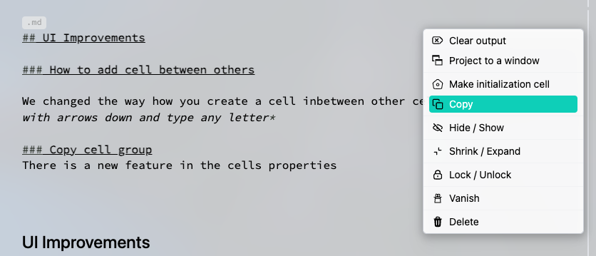

{/* add this script to the body  */}
{/* https://cdn.jsdelivr.net/gh/WLJSTeam/web-components@latest/src/common/app.js */}
<wljs-store json="./attachments/408b6f5c-3120-41b4-b2c8-9cda13254259.txt"></wljs-store>

## UI Improvements

### How to Add a Cell Between Others

We have changed the method for creating a cell between other cells. *Simply move with the arrows down and type any letter.*

### Copy Cell Group

There is a new feature in the cell properties.

<wljs-html encoded="true">{`%3Cbr%20%2F%3E`}</wljs-html>

It compresses input and all output cells into a single string.

:::note
Paste the copied content into a new empty input cell.
:::

You can also copy non-Wolfram Language outputs in the same way.

## Boxes or Decorations

### Reimplementation of `Short`

This expression is designed to shorten the output and is used in many outputs of Wolfram Language expressions, such as `NonLinearModelFit`, series outputs, and others. The native version often broke our internal formatting, but now we have replaced it with our implementation. It can be used directly.

<WLJSWrapper><wljs-editor display="codemirror" type="Input" editable="true"  >{`Table[RandomColor[], {100}] // Short 
	Table[RandomColor[], {100}, {3}, {30}] // Short `}</wljs-editor></WLJSWrapper>

<WLJSWrapper><wljs-editor display="codemirror" type="Output"  >{`{(*VB[*)(RGBColor[0.4285740492163317, 0.7913909357229074, 0.7217959017443194])(*,*)(*"1:eJxTTMoPSmNiYGAo5gUSYZmp5S6pyflFiSX5RcEsQBHn4PCQNGaQPAeQCHJ3cs7PyS8qWiAZfPNg7m37oi2/M0SFg1/aF2nI8ez4LPHcHgBoWBk5"*)(*]VB*),(*VB[*)(RGBColor[0.3890298402552268, 0.018771935566063824, 0.5120042572841128])(*,*)(*"1:eJxTTMoPSmNiYGAo5gUSYZmp5S6pyflFiSX5RcEsQBHn4PCQNGaQPAeQCHJ3cs7PyS8q6pF1ybr79IZ9EcP/KNfPFpPti3zC+g6EJT2wBwBoExmp"*)(*]VB*),(*VB[*)(RGBColor[0.16936020587613765, 0.9017860121159591, 0.6366193309657833])(*,*)(*"1:eJxTTMoPSmNiYGAo5gUSYZmp5S6pyflFiSX5RcEsQBHn4PCQNGaQPAeQCHJ3cs7PyS8qerBmb8KMtUfti+49PxCWd/uNfVHG7/MN+vFP7AGa6hy7"*)(*]VB*),<<96>>}`}</wljs-editor></WLJSWrapper>

<WLJSWrapper><wljs-editor display="codemirror" type="Output"  >{`{{{(*VB[*)(RGBColor[0.7325831065134378, 0.5979894508466139, 0.1719085829570397])(*,*)(*"1:eJxTTMoPSmNiYGAo5gUSYZmp5S6pyflFiSX5RcEsQBHn4PCQNGaQPAeQCHJ3cs7PyS8qsqtsUggqfG5fNGX59aO7lB7bFwU8vLlNkvGYPQBpXxoN"*)(*]VB*),(*VB[*)(RGBColor[0.44795698759189584, 0.044087058186223826, 0.8720488878983641])(*,*)(*"1:eJxTTMoPSmNiYGAo5gUSYZmp5S6pyflFiSX5RcEsQBHn4PCQNGaQPAeQCHJ3cs7PyS8qUjB+dyJ49R37ooREHaMpk5bZFxnoHBS8/Py1PQBfqRl1"*)(*]VB*),(*VB[*)(RGBColor[0.6606665033903807, 0.9586376332282864, 0.9336369327142091])(*,*)(*"1:eJxTTMoPSmNiYGAo5gUSYZmp5S6pyflFiSX5RcEsQBHn4PCQNGaQPAeQCHJ3cs7PyS8q2vfLWERP5al9kdfR3Csaa9/ZF3XxdPdHPXhrDwBlZRn0"*)(*]VB*),<<26>>},<<1>>},<<98>>}`}</wljs-editor></WLJSWrapper>

## Programmatic Controls of Presentation

Similar to `FrontEditorSelected`, we have added a method to interact with a selected set of slides in the notebook. For example:

<WLJSWrapper><wljs-editor display="codemirror" type="Input" editable="true"  >{`.slide
	
	# First
	
	---
	
	# Second`}</wljs-editor></WLJSWrapper>

<WLJSWrapper><wljs-editor display="slide" type="Output"  >{`<dummy >
	# First
	
	---
	
	# Second</dummy>`}</wljs-editor></WLJSWrapper>

Now try to run this

<WLJSWrapper><wljs-editor display="codemirror" type="Input" editable="true"  >{`FrontSlidesSelected["navigateNext", 1] // FrontSubmit;`}</wljs-editor></WLJSWrapper>

We directly forward your commands to RevealJS API. Please see it for more available commands.

## Programmatic Controls of Sliders
We added an extra option to control `InputRange` programmatically

<WLJSWrapper><wljs-editor display="codemirror" type="Input" editable="true"  >{`sliderPos = 0.4;
	InputRange[0,1,0.1, "TrackedExpression"->Offload[sliderPos]]`}</wljs-editor></WLJSWrapper>

<WLJSWrapper><wljs-editor display="codemirror" type="Output"  >{`(*VB[*)(EventObject[<|"Id" -> "f903686f-d40c-4727-a3c7-dd83755ecf57", "Initial" -> 0.5, "View" -> "776c46e6-7c4a-480c-b713-dac670eac7f0"|>])(*,*)(*"1:eJxTTMoPSmNkYGAoZgESHvk5KRCeEJBwK8rPK3HNS3GtSE0uLUlMykkNVgEKm5ubJZuYpZrpmiebJOqaWBgk6yaZGxrrpiQmm5kbpCYmm6cZAACBvBXV"*)(*]VB*)`}</wljs-editor></WLJSWrapper>

If you set `sliderPos` symbol to a new value, it will move the slider above

<WLJSWrapper><wljs-editor display="codemirror" type="Input" editable="true"  >{`sliderPos = RandomReal[];`}</wljs-editor></WLJSWrapper>

It will still trigger an event and revert to the set value even if you refresh the page. In this sense, you give your slider a persistent state.

## Programmatic Controls of Manipulate*
One can do the same for `Manipulate` or `ManipulatePlot`. Keep in mind to use lists for them

<WLJSWrapper><wljs-editor display="codemirror" type="Input" editable="true"  >{`manList = {0.3, 0.8};
	ManipulatePlot[Sinc[w x + b (*SpB[*)Power[x(*|*),(*|*)2](*]SpB*)], {x,-10,10}, {w,0,1}, {b,0,1}, "TrackedExpression"->Offload[manList]]`}</wljs-editor></WLJSWrapper>

<WLJSWrapper><wljs-editor display="codemirror" type="Output"  >{`(*GB[*){{(*VB[*)(Graphics[{AbsoluteThickness[2], RGBColor[0.368417, 0.506779, 0.709798], Line[Offload[pts$273899]]}, ImageSize -> {400, 300}, PlotRange -> Automatic, Axes -> True, TransitionType -> "Linear", TransitionDuration -> 50, Epilog -> {}, Prolog -> {}, AxesLabel -> {}, "TrackedExpression" -> Offload[manList], PlotRange -> {{-11., 11.}, {-0.27646932615223113, 1.0607842536262968}}])(*,*)(*"1:eJxTTMoPSmNkYGAoZgESHvk5KWncIB4HkHAvSizIyEwuTmOGyftkFpdAVAsCCcek4vyc0pLUEKCi7LzU4uJMJqAoRDVIf5C7k3N+Tn5RUcG0SU9Vply3LzKc9nJ6h/kD+6LjLTO8V217Zo+w2iczLxXCYwcS/mlpOfmJKcVcQHZBSbGKkbmxhaVlGhNMdVBpTmoxJ5DhmZuYnhqcWZWKkAM5MnMC0KhMHSCBRU9ATn5JUGJeOoTnWFqSn5tYkpmMphLEcKwA+grECCkqTUWT5wMLJ+YVZ5Zk5ueFVBakBrNB/ZFYhKZWCEWtS2lRIojONGLAcB/ICNeCzJz89DQGlFDHVBZQlE9IGSfUDz6JSak5+FQGC0JcmJydmuJaUVAEisz8PMz4ALFzE/NwWAUPWNTIQOUVMYCB2gEYwwFNvvFjV9qajRf3F534c+3Fjx8f7AHOOqZd"*)(*]VB*)(*|*),(*|*)(*VB[*)(EventObject[<|"Id" -> "b8afcf15-6d9d-4e5f-812b-1963cf0cbcbc", "Initial" -> {0.5, 0.5}, "View" -> "52c74b0c-1029-4b9c-8c74-a7b1b6ed6cf1"|>])(*,*)(*"1:eJxTTMoPSmNkYGAoZgESHvk5KRCeEJBwK8rPK3HNS3GtSE0uLUlMykkNVgEKmxolm5skGSTrGhoYWeqaJFkm61oARXQTzZMMk8xSU8yS0wwBf0UVzQ=="*)(*]VB*)}}(*]GB*)`}</wljs-editor></WLJSWrapper>

<WLJSWrapper><wljs-editor display="codemirror" type="Input" editable="true"  >{`manList = RandomReal[{0,1}, 2];`}</wljs-editor></WLJSWrapper>

## Minor bug fixes
- Contexts aliases
- HID devices plists for MacOS
- Better control over `ViewBox`
- CD/CI for CSockets library

<wljs-html encoded="true">{`%0A%3Cstyle%3E%0A%20%20%5Btransparency%3D%22false%22%5D%20.bg-g-trans%20%7B%0A%20%20%20%20background%3A%20transparent%20%21important%3B%0A%20%20%7D%0A%0A%20%20%5Btransparency%3D%22true%22%5D%20.bg-g-trans%20%7B%0A%20%20%20%20background%3A%20transparent%20%21important%3B%0A%20%20%7D%0A%3C%2Fstyle%3E`}</wljs-html>