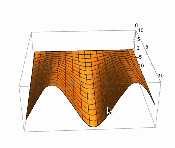
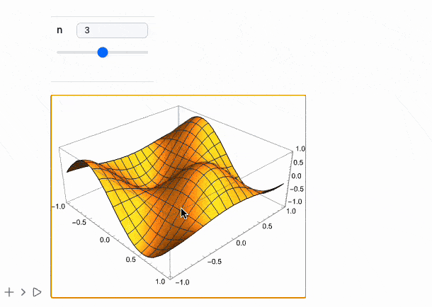

{/* add this script to the body  */}
{/* https://cdn.jsdelivr.net/gh/WLJSTeam/web-components@latest/src/common/app.js */}
<wljs-store json="./attachments/147843b8-66ad-419a-9a40-05b8872420ab.txt"></wljs-store>

## Open-Source Community
__We joined Open Collective__ 🎈

[WLJS Notebook - Open Collective](https://opencollective.com/wljs-notebook)

Let's dive into release notes 

## Log plots
We fixed scaling issues with `LogPlot` and `LogLogPlot`

<WLJSWrapper><wljs-editor display="codemirror" type="Input" editable="true"  >{`LogPlot[(*SpB[*)Power[x(*|*),(*|*)2](*]SpB*), {x,0,1}]`}</wljs-editor></WLJSWrapper>

<WLJSWrapper><wljs-editor display="codemirror" type="Output"  >{`(*VB[*)(FrontEndRef["2ada88d8-e525-4c55-bfbd-d08aab31a0cc"])(*,*)(*"1:eJxTTMoPSmNkYGAoZgESHvk5KRCeEJBwK8rPK3HNS3GtSE0uLUlMykkNVgEKGyWmJFpYpFjoppoameqaJJua6ialJaXophhYJCYmGRsmGiQnAwCQsBaC"*)(*]VB*)`}</wljs-editor></WLJSWrapper>

## ImageSizeRaw
A new option of `Graphics` is supported to make it easier to overlay raster graphics with lines and user primitives. The major differences compared to `ImageSize` are:

- It considers the pixel density ratio of the screen.
- It guarantees that the canvas size will match exactly with `ImageSizeRaw`.

For example, it allows for creating complex plots that combine `Image` and `Graphics` using `Inset`:

<wljs-html encoded="true">{`%3Cbr%20%2F%3E`}</wljs-html>

*some interpolated data*

<WLJSWrapper><wljs-editor display="codemirror" type="Input" editable="true"  >{`fmo = { (*VB[*)(Get[FileNameJoin[{".iconized", "None-b5c.wl"}]])(*,*)(*"1:eJxTTMoPSmNhYGAo5gUSYZmp5S6pyflFiSX5RcEcQBHP5Py8zKrUlMyMI0wMaUwghSDVQaU5qcGsQIZPYlJqTjBIyC8/LxVNAYjhlpmTChYJKSpNBQDEQxmP"*)(*]VB*),  (*VB[*)(Get[FileNameJoin[{".iconized", "None-96e.wl"}]])(*,*)(*"1:eJxTTMoPSmNhYGAo5gUSYZmp5S6pyflFiSX5RcEcQBHP5Py8zKrUlMyMI0wMaUwghSDVQaU5qcGsQIZPYlJqTjBIyC8/LxVNAYjhlpmTChYJKSpNBQDEQxmP"*)(*]VB*)};`}</wljs-editor></WLJSWrapper>

<WLJSWrapper><wljs-editor display="codemirror" type="Input" editable="true"  >{`With[{f1 = (*VB[*)(Get[FileNameJoin[{".iconized", "None-b5c.wl"}]])(*,*)(*"1:eJxTTMoPSmNhYGAo5gUSYZmp5S6pyflFiSX5RcEcQBHP5Py8zKrUlMyMI0wMaUwghSDVQaU5qcGsQIZPYlJqTjBIyC8/LxVNAYjhlpmTChYJKSpNBQDEQxmP"*)(*]VB*), f2 = (*VB[*)(Get[FileNameJoin[{".iconized", "None-96e.wl"}]])(*,*)(*"1:eJxTTMoPSmNhYGAo5gUSYZmp5S6pyflFiSX5RcEcQBHP5Py8zKrUlMyMI0wMaUwghSDVQaU5qcGsQIZPYlJqTjBIyC8/LxVNAYjhlpmTChYJKSpNBQDEQxmP"*)(*]VB*)}, NumericArray[255.0 Table[
	  Clip[{f1[{x,y}], 0, f2[{x,y}]}/100.0, {0,1}]
	, {y, 0, 5.0, 0.02}, {x, 10, 120, 0.3}] // Reverse
	, "UnsignedInteger8", "ClipAndRound"]];
	imgWide = Image[%, "Byte"];`}</wljs-editor></WLJSWrapper>

overlay it with vector graphics

<WLJSWrapper><wljs-editor display="codemirror" type="Input" editable="true" fade="true" >{`Graphics[{
	  Inset[imgWide, {Mean[{10,120}], Mean[{1,5}]}]
	}, 
	  PlotRange->{{10,120}, {1,5}}, 
	  Frame->True, Axes->True, 
	  ImageSizeRaw->ImageDimensions[imgWide],
	  FrameTicksStyle->Directive[FontSize->14],
	  FrameStyle->Directive[FontSize->14],
	  FrameLabel->{"wavenumber (cm^{-1})", "H (T)"},
	  Epilog->{White, AbsoluteDashing[{4}], 
	    Line[Table[{41.6 + 0.035 x, x}, {x,0,5}]],
	    Line[Table[{41.6 - 0.092 x, x}, {x,0,5}]],
	    Line[Table[{89.0 + 0.466 1.97 x, x}, {x,0,5}]],
	    Line[Table[{89.0 - 0.466 1.90 x, x}, {x,0,5}]],
	    Line[Table[{112.6 + 0.466 2.26 x, x}, {x,0,5}]],
	    Line[Table[{112.6 - 0.466 2.39 x, x}, {x,0,5}]]
	  }
	]`}</wljs-editor></WLJSWrapper>

<WLJSWrapper><wljs-editor display="codemirror" type="Output"  >{`(*VB[*)(FrontEndRef["ff318b33-3e0e-4e16-936e-d9a86e45db7b"])(*,*)(*"1:eJxTTMoPSmNkYGAoZgESHvk5KRCeEJBwK8rPK3HNS3GtSE0uLUlMykkNVgEKp6UZG1okGRvrGqcapOqapBqa6Voam6XqplgmWpilmpimJJknAQCF1hXg"*)(*]VB*)`}</wljs-editor></WLJSWrapper>

## UI Update
__Insert cell before__ button (was requested via Github issues)

## Dataset full support
We have finnaly fixed the most buggy thing we have in WLJS - `Dataset`. Now it does support nested structures, symbolic keys, `Entity`, `Quantity` and etc

<WLJSWrapper><wljs-editor display="codemirror" type="Input" editable="true"  >{`ExampleData[{"Dataset","Planets"}]`}</wljs-editor></WLJSWrapper>

<WLJSWrapper><wljs-editor display="codemirror" type="Output"  >{`(*VB[*)(FrontEndRef["c824ccdc-c573-4b47-b58b-87b196ec5df0"])(*,*)(*"1:eJxTTMoPSmNkYGAoZgESHvk5KRCeEJBwK8rPK3HNS3GtSE0uLUlMykkNVgEKJ1sYmSQnpyTrJpuaG+uaJJmY6yaZWiTpWpgnGVqapSabpqQZAACNEBYN"*)(*]VB*)`}</wljs-editor></WLJSWrapper>

## Extended MMAView
There was a request for interactive native Mathematica's 3D plot. Well, here you go

<WLJSWrapper><wljs-editor display="codemirror" type="Input" editable="true"  >{`With[{p = Plot3D[f[x] y, {x,0,10}, {y,0,10}]},
	  MMAView[p]
	]`}</wljs-editor></WLJSWrapper>

*Note, that it is important to pass it using `With`, since MMAView has HoldFirst attribute*

### Manipulate
Works for 2D, 3D, in general any expression!

<WLJSWrapper><wljs-editor display="codemirror" type="Input" editable="true"  >{`Manipulate[Plot3D[Sin[n x] Cos[n y], {x,-1,1}, {y,-1,1}], {n, 1, 5, 1}] // MMAView`}</wljs-editor></WLJSWrapper>

<wljs-html encoded="true">{`%3Cbr%20%2F%3E`}</wljs-html>

### Animate
The same works for it

<WLJSWrapper><wljs-editor display="codemirror" type="Input" editable="true"  >{`Animate[Plot[Sin[x y], {x,0,1}], {y,0,5}] // MMAView`}</wljs-editor></WLJSWrapper>

## ListAnimate
We added the support for raster `ListAnimate` (not related to MMAView)

<WLJSWrapper><wljs-editor display="codemirror" type="Input" editable="true"  >{`ListAnimate[Table[Rasterize[Plot[Table[x^k, {k, 1, n}] // Evaluate, {x,0,10}]], {n,1,6}]]`}</wljs-editor></WLJSWrapper>

## Easier REST-API
We refined our [REST API](https://wljs.io/frontend/Development/API/REST) and added a helper Javascript class of function to make the process easier. Imagine, you can build up a minimal Notebook interface by youself just in a few lines!

<WLJSWrapper><wljs-editor display="codemirror" type="Input" editable="true"  >{`.html
	
	`}</wljs-editor></WLJSWrapper>

Yes, apart from header and body parts, that's all you need 

---

## MDX/React Integration
This share option lets you embed cells or an entire notebook to MDX-based websites (personal blog or a React App in general).

Here is an online demo of a static website made using Next.js

<wljs-html encoded="true">{`%3Cdiv%20class%3D%22my-3%20mx-2%20mt-4%22%3E%3Ciframe%20style%3D%22border-radius%3A0.5rem%22%20width%3D%22100%25%22%20height%3D%22400%22%20src%3D%22https%3A%2F%2Fjerryi.github.io%2Fwljs-nextjs-example%2F%22%2F%3E%3C%2Fdiv%3E`}</wljs-html>

See our [__docs for more information__](https://wljs.io/frontend/Exporting/MDX)

__See more [here](https://github.com/JerryI/wljs-nextjs-example)__

<wljs-html encoded="true">{`%0A%3Cstyle%3E%0A%20%20img%20%7B%0A%20%20%20%20border-radius%3A%200.5rem%3B%0A%20%20%7D%0A%3C%2Fstyle%3E`}</wljs-html>

<wljs-html encoded="true">{`%0A%3Cstyle%3E%0A%20%20%5Btransparency%3D%22false%22%5D%20.bg-g-trans%20%7B%0A%20%20%20%20background%3A%20transparent%20%21important%3B%0A%20%20%7D%0A%0A%20%20%5Btransparency%3D%22true%22%5D%20.bg-g-trans%20%7B%0A%20%20%20%20background%3A%20transparent%20%21important%3B%0A%20%20%7D%0A%3C%2Fstyle%3E`}</wljs-html>