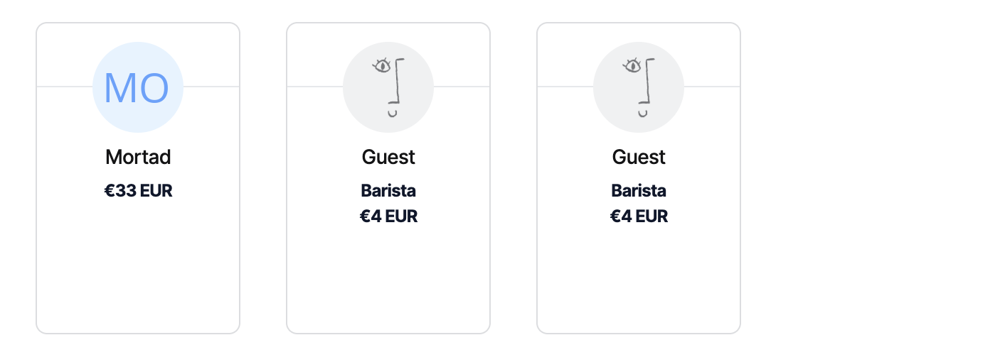
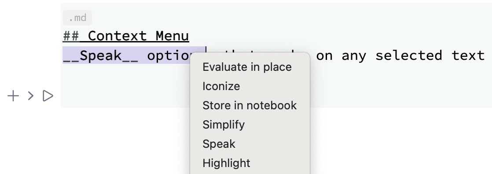

{/* add this script to the body  */}
{/* https://cdn.jsdelivr.net/gh/WLJSTeam/web-components@latest/src/common/app.js */}
<wljs-store json="./attachments/6218d1be-2935-487a-9509-60ff3f86ac8b.txt"></wljs-store>

## Unix Sockets
We removed a landmine found in a dynamic library used for TCP/IP communications (USocketListener Library) on macOS and GNU/Linux. It sometimes caused a violation of the order in which TCP packets are sent, leading to unpredictable behavior in the communication between the GUI and the Wolfram Kernel.

What was affected:
- All Docker images before `v2.8.0`.
- `.deb`, `.zip` archives for GNU/Linux.
- `.dmg`, `.zip` archives for macOS.

## Thank You
Thank you for supporting us and sharing your experiences. This helps us find time to direct our passion into WLJS.

We are grateful to those awesome individuals who recently supported us on Open Collective:

## Extended methods for Image
We've made `Image` similar to `Graphics` expression and added the support of `EventHandler` listeners:

<WLJSWrapper><wljs-editor display="codemirror" type="Input" editable="true"  >{`With[{
	  buf = Unique["inmg"],
	  get = ImageData[
	    LinearGradientImage[{{0,0}, #}->{Blue,Green}, {300,300}],
	    "Byte"
	  ]&
	},
	  buf = get[{300,300}];
	
	  EventHandler[Image[buf // Offload, "Byte"], {
	    "mousemove" -> Function[xy,
	      buf = get[{0,300} - {-1,1} xy];
	    ]
	  }]
	]`}</wljs-editor></WLJSWrapper>

<WLJSWrapper><wljs-editor display="codemirror" type="Output"  >{`(*VB[*)(FrontEndRef["dbab9e23-4c6d-41c8-b33d-0397eb1ee057"])(*,*)(*"1:eJxTTMoPSmNkYGAoZgESHvk5KRCeEJBwK8rPK3HNS3GtSE0uLUlMykkNVgEKpyQlJlmmGhnrmiSbpeiaGCZb6CYZG6foGhhbmqcmGaamGpiaAwCRsBX9"*)(*]VB*)`}</wljs-editor></WLJSWrapper>

## Canvas2D
A build-in library for working with HTML5 Canvas. It provides 1:1 mapping of CanvasAPI (not full coverage by now):

:::info
Read more about it in __Advanced section__ of the documentation
:::

<WLJSWrapper><wljs-editor display="codemirror" type="Input" editable="true" encoded="true"  >{`Needs%5B%22Canvas2D%60%22-%3E%22ctx%60%22%5D%3B`}</wljs-editor></WLJSWrapper>

<WLJSWrapper><wljs-editor display="codemirror" type="Input" editable="true" encoded="true"  >{`context%20%3D%20ctx%60Canvas2D%5B%5D%3B%0AImage%5Bcontext%2C%20ImageResolution-%3E%7B300%2C300%7D%5D`}</wljs-editor></WLJSWrapper>

<WLJSWrapper><wljs-editor display="codemirror" type="Output"  >{`(*VB[*)(FrontEndRef["d29c9b9a-cd3b-4492-bc8b-f49b99c5b6f2"])(*,*)(*"1:eJxTTMoPSmNkYGAoZgESHvk5KRCeEJBwK8rPK3HNS3GtSE0uLUlMykkNVgEKpxhZJlsmWSbqJqcYJ+mamFga6SYlWyTpppkARS2TTZPM0owAkhoWRw=="*)(*]VB*)`}</wljs-editor></WLJSWrapper>

Send commands to the context:

<WLJSWrapper><wljs-editor display="codemirror" type="Input" editable="true" encoded="true"  >{`%28%2A%20red%20rectangle%20%2A%29%0Actx%60SetFillStyle%5Bcontext%2C%20Red%5D%3B%0Actx%60FillRect%5Bcontext%2C%20%7B110%2C%20110%7D%2C%20%7B150%2C%20150%7D%5D%3B%0A%0A%28%2A%20semi-transparent%20blue%20rectangle%20%2A%29%0Actx%60SetFillStyle%5Bcontext%2C%20%7BBlue%2C%20Opacity%5B0.5%5D%7D%5D%3B%0Actx%60FillRect%5Bcontext%2C%20%7B130%2C%20130%7D%2C%20%7B150%2C%20150%7D%5D%3B%0A%0Actx%60Dispatch%5Bcontext%5D%3B`}</wljs-editor></WLJSWrapper>

Low-level access allows to do animations and interactivity in real-time:

<WLJSWrapper><wljs-editor display="codemirror" type="Input" editable="true" encoded="true"  >{`context%20%3D%20ctx%60Canvas2D%5B%5D%3B%0AEventHandler%5BImage%5Bcontext%2C%20ImageResolution-%3E%7B300%2C300%7D%5D%2C%20%7B%0A%20%20%22mousemove%22%20-%3E%20Function%5Bxy%2C%0A%20%20%20%20ctx%60SetFillStyle%5Bcontext%2C%20%7BBlue%2C%20Opacity%5B0.1%5D%7D%5D%3B%0A%20%20%20%20ctx%60FillRect%5Bcontext%2C%20xy%2C%20%7B20%2C%2020%7D%5D%3B%0A%20%20%20%20ctx%60Dispatch%5Bcontext%5D%3B%0A%20%20%5D%0A%7D%5D`}</wljs-editor></WLJSWrapper>

<WLJSWrapper><wljs-editor display="codemirror" type="Output"  >{`(*VB[*)(FrontEndRef["c401c600-96e2-4709-b20c-b77a0217430e"])(*,*)(*"1:eJxTTMoPSmNkYGAoZgESHvk5KRCeEJBwK8rPK3HNS3GtSE0uLUlMykkNVgEKJ5sYGCabGRjoWpqlGumamBtY6iYZGSTrJpmbJxoYGZqbGBukAgB1BhTM"*)(*]VB*)`}</wljs-editor></WLJSWrapper>

### Gradients
A complex example taken from MDN:

<WLJSWrapper><wljs-editor display="codemirror" type="Input" editable="true" encoded="true" fade="true" >{`grad%20%3D%20ctx%60Canvas2D%5B%5D%3B%0A%0AradGrad1%20%3D%20ctx%60CreateRadialGradient%5Bgrad%2C%20%7B45%2C%20%2045%2C%2010%7D%2C%20%7B52%2C%20%2050%2C%2030%7D%5D%3B%0Actx%60AddColorStop%5Bgrad%2C%20radGrad1%2C%200%2C%20%20%20%22%23A7D30C%22%5D%3B%0Actx%60AddColorStop%5Bgrad%2C%20radGrad1%2C%200.9%2C%20%22%23019F62%22%5D%3B%0Actx%60AddColorStop%5Bgrad%2C%20radGrad1%2C%201%2C%20%20%20%22rgb%281%20159%2098%20%2F%200%25%29%22%5D%3B%0A%0AradGrad2%20%3D%20ctx%60CreateRadialGradient%5Bgrad%2C%20%7B105%2C%20105%2C%2020%7D%2C%20%7B112%2C%20120%2C%2050%7D%5D%3B%0Actx%60AddColorStop%5Bgrad%2C%20radGrad2%2C%200%2C%20%20%20%20%22%23FF5F98%22%5D%3B%0Actx%60AddColorStop%5Bgrad%2C%20radGrad2%2C%200.75%2C%20%22%23FF0188%22%5D%3B%0Actx%60AddColorStop%5Bgrad%2C%20radGrad2%2C%201%2C%20%20%20%20%22rgb%28255%201%20136%20%2F%200%25%29%22%5D%3B%0A%0AradGrad3%20%3D%20ctx%60CreateRadialGradient%5Bgrad%2C%20%7B95%2C%20%2015%2C%2015%7D%2C%20%7B102%2C%20%2020%2C%2040%7D%5D%3B%0Actx%60AddColorStop%5Bgrad%2C%20radGrad3%2C%200%2C%20%20%20%22%2300C9FF%22%5D%3B%0Actx%60AddColorStop%5Bgrad%2C%20radGrad3%2C%200.8%2C%20%22%2300B5E2%22%5D%3B%0Actx%60AddColorStop%5Bgrad%2C%20radGrad3%2C%201%2C%20%20%20%22rgb%280%20201%20255%20%2F%200%25%29%22%5D%3B%0A%0AradGrad4%20%3D%20ctx%60CreateRadialGradient%5Bgrad%2C%20%7B0%2C%20%20%20150%2C%2050%7D%2C%20%7B0%2C%20%20%20140%2C%2090%7D%5D%3B%0Actx%60AddColorStop%5Bgrad%2C%20radGrad4%2C%200%2C%20%20%20%22%23F4F201%22%5D%3B%0Actx%60AddColorStop%5Bgrad%2C%20radGrad4%2C%200.8%2C%20%22%23E4C700%22%5D%3B%0Actx%60AddColorStop%5Bgrad%2C%20radGrad4%2C%201%2C%20%20%20%22rgb%28228%20199%200%20%2F%200%25%29%22%5D%3B%0A%0A%28%2A%20Draw%20filled%20rectangles%20with%20each%20gradient%20in%20turn%20%2A%29%0Actx%60SetFillStyle%5Bgrad%2C%20radGrad4%5D%3B%0Actx%60FillRect%5Bgrad%2C%20%7B0%2C%200%7D%2C%20%7B150%2C%20150%7D%5D%3B%0A%0Actx%60SetFillStyle%5Bgrad%2C%20radGrad3%5D%3B%0Actx%60FillRect%5Bgrad%2C%20%7B0%2C%200%7D%2C%20%7B150%2C%20150%7D%5D%3B%0A%0Actx%60SetFillStyle%5Bgrad%2C%20radGrad2%5D%3B%0Actx%60FillRect%5Bgrad%2C%20%7B0%2C%200%7D%2C%20%7B150%2C%20150%7D%5D%3B%0A%0Actx%60SetFillStyle%5Bgrad%2C%20radGrad1%5D%3B%0Actx%60FillRect%5Bgrad%2C%20%7B0%2C%200%7D%2C%20%7B150%2C%20150%7D%5D%3B%0A%0Actx%60Dispatch%5Bgrad%5D%3B%0A%0AImage%5Bgrad%2C%20ImageResolution-%3E%7B150%2C150%7D%5D`}</wljs-editor></WLJSWrapper>

<WLJSWrapper><wljs-editor display="codemirror" type="Output"  >{`(*VB[*)(FrontEndRef["58293e73-b06d-4499-8cc9-adfa89fb313d"])(*,*)(*"1:eJxTTMoPSmNkYGAoZgESHvk5KRCeEJBwK8rPK3HNS3GtSE0uLUlMykkNVgEKm1oYWRqnmhvrJhmYpeiamFha6lokJ1vqJqakJVpYpiUZGxqnAAB8thW6"*)(*]VB*)`}</wljs-editor></WLJSWrapper>

## JIT Transpiler for Manipulate and Animate
We added a diff algorithm that detects and tries to convert manipulated or animated expressions to dynamic ones using a low-level `Offload` technique. If something goes wrong, it will deoptimize it back. Here are some examples:

### Images
If the size stays the same:

<WLJSWrapper><wljs-editor display="codemirror" type="Input" editable="true"  >{`img = ImageResize[ExampleData[ExampleData["TestImage"] // Last], 350];
	Manipulate[
	  ImageAdjust[img, {c,a}], 
	  
	  {{c, 0},0,5,0.1}, 
	  {{a, 0},0,5,0.1},
	  ContinuousAction->True
	]`}</wljs-editor></WLJSWrapper>

### Optimizations for Lines and other primitives
With a basic Plot it can work out of the box!

<WLJSWrapper><wljs-editor display="codemirror" type="Input" editable="true"  >{`Manipulate[
	  Plot[Sin[x c], {x,0,2Pi}], 
	  
	  {{c, 1.0},0,5,0.1}, 
	  ContinuousAction->True
	]`}</wljs-editor></WLJSWrapper>

It can work with tables too

<WLJSWrapper><wljs-editor display="codemirror" type="Input" editable="true"  >{`Manipulate[
	  ListPlot[Table[{x, Sin[x c]}, {x,0,2Pi,0.1}]], 
	  
	  {{c, 1.0},0,5,0.1}, 
	  ContinuousAction->True
	]`}</wljs-editor></WLJSWrapper>

Or plain graphics objects:

<WLJSWrapper><wljs-editor display="codemirror" type="Input" editable="true"  >{`Manipulate[Graphics[{Disk[], Red, Text["Hey", {x,0}]}], 
	  {x,-1,1}, ContinuousAction->True]`}</wljs-editor></WLJSWrapper>

The same works for general Animate expression:

<WLJSWrapper><wljs-editor display="codemirror" type="Input" editable="true"  >{`Animate[Plot[Sin[n x], {x,0,5 Pi}], {n,1,3,0.1}]`}</wljs-editor></WLJSWrapper>

## Context Menu
__Speak__ options, that works on any selected text and calls `Speak[]`

## Frontend
A new frontend feature, which is similar to `FrontEditorSelected`, but also works on __any selected text in WLJS notebook__ 

<WLJSWrapper><wljs-editor display="codemirror" type="Input" editable="true"  >{`FrontTextSelected[] // FrontFetch `}</wljs-editor></WLJSWrapper>