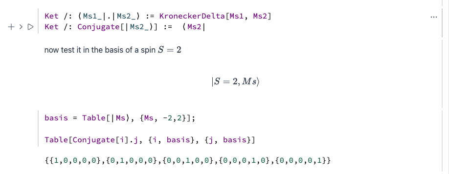

{/* add this script to the body  */}
{/* https://cdn.jsdelivr.net/gh/WLJSTeam/web-components@latest/src/common/app.js */}
<wljs-store json="./attachments/36b76613-76b3-4d00-88a3-3497e714e6ac.txt"></wljs-store>


Tue 26 Aug 2025 09:11:25


<wljs-html encoded="true">{`%0A%3Cscript%20type%3D%22module%22%3E%0A%20%20%20%20const%20rating%20%3D%20%5B%5D%3B%0A%20%20%20%20for%20%28let%20i%3D1%3B%20i%3C%3D5%3B%20%2B%2Bi%29%20rating.push%28document.getElementById%28%22star%22%2Bi%29%29%3B%0A%20%20%20%20const%20feedback%20%3D%20document.getElementById%28%22feedback-form%22%29%3B%0A%20%20%20%20const%20container%20%3D%20document.getElementById%28%22rating-c%22%29%3B%0A%0A%20%20%20%20let%20rate%20%3D%20-1%3B%0A%20%20%20%20let%20text%20%3D%20%22undefined%22%3B%0A%20%20%20%20let%20timer%20%3D%20false%3B%0A%20%20%20%20let%20disabled%20%3D%20false%3B%0A%0A%20%20%20%20const%20submitForm%20%3D%20%28%29%20%3D%3E%20%7B%0A%20%20%20%20%20%20disabled%20%3D%20true%3B%0A%20%20%20%20%20%20let%20n%20%3D%201%3B%0A%20%20%20%20%20%20let%20interval%20%3D%20setInterval%28%28%29%20%3D%3E%20%7B%0A%20%20%20%20%20%20%20%20container.style.filter%20%3D%20%22blur%28%22%2Bn%2B%22px%29%22%3B%0A%20%20%20%20%20%20%20%20n%2B%2B%3B%0A%20%20%20%20%20%20%20%20if%20%28n%20%3E%20200%29%20%7B%0A%20%20%20%20%20%20%20%20%20%20clearInterval%28interval%29%3B%0A%20%20%20%20%20%20%20%20%7D%0A%20%20%20%20%20%20%20%20%20%20%0A%20%20%20%20%20%20%7D%2C%2030%29%3B%0A%0A%20%20%20%20%20%20server.io.fire%28%27submit-form-281%27%2C%20%5Brate%2C%20text%5D%29%3B%0A%20%20%20%20%7D%0A%0A%20%20%20%20const%20setTimer%20%3D%20%28%29%20%3D%3E%20%7B%0A%20%20%20%20%20%20if%20%28disabled%29%20return%3B%0A%20%20%20%20%20%20if%20%28timer%29%20clearTimeout%28timer%29%3B%0A%20%20%20%20%20%20timer%20%3D%20false%3B%0A%20%20%20%20%20%20timer%20%3D%20setTimeout%28submitForm%2C%205000%29%3B%0A%20%20%20%20%7D%0A%0A%20%20%20%20const%20clearTimer%20%3D%20%28%29%20%3D%3E%20%7B%0A%20%20%20%20%20%20if%20%28timer%29%20clearTimeout%28timer%29%3B%0A%20%20%20%20%20%20timer%20%3D%20false%3B%0A%20%20%20%20%7D%0A%0A%20%20%20%20rating.forEach%28%28e%29%20%3D%3E%20%7B%0A%20%20%20%20%20%20e.addEventListener%28%27change%27%2C%20%28ev%29%3D%3E%7B%0A%20%20%20%20%20%20%20%20rate%20%3D%20ev.srcElement.value%3B%0A%20%20%20%20%20%20%20%20setTimer%28%29%3B%0A%20%20%20%20%20%20%7D%29%3B%0A%20%20%20%20%7D%29%3B%0A%0A%20%20%20%20feedback.addEventListener%28%27input%27%2C%20%28%29%3D%3E%7B%0A%20%20%20%20%20%20text%20%3D%20feedback.value%3B%0A%20%20%20%20%20%20clearTimer%28%29%3B%0A%20%20%20%20%7D%29%3B%0A%0A%20%20%20%20feedback.addEventListener%28%27focus%27%2C%20%28%29%3D%3E%7B%0A%20%20%20%20%20%20clearTimer%28%29%3B%0A%20%20%20%20%7D%29%3B%0A%0A%20%20%20%20feedback.addEventListener%28%27blur%27%2C%20%28%29%20%3D%3E%20%7B%0A%20%20%20%20%20%20text%20%3D%20feedback.value%3B%0A%20%20%20%20%20%20setTimer%28%29%3B%0A%20%20%20%20%7D%29%0A%3C%2Fscript%3E`}</wljs-html>

## Hot Fix  🐜
There were some breaking changes in the output forms for built-in symbols after *WL 14.3* rolled out. We fixed them. In any case, please report to us using GitHub Issues if you find something new.

<wljs-html encoded="true">{`%3Cbr%20%2F%3E`}</wljs-html>

## UI Update
We added a highly requested visual feature that helps to separate input cells and output cells





In the future, we will probably implement theme customization and give users a choice at startup to pick the best one, similar to VS Code.

## More styling options
WLJS Notebook is a sandbox, and you as a user can alter many things. This time our CSS classes got the attention:

- `main` main window  
- `.ccontainer` cells container  
- `.cgroup` a single group of cells: 1 input + outputs + tools  
- `.cframe` a single inner group of cells: 1 input + outputs  
- `.cborder` a vertical line displayed at the right side from the cell group  
- `.cwrapper` an input/output cell wrapper  
- `.cseparator` a thin space between cells  
- `.cinit` a class for initialization cells  
- `.cin` a class for input cells parent element  
- `.cout` a class for output cells parent element  
- `.ttint` a class applied to focused cells
- `.cgi-ico` a class for initialization cell group icon (usually a teal colored dot)

The vertical border-marker shown on the left side of the input cell can be styled using the following selector with pseudo-element:
```css
.cin > :nth-child(2)::after {

}
```

Some __input cell types__ can be differentiated too (a child element of one styled by `.cin`):

- `.clang-generic` a class for any unknown cell type / language
- `.clang-markdown` a class for input markdown cells
- `.clang-html` a class for input html cells
- `.clang-wlx` a class for input wlx cells
- `.clang-js` a class for input js cells
- `.clang-slide` a class for input slide cells

For wolfram language input cells the class field of the editor is empty.

The following classes are also available to style:
- `.cout .markdown` a class for markdown output cells
- `.markdown h1` a set of selectors to style various markdown element
- `.markdown h2`
- ...

<wljs-html encoded="true">{`%3Cbr%20%2F%3E`}</wljs-html>

:::tip
If you want the changes to be permanent, copy your styles to *Custom CSS* text-area in the settings menu. Any exported HTML file will inherit it as well.   
:::

## Refresh got JIT
We added JIT transpiler to `Refresh` expression that works similar to `Manipulate`

<WLJSWrapper><wljs-editor display="codemirror" type="Input" editable="true"  >{`Refresh[
	  ListLinePlot[Table[Sin[x + AbsoluteTime[]] + RandomReal[{-1,1} 0.1], {x,0,10Pi,0.1}]]
	, 0.2]`}</wljs-editor></WLJSWrapper>

## New Examples

Here are some highlights:
- Arduino x WLJS (accessing real hardware!)
- Recreating a World of Goo-like game in WLJS

__Read in our blog page__

