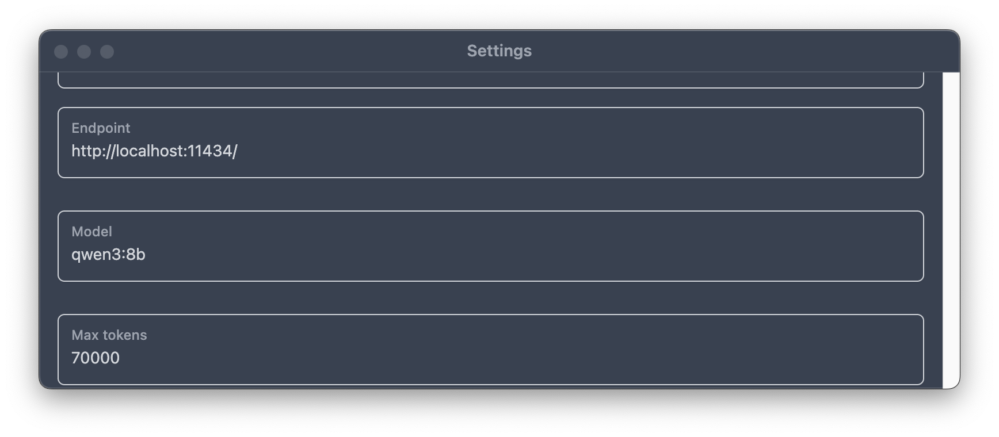

{/* add this script to the body  */}
{/* https://cdn.jsdelivr.net/gh/WLJSTeam/web-components@latest/src/common/app.js */}
<wljs-store json="./attachments/2016eee2-7164-4708-8527-d8444933dc40.txt"></wljs-store>

Fri 12 Sep 2025 19:04:12

<wljs-html encoded="true">{`%0A%3Cscript%20type%3D%22module%22%3E%0A%20%20%20%20const%20rating%20%3D%20%5B%5D%3B%0A%20%20%20%20for%20%28let%20i%3D1%3B%20i%3C%3D5%3B%20%2B%2Bi%29%20rating.push%28document.getElementById%28%22star%22%2Bi%29%29%3B%0A%20%20%20%20const%20feedback%20%3D%20document.getElementById%28%22feedback-form%22%29%3B%0A%20%20%20%20const%20container%20%3D%20document.getElementById%28%22rating-c%22%29%3B%0A%0A%20%20%20%20let%20rate%20%3D%20-1%3B%0A%20%20%20%20let%20text%20%3D%20%22undefined%22%3B%0A%20%20%20%20let%20timer%20%3D%20false%3B%0A%20%20%20%20let%20disabled%20%3D%20false%3B%0A%0A%20%20%20%20const%20submitForm%20%3D%20%28%29%20%3D%3E%20%7B%0A%20%20%20%20%20%20disabled%20%3D%20true%3B%0A%20%20%20%20%20%20let%20n%20%3D%201%3B%0A%20%20%20%20%20%20let%20interval%20%3D%20setInterval%28%28%29%20%3D%3E%20%7B%0A%20%20%20%20%20%20%20%20container.style.filter%20%3D%20%22blur%28%22%2Bn%2B%22px%29%22%3B%0A%20%20%20%20%20%20%20%20n%2B%2B%3B%0A%20%20%20%20%20%20%20%20if%20%28n%20%3E%20200%29%20%7B%0A%20%20%20%20%20%20%20%20%20%20clearInterval%28interval%29%3B%0A%20%20%20%20%20%20%20%20%7D%0A%20%20%20%20%20%20%20%20%20%20%0A%20%20%20%20%20%20%7D%2C%2030%29%3B%0A%0A%20%20%20%20%20%20server.io.fire%28%27submit-form-281%27%2C%20%5Brate%2C%20text%5D%29%3B%0A%20%20%20%20%7D%0A%0A%20%20%20%20const%20setTimer%20%3D%20%28%29%20%3D%3E%20%7B%0A%20%20%20%20%20%20if%20%28disabled%29%20return%3B%0A%20%20%20%20%20%20if%20%28timer%29%20clearTimeout%28timer%29%3B%0A%20%20%20%20%20%20timer%20%3D%20false%3B%0A%20%20%20%20%20%20timer%20%3D%20setTimeout%28submitForm%2C%205000%29%3B%0A%20%20%20%20%7D%0A%0A%20%20%20%20const%20clearTimer%20%3D%20%28%29%20%3D%3E%20%7B%0A%20%20%20%20%20%20if%20%28timer%29%20clearTimeout%28timer%29%3B%0A%20%20%20%20%20%20timer%20%3D%20false%3B%0A%20%20%20%20%7D%0A%0A%20%20%20%20rating.forEach%28%28e%29%20%3D%3E%20%7B%0A%20%20%20%20%20%20e.addEventListener%28%27change%27%2C%20%28ev%29%3D%3E%7B%0A%20%20%20%20%20%20%20%20rate%20%3D%20ev.srcElement.value%3B%0A%20%20%20%20%20%20%20%20setTimer%28%29%3B%0A%20%20%20%20%20%20%7D%29%3B%0A%20%20%20%20%7D%29%3B%0A%0A%20%20%20%20feedback.addEventListener%28%27input%27%2C%20%28%29%3D%3E%7B%0A%20%20%20%20%20%20text%20%3D%20feedback.value%3B%0A%20%20%20%20%20%20clearTimer%28%29%3B%0A%20%20%20%20%7D%29%3B%0A%0A%20%20%20%20feedback.addEventListener%28%27focus%27%2C%20%28%29%3D%3E%7B%0A%20%20%20%20%20%20clearTimer%28%29%3B%0A%20%20%20%20%7D%29%3B%0A%0A%20%20%20%20feedback.addEventListener%28%27blur%27%2C%20%28%29%20%3D%3E%20%7B%0A%20%20%20%20%20%20text%20%3D%20feedback.value%3B%0A%20%20%20%20%20%20setTimer%28%29%3B%0A%20%20%20%20%7D%29%0A%3C%2Fscript%3E`}</wljs-html>

## AxesLabel, FrameLabel Improvements
We have expanded our implementation of axes labels in a manner similar to how it is done in Mathematica.

If the expression is not defined on the frontend as a WLJS function or if it is wrapped with `HoldForm`, the expression will appear in its `StandardForm`, i.e.

<WLJSWrapper><wljs-editor display="codemirror" type="Input" editable="true"  >{`Plot[x, {x,0,1}, AxesLabel->{x,x}]`}</wljs-editor></WLJSWrapper>

<WLJSWrapper><wljs-editor display="codemirror" type="Output"  >{`(*VB[*)(FrontEndRef["15e770e6-c6c1-4ad6-9317-72a4637dec39"])(*,*)(*"1:eJxTTMoPSmNkYGAoZgESHvk5KRCeEJBwK8rPK3HNS3GtSE0uLUlMykkNVgEKG5qmmpsbpJrpJpslG+qaJKaY6VoaG5rrmhslmpgZm6ekJhtbAgB9RBVN"*)(*]VB*)`}</wljs-editor></WLJSWrapper>

Or using `Automatic`

<WLJSWrapper><wljs-editor display="codemirror" type="Output"  >{`(*VB[*)(FrontEndRef["2b15edf2-6625-4eaf-8dc9-3bbf6281919e"])(*,*)(*"1:eJxTTMoPSmNkYGAoZgESHvk5KRCeEJBwK8rPK3HNS3GtSE0uLUlMykkNVgEKGyUZmqampBnpmpkZmeqapCam6VqkJFvqGiclpZkZWRhaGlqmAgCKQhXf"*)(*]VB*)`}</wljs-editor></WLJSWrapper>

One can __offset__ the labels, which is usually not possible in Mathematica:

<WLJSWrapper><wljs-editor display="codemirror" type="Input" editable="true"  >{`Plot[x, {x,0,1}, Frame->True, FrameLabel->{{HoldForm[1/2], {0,-58}}, "y-axis"}]`}</wljs-editor></WLJSWrapper>

<WLJSWrapper><wljs-editor display="codemirror" type="Output"  >{`(*VB[*)(FrontEndRef["eb207ad4-6928-4951-90ac-d35d8b9707e3"])(*,*)(*"1:eJxTTMoPSmNkYGAoZgESHvk5KRCeEJBwK8rPK3HNS3GtSE0uLUlMykkNVgEKpyYZGZgnppjomlkaWeiaWJoa6loaJCbrphibplgkWZobmKcaAwB/cRVO"*)(*]VB*)`}</wljs-editor></WLJSWrapper>

Or even put __latex cells__ inside:

<WLJSWrapper><wljs-editor display="codemirror" type="Input" editable="true"  >{`Plot[x, {x,0,1}, Frame->True, FrameLabel->{{HoldForm[CellView["\\\\alpha", "Display"->"latex"]], {0,-5}},  None}]`}</wljs-editor></WLJSWrapper>

<WLJSWrapper><wljs-editor display="codemirror" type="Output"  >{`(*VB[*)(FrontEndRef["4ea99016-ae3a-4897-8790-7f469aaadd17"])(*,*)(*"1:eJxTTMoPSmNkYGAoZgESHvk5KRCeEJBwK8rPK3HNS3GtSE0uLUlMykkNVgEKm6QmWloaGJrpJqYaJ+qaWFia61qYWxromqeZmFkmJiampBiaAwB+7RWH"*)(*]VB*)`}</wljs-editor></WLJSWrapper>

Here is an example with custom WLJS function, that defines a label:

<WLJSWrapper><wljs-editor display="codemirror" type="Input" editable="true"  >{`.html
	
	`}</wljs-editor></WLJSWrapper>

<wljs-html encoded="true">{`%0A%3Cstyle%3E%0A%40keyframes%20colorChange%20%7B%0A%20%200%25%20%7B%20color%3A%20red%3B%20%7D%0A%20%2050%25%20%7B%20color%3A%20blue%3B%20%7D%0A%20100%25%20%7B%20color%3A%20green%3B%20%7D%0A%7D%0A%3C%2Fstyle%3E`}</wljs-html>

<WLJSWrapper><wljs-editor display="codemirror" type="Input" editable="true" encoded="true"  >{`.js%0Acore.MyLabel%20%3D%20async%20%28args%2C%20env%29%20%3D%3E%20%7B%0A%20%20const%20text%20%3D%20await%20interpretate%28args%5B0%5D%2C%20env%29%3B%0A%20%20env.element.style.width%20%3D%20%224rem%22%3B%0A%20%20env.element.innerHTML%20%3D%20%60%3Cspan%20style%3D%22animation%3A%20colorChange%200.5s%20infinite%3B%22%3E%24%7Btext%7D%3C%2Fspan%3E%60%0A%7D`}</wljs-editor></WLJSWrapper>

<WLJSWrapper><wljs-editor display="js" type="Output" encoded="true" class="wljs-hide-undefined" >{`core.MyLabel%20%3D%20async%20%28args%2C%20env%29%20%3D%3E%20%7B%0A%20%20const%20text%20%3D%20await%20interpretate%28args%5B0%5D%2C%20env%29%3B%0A%20%20env.element.style.width%20%3D%20%224rem%22%3B%0A%20%20env.element.innerHTML%20%3D%20%60%3Cspan%20style%3D%22animation%3A%20colorChange%200.5s%20infinite%3B%22%3E%24%7Btext%7D%3C%2Fspan%3E%60%0A%7D`}</wljs-editor></WLJSWrapper>

<WLJSWrapper><wljs-editor display="codemirror" type="Input" editable="true"  >{`Plot[x, {x,0,1}, Frame->True, FrameLabel->{{MyLabel["x-label"]//Offload, {0,-5}},  None}]`}</wljs-editor></WLJSWrapper>

<WLJSWrapper><wljs-editor display="codemirror" type="Output"  >{`(*VB[*)(FrontEndRef["dca94f64-c7f9-49cb-95d1-a873f5aa8252"])(*,*)(*"1:eJxTTMoPSmNkYGAoZgESHvk5KRCeEJBwK8rPK3HNS3GtSE0uLUlMykkNVgEKpyQnWpqkmZnoJpunWeqaWCYn6VqaphjqJlqYG6eZJiZaGJkaAQCQdhXn"*)(*]VB*)`}</wljs-editor></WLJSWrapper>

## Improved Slides Export
By utilizing our custom PDF renderer (based on the ElectronJS engine), we managed to export slides in a semi-automatic mode as close as possible to the original view you see in the WLJS Notebook.

:::note
Export happens live; the slides are projected to the full window size, input is blocked, and you need to wait while it artificially flips through all slides.

This is the only way to ensure that all dynamics and transitions have occurred on time.
:::

## Missing Decorations
We fixed some broken standard forms of `Complexes`, `Reals`, etc.:

<WLJSWrapper><wljs-editor display="codemirror" type="Input" editable="true"  >{`Reals`}</wljs-editor></WLJSWrapper>

<WLJSWrapper><wljs-editor display="codemirror" type="Output"  >{`(*VB[*)(Reals)(*,*)(*"1:eJxTTMoPSmNkYGAoZgESHvk5KRAeL5AIy0wtd0lNzi9KLMkvCmYFigSlJuYUAwAXSgwe"*)(*]VB*)`}</wljs-editor></WLJSWrapper>

## New AsyncFunction Methods
`TableAsync` and `DoAsync` were added to be used within asynchronious functions. They work in the same way as corresponding symbols from Wolfram Language, but the inner expression can be an implicit `AsyncFunction`. For example:

<WLJSWrapper><wljs-editor display="codemirror" type="Input" editable="true"  >{`Then[
	  TableAsync[
	    PauseAsync[0.5] // Await;
	    i + 1
	  , {i, 3}]
	, With[{c = EvaluationCell[]}, 
	    CellPrint[#, "After"->c]&
	  ]
	];`}</wljs-editor></WLJSWrapper>

<WLJSWrapper><wljs-editor display="codemirror" type="Output"  >{`{2,3,4}`}</wljs-editor></WLJSWrapper>

## Better Support for Many Data Points
Here is an example of more than 64,000 vertices of indexed geometry in `Graphics3D`:

<WLJSWrapper><wljs-editor display="codemirror" type="Output"  >{`(*VB[*)(FrontEndRef["9fc900da-e886-4fb5-a4da-57b3abcaee0c"])(*,*)(*"1:eJxTTMoPSmNkYGAoZgESHvk5KRCeEJBwK8rPK3HNS3GtSE0uLUlMykkNVgEKW6YlWxoYpCTqplpYmOmapCWZ6iaaALmm5knGiUnJiampBskAkbgWvg=="*)(*]VB*)`}</wljs-editor></WLJSWrapper>

And here is a similar feature, but in the context of 2D graphics. We utilized the `OES_element_index_uint` extension of WebGL, which is available on 93% of machines. Even if your machine does not support it, the renderer will still try to display the result.

<WLJSWrapper><wljs-editor display="codemirror" type="Output"  >{`(*VB[*)(FrontEndRef["5a2ba9cc-5abb-4218-b877-b8088af8b3a9"])(*,*)(*"1:eJxTTMoPSmNkYGAoZgESHvk5KRCeEJBwK8rPK3HNS3GtSE0uLUlMykkNVgEKmyYaJSVaJifrmiYmJemaGBla6CZZmJsDCQMLi8Q0iyTjREsAj1YWBg=="*)(*]VB*)`}</wljs-editor></WLJSWrapper>

## Support for Local LLMs in Assistant
Some of you are using our old plugin that allows editing the notebook cells in automated mode using GPT models.

Before we restricted ourselves to OpenAI's `gpt-4*` models, however, some OSS and freeware solutions emerged on the market. We patched our API to be able to work with locally running LLM servers such as *Ollama*.

The only requirements are:

- The completion API must be compatible with the OpenAI v1 API (this is usually the case for most models/LLM servers).
- Support for plugins/tools.

:::note
Local LLMs performance is strongly depend on your machine/model specs.
:::

...and we also fixed unicode issue 🙂

## AnimationRate
We fixed the missing feature of `RefreshRate` and `AnimationRate`:

<WLJSWrapper><wljs-editor display="codemirror" type="Input" editable="true"  >{`Animate[Graphics3D[Sphere[{0,0,1.0-(*SpB[*)Power[Cos[z](*|*),(*|*)2](*]SpB*)}, 0.1]], {z,0,10.0}, AnimationRate->0.03, RefreshRate->30]`}</wljs-editor></WLJSWrapper>

## Buy us a coffee ☕
We are not affiliated with Wolfram Research or any other companies. If you enjoy WLJS, consider supporting us: 

<wljs-html encoded="true">{`%3Cbr%20%2F%3E`}</wljs-html>

- __write a blog post about WLJS__
- tell a colleague

or

- [Open Collective](https://opencollective.com/wljs-notebook)
- [PayPal](https://www.paypal.com/donate/?hosted_button_id=BN9LWUUUJGW54)
- [GitHub Sponsors](https://github.com/sponsors/JerryI)

Your contributions help keep our project alive and improve the experience for everyone.

## Stability and Minor Bug Fixes
We improved the stability of the network IO interface on Windows machines and patched a few more bugs in the interface.

All the best ❤️ from WLJS Team

