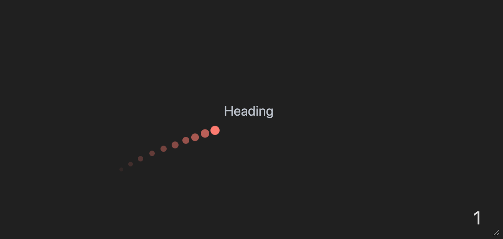
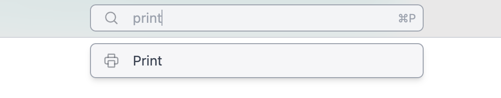

{/* add this script to the body  */}
{/* https://cdn.jsdelivr.net/gh/WLJSTeam/web-components@latest/src/common/app.js */}
<wljs-store json="./attachments/4fe9e1d8-c2b4-4255-b505-26de04835a49.txt"></wljs-store>


import { Tabs, Tab } from 'fumadocs-ui/components/tabs';

<Tabs items={['Windows', 'Mac','GNU/Linux', 'Docker', 'Homebrew']}>
  <Tab value="Mac">
    - [Apple Silicon](https://github.com/WLJSTeam/wljs-notebook/releases/download/v2.8.7/wljs-notebook-2.8.7-arm64-macos.dmg)
    - [Intel](https://github.com/WLJSTeam/wljs-notebook/releases/download/v2.8.7/wljs-notebook-2.8.7-x64-macos.dmg)
  </Tab>
  <Tab value="Windows">
    - [x86/64](https://github.com/WLJSTeam/wljs-notebook/releases/download/v2.8.7/wljs-notebook-2.8.7-x64-win.exe)
  </Tab>
  <Tab value="GNU/Linux">
    - [DEB x86/64](https://github.com/WLJSTeam/wljs-notebook/releases/download/v2.8.7/wljs-notebook-2.8.7-amd64-gnulinux.deb)
    - [DEB ARM64](https://github.com/WLJSTeam/wljs-notebook/releases/download/v2.8.7/wljs-notebook-2.8.7-arm64-gnulinux.deb)
    - [AppImage x86/64](https://github.com/WLJSTeam/wljs-notebook/releases/download/v2.8.7/wljs-notebook-2.8.7-x86_64-gnulinux.AppImage)
    - [AppImage ARM64](https://github.com/WLJSTeam/wljs-notebook/releases/download/v2.8.7/wljs-notebook-2.8.7-arm64-gnulinux.AppImage)
  </Tab>
  <Tab value="Docker">

```bash
docker run -it \
  -v ~/wljs:"/home/wljs/WLJS Notebooks" \
  -v ~/wljs/Licensing:/home/wljs/.WolframEngine/Licensing \
  -v ~/wljs/tmp:/tmp \
  -e PUID=$(id -u) \
  -e PGID=$(id -g) \
  -p 8000:3000 \
  --name wljs \
  ghcr.io/wljsteam/wljs-notebook:main
```

  </Tab>
  <Tab value="Homebrew">
  
```bash  
brew install --cask wljs-notebook
```

  </Tab>
</Tabs>


## Better laser pointer
We improved our "laser" pointer used on slides. It has a trail and can work properly in fullscreen mode as well:

<Callout type="info">
Press <wljs-html encoded="true">{`%3Ckbd%20%3Eq%3C%2Fkbd%3E`}</wljs-html> on a slide
</Callout>




## Print feature!

<Callout type="warn">
This feature requires WLJS Notebook App, since we rely on our custom renderer implemented in Electron.js.
</Callout>

Now you can print any notebook directly to PDF document:

- Use *command palette*





- Or main menu


<wljs-html encoded="true">{`%3Cimg%20src%3D%22attachments%2FScreenshot%25202025-10-09%2520at%252015.11.26-aac.png%22%20width%3D%22200%22%2F%3E`}</wljs-html>

### Manual page breaks
Since now you can easily print any notebook, it make sence to control page breaks manually.

<Callout type="info">
It will also work if you export a notebook to HTML and then print it
</Callout>

Use `PageBreakAbove` or `PageBreakBelow` symbols in the context of Markdown or WLX cells:

<WLJSWrapper><wljs-editor display="codemirror" type="Input" editable="true"  >{`.md
	<PageBreakAbove/>`}</wljs-editor></WLJSWrapper>

## SignPath Certificate 📜
Now we are officially on SignPath as OSS organization! This allows us to digitally sign our DLL, installers for Windows machines. It should prevent any troubles with anti-malware software.

In a nutshell at <wljs-html encoded="true">{`%3Cspan%20id%3D%22spa-date-now%22%3E%3C%2Fspan%3E`}</wljs-html> we have:

- SignPath Certificate for Windows (<wljs-html encoded="true">{`%3Cspan%20style%3D%22color%3Agreen%22%3EFREE%3C%2Fspan%3E`}</wljs-html>)
- Apple Developer License for MacOS (<wljs-html encoded="true">{`%3Cspan%20style%3D%22color%3Ared%22%3E90%20EUR%2Fyear%3C%2Fspan%3E`}</wljs-html>)<wljs-html encoded="true">{`%3Cscript%20type%3D%22module%22%3E%0A%20%20const%20el%20%3D%20document.getElementById%28%22spa-date-now%22%29%3B%0A%20%20setInterval%28%28%29%3D%3E%7B%0A%20%20%20%20if%20%28%21el%29%20return%3B%0A%20%20%20%20el.innerText%20%3D%20%28new%20Date%28%29%29.toLocaleString%28%29%3B%0A%20%20%7D%2C%201000%29%3B%3C%2Fscript%3E`}</wljs-html>

## Extensions for Wolfram Paclets

We’ve taken a big step toward extending standard Wolfram packages (Paclets) with our frontend extensions.

This means you can write a *normal-looking* Wolfram package for both **Mathematica** and **WLJS** that can take advantage of WLJS’s extra features when needed.

❓ **What you can do with this:**

* Ship JavaScript and CSS assets that are automatically integrated into the runtime once the package is loaded.
* Write a single package for WLJS, Mathematica, and WolframScript.
* Expose folders from your paclet to an HTTP server.

❓ **Will it work for exported notebooks?**

* Yes. JavaScript bundles will be compressed and embedded into the notebook if you apply it from the settings.
* You can safely publish your notebook.
* Anyone who doesn’t have those package assets installed will still be able to read the notebook without issues.
* Everything is cached and updated whenever changes are made to the paclet.

### Example

Here’s how this might look in your `PacletInfo`.

<WLJSWrapper><wljs-editor display="codemirror" type="Input" editable="true"  >{`PacletObject[
	  <|
	    "Name" -> "CoffeeLiqueur/SplatMesh",
	    "License" -> "MIT",
	    "Extensions" -> {
	      {
	        "Javascript",
	        "Root" -> {"Assets", "Spark", "kernel.js"}
	      },
	      {
	        "Javascript Bundle", (* only for exporting to HTML *)
	        "Root" -> {"Assets", "Bundle", "bundle.js"}
	      }
	      <...>`}</wljs-editor></WLJSWrapper>


Here is a good example we made:

> Check out our first crossplatform library [SplatMesh](https://github.com/JerryI/wl-splatmesh) 🫟<wljs-html encoded="true">{`%3Cbr%20%2F%3E`}</wljs-html><wljs-html encoded="true">{`%3Cbr%20%2F%3E`}</wljs-html><wljs-html encoded="true">{`%3Cdiv%20class%3D%22flex%20flex-row%20gap-x-2%22%3E%3Cimg%20width%3D%22450%22%20src%3D%22attachments%2FScreenshot%25202025-10-09%2520at%252023.15.51-7f2.png%22%2F%3E%3Cimg%20width%3D%22200%22%20height%3D%22300%22%20src%3D%22attachments%2Fscreenshot1122-074.png%22%2F%3E%3C%2Fdiv%3E`}</wljs-html>

## Improved 2D Graphics
We fixed an issue with automatic aspect ratio as well as some minor problems with arrows and curves:

<WLJSWrapper><wljs-editor display="codemirror" type="Input" editable="true"  >{`transitionMatrix = {{7/10, 0, 3/10, 0}, {1/2, 0, 1/2, 0}, {0, 2/5, 0, 3/5}, {0, 1/5, 0, 4/5}};
	mp = DiscreteMarkovProcess[1, transitionMatrix];
	Graph[mp]`}</wljs-editor></WLJSWrapper>

<WLJSWrapper><wljs-editor display="codemirror" type="Output" encoded="true"  >{`%28%2AVB%5B%2A%29%28CoffeeLiqueur%60Extensions%60Boxes%60Workarounds%60temporal%24282502%29%28%2A%2C%2A%29%28%2A%221%3AeJxTTMoPSmNkYGAoZgESHvk5KRCeEJBwK8rPK3HNS3GtSE0uLUlMykkNVgEKp6UmG6UYmRvrGpimpuiamCaa6SZaJiXpJlmkGKSYG6clGxuZAACRiRYt%22%2A%29%28%2A%5DVB%2A%29`}</wljs-editor></WLJSWrapper>

## Improved AnimatedImage
Now any of animated image can be safely exported to HTML, MDX (Static or Interactive)

<WLJSWrapper><wljs-editor display="codemirror" type="Input" editable="true"  >{`AnimatedImage[
	  Table[RandomImage[], {10}]
	, FrameRate->30]`}</wljs-editor></WLJSWrapper>

<WLJSWrapper><wljs-editor display="codemirror" type="Output"  >{`(*VB[*)(FrontEndRef["4978d4a1-c791-4262-bd49-623d9f9bf46c"])(*,*)(*"1:eJxTTMoPSmNkYGAoZgESHvk5KRCeEJBwK8rPK3HNS3GtSE0uLUlMykkNVgEKm1iaW6SYJBrqJptbGuqaGJkZ6SalmFjqmhkZp1imWSalmZglAwB4pRVa"*)(*]VB*)`}</wljs-editor></WLJSWrapper>

## Operations with clipboard
We improved the compatibillity with Mathematica!

<WLJSWrapper><wljs-editor display="codemirror" type="Input" editable="true"  >{`ClickToCopy["Click me", Red]`}</wljs-editor></WLJSWrapper>

Paste the clipboard content as a new cell

<WLJSWrapper><wljs-editor display="codemirror" type="Input" editable="true"  >{`Paste[]`}</wljs-editor></WLJSWrapper>

Copy input form of the expression or text to the clipboard

<WLJSWrapper><wljs-editor display="codemirror" type="Input" editable="true"  >{`CopyToClipboard["\\"Sky is blue\\""];`}</wljs-editor></WLJSWrapper>

Paste button

<WLJSWrapper><wljs-editor display="codemirror" type="Input" editable="true"  >{`PasteButton[Red, Blue]`}</wljs-editor></WLJSWrapper>

## Export Animations as GIFs 🍳
`Animate`-like expressions are now easy to rasterize into the sequence of frames with `AnimatedImage`

<Callout type="warn">
This feature requires WLJS Notebook App, since we rely on our custom renderer implemented in Electron.js.
</Callout>

Then `AnimatedImage` expression can be safely exported to video, GIF or preprocessed using standard tools for images

<WLJSWrapper><wljs-editor display="codemirror" type="Input" editable="true"  >{`Export["anim.gif", 
	 AnimatedImage @ Animate[
	  ParametricPlot[ReIm[(*SpB[*)Power[I(*|*),(*|*)-t](*]SpB*) + 3 (*SpB[*)Power[I(*|*),(*|*)t/3](*]SpB*)], {t,0,u}, 
	    Epilog->{
	      Arrow[{{0,0}, ReIm[(*SpB[*)Power[I(*|*),(*|*)-u](*]SpB*)]}], 
	      Arrow[{ ReIm[(*SpB[*)Power[I(*|*),(*|*)-u](*]SpB*)], ReIm[(*SpB[*)Power[I(*|*),(*|*)-u](*]SpB*) + 3 (*SpB[*)Power[I(*|*),(*|*)u/3](*]SpB*)]}]
	    }, PlotRange->{{-4,4}, {-4,4}}, GridLines->Automatic,
	    PlotStyle->(*VB[*)(RGBColor[1, 0, 0])(*,*)(*"1:eJxTTMoPSmNiYGAo5gUSYZmp5S6pyflFiSX5RcEsQBHn4PCQNGaQPAeQCHJ3cs7PyS8qYgCDD/ZQBgMDnAEA4iUPRg=="*)(*]VB*)
	  ]
	 , {u, 0.001, 4Pi}, 
	   RefreshRate->30, 
	   Appearance->None
	  ]
	]`}</wljs-editor></WLJSWrapper>

<WLJSWrapper><wljs-editor display="codemirror" type="Output"  >{`"anim.gif"`}</wljs-editor></WLJSWrapper>

Import it back as `AnimatedImage`

<WLJSWrapper><wljs-editor display="codemirror" type="Input" editable="true"  >{`ImageResize["anim.gif" // AnimatedImage, 250]`}</wljs-editor></WLJSWrapper>

<WLJSWrapper><wljs-editor display="codemirror" type="Output" encoded="true"  >{`%28%2AVB%5B%2A%29%28CoffeeLiqueur%60Extensions%60Video%60Internal%60imgSymbol%24410032%29%28%2A%2C%2A%29%28%2A%221%3AeJxTTMoPSmNkYGAoZgESHvk5KRCeEJBwK8rPK3HNS3GtSE0uLUlMykkNVgEKmxibpaSkGljoJiYbmOuamBkY6FqaGifrGpkaWZobmyaZpFqaAAB7DRTn%22%2A%29%28%2A%5DVB%2A%29`}</wljs-editor></WLJSWrapper>

## More async expressions!

To improve your async programming experience, we provide a few more standard expressions with async support.

Here is the async version of `Rasterize`:

<WLJSWrapper><wljs-editor display="codemirror" type="Input" editable="true"  >{`cell = EvaluationCell[];
	Then[RasterizeAsync[Style["Hey!", 14, Bold]], CellPrint[#, "After"->cell]&];`}</wljs-editor></WLJSWrapper>

Async `Export` expression uses parallel kernels to export your data:

<WLJSWrapper><wljs-editor display="codemirror" type="Input" editable="true"  >{`cell = EvaluationCell[];
	Then[ExportAsync["data.txt", "Hello World!"], CellPrint[#, "After"->cell]&];`}</wljs-editor></WLJSWrapper>

<WLJSWrapper><wljs-editor display="codemirror" type="Input" editable="true"  >{`data.txt`}</wljs-editor></WLJSWrapper>

<WLJSWrapper><wljs-editor display="fileprint" type="Output"  >{`Hello World!`}</wljs-editor></WLJSWrapper>

`AnimatedImage` does also have a special option for async operations:

<WLJSWrapper><wljs-editor display="codemirror" type="Input" editable="true"  >{`AnimatedImage[Animate[x, {x,0,1}], Asynchronous->True]`}</wljs-editor></WLJSWrapper>

## Minor styles fixes
Fractions now looks more like ... fractions

<WLJSWrapper><wljs-editor display="codemirror" type="Input" editable="true"  >{`(*FB[*)((1)(*,*)/(*,*)(123))(*]FB*)`}</wljs-editor></WLJSWrapper>

## Better support for `Text` in 3D
We’ve added subscript and superscript support for `Text` in `Graphics3D`

<WLJSWrapper><wljs-editor display="codemirror" type="Input" editable="true"  >{`Graphics3D[{Sphere[], Text[Style["x^{y}", FontSize->20], {0,0,0}]}, AxesLabel->{
	  None, None, "x_{y}"
	}, Axes->True]`}</wljs-editor></WLJSWrapper>

<WLJSWrapper><wljs-editor display="codemirror" type="Output"  >{`(*VB[*)(Graphics3D[{Sphere[{0, 0, 0}], Text[Style["x^{y}", FontSize -> 20], {0, 0, 0}]}, AxesLabel -> {None, None, "x_{y}"}, Axes -> True])(*,*)(*"1:eJxTTMoPSmNkYGAoZgESHvk5KWnMIB4XkHAvSizIyEwuNnZJY4Kp8MksLoGoZwMSwQUZqUWpEB0w2UwgzYAgEFpDUitKIDxWkNaSypzUYBCrIq66shahLKg0J7WYA8hwy88rCc6sSs0UARlDnB1gzZxAhmNFarFPYlJqDqpGMMMvPy8VzoA4IR7TCSxQUyBuLypNBQARRTpB"*)(*]VB*)`}</wljs-editor></WLJSWrapper>

## More options for lighting sources
Mathematica's implementation of `PointLight` and `SpotLight` lacks simple parameters such as *brightness*. We extended these symbols with extra options:

<WLJSWrapper><wljs-editor display="codemirror" type="Input" editable="true"  >{`Table[
	  Graphics3D[{Sphere[], PointLight[Red, {-1,-1,1}, "Intensity"->i]}, ImageSize->150]
	, {i, {1,10,100}}] // Row `}</wljs-editor></WLJSWrapper>

<WLJSWrapper><wljs-editor display="codemirror" type="Output"  >{`(*GB[*){{(*VB[*)(Graphics3D[{Sphere[{0, 0, 0}], PointLight[RGBColor[1, 0, 0], {-1, -1, 1}, "Intensity" -> 1]}, ImageSize -> 150])(*,*)(*"1:eJxTTMoPSmNkYGAoZgESHvk5KWlMIB4XkHAvSizIyEwuNnaBiIFU+GQWl0DUswGJ4IKM1KLUNGZk2UwgzYAgIJIg4wLyM/NKfDLTM0ogYhxAIsjdyTk/J78okxGLJriJ/4EAQoCUIRwTVJqTGswJZHjmlaTmFWeWVGJRUAxWkJuYnhqcWZWaOQ3IAwD/MTW2"*)(*]VB*)(*|*),(*|*)(*VB[*)(Graphics3D[{Sphere[{0, 0, 0}], PointLight[RGBColor[1, 0, 0], {-1, -1, 1}, "Intensity" -> 10]}, ImageSize -> 150])(*,*)(*"1:eJxTTMoPSmNkYGAoZgESHvk5KWlMIB4XkHAvSizIyEwuNnaBiIFU+GQWl0DUswGJ4IKM1KLUNGZk2UwgzYAgIJIg4wLyM/NKfDLTM0ogYhxAIsjdyTk/J78okxGLJriJ/4EAQoCUIRwTVJqTGswJZHjmlaTmFWeWVGZyYSgoBivITUxPDc6sSs2cBuQBAACNNb8="*)(*]VB*)(*|*),(*|*)(*VB[*)(Graphics3D[{Sphere[{0, 0, 0}], PointLight[RGBColor[1, 0, 0], {-1, -1, 1}, "Intensity" -> 100]}, ImageSize -> 150])(*,*)(*"1:eJxTTMoPSmNkYGAoZgESHvk5KWlMIB4XkHAvSizIyEwuNnaBiIFU+GQWl0DUswGJ4IKM1KLUNGZk2UwgzYAgIJIg4wLyM/NKfDLTM0ogYhxAIsjdyTk/J78okxGLJriJ/4EAQoCUIRwTVJqTGswJZHjmlaTmFWeWVGamYCgoBivITUxPDc6sSs2cBuQBAA2PNhk="*)(*]VB*)}}(*]GB*)`}</wljs-editor></WLJSWrapper>

Check out our documentation page for more!

