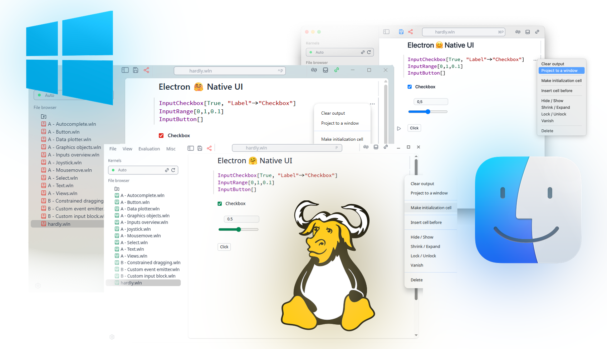

{/* add this script to the body  */}
{/* https://cdn.jsdelivr.net/gh/WLJSTeam/web-components@latest/src/common/app.js */}
<wljs-store json="./attachments/d6cd483c-70fc-48da-845c-f61882f55d99.txt"></wljs-store>

Sat 1 Nov 2025 21:53:42

## Even More Native UI
We have polished our GUI for all three platforms and eliminated our custom modal dialog windows. It now follows your system's accent color, and you can customize it from the settings menu:

<wljs-html encoded="true">{`%0A%3Cscript%20type%3D%22module%22%3E%0A%20%20%20%20const%20rating%20%3D%20%5B%5D%3B%0A%20%20%20%20for%20%28let%20i%3D1%3B%20i%3C%3D5%3B%20%2B%2Bi%29%20rating.push%28document.getElementById%28%22star%22%2Bi%29%29%3B%0A%20%20%20%20const%20feedback%20%3D%20document.getElementById%28%22feedback-form%22%29%3B%0A%20%20%20%20const%20container%20%3D%20document.getElementById%28%22rating-c%22%29%3B%0A%0A%20%20%20%20let%20rate%20%3D%20-1%3B%0A%20%20%20%20let%20text%20%3D%20%22undefined%22%3B%0A%20%20%20%20let%20timer%20%3D%20false%3B%0A%20%20%20%20let%20disabled%20%3D%20false%3B%0A%0A%20%20%20%20const%20submitForm%20%3D%20%28%29%20%3D%3E%20%7B%0A%20%20%20%20%20%20disabled%20%3D%20true%3B%0A%20%20%20%20%20%20let%20n%20%3D%201%3B%0A%20%20%20%20%20%20let%20interval%20%3D%20setInterval%28%28%29%20%3D%3E%20%7B%0A%20%20%20%20%20%20%20%20container.style.filter%20%3D%20%22blur%28%22%2Bn%2B%22px%29%22%3B%0A%20%20%20%20%20%20%20%20n%2B%2B%3B%0A%20%20%20%20%20%20%20%20if%20%28n%20%3E%20200%29%20%7B%0A%20%20%20%20%20%20%20%20%20%20clearInterval%28interval%29%3B%0A%20%20%20%20%20%20%20%20%7D%0A%20%20%20%20%20%20%20%20%20%20%0A%20%20%20%20%20%20%7D%2C%2030%29%3B%0A%0A%20%20%20%20%20%20server.io.fire%28%27submit-form-281%27%2C%20%5Brate%2C%20text%5D%29%3B%0A%20%20%20%20%7D%0A%0A%20%20%20%20const%20setTimer%20%3D%20%28%29%20%3D%3E%20%7B%0A%20%20%20%20%20%20if%20%28disabled%29%20return%3B%0A%20%20%20%20%20%20if%20%28timer%29%20clearTimeout%28timer%29%3B%0A%20%20%20%20%20%20timer%20%3D%20false%3B%0A%20%20%20%20%20%20timer%20%3D%20setTimeout%28submitForm%2C%205000%29%3B%0A%20%20%20%20%7D%0A%0A%20%20%20%20const%20clearTimer%20%3D%20%28%29%20%3D%3E%20%7B%0A%20%20%20%20%20%20if%20%28timer%29%20clearTimeout%28timer%29%3B%0A%20%20%20%20%20%20timer%20%3D%20false%3B%0A%20%20%20%20%7D%0A%0A%20%20%20%20rating.forEach%28%28e%29%20%3D%3E%20%7B%0A%20%20%20%20%20%20e.addEventListener%28%27change%27%2C%20%28ev%29%3D%3E%7B%0A%20%20%20%20%20%20%20%20rate%20%3D%20ev.srcElement.value%3B%0A%20%20%20%20%20%20%20%20setTimer%28%29%3B%0A%20%20%20%20%20%20%7D%29%3B%0A%20%20%20%20%7D%29%3B%0A%0A%20%20%20%20feedback.addEventListener%28%27input%27%2C%20%28%29%3D%3E%7B%0A%20%20%20%20%20%20text%20%3D%20feedback.value%3B%0A%20%20%20%20%20%20clearTimer%28%29%3B%0A%20%20%20%20%7D%29%3B%0A%0A%20%20%20%20feedback.addEventListener%28%27focus%27%2C%20%28%29%3D%3E%7B%0A%20%20%20%20%20%20clearTimer%28%29%3B%0A%20%20%20%20%7D%29%3B%0A%0A%20%20%20%20feedback.addEventListener%28%27blur%27%2C%20%28%29%20%3D%3E%20%7B%0A%20%20%20%20%20%20text%20%3D%20feedback.value%3B%0A%20%20%20%20%20%20setTimer%28%29%3B%0A%20%20%20%20%7D%29%0A%3C%2Fscript%3E`}</wljs-html>

## Input, InputString
We reimplemented the oldest functions from Wolfram Language allowing blocking or non-blocking (`InputAsync` or `InputStringAsync`) interactive input from a user:

<WLJSWrapper><wljs-editor display="codemirror" type="Input" editable="true"  >{`Plot[Evaluate[Input["Enter a function", (*SpB[*)Power[x(*|*),(*|*)3](*]SpB*)]], {x,-1,1}]`}</wljs-editor></WLJSWrapper>

<WLJSWrapper><wljs-editor display="codemirror" type="Output"  >{`(*VB[*)(FrontEndRef["bc8bd1f4-41c6-4ef7-88e3-9517976fdd6e"])(*,*)(*"1:eJxTTMoPSmNkYGAoZgESHvk5KRCeEJBwK8rPK3HNS3GtSE0uLUlMykkNVgEKJyVbJKUYppnomhgmm+mapKaZ61pYpBrrWpoamluam6WlpJilAgCNJhXy"*)(*]VB*)`}</wljs-editor></WLJSWrapper>

## ProgressIndicator
A handy easy expression for making progress bars

<WLJSWrapper><wljs-editor display="codemirror" type="Input" editable="true"  >{`ProgressIndicator[0.5, {0,1}]`}</wljs-editor></WLJSWrapper>

<WLJSWrapper><wljs-editor display="codemirror" type="Output"  >{`(*VB[*)(ProgressIndicator[0.5, {0, 1}])(*,*)(*"1:eJxTTMoPSmNkYGAoZgESHvk5KWlMIJ4gkAgoyk8vSi0u9sxLyUxOLMkvKmIAgwf2EDUgHT6ZxSWZIMFMkCEArfQQZw=="*)(*]VB*)`}</wljs-editor></WLJSWrapper>

You can supply a dynamic symbol to it as well

<WLJSWrapper><wljs-editor display="codemirror" type="Input" editable="true"  >{`x = 0.0;
	ProgressIndicator[x // Offload, {0,1}]
	Do[x -= 0.1(x - 1.0); Pause[0.1], {30}];
	"Done!"`}</wljs-editor></WLJSWrapper>

## Improved Text in Graphics
For certain cases `Text` is used in Wolfram Language can be used as an inset with symbolic numeric expressions like:

<WLJSWrapper><wljs-editor display="codemirror" type="Input" editable="true"  >{`Graphics[{Disk[], White, Text[1/2, {0,0}, {0,0}]}, ImageSize->100]
	Graphics[{Disk[], White, Text[Exp[2I + 1], {0,0}, {0,0}]}, ImageSize->100]
	Graphics[{Disk[], White, Text[(*SqB[*)Sqrt[34](*]SqB*)/5, {0,0}, {0,0}]}, ImageSize->100]`}</wljs-editor></WLJSWrapper>

<WLJSWrapper><wljs-editor display="codemirror" type="Output"  >{`(*VB[*)(Graphics[{Disk[{0, 0}], GrayLevel[1], Text[1/2, {0, 0}, {0, 0}]}, ImageSize -> 100])(*,*)(*"1:eJxTTMoPSmNkYGAoZgESHvk5KWlMIB4HkHAvSizIyEwuTmOGyftkFpcgVLtkFmdDVMPkMoE0A5iAqOKEmFLpk1qWmpMJEkKYFZJaUYKwKyixJDM/LxGiKBMkjNNkguJBpTmpYKs9cxPTU4Mzq1IzU4A8AI9pKhc="*)(*]VB*)`}</wljs-editor></WLJSWrapper>

<WLJSWrapper><wljs-editor display="codemirror" type="Output"  >{`(*VB[*)(Graphics[{Disk[{0, 0}], GrayLevel[1], Text[E^(1 + 2*I), {0, 0}, {0, 0}]}, ImageSize -> 100])(*,*)(*"1:eJxTTMoPSmNkYGAoZgESHvk5KWlMIB4HkHAvSizIyEwuTmOGyftkFpcgVLtkFmdDVMPkMoE0A5iAqOKEmFLpk1qWmpMJEkKYFZJaUQLRzQokAvLLU4uKQSpcIYLsQMI5P7cgJ7UCrDETJIrTNoLiQaU5qWDneOYmpqcGZ1alZqYAeQDpYS1a"*)(*]VB*)`}</wljs-editor></WLJSWrapper>

<WLJSWrapper><wljs-editor display="codemirror" type="Output"  >{`(*VB[*)(Graphics[{Disk[{0, 0}], GrayLevel[1], Text[Sqrt[34]/5, {0, 0}, {0, 0}]}, ImageSize -> 100])(*,*)(*"1:eJxTTMoPSmNkYGAoZgESHvk5KWlMIB4HkHAvSizIyEwuTmOGyftkFpcgVLtkFmdDVMPkMoE0A5iAqOKEmFLpk1qWmpMJEkKYFZJaUQLRzQriZeamFiOsDkosyczPS4ToyQQpQCgNyC9PLcpUgothqmeCy2FxGEHxoNKcVLDLPXMT01ODM6tSM1OAPACHwzVm"*)(*]VB*)`}</wljs-editor></WLJSWrapper>

:::warning
Dynamics is not possible at the moment for such expressions, but only for strings.
:::

Here is a "natural" example for that in `Graph`.

<WLJSWrapper><wljs-editor display="codemirror" type="Input" editable="true"  >{`transitionMatrix = {{7/10, 0, 3/10, 0}, {1/2, 0, 1/2, 0}, {0, 2/5, 0, 3/5}, {0, 1/5, 0, 4/5}};
	mp = DiscreteMarkovProcess[2, transitionMatrix];
	Graph[mp, EdgeLabels -> {e_ :> MarkovProcessProperties[mp, "TransitionMatrix"][[## & @@ e]]}]`}</wljs-editor></WLJSWrapper>

<WLJSWrapper><wljs-editor display="codemirror" type="Output" encoded="true"  >{`%28%2AVB%5B%2A%29%28CoffeeLiqueur%60Extensions%60Boxes%60Workarounds%60temporal%24671908%29%28%2A%2C%2A%29%28%2A%221%3AeJxTTMoPSmNkYGAoZgESHvk5KRCeEJBwK8rPK3HNS3GtSE0uLUlMykkNVgEKpyUmGiUbGhjpmqclG%2BuaWBoZ6lompZjqmiSbmZmamBunWSYbAgCGdRVz%22%2A%29%28%2A%5DVB%2A%29`}</wljs-editor></WLJSWrapper>

## New shortcut
To __evaluate__ the current cell __and jump__ to the next one use:

<wljs-html encoded="true">{`%3Ckbd%20%3ECtrl%2BEnter%3C%2Fkbd%3E`}</wljs-html>

or for MacOS

<wljs-html encoded="true">{`%3Ckbd%20%3ECMD%2BEnter%3C%2Fkbd%3E`}</wljs-html>

## Other changes / improvements
- Code base refactor: removed ~1000 LOC
- Fixed bugs with `SystemOpen`
- Linux GTK errors fixes
- Minor issues with exports to HTML file
- Radicant styles
- Licenses update

