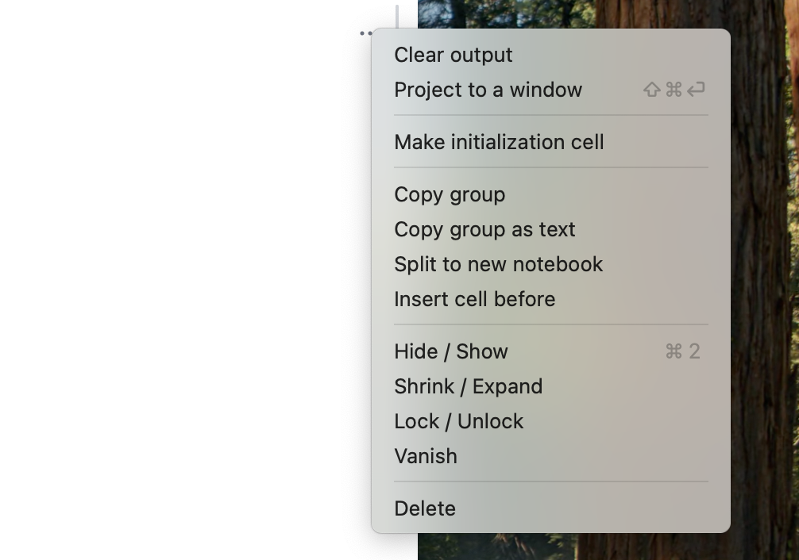

import { Tabs, Tab } from 'fumadocs-ui/components/tabs';

<Tabs items={['Windows', 'Mac','GNU/Linux', 'Docker', 'Homebrew']}>
  <Tab value="Mac">
    - [Apple Silicon](https://github.com/WLJSTeam/wljs-notebook/releases/download/v3.0.3/wljs-notebook-3.0.3-arm64-macos.dmg)
    - [Intel](https://github.com/WLJSTeam/wljs-notebook/releases/download/v3.0.3/wljs-notebook-3.0.3-x64-macos.dmg)
  </Tab>
  <Tab value="Windows">
    - [x86/64](https://github.com/WLJSTeam/wljs-notebook/releases/download/v3.0.3/wljs-notebook-3.0.3-x64-win.exe)
  </Tab>
  <Tab value="GNU/Linux">
    - [DEB x86/64](https://github.com/WLJSTeam/wljs-notebook/releases/download/v3.0.3/wljs-notebook-3.0.3-amd64-gnulinux.deb)
    - [DEB ARM64](https://github.com/WLJSTeam/wljs-notebook/releases/download/v3.0.3/wljs-notebook-3.0.3-arm64-gnulinux.deb)
    - [AppImage x86/64](https://github.com/WLJSTeam/wljs-notebook/releases/download/v3.0.3/wljs-notebook-3.0.3-x86_64-gnulinux.AppImage)
    - [AppImage ARM64](https://github.com/WLJSTeam/wljs-notebook/releases/download/v3.0.3/wljs-notebook-3.0.3-arm64-gnulinux.AppImage)
  </Tab>
  <Tab value="Docker">

```bash
docker run -it \
  -v ~/wljs:"/home/wljs/WLJS Notebooks" \
  -v ~/wljs/Licensing:/home/wljs/.WolframEngine/Licensing \
  -v ~/wljs/tmp:/tmp \
  -p 8000:3000 \
  --name wljs \
  ghcr.io/wljsteam/wljs-notebook:main
```

  </Tab>
  <Tab value="Homebrew">
  
```bash  
brew install --cask wljs-notebook
```

  </Tab>
</Tabs>


{/* add this script to the body  */}
{/* https://cdn.jsdelivr.net/gh/WLJSTeam/web-components@latest/src/common/app.js */}
<wljs-store json="./attachments/039b8273-a86f-4a08-9807-708bd1bf1ddd.txt"></wljs-store>


## Window Throttling
We fixed unintended window throttling on some machines when the window is unfocused or hidden. This is crucial for long-lived applications such as lab monitors, where some data must be updated continuously for hours or days.

## More tools for window management
We added `WindowEventListener`, similar to `SlideEventListener`, for capturing global window events. For example:

<WLJSWrapper><wljs-editor display="codemirror" type="Input" editable="true"  >{`ev = EventObject[];
	WindowEventListener[ev]`}</wljs-editor></WLJSWrapper>

<WLJSWrapper><wljs-editor display="codemirror" type="Input" editable="true"  >{`log = {};
	Refresh[log, 1]
	EventHandler[ev, {
	  ev_ :> Function[Null,
	    AppendTo[log, ev];
	  ]
	}];`}</wljs-editor></WLJSWrapper>

It can capture the following events from the window in which it is placed:

<Card>

- `"Mounted"` - when the component or window has loaded
- `"Closed"` - when a window is closed
- `"Blur"` - when a user removes focus from a window
- `"Focus"` - when a user focuses a window

</Card>

This component works in regular cells as well as in WLX. It takes up no space and renders nothing.

## Texture support for 3D
We finally added texture mapping support for `Graphics3D` and some of its primitives:

<WLJSWrapper><wljs-editor display="codemirror" type="Input" editable="true"  >{`Plot3D[Sin[x y], {x, 0, 3}, {y, 0, 3}, 
	 PlotStyle -> Texture[(*VB[*)(FrontEndRef["2841e783-90f8-4002-b0e7-8605dafe8f25"])(*,*)(*"1:eJxTTMoPSmNkYGAoZgESHvk5KRCeEJBwK8rPK3HNS3GtSE0uLUlMykkNVgEKG1mYGKaaWxjrWhqkWeiaGBgY6SYZpJrrWpgZmKYkpqVapBmZAgByGRUc"*)(*]VB*)], 
	 TextureCoordinateFunction -> ({#1, #2} &)]`}</wljs-editor></WLJSWrapper>

<WLJSWrapper><wljs-editor display="codemirror" type="Output"  >{`(*VB[*)(FrontEndRef["571fc922-1e00-49ce-b0bf-aa38561a695a"])(*,*)(*"1:eJxTTMoPSmNkYGAoZgESHvk5KRCeEJBwK8rPK3HNS3GtSE0uLUlMykkNVgEKm5obpiVbGhnpGqYaGOiaWCan6iYZJKXpJiYaW5iaGSaaWZomAgCBExWa"*)(*]VB*)`}</wljs-editor></WLJSWrapper>

`ComplexPlot3D` now also works:

<WLJSWrapper><wljs-editor display="codemirror" type="Input" editable="true"  >{`ComplexPlot3D[(*FB[*)(((*SpB[*)Power[z(*|*),(*|*)2](*]SpB*)+1)(*,*)/(*,*)((*SpB[*)Power[z(*|*),(*|*)2](*]SpB*)-1))(*]FB*), {z, -2 - 2 I, 2 + 2 I}]`}</wljs-editor></WLJSWrapper>

<WLJSWrapper><wljs-editor display="codemirror" type="Output"  >{`(*VB[*)(FrontEndRef["0418b066-5344-4d17-bd4a-275fe42475c0"])(*,*)(*"1:eJxTTMoPSmNkYGAoZgESHvk5KRCeEJBwK8rPK3HNS3GtSE0uLUlMykkNVgEKG5gYWiQZmJnpmhqbmOiapBia6yalmCTqGpmbpqWaGJmYmyYbAABwwBTb"*)(*]VB*)`}</wljs-editor></WLJSWrapper>

## GPUArray symbols
We added support for a recent WL feature: GPU arrays. They effectively store a reference to data on the GPU, which can be used for cross-platform GPU computing, although support is still limited for now:

<WLJSWrapper><wljs-editor display="codemirror" type="Input" editable="true"  >{`arr = Table[BitXor[i,j]//N, {i,127}, {j,127}];
	g = GPUArray[arr]`}</wljs-editor></WLJSWrapper>

<WLJSWrapper><wljs-editor display="codemirror" type="Output" encoded="true"  >{`%28%2AVB%5B%2A%29BoxForm%60temporalStorage%24331093%28%2A%2C%2A%29%28%2A%221%3AeJxdkUmPolAAhJktmcyvmOmT0p2wo0wyh4eCCig0CqidPvAWZGtkU4RfPzrHuVSqKnX66hc8u9EXiqKaH3fRcNKeaz8h3Tb6RFELxwN1HfZvI9pX3%2BjxzxH9Qo9H9BP3mxg99jTO6ljwuoOerofF8lRhuQdKR7pYbKZhEqilwVkbiLlVgIvInGRwcxXQhwanl6SMloRxblKqFWE%2F1MXWNbp4qdYIF7UHfF5O3Xhf7RdTpCHhhs8WcSRFstpO9zf4aAqcKS2v83VmAzMl9WoWC2xR9YHduGQHxcPVbZE7Ac4il6t15F3mftwht4bW8bZ5lth5nTSYjZyDwtsKnxDRkpDkmIuZXKqemb0abNNpGZqiY2Cf%2BI%2F1zIv3dqsL3JBGHRlKftgF%2BozpA4aH6VyOjozuZhWMT4NjMjfQpKtTW4Jrf5jklmGCVgCKrD7jWASsfUCl%2BOfpwfHdV%2Bnxe%2FT5gf%2FrXdxLTrbfH4aE2C7y%2Fl%2B7qy%2Fkv83jqy3JCWpDmJPm2z3qYd6QvwvvjD8%3D%22%2A%29%28%2A%5DVB%2A%29`}</wljs-editor></WLJSWrapper>

Perform a math operation and plot the result:

<Callout>
Not all operations are supported on the GPU. Some may fall back to the CPU version.
</Callout>

<WLJSWrapper><wljs-editor display="codemirror" type="Input" editable="true"  >{`g g - g // ArrayPlot `}</wljs-editor></WLJSWrapper>

<WLJSWrapper><wljs-editor display="codemirror" type="Output"  >{`(*VB[*)(FrontEndRef["ba444fb3-7f1e-4836-9025-b54f4dee96af"])(*,*)(*"1:eJxTTMoPSmNkYGAoZgESHvk5KRCeEJBwK8rPK3HNS3GtSE0uLUlMykkNVgEKJyWamJikJRnrmqcZpuqaWBib6VoaGJnqJpmapJmkpKZamiWmAQCFYxXe"*)(*]VB*)`}</wljs-editor></WLJSWrapper>

## Copy cells as plain text
We added an option to copy a group of cells as `InputForm`. It automatically strips off all syntax sugar and marks input and output cells.




For example:

<WLJSWrapper><wljs-editor display="codemirror" type="Input" editable="true"  >{`Series[Sin[x], {x,0,2}]`}</wljs-editor></WLJSWrapper>

<WLJSWrapper><wljs-editor display="codemirror" type="Output"  >{`(*VB[*)(SeriesData[x, 0, {1}, 1, 3, 1])(*,*)(*"1:eJwlT11PwjAAXIwPxl8xedrKEocERN9alX0YUdbRZiM8TCmzcaVlbLEb8X/58xyYXC53l3u4u3qX0ebMMIz9ZUdPa17JknD2jX87q/sWIGgJbAuzkrP9Y1ZlS+2YrmMefhxzeMJgZVvA6TqgN7hnoY7jF/mGxYwnHpSjPMAlF2m4KaZJKtTow9/Nn8ce2T6gxS2m6RfqM6qiyr9zo6zxiLyhKh8nM5g2ifQbquT8GmsY7HI3bGkCJ1EQL1rdTmqFgtqbhlTAHEH9KVjvuGFFELD/D513FNUFwxdHwbL167ZoTmlc1uwPHtBIXA=="*)(*]VB*)`}</wljs-editor></WLJSWrapper>

Copied expression:

<WLJSWrapper><wljs-editor display="codemirror" type="Input" editable="true"  >{`(* ::: Input ::: *)
	Series[Sin[x], {x,0,2}]
	
	(* ::: Output ::: *)
	(SeriesData[x, 0, {1}, 1, 3, 1])`}</wljs-editor></WLJSWrapper>

## Misc
- Various bug fixes related to compressed entities such as images and large plots
- Fixed `Graphics3D` pan and rotation on custom WLX components; added `"Controls"` option to disable/enable rotation