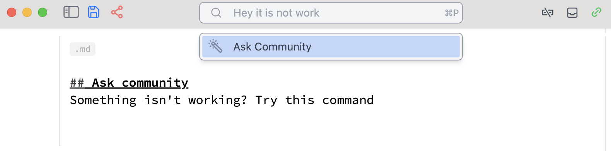

import { Tabs, Tab } from 'fumadocs-ui/components/tabs';

<Tabs items={['Windows', 'Mac','GNU/Linux', 'Docker', 'Homebrew']}>
  <Tab value="Mac">
    - [Apple Silicon](https://github.com/WLJSTeam/wljs-notebook/releases/download/v3.0.5/wljs-notebook-3.0.5-arm64-macos.dmg)
    - [Intel](https://github.com/WLJSTeam/wljs-notebook/releases/download/v3.0.5/wljs-notebook-3.0.5-x64-macos.dmg)
  </Tab>
  <Tab value="Windows">
    - [x86/64](https://github.com/WLJSTeam/wljs-notebook/releases/download/v3.0.5/wljs-notebook-3.0.5-x64-win.exe)
  </Tab>
  <Tab value="GNU/Linux">
    - [DEB x86/64](https://github.com/WLJSTeam/wljs-notebook/releases/download/v3.0.5/wljs-notebook-3.0.5-amd64-gnulinux.deb)
    - [DEB ARM64](https://github.com/WLJSTeam/wljs-notebook/releases/download/v3.0.5/wljs-notebook-3.0.5-arm64-gnulinux.deb)
    - [AppImage x86/64](https://github.com/WLJSTeam/wljs-notebook/releases/download/v3.0.5/wljs-notebook-3.0.5-x86_64-gnulinux.AppImage)
    - [AppImage ARM64](https://github.com/WLJSTeam/wljs-notebook/releases/download/v3.0.5/wljs-notebook-3.0.5-arm64-gnulinux.AppImage)
  </Tab>
  <Tab value="Docker">

```bash
docker run -it \
  -v ~/wljs:"/home/wljs/WLJS Notebooks" \
  -v ~/wljs/Licensing:/home/wljs/.WolframEngine/Licensing \
  -v ~/wljs/tmp:/tmp \
  -p 8000:3000 \
  --name wljs \
  ghcr.io/wljsteam/wljs-notebook:main
```

  </Tab>
  <Tab value="Homebrew">
  
```bash  
brew install --cask wljs-notebook
```

  </Tab>
</Tabs>

<wljs-store json="./attachments/c7d2336e-27a4-4b29-9939-4235ef5823d6.txt"></wljs-store>


## Human-, LLM- and GIT-friendly Notebook Format
We silently introduced a new version of `.wln` notebook format. The structure is minimal, and easy to read and parse by people and machines, but most importantly, it solves issues with versioning systems being unable to correctly identify the differences

<WLJSWrapper><wljs-editor display="codemirror" type="Input" editable="true"  >{`.md
	
	%----%Notebook%---%
	Quick: true
	%-----------------%
	
	%-----%Cells%-----%
	Type: Input
	%-----------------%
	1+1
	
	%-----------------%
	Type: Output
	%-----------------%
	2
	
	%---%EndOfCells%--%
	
	%-%EndOfNotebook%-%`}</wljs-editor></WLJSWrapper>

It looks like YAML in headers and was definitely inspired by it. After the corresponding separators the data can be any valid Wolfram Language expression.

<Callout>
We will never drop the support of the older version of `.wln` format. It costs 0 efforts to maintain the backward compatibility, since it is just input form of `Association` data structure.
</Callout>

### Unicode support
We did some hard work to keep all special symbols of Wolfram intact, while exporting and importing unicode characters. For example, this one will be written as a normal UTF8 string to a file

Куры 🐔

## Content hot-reloading support
In addition to a new format we enabled hot-reloading of a notebook content if it was modified outside WLJS Notebook. You will be prompted to approve changes or decline them.

<Callout>
Due to performance reasons only input/output cells can be reloaded, any internal fields of the notebook such as `NotebookStore` will stay intact.
</Callout>

## Farewell to AI Copilot 🪦
We decided to discontinue our built-in AI copilot in favour of support for external tools like coding agents Claude, Codex and others. Our custom copilot was too expensive in terms of tokens and not quite reliable. This also saves a lot of resources for our team, since we provide notebook tools as a service for other apps and do not have to update the providers manually, tweak system prompts and so on.

However, we prepared something better instead...

<wljs-html encoded="true">{`%3Cbr%20%2F%3E`}</wljs-html>

## MCP Server ✨
We added a background MCP server to interact with the notebook in the same way as our copilot. It can run cells, edit, create and do all autonomous tasks.

It also includes skills, documentation and consumes ~4-5 times fewer tokens compared to our former copilot.

You can add it to your favourite coding tool as follows:

__Claude__

```bash
claude mcp add --transport http --scope user wljs-notebook http://127.0.0.1:20564/
```

__Codex__

```bash
codex mcp add wljs-notebook --url http://127.0.0.1:20564/
```

## CLI ✨
We updated our *wljs* cli, that acts like a proxy to our API exposed via MCP server. You can do things like:

```bash
wljs focused
```

*returns focused notebook ID*

then add a new cell

```bash
wljs add 'notebookId' --content-escaped '.md\n# Hi'
```

It is also LLM-friendly, use `help` command for more.


## Ask community
Something isn't working? Try this command





This will automatically copy your cell and create a post on Github Discussions.

## InputColor element
We added new input element to the standard library:

<WLJSWrapper><wljs-editor display="codemirror" type="Input" editable="true"  >{`InputColor // Options`}</wljs-editor></WLJSWrapper>

<WLJSWrapper><wljs-editor display="codemirror" type="Output"  >{`{"Label"->"Color","Description"->"","Style"->"","Class"->"","LabelClass"->"","LabelStyle"->"","ShowAlpha"->False,"Topic"->"Default","Event":>CreateUUID[]}`}</wljs-editor></WLJSWrapper>

<WLJSWrapper><wljs-editor display="codemirror" type="Input" editable="true"  >{`Module[{col = {1,0,0}},
	  {
	    EventHandler[InputColor[col], (col=#)&],
	    Graphics[{
	      RGBColor[col//Offload], 
	      Triangle[],
	      RGBColor[({1,1,1}-col)//Offload],
	      Disk[{0,0},0.2]
	    }]
	  } // Column 
	]`}</wljs-editor></WLJSWrapper>

## Image with HTMLView
If you wrap any `Image` with `HTMLView`, it will be automatically serialized to a file and embedded as native `img` element. This helps if you have many rasterized images in the notebook

<WLJSWrapper><wljs-editor display="codemirror" type="Input" editable="true"  >{`ExampleData[{"TestImage", "Lena"}] // HTMLView `}</wljs-editor></WLJSWrapper>


## TeXView update
We added support for live updates in `TeXView` as well as new option `ImageSize` to set the size explicitly:

<WLJSWrapper><wljs-editor display="codemirror" type="Input" editable="true"  >{`str = TeXForm[Integrate[f[x], x]];
	TeXView[str//Offload]`}</wljs-editor></WLJSWrapper>

<WLJSWrapper><wljs-editor display="codemirror" type="Output"  >{`(*VB[*)(Null)(*,*)(*"1:eJxTTMoPSmNkYGAoZgESHvk5KRAeO5AISY0Iy0wtRwj4p6Xl5CemFDODBEqKAGYDDKI="*)(*]VB*)`}</wljs-editor></WLJSWrapper>

try to update

<WLJSWrapper><wljs-editor display="codemirror" type="Input" editable="true"  >{`str = TeXForm[Integrate[f[x] x, x]];`}</wljs-editor></WLJSWrapper>

<Callout>
`TeXForm` is a blocking function, use *Async version for cases when called from buttons or timers
</Callout>

<WLJSWrapper><wljs-editor display="codemirror" type="Input" editable="true"  >{`Button["Generate", Then[TeXFormAsync[Series[Sin[x] Cos[x], {x, 0, RandomInteger[{1, 30}]}]], (str = #1)&]]`}</wljs-editor></WLJSWrapper>

You can also easily place it on any plot:

<WLJSWrapper><wljs-editor display="codemirror" type="Input" editable="true" encoded="true"  >{`Plot%5Bx%2C%20%7Bx%2C0%2C1%7D%2C%20Epilog-%3E%7B%0A%20%20Inset%5BTeXView%5BTeXForm%5By%3D%3Dx%5D%2C%20ImageSize-%3EMedium%5D%2C%20%7B0.5%60%2C0.5%60%7D%5D%0A%7D%5D%20`}</wljs-editor></WLJSWrapper>

<WLJSWrapper><wljs-editor display="codemirror" type="Output"  >{`(*VB[*)(FrontEndRef["1716324f-9dc8-4ab7-aa0c-95f4f214e4dc"])(*,*)(*"1:eJxTTMoPSmNkYGAoZgESHvk5KRCeEJBwK8rPK3HNS3GtSE0uLUlMykkNVgEKG5obmhkbmaTpWqYkW+iaJCaZ6yYmGiTrWpqmmaQZGZqkmqQkAwB/chXR"*)(*]VB*)`}</wljs-editor></WLJSWrapper>

## Project cell to a window (Update)

We improved this feature: <kbd>Ctrl-Shift-Enter</kbd>. It now automatically copies all output HTML or JavaScript cells to a new window as well.

Why?

Imagine you have created a presentation with custom styles defined in separate HTML cells, along with some components, and you do not want to present it directly from the same notebook. You could still package all scripts using WLX cells and embed them into one of the slides, but this may not be ideal for every case.

Now, you can simply project your slides as usual, and everything else happens in the background.

## Codebase Refactor
Another refactoring sweep has happened, unifying the architecture and modules structure.

## Breaking changes
`CreateFrontEndObject` does not run automatically in the output cells, i.e.

<WLJSWrapper><wljs-editor display="codemirror" type="Input" editable="true"  >{`CreateFrontEndObject[1+1]`}</wljs-editor></WLJSWrapper>

<WLJSWrapper><wljs-editor display="codemirror" type="Output"  >{`FrontEndRef["cc7d56fc-6559-4a1c-bd5b-a2b6182a2a51"]`}</wljs-editor></WLJSWrapper>

We removed it to dedicate this task solely to `ViewBox` avoiding any implicit conventions. In this sense frontend objects serve only the purpose of storing things. For an average user this does not mean anything, since it only affects custom written Javascript symbols. Here is an example:

<WLJSWrapper><wljs-editor display="codemirror" type="Input" editable="true"  >{`.js
	core.Deco = async (args, env) => {
	  env.element.style.background = 'red';
	  env.element.style.height = '1rem';
	  env.element.style.width = '1rem';
	}`}</wljs-editor></WLJSWrapper>

<WLJSWrapper><wljs-editor display="js" type="Output" encoded="true" class="wljs-hide-undefined" >{`core.Deco%20%3D%20async%20%28args%2C%20env%29%20%3D%3E%20%7B%0A%20%20env.element.style.background%20%3D%20%27red%27%3B%0A%20%20env.element.style.height%20%3D%20%271rem%27%3B%0A%20%20env.element.style.width%20%3D%20%271rem%27%3B%0A%7D`}</wljs-editor></WLJSWrapper>

<WLJSWrapper><wljs-editor display="codemirror" type="Input" editable="true"  >{`Deco /: MakeBoxes[d_Deco, StandardForm] := ViewBox[d,d]`}</wljs-editor></WLJSWrapper>

<WLJSWrapper><wljs-editor display="codemirror" type="Input" editable="true"  >{`Deco[] + 1(*BB[*)(**)(*,*)(*"1:eJxTTMoPSmNhYGAo5gcSAUX5ZZkpqSn+BSWZ+XnFaYwgCS4g4Zyfm5uaV+KUXxEMUqxsbm6exgSSBPGCSnNSg9mAjOCSosy8dLBYSFFpKpoKkDkeqYkpEFXBILO1sCgJSczMQVYCAOFrJEU="*)(*]BB*)`}</wljs-editor></WLJSWrapper>

<WLJSWrapper><wljs-editor display="codemirror" type="Output"  >{`1+(*VB[*)(Deco[])(*,*)(*"1:eJxTTMoPSmNkYGAoZgESHvk5KWkMMJ5LanI+AGKYBgI="*)(*]VB*)`}</wljs-editor></WLJSWrapper>