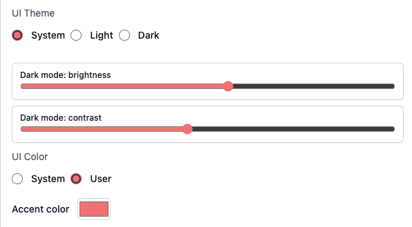

import { Tabs, Tab } from 'fumadocs-ui/components/tabs';

<Tabs items={['Windows', 'Mac','GNU/Linux', 'Docker', 'Homebrew']}>
  <Tab value="Mac">
    - [Apple Silicon](https://github.com/WLJSTeam/wljs-notebook/releases/download/v3.0.7/wljs-notebook-3.0.7-arm64-macos.dmg)
    - [Intel](https://github.com/WLJSTeam/wljs-notebook/releases/download/v3.0.7/wljs-notebook-3.0.7-x64-macos.dmg)
  </Tab>
  <Tab value="Windows">
    - [x86/64](https://github.com/WLJSTeam/wljs-notebook/releases/download/v3.0.7/wljs-notebook-3.0.7-x64-win.exe)
  </Tab>
  <Tab value="GNU/Linux">
    - [DEB x86/64](https://github.com/WLJSTeam/wljs-notebook/releases/download/v3.0.7/wljs-notebook-3.0.7-amd64-gnulinux.deb)
    - [DEB ARM64](https://github.com/WLJSTeam/wljs-notebook/releases/download/v3.0.7/wljs-notebook-3.0.7-arm64-gnulinux.deb)
    - [AppImage x86/64](https://github.com/WLJSTeam/wljs-notebook/releases/download/v3.0.7/wljs-notebook-3.0.7-x86_64-gnulinux.AppImage)
    - [AppImage ARM64](https://github.com/WLJSTeam/wljs-notebook/releases/download/v3.0.7/wljs-notebook-3.0.7-arm64-gnulinux.AppImage)
  </Tab>
  <Tab value="Docker">

```bash
docker run -it \
  -v ~/wljs:"/home/wljs/WLJS Notebooks" \
  -v ~/wljs/Licensing:/home/wljs/.WolframEngine/Licensing \
  -v ~/wljs/tmp:/tmp \
  -p 8000:3000 \
  --name wljs \
  ghcr.io/wljsteam/wljs-notebook:main
```

  </Tab>
  <Tab value="Homebrew">
  
```bash  
brew install --cask wljs-notebook
```

  </Tab>
</Tabs>

{/* add this script to the body  */}
{/* https://cdn.jsdelivr.net/gh/WLJSTeam/web-components@latest/src/common/app.js */}


<wljs-store json="./attachments/84dc9383-f56e-4da9-b8dc-e3814bf8a65f.txt"></wljs-store>


## TraditionalForm
We implemented `TraditionalForm`, which was missing from WLJS. Under the hood, it attempts to convert expressions to LaTeX and render them in the output.

<WLJSWrapper><wljs-editor display="codemirror" type="Input" editable="true"  >{`Integrate[f[x], x] // TraditionalForm`}</wljs-editor></WLJSWrapper>

You can also use it for labels and plot legends.

<WLJSWrapper><wljs-editor display="codemirror" type="Input" editable="true"  >{`Plot[Sin[x], {x, 0, 1}, PlotLegends->{Sin[x]//TraditionalForm}]`}</wljs-editor></WLJSWrapper>

## Settings Hot Reload & Dark Mode Update
You no longer need to restart WLJS every time you change a setting, for the most part. Open notebooks automatically reload after a settings change.

In addition, we added contrast and brightness adjustments for dark mode, so you can tune it until it feels comfortable for your eyes.

<div className="invertColor">

<wljs-html encoded="true">{`%3Cbr%20%2F%3E`}</wljs-html>

</div>

## Window Manager Refactor & Offscreen Rendering
We simplified and improved many parts of the codebase. `Rasterize` and many other system features no longer require open windows and now work seamlessly in the background. Most users may not notice a huge difference, but this makes future maintenance and advanced WLJS usage much better.

If you are using the WLJS desktop application, try:

<WLJSWrapper><wljs-editor display="codemirror" type="Input" editable="true"  >{`Rasterize[Plot[x, {x,0,1}]]`}</wljs-editor></WLJSWrapper>

`CellPrint` no longer requires additional parameters when used without an evaluation context, such as inside a `Button`.

<WLJSWrapper><wljs-editor display="codemirror" type="Input" editable="true"  >{`Button["Print", CellPrint[RandomColor[]]]`}</wljs-editor></WLJSWrapper>

## CLI Update
You can use the `wljs` utility to inspect notebooks:

<WLJSWrapper><wljs-editor display="codemirror" type="Input" editable="true"  >{`.sh
	wljs focused`}</wljs-editor></WLJSWrapper>

<WLJSWrapper><wljs-editor display="shell" type="Output"  >{`{
	  "Id": "008",
	  "Kernel": "002"
	}
	`}</wljs-editor></WLJSWrapper>

You can also run Wolfram Language code, similar to `wolframscript`. For example, here is an analogue of the `ls` or `dir` command:

<WLJSWrapper><wljs-editor display="codemirror" type="Input" editable="true"  >{`.sh
	wljs -c 'FileNames["*"]'`}</wljs-editor></WLJSWrapper>

<WLJSWrapper><wljs-editor display="shell" type="Output"  >{`{"2.5.0.wln", "2.5.2.wln", "2.5.3.wln", "2.5.4.wln", "2.5.6.wln", "2.5.7.wln", "2.5.9.wln", "2.6.1.wln", "2.6.2.wln", "2.6.3.wln", "2.6.4.wln", "2.6.5.wln", "2.6.7.wln", "2.6.8.wln", "2.7.0.wln", "2.7.1.wln", "2.7.2.wln", "2.7.2 X1.wln", "2.7.3.wln", "2.7.4.wln", "2.7.5.wln", "2.7.6.wln", "2.7.8.wln", "2.7.9.wln", "2.8.0.wln", "2.8.1.wln", "2.8.2.wln", "2.8.3.wln", "2.8.5.wln", "2.8.7.wln", "2.8.8.wln", "2.8.9.wln", "2.9.1.wln", "2.9.2.wln", "3.0.0.wln", "3.0.1.wln", "3.0.2.wln", "3.0.3.wln", "3.0.4.wln", "3.0.7.wln", "3.0.7.wln", "attachments", ".DS_Store", ".iconized"}
	`}</wljs-editor></WLJSWrapper>

`Rasterize` and WLJS-specific functions also work out of the box.

<WLJSWrapper><wljs-editor display="codemirror" type="Input" editable="true"  >{`.sh
	wljs -c 'Rasterize[TeXView[TeXForm[1/2]]]'`}</wljs-editor></WLJSWrapper>

<WLJSWrapper><wljs-editor display="shell" type="Output"  >{`<<Image>>
	`}</wljs-editor></WLJSWrapper>

## MCP Update
With help from @Hachann, we significantly improved the tools for AI agents and reduced token consumption.

## Disk and Circle Improvements
Our `Disk` and `Circle` graphics primitives now support multiple coordinates as their first argument, similar to `Point` and `Line`. For example:

<WLJSWrapper><wljs-editor display="codemirror" type="Input" editable="true"  >{`pts = {{-1.,-1.}, {1.,1.}};
	Graphics[{
	  Disk[pts // Offload, 0.08], Red, 
	  Circle[pts // Offload, 0.11]
	}, "Controls"->False]`}</wljs-editor></WLJSWrapper>

<WLJSWrapper><wljs-editor display="codemirror" type="Output"  >{`(*VB[*)(Graphics[{Disk[Offload[pts], 0.08], RGBColor[1, 0, 0], Circle[Offload[pts], 0.11]}, "Controls" -> False])(*,*)(*"1:eJxTTMoPSmNkYGAoZgESHvk5KWlMIB4HkHAvSizIyEwuTmOGyftkFpdA5EE8l8zibIhediDhn5aWk5+YUgxSXFBSXFQtss79YdUWe4hukHlB7k7O+Tn5RZkgPZkMMAJiIBuQcM4sSs5JxW2kZkz/oa8ae+wRTggqzUkNBpntnJ9XUpSfU1zMCuS4JeYUpwIAslYw0A=="*)(*]VB*)`}</wljs-editor></WLJSWrapper>

Now try updating the points:

<WLJSWrapper><wljs-editor display="codemirror" type="Input" editable="true"  >{`pts = Append[pts, RandomReal[{-1,1}, 2]];`}</wljs-editor></WLJSWrapper>

This was already possible with `FrontSubmit` and by referencing the graphics canvas with `FrontInstanceReference`. Use that approach if you need to append or remove compound graphics primitives.

## AF Update
The animation framework has been updated. It is more stable and now renders export animations fully offscreen at up to 2K resolution. It uses native Node.js I/O to write frames to disk and bypasses the Wolfram Kernel entirely.

## Misc
- Improved `Short`
- Fixed encoding issues for `Text`
- Added missing binaries
- Improved `ZoomAt`
- Improved `MMAView`, `GeoGraphics`, and `TeXForm`
- Stability improvements
- WLW (Mini Apps) bug fixes