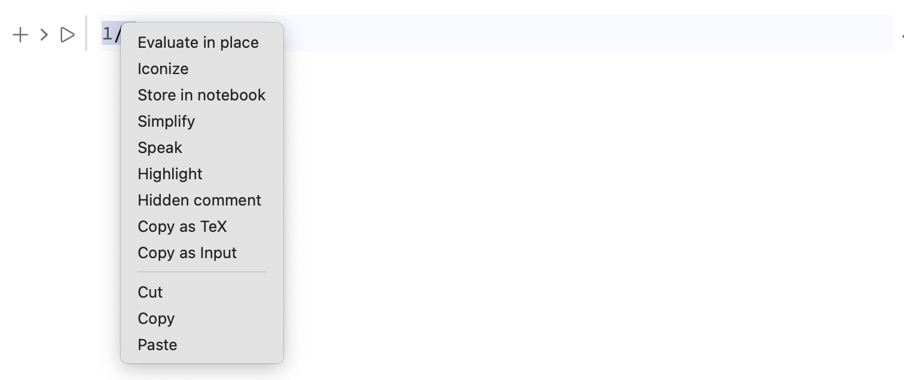

{/* add this script to the body  */}
{/* https://cdn.jsdelivr.net/gh/WLJSTeam/web-components@latest/src/common/app.js */}
<wljs-store json="./attachments/18b8be28-ef4b-4abb-9bac-711435985e8a.txt"></wljs-store>


import { Tabs, Tab } from 'fumadocs-ui/components/tabs';

<Tabs items={['Windows', 'Mac','GNU/Linux', 'Docker', 'Homebrew']}>
  <Tab value="Mac">
    - [Apple Silicon](https://github.com/WLJSTeam/wljs-notebook/releases/download/v3.1.4/wljs-notebook-3.1.4-arm64-macos.dmg)
    - [Intel](https://github.com/WLJSTeam/wljs-notebook/releases/download/v3.1.4/wljs-notebook-3.1.4-x64-macos.dmg)
  </Tab>
  <Tab value="Windows">
    - [x86/64](https://github.com/WLJSTeam/wljs-notebook/releases/download/v3.1.4/wljs-notebook-3.1.4-x64-win.exe)
  </Tab>
  <Tab value="GNU/Linux">
    - [DEB x86/64](https://github.com/WLJSTeam/wljs-notebook/releases/download/v3.1.4/wljs-notebook-3.1.4-amd64-gnulinux.deb)
    - [DEB ARM64](https://github.com/WLJSTeam/wljs-notebook/releases/download/v3.1.4/wljs-notebook-3.1.4-arm64-gnulinux.deb)
    - [AppImage x86/64](https://github.com/WLJSTeam/wljs-notebook/releases/download/v3.1.4/wljs-notebook-3.1.4-x86_64-gnulinux.AppImage)
    - [AppImage ARM64](https://github.com/WLJSTeam/wljs-notebook/releases/download/v3.1.4/wljs-notebook-3.1.4-arm64-gnulinux.AppImage)
    - [RPM x86/64](https://github.com/WLJSTeam/wljs-notebook/releases/download/v3.1.4/wljs-notebook-3.1.4-x86_64-gnulinux.rpm)
  </Tab>
  <Tab value="Docker">

```bash
docker run -it \
  -v ~/wljs:"/home/wljs/WLJS Notebooks" \
  -v ~/wljs/Licensing:/home/wljs/.WolframEngine/Licensing \
  -v ~/wljs/tmp:/tmp \
  -p 8000:3000 \
  --name wljs \
  ghcr.io/wljsteam/wljs-notebook:3.1.4
```

  </Tab>
  <Tab value="Homebrew">
  
```bash  
brew install --cask wljs-notebook
```

  </Tab>
</Tabs>

## Legends Styling
We now support additional styling options for plot legends:

- `LegendFunction` (limited support)
- `LegendLayout`
- `LegendMargins`
- `LabelStyle`
- `RoundingRadius`
- `Background`

For example:

<WLJSWrapper><wljs-editor display="codemirror" type="Input" editable="true"  >{`Plot[{x, 2x}, {x,0,1}, 
	 PlotLegends->SwatchLegend[Automatic, {"x", "2x"}, 
	   LegendFunction->"Panel"
	 ]
	]`}</wljs-editor><WLJSWrapper>

<WLJSWrapper><wljs-editor display="codemirror" type="Output"  >{`(*VB[*)(Legended[ToExpression[FrontEndRef["F82846e8f-51e0-4a8f-9821-8284c7588dd2"], InputForm], Placed[SwatchLegend[{Directive[Opacity[1.], RGBColor[0.24, 0.6, 0.8], AbsoluteThickness[2]], Directive[Opacity[1.], RGBColor[0.95, 0.627, 0.1425], AbsoluteThickness[2]]}, {"x", "2x"}, LegendMarkers -> Automatic, LabelStyle -> {}, LegendFunction -> "Panel", LegendLayout -> "Column"], After, Identity]])(*,*)(*"1:eJylUs0uBEEQHv8/QfAAEgfHTVh/4yCTxRLJbhazce/pqaGjdUt3D7sP4CG4unkCZw/g4OIBuIhEeANVPcnK7sVBHb5Uar7+quqrmU/0UTYQBIGdRDgWcLUDXBvmtIlHsFKDE1BpuaCMI1RTgd+ImPVRbRZh12jlqiqttoDnjiUS4gUqh+VwZQ3CrLS6BIulFYbZRlheKlGdr6+GYYrK/aQyiHCU47tRSoClDSXbvto0OfRwaIwYJHDfyg5RKyYtFEMOIxxIxiHNKLUTxL5ijp8Wu/yK1YR1xZsxhB1hUFFcQrEXLd+4YFy4tgl8fEUF2Y+4t7WtpTbmYe764/DhKTLLPl4jc3tD8R4VMjMIlcRqmTtongp+psBaQSP8t3Pm4zMy99/P9WT6LTKb4y93F5uPf3fuciAmdiumWrnV7bT/JwrX6sycgbF+3kru9Dlzgvew6S41loCMXVtCFnT53E2d6gjv5gp31yqmMx4wBbKHOtGh1lhb5y6mq6IF+bnyp69kDgcja/ZTUA5d+wFt7rfh"*)(*]VB*)`}</wljs-editor><WLJSWrapper>

`LegendFunction` is applicable to `SwatchLegend`, `LineLegend`, and `PointLegend`, and it supports only named functions such as:

- `"Panel"`
- `"Frame"`, `"Framed"`
- `"DarkFrame"`
- `"Frameless"`

It can also be combined with other options:

<WLJSWrapper><wljs-editor display="codemirror" type="Input" editable="true"  >{`Plot[{x, 2x}, {x,0,1}, 
	 PlotLegends->Placed[SwatchLegend[Automatic, TraditionalForm/@{x, 2x}, 
	  LegendFunction->"DarkFrame", RoundingRadius->0, 
	  Background->White, 
	  LegendMargins->{{15,10}, {5,5}}
	 ], {0.45,0.25}]
	]`}</wljs-editor><WLJSWrapper>

<WLJSWrapper><wljs-editor display="codemirror" type="Output" encoded="true"  >{`%28%2AVB%5B%2A%29%28Legended%5BToExpression%5BFrontEndRef%5B%22F51e00bab-6156-4326-96cc-c087ddee792a%22%5D%2C%20InputForm%5D%2C%20Placed%5BSwatchLegend%5B%7BDirective%5BOpacity%5B1.%5D%2C%20RGBColor%5B0.24%2C%200.6%2C%200.8%5D%2C%20AbsoluteThickness%5B2%5D%5D%2C%20Directive%5BOpacity%5B1.%5D%2C%20RGBColor%5B0.95%2C%200.627%2C%200.1425%5D%2C%20AbsoluteThickness%5B2%5D%5D%7D%2C%20%7BBoxForm%60TeXForm%5BHoldForm%5Bx%5D%5D%2C%20BoxForm%60TeXForm%5B2%2AHoldForm%5Bx%5D%5D%7D%2C%20LegendMarkers%20-%3E%20Automatic%2C%20LabelStyle%20-%3E%20%7B%7D%2C%20LegendFunction%20-%3E%20%22DarkFrame%22%2C%20LegendLayout%20-%3E%20%22Column%22%2C%20LegendMargins%20-%3E%20%7B%7B15%2C%2010%7D%2C%20%7B5%2C%205%7D%7D%2C%20RoundingRadius%20-%3E%200%2C%20Background%20-%3E%20GrayLevel%5B1%5D%5D%2C%20%7B0.45%2C%200.25%7D%2C%20Identity%5D%5D%29%28%2A%2C%2A%29%28%2A%221%3AeJylUstuEzEUnfIm4lH6AUgsWEZKU5rSRTVq2qQgTVXIRIglHvtOasVjV360yQfwEbBlxxd0zRoQYsOGHWwQEoI%2FwNeuQJNQWHAXZ8bXx%2Fdx7r1VqEF5NkkSc9XDIw5H20CVJlbp%2FKL3ZDACydqR0vDQY9zfIbFcQN%2BSh75W0vYk602AOksKAfltdK8uQ6tVkKLZWV7tNO%2BstDvN9Q6lTdq6u8YYwNp6m5RnMMo5DwPn313CHyBsT4pp8A61gxkOlpGDABpSmfOYiggDscgLHh4IQoGVl%2FF8BdlHxNL92MvvYBk3Nr5B4jbXPiI%2FhNgXNr93QCi3U50E%2B55Gcihxp7ulhNL6%2BObTrw%2BP36Z6JdinVD9%2FhvYljWFueNgsjBLOwnCf07EEYziW8L%2BZy2DfUv3yx%2FvdYvFzqjcaH14cbLz6d%2Ba6AoF93UNXTfpKV0%2BG8Bi%2F8QJz3lOCocegZ3L6gxAXxzHkFZzkOi1IbaRh%2BeJ4dokegzZBmE1nVUUspzNsXICMFCByOxVQJrV26tRrvwL3nfQiK5kHyX2WvibVzGqFZYn0jEyVszluk9fbVfJvFY%2B4NDOq1k4c1eKNOe05ihXgD2UPlJOMy9GAMO4MT%2BZZGLBL6HikkRqlxu52NJlmcAiCL8yl1G9eo31MT3brXRqmc5%2BBtH7jfgK6kgDN%22%2A%29%28%2A%5DVB%2A%29`}</wljs-editor><WLJSWrapper>

Labels can be styled using colors, `FontFamily`, and `FontSize`. `LegendMargins` accepts forms such as:

- `LegendMargins -> globalMargin`
- `LegendMargins -> {{left, right}, {top, bottom}}`

Another feature is `LegendLayout`, which accepts `"Row"`, `"Column"`, `"ReversedRow"`, and `"ReversedColumn"`.

<WLJSWrapper><wljs-editor display="codemirror" type="Input" editable="true"  >{`Plot[{x, 2x}, {x,0,1}, 
	 PlotLegends->Placed[SwatchLegend[Automatic, {"x", "2x"}, 
	  LegendFunction->"Frame",
	  Background->White, 
	  LegendLayout->"Row"
	 ], {0.45,0.5}]
	]`}</wljs-editor><WLJSWrapper>

<WLJSWrapper><wljs-editor display="codemirror" type="Output"  >{`(*VB[*)(Legended[ToExpression[FrontEndRef["Fad877441-0968-4571-8bf6-c847f6274742"], InputForm], Placed[SwatchLegend[{Directive[Opacity[1.], RGBColor[0.24, 0.6, 0.8], AbsoluteThickness[2]], Directive[Opacity[1.], RGBColor[0.95, 0.627, 0.1425], AbsoluteThickness[2]]}, {"x", "2x"}, LegendMarkers -> Automatic, LabelStyle -> {}, LegendFunction -> "Frame", LegendLayout -> {"Row", {Automatic, 5}}, Background -> GrayLevel[1]], {0.45, 0.5}, Identity]])(*,*)(*"1:eJylUr1O3EAQ9iUQAgqI5AEipaA8CS7O+SiQxc+BkIyAM0q/Xo9hdYsXza658wPwEKRNlyegTg0UNDQUSNAgJARvwP4AkY+CIlN8ssbfzHwz335LRCd773meHNfwk0FvCahAogTGIzoTwTbkacNRxjS0U6b/GWJWM7kvGpZR5Kqdp+0+0EKRhEM8ZdIkbQWB78/Up2ebrbr/I5ipt5KsWactP8iajcAP/Eb2znQZ0tApdN1H8wEkXc95abNbWMAAx8iIgQO1o+SwHcUlOJEfNGxwQiHNzALyk2H3iKI7bpd/zSImlasZ1bDEUHdk++D2MrXre4QyVaJn4z50ZCtxZWFRcIF49PXgdvPoNMTvNq5C/HVo4iZ0bT5rmE+k4IWCrR1GuzlIyYyE/52c2bgL8c/D2VoyeR3i3Nj57725v29PrlwgNux+bHKNfvXS9k24q60R7AJKq3e+UGKXKEYH2MaXiCTAY1VyyLzKnavUiZfGy0Wudxd5bG1EsjvgtvXPUSNSikINqDeH6YheNVuVyYYrS79oXSC0u42i0G+i9uzFCpIygn3grPbqUnhybOIifLLlMrSOrKaQK23WI+4x040="*)(*]VB*)`}</wljs-editor><WLJSWrapper>

### Bar legend
`BarLegend` is a special type of legend used in contour plots and heatmaps. It can also exist on its own.

<WLJSWrapper><wljs-editor display="codemirror" type="Input" editable="true"  >{`BarLegend["Thermometer", 3, LegendLabel->"Temperature"]`}</wljs-editor><WLJSWrapper>

<WLJSWrapper><wljs-editor display="codemirror" type="Output"  >{`(*VB[*)(FrontEndRef["F16a2fad3-916b-47f4-99fe-36e61c4cef89"])(*,*)(*"1:eJxTTMoPSmNkYGAoZgESHvk5KRCeEJBwK8rPK3HNS3GtSE0uLUlMykkNVgUJG5olGqUlphjrWhqaJemamKeZ6FpapqXqGpulmhkmmySnpllYAgCdNhYx"*)(*]VB*)`}</wljs-editor><WLJSWrapper>

The following options are supported:
`LegendLabel`, `LabelStyle` (which also styles ticks), and
`ImageSize`. For example, you can easily align a bar legend with your plot.

<WLJSWrapper><wljs-editor display="codemirror" type="Input" editable="true"  >{`ContourPlot[(*FB[*)(((*SpB[*)Power[x(*|*),(*|*)2](*]SpB*) - (*SpB[*)Power[y(*|*),(*|*)2](*]SpB*))(*,*)/(*,*)((*SpB[*)Power[((*SpB[*)Power[x(*|*),(*|*)2](*]SpB*) + (*SpB[*)Power[y(*|*),(*|*)2](*]SpB*))(*|*),(*|*)2](*]SpB*)))(*]FB*) , {x,-1,1}, {y,-1,1}, Contours->4,
	  PlotLegends->BarLegend[Automatic, ImageSize->{20,300}],
	  ImageSize->{300,300},
	  ColorFunction->"Rainbow",
	  ClippingStyle->Automatic
	]`}</wljs-editor><WLJSWrapper>

<WLJSWrapper><wljs-editor display="codemirror" type="Output" encoded="true"  >{`%28%2AVB%5B%2A%29%28Legended%5BToExpression%5BFrontEndRef%5B%22F006c4a5b-5760-463d-88d5-2681b1515676%22%5D%2C%20InputForm%5D%2C%20Placed%5BBarLegend%5B%7BBlend%5B%22Rainbow%22%2C%20%231%5D%20%26%20%2C%20%7B-59%2F10%2C%2059%2F10%7D%7D%2C%20%7B%7B-4.6000000000000005%2C%20Directive%5BGrayLevel%5B0%5D%2C%20Opacity%5B0.5%5D%2C%20CapForm%5B%22Butt%22%5D%5D%7D%2C%20%7B-2.3000000000000003%2C%20Directive%5BGrayLevel%5B0%5D%2C%20Opacity%5B0.5%5D%2C%20CapForm%5B%22Butt%22%5D%5D%7D%2C%20%7B0.%2C%20Directive%5BGrayLevel%5B0%5D%2C%20Opacity%5B0.5%5D%2C%20CapForm%5B%22Butt%22%5D%5D%7D%2C%20%7B2.3000000000000003%2C%20Directive%5BGrayLevel%5B0%5D%2C%20Opacity%5B0.5%5D%2C%20CapForm%5B%22Butt%22%5D%5D%7D%7D%2C%20LabelStyle%20-%3E%20%7B%7D%2C%20LegendLayout%20-%3E%20%22Column%22%2C%20LegendMarkerSize%20-%3E%20300%2C%20ScalingFunctions%20-%3E%20%7BIdentity%2C%20Identity%7D%2C%20ImageSize%20-%3E%20%7B20%2C%20300%7D%2C%20Charting%60AxisLabel%20-%3E%20None%2C%20Charting%60TickSide%20-%3E%20Right%2C%20ColorFunctionScaling%20-%3E%20True%5D%2C%20After%2C%20Identity%5D%5D%29%28%2A%2C%2A%29%28%2A%221%3AeJzFVMtu2zAQVNz0FbRAG%2BQHcuitBuw0Ugz0kMaOXQRQm8IMei4lrZRFaDKgqDTq1%2BXS%2F%2BifuFzSViLV55SHhbg7nOEsltpP1Dx%2FEgRB%2BdqG7wg%2FTyFVmhul2XObiaEAmR14yI4N0wxtjYD5FuV2bZhpJc1UZtNbSCvDEwHsHaUHgyg95GHSD4%2BiQf8w%2BpD1R6Ms7B9Eo2EyDIdhdBTlPWLZtmFe2XMv6AN4di5F7bIXuoIOhq7BQEDqpMqnJMVFCf6Sz2z4JngKWU7A8qUNY669kXumGEvjHZDkrJKpQSV9nRjHwsJdC%2BYcZaJWdukoE8og7TpsvTXbnBMXF%2Fh7uVziToNs1T7aja9t%2F8uy3ukip7V7572Rl1PU1jnegL8QpT5rXsdwAwID4nN5uvn5NU%2FR1Dpw68%2FxfWXCr2dKLxjpjCuzWbX3yKrBav0Xr58eTZVm2D2lmCcgmKkF5MHmEXDQV80zjHmtKsNowidKVAvZQb5pkF%2B4vgLN8Bfg%2B62Hg9rgWGpnUBbrwS%2FbXXGjepaBNNZda9OhouacLXgBpNXmwD2a8A3y9MuYXHJtrP6Pk1ssXSNc%2FauSnddevn2IvsD0imHmH%2F0ci8tus%2FZ8b5ReG1v5bP4l7uRJbkC3bP0FlqUnXw%3D%3D%22%2A%29%28%2A%5DVB%2A%29`}</wljs-editor><WLJSWrapper>

Let's make all ticks larger and limit their number.

<WLJSWrapper><wljs-editor display="codemirror" type="Input" editable="true"  >{`ContourPlot[(*FB[*)(((*SpB[*)Power[x(*|*),(*|*)2](*]SpB*) - (*SpB[*)Power[y(*|*),(*|*)2](*]SpB*))(*,*)/(*,*)((*SpB[*)Power[((*SpB[*)Power[x(*|*),(*|*)2](*]SpB*) + (*SpB[*)Power[y(*|*),(*|*)2](*]SpB*))(*|*),(*|*)2](*]SpB*)))(*]FB*) , {x,-1,1}, {y,-1,1}, Contours->4,
	  PlotLegends->BarLegend[Automatic, 3, ImageSize->{20,300}, LabelStyle->Directive[FontSize->14], LegendLabel->"f(x,y)"],
	  ImageSize->{300,300},
	  ColorFunction->"Rainbow",
	  ClippingStyle->Automatic,
	  FrameStyle->Directive[FontSize->14],
	  FrameTicksStyle->Directive[FontSize->14],
	  FrameTicks->{{-1,0,1}, {-1,0,1}}
	]`}</wljs-editor><WLJSWrapper>

<WLJSWrapper><wljs-editor display="codemirror" type="Output" encoded="true"  >{`%28%2AVB%5B%2A%29%28Legended%5BToExpression%5BFrontEndRef%5B%22F67834e22-9bb0-4e3c-9a36-7bb42f1cf51b%22%5D%2C%20InputForm%5D%2C%20Placed%5BBarLegend%5B%7BBlend%5B%22Rainbow%22%2C%20%231%5D%20%26%20%2C%20%7B-59%2F10%2C%2059%2F10%7D%7D%2C%203%2C%20LabelStyle%20-%3E%20Directive%5BFontSize%20-%3E%2014%5D%2C%20LegendLabel%20-%3E%20%22f%28x%2Cy%29%22%2C%20LegendLayout%20-%3E%20%22Column%22%2C%20LegendMarkerSize%20-%3E%20300%2C%20ScalingFunctions%20-%3E%20%7BIdentity%2C%20Identity%7D%2C%20ImageSize%20-%3E%20%7B20%2C%20300%7D%2C%20Charting%60AxisLabel%20-%3E%20None%2C%20Charting%60TickSide%20-%3E%20Right%2C%20ColorFunctionScaling%20-%3E%20True%5D%2C%20After%2C%20Identity%5D%5D%29%28%2A%2C%2A%29%28%2A%221%3AeJxtUtlOwzAQLJT7EiB%2BgAckkKgEbbnEE4UiIZVDCeIZ29mUFa4tOQ40%2FB%2FfVbw2LSTwssrujmc8E29zHaX1Wq2WrbryhPB%2BBUIbZrWJ592kB31QSTNAllzpJuh2BEynaLbpyrXRynZV0h2CyC3jEuIdGh%2BfnLba0Gw2zjg%2FaLShJRpnrHXcOOG83UwPRXp0yNNpYplxJcrduQX6AJbcK1n46aPJoYKha8QgQXipbJakmMwgXHLOlQfJBCTpMvWLrnSYCUZ%2BmHqY2eCAJK9zJSxqFfbE2JEO7iOIGCquv%2B3S0Vhqi9RV2KbHbBEjLibxczQa4dIEWdqdu8bvsF6iIos%2B6R7jIGNbSAjSZOQKjbONb5VIggf3E2L8AFz7y7c8%2BZWBlUJKd4f7xV4FuPILWOjceuSllvlAVZDrE%2BQtM69gvPT%2B1B9pwsXCGVb9ccpZOTh%2F%2B5sElEVblJoKFSVwM2B9IK0yB25Rkv%2FI0%2Fu8fGHGOv3niyFmPgC%2Fv9OqmuPGb%2FQjitcYk%2FDCIuy%2F2Ap6K2SjzdjYt8%2FJw%2FUnL1ILpmTrCxGk0wI%3D%22%2A%29%28%2A%5DVB%2A%29`}</wljs-editor><WLJSWrapper>

## Log and double Log plots
We finally fixed logarithmic plots!

<WLJSWrapper><wljs-editor display="codemirror" type="Input" editable="true"  >{`LogPlot[x + Exp[x/10], {x,0,100}, Frame->True]
	LogLogPlot[x + Exp[x/10], {x,0,100}, Frame->True]`}</wljs-editor><WLJSWrapper>

<WLJSWrapper><wljs-editor display="codemirror" type="Output"  >{`(*VB[*)(FrontEndRef["Fe2235552-de54-4d7e-b71e-3aca9371eff4"])(*,*)(*"1:eJxTTMoPSmNkYGAoZgESHvk5KRCeEJBwK8rPK3HNS3GtSE0uLUlMykkNVgUJpxoZGZuamhrppqSamuiapJin6iaZG6bqGicmJ1oaA1lpaSYAlv8WHQ=="*)(*]VB*)`}</wljs-editor><WLJSWrapper>

<WLJSWrapper><wljs-editor display="codemirror" type="Output"  >{`(*VB[*)(FrontEndRef["F955cf35b-9a8d-496f-bcdd-ce7816e510ac"])(*,*)(*"1:eJxTTMoPSmNkYGAoZgESHvk5KRCeEJBwK8rPK3HNS3GtSE0uLUlMykkNVgUJW5qaJqcZmybpWiZapOiaWJql6SYlp6ToJqeaWxiapZoaGiQmAwCkFBaJ"*)(*]VB*)`}</wljs-editor><WLJSWrapper>

## Copy as TeX and Copy as Input
We have two new context-menu items. Select an expression, right-click it, and copy it as ...



This uses a local kernel to evaluate and convert your expression to the corresponding form. *Copy as TeX* uses `TeXForm`, while *Copy as Input* evaluates an expression and strips decorative comments.

## Overlay Expression
It might be useful in some cases, although not in this example.

<WLJSWrapper><wljs-editor display="codemirror" type="Input" editable="true"  >{`Overlay[{1,4}]`}</wljs-editor><WLJSWrapper>

<WLJSWrapper><wljs-editor display="codemirror" type="Output"  >{`(*VB[*)(Null)(*,*)(*"1:eJxTTMoPSmNkYGAoZgESHvk5KRCeGJBwyq9wyy/KTfAvSy3KSawMy0wtBwqlMcFU+2QWl6Qxg3hcQMI1JbMkvwikKBhkgiFCXVBpTmowB4iRmpjin5dTCRYNKSpNRVMDMiY4NSc1uSQxKSe1mBXIdUvMKU7FaYkJFS0BAKjIPRk="*)(*]VB*)`}</wljs-editor><WLJSWrapper>

## Better WLX form of `Row`, `Column` and `Grid`
We improved the output form of these wrappers used on markdown, slides and WLX cells. `ImageSize`, `Alignment` and `Spacings` can be used for WLX output as they are used now in a normal `StandardForm` (default wolfram output). For example:

*Standard form*

<WLJSWrapper><wljs-editor display="codemirror" type="Input" editable="true"  >{`TestRow = Row[{1,2}, ImageSize->{300, Automatic}, Alignment->{{Left, Right}, Center}]`}</wljs-editor><WLJSWrapper>

<WLJSWrapper><wljs-editor display="codemirror" type="Output"  >{`(*GB[*){{1(*|*),(*|*)2}}(*||*)(*1:eJxdTssKAjEMrG88CP6Cd39iVRDB0xa81zWtgbaBpmXFr7ddBelewmQyM5ndnVo9E0LwJo8bQn+CjoKKFOQ8M+eADz0t97K1yQJvf/SBXo1F4x34+JdckWNtkKsMjmST81zrvgB05EXRonmOrQOgnvWkyq82Xpb8XALCqOk6g4tTBiS+oX6N+5wxCJoUyamI3Qefazud*)(*]GB*)`}</wljs-editor><WLJSWrapper>

*WLX form*

<WLJSWrapper><wljs-editor display="codemirror" type="Input" editable="true"  >{`.wlx
	
	<Row Alignment={{{Left, Right}, Center}} ImageSize={{Full, Automatic}}>
	  <div>1</div>
	  <div>2</div>
	</Row>`}</wljs-editor><WLJSWrapper>

<WLJSWrapper><wljs-editor display="wlx" type="Output"  >{`<div class="flex flex-row" style="align-items:center;width:100%;"><div style="flex:1;display:flex;justify-content:flex-start;"><div >1</div></div>
	<div style="flex:1;display:flex;justify-content:flex-end;"><div >2</div></div></div>`}</wljs-editor><WLJSWrapper>

This way is also supported:

<WLJSWrapper><wljs-editor display="codemirror" type="Input" editable="true"  >{`.wlx
	
	<TestRow/>`}</wljs-editor><WLJSWrapper>

<WLJSWrapper><wljs-editor display="wlx" type="Output"  >{`<div class="flex flex-row" style="align-items:center;width:300.000000000000px;"><div style="flex:1;display:flex;justify-content:flex-start;">1</div>
	<div style="flex:1;display:flex;justify-content:flex-end;">2</div></div>`}</wljs-editor><WLJSWrapper>

The common case is to use it for presentations instead of manually constructing it from `div`s and CSS styles:

<WLJSWrapper><wljs-editor display="codemirror" type="Input" editable="true"  >{`TestPlot = Plot[x, {x,0,1}];`}</wljs-editor><WLJSWrapper>

<WLJSWrapper><wljs-editor display="codemirror" type="Input" editable="true"  >{`.slide
	
	## My Title
	
	Some text here
	
	<Row Alignment={{{Left, Right}, Center}} ImageSize={{Full, Automatic}}>
	  <div>
	
	- Point 1
	- Point 2
	  
	  </div>
	
	  <TestPlot/>
	
	</Row>`}</wljs-editor><WLJSWrapper>

<WLJSWrapper><wljs-editor display="slide" type="Output"  >{`<dummy >
	## My Title
	
	Some text here
	
	<div class="flex flex-row" style="align-items:center;width:100%;"><div style="flex:1;display:flex;justify-content:flex-start;"><div >
	
	- Point 1
	- Point 2
	  
	  </div></div>
	<div style="flex:1;display:flex;justify-content:flex-end;">FrontEndExecutable[F682802cb-dd07-4759-bc08-a5081c9a3db0]</div></div></dummy>`}</wljs-editor><WLJSWrapper>

## UI elements
### Vertical slider and input box
Set `Appearance` to `"Vertical"` on `InputRange` to get a vertical slider.

<WLJSWrapper><wljs-editor display="codemirror" type="Input" editable="true"  >{`InputRange[0,1, Appearance->"Vertical"]`}</wljs-editor><WLJSWrapper>

<WLJSWrapper><wljs-editor display="codemirror" type="Output"  >{`(*VB[*)(EventObject[<|"Id" -> "924e522c-1b9e-4c4b-bd4b-a28a63187faa", "Initial" -> 0, "View" -> "F6d947f06-c196-4b50-a9d2-061020df367c"|>])(*,*)(*"1:eJxTTMoPSmNkYGAoZgESHvk5KRCeEJBwK8rPK3HNS3GtSE0uLUlMykkNVgUJm6VYmpinGZjpJhtamumaJJka6CZaphjpGpgZGhgZpKQZm5knAwCQIBVY"*)(*]VB*)`}</wljs-editor><WLJSWrapper>

Or set it to `"Number"` to remove the slider and leave only the input box.

<WLJSWrapper><wljs-editor display="codemirror" type="Input" editable="true"  >{`InputRange[0,1, Appearance->"Number"]`}</wljs-editor><WLJSWrapper>

<WLJSWrapper><wljs-editor display="codemirror" type="Output"  >{`(*VB[*)(EventObject[<|"Id" -> "469bca19-a898-4b7c-9796-cc82aeb1993b", "Initial" -> 0, "View" -> "F480c88f1-1ab6-40fc-88ce-24eb63206bdc"|>])(*,*)(*"1:eJxTTMoPSmNkYGAoZgESHvk5KRCeEJBwK8rPK3HNS3GtSE0uLUlMykkNVgUJm1gYJFtYpBnqGiYmmemaGKQl61pYJKfqGpmkJpkZGxmYJaUkAwCYwxYW"*)(*]VB*)`}</wljs-editor><WLJSWrapper>

## New states of a button
You can set a button's state using an external symbol provided through the `"StateExpression"` option, allowing you to communicate certain actions happening behind the scenes to the user. The possible values are:

- `"Disabled"`, `"Off"`, or `False` — prevents button actions
- `"Enabled"`, `"On"`, or `True` — enables normal behavior
- `"Busy"`, `"Progress"` — prevents button actions and shows a spinner icon

Here is an example:

<WLJSWrapper><wljs-editor display="codemirror" type="Input" editable="true"  >{`state = True;
	InputButton["Run", "StateExpression"->Offload[state]]`}</wljs-editor><WLJSWrapper>

Let's disable it.

<WLJSWrapper><wljs-editor display="codemirror" type="Input" editable="true"  >{`state = False;`}</wljs-editor><WLJSWrapper>

`"StateExpression"` is evaluated on the frontend, allowing you to derive the state from other expressions. For example, if you already have some kind of state field and want to disable a button when it has a particular value:

<WLJSWrapper><wljs-editor display="codemirror" type="Input" editable="true"  >{`stateText = "Running";
	TextView[stateText // Offload]
	InputButton["Run", "StateExpression"->Offload[stateText =!= "Running"]]`}</wljs-editor><WLJSWrapper>

Whenever you update `stateText`, the state is recomputed.

:::note
Not every expression can be evaluated on the frontend; please consult the documentation. The interpreter supports only a very limited set of basic symbols.
:::

### More mouse events
We extended `EventHandler` for `Graphics` to support almost all mouse events, including:

- `"zoom"` (also known as the wheel event)
- `"click"`
- `"altclick"`
- `"rightclick"`
- `"contextmenu"`
- `"onload"`
- `"mousemove"`
- `"mouseover"`
- `"mousedown"`
- `"mouseup"`
- `"mouseleave"`
- `"mouseenter"`

For individual graphics primitives—`Disk`, `Rectangle`, `Inset`, `SVGGroup`, `Point`, `Polygon`, `Text`, and `Locator`—it also supports:

- `"drag"`
- `"dragall"`
- `"dragsignal"`

Here is an example using the newly added events:

<WLJSWrapper><wljs-editor display="codemirror" type="Input" editable="true" encoded="true"  >{`EventHandler%5BPlot%5Bx%2C%20%7Bx%2C0%2C1%7D%5D%2C%20%7B%0A%20%20%22mouseleave%22%20-%3E%20%28Print%5BStringTemplate%5B%22Left%20at%20%60%60%22%5D%5B%23%5D%5D%26%29%2C%0A%20%20%22mouseenter%22%20-%3E%20%28Print%5BStringTemplate%5B%22Entered%20at%20%60%60%22%5D%5B%23%5D%5D%26%29%0A%7D%5D`}</wljs-editor><WLJSWrapper>

## Improved AsyncFunction
Now it resolved `Return` statement correctly, i.e.

<WLJSWrapper><wljs-editor display="codemirror" type="Input" editable="true"  >{`AsyncFunction[Null,
	  If[ChoiceDialogAsync["Continue?"] // Await,
	    Return["Yes"];
	  ];
	  "No"
	][] // WaitAll`}</wljs-editor><WLJSWrapper>

<WLJSWrapper><wljs-editor display="codemirror" type="Output"  >{`"Yes"`}</wljs-editor><WLJSWrapper>

### WhileAsync
Following the same pattern as for `TableAsync`, `DoAsync` we implemented an equivalent for `While`. Here is an example:

<WLJSWrapper><wljs-editor display="codemirror" type="Input" editable="true"  >{`i = 0;
	
	WhileAsync[i < 10,
	  i++;
	  If[EvenQ[i], Continue[]];
	  PauseAsync[0.1] // Await;
	  If[i >= 7, Break[]];
	] // WaitAll;
	
	i`}</wljs-editor><WLJSWrapper>

<WLJSWrapper><wljs-editor display="codemirror" type="Output"  >{`7`}</wljs-editor><WLJSWrapper>

## Bugs fixed
- Incorrect DPR when `Rasterize` or PDF `Export` is used (Electron 42 issue; an update is not possible because Electron 44 introduced more bugs in other areas). Solution: __disable__ the buggy offscreen renderer and hide the window instead.
- The `Text` expression breaks subscripts or superscripts (`"x_{2}"`, `"x^{2}"`) when it receives an update.
- The `zoom` event binding overrides the `mouseup` event.
- `Spacer[]` lacks `WLXForm` output.
- `Equal`, `Unequal`, and others are missing from the frontend interpreter, causing expressions inside `Offload` to crash.
- `ComplexPlot` with custom shading renders incorrectly because *Texture is not provided*. Cause: `GraphicsComplex` cannot contain both textured and plain-colored polygons. Solution: add this support.
- Mini apps do not execute custom JS and HTML cell outputs on load. Solution: provide the notebook object to a window manager.
- Offloaded symbols cannot be assigned to new associations